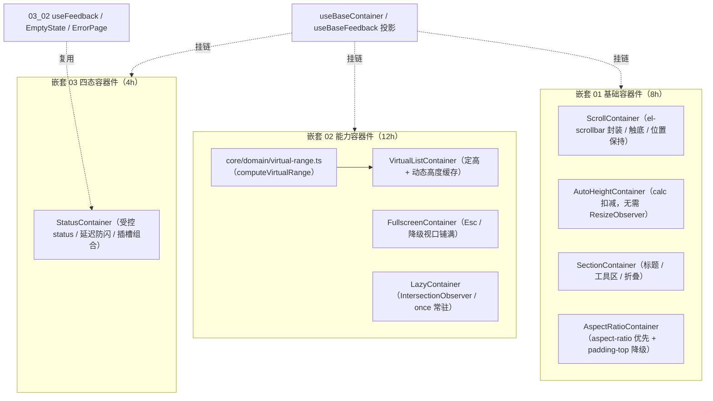

# 01 实施 · 通用容器

> 前端组件库 · 04 容器组件类 · 子任务 01（需求 04-1；含 3 个嵌套子任务）· 实施记录

[文档首页](../../../../../../文档首页.md) › [04 容器组件类](../../04_容器组件类.md) › [01 通用容器](../04_容器组件类_01_通用容器.md) › 实施记录　|　[← 任务](../04_容器组件类_01_通用容器.md)

## 1. 实施信息 

| 项 | 值 |
| --- | --- |
| 任务 | [01 通用容器](../04_容器组件类_01_通用容器.md) |
| 对应需求 | [04-1](../../../../需求/04_需求_容器组件类.md#r04-1) |
| 详细设计 | [01 基础容器件](../设计/01_详细设计_01_基础容器件.md) / [02 能力容器件](../设计/02_详细设计_02_能力容器件.md) / [03 四态容器件](../设计/03_详细设计_03_四态容器件.md) |
| 实施日期 | 2026-09-18 |
| 实施人 | minjian |
| 实施环境 | 本地开发机（Node v24.20.0 / pnpm 11.x，npmmirror） |
| 提交 | 设计 `7bb41d10`；实施 `8ed482a9`（基础）/ `6eb94b18`（能力）/ `d4f3ca64`（四态） |
| 结论 | 完成 |

## 2. 实施概览 

## 3. 实施过程 

### 3.1 嵌套 01 基础容器件（8h） 

1. `ScrollContainer`：封装 `el-scrollbar`（统一自定义滚动条）；`reach-bottom` 以事件载荷 `scrollTop` 为权威判定（阈值可配、离开底部后方可再次触发）；`sessionStorage` 位置保持（`positionKey`，隐私模式降级不抛错）；`native` 走原生滚动。
2. `AutoHeightContainer`：`height: calc(100% - offset)` + `min-height`，不依赖 `ResizeObserver`。
3. `SectionContainer`：标题 / 工具区 / 内容 / 页脚 + 折叠（经 `useBaseContainer` 的 `collapsible` / `collapsed` / `toggleCollapse`），无卡片外观、边框可配。
4. `AspectRatioContainer`：`CSS.supports('aspect-ratio')` 可用则直用，否则降级 `padding-top` + 绝对定位内容；非法比例回退 16/9。
5. 容器链上无 `hidden`（属布局族），四件统一经投影 `sizeToken` / `isCompact` 走令牌属性协议（`data-size` / `data-density`）。

### 3.2 嵌套 02 能力容器件（12h） 

1. **可视区纯函数下沉核心领域层**：`core/src/domain/virtual-range.ts` 提供 `computeVirtualRange`（定高快路径 + 动态高度累计偏移二分定位 + 缓冲夹取 + 空数据零值），框架无关、可单测（设计偏差见 §6）。
2. `FullscreenContainer`：`requestFullscreen` / `fullscreenchange` 状态同步 / Esc 退出；不可用或被拒时降级视口铺满并 `error('unsupported' | 'rejected')`。
3. `LazyContainer`：`IntersectionObserver` 触达渲染；`once` 缺省为真（触达后常驻并断开观察），`once: false` 离屏卸载；能力缺失直接渲染。
4. `VirtualListContainer`：`el-scrollbar` + 占位层（总高 = 定高 × 数量或累计偏移），只渲染可视区 + 缓冲，`visible-change` 回传起止索引；动态高度以测量缓存（`ResizeObserver` 可缺，缺失退化为估算值）。

### 3.3 嵌套 03 四态容器件（4h） 

1. `StatusContainer`：受控 `status`（`loading / ready / empty / error`）经 `useFeedback` 同步反馈状态机；`status-change` 回传。
2. 延迟防闪：仅 `loading` 受 `delay` 约束，`delay` 内转 `ready` 则不显示加载态（生效状态 `resolved`）。
3. 四态口径：内置轻量形态 + 插槽组合（`loading` / `empty` / `error` / `actions` 可传 `03_02` 的 `EmptyState` / `ErrorPage`）；`retryable` 控制重试按钮并派发 `retry`；`keepContent` 时非就绪态内容隐藏但保留挂载。

## 4. 问题与处置 

| # | 问题 / 现象 | 原因 | 处置 |
| --- | --- | --- | --- |
| 1 | 容器件使用 `hidden` 报类型错 | `hidden` 属布局族（`BaseLayout`），容器链无此字段 | 改用 `sizeToken` / `isCompact`（容器基类经 `BaseSized`）走令牌属性协议 |
| 2 | 触底未触发（测试） | 判定读取包裹元素 `scrollTop`，与事件载荷不一致 | 判定改用 `payload.scrollTop`（载荷为权威） |
| 3 | `CSS.supports` 在 jsdom 存在，降级分支不可达 | 环境差异 | 用例以 `vi.stubGlobal('CSS', …)` 双路径覆盖 |
| 4 | 虚拟列表初始只渲染 4 行 | `onMounted` 内 `await nextTick()` 后设置视口高度 | 用例补一次 `nextTick`（断言与实现时序对齐） |
| 5 | `keepContent` 用例期望不符 | 原实现 `v-show="resolved==='ready' || keepContent"` 导致内容仍可见 | 改为「`keepContent` 决定是否挂载、`resolved==='ready'` 决定是否显示」 |

## 5. 验证结果 

| 验证点 | 方法 | 结果 |
| --- | --- | --- |
| 类型检查 / Lint | 根 `pnpm run check`（core / vue / ui-ep） | 通过 |
| 单测（核心） | `core` `pnpm test` | 26 文件 / 143 用例全通过（新增 6：可视区纯函数） |
| 单测（ui-ep） | `pnpm run ui-ep:test` | 16 文件 / 102 用例全通过（新增 15：基础 12 / 能力 8 / 四态 7 − 重叠计 15） |
| 宿主构建 / 体积 | `apps/desktop` `build` / `budget` | 通过；合计 99.4 KB（预算 260 KB） |

## 6. 偏差与遗留 

- **偏差**：可视区纯函数由设计原定 `ui-ep/src/composables/useVirtualRange.ts` 调整为核心领域层 `core/src/domain/virtual-range.ts`（框架无关、双端可复用、可过核心护栏）；已回写详细设计 §2 / §3.4 / §6。
- **遗留**：① 触底加载的数据接入（分页 / 游标）由宿主页面负责，本件只发信号；② 表格 / 树虚拟化复用 `computeVirtualRange` 随展示域 / 树域任务；③ 滚动锚定（锚点补偿）随性能优化任务；④ 滚动位置远端同步随偏好持久化能力就绪。

> 本文档依《[文档生成规范](../../../../../../规范/文档生成规范.md)》编写
