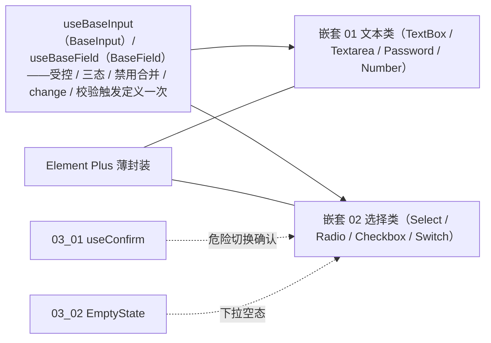

# 01 实施 · 基础控件

> 前端组件库 · 05 基础控件类 · 子任务 01（需求 05-1；含 2 个嵌套子任务）· 实施记录

[文档首页](../../../../../../文档首页.md) › [05 基础控件类](../../05_基础控件类.md) › [01 基础控件](../05_基础控件类_01_基础控件.md) › 实施记录　|　[← 任务](../05_基础控件类_01_基础控件.md)

## 1. 实施信息 

| 项 | 值 |
| --- | --- |
| 任务 | [01 基础控件](../05_基础控件类_01_基础控件.md) |
| 对应需求 | [05-1](../../../../需求/05_需求_基础控件类.md#r05-1) |
| 详细设计 | [01 文本类控件](../设计/01_详细设计_01_文本类控件.md) / [02 选择类控件](../设计/02_详细设计_02_选择类控件.md) |
| 实施日期 | 2026-09-18 |
| 实施人 | minjian |
| 实施环境 | 本地开发机（Node v24.20.0 / pnpm 11.x，npmmirror） |
| 提交 | 设计 `9b7b3883`；实施 `1662b1ea`（文本类）/ `2c66884e`（选择类） |
| 结论 | 完成 |

## 2. 实施概览 

## 3. 实施过程 

### 3.1 嵌套 01 文本类控件（12h） 

1. **投影层**：新增 `useBaseInput`（受控值 / 三态 `isEmpty` / `disabled` 合并 / 清空 / 焦点 / 值订阅）与 `useBaseField`（字段标识 / 校验触发）——四件共用同一口径。
2. `TextInput`：单行文本（前后缀插槽 / 清空 / 字数限制）。
3. `TextareaInput`：多行（`rows` / `autosize` / 字数统计 / 换行保留）。
4. `PasswordInput`：明文切换（`show-password`）/ 强度提示（长度 + 字符类别）/ `autocomplete="new-password"` **不回填**。
5. `NumberInput`：范围 / 步进 / 精度透传，`formatter` 实现千分位显示。

### 3.2 嵌套 02 选择类控件（12h） 

1. `SelectInput`：静态选项（含分组）/ 单选 / 多选 / 本地搜索 / 清空；空态复用 `03_02` `EmptyState`（`#empty` 插槽可覆盖）。
2. `RadioInput`：`radio` / `button` / `segmented` 三形态。
3. `CheckboxInput`：`checkbox` / `tag` 两形态 + 全选（仅作用于可选中的项）+ 数量上下限（越界派发 `invalid` 且**不改值**）。
4. `SwitchInput`：布尔（`undefined` 未设置 / `indeterminate`）/ 加载态 / 危险切换确认（复用 `03_01` `useConfirm`，取消不改值）。
5. 选项类型 `InputOption` / `InputOptionGroup` 统一落 `components/input/types.ts`。

## 4. 问题与处置 

| # | 问题 / 现象 | 原因 | 处置 |
| --- | --- | --- | --- |
| 1 | `el-input-number` 的 `parser` 类型不匹配（要求 `(value: string) => string`） | EP 类型口径与 `formatter` 成对 | 仅保留 `formatter`（千分位显示），不用 `parser` |
| 2 | 测试替身 props 用数组写法触发 `vue/require-prop-types` | 护栏要求显式类型 | 替身 props 改为带 `type` 的对象写法 |
| 3 | `el-radio-group` / `el-checkbox-group` / `el-switch` 回调值类型宽于组件契约 | EP 回传 `string \| number \| boolean` | 组件内包一层归一函数（`onUpdate` / `onToggleAll`），保持对外契约精确 |

## 5. 验证结果 

| 验证点 | 方法 | 结果 |
| --- | --- | --- |
| 类型检查 / Lint | 根 `pnpm run check`（core / vue / ui-ep） | 通过 |
| 单测（ui-ep） | `pnpm run ui-ep:test` | 18 文件 / 120 用例全通过（新增 18：文本 9 / 选择 9） |
| 单测（核心 / 绑定） | `core` / `vue` | 153 / 5 用例通过 |
| 宿主构建 / 体积 | `apps/desktop` `build` / `budget` | 通过；合计 109.2 KB（预算 260 KB） |

## 6. 偏差与遗留 

- **偏差**：无（按两份详细设计实施）。
- **遗留**：① 字段壳组装（label / 必填 / 错误 / 栅格）随字段壳族；② 字典 / 枚举数据源与金额语义随 `06-2` / `06-6`；③ 输入法 composition 与失焦校验时机细化随字段类任务；④ 大选项集虚拟滚动随性能优化任务。

> 本文档依《[文档生成规范](../../../../../../规范/文档生成规范.md)》编写
