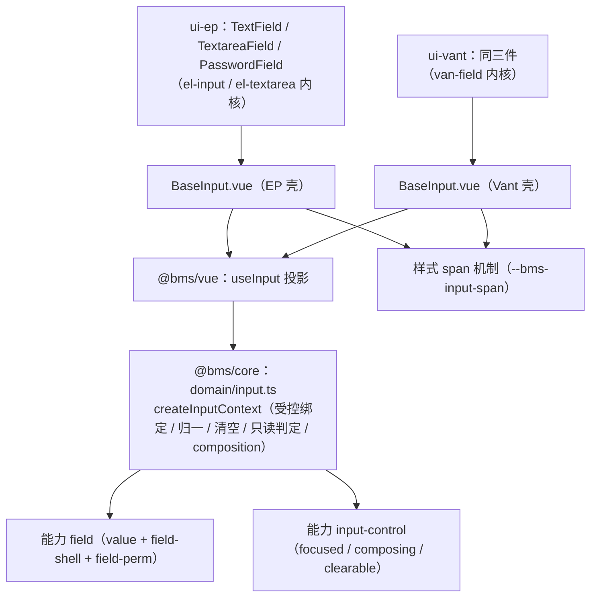

# 01 详细设计 · 输入域口径包装与文本三件

> 前端组件库 · 05 基础控件类 · 子任务 01（`05_01`）详细设计：输入域口径包装（core 域工厂 + Vue 投影 + 双插件包装件）与文本框 / 文本域 / 密码框

[文档首页](../../../../../../文档首页.md) › [05 基础控件类](../../05_基础控件类.md) › [01 输入域口径包装与文本三件](../05_基础控件类_01_输入域口径包装与文本三件.md) › 详细设计

## 1. 依据与确认结论 <a id="basis"></a>

**需求**：[05-1](../../../../需求/05_需求_基础控件类.md#r05-1)（八基础控件第 9 条：统一派生输入域口径包装并组合值·字段链能力）。
**契约依据**：《组件设计》[01_组件设计_文本框](../../../../../../设计/组件设计/05_基础控件类/01_组件设计_文本框/01_组件设计_文本框.md)、[02_组件设计_文本域](../../../../../../设计/组件设计/05_基础控件类/02_组件设计_文本域/02_组件设计_文本域.md)、[03_组件设计_密码框](../../../../../../设计/组件设计/05_基础控件类/03_组件设计_密码框/03_组件设计_密码框.md)（均含可交互原型，原型即验收基准）。
**强制口径**：《[前端开发规范](../../../../../../规范/前端开发规范.md)》「前端基类体系（开放式，强制）」节（§3.1 强制用法 / §3.4 继承与组合分工：域基类 = 核心能力 + 投影 + 插件包装）、§5 Vue 组件规范、§9 样式规范、§10 国际化、§12 测试；《[前端基类清单](../../../../../../前端基类清单.md)》「能力」「域基类（按需）」节。

**逐项确认结论（2026-09-17，用户拍板）**：

| # | 事项 | 结论 |
| --- | --- | --- |
| 1 | 包装落点 | core 域工厂 `domain/input.ts` + `@bms/vue` 投影 `useInput` + 双插件包装件 `BaseInput.vue`（不新增能力 key） |
| 2 | 包装形态 | 壳组件 + 插槽：壳渲染 label / 必填 / 帮助 / 错误 / 栅格，默认插槽放控件本体 |
| 3 | 控件内核 | PC = Element Plus（`el-input` / `el-textarea`）；移动端 = Vant（`van-field` 家族，type=text / textarea / password） |
| 4 | 只读态 | `readonlyMode: 'text' \| 'disabled'`，默认 `text`（纯文本回显 + 空值占位） |
| 5 | 栅格 | 内置 `span`（默认 `24` 整行），传 `span=12` 即一行两列 |
| 6 | 密码强度 | core 纯函数 `domain/password.ts`（规则可配）+ 双插件薄包装 |
| 7 | 契约套件 | 新建 `@bms/core/testing/input.ts`（`describeInputControlsContract`），双端同一套断言 |
| 8 | i18n | 新增宿主 `input` 分组键（zh-CN / en-US 同步；包内不内置 messages） |

**分层与调用链**（新体系）：



## 2. 交付物清单 <a id="deliverables"></a>

```text
frontend/packages/
├── core/
│   ├── src/
│   │   ├── domain/input.ts                       # 输入域工厂：createInputContext + 归一 / 清空 / 只读判定
│   │   ├── domain/password.ts                    # 密码强度纯函数：evaluatePasswordStrength + 默认规则
│   │   └── index.ts                              # 追加导出（域工厂两文件）
│   ├── testing/
│   │   ├── input.ts                              # 契约工厂：describeInputControlsContract
│   │   ├── components.ts                         # ComponentViewHandle 增可选 setValue（输入类契约需要）
│   │   └── index.ts                              # 追加入口
│   └── tests/contracts/input-contract.spec.ts    # 域工厂 + 密码纯函数契约用例
├── vue/
│   └── src/
│       ├── bindings/useInput.ts                  # 输入域投影（createCapability → 域上下文 → 响应式）
│       ├── index.ts                              # 追加导出
│       └── testing/index.ts                      # setValue 适配（结构接口桥接）
├── ui-ep/src/
│   ├── components/input/BaseInput.vue            # 字段壳（label / 必填 / 帮助 / 错误 / 只读回显 / span）
│   ├── components/input/TextField.vue            # el-input 内核
│   ├── components/input/TextareaField.vue        # el-textarea 内核
│   ├── components/input/PasswordField.vue        # el-input type=password + 明文切换 + 强度
│   ├── components/input/index.ts                 # 域出口
│   └── index.ts                                  # 追加域导出
└── ui-vant/src/
    ├── components/input/BaseInput.vue            # 字段壳（Vant 侧同契约）
    ├── components/input/TextField.vue            # van-field（type=text）
    ├── components/input/TextareaField.vue        # van-field（type=textarea + autosize）
    ├── components/input/PasswordField.vue        # van-field（type=password）+ 明文切换 + 强度
    ├── components/input/index.ts                 # 域出口
    └── index.ts                                  # 追加域导出

frontend/apps/
├── desktop/src/i18n/{zh-CN,en-US}.ts             # 追加 input 分组文案
└── mobile/src/i18n/{zh-CN,en-US}.ts              # 追加 input 分组文案

测试：packages/{ui-ep,ui-vant}/tests/{input.spec.ts, contracts-input.spec.ts}
      （各端 `describe('输入域口径包装与文本三件（Kiwi 756）')` 一条用例 + 契约套件调用一行）
```

不改动：`capabilities/manifest.ts`（不新增能力 key）、`tokens.scss`（只消费既有令牌）、`budget.json`（体积不足时按 §14 评审后另议）。

## 3. 接口设计 <a id="api"></a>

### 3.1 core：`domain/input.ts` <a id="api-core-input"></a>

```ts
export type InputMode = 'edit' | 'text' | 'disabled'

export interface InputContextOptions<T = unknown> {
  /** 字段能力实例（缺省经 createCapability('field') 创建——不注册不可用路径） */
  field?: BaseField<T>
  /** 输入形态能力实例（缺省经 createCapability('input-control') 创建） */
  control?: BaseInputControl
  /** field 能力缺省参数（可传 value / shell / perm 选项） */
  fieldOptions?: FieldOptions<T>
  controlOptions?: Omit<InputControlOptions, 'key'>
  /** 提交期去首尾空格（默认 true；密码件传 false） */
  trim?: boolean
  /** 只读呈现方式（默认 'text'） */
  readonlyMode?: 'text' | 'disabled'
  /** 空值归一目标（默认 null） */
  emptyValue?: unknown
  /** 归一钩子（值入 / 出各一次，如换行符统一、数值精度；缺省恒等） */
  normalize?: (value: T) => T
  /** 空值判定覆盖（如「空数组也算空」；缺省用能力空值语义） */
  isEmpty?: (value: T) => boolean
}

export interface InputContext<T = unknown> {
  readonly field: BaseField<T>
  readonly control: BaseInputControl
  /** 受控值（读） */
  read(): T
  /** 受控值（写）：经能力统一写入口（disabled / readonly 拒绝），触发 validate 与 change 上报 */
  write(value: T): void
  /** 归一（trim / 空串 → emptyValue / 自定义 normalize）；失焦、提交前调用 */
  normalizeValue(): T
  /** 清空（control.clearable 为 true 时；写 emptyValue） */
  clear(): void
  /** 展示态：disabled（禁用或权限不可编辑）> readonly（value.readonly）> edit */
  mode(): InputMode
  /** 只读回显文本（空值返回空串，占位文案由壳层给） */
  displayText(): string
  focus(): void
  blur(): void
  compositionStart(): void
  compositionEnd(): void
  dispose(): void
}
```

- `write(value)`：若 `control.composing` 为 true（composition 期间）**直接写入**（值由绑定层在 compositionend 后提交，见能力 `input-control` 约定），否则直接写；`disabled` / `readonly` 由 `BaseField.setValue`（`effectiveDisabled`）与 `BaseValue.setValue`（`readonly`）拦截 —— 域工厂不重复实现门禁。
- `normalizeValue()`：`trim` → 去首尾空格；`'' → emptyValue`（默认 `null`）；再套 `normalize` 钩子（顺序固定，先归一再钩子）。
- `mode()`：`field.effectiveDisabled → 'disabled'`；`field.value.readonly → readonlyMode`；否则 `'edit'`。
- `displayText()`：`read()` 为 `false` / `0` / 空串时不被吞掉（`String(value)`，`null` / `undefined` / `''` → `''`）。

### 3.2 core：`domain/password.ts` <a id="api-core-password"></a>

```ts
export type PasswordStrengthLevel = 'weak' | 'medium' | 'strong'

export interface PasswordStrengthRules {
  /** 最小长度（默认 8） */
  minLength?: number
  /** 强密码最小长度（默认 12） */
  strongLength?: number
  /** 中等强度最小字符类别数（默认 2：小写 / 大写 / 数字 / 符号） */
  mediumClasses?: number
  /** 强密码最小字符类别数（默认 3） */
  strongClasses?: number
}

export interface PasswordStrengthResult {
  level: PasswordStrengthLevel
  /** 0 ~ 4（长度与字符类别综合，供进度条用） */
  score: number
  /** 缺失项（i18n 提示可逐项展示：'length' | 'lower' | 'upper' | 'digit' | 'symbol'） */
  missing: readonly ('length' | 'lower' | 'upper' | 'digit' | 'symbol')[]
}

export function evaluatePasswordStrength(
  value: string | null | undefined,
  rules?: PasswordStrengthRules,
): PasswordStrengthResult
```

判定口径（纯函数、无副作用、不落日志）：空值 → `weak` / `score 0` / `missing` 全列；长度 ≥ `strongLength` 且类别 ≥ `strongClasses` → `strong`；长度 ≥ `minLength` 且类别 ≥ `mediumClasses` → `medium`；否则 `weak`。

### 3.3 `@bms/vue`：`bindings/useInput.ts` <a id="api-vue"></a>

```ts
export interface UseInputReturn<T = unknown> {
  instance: InputContext<T>
  value: ShallowRef<T>
  error: ShallowRef<string>
  focused: ShallowRef<boolean>
  composing: ShallowRef<boolean>
  mode: ComputedRef<InputMode>
  disabled: ComputedRef<boolean>
  required: ComputedRef<boolean>
  setValue: (value: T) => void
  normalize: () => void
  clear: () => void
  focus: () => void
  blur: () => void
  compositionStart: () => void
  compositionEnd: () => void
}

export function useInput<T = unknown>(options?: InputContextOptions<T>): UseInputReturn<T>
```

- 内部 `createInputContext(options)`；`value` 订阅 `field.value.onChange`，`error` 订阅 `field.shell.error`，`focused` / `composing` 订阅 `input-control` 的 `focused` / `composing`；`getCurrentScope()` 时 `onScopeDispose` 退订 + `dispose`（沿用 `useField` / `useValue` 范式）。
- `setValue` 写值后 `normalize` 不在其中（归一由失焦 / 提交触发，避免输入过程中被 trim 干扰光标）。

### 3.4 包装件 `BaseInput.vue`（双插件各一份，同契约） <a id="api-shell"></a>

| props | 类型 | 默认 | 说明 |
| --- | --- | --- | --- |
| `modelValue` | `unknown` | `null` | 受控值 |
| `label` | `string` | `''` | 字段标签 |
| `required` | `boolean` | `false` | 必填（星号 + 校验） |
| `help` | `string` | `''` | 帮助文案 |
| `error` | `string` | `''` | 外部错误文案（内部校验错误优先展示内部） |
| `disabled` | `boolean` | `false` | 禁用（与权限不可编辑合并） |
| `readonly` | `boolean` | `false` | 只读 |
| `readonlyMode` | `'text' \| 'disabled'` | `'text'` | 只读呈现方式 |
| `size` | `'small' \| 'default' \| 'large'` | `'default'` | 档位（写根元素 `data-size`，由组件根协议产出） |
| `density` | `'default' \| 'compact'` | `'default'` | 密度（写 `data-density`） |
| `span` | `number` | `24` | 栅格（24 制；`< 24` 时根元素挂 `--bms-input-span` 与 `is-inline` 类） |
| `trim` | `boolean` | `true` | 失焦 / 提交前归一（透传给域上下文） |

| 默认插槽参数 | 说明 |
| --- | --- |
| `disabled` / `readonly` / `size` | 控件应施加的态（已合并权限与只读） |
| `value` / `setValue` | 受控值与写入口（控件 `v-model` 用） |
| `onFocus` / `onBlur` / `onCompositionStart` / `onCompositionEnd` | 事件桥接（写 `input-control` 能力 + 失焦归一） |
| `invalid` | 是否处于错误态（控件可据此加 `is-error` 类） |

| emits | 说明 |
| --- | --- |
| `update:modelValue` | 归一后的值（控件写入时即上报；最终归一在失焦 / 提交） |
| `change` | 归一后的值变化（失焦 / 提交时上报，供表单收集） |
| `validate` | `boolean`（必填 / 长度 / 正则等校验结果） |

DOM 结构（双端同构，类名由 `nsClass` 产出）：

```text
.bms-input[.is-inline][data-size][data-density][style="--bms-input-span:12"]
├── label.bms-input-label            # 可选：label 为空则不渲染
│   └── span.bms-input-required      # required 时渲染
├── .bms-input-control               # 编辑态：默认插槽；只读 text 态：.bms-input-text（纯文本 / 空值占位）
├── .bms-input-help                  # 可选
└── .bms-input-error                 # 有错误时渲染（role="alert"）
```

## 4. 行为、边界与失败分支 <a id="behavior"></a>

| 项 | 设计 |
| --- | --- |
| 受控与三态 | 受控读写经域工厂；未设置（`undefined`）/ 空（`''` / `null`）/ 已填由能力空值语义区分；`0` / `false` 视为已填（不被空值判定吞掉） |
| 归一 | 文本：`trim` 默认 true、空串 → `null`；文本域：换行统一 `\n`（`normalize` 钩子）；密码：**不 trim**（保留空格）、空串 → `null` |
| composition | `compositionstart` / `compositionend` 写 `input-control`；期间输入不提交归一中止（域工厂按能力标志放过写入） |
| 长度与计数 | `maxlength` 由内核截断（EP / Vant 原生属性）；`showWordLimit` 渲染 `input.wordLimit`（`{count}/{max}`）；`minlength` / `pattern` 校验失败 → `validate(false)` + 壳错误文案 |
| 文本域高度 | `rows` 默认 3；`autosize`（`boolean \| { minRows, maxRows }`）交由内核（EP `autosize` / Vant `autosize`）；`maxRows` 缺省时不限 |
| 密码安全 | 明文切换仅组件内 `ref` 内存态；值不写 `console` / 不落 `localStorage`；`noAutofill` 时 `autocomplete="new-password"`；**不回填**（组件不主动拉取历史值，由使用方决定初值） |
| 密码强度 | `strength` 为 true 时按 `evaluatePasswordStrength` 渲染 `level` 与缺失项提示（文案 `input.password.{level}`）；`< minLength` → `validate(false)` |
| 只读回显 | `mode === 'text'`：不渲染输入元素，渲染 `.bms-input-text`（空值显示 `input.emptyText`）；`readonlyMode === 'disabled'`：渲染输入元素并加 `disabled` |
| 禁用合并 | `disabled` prop 或字段权限不可编辑（`effectiveDisabled`）→ 控件 `disabled`；写值被能力拒绝（值不变、不发 `change`） |
| 脱敏 | `mask`（默认 false）：`mode === 'text'` 时按规则掩码（保留首尾各 1~3 位，中间 `*`）；`:plain`（默认 false）为 true 时显示明文（列表 / 详情默认掩码，显式查看明文） |
| 栅格 | `span` 语义 24 制：`span < 24` → 根元素 `style="--bms-input-span:<n>"` + `is-inline` 类（样式 `width: calc(var(--bms-input-span) / 24 * 100%)`，`ui-vant` 无 `GridCol`，故两端统一走 CSS 变量机制，语义与 `GridCol` 的 24 制对齐） |
| 失败分支 | 值为 `null` 时归一不报错；`pattern` 正则非法（编译失败）→ 跳过正则校验并告警一次（不阻断输入）；内核缺失（EP / Vant 未安装）→ 组件挂载期告警并降级渲染原生元素（防白屏） |
| 格式化复用 | 展示格式化（金额 / 日期等）不属本任务；文本三件只做 `displayText` 直出（字段类按需接格式化能力） |

## 5. 测试设计与验收映射 <a id="test"></a>

**契约工厂（`@bms/core/testing/input.ts`）**：`describeInputControlsContract(kit)` 断言集（`ui-ep` / `ui-vant` 各跑一遍，同一套断言）：

| # | 断言 | 对应设计节点 |
| --- | --- | --- |
| 1 | 三件根类名钩子（`bms-text-field` / `bms-textarea-field` / `bms-password-field`）+ `bms-input` 壳存在 | 继承链 / nsClass 契约 |
| 2 | `TextField`：输入触发 `update:modelValue`；`maxlength` 截断；`showWordLimit` 计数文案 | 文本框 §3 / §4 |
| 3 | `TextField`：失焦归一（`trim` 去空格、空串 → `null`）与 `change` 上报 | 文本框 §4 归一 |
| 4 | `TextareaField`：多行元素渲染 + `rows` + 换行保留 | 文本域 §3 / §4 |
| 5 | `PasswordField`：`type=password`；明文切换后 `type=text`；`autocomplete="new-password"` | 密码框 §3 / §4 |
| 6 | `PasswordField`：`strength` 渲染强度提示；`minLength` 不满足 → `validate(false)` | 密码框 §4 |
| 7 | 字段壳：`label` / 必填星号 / `help` / `error` 渲染 | 完成标准（字段壳可装配） |
| 8 | 只读：`readonly` + 默认 `text` 时纯文本回显（不渲染输入元素）；`readonlyMode="disabled"` 时输入元素 `disabled` | 只读态口径 |
| 9 | 禁用合并：`disabled` 时不触发 `update:modelValue` | 域工厂门禁 |
| 10 | `span=12` 时根元素含 `--bms-input-span:12` | 栅格口径 |

`ComponentViewHandle` 新增可选 `setValue(selector, value)`（`@bms/vue/testing` 用 `@vue/test-utils` 的 `setValue` 适配），供输入类契约使用。

**用例与 Kiwi**：本任务登记 **1 条**用例（预计 Kiwi **756**，双端同号，先登记后编码），覆盖上表断言；`ui-ep` / `ui-vant` 各一份 `input.spec.ts`（`describe('输入域口径包装与文本三件（Kiwi 756）')`）+ 各一份 `contracts-input.spec.ts` 调用契约工厂；core 侧 `input-contract.spec.ts` 覆盖域工厂（归一 / 清空 / 只读判定 / 写门禁）与密码强度纯函数（四类判定 + 边界）。

**验收映射**：需求 05-1「受控与三态行为一致」→ 断言 2/9；「字段壳可装配」→ 7/8/10；「密码不落日志 / 不回填」→ 5/6（用例中以 `vi.spyOn(console, 'log')` 断言未被调用）；「Vitest 覆盖八件关键契约」→ 本任务覆盖文本三件（其余五件随 `05_02` / `05_03`）。

**门禁命令**：`npm run -w @bms/core|@bms/vue|@bms/ui-ep|@bms/ui-vant {typecheck,lint,test}` + 根 `npm run check`；双宿主 `npx prettier --check <本任务文件>`、`npm run lint`、`npx vue-tsc -b`、`npm run test:cov`、`npm run build` + `npm run budget`。

## 6. 登记落点 <a id="registry"></a>

| 登记项 | 目标文档 / 位置 | 内容 |
| --- | --- | --- |
| 输入域包装已重建 | 《[前端基类清单](../../../../../../前端基类清单.md)》「域基类（按需）」节「输入域」行 | 状态由「能力已交付；域包装待重建」→「已重建（`05_01`）：core 域工厂 + `useInput` 投影 + 双插件 `BaseInput` 包装」 |
| 继承链与提供方 | 《[前端开发规范](../../../../../../规范/前端开发规范.md)》「前端基类体系（开放式，强制）」节（§3.1 / §3.4 落点表） | 明确 `text` / `textarea` / `password` 由域 05 基础控件类提供，经输入域口径（`field` + `input-control`）取得契约 |
| 字段类型与属性 | 《[概要设计 · 表单定制](../../../../../../设计/概要设计/36_概要设计_表单定制.md)》「组件类型」节 | `text` / `textarea` / `password` 属性与默认值（长度 / 正则 / 行数 / 强度规则） |
| 只读回显 | 《[布局设计 · 表单页](../../../../../../设计/布局设计/08_布局设计_表单页.html)》「字段与校验」节 | 短文本 / 长文本只读回显（纯文本 + 空值占位，可配 disabled） |
| 密码安全口径 | 《[安全开发规范](../../../../../../规范/安全开发规范.md)》「前端敏感信息」节 | 不回填 / 明文仅内存 / 不落日志与存储 / 禁自动填充 |
| 组件导出与域目录 | 各插件 `src/index.ts` + `src/components/input/index.ts` | 域 05 首批件导出（后续 `05_02` / `05_03` 追加） |
| 契约套件 | `@bms/core/testing` 出口 | 新增 `describeInputControlsContract`（控制类契约，供域 06 字段类延伸） |

## 7. 边界与开放项 <a id="open"></a>

- **不含**：字典 / 枚举 / 金额 / 日期等带数据源或格式语义的字段（归域 06，经选项源能力 `option-source`）；脱敏权限来源（`field-perm` 元数据随后端接入）；表单容器级校验汇总（`BaseFormContainer` 已有，接入随表单页任务）。
- **占位语义**：字段权限（`field-perm`）默认 `visible` / `editable` 为真（无元数据来源时全放开），与后端 Null 占位模式一致；接入点已就位。
- **性能**：文本件无重计算；密码强度计算在输入时同步执行（纯函数，字符串长度级），如后续引入复杂规则再去抖。
- **开放项**：① 脱敏规则是否按字段类型细分（手机号 / 身份证 / 邮箱）——本任务先做「保留首尾 + 中间掩码」通用规则，细分随字段类评估；② 移动端密码强度展示形态（文本 + 色块）与真机核对随 `05_04` 收口；③ `showWordLimit` 超限文案（当前 `{count}/{max}`）是否改为「已超出」提示，随后续评审。

## 8. 对齐记录 <a id="alignment"></a>

| # | 事项 | 说明 |
| --- | --- | --- |
| 1 | 包装落点 | 设计节点原文为「原 `BaseInput` 域包装按『核心能力 + 投影 + 插件包装』随域 05+ 重建」；本设计落 `core/domain/input.ts`（不新增能力 key），与 §3.4「域基类」落点表一致 |
| 2 | 栅格实现 | 确认结论为「内置 `span`，语义对齐 `GridCol`」；实施细化：因 `ui-vant` 无 `GridCol`，两端统一走 `--bms-input-span` CSS 机制（24 制语义与 `GridCol` 一致），避免双端 DOM 不对称 |
| 3 | 密码强度落点 | 设计节点原文写「`usePasswordStrength.ts`（组件内工具，不占能力 key）」；按确认结论改落 core 纯函数 `domain/password.ts`（不占能力 key、双端同规则），插件层只做薄包装 |
| 4 | 契约套件扩展 | `ComponentViewHandle` 新增可选 `setValue`（输入类契约必需）；为向后兼容的可选方法，既有容器 / 反馈件契约不受影响 |
| 5 | 实施细化：`useInput` 增 `commit()` | 归一 + 写回 + 失焦一步完成（壳在失焦 / 提交前调用）并返回提交值；域工厂 `normalizeValue()` 语义不变 |
| 6 | 实施细化：写入链路（关键） | 控件写入一律经壳的 `slot.setValue` → 域统一写入口（禁用 / 只读拒绝）→ 域变化再外发 `update:modelValue`；**禁止件内直接 emit 值**（否则域不更新，受控 / 归一 / 门禁全部失效——实施期已踩到并修正） |
| 7 | 实施细化：脱敏规则 | 只读文本态掩码 = 保留首尾各 1 位、中间 `*`（长度 ≤ 2 时全掩码）；`plain` 为真显示明文 |
| 8 | 实施细化：换行归一落 `TextareaField` 件内 | 域工厂 `normalize` 选项保留供字段类使用；壳不透传函数类型 prop——`modelValue?: unknown` + `withDefaults` 会致 vue-tsc `TS2322`（Vue 宏把 `unknown` prop 推断为函数形态），故壳的 `modelValue` 用显式联合类型 `string \| number \| boolean \| null` |
| 9 | 实施细化：i18n 键 | 仅落 `input.required` / `input.emptyText` / `input.password.{weak,medium,strong,show,hide}`；字数计数沿用内核文案（EP / Vant 自带 `n / max`），未新增 `input.wordLimit` |
| 10 | 实施细化：字段壳 ↔ 控件通道 | 不引入 `provide` / `inject`，改用默认插槽作用域参数；已回写《前端基类清单》「上下文机制（非能力）」条 |
| 11 | 实施细化：只读 `disabled` 模式 | 壳只切「文本态 / 控件态」，控件 `disabled` 由件层按 `slot.disabled` 施加（契约断言以插槽探针验证控件区渲染） |

> 本文档依《[文档生成规范](../../../../../../规范/文档生成规范.md)》编写
