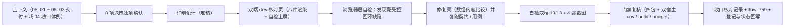

# 01 实施 · 双端收口与核对

> 前端组件库 · 05 基础控件类 · 子任务 04（`05_04`）实施记录（域 05 收官）

[文档首页](../../../../../../文档首页.md) › [05 基础控件类](../../05_基础控件类.md) › [04 双端收口与核对](../05_基础控件类_04_双端收口与核对.md) › 实施记录

## 1. 实施信息 

| 项 | 值 |
| --- | --- |
| 任务 | [05_04 双端收口与核对](../05_基础控件类_04_双端收口与核对.md) |
| 对应需求 | [05-1](../../../../需求/05_需求_基础控件类.md#r05-1) |
| 详细设计 | [01 详细设计 · 双端收口与核对](../设计/01_详细设计_04_双端收口与核对.md) |
| 收口核对记录 | [02 收口核对 · 基础控件类](../../测试/02_收口核对_基础控件类.md) |
| 实施日期 | 2026-09-17 |
| 实施人 | minjian |
| 实施环境 | 本机 Ubuntu；`bms/frontend`（dev server 5173 / 5174）+ Chromium headless（`/snap/bin/chromium`）；Vitest（jsdom） |
| 提交 | `feat`：`283bf954`（核对页 + 壳受控回环修复）；`docs`：本轮记录与登记提交 |
| 结论 | 完成（双端自检 13/13 全绿；8 节点对照达标；门禁全套通过；Kiwi 759 用例登记） |

## 2. 实施概览 

结果小结：域 05 八件在**浏览器层**完成跨件一致性自检（受控写入 / 三态 / 写门禁 / `change` / 校验触发 / 壳装配 / 只读两态 / 栅格 / 清空入口 / 危险确认，共 13 项，双端同一套断言全部通过）；8 节点原型逐项对照达标；`05_01` ~ `05_03` 遗留项关闭 6 项、归口 3 项（真机与页面任务）；**发现并修复 1 项组件缺陷**（壳受控回写数组引用比较导致 `v-model` 回环），双端既有用例零回归。

## 3. 实施过程 

1. **上下文**：读 `05_04` 任务文档、域 04 收口核对记录（体例）、`05_01` ~ `05_03` 实施记录 §6 遗留项、域 04 核对页资产（`containers-check` 范式）。
2. **决策确认**：8 项待拍板事项逐项确认（核对方式 / 落点 / 覆盖范围 / 截图口径 / 自检项集合 / 原型对照深度 / 门禁范围 / 真机项处置）。
3. **详细设计**：落 `设计/01_详细设计_04_双端收口与核对.md`（定稿）。
4. **核对页**：新建双端 `inputs-check.html` + `src/dev/{InputsCheck.vue,inputsCheck.ts}`（同域 04 范式，双端同接口多实现；`vite build` 不包含）：八件编辑态 / 只读态 / 只读禁用态 / 禁用态实例 + 壳装配与栅格样例 + 遗留项样例；`?stage=2` 自动写值与交互；自检结果逐条上屏（✅ / ❌ / ⏳），末尾复位滚动以便截图。
5. **浏览器层自检**：首轮出现 `Maximum recursive updates exceeded`（`update:modelValue` 计数 208）→ 定位为**壳受控回写引用比较**（多值件回写新数组）→ 修复双端 `BaseInput.vue`（`isSameValue`：数组按内容比较）→ 复跑双端 111 / 112 用例零回归；自检转为分步容错（单步异常不再吞掉全部结果）；修复后 `update` 计数 8（正常）。
6. **断言复核**：`--dump-dom` 逐项读取自检文本，双端均 **13/13** ✅（清空图标在 EP / Vant 均需「有值 + 聚焦」，移动端确认 `clearTrigger` 默认 `focus` 且件未透传该 prop → 改为聚焦触发）。
7. **截图**：Chromium headless 生成 4 张（PC 首屏 / PC 交互后 / 移动端首屏 / 移动端交互后，存 `测试/资源/收口核对/`）；headless 下「窗口高度 < 页面高度」会输出空白、聚焦会引发延迟滚动 → 采用「全页高度 + 二次复位滚动」；原计划第 5 张特写在 headless 下不稳定，关键件形态由移动端交互后全页覆盖（已在核对记录说明）。
8. **门禁复核**：四包 `npm run check` 全绿；双宿主 `prettier --check`（本域文件）/ `lint` / `vue-tsc -b` / `test:cov`（85.6 / 88.46）/ `build` + `budget`（214.1 / 131.6 KB）全通过。
9. **Kiwi 登记**：先登记后编码，回读编号 **759**（双端同号）；台账回填编号。
10. **登记与状态回写**：收口核对记录（八件逐项 + 8 节点对照 + 关闭清单 + 门禁实测值）；父任务与计划（§1 / §2 / §3 / §4 / §5）、阶段 README、需求总览、`文档首页`；《前端基类清单》输入域与继承链终稿核对。

## 4. 问题与处置 

| # | 问题 / 现象 | 原因 | 处置与落点 |
| --- | --- | --- | --- |
| 1 | 核对页 `Maximum recursive updates exceeded`，`update:modelValue` 计数 208 | 壳 `BaseInput` 受控回写用引用比较；复选（多值）回写恒为新数组 → 「父 v-model 写回 → 壳写域 → 外发 → 再写回」无限回环 | 双端 `BaseInput.vue` 增 `isSameValue`（数组按内容比较）后再决定写域；**属组件缺陷，已修复**（回写设计 §8 与核对记录 §3） |
| 2 | 单点异常导致自检结果整体为空（上屏「共 0 项」） | `runChecks` 串行执行，中途抛错即中断 | 写值 / 失焦分步 `try/catch` + 异常汇总上屏（容错继续）；`onMounted` 兜底捕获 |
| 3 | 移动端清空图标自检为 ❌ | Vant `clearTrigger` 默认 `focus`（需聚焦才渲染），且件未声明 / 透传该 prop（`clear-trigger="always"` 无效） | 改为「聚焦 + 等两帧」后判定（EP / Vant 共同口径）；移除无效 prop（回写设计 §8） |
| 4 | 截图首屏 / 特写出现整片空白 | headless 下「窗口高度 < 页面高度」输出空白；`focus()` 引发的延迟滚动使视口停在页面中部 | 截图采用「≥ 页面高度」窗口 + 自检末尾**二次复位滚动**（`scrollTo` → rAF → `scrollTo`）；第 5 张特写不再单独生成（由移动端交互后全页覆盖） |
| 5 | 危险确认弹窗遮挡「交互后」截图 | 取消点击后弹窗关闭动画未结束 | 等 500ms 后断言，并在断言后清理弹窗 DOM 残留（仅核对页用） |
| 6 | 核对页 `vue-tsc` 报未使用 ref | 声明了 `dangerRef` 但改用 DOM 点击 | 移除未使用声明（实施疏漏） |

## 5. 验证结果 

| 验证项 | 命令 / 方式 | 实测结果 |
| --- | --- | --- |
| 跨件一致性自检（双端） | 核对页 `?stage=2` + `--dump-dom` | **双端各 13/13 ✅**（受控写入 8/8、三态 3 项、写门禁 8/8、`change` 7、校验 空 `false` / 已填 `true`、壳装配、只读两态、栅格、清空入口、危险确认） |
| 四包类型 / lint / 用例 | `npm run check` | core 91 / vue 13 / ui-ep 111 / ui-vant 112 全绿 |
| PC 宿主 | `lint` / `vue-tsc -b` / `test:cov` / `build` + `budget` | 通过；77 用例；语句 85.6 / 分支 75.06 / 函数 86.11 / 行 85.75；214.1 KB（预算 240）、最大 110.2 KB（预算 120） |
| 移动端宿主 | 同上 | 通过；63 用例；语句 88.46 / 分支 76.23 / 函数 89.77 / 行 88.14；131.6 KB（预算 140）、最大 52.2 KB（预算 83） |
| 截图证据 | Chromium headless | 4 张（PC 首屏 / PC 交互后 / 移动端首屏 / 移动端交互后）存 `任务/05_基础控件类/测试/资源/收口核对/` |
| 文档校验 | `check-base.py` / `check-links.py` / `check-status.py --stage 04_前端组件库 --strict` | 基座与链接通过；状态检查硬 0 / 软 0 |

## 6. 偏差与遗留 

**偏差（已回写设计 §8 与核对记录）**：核对页自检分步容错；清空图标判定改为「聚焦 + 等帧」；截图采用全页高度 + 二次复位滚动；弹窗关闭等待延长并清理残留；第 5 张特写不单独生成（由移动端交互后全页覆盖）；**壳受控回写改为内容比较（缺陷修复）**。

**遗留（含归口）**：

| # | 遗留 | 归口 |
| --- | --- | --- |
| 1 | 移动端真机特异性（软键盘类型与弹出、触控尺寸实测、惯性滚动、下拉面板键盘避让） | 环境不可及 → 页面任务 / 移动端任务 |
| 2 | 移动端 `segmented` 自绘按钮组观感微调 | 页面任务（按真实设计稿复看） |
| 3 | 移动端数字框步进长按连续步进 | 页面 / 移动端任务评估 |
| 4 | 字段类继承与格式化（字典 / 枚举 / 金额 / 百分比） | `06_2` / `06_6` |
| 5 | 字段权限元数据（`visible` / `editable` 随后端下发） | 认证 / RBAC 阶段 |

> 本文档依《[文档生成规范](../../../../../../规范/文档生成规范.md)》编写
