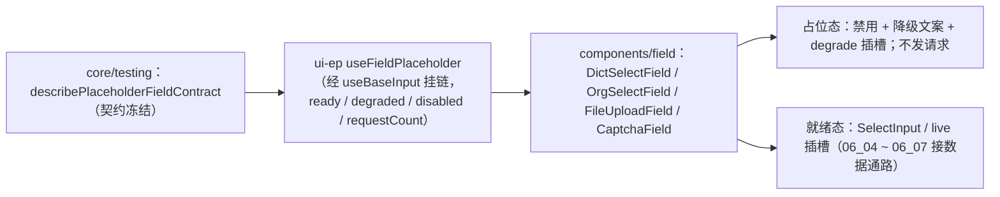

# 01 实施 · 占位版交付

> 前端组件库 · 06 字段类 · 子任务 01（需求 06-1）· 实施记录

[文档首页](../../../../../../文档首页.md) › [06 字段类](../../06_字段类.md) › [01 占位版交付](../06_字段类_01_占位版交付.md) › 实施记录　|　[← 任务](../06_字段类_01_占位版交付.md)

## 1. 实施信息 

| 项 | 值 |
| --- | --- |
| 任务 | [01 占位版交付](../06_字段类_01_占位版交付.md) |
| 对应需求 | [06-1](../../../../需求/06_需求_字段类.md#r06-1) |
| 详细设计 | [01 详细设计](../设计/01_详细设计_01_占位版交付.md) |
| 实施日期 | 2026-09-18 |
| 实施人 | minjian |
| 实施环境 | 本地开发机（Node v24.20.0 / npm 11.19.0，npmmirror） |
| 提交 | 设计 `1a091e22` 后追加；实施 `80a8713d` |
| 结论 | 完成 |

## 2. 实施概览 

## 3. 实施过程 

1. **占位契约套件**：`@bms/core/testing` 新增 `describePlaceholderFieldContract`（未就绪 → 降级 + 禁用 + 零请求、`load()` 仍零；就绪 → 不再降级），供四件占位与后续真实实现共用。
2. **占位组合式**：`useFieldPlaceholder`（经 `useBaseInput` 挂链）：`ready` / `degraded` / `disabled`（件级禁用 ∨ 占位）/ `requestCount`（仅就绪后计数）/ `setReady` / `markLoaded` / 受控值。
3. **四件占位组件**（`components/field/`，与真实实现同名同契约）：`DictSelectField` / `OrgSelectField`（就绪后渲染 `SelectInput`，`options` 由 `06_06` / `06_05` 填充）、`FileUploadField`（`live` 插槽 + 列表移除）、`CaptchaField`（`image` / `slider` / `sms` 形态与 `refresh` / `send`）。
4. 统一输出 `data-ready` / `data-degraded`；`degrade` 插槽可替换降级内容；占位态一切交互禁用且**不产生后端请求**。

## 4. 问题与处置 

| # | 问题 / 现象 | 原因 | 处置 |
| --- | --- | --- | --- |
| 1 | 就绪态用例报 `[ElOption] usage` | 测试仅替身 `ElSelect`，`ElOption` 仍为真实组件（缺注入） | 用例一并替身 `ElOption` / `ElOptionGroup` |
| 2 | 组合式未导出（类型报错） | 导出锚点与既有块不匹配 | 在 `useBaseInput` 导出块前插入 `useFieldPlaceholder` 导出 |

## 5. 验证结果 

| 验证点 | 方法 | 结果 |
| --- | --- | --- |
| 类型检查 / Lint | 根 `npm run check`（core / vue / ui-ep） | 通过 |
| 单测（契约 + 组件） | `npm run ui-ep:test` | 19 文件 / 128 用例全通过（新增 8） |
| 单测（核心 / 绑定） | `core` / `vue` | 153 / 5 用例通过 |
| 文档校验 | `check-links.py` | 0 断链 |

## 6. 偏差与遗留 

- **偏差**：无（按详细设计实施）。
- **遗留**：① 真实数据通路随 `06_04` ~ `06_07`（不得改对外契约）；② 字段壳组装随字段壳族；③ 验证码滑块轨迹与限流细节随后续认证与安全能力。

> 本文档依《[文档生成规范](../../../../../../规范/文档生成规范.md)》编写
