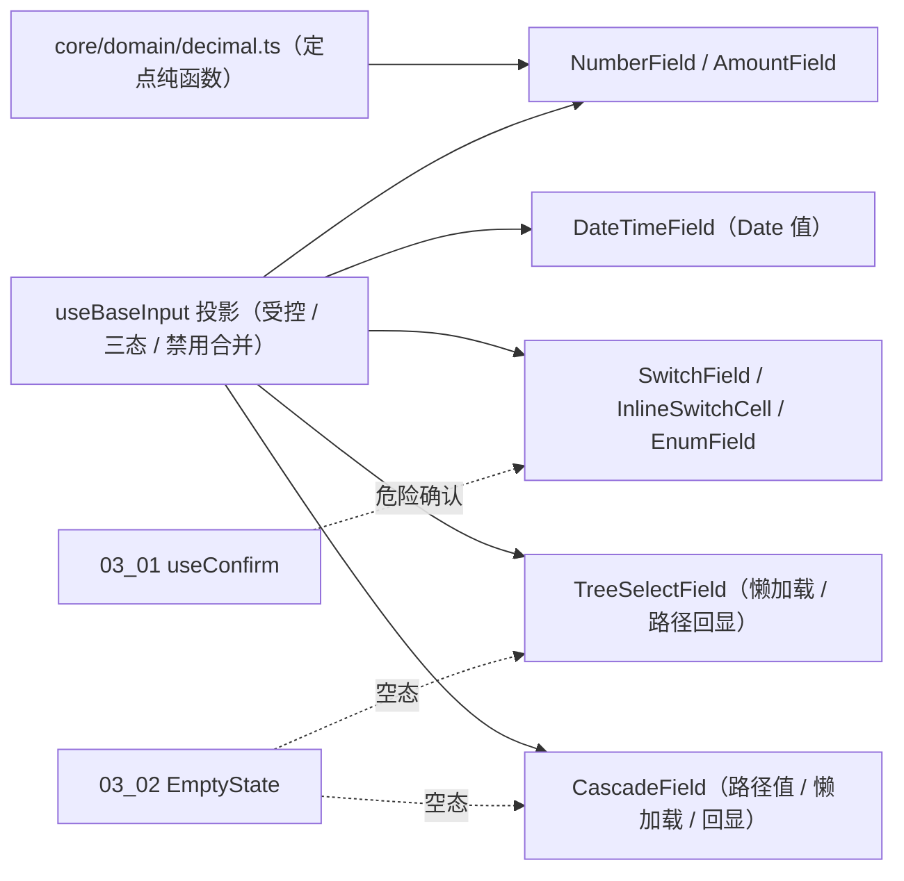

# 02 实施 · 基础与数据源字段

> 前端组件库 · 06 字段类 · 子任务 02（需求 06-2；含 5 个嵌套子任务）· 实施记录

[文档首页](../../../../../../文档首页.md) › [06 字段类](../../06_字段类.md) › [02 基础与数据源字段](../06_字段类_02_基础与数据源字段.md) › 实施记录　|　[← 任务](../06_字段类_02_基础与数据源字段.md)

## 1. 实施信息 

| 项 | 值 |
| --- | --- |
| 任务 | [02 基础与数据源字段](../06_字段类_02_基础与数据源字段.md) |
| 对应需求 | [06-2](../../../../需求/06_需求_字段类.md#r06-2) |
| 详细设计 | [01 日期时间](../设计/01_详细设计_01_日期时间字段.md) / [02 数值与金额](../设计/02_详细设计_02_数值与金额字段.md) / [03 开关与枚举](../设计/03_详细设计_03_开关与枚举字段.md) / [04 树选择](../设计/04_详细设计_04_树选择字段.md) / [05 级联选择](../设计/05_详细设计_05_级联选择.md) |
| 实施日期 | 2026-09-18 |
| 实施人 | minjian |
| 实施环境 | 本地开发机（Node v24.20.0 / npm 11.19.0，npmmirror） |
| 提交 | 日期时间 `4a520c9d`；数值与金额 `f83978ac`；开关与枚举 `56760fee`；树选择 `5bcf38ca`；级联 `3da03c05` |
| 结论 | 完成 |

## 2. 实施概览 

## 3. 实施过程 

1. **日期时间字段**（6h）：`DateTimeField` 四形态，**值用 `Date` 对象**；区间顺序 / `min` / `max` / 必填校验 → `invalid`；`errorMessage` 外部覆盖。
2. **数值与金额字段**（6h）：核心新增**十进制定点纯函数** `core/src/domain/decimal.ts`（`normalizeDecimal` / `compareDecimal` / `isDecimalInRange` / `toMinorUnits` / `fromMinorUnits`，字符串 + BigInt，无浮点，大数不失真）；`NumberField`（精度归一 / 范围）、`AmountField`（**十进制字符串（元）+ `precision` 0~6**，支持厘 / 毫；千分位与币种展示）。
3. **开关与枚举字段**（6h）：`SwitchField`（三态 `undefined` + 必填 + 危险确认复用 `03_01`）、`InlineSwitchCell`（`save(value) => Promise<void>`，保存中禁用、**失败回滚 + `invalid`**）、`EnumField`（自定义选项集；`select` / `radio` / `button` 三形态；选项集外值告警、空选项降级）。
4. **树选择字段**（6h）：`TreeSelectField`（单选 / 多选、`checkStrictly`、本地树与 `lazy` + `load` 懒加载、搜索、**只读路径回显**、空态复用 `EmptyState`、懒加载失败 → 错误态 + `retry`、必填与「选项不在树中」校验）。
5. **级联选择**（6h）：`CascadeField`（**路径数组值**，单选 / 多选路径数组；`checkStrictly` 任意级可选；`lazy` + `load` 懒加载；只读路径回显含未加载路径降级；空态与校验同上）。
6. 五件均经 `useBaseInput` 挂链，校验统一「组件内校验 + `invalid` + `errorMessage` 覆盖」，与 `06_01` 占位契约口径一致。

## 4. 问题与处置 

| # | 问题 / 现象 | 原因 | 处置 |
| --- | --- | --- | --- |
| 1 | `.ts` 用例误用 JSX | 测试文件非 `.tsx` | 替身改 template 写法 |
| 2 | 内置 `invalid` 初始态未派发 | `watch` 无 `immediate` | 校验 `watch` 加 `immediate: true` |
| 3 | 容器链无 `hidden`（同类） | 容器链属 `BaseSized` | 字段链经 `useBaseInput`，无 `hidden` 依赖 |
| 4 | 金额精度误判（去尾零当超精度） | 以 `normalize !== raw` 判定 | 改为按小数位长度判定 |
| 5 | `el-tree-select` / `el-cascader` 加载与选项类型不匹配 | EP 的 `LoadFunction` / `CascaderOption` 类型严格 | 按 EP 签名实现（`resolve` / `reject`）并对选项做类型适配 |
| 6 | 树 / 级联错误态被空值分支短路 | 校验顺序 | 错误态优先判定 |
| 7 | 「不在树 / 级联中」用例时序 | 微任务未刷新 | 用例以真实定时器冲刷 |

## 5. 验证结果 

| 验证点 | 方法 | 结果 |
| --- | --- | --- |
| 类型检查 / Lint | 根 `npm run check`（core / vue / ui-ep） | 通过 |
| 单测（核心） | `core` `npm test` | 29 文件 / 160 用例全通过（新增 7：定点纯函数） |
| 单测（ui-ep） | `npm run ui-ep:test` | 24 文件 / 156 用例全通过（新增 28） |
| 文档校验 | `check-links.py` | 0 断链 |

## 6. 偏差与遗留 

- **偏差**：无（按五份详细设计实施）。
- **遗留**：① 远程搜索与业务数据源（组织 / 字典）随 `06_05` / `06_06`；② 时区展示口径的宿主级配置；③ 字段壳（label / 必填 / 错误 / 栅格）组装随字段壳族；④ 批量内联编辑与行级并发控制随通用表格任务。

> 本文档依《[文档生成规范](../../../../../../规范/文档生成规范.md)》编写
