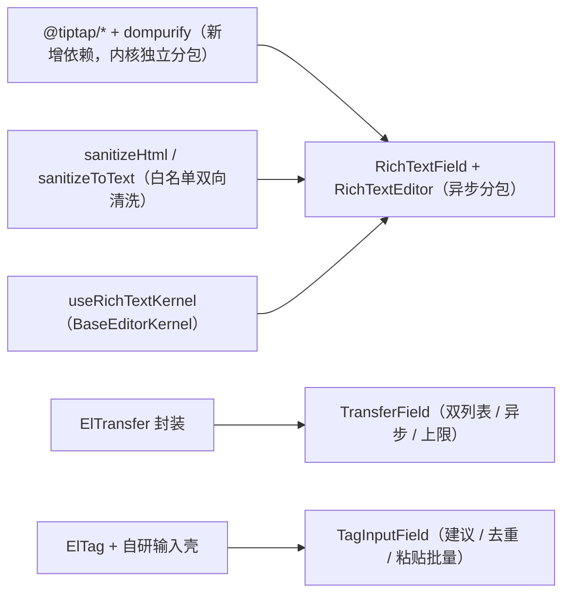

# 03 实施 · 富文本与高级交互字段

> 前端组件库 · 06 字段类 · 子任务 03（需求 06-3；含 3 个嵌套子任务）· 实施记录

[文档首页](../../../../../../文档首页.md) › [06 字段类](../../06_字段类.md) › [03 富文本与高级交互字段](../06_字段类_03_富文本与高级交互字段.md) › 实施记录　|　[← 任务](../06_字段类_03_富文本与高级交互字段.md)

## 1. 实施信息 

| 项 | 值 |
| --- | --- |
| 任务 | [03 富文本与高级交互字段](../06_字段类_03_富文本与高级交互字段.md) |
| 对应需求 | [06-3](../../../../需求/06_需求_字段类.md#r06-3) |
| 详细设计 | [01 富文本](../设计/01_详细设计_01_富文本字段.md) / [02 穿梭框](../设计/02_详细设计_02_穿梭框.md) / [03 标签输入](../设计/03_详细设计_03_标签输入.md) |
| 实施日期 | 2026-09-18 |
| 实施人 | minjian |
| 实施环境 | 本地开发机（Node v24.20.0 / pnpm 11.x，npmmirror） |
| 提交 | 富文本 `739f031b`；穿梭框 `a41edb33`；标签输入 `14d3afb5` |
| 结论 | 完成 |

## 2. 实施概览 

## 3. 实施过程 

### 3.1 富文本字段（10h） 

1. **依赖与清洗**：引入 `@tiptap/core` / `starter-kit` / `vue-3` 与 `dompurify`；`utils/sanitizeHtml.ts` 落白名单（`RICH_TEXT_ALLOWED_TAGS` / `ATTR`，禁 `style` 与事件属性）与 `sanitizeToText`。
2. **内核投影**：`useRichTextKernel`（`BaseEditorKernel`；核心 `EditorMode` 为 `rich | markdown | code`，源码模式映射 `code`）。
3. **组件**：`RichTextField` 富文本 / 源码双模式、只读渲染清洗后 HTML、`maxLength` 按净化纯文本计（超限 `invalid` 不写值）、图片上传缺省降级（`upload-error`）与成功插入；内核宿主 `RichTextEditor`（TipTap）经 **`defineAsyncComponent` 独立分包**。
4. **分包与预算**：TipTap 曾使 `bms-base` 达 202.3 KB（超 150 KB 预算）→ 异步内核宿主后最大单文件 101.4 KB、合计 119.9 KB（预算内）。

### 3.2 穿梭框（8h） 

1. `TransferField`：封装 `el-transfer`（双列表 / 搜索 / 全移）；`load` 异步加载失败 → 错误态 + `retry`；`limit` 上限越界拒绝变更并 `invalid`。
2. 分组以「组名 · 文案」前缀呈现（避免 `render-content` 的 `h` 类型对抗）；只读标签回显含缺标签降级；`required` 校验。

### 3.3 标签输入（6h） 

1. `TagInputField`：`el-tag` + 自研输入壳；回车 / 建议点击 / **粘贴批量**（逗号 / 分号 / 换行）添加；去重与空白忽略；数量 / 单个长度上限 → `invalid` 且不添加。
2. 建议过滤（排除已选、限 8 条）；`allowCreate=false` 仅接受建议项；`colorMap`（映射表 / 函数）与只读回显。

## 4. 问题与处置 

| # | 问题 / 现象 | 原因 | 处置 |
| --- | --- | --- | --- |
| 1 | `bms-base` 分包 202.3 KB（超预算） | TipTap 随 index 静态引入 | 内核宿主改 `defineAsyncComponent` 独立分包（设计已要求） |
| 2 | `v-html` 触发 lint 告警 | 安全规则 | 内容先经白名单清洗，行内加说明性豁免 |
| 3 | 内部内核宿主未挂链（护栏） | 未引核心基类 | 经 `useRichTextKernel` 挂链 |
| 4 | `el-transfer` 的 `render-content` `h` 类型不匹配 | EP 类型严格 | 改分组前缀映射（展示语义保留） |
| 5 | 上限拒绝未渲染错误位 | 缺错误状态 | 增 `limitError`；标签输入抽 `tryAppend` 供回车 / 粘贴共用 |

## 5. 验证结果 

| 验证点 | 方法 | 结果 |
| --- | --- | --- |
| 类型检查 / Lint | 根 `pnpm run check` | 通过 |
| 单测（ui-ep） | `pnpm run ui-ep:test` | 27 文件 / 174 用例全通过（新增 18） |
| 单测（核心 / 绑定） | `core` / `vue` | 160 / 5 用例通过 |
| 宿主体积 | `apps/desktop` `build` / `budget` | 通过；合计 119.9 KB、最大单文件 101.4 KB |

## 6. 偏差与遗留 

- **偏差**：① 源码模式映射核心 `EditorMode='code'`（核心无 `source` 枚举）；② 穿梭框分组以前缀实现（详见 §4）。
- **遗留**：① 工具栏高级能力与后端白名单下发；② 图片上传真实通路随 `06_07`；③ 穿梭框分页加载与远端建议随宿主；④ 字段壳组装随字段壳族。

> 本文档依《[文档生成规范](../../../../../../规范/文档生成规范.md)》编写
