# 01 实施 · 验证码字段

> 前端组件库 · 06 字段类 · 04 验证码字段（需求 06-4）· 实施记录

[文档首页](../../../../../../文档首页.md) › [06 字段类](../../06_字段类.md) › [04 验证码字段](../06_字段类_04_验证码字段.md) › 实施记录　|　[← 详细设计](../设计/01_详细设计_04_验证码字段.md)　[测试记录 →](../测试/01_测试_04_验证码字段.md)

## 1. 实施信息 

| 项 | 值 |
| --- | --- |
| 任务 | 04 验证码字段（[任务](../06_字段类_04_验证码字段.md)） |
| 对应需求 | [06-4](../../../../需求/06_需求_字段类.md#r06-4) |
| 详细设计 | [01_详细设计_04_验证码字段.md](../设计/01_详细设计_04_验证码字段.md) |
| 实施日期 | 2026-09-21 |
| 实施人 | minjian |
| 实施环境 | Ubuntu 开发机 · Node（npm workspace）· Vue 3.5 / TypeScript 严格模式 · Element Plus 2.14 · Vitest 5（node + jsdom）· chromium（CDP 轮询导出 DOM）· 后端占位服务（`uvicorn app.asgi:app --port 8000`，HTTP 模式核对用，用毕停止） |
| Kiwi 用例 | 966（分类「平台骨架」/ P2 / `CONFIRMED` / 标签「自动化」） |
| 提交 | `<待提交>`（本任务代码 + 文档两次提交） |
| 结论 | 完成标准达标（三类验证码可用、阈值与限流行为生效、滑块轨迹提交后端判定；对外契约保持冻结形状；核对页 13/13（桩 + `?source=http` 占位端点模式）；真实出题 / 短信下发 / 限流联调归阶段六） |

```mermaid
flowchart LR
    A["Kiwi 用例登记（966）"] --> B["核心领域 domain/captcha.ts（常量 / 归一 / 脱敏 / 校验 / 阈值 / 倒计时 / 轨迹 / 数据 URL / 错误码）"]
    B --> C["插件轨 capabilities/captcha-source.ts（BaseCaptchaSource + Provider / Registry）"]
    C --> D["组件基类 BaseCaptcha（父 BaseInput；挑战 / 刷新 / 发送 / 倒计时 / 校验 / 滑块 / 阈值 / 释放）"]
    D --> E["manifest / form-layout / form-render / core 导出"]
    E --> F["契约套件 describeCaptchaContract + 数据源桩 + 核心用例（38 用例）"]
    F --> G["投影 useBaseCaptcha + HTTP 内建数据源 utils/captchaSource.ts"]
    G --> H["四件（CaptchaField 真实实现 + ImageCaptcha / SliderCaptcha / SmsCaptcha）"]
    H --> I["表单渲染协同（captchaKind / captchaScene 透传）+ 导出面"]
    I --> J["设计令牌 --bms-captcha-* + 宿主核对页 13 项"]
    J --> K["门禁验证（core / ui-ep / 宿主 build + budget）+ 核对页 13/13（桩 + HTTP）"]
    K --> L["登记回写（基类清单 / 组件设计 / 架构 / 令牌 / 计划与状态 / 协同契约）"]
```

## 2. 实施概览 

结果小结：新增核心领域 1 份、插件轨 1 套、组件基类 1 个、契约套件 1 套、投影 1 套、HTTP 工具 1 个、件 4 个（`CaptchaField` 真实实现 + 3 件新增）；`core` 86 文件 / 1109 用例、`ui-ep` 60 文件 / 897 用例全绿；宿主 `vue-tsc -b` / `lint` / `test:cov` / `build` / `budget` 通过（首屏 127.5 KB / 260 KB；首屏最大单文件 111.2 KB / 150 KB）；核对页 13/13（chromium CDP；桩模式与 `?source=http` 占位端点模式各一次，占位后端四端点 curl 联通）；**无新增第三方依赖**。

## 3. 实施过程 

1. **Kiwi 先行**：经容器内 Django shell 登记用例（平台既有编号至 965），取得 **966**；四份用例文件首行标注 `// kiwi_id: 966`。
2. **核心领域 `domain/captcha.ts`**：常量（有效期 300s / 冷却 60s / 阈值 3 / 图形 4-6 位 / 短信 6 位 / 五场景 / 轨迹点数上下限 / 错误码 20101 ~ 20103 文案）、类型（`CaptchaKind` / `CaptchaScene` / `CaptchaPhase` / `CaptchaChallenge` / `CaptchaSliderParams` / `CaptchaPolicy` / `CaptchaTracePoint`）与纯函数（形态与场景归一、挑战归一（兼容 snake_case，缺省回落请求侧）、策略归一（兼容 `fail_threshold`）、手机号归一与脱敏（前 3 后 4）、输入校验（空 / 长度 / 字符集 / 定长覆盖）、阈值判定、倒计时步进与夹取、滑块参数解析与轨迹归一 / 提交构造、图片数据 URL 组装、线参数构造（`captcha_id` / `trace` 等 snake_case）、错误码文案）。
3. **插件轨 `capabilities/captcha-source.ts`**：`BaseCaptchaSource`（四方法：`challenge` / `sendSms` / `verify` / `policy`；未覆写返回 `undefined` 即不请求）+ `CaptchaSourceProvider` + `CaptchaSourceRegistry`；注入面 `CaptchaSourceAdapter`。
4. **组件基类 `BaseCaptcha`（父 `BaseInput`）**：形态 / 场景 / 手机号 / 冷却 / 阈值配置；挑战获取与刷新（**一次性失效**：刷新先清旧编号 / 图片 / 参数）；短信发送（成功启动倒计时；**20103 限流不启动 / 不重置**；失败不计冷却）；凭证校验（输入先校验、零请求；20101 / 20102 文案与挑战失效；图形 / 滑块失败由件层自动刷新）；滑块轨迹采样（点数上限、最少点数拒绝）与提交；阈值联动（`needsChallenge` = 父页面强制 ∨ 策略强制 ∨ 阈值达标）；脱敏目标（服务端 `target` 优先）；倒计时定时器随生命周期（`onDispose` 停表）；请求序号防竞态；释放后不写状态。
5. **登记与导出**：`manifest`（新增 `captcha: ['input']`）；`form-layout`（`FieldRenderAttrs` 增 `captchaKind` / `captchaScene`）、`form-render`（`normalizeField` 归一并透传，非法剔除）；`core/src/index.ts` 与 `core/testing/index.ts` 导出。
6. **契约套件（`@bms/core/testing/captcha.ts`）**：`describeCaptchaContract` + 数据源桩（挑战编号递增 / 短信脱敏目标与 60s 冷却 / 校验可控失败 / 策略）；核心基类与 `ui-ep` 投影各传适配器跑同一套断言（同契约多实现）；`06_01` 冻结的 `describePlaceholderFieldContract` 由投影继续复用。
7. **投影与工具**：`useBaseCaptcha`（响应式面与同步、`onScopeDispose` 释放；派生面用 `Ref` 同步，核心实例非响应式）；`utils/captchaSource.ts`（HTTP 内建四端点 + 统一解包 + 业务码抛 `BaseError` + `fetch` 缺失降级 + 默认键 `http`）。
8. **件族四件**：
   - `CaptchaField`（分发壳，保留 `06_01` 冻结契约）：策略加载与 `policy` / `expire` 上抛、形态分发、壳级错误与重试；`captcha-send` 按钮语义保持（图形刷新 / 短信发送）；
   - `ImageCaptcha`（图形）：自动出题（外部 `imageUrl` 时不请求）、空图占位提示、点击图片与按钮刷新、回车校验、失败自动刷新与一次失效；
   - `SliderCaptcha`（自绘滑块）：指针拖动（`utils/keyboard.ts` 的 `startPointerDrag` 单一落点）+ 轨迹采样（坐标 + 相对毫秒）+ 松手提交、键盘（方向键微调 / 回车提交）、失败自动复位 + 最近失败提示保留 + 自动重取挑战、背景参数渲染与纯轨道降级；
   - `SmsCaptcha`（短信）：手机号脱敏展示、发送按钮（空闲文案含冷却配置秒数与冻结断言兼容、倒计时中 `重新发送(ns)` 置灰）、`autocomplete="one-time-code"` 与数字键盘、限流 20103 上抛 `rate-limit`、6 位校验与通过 / 失败上抛。
9. **表单渲染协同**：`FormRendererBody.extraProps` 增 `captcha` 分支（`captchaKind` / `captchaScene` 透传；语义键与映射表已于 `06_01` 存在，未改）。
10. **令牌与核对页**：`tokens.scss` 新增 `--bms-captcha-*`（亮 / 暗两套）；`captcha-check.html` + `src/dev/{captchaCheck.ts,CaptchaCheck.vue}`（13 项自检：占位零请求、出题与一次性失效、输入校验、阈值联动、校验通过 / 20101 / 20102、滑块轨迹与失败复位、短信发送与倒计时 / 限流、策略归一、契约缺口与数据源可替换；`?source=http` 模式对四端点做端到端探测）。
11. **登记回写**：《前端基类清单》（§2.1 新增 `BaseCaptcha` + 插件轨族与注册表 + 继承链总览 / 全景 / §5.3 / §8 / §9 / 契约套件清单）、《组件设计 · 验证码》落地口径注块、《架构设计 · 前端组件体系》「取数与缓存协作」节、《布局设计 · 设计令牌》登记、任务 / 父任务 / 计划与状态、协同契约（`06_01` / `08_06` / 后端 `02-31` / `02-42`）。

## 4. 问题与处置 

| # | 问题 / 现象 | 原因 | 处置与落点 |
| --- | --- | --- | --- |
| 1 | `guard-manifest` 失败：`BaseCaptcha` 未在《前端基类清单》登记为已交付 | 新能力基类须「新增即登记」 | 清单 §2.1 新增行（组件侧 · 组件基类，父 `BaseInput`，已交付），并回写插件轨 / 继承链 / §5.3 / §9 |
| 2 | 契约套件「滑块轨迹提交」断言 `[[x, y, t], …]` 失败 | 注入面契约传**对象点**（`{x, y, t}`），线参数（元组）组装归 HTTP 工具 | 修正套件断言为对象点；元组形态由领域 `buildCaptchaTrace` + `ui-ep` HTTP 工具用例覆盖（对齐设计 §10 记录） |
| 3 | 投影派生面初版用 `computed` 不随核心实例更新 | 核心实例非响应式（同 `06_06` 字典对齐记录 3） | 派生面改 `Ref` 并在 `sync()` 中同步（回写设计 §10） |
| 4 | 核对页首次加载 500（`Failed to resolve import "@bms/core/testing"`） | 宿主 vite 只别名 `@bms/core` 主入口，测试入口（`@bms/core/testing`）不可用 | 核对页桩数据源改为**本页内联**（与 `FileCheck.vue` 同口径），不依赖测试入口 |
| 5 | 滑块失败后重试入口消失 | 失败后件层自动重取挑战，`applyChallenge` 清错误态 | 件层以「最近失败态」承载提示（刷新后仍显示重试入口），回写设计 §10 |
| 6 | 滑块键盘失败用例未触发（轨迹仅 1 点） | `submitSlider` 最少点数 2 的领域约束 | 用例补一次方向键采样（领域约束正确，无需改实现） |
| 7 | 短信校验用例未通过（未先获取挑战） | 校验需挑战编号（`canVerify`） | 用例先点发送取得挑战再校验（与真实交互一致） |
| 8 | 设计对齐 10 项 | 见设计 §10 实施对齐记录 | 已回写设计文档 |

## 5. 验证结果 

| 命令 / 方式 | 结果 |
| --- | --- |
| 根 `npm run core:check`（typecheck + lint + test） | 86 文件 / **1109 用例**通过（新增 2 文件 / 38 用例 + 映射断言 1 项） |
| 根 `npm run ui-ep:check` | 60 文件 / **897 用例**通过（新增 `field-captcha.spec.ts` 32 用例 + 表单协同 1 用例） |
| 宿主 `npx vue-tsc -b` / `npm run lint` | 通过 |
| 宿主 `npm run test:cov` | 通过（覆盖率门禁） |
| 宿主 `npm run build` / `npm run budget` | 通过（首屏合计 127.5 KB / 260 KB；首屏最大单文件 111.2 KB / 150 KB；无新增分包） |
| 开发态核对页（chromium CDP 轮询导出 DOM） | 桩模式 **13/13**；`?source=http` 占位端点模式 **13/13**（缺口提示为「HTTP 占位端点联通」） |
| 后端占位四端点 curl（HTTP 模式前置） | `POST /api/v1/captcha/challenges`、`POST /api/v1/captcha/sms`（`target=138****5678` / `cooldown=60`）、`POST /api/v1/captcha/verify`（`verified=true`）、`GET /api/v1/captcha/scenes/login/policy`（`fail_threshold=3`）全部联通 |
| 既有 `ui-ep/tests/field-placeholder.spec.ts`（`06_01` 冻结契约） | **未改动即通过**（占位降级 / `captcha-send` 事件 / 短信倒计时文案） |
| 既有消费方回归（表单渲染器 / 其他字段） | 原样通过（`FormRendererBody` 变更只增 `captcha` 分支） |
| 机器护栏（能力登记 / 注释 / 组件挂链 / 单一落点 / 令牌） | 全部通过 |
| 文档链接与基座校验 | `check-links.py`、`check-base.py`、`check-status.py --stage 04_前端组件库` 通过 |

## 6. 偏差与遗留 

- **设计偏差（已回写设计 §10）**：① `normalizeCaptchaChallenge` 增请求侧回落参数；② `defaultCaptchaPolicy` 的 `required` 按场景缺省（与后端默认表同源）；③ 补轨迹点数上限常量；④ 投影派生面用 `Ref` 同步（非 `ComputedRef`）；⑤ 投影补 `payload` / `error` / `policy` 面；⑥ 图形件补 `pass` 事件；⑦ 滑块失败提示刷新后保留；⑧ 核对页 HTTP 模式四端点端到端探测；⑨ 短信发送失败不计冷却；⑩ Kiwi 编号回填 966。
- **对外契约扩展（向后兼容）**：`CaptchaField` 新增可选 Props（`scene` / `phone` / `source` / `failCount` / `failThreshold` / `inputLength` / `required` / `errorMessage`）与事件（`invalid` / `pass` / `fail` / `rate-limit` / `expire` / `policy`）与 `live` / `tip` 插槽；既有 Props / 事件 / 插槽 / `data-test` 不变。
- **核心面新增（只增不改）**：`domain/captcha.ts`、`capabilities/captcha-source`、`capabilities/captcha`、契约套件 `describeCaptchaContract`；`FormWidget` / 映射表未改（`captcha` 已于 `06_01` 存在），`FieldRenderAttrs` 增 `captchaKind` / `captchaScene`（前端先冻结，后端表单元数据下发归表单定制窗口）。
- **依赖**：无新增第三方依赖（滑块自绘、图形出图在后端）；CI 无需重建基础镜像。
- **遗留（归口）**：
  - 真实图形 / 滑块出题（Pillow + Redis 一次性校验）、短信真实下发（经 `02-20` 通知渠道）、冷却与频次（经 `02-25` 限流基座）、场景策略按租户读 `sys_config` 与失败计数接线 → **阶段六「认证与安全」窗口**（需求 02-31 / 02-42 实现期要点已明确；前端四端点契约与 HTTP 数据源已就位）。
  - 滑块 `payload` 背景 / 缺口参数形态随阶段六定稿（前端已按 `{background, gap_x, gap_y, width, height}` 冻结并容错）。
  - 表单元数据接口下发 `captchaKind` / `captchaScene` → 表单定制窗口。
  - 移动端实现（契约套件与投影就位供同契约多实现）。

> 本文档依《[文档生成规范](../../../../../../规范/文档生成规范.md)》编写
