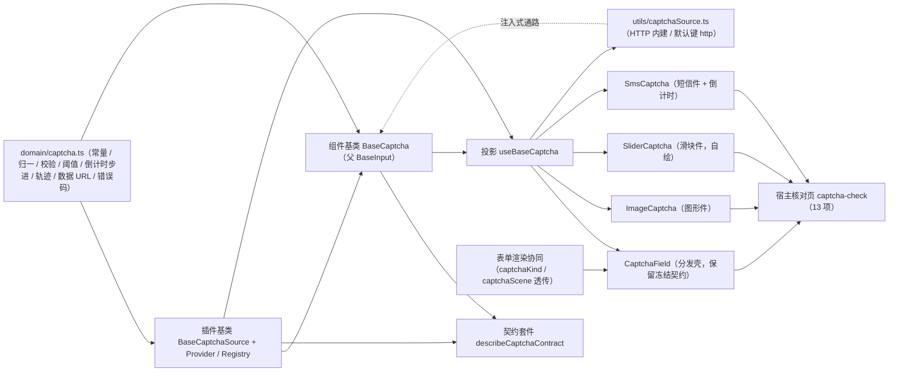

# 01 详细设计 · 验证码字段

> 前端组件库 · 06 字段类 · 04 验证码字段（需求 06-4）· 详细设计

[文档首页](../../../../../../文档首页.md) › [06 字段类](../../06_字段类.md) › [04 验证码字段](../06_字段类_04_验证码字段.md) › 详细设计　|　[← 任务](../06_字段类_04_验证码字段.md)

## 1. 设计目标与范围 <a id="goal"></a>

交付[需求 06-4](../../../../需求/06_需求_字段类.md#r06-4) 与[任务 04](../06_字段类_04_验证码字段.md) 的**验证码字段族**（分发壳 + 三形态件 + 组件基类 + 注入式通路 + 领域纯函数 + 契约套件 + 投影 + 令牌 + 核对页）：

- **图形验证码**：后端图片（base64 → `data:` URL）、点击图片 / 按钮刷新（防缓存由每次新挑战编号承载）、失败与使用后**一次性失效**（前端不可复用旧编号）、随业务提交校验；**连续失败达阈值后由父页面强制显示**（`captcha.required_after_failures`，缺省 3）。
- **滑块验证**：自绘滑块（无新增依赖）拖动到缺口位置；松手提交**轨迹凭证**（`x / y / 相对起点毫秒`）交后端判定，**前端不做真伪判断**；状态「待拖动 → 拖动中 → 校验中 → 通过 / 失败自动复位」；键盘可操作与失败重试。
- **短信验证码**：手机号**脱敏**显示、发送后 **60s 倒计时**（以后端冷却为准）、**限流命中提示且不启动 / 不重置倒计时**、一次性验证码自动填充语义（`autocomplete="one-time-code"`）、错误分类提示（验证码错误 20101 / 已失效 20102 / 发送过于频繁 20103）。
- **对外契约不变**：`CaptchaField` 的导出名与 `06_01` 冻结的 Props / 事件 / 插槽 / `data-test` 保持形状（`ui-ep/tests/field-placeholder.spec.ts` 原样通过），本次只**向后兼容新增**可选 Props / 事件 / 插槽（契约变更走版本升级）。
- **前端先行 + 通路注入式**（用户拍板）：取数经注入面 `CaptchaSourceAdapter`（可替换实现经 `CaptchaSourceRegistry` 登记），**未注入即占位零请求**；`ui-ep` 交付 HTTP 内建实现（默认键 `http`），直连既有后端占位路由 `/api/v1/captcha/*`（出题 / 短信 / 校验 / 策略四端点，`NullCaptcha` 恒定通过）；**真实出题（Pillow）、短信下发（渠道 02-20）、冷却频次（限流 02-25）与场景策略（`sys_config`）随阶段六「认证与安全」窗口回补**（需求 02-31 / 02-42 口径）。

### 1.1 口径与依从 <a id="positioning"></a>

- **架构铁律**：三形态状态机、挑战获取与刷新、倒计时、阈值判定、校验结果与错误均为**横切功能**，落为**继承链上的组件基类**（`capabilities/captcha.ts`）与**领域纯函数**（`domain/captcha.ts`）；数据通路为**可替换实现（纵向）**，落**插件基类 + 注册项 + 注册表**（`capabilities/captcha-source.ts`）；具体件只做渲染与交互回传，**不得链外挂接、不得重复实现倒计时 / 校验 / 阈值判定**。
- **继承链（唯一权威见《[前端基类清单](../../../../../../前端基类清单.md)》）**：`BaseObject → BaseCapability → BasePluggable → BaseComponent`（组件根）`→ BasePlaceholderState → BaseValue → BaseField → BaseInput`（输入组件基类）`→ BaseCaptcha`（**新增组件基类**）`→ 具体件`（经投影 `useBaseCaptcha` 挂链）。
- **可替换实现走插件基类 + 注册表**：`BaseCaptchaSource`（未覆写的方法返回 `undefined` 即不请求）+ `CaptchaSourceProvider` + `CaptchaSourceRegistry`；`ui-ep` 内建 HTTP 实现（默认键 `http`）。
- **核心框架无关（强制）**：核心包不得依赖 Vue / DOM / 浏览器 API；`fetch` / `URLSearchParams` 归 `ui-ep`（`utils/captchaSource.ts` 单一落点）；`window` 指针监听经既有 `utils/keyboard.ts`（`startPointerDrag`）；倒计时定时器在核心以 `setInterval` 承载（与 `BaseNotificationCenter` 轮询同先例），**不触 DOM**。
- **取数与交互分离**：取数归注入式通路（`challenge` / `sendSms` / `verify` / `policy`）；件不自行发请求；**未注入即占位零请求**（保持 `06_01` 冻结口径）。
- **常量与后端同源 + Props 可覆盖**（拍板）：有效期 `CAPTCHA_TTL`（300s）、短信冷却 `SMS_COOLDOWN`（60s）、失败阈值 `CAPTCHA_FAIL_THRESHOLD`（3）、图形输入 4-6 位、短信 6 位、场景五项（`login` / `reset_password` / `bind` / `unbind` / `register`）；Props 与场景策略接口可覆盖阈值 / 冷却 / 长度。
- **阈值联动归父页面**（拍板）：组件暴露场景策略获取与 `needsChallenge`（策略强制 ∨ 失败计数达阈值 ∨ `required`），**是否渲染图形验证码由父页面决定**（同组件设计 §7 与原型）。
- **图形图片承载**（拍板）：后端 base64 → 前端组装 `data:image/png;base64,…`；空图片（占位后端未出图）显示占位提示；兼容 `06_01` 既有 `imageUrl` prop 外部直连。
- **滑块自绘**（拍板）：原生指针事件 + 轨迹点采样；无新增第三方依赖。
- **i18n**：占位、提示、校验与错误文案内置中文并可经 Props 覆盖；验证码字符由后端生成（**前端不暴露答案**）。
- **令牌（强制）**：图形图框 / 滑块轨道与滑块 / 通过态 / 短信冷却与错误走新增 `--bms-captcha-*` 令牌组；**禁止硬编码色值**。
- **端范围**：**仅 PC**（`frontend/packages/ui-ep`）；移动端本期不落实现，契约套件与投影就位供后续同契约多实现（表单 + 验证码按钮 + 滑块，口径同源）。
- **工时**：本任务名义 8h；因新增 1 个组件基类、1 套插件基类 / 注册项 / 注册表、1 份领域纯函数、1 套契约套件、1 套投影、1 个 HTTP 工具、四件、表单渲染协同、令牌与 13 项核对页，实际上浮在实施记录登记。

## 2. 交付物清单 <a id="deliver"></a>

| # | 交付物 | 落点 |
| --- | --- | --- |
| 1 | 验证码领域纯函数与数据模型（新增） | `core/src/domain/captcha.ts` |
| 2 | 验证码数据源插件基类与注册表（新增） | `core/src/capabilities/captcha-source.ts` |
| 3 | 验证码族组件基类 `BaseCaptcha`（新增，父 `BaseInput`） | `core/src/capabilities/captcha.ts` |
| 4 | 能力依赖登记（修改：新增 `captcha`） | `core/src/capabilities/manifest.ts` |
| 5 | 表单渲染属性与归一（修改：`captchaKind` / `captchaScene`） | `core/src/domain/form-layout.ts`、`core/src/domain/form-render.ts` |
| 6 | 核心导出面登记（修改） | `core/src/index.ts` |
| 7 | 契约套件 `describeCaptchaContract`（新增）+ 数据源桩 | `core/testing/captcha.ts`、`core/testing/index.ts` |
| 8 | 核心用例（领域 + 族基类 + 映射回归） | `core/tests/domain-captcha.spec.ts`、`core/tests/captcha.spec.ts`、`core/tests/domain-form-render.spec.ts` / `domain-form-layout.spec.ts`（补断言） |
| 9 | 验证码族投影（新增） | `ui-ep/src/composables/useBaseCaptcha.ts` |
| 10 | HTTP 内建数据源与注册（新增，`fetch` 单一落点） | `ui-ep/src/utils/captchaSource.ts` |
| 11 | 验证码字段分发壳（真实实现，保留 `06_01` 冻结契约） | `ui-ep/src/components/field/CaptchaField.vue` |
| 12 | 图形验证码件（新增） | `ui-ep/src/components/field/ImageCaptcha.vue` |
| 13 | 滑块验证码件（新增，自绘） | `ui-ep/src/components/field/SliderCaptcha.vue` |
| 14 | 短信验证码件（新增） | `ui-ep/src/components/field/SmsCaptcha.vue` |
| 15 | 表单渲染协同（修改：`captcha` 属性透传） | `ui-ep/src/components/form-render/FormRendererBody.vue` |
| 16 | 导出面登记（四件 + 投影 + 工具 + 类型） | `ui-ep/src/index.ts` |
| 17 | 设计令牌（新增 `--bms-captcha-*` 组，亮 / 暗两套） | `apps/desktop/src/styles/tokens.scss` |
| 18 | 用例（投影 + 四件 + 工具 + 表单协同） | `ui-ep/tests/field-captcha.spec.ts`、`interaction-form-renderer.spec.ts`（补验证码分支） |
| 19 | 宿主核对页（`vite build` 不含，13 项） | `apps/desktop/captcha-check.html`、`apps/desktop/src/dev/{captchaCheck.ts,CaptchaCheck.vue}` |
| 20 | 登记回写（基类清单 / 组件设计 / 架构 / 布局令牌 / 计划与状态 / 协同契约） | 见第 6 节 |



```text
core/
├── src/
│   ├── domain/
│   │   ├── captcha.ts                   # 新增：验证码领域纯函数与数据模型
│   │   ├── form-layout.ts               # 修改：FieldRenderAttrs 增 captchaKind / captchaScene
│   │   └── form-render.ts               # 修改：normalizeField 归一并透传两属性
│   └── capabilities/
│       ├── captcha-source.ts            # 新增：BaseCaptchaSource / CaptchaSourceProvider / CaptchaSourceRegistry
│       ├── captcha.ts                   # 新增：组件基类 BaseCaptcha（父 BaseInput）
│       └── manifest.ts                  # 修改：新增 captcha 登记
├── testing/
│   ├── captcha.ts                       # 新增：契约套件 + 数据源桩
│   └── index.ts                         # 修改：新增导出
└── tests/
    ├── domain-captcha.spec.ts           # 新增：领域纯函数用例
    ├── captcha.spec.ts                  # 新增：族基类用例 + 契约
    ├── domain-form-layout.spec.ts       # 修改：captchaKind / captchaScene 归一断言
    └── domain-form-render.spec.ts       # 修改：captcha 映射与属性断言同步

ui-ep/
├── src/
│   ├── components/
│   │   ├── field/
│   │   │   ├── CaptchaField.vue         # 修改：真实实现（保留 06_01 冻结契约）
│   │   │   ├── ImageCaptcha.vue         # 新增
│   │   │   ├── SliderCaptcha.vue        # 新增
│   │   │   └── SmsCaptcha.vue           # 新增
│   │   └── form-render/
│   │       └── FormRendererBody.vue     # 修改：captcha 属性透传
│   ├── composables/
│   │   └── useBaseCaptcha.ts            # 新增：验证码族投影
│   ├── utils/
│   │   └── captchaSource.ts             # 新增：HTTP 内建数据源 + 注册表默认实例
│   └── index.ts                         # 修改：四件 + 投影 + 工具导出
└── tests/
    ├── field-captcha.spec.ts            # 新增：契约套件适配 + 四件 + 工具 + 表单协同
    └── interaction-form-renderer.spec.ts # 补验证码分支

apps/desktop/
├── captcha-check.html                   # 新增：开发态核对页（不进构建产物）
└── src/
    ├── dev/{captchaCheck.ts,CaptchaCheck.vue} # 新增：13 项自检上屏
    └── styles/tokens.scss               # 修改：--bms-captcha-* 令牌组
```

## 3. 接口 / 契约与边界 <a id="contract"></a>

### 3.1 核心：`domain/captcha.ts`（新增纯函数与数据模型） <a id="domain"></a>

```ts
/** 有效期（秒，5 分钟；与后端 `CAPTCHA_TTL` 同源）。 */
export const CAPTCHA_TTL = 300
/** 短信重发冷却（秒；与后端 `SMS_COOLDOWN` 同源，同时为前端倒计时口径）。 */
export const CAPTCHA_SMS_COOLDOWN = 60
/** 连续失败阈值（与后端 `CAPTCHA_FAIL_THRESHOLD` 同源）。 */
export const CAPTCHA_FAIL_THRESHOLD = 3
/** 图形验证码输入长度范围与短信输入长度。 */
export const CAPTCHA_IMAGE_MIN_LENGTH = 4
export const CAPTCHA_IMAGE_MAX_LENGTH = 6
export const CAPTCHA_SMS_LENGTH = 6
/** 滑块轨迹终点容差（像素下限；与后端 `SLIDER_TOLERANCE` 同源，前端仅展示口径）。 */
export const CAPTCHA_SLIDER_TOLERANCE = 10
/** 轨迹提交最少点数（起点 + 终点）。 */
export const CAPTCHA_TRACE_MIN_POINTS = 2
/** 形态与场景枚举（与后端 `CaptchaKind` / `CAPTCHA_SCENES` 同源）。 */
export const CAPTCHA_KINDS: readonly CaptchaKind[] = ['image', 'slider', 'sms']
export const CAPTCHA_SCENES: readonly CaptchaScene[] = ['login', 'reset_password', 'bind', 'unbind', 'register']
/** 空值占位。 */
export const CAPTCHA_EMPTY_VALUE = '—'
/** 占位 / 输入 / 按钮 / 状态 / 边界文案。 */
export const CAPTCHA_PLACEHOLDER_TEXT = '验证码未就绪（占位）'
export const CAPTCHA_INPUT_PLACEHOLDER = '请输入验证码'
export const CAPTCHA_SMS_INPUT_PLACEHOLDER = '请输入短信验证码'
export const CAPTCHA_REFRESH_TEXT = '刷新'
export const CAPTCHA_SEND_TEXT = '获取验证码'
export const CAPTCHA_RESEND_TEXT = '重新发送'
export const CAPTCHA_PASS_TEXT = '验证通过'
export const CAPTCHA_SLIDER_HINT = '拖动滑块到缺口位置'
export const CAPTCHA_SLIDER_RETRY_TEXT = '验证失败，请重试'
export const CAPTCHA_IMAGE_EMPTY_TEXT = '验证码图片待后端生成（占位）'
export const CAPTCHA_LOAD_ERROR_TEXT = '验证码获取失败，请重试'
export const CAPTCHA_SEND_ERROR_TEXT = '验证码发送失败，请重试'
export const CAPTCHA_VERIFY_ERROR_TEXT = '验证码校验失败，请重试'
export const CAPTCHA_REQUIRED_TEXT = '请完成验证码校验'
/** 验证码错误码文案（20101 ~ 20103，与后端认证段子段 `201xx` 同源）。 */
export const CAPTCHA_ERROR_TEXTS: Readonly<Record<number, string>> = {
  20101: '验证码错误',
  20102: '验证码已失效，请重新获取',
  20103: '发送过于频繁，请稍后再试',
}

/** 验证码形态（图形 / 滑块 / 短信）。 */
export type CaptchaKind = 'image' | 'slider' | 'sms'
/** 使用场景（与后端 `CAPTCHA_SCENES` 同源）。 */
export type CaptchaScene = 'login' | 'reset_password' | 'bind' | 'unbind' | 'register'
/** 挑战生命周期阶段。 */
export type CaptchaPhase = 'idle' | 'loading' | 'ready' | 'sending' | 'verifying' | 'passed' | 'failed'
/** 输入校验结果。 */
export interface CaptchaCheckResult { valid: boolean; message: string }
/** 归一后的挑战（图片已组装 data URL；编号为一次性失效凭据）。 */
export interface CaptchaChallenge {
  captchaId: string
  kind: CaptchaKind
  /** 挑战图片（`data:image/png;base64,…`；空串表示后端占位未出图）。 */
  image: string
  expiresIn: number
  scene: string
  /** 形态参数（原始 JSON 串；滑块为背景与缺口参数）。 */
  payload: string
  /** 脱敏目标（仅短信渠道，其余为空串）。 */
  target: string
  /** 重发冷却（秒；仅短信渠道，其余为 0）。 */
  cooldown: number
}
/** 滑块形态参数（`payload` 解析结果；缺省时件层以纯轨道降级呈现）。 */
export interface CaptchaSliderParams {
  background?: string
  gapX?: number
  gapY?: number
  width?: number
  height?: number
}
/** 场景策略（与后端 `CaptchaScenePolicy` 同源）。 */
export interface CaptchaPolicy { scene: string; required: boolean; failThreshold: number; ttl: number; cooldown: number }
/** 滑块轨迹点（`t` 为相对起点毫秒；提交后端口径为 `[x, y, t]`）。 */
export interface CaptchaTracePoint { x: number; y: number; t: number }

normalizeCaptchaKind(raw): CaptchaKind | undefined          // 非法 / 空 → undefined
normalizeCaptchaScene(raw): CaptchaScene | undefined        // 非法 / 空 → undefined
normalizeCaptchaChallenge(raw): CaptchaChallenge | undefined // 兼容 snake_case；captcha_id 缺失剔除；图片转 data URL
normalizeCaptchaPolicy(raw): CaptchaPolicy                   // 兼容 fail_threshold；缺省回落平台默认
defaultCaptchaPolicy(scene?): CaptchaPolicy                  // required=false / threshold 3 / ttl 300 / cooldown 60
parseCaptchaSliderParams(payload): CaptchaSliderParams       // JSON 容错；兼容 gap_x / gap_y / w / h
captchaImageUrl(image): string                               // base64 → data URL；空串原样；已是 data URL 原样
maskCaptchaPhone(phone): string                              // 保留前 3 后 4（与后端 mask_phone 同口径）
normalizeCaptchaPhone(phone): string                         // 去空格 / 连字符，仅保留数字与 + 前缀
checkCaptchaInput(value, kind, length?): CaptchaCheckResult  // 非空 + 长度（图形 4-6 / 短信 6）+ 字符集（图形字母数字、短信数字）
shouldRequireCaptcha(failCount, threshold?): boolean         // failCount ≥ 阈值（阈值 ≤ 0 不强制）
nextCountdown(current): number                               // 当前 > 0 减一，否则 0
clampCaptchaSeconds(value, fallback): number                 // 正数取整，非法回落 fallback
countdownText(seconds): string                               // `${n}s`
captchaKindText(kind): string                                // 图形验证码 / 滑块验证 / 短信验证码
captchaInputHint(kind, length?): string                      // 「请输入 4-6 位验证码」/「请输入 6 位短信验证码」
normalizeCaptchaTrace(raw): CaptchaTracePoint[]              // 过滤非法点；非负取整；保持输入顺序
buildCaptchaTrace(points): [number, number, number][]        // 提交形态（后端 `trace`）
buildCaptchaChallengeQuery(input): Record<string, unknown>   // { scene, kind }
buildCaptchaSmsQuery(input): Record<string, unknown>         // { phone, scene }
buildCaptchaVerifyQuery(input): Record<string, unknown>      // { captcha_id, kind, code, trace, scene }
isCaptchaErrorCode(code): boolean                            // 20101 ~ 20103
resolveCaptchaErrorText(code): string                        // 中文；其余回落通用失败文案
```

| 行为 | 口径 |
| --- | --- |
| 归一 | `normalizeCaptchaChallenge` 兼容 `captcha_id` / `expires_in` 等 snake_case；`captcha_id` 缺失剔除（防脏数据）；`image` 为空串保留（占位未出图）；`normalizeCaptchaPolicy` 兼容 `fail_threshold` |
| 脱敏 | `maskCaptchaPhone`：≥ 8 位保留前 3 后 4（`138****5678`），不足 8 位保留前 3；**任何输入不原样回显**；服务端返回 `target` 时以服务端为准 |
| 校验 | `checkCaptchaInput`：空值 →「请输入验证码」；`sms` 固定 6 位且纯数字；`image` 缺省 4-6 位、字母数字混合合法（大小写不敏感由后端判定）；`length > 0` 时按定长校验 |
| 阈值 | `shouldRequireCaptcha`：`failCount >= threshold`（阈值 ≤ 0 不强制）；策略 `required` 与父页面 `required` 为并集（在族基类 `needsChallenge` 汇总） |
| 倒计时 | `nextCountdown` 归零即停；`clampCaptchaSeconds` 防负数 / 小数 / NaN |
| 轨迹 | 点为对象 `{x, y, t}`；`buildCaptchaTrace` 出 `[[x, y, t], …]`（与后端 `list[tuple[int, int, int]]` 同形）；少于 `CAPTCHA_TRACE_MIN_POINTS` 的轨迹由族基类拒绝提交 |
| 图片 | `captchaImageUrl`：已是 `data:` / `http` 前缀原样；否则按 PNG base64 组装；空串返回空串 |
| 纯数据 | 不触 DOM、不请求、不依赖渲染框架与第三方库；同输入同输出 |

### 3.2 核心：`capabilities/captcha-source.ts`（新增插件基类与注册表） <a id="source"></a>

```ts
/** 出题入参（图形 / 滑块）。 */
export interface CaptchaChallengeQuery { scene: CaptchaScene; kind: CaptchaKind }
/** 短信发送入参。 */
export interface CaptchaSmsQuery { phone: string; scene: CaptchaScene }
/** 凭证校验入参（图形 / 短信用 `code`，滑块用 `trace`）。 */
export interface CaptchaVerifyQuery {
  captchaId: string
  kind: CaptchaKind
  code?: string
  trace?: readonly CaptchaTracePoint[]
  scene: CaptchaScene
}
/** 场景策略入参。 */
export interface CaptchaPolicyQuery { scene: CaptchaScene }
/** 数据源装载选项。 */
export interface CaptchaSourceOptions { endpoint?: string; headers?: Record<string, string> | (() => Record<string, string>) }

/** 验证码数据源契约面（方法与 `BaseCaptchaSource` 一致；未覆写的方法返回 `undefined`，即不请求）。 */
export interface CaptchaSourceAdapter {
  challenge?(query: CaptchaChallengeQuery): Promise<unknown>
  sendSms?(query: CaptchaSmsQuery): Promise<unknown>
  verify?(query: CaptchaVerifyQuery): Promise<unknown>
  policy?(query: CaptchaPolicyQuery): Promise<unknown>
}

/** 验证码数据源插件基类（抽象；未覆写的方法返回 `undefined`，即不请求）。 */
export abstract class BaseCaptchaSource extends BasePluggable implements CaptchaSourceAdapter {
  readonly pluginKey: string = 'captcha-source'
  readonly pluginName: string = 'base'
  challenge(query): Promise<unknown>
  sendSms(query): Promise<unknown>
  verify(query): Promise<unknown>
  policy(query): Promise<unknown>
}

/** 数据源注册项（工厂创建插件实例）。 */
export class CaptchaSourceProvider extends BaseProvider {
  readonly key: string
  readonly create: (options: CaptchaSourceOptions) => BaseCaptchaSource | Promise<BaseCaptchaSource>
}

/** 数据源注册表（统一注册表基座；同键唯一性拒重）。 */
export class CaptchaSourceRegistry extends BaseProviderRegistry<CaptchaSourceProvider> {
  readonly pluginKey = 'captcha-source-registry'
  readonly pluginName = 'core'
}
```

| 行为 | 口径 |
| --- | --- |
| 可替换实现（纵向） | 内建 / 定制实现继承 `BaseCaptchaSource`，经 `CaptchaSourceRegistry` 登记接入；**未登记 / 未注入即占位零请求** |
| 契约面兼容 | 注入面类型为 `CaptchaSourceAdapter`（接口），插件基类实现同形方法；换实现不动调用方契约 |
| 未覆写即降级 | 基类方法返回 `Promise.resolve(undefined)`；族基类据此不请求、不写状态、保持占位 / 就绪界面 |
| 单一通路 | 出题 / 短信 / 校验 / 策略共用同一适配器（注入一处、切换一处） |
| 不含 | 真实出图与短信下发（后端）、`fetch`（`ui-ep/utils/`）、件层渲染与交互 |

### 3.3 核心：组件基类 `BaseCaptcha`（新增 `capabilities/captcha.ts`） <a id="captcha"></a>

```ts
/** 验证码族组件基类（抽象；父基类 BaseInput，受控值为验证码文本）。 */
export abstract class BaseCaptcha extends BaseInput<string> {
  override readonly identifier: string = 'captcha'
  override readonly depends: readonly string[] = ['input']
  ready = false                                       // 数据通路是否就绪（占位语义，缺省未就绪）
  kind: CaptchaKind = 'image'
  scene: CaptchaScene = 'login'
  imageUrl = ''                                       // 当前挑战图片（data URL 或外部直连）
  challengeId = ''                                    // 挑战编号（一次性失效凭据）
  payload = ''                                        // 形态参数原始串（滑块）
  target = ''                                         // 服务端脱敏目标（短信）
  phone = ''                                          // 短信目标原文（展示一律脱敏）
  ttl: number = CAPTCHA_TTL
  cooldown: number = CAPTCHA_SMS_COOLDOWN             // 冷却时长配置（可经 Props / 策略覆盖）
  countdown = 0                                       // 活动倒计时剩余秒数
  failCount = 0                                       // 父页面失败计数（阈值联动）
  failThreshold: number = CAPTCHA_FAIL_THRESHOLD
  inputLength = 0                                     // 0 表示按形态缺省（图形 4-6 / 短信 6）
  required = false                                    // 父页面强制（与策略 / 阈值并集）
  phase: CaptchaPhase = 'idle'
  sending = false
  verifying = false
  passed = false
  inputError = ''
  errorCode: number | undefined
  errorMessage = ''
  policyData: CaptchaPolicy | undefined
  readonly trace: CaptchaTracePoint[] = []
  source: CaptchaSourceAdapter | undefined
  sliderParams: CaptchaSliderParams | undefined       // payload 解析缓存

  get degraded: boolean                               // 继承（!ready）
  get effectiveDisabled: boolean                      // 件级禁用 ∨ 占位
  get canLoad: boolean                                // 就绪 ∧ 通路覆写 challenge
  get canSendSms: boolean                             // 就绪 ∧ 通路覆写 sendSms ∧ 手机号非空 ∧ 倒计时为 0 ∧ 非发送中
  get canVerify: boolean                              // 就绪 ∧ 通路覆写 verify ∧ 挑战编号非空 ∧ 非校验中
  get needsChallenge: boolean                         // required ∨ 策略 required ∨ 阈值达标
  get maskedTarget: string                            // 服务端 target 优先，缺省本地脱敏 phone
  get inputMaxLength: number                          // 定长覆盖优先，否则按形态（图形 6 / 短信 6）
  get inputHint: string                               // 校验提示文案
  get errorText: string                               // inputError 优先，否则 errorMessage
  get empty: boolean                                  // 无挑战 ∧ 无错误 ∧ 非加载中
  get hasImage: boolean                               // 挑战图片非空
  get sliderReady: boolean                            // 滑块参数（背景或轨道）可用

  setReady(value: boolean): void
  setSource(source: CaptchaSourceAdapter | undefined): void
  setKind(kind: CaptchaKind): void                    // 切换形态清挑战 / 错误 / 轨迹 / 倒计时
  setScene(scene: CaptchaScene): void
  setPhone(phone: string): void
  setCooldown(seconds: number): void
  setFailCount(count: number): void
  setRequired(value: boolean): void
  setImageUrl(url: string): void                      // 外部直连（冻结 imageUrl prop 路径）
  setTrace(points: readonly CaptchaTracePoint[]): void
  setOptions(options: CaptchaOptions): void           // 合并式批量装配（件层用）
  setValue(value: string | undefined): void           // 继承（值的归一与上报；变更时清校验错误）
  loadPolicy(): Promise<void>                         // 场景策略（一次；幂等）
  loadChallenge(): Promise<boolean>                   // 获取挑战（图形 / 滑块）
  refresh(): Promise<boolean>                         // 清旧挑战后重新获取（一次性失效）
  sendSms(): Promise<boolean>                         // 发送短信（成功启动倒计时；20103 不重置倒计时）
  verify(): Promise<boolean>                          // 校验当前输入（图形 / 短信）
  submitSlider(): Promise<boolean>                    // 提交滑块轨迹（不足最少点数拒绝，零请求）
  pushTrace(point: CaptchaTracePoint): void           // 轨迹采样（件层指针事件回传）
  clearTrace(): void
  tickCountdown(): void                               // 倒计时步进（到零停表）
  startCountdown(seconds?): void                      // 启动 / 重置倒计时（定时器随生命周期）
  stopCountdown(): void
  invalidate(): void                                  // 清挑战（编号 / 图片 / 参数）与通过态
  reset(): void                                       // 清挑战 / 输入 / 错误 / 轨迹 / 倒计时（保留配置与注入）
  clearInput(): void
}
```

| 行为 | 口径 |
| --- | --- |
| 占位语义 | `ready === false` → `degraded` 为真、件层禁用；`loadChallenge` / `sendSms` / `verify` / `loadPolicy` **零请求**（`requestCount` 恒 0），保持 `06_01` 冻结口径（`describePlaceholderFieldContract` 断言不变即通过） |
| 就绪与通路 | 请求三者同时满足：`ready` ∧ 通路注入 ∧ 对应方法为函数；请求前 `markLoaded()` 计数；未覆写方法不请求且不写状态 |
| 挑战获取 | `loadChallenge`：按 `{scene, kind}` 取挑战 → 归一（编号 / 图片 data URL / 有效期 / 形态参数）→ `phase='ready'`；错误 → `phase='failed'` + 错误码文案（无码回落 `CAPTCHA_LOAD_ERROR_TEXT`），`reportError` 记录 |
| 一次性失效 | `refresh`：先清旧编号 / 图片 / 参数 / 通过态，再取新挑战（旧编号不可复用；错误后图形件自动刷新，与后端一次性失效口径一致） |
| 短信与倒计时 | `sendSms`：手机号为空 / 未就绪 / 限流倒计时中 → 不请求；成功 → 编号 / `target`（服务端脱敏优先）/ `cooldown`（响应覆盖配置）落地并 `startCountdown(cooldown)`；`tickCountdown` 每秒递减、到零停表（定时器随 `dispose` 清除；页面隐藏不暂停，以后端冷却为准） |
| 限流 | 错误码 20103 → `errorCode` / 文案「发送过于频繁，请稍后再试」，**不启动 / 不重置倒计时**（保持当前剩余秒数） |
| 校验 | `verify`：输入先经 `checkCaptchaInput`（失败置 `inputError` 且**零请求**）→ 提交 `{captchaId, kind, code, scene}` → 通过置 `passed=true` / `phase='passed'`；20101 置错误文案并 `invalidate()`（后端已一次性失效）；20102 置「已失效」并 `invalidate()` |
| 滑块 | `submitSlider`：轨迹点数 < `CAPTCHA_TRACE_MIN_POINTS` 拒绝（零请求）；提交 `{captchaId, kind: 'slider', trace, scene}`；通过 → `passed=true`；失败 → 错误 + 清轨迹 + `phase='failed'`（件层自动复位） |
| 阈值联动 | `needsChallenge` = `required` ∨ `policyData.required` ∨ `shouldRequireCaptcha(failCount, failThreshold)`；`loadPolicy` 归一后同步 `failThreshold` / `ttl` / `cooldown`（策略值仅在合法时覆盖，Props 显式覆盖优先） |
| 脱敏 | `maskedTarget`：服务端 `target` 优先；缺省 `maskCaptchaPhone(phone)`；不原样回显手机号 |
| 错误 | 通路 / 校验抛错 → `errorCode`（兼容 `code` / `errorCode`）+ `resolveCaptchaErrorText` / 对应通用文案；`reportError` 记录；件层内联提示与重试入口 |
| 释放 | 随 `BaseComponent` 释放停止倒计时定时器；在途响应按阶段丢弃（不写状态） |
| 纯数据 | 不触 DOM、不请求；`source` 为注入面，核心不 import 浏览器 API |

- 依赖登记：`captcha: ['input']`。
- 不含：真实出题 / 短信下发 / 限流（后端）、`fetch` / 指针事件（`ui-ep`）、件层渲染与交互（四件）。

### 3.4 核心：契约套件 `describeCaptchaContract`（`@bms/core/testing`） <a id="testing"></a>

| 契约面（结构化接口） | 断言要点 |
| --- | --- |
| `ready` / `degraded` / `requestCount` / `phase` / `empty` / `errorCode` | 未就绪 / 未注入数据源 / 未覆写方法 → 零请求、无挑战、保持降级；就绪后不再降级 |
| `setSource` / `setKind` / `setScene` / `setPhone` / `setCooldown` / `setFailCount` / `setRequired` / `setValue` | 形态切换清挑战与倒计时；参数归一（非法回落缺省） |
| `loadChallenge` / `refresh` | 出题线参数 `{scene, kind}`；图片 data URL 组装；编号与有效期落地；刷新先失效旧编号再取新编号（请求计数递增） |
| `sendSms` / `startCountdown` / `tickCountdown` / `stopCountdown` | 手机号脱敏（服务端 `target` 优先）；成功启动冷却倒计时；倒计时内重复发送零请求；步进到零停表；20103 不重置倒计时 |
| `verify` / `submitSlider` / `pushTrace` / `clearTrace` | 输入校验（空 / 长度 / 字符集）零请求；通过置 `passed`；20101 / 20102 文案与挑战失效；滑块轨迹提交形态 `[[x, y, t], …]`、不足点数拒绝；失败复位 |
| `loadPolicy` | `fail_threshold` 归一、阈值联动 `needsChallenge`、策略强制覆盖；错误文案 |
| 释放 | `dispose` 后倒计时停表、状态不再写入 |

- 契约目标约定：数据源桩记录调用轨迹与入参（`challenge` 返回图片 base64 与 300s；`sendSms` 返回脱敏 `target` 与 60s 冷却、可切换抛 20103；`verify` 默认通过、可切换抛 20101 / 20102；`policy` 返回 `fail_threshold=3`）。
- 复用既有 `describePlaceholderFieldContract` 的占位口径（就绪 / 降级 / 零请求）由四件用例覆盖。

### 3.5 核心：表单渲染协同（修改 `form-layout.ts` / `form-render.ts`） <a id="form-render"></a>

| 变更点 | 内容 |
| --- | --- |
| 字段属性 | `FieldRenderAttrs` 只增可选 `captchaKind?: CaptchaKind` / `captchaScene?: CaptchaScene`（语义见《组件设计 · 验证码》「交互与契约语义」节）；`FormField` 随之继承 |
| 归一透传 | `normalizeField` 经 `normalizeCaptchaKind` / `normalizeCaptchaScene` 校验后写入（非法 / 空不写，运行态无脏值）；字段语义键 `captcha` 与 `FIELD_WIDGET_MAP.captcha` 已于 `06_01` 存在，**不改** |
| 渲染透传 | `FormRendererBody.extraProps(field)`：`field.widget === 'captcha'` → `{ kind: field.base.captchaKind ?? 'image', scene: field.base.captchaScene ?? 'login' }` |
| 口径 | 变更属**向后兼容**（新增可选属性；旧行为不变），`08_06` 任务文档补「协同契约（06_04 已交付）」注块 |

### 3.6 插件层：投影 `useBaseCaptcha`（新增 `ui-ep/src/composables/useBaseCaptcha.ts`） <a id="projection"></a>

```ts
/** `useBaseCaptcha` 选项。 */
export interface UseBaseCaptchaOptions {
  ready?: boolean
  kind?: CaptchaKind
  scene?: CaptchaScene
  value?: string
  source?: CaptchaSourceAdapter
  phone?: string
  cooldown?: number
  failCount?: number
  failThreshold?: number
  inputLength?: number
  required?: boolean
  disabled?: boolean
  imageUrl?: string
}
/** `useBaseCaptcha` 返回面（核心方法一一对应的响应式面）。 */
export interface UseBaseCaptchaResult {
  captcha: BaseCaptcha
  ready: Ref<boolean>
  degraded: Ref<boolean>
  disabled: ComputedRef<boolean>
  requestCount: Ref<number>
  value: Ref<string | undefined>
  kind: Ref<CaptchaKind>
  scene: Ref<CaptchaScene>
  imageUrl: Ref<string>
  challengeId: Ref<string>
  sliderParams: Ref<CaptchaSliderParams | undefined>
  phase: Ref<CaptchaPhase>
  countdown: Ref<number>
  cooldown: Ref<number>
  sending: Ref<boolean>
  verifying: Ref<boolean>
  passed: Ref<boolean>
  needsChallenge: Ref<boolean>
  maskedTarget: Ref<string>
  inputMaxLength: Ref<number>
  inputHint: Ref<string>
  errorCode: Ref<number | undefined>
  errorMessage: Ref<string>
  errorText: ComputedRef<string>
  empty: ComputedRef<boolean>
  hasImage: Ref<boolean>
  setReady(value: boolean): void
  setSource(source: CaptchaSourceAdapter | undefined): void
  setKind(kind: CaptchaKind): void
  setScene(scene: CaptchaScene): void
  setValue(value: string | undefined): void
  syncValue(value: string | undefined): void          // 件层 modelValue 监听
  setPhone(phone: string): void
  setCooldown(seconds: number): void
  setFailCount(count: number): void
  setRequired(value: boolean): void
  loadPolicy(): Promise<void>
  loadChallenge(): Promise<boolean>
  refresh(): Promise<boolean>
  sendSms(): Promise<boolean>
  verify(): Promise<boolean>
  submitSlider(): Promise<boolean>
  pushTrace(point: CaptchaTracePoint): void
  clearTrace(): void
  startCountdown(seconds?: number): void
  stopCountdown(): void
  reset(): void
  onValueChange(listener: (value: string | undefined) => void): () => void
}
```

- 薄适配（核心实例 ↔ Vue 响应式），不含判定逻辑；`onLifecycle('update')` → `sync()`；`onScopeDispose` 解除订阅并 `captcha.dispose()`（倒计时定时器随核心释放停表）。
- **定时器归核心**：倒计时定时器由 `BaseCaptcha` 持有（`startCountdown` / `stopCountdown` / `dispose`）；投影与件层不另起定时器（与 `BaseNotificationCenter` 轮询先例一致）。

### 3.7 插件层：工具 `utils/captchaSource.ts`（新增，`fetch` 单一落点） <a id="utils"></a>

```ts
/** 链路内默认验证码数据源注册表实例（宿主可登记定制实现或覆盖内建键）。 */
export const captchaSourceRegistry: CaptchaSourceRegistry
/** 登记验证码数据源实现。 */
export function registerCaptchaSource(key: string, create: (options: CaptchaSourceOptions) => BaseCaptchaSource | Promise<BaseCaptchaSource>): void
/** 创建 HTTP 内建验证码数据源（未覆写的方法不请求）。 */
export function createHttpCaptchaSource(options?: CaptchaSourceOptions): BaseCaptchaSource
```

| 行为 | 口径 |
| --- | --- |
| HTTP 通路端点 | `challenge` → `POST /captcha/challenges`（JSON `{scene, kind}`）；`sendSms` → `POST /captcha/sms`（JSON `{phone, scene}`）；`verify` → `POST /captcha/verify`（JSON `{captcha_id, kind, code, trace, scene}`，`trace` 为 `[[x, y, t], …]`）；`policy` → `GET /captcha/scenes/{scene}/policy`（与后端 `app/api/captcha.py` 四端点一一对应） |
| 线参数与解包 | 线参数经 `buildCaptcha*Query`（snake_case）；响应统一解 `{code, message, data}`（无包装原样返回）；业务码非 0 抛 `BaseError(code, message)`（20101 / 20102 / 20103 由族基类映射文案）；`fetch` 不可用（测试 / SSR）→ 返回 `undefined` 降级（不抛错） |
| 注册默认键 | `registerCaptchaSource('http', createHttpCaptchaSource)`（同组织 `'http'` / 字典 `'http'` 口径） |
| 端点前缀与请求头 | `endpoint` 缺省 `/api/v1`（宿主可覆盖）；`headers` 支持静态对象或取值函数（鉴权由宿主注入） |
| 落点 | **`fetch` 只出现在本工具**；核心与件层不触网络 |

### 3.8 插件层：件族（`ui-ep/src/components/field/`） <a id="components"></a>

#### 3.8.1 `CaptchaField.vue`（真实实现 · 保留 `06_01` 冻结契约） <a id="c-field"></a>

**对外导出名与既有 Props / 事件 / 插槽 / `data-test` 不变**，仅向后兼容新增。

| 面 | 内容 |
| --- | --- |
| Props（既有，保持） | `modelValue`（`string`）/ `ready`（缺省 `false`）/ `kind`（缺省 `image`）/ `imageUrl`（缺省 `''`）/ `countdown`（缺省 `60`）/ `disabled` / `placeholder`（缺省「请输入验证码」）/ `degradeText`（缺省「验证码未就绪（占位）」） |
| Props（新增，全部可选） | `scene`（缺省 `login`）/ `phone` / `source` / `failCount`（缺省 `0`）/ `failThreshold`（缺省 `3`）/ `inputLength`（缺省 `0` 按形态）/ `required` / `errorMessage` |
| 事件（既有，保持） | `update:modelValue` / `change` / `refresh` / `send` |
| 事件（新增） | `invalid`（校验文案）/ `pass`（`{ kind }`）/ `fail`（`{ code, message }`）/ `rate-limit`（`cooldown`）/ `expire` / `policy`（`CaptchaPolicy`） |
| 插槽（既有，保持） | `degrade` |
| 插槽（新增） | `live`（作用域 `{ disabled }`）/ `tip` / `actions` |
| `data-test`（既有，保持） | `placeholder`（降级文案含「验证码未就绪」）、`captcha-send`（刷新 / 发送按钮） |
| `data-test`（新增） | `captcha-field` / `captcha-error` / `captcha-retry` |

- **形态分发**：`image` → `ImageCaptcha`；`slider` → `SliderCaptcha`；`sms` → `SmsCaptcha`（件间不共享实例，各自经投影挂链；壳只做就绪 / 禁用门控与事件转发）。
- **占位语义**：`ready !== true` → 降级 + 禁用 + 不发请求（保持 `06_01` 冻结口径与 `data-ready` / `data-degraded` / `data-kind`）；`ready === true` 但未注入 `source` → 渲染就绪界面，交互仅本地校验与占位提示（零请求）。
- **按钮文案（冻结兼容）**：`captcha-send` 在图形 / 短信形态渲染；短信形态空闲时文案含配置冷却秒数（`发送验证码（{countdown}s）`，兼容 `06_01` 冻结用例 `countdown: 30` 断言），倒计时中为 `重新发送({n}s)`；图形形态为「刷新」。
- **自动加载**：挂载 / 就绪后按形态自动 `loadPolicy()` 与 `loadChallenge()`（图形 / 滑块）；短信形态不自动发送。

#### 3.8.2 `ImageCaptcha.vue`（新增 · 图形验证码件） <a id="c-image"></a>

| 面 | 内容 |
| --- | --- |
| Props | `modelValue` / `ready`（缺省 `false`）/ `imageUrl` / `source` / `scene`（缺省 `login`）/ `inputLength`（缺省 `0`）/ `disabled` / `placeholder`（缺省「请输入验证码」）/ `errorMessage` / `degradeText` |
| 事件 | `update:modelValue` / `change` / `refresh` / `invalid` / `fail` / `loaded` |
| `data-test` | `image-captcha` / `captcha-input` / `captcha-image` / `captcha-image-empty` / `captcha-send`（刷新按钮，冻结）/ `captcha-error` / `placeholder` |

- **展示与刷新**：图片点击与刷新按钮均 `refresh()`（先失效旧编号再取新挑战）；空图片显示「验证码图片待后端生成（占位）」；`imageUrl` prop 为非空外部直连时不请求（兼容 `06_01` 通路）。
- **输入**：长度 `inputLength > 0` 时定长、否则 `4-6` 位；`maxlength` 与校验提示经领域函数；回车提交触发 `verify()`。
- **校验反馈**：失败 20101 → 内联「验证码错误」并自动刷新图片（后端一次性失效）；`passed` 呈「验证通过」。

#### 3.8.3 `SliderCaptcha.vue`（新增 · 滑块验证码件，自绘） <a id="c-slider"></a>

| 面 | 内容 |
| --- | --- |
| Props | `ready`（缺省 `false`）/ `imageUrl` / `payload` / `source` / `scene`（缺省 `login`）/ `tolerance`（缺省 `10`）/ `disabled` / `hint`（缺省「拖动滑块到缺口位置」）/ `degradeText` |
| 事件 | `pass` / `fail`（`{ code, message }`）/ `refresh` / `loaded` |
| `data-test` | `slider-captcha` / `captcha-slider-track` / `captcha-slider-handle` / `captcha-slider-fill` / `captcha-slider-gap` / `captcha-slider-pass` / `captcha-slider-retry` / `captcha-slider-refresh` / `placeholder` |

- **交互**：`pointerdown` 起拖（经既有 `utils/keyboard.ts` 的 `startPointerDrag` 订阅 `window` 指针事件，唯一落点）；移动采样轨迹点 `{x, y, t}`（相对起点毫秒）；`pointerup` 提交后端判定（无数据源则零请求并提示占位）。
- **状态**：待拖动 → 拖动中 → 校验中 → 通过（绿色勾选，`data-pass`）/ 失败（自动复位 + 「验证失败，请重试」可重试）。
- **呈现**：有背景（`payload.background` → data URL）时叠加缺口标记；无背景时纯轨道降级（不阻塞交互与提交）；`tolerance` 仅用于缺口展示校正，**不做前端真伪判定**。
- **可访问性**：`role="slider"` + `aria-valuenow`；左右方向键微调、回车提交、失败可重试；进度与通过态有文本兜底。

#### 3.8.4 `SmsCaptcha.vue`（新增 · 短信验证码件） <a id="c-sms"></a>

| 面 | 内容 |
| --- | --- |
| Props | `modelValue` / `ready`（缺省 `false`）/ `source` / `scene`（缺省 `login`）/ `phone` / `countdown`（冷却配置，缺省 `60`）/ `inputLength`（缺省 `6`）/ `disabled` / `placeholder`（缺省「请输入短信验证码」）/ `errorMessage` / `degradeText` |
| 事件 | `update:modelValue` / `change` / `send` / `invalid` / `rate-limit` / `pass` / `fail` |
| `data-test` | `sms-captcha` / `captcha-input`（`autocomplete="one-time-code"`）/ `captcha-send` / `captcha-countdown` / `captcha-target` / `captcha-error` / `placeholder` |

- **发送与倒计时**：点「获取验证码」→ 族基类 `sendSms()`（成功启动倒计时，按钮置灰 `重新发送({n}s)`）；命中限流 20103 → 提示「发送过于频繁，请稍后再试」且**不启动 / 不重置倒计时**。
- **目标展示**：`maskedTarget`（服务端 `target` 优先、缺省本地脱敏）；手机号非法 / 未提供时发送入口禁用。
- **输入语义**：6 位纯数字、`inputmode="numeric"`、一次性验证码自动填充语义；随机挑战编号承载一次性失效。

### 3.9 导出面与护栏对账 <a id="exports"></a>

- `core/src/index.ts`：新增 `domain/captcha`（常量 / 类型 / 纯函数）、`capabilities/captcha-source`（`BaseCaptchaSource` / `CaptchaSourceProvider` / `CaptchaSourceRegistry` / `CaptchaSourceAdapter` / 查询类型）、`capabilities/captcha`（`BaseCaptcha` / `CaptchaOptions`）。
- `core/testing/index.ts`：新增 `describeCaptchaContract` 与数据源桩工厂导出。
- `ui-ep/src/index.ts`：新增 `ImageCaptcha` / `SliderCaptcha` / `SmsCaptcha` 与各自类型；`CaptchaField`（`CaptchaKind`）导出路径与名字不变；新增 `useBaseCaptcha` / `captchaSource` 导出。
- 机器护栏对账：`ui-ep/tests/guard-component-inheritance.spec.ts`（四件均实质挂链）、`core/tests/guard-manifest.spec.ts`（`captcha` 新增与清单 / 代码一致）、`guard-jsdoc.spec.ts`（新增导出与类成员 JSDoc 齐备）、`guard-core-framework-agnostic.spec.ts`（核心零框架 / 浏览器 API）、`ui-ep/tests/guard-single-source.spec.ts`（组件不直引第三方 / 不直用浏览器能力）、`guard-tokens.spec.ts`（无硬编码色值）。

### 3.10 设计令牌（新增） <a id="tokens"></a>

`apps/desktop/src/styles/tokens.scss` 新增（亮色 `:root` 与暗色 `[data-theme='dark']` 两套）：

```scss
:root {
  --bms-captcha-image-bg: #f6f8fa;                  // 图形图底
  --bms-captcha-image-border: #dcdfe6;              // 图形图框
  --bms-captcha-slider-track-bg: #ebeef5;           // 滑块轨道底
  --bms-captcha-slider-bar: var(--bms-color-primary); // 滑块已拖填充
  --bms-captcha-slider-handle-bg: #ffffff;          // 滑块手柄底
  --bms-captcha-slider-handle-border: #dcdfe6;      // 滑块手柄边
  --bms-captcha-slider-gap-bg: rgba(0, 0, 0, 0.35); // 缺口标记底
  --bms-captcha-pass-color: #1a7f37;                // 通过态字色
  --bms-captcha-countdown-color: #909399;           // 冷却字色
  --bms-captcha-error-color: #f56c6c;               // 错误字色
  --bms-captcha-border: var(--bms-color-border);    // 分隔线
}
```

- 暗色仅覆盖对比度相关项；**令牌只增不改**，既有令牌不变；登记《[布局设计 · 设计令牌](../../../../../../设计/布局设计/02_布局设计_设计令牌.html)》。

### 3.11 宿主核对页 <a id="check"></a>

`apps/desktop/captcha-check.html` + `src/dev/{captchaCheck.ts,CaptchaCheck.vue}`（`vite build` 只构建 `index.html`，核对页不进产物）。自检项 **13 项**（桩数据源，记录调用轨迹；`?source=http` 直连现占位端点）：

1. 占位降级与零请求（未就绪 / 未注入数据源，`requestCount` 恒 0）；
2. 图形挑战获取（base64 → data URL、编号与有效期落地）；
3. 图形刷新与一次性失效（旧编号清空、新编号不同、请求计数递增）；
4. 输入校验（空 / 长度 / 字符集；拒绝且零请求）；
5. 阈值联动（`failCount` 达 3 → `needsChallenge`；策略 `required` 覆盖）；
6. 凭证校验通过（`passed` 与 `pass` 事件）；
7. 校验失败 20101（「验证码错误」文案 + 图形自动刷新）；
8. 滑块轨迹采样与提交（轨迹形如 `[[x, y, t], …]`、通过）；
9. 滑块失败自动复位（20101 → 复位可重试）；
10. 短信发送（脱敏目标 + 倒计时 60s 启动与步进）；
11. 短信限流 20103（提示且不启动 / 不重置倒计时）；
12. 场景策略归一（`fail_threshold` / `ttl` / `cooldown`）与短信过期 20102 文案；
13. 认证阶段契约缺口核对（真实出题 / 短信下发 / 限流联调归口阶段六）与数据源可替换（注册表默认键 `http` + 自定义登记）。

以 chromium CDP 轮询等待倒计时 / 异步到位后导出 DOM 核验；桩数据源无需后端，`?source=http` 模式直连现占位端点（联通性核对）。

## 4. 失败分支与边界 <a id="edge"></a>

| 边界 / 失败场景 | 处置 |
| --- | --- |
| 数据通路未就绪（`ready` 为假） | 占位：降级 + 禁用 + 零请求（保持 `06_01` 冻结口径） |
| 数据源未注入 / 未覆写方法 | 不请求；界面保持就绪容器 + 占位提示；滑块发起点按未就绪禁用 |
| 图形出题失败 | `phase='failed'` + 「验证码获取失败，请重试」+ 重试入口；不发后续请求 |
| 后端占位未出图（base64 空串） | 显示「验证码图片待后端生成（占位）」，不视为错误（阶段六联调前正常态） |
| 图形成功校验后再次复用旧编号 | 前端 `invalidate()` 清编号；后端一次性失效兜底；件层自动刷新 |
| 验证码错误（20101） | 「验证码错误」内联提示；图形自动刷新；滑块自动复位；不清空用户输入以便修正 |
| 验证码已失效 / 过期（20102） | 「验证码已失效，请重新获取」；清挑战与通过态，入口引导刷新 / 重发 |
| 短信限流（20103） | 「发送过于频繁，请稍后再试」；**不启动 / 不重置倒计时**（与后端冷却一致） |
| 短信渠道发送失败 | 「验证码发送失败，请重试」；不启动倒计时（失败不计冷却） |
| 短信冷却中重复点击 | `canSendSms` 为假 → 不请求（按钮置灰显示剩余秒数） |
| 手机号未提供 / 非法 | 发送入口禁用并提示；脱敏展示不原样回显 |
| 短信输入含非数字 / 长度不符 | 本地校验拒绝（零请求），提示按形态文案 |
| 滑块轨迹点数不足 | `submitSlider` 拒绝（零请求）；件层提示重试 |
| 滑块失败 | 自动复位（轨道归零、轨迹清空、可重试）；不做前端真伪判定 |
| 滑块背景缺失 / payload 非法 JSON | 纯轨道降级（仍可交互与提交），不抛错 |
| 快速连点刷新 / 发送 | 进行中（`loading` / `sending`）短路，不重复请求；在途响应按阶段丢弃 |
| 竞态（旧响应晚到） | 请求序号校验，旧响应不覆盖新状态 |
| 阈值未到 | 图形验证码不渲染（父页面据 `needsChallenge` 决定）；组件仍可独立使用 |
| 倒计时与页面隐藏 | 定时器不暂停（以后端冷却为准）；卸载 / 释放停表 |
| 无法发送（未注入 source） | 零请求；`send` 事件仍上抛（宿主可自行处理），兼容 `06_01` 语义 |
| 表单字段未注入 `source` / `ready` | 占位降级（不误请求）；宿主在 `fieldProps` 注入后启用 |
| 释放 | `onScopeDispose` 解绑订阅、`dispose` 停倒计时；在途响应丢弃（防泄漏 / 脏写） |
| 移动端 | 本期不落实现；契约套件与投影就位供同契约多实现 |

## 5. 测试设计与验收映射 <a id="test"></a>

| 验收点（需求 06-4 / 任务 04） | 用例 |
| --- | --- |
| 归一 / 脱敏 / 校验 / 阈值 / 倒计时步进 / 轨迹 / 图片数据 URL / 错误码 | `core/tests/domain-captcha.spec.ts` |
| 族基类：占位零请求、挑战与一次性失效、短信与限流、倒计时、校验与滑块、阈值、错误、释放 | `core/tests/captcha.spec.ts` + `describeCaptchaContract` |
| 契约套件（同契约多实现） | `describeCaptchaContract`（核心 + `ui-ep` 适配） |
| 投影薄适配（响应式面与同步、数据源注入、销毁停表） | `ui-ep/tests/field-captcha.spec.ts` |
| 四件：`CaptchaField` 冻结契约保持 + 分发 / 事件转发；`ImageCaptcha`（刷新 / 输入 / 空图占位）；`SliderCaptcha`（拖动 / 轨迹 / 通过 / 复位 / 键盘）；`SmsCaptcha`（发送 / 倒计时 / 限流 / 脱敏） | 同上 |
| 工具（HTTP 数据源：四端点与线参数与解包与不可用降级；注册表默认键） | 同上 |
| 表单渲染协同（`captcha` 属性透传：kind / scene） | `ui-ep/tests/interaction-form-renderer.spec.ts`、`core/tests/domain-form-layout.spec.ts` |
| 冻结契约 | `ui-ep/tests/field-placeholder.spec.ts` **不得改动**，原样通过（占位降级 / `captcha-send` 事件 / 短信倒计时文案） |
| 能力登记对账（`captcha` ↔ manifest ↔ 基类清单） | `core/tests/guard-manifest.spec.ts` |
| 注释齐备、核心框架无关、组件挂链、单一落点、令牌消费 | `guard-jsdoc.spec.ts`、`guard-core-framework-agnostic.spec.ts`、`guard-component-inheritance.spec.ts`、`guard-single-source.spec.ts`、`guard-tokens.spec.ts` |
| 开发态核对页 13 项自检 | chromium CDP 轮询后导出 DOM |
| `vue-tsc`、ESLint、Vitest 全通过 | 根 `npm run check` + 宿主 `vue-tsc -b` / `lint` / `test:cov` / `build` / `budget` |
| 文档链接与基座校验 | `check-links.py`、`check-base.py`、`check-status.py --stage 04_前端组件库` |

- Kiwi 用例 1 条（分类「平台骨架」/ 优先级 P2 / 状态 `CONFIRMED` / 标签「自动化」；编号于测试步登记后回填代码 `// kiwi_id: <编号>` 与记录）。

## 6. 登记落点 <a id="register"></a>

| 内容 | 落点 |
| --- | --- |
| 新增组件基类 `BaseCaptcha`（能力键 `captcha`，父 `BaseInput`，依赖 `input`） | 《[前端基类清单](../../../../../../前端基类清单.md)》§2.1 全量基类登记表插入行（组件侧 · 组件基类，「已交付」）+ §2 继承链总览 + §5.3 组件基类表 + §8 链 + §9 PC 插件（投影 + 四件）+ `capabilities/manifest.ts` |
| 新增插件基类 / 注册项 / 注册表 `BaseCaptchaSource` / `CaptchaSourceProvider` / `CaptchaSourceRegistry` | 同上 §4「插件基类族与注册表」表（可替换实现 / 各域注册表） |
| 领域纯函数与数据模型 `domain/captcha.ts` | 同上 §9「核心」（`domain/` 领域纯函数） |
| 契约套件 `describeCaptchaContract` | 同上 §9（`core/testing/`） |
| 投影 `useBaseCaptcha`、四件（`components/field/`）、工具 `utils/captchaSource.ts` | 同上 §9「PC 插件」（组件目录与 `composables/`、`utils/` 清单） |
| 设计令牌 `--bms-captcha-*` 组 | 《[布局设计 · 设计令牌](../../../../../../设计/布局设计/02_布局设计_设计令牌.html)》（登记项）；`apps/desktop/src/styles/tokens.scss` |
| **组件设计口径回写** | 《[组件设计 · 验证码](../../../../../../设计/组件设计/06_字段类/10_组件设计_验证码/10_组件设计_验证码.md)》：数据来源补「验证码数据源注入式（未注入即占位零请求）+ 冻结的后端出口（出题 / 短信 / 校验 / 策略）」；行为语义补「失败阈值判定归父页面（组件暴露策略与 `needsChallenge`）、滑块轨迹口径、限流不重置倒计时、一次性失效」 |
| 架构设计同步 | 《[架构设计 · 前端组件体系](../../../../../../设计/架构设计/05_架构设计_前端组件体系.md)》「取数与缓存协作」节标明验证码数据源 / 安全策略协作关系 |
| 任务 / 父任务 / 域任务 / 计划与状态 | [任务](../06_字段类_04_验证码字段.md)、[父任务](../../06_字段类.md)（子任务清单状态 / 完成日期 / 关键依赖）、[计划](../../../../计划/01_计划_前端组件库.md)（`06_04` 由「搁置（阶段六窗口）」改「进行中」并完成后移入 §2；§3 剩余表、§4 甘特、§5 M4 门禁同步） |
| 协同契约（消费方标注） | `06_01` 占位版（冻结契约保持与遗留闭环）、`08_06` 表单渲染（`captcha` 属性透传）、后端 `02-31` / `02-42` / `02-3-14`（前端 HTTP 数据源按四端点契约实现，真实出题 / 短信 / 限流联调归阶段六）、`08_01` 交互占位（无） |
| 认证阶段待办登记（前端先冻结 + 后端需求） | 真实图形 / 滑块出题（Pillow + Redis 一次性校验）、短信下发（经 02-20 通知渠道）、冷却与频次（经 02-25 限流基座）、场景策略（`sys_config` 按租户覆盖、缺省回落平台默认表）→ 阶段六「认证与安全」窗口；登记于计划「后续阶段待办」与后端 `02-31` / `02-42` 任务文档注块 |
| 需求文档 | 不承载进度（状态只在任务与计划两处一致）；遗留归口写在实施 / 测试记录与计划 |

## 7. 边界与开放项 <a id="open"></a>

- **不在本期**：真实出题（Pillow 出图 / 滑块缺口图）、短信真实下发、Redis 一次性校验与冷却 / 频次限流、场景策略按租户读 `sys_config`、失败计数与「连续失败 N 次强制」的登录侧接线（均归**阶段六「认证与安全」窗口**；需求 02-31 / 02-42 实现期要点已明确）。
- **契约缺口（前端先行冻结，只增不改）**：滑块 `payload` 的背景 / 缺口参数形态（`{background, gap_x, gap_y, width, height}`）随阶段六定稿；`target` 脱敏口径以服务端返回为准（占位期前端本地脱敏兜底）；错误码子段 `201xx` 文案已按平台口径内置。
- **与 `08_06` 协同**：新增 `captchaKind` / `captchaScene` 属性透传；`08_06` 任务文档补协同契约注块。
- **与 `06_01` 协同**：`CaptchaField` 冻结契约保持；`live` 插槽为新增插槽（`06_01` 未冻结该插槽内容）。
- **与登录页协同**：登录页（口径见[《布局设计 · 移动端》](../../../../../../设计/布局设计/15_布局设计_移动端.html)登录节）由父页面按后端返回决定是否渲染图形验证码（阈值联动）；本组件只提供字段与策略联动。
- **新增通路扩展位**：新增实现 = 继承 `BaseCaptchaSource` 并登记 / 注入，不改组件契约；未覆写方法按零请求回落。
- **依赖与镜像**：无新增第三方依赖（滑块自绘、图形出图在后端）；CI 无需重建基础镜像。
- **Kiwi 用例编号**：本任务平台登记后回填代码 `// kiwi_id: <编号>` 与实施 / 测试记录。
- **工时**：名义 8h；因新增 1 个组件基类、1 套插件轨、1 份领域纯函数、1 套契约套件、1 套投影、1 个工具、四件、表单协同、令牌与核对页，实际上浮在实施记录登记。
- **移动端实现**：契约套件与投影就位供后续同契约多实现（表单 + 验证码按钮 + 滑块）。

## 8. 决策记录 <a id="decision"></a>

| # | 决策项 | 结论 |
| --- | --- | --- |
| 1 | 实施范围 | **前端先行 + 通路注入式**（用户拍板；真实出题 / 短信下发 / 限流归阶段六认证窗口，与需求 02-31 / 02-42 一致） |
| 2 | 件清单 | 四件：`CaptchaField`（分发壳，真实实现）、`ImageCaptcha`、`SliderCaptcha`、`SmsCaptcha` |
| 3 | 基类粒度 | 新增组件基类 `BaseCaptcha`（父 `BaseInput`），三形态状态机 / 挑战与刷新 / 倒计时 / 阈值 / 校验统一承载 |
| 4 | 可替换实现 | 插件基类 `BaseCaptchaSource` + `CaptchaSourceProvider` + `CaptchaSourceRegistry`；注入面 `CaptchaSourceAdapter`（`challenge` / `sendSms` / `verify` / `policy`）；`ui-ep` 内建 HTTP 实现（默认键 `http`） |
| 5 | 领域纯函数 | 全量：常量 / 归一 / 校验 / 阈值 / 倒计时步进 / 滑块轨迹归一与提交构造 / 图片数据 URL / 错误码文案 |
| 6 | 滑块实现 | 自绘（原生指针事件 + 轨迹采样）；复用 `utils/keyboard.ts` 指针订阅单一落点；无新增依赖 |
| 7 | 阈值联动 | 父页面决定渲染；组件暴露 `loadPolicy` / `needsChallenge` / `setFailCount` / `required` |
| 8 | 表单协同 | `FieldRenderAttrs` 只增 `captchaKind` / `captchaScene`（向后兼容）；语义键 `captcha` 已于 `06_01` 存在 |
| 9 | 图片承载 | 后端 base64 → `data:image/png;base64,…`；空图片占位提示；兼容 `imageUrl` 外部直连 |
| 10 | 核对页 | `captcha-check.html` **13 项**自检（含认证阶段契约缺口项）+ `?source=http` 占位端点模式 |
| 11 | Kiwi 用例 | 登记 1 条（分类「平台骨架」/ P2 / `CONFIRMED` / 标签「自动化」），编号测试步回填 |
| 12 | 常量口径 | 与后端同源（300s / 60s / 阈值 3 / 图形 4-6 / 短信 6 / 五场景）且经 Props 与场景策略可覆盖 |

## 9. 参考文档 <a id="ref"></a>

- [需求 06-4](../../../../需求/06_需求_字段类.md#r06-4)、[任务 04](../06_字段类_04_验证码字段.md)、[父任务](../../06_字段类.md)、[计划](../../../../计划/01_计划_前端组件库.md)
- 《组件设计》[10 验证码](../../../../../../设计/组件设计/06_字段类/10_组件设计_验证码/10_组件设计_验证码.md)（含[可交互原型](../../../../../../设计/组件设计/06_字段类/10_组件设计_验证码/10_原型设计_验证码.html)，原型即验收基准）、[01 输入域基类](../../../../../../设计/组件设计/02_基础组件类/03_域基类/01_组件设计_输入域基类/01_组件设计_输入域基类.md)、[01 请求封装](../../../../../../设计/组件设计/09_基础类/01_组件设计_请求封装/01_组件设计_请求封装.md)
- 《架构设计》[前端组件体系](../../../../../../设计/架构设计/05_架构设计_前端组件体系.md)（取数与缓存协作）、[扩展点与插件化](../../../../../../设计/架构设计/10_架构设计_子系统_扩展点与插件化.md)、[认证与会话](../../../../../../设计/架构设计/14_架构设计_子系统_认证与会话.md)（密码与账号策略）、[数据架构](../../../../../../设计/架构设计/07_架构设计_数据架构.md)（`bms:global:captcha:{uuid}` key 空间）
- 《概要设计》[26 身份认证 SSO](../../../../../../设计/概要设计/26_概要设计_身份认证SSO.md)、[14 会话管理](../../../../../../设计/概要设计/14_概要设计_会话管理.md)（认证段错误码 2xxxx / 20056）、[12 登录日志](../../../../../../设计/概要设计/12_概要设计_登录日志.md)（连续失败 3 次强制图形验证码）、[24 邮件通知](../../../../../../设计/概要设计/24_概要设计_邮件通知.md)（短信通道 / 每账号 1 次/5 分钟、每 IP 5 次/小时）、[10 系统参数](../../../../../../设计/概要设计/10_概要设计_系统参数.md)（`captcha.required_after_failures`）
- 后端 [02-31 验证码 / 密码策略基座](../../../../../01_项目骨架/需求/02_需求_后端基座.md#r02-31)、[02-42 验证码渠道扩展基座](../../../../../01_项目骨架/需求/02_需求_后端基座.md#r02-42)、[02-3-07 验证码与密码策略基座](../../../../../01_项目骨架/任务/02_后端基座/02_后端基座_03_core横切基座/02_后端基座_03_core横切基座_07_验证码与密码策略基座/02_后端基座_03_core横切基座_07_验证码与密码策略基座.md)、[02-3-14 验证码渠道扩展基座](../../../../../01_项目骨架/任务/02_后端基座/02_后端基座_03_core横切基座/02_后端基座_03_core横切基座_14_验证码渠道扩展基座/02_后端基座_03_core横切基座_14_验证码渠道扩展基座.md)（`app/api/captcha.py` 四端点与 `NullCaptcha` 占位）
- 《布局设计》[设计令牌](../../../../../../设计/布局设计/02_布局设计_设计令牌.html)、[移动端](../../../../../../设计/布局设计/15_布局设计_移动端.html)（登录页验证码口径）
- [《前端基类清单》](../../../../../../前端基类清单.md)、《[前端开发规范](../../../../../../规范/前端开发规范.md)》、《[命名规范](../../../../../../规范/命名规范.md)》、《[文档生成规范](../../../../../../规范/文档生成规范.md)》、《[测试规范](../../../../../../规范/测试规范.md)》、《[安全开发规范](../../../../../../规范/安全开发规范.md)》
- [06_01 占位版交付](../../06_字段类_01_占位版交付/06_字段类_01_占位版交付.md)（冻结对外契约与占位语义）、[06_05 组织选择字段](../../06_字段类_05_组织选择字段/06_字段类_05_组织选择字段.md)、[06_06 字典字段](../../06_字段类_06_字典字段/06_字段类_06_字典字段.md)、[06_07 文件上传字段](../../06_字段类_07_文件上传字段/06_字段类_07_文件上传字段.md)（范式参照：领域纯函数 + 注入式插件轨 + 组件基类 + 契约套件 + 投影 + 件族 + 表单协同 + 令牌 + 核对页）
- [08_06 表单设计器与表单渲染器](../../../08_交互类/08_交互类_06_表单设计器与表单渲染器/08_交互类_06_表单设计器与表单渲染器.md)（渲染分发）、[11 前端合规修复](../../../11_前端合规修复/11_前端合规修复.md)（继承链 / 单一落点 / 令牌护栏）

## 10. 实施对齐记录 <a id="align"></a>

| # | 设计口径 | 实施落定 | 原因 |
| --- | --- | --- | --- |
| — | （待实施回填） | — | — |

> 实施 / 测试记录见[实施记录](../实施/01_实施_04_验证码字段.md)与[测试记录](../测试/01_测试_04_验证码字段.md)。

> 本文档依《[文档生成规范](../../../../../../规范/文档生成规范.md)》编写
