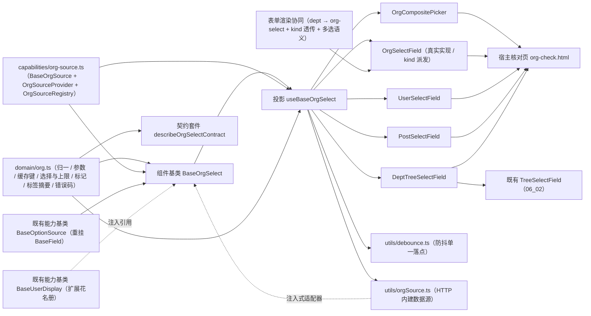

# 01 详细设计 · 组织选择字段

> 前端组件库 · 06 字段类 · 05 组织选择字段（需求 06-5）· 详细设计

[文档首页](../../../../../../文档首页.md) › [06 字段类](../../06_字段类.md) › [05 组织选择字段](../06_字段类_05_组织选择字段.md) › 详细设计　|　[← 任务](../06_字段类_05_组织选择字段.md)

## 1. 设计目标与范围 <a id="goal"></a>

交付[需求 06-5](../../../../需求/06_需求_字段类.md#r06-5) 与[任务 05](../06_字段类_05_组织选择字段.md) 的**组织选择字段族**（五件 + 族基类 + 数据通路）：

- **用户 / 岗位 / 组织选择**：远程搜索（300ms 防抖）、多选（上限 / 去重 / 清空）、只读回显、已删除 / 停用对象占位。
- **部门树选择**：部门树一次性加载、单选 / 多选、路径回显、`include_children` 透传（与权限数据范围口径一致）。
- **组织复合选择**：弹窗承载（左部门树 × 右人员 / 岗位列表 + 搜索 + 已选标签），覆盖[组件设计原型](../../../../../../设计/组件设计/06_字段类/05_组件设计_组织选择字段/05_原型设计_组织选择字段.html)第 ③ 项。
- **数据来源统一走组织主数据出口**：查询与批量回显分列两个出口（`/api/v1/org/users` / `posts` / `dept-tree` / `resolve-names`，后端 `02-4-16` 已交付），批量按 id 回显避免 N+1；数据可见范围与字段脱敏由出口实现侧强制、调用方不可绕过。
- **用户展示统一经用户展示能力基类 `BaseUserDisplay`**（向后兼容扩展成员花名册）。
- **可替换实现走插件基类 + 注册表**：组织数据源经注入式 `OrgSourceAdapter`（未注入即占位零请求）；内建 HTTP 实现经 `BaseOrgSource` / `OrgSourceRegistry` 登记。
- **对外契约不变**：`OrgSelectField` 的导出名与 `06_01` 冻结的 Props / 事件 / 插槽 / `data-test` 保持形状，本次只**向后兼容新增**可选 Props / 事件 / 插槽（变更走版本升级）。

### 1.1 口径与依从 <a id="positioning"></a>

- **架构铁律**：远程搜索、批量回显、缓存、已删除 / 停用占位、多选上限均为**横切功能**，落为**继承链上的基类**（`capabilities/org-select.ts`）与**领域纯函数**（`domain/org.ts`）；具体件只做渲染与交互回传，**不得链外挂接、不得重复实现防抖 / 归一 / 标记分支**。
- **继承链（唯一权威见《[前端基类清单](../../../../../../前端基类清单.md)》）**：`BaseObject → BaseCapability → BasePluggable → BaseComponent`（组件根）→ `BasePlaceholderState` → `BaseValue` → `BaseField` → `BaseOptionSource`（**重挂父基类**，能力基类）→ `BaseOrgSelect`（**新增**组织选择族组件基类）→ 具体件（经投影 `useBaseOrgSelect` 挂链）。
  - **选项源能力入值链**（用户拍板）：`BaseOptionSource` 父基类由 `BaseComponent` 改为 `BaseField`（`depends` 改 `['field']`），使字典 / 组织 / 级联等字段族可经其派生并获得受控值与字段语义；其既有字段与方法（`options` / `loader` / `load` / `dataVersion` / `getLabel` / `search`）**只增不改**。
  - **件族基类承载族编排**：`BaseOrgSelect` 承载组织选择族的状态与编排（`kind` / `keyword` / 部门与状态过滤 / 候选与回显项 / 部门树 / 多选与上限 / 缓存与失效），具体件不重复实现。
- **核心框架无关（强制）**：核心包不得依赖 Vue / DOM / 浏览器 API；数据源以**注入式适配器** `OrgSourceAdapter` 接入，`fetch` / 定时器 / `URLSearchParams` 归 `ui-ep`（`utils/` 单一落点）。
- **取数与交互分离**：**取数归注入式数据源**（`searchUsers` / `searchPosts` / `loadDeptTree` / `resolveNames`）；件**不自行发请求**；**未注入即占位零请求**（保持 `06_01` 冻结口径）。
- **前端先行、通路注入式**：真实 RBAC 取数、数据范围过滤、字段脱敏与权限码（`user:query` / `post:query` / `dept:query`）归**阶段七（RBAC）窗口**；本轮冻结 `OrgSourceAdapter` 契约、领域纯函数与降级分支，`ui-ep` 交付 HTTP 内建数据源（可被宿主登记 / 覆盖），换通路不动组件对外契约。
- **权限与脱敏口径**：数据可见范围与敏感字段（手机号 / 邮箱）由**后端出口实现侧强制注入过滤与掩码**（调用方不可绕过），**前端不二次过滤、不感知明文**；看明文走 `data:plain` 动作权限（后端单点判定），前端只原样展示出口下发值。
- **表单渲染协同（用户拍板 · 全面协同）**：`dept` 字段类型由 `tree-select` 改映 `org-select`（`kind=dept`）；表单渲染器对组织件透传 `kind`（`user` / `post` / `org` → `user` / `post` / `dept`），多选语义键集合纳入 `org-select` 并作为唯一来源复用（消重口径漂移）。
- **i18n**：占位、降级、空态、上限提示等固定文案内置中文并可经 Props 覆盖；业务数据名称 / 脱敏值由接口按 locale 下发。
- **令牌（强制）**：标记色 / 悬停底 / 选中底等走新增 `--bms-org-*` 令牌组；**禁止硬编码色值**。
- **端范围**：**仅 PC**（`frontend/packages/ui-ep`）；移动端本期不落实现，契约套件 `describeOrgSelectContract` 与投影就位供后续同契约多实现。
- **工时**：本任务 12h；因新增 1 个组件基类 + 1 套插件基类 / 注册表、重挂 1 个既有能力基类、扩展 1 个既有能力基类、1 份领域纯函数、1 套契约套件、1 套投影、2 个插件工具与五件组件、1 个核对页及表单渲染协同改动，实际上浮在实施记录登记。

## 2. 交付物清单 <a id="deliver"></a>

| # | 交付物 | 落点 |
| --- | --- | --- |
| 1 | 组织领域纯函数与数据模型（新增） | `core/src/domain/org.ts` |
| 2 | 组织数据源插件基类与注册表（新增） | `core/src/capabilities/org-source.ts` |
| 3 | 选项源能力基类重挂值链（修改：父基类 `BaseComponent` → `BaseField`） | `core/src/capabilities/option-source.ts` |
| 4 | 用户展示能力基类扩展花名册（修改：向后兼容新增） | `core/src/capabilities/user-display.ts` |
| 5 | 组织选择族组件基类 `BaseOrgSelect`（新增，父 `BaseOptionSource`） | `core/src/capabilities/org-select.ts` |
| 6 | 能力依赖登记（修改：`org-select` 新增、`option-source` 依赖改 `field`） | `core/src/capabilities/manifest.ts` |
| 7 | 表单渲染字段映射（修改：`dept` → `org-select`） | `core/src/domain/form-render.ts` |
| 8 | 核心导出面登记（修改） | `core/src/index.ts` |
| 9 | 契约套件 `describeOrgSelectContract`（新增） | `core/testing/org-select.ts`、`core/testing/index.ts` |
| 10 | 核心用例（领域 + 族基类 + 既有基类回归） | `core/tests/domain-org.spec.ts`、`core/tests/org-select.spec.ts` |
| 11 | 组织选择族投影（新增） | `ui-ep/src/composables/useBaseOrgSelect.ts` |
| 12 | 用户展示投影扩展花名册（修改：向后兼容新增） | `ui-ep/src/composables/useBaseUserDisplay.ts` |
| 13 | HTTP 内建组织数据源与注册（新增，`fetch` 单一落点） | `ui-ep/src/utils/orgSource.ts` |
| 14 | 防抖单一落点（新增，定时器统一入口） | `ui-ep/src/utils/debounce.ts` |
| 15 | 组织选择字段（真实实现，保留 `06_01` 冻结契约） | `ui-ep/src/components/field/OrgSelectField.vue` |
| 16 | 人员选择字段（新增） | `ui-ep/src/components/field/UserSelectField.vue` |
| 17 | 岗位选择字段（新增） | `ui-ep/src/components/field/PostSelectField.vue` |
| 18 | 部门树选择字段（新增） | `ui-ep/src/components/field/DeptTreeSelectField.vue` |
| 19 | 组织复合选择弹窗（新增） | `ui-ep/src/components/field/OrgCompositePicker.vue` |
| 20 | 表单渲染协同（修改：透传 `kind` + 多选语义单一来源） | `ui-ep/src/utils/formWidgets.ts`、`ui-ep/src/components/form-render/FormRendererBody.vue` |
| 21 | 导出面登记（五件 + 投影 + 工具 + 类型） | `ui-ep/src/index.ts` |
| 22 | 设计令牌（新增 `--bms-org-*` 组，亮 / 暗两套） | `apps/desktop/src/styles/tokens.scss` |
| 23 | 用例（投影 + 五件 + 工具 + 表单渲染协同） | `ui-ep/tests/field-org-select.spec.ts`、`ui-ep/tests/interaction-form-renderer.spec.ts`（补组织字段分支） |
| 24 | 既有用例同步（`dept` 映射断言） | `core/tests/domain-form-render.spec.ts` |
| 25 | 宿主核对页（`vite build` 不含） | `apps/desktop/org-check.html`、`apps/desktop/src/dev/{orgCheck.ts,OrgCheck.vue}` |
| 26 | 登记回写（基类清单 / 组件设计 / 架构 / 布局令牌 / 计划与状态） | 见第 6 节 |



```text
core/
├── src/
│   ├── domain/
│   │   ├── org.ts                       # 新增：组织领域纯函数与数据模型
│   │   └── form-render.ts               # 修改：FIELD_WIDGET_MAP.dept → org-select
│   └── capabilities/
│       ├── org-source.ts                # 新增：BaseOrgSource / OrgSourceProvider / OrgSourceRegistry
│       ├── org-select.ts                # 新增：组件基类 BaseOrgSelect（父 BaseOptionSource）
│       ├── option-source.ts             # 修改：父基类 BaseComponent → BaseField（depends ['field']）
│       ├── user-display.ts              # 修改：向后兼容新增成员花名册
│       └── manifest.ts                  # 修改：org-select 新增 / option-source 依赖改 field
├── testing/
│   ├── org-select.ts                    # 新增：契约套件 describeOrgSelectContract
│   └── index.ts                         # 修改：新增导出
└── tests/
    ├── domain-org.spec.ts               # 新增：领域纯函数用例
    ├── org-select.spec.ts               # 新增：契约套件 + 族基类用例
    └── domain-form-render.spec.ts       # 修改：dept 映射断言同步

ui-ep/
├── src/
│   ├── components/
│   │   ├── field/
│   │   │   ├── OrgSelectField.vue       # 修改：真实实现（保留 06_01 冻结契约）
│   │   │   ├── UserSelectField.vue      # 新增
│   │   │   ├── PostSelectField.vue      # 新增
│   │   │   ├── DeptTreeSelectField.vue  # 新增
│   │   │   └── OrgCompositePicker.vue   # 新增
│   │   └── form-render/
│   │       └── FormRendererBody.vue     # 修改：kind 透传 + 多选语义单一来源
│   ├── composables/
│   │   ├── useBaseOrgSelect.ts          # 新增：组织选择族投影
│   │   └── useBaseUserDisplay.ts        # 修改：花名册响应式面
│   ├── utils/
│   │   ├── orgSource.ts                 # 新增：HTTP 内建数据源 + 注册表默认实例
│   │   ├── debounce.ts                  # 新增：防抖（定时器统一入口）
│   │   └── formWidgets.ts               # 修改：MULTIPLE_WIDGETS 纳入 org-select
│   └── index.ts                         # 修改：五件 + 投影 + 工具导出
└── tests/
    ├── field-org-select.spec.ts         # 新增：投影 + 五件 + 工具 + 表单渲染协同
    └── interaction-form-renderer.spec.ts # 补组织字段分支

apps/desktop/
├── org-check.html                       # 新增：开发态核对页（不进构建产物）
└── src/
    ├── dev/{orgCheck.ts,OrgCheck.vue}   # 新增：12 项自检上屏
    └── styles/tokens.scss               # 修改：--bms-org-* 令牌组
```

## 3. 接口 / 契约与边界 <a id="contract"></a>

### 3.1 核心：`domain/org.ts`（新增纯函数与数据模型） <a id="domain"></a>

```ts
/** 组织对象类型（与后端 `ORG_TARGETS` 同源）。 */
export const ORG_TARGETS = ['user', 'post', 'dept'] as const
export type OrgKind = (typeof ORG_TARGETS)[number]
/** 组织对象状态（与后端 `ORG_STATUSES` 同源）。 */
export const ORG_STATUSES = ['enabled', 'disabled'] as const
export type OrgStatus = (typeof ORG_STATUSES)[number]
/** 远程搜索防抖（毫秒，组件设计 300ms）。 */
export const ORG_SEARCH_DEBOUNCE = 300
/** 组织列表缺省页长（与后端 `DEFAULT_ORG_PAGE_SIZE` 同源；下拉限制条数）。 */
export const ORG_DEFAULT_PAGE_SIZE = 20
/** 页长上限。 */
export const ORG_PAGE_SIZE_MAX = 100
/** 关键词长度上限（码点）。 */
export const ORG_KEYWORD_MAX = 100
/** 关键词结果短缓存键上限（超出按最早写入淘汰）。 */
export const ORG_CACHE_MAX = 50
/** 标签折叠阈值（超过即折叠为「首项 +N」；≤ 0 不折叠）。 */
export const ORG_TAG_COLLAPSE_DEFAULT = 1
/** 多选上限缺省值（0 = 不限）。 */
export const ORG_LIMIT_DEFAULT = 0
/** 选中回显连接符与空值占位。 */
export const ORG_JOIN = '、'
export const ORG_EMPTY_VALUE = '—'
/** 已删除 / 停用标记（回退展示 id 或名称后缀）。 */
export const ORG_DELETED_MARK = '已删除'
export const ORG_DISABLED_MARK = '停用'
/** 占位 / 空态 / 上限文案。 */
export const ORG_PLACEHOLDER_TEXT = '组织数据未就绪（占位）'
export const ORG_EMPTY_TEXT = '暂无匹配的组织数据'
/** 组织查询错误码文案（30101 ~ 30103，与架构 09 错误码分段同源）。 */
export const ORG_ERROR_TEXTS: Readonly<Record<number, string>> = {
  30101: '组织数据源不可用',
  30102: '不支持的回显目标类型',
  30103: '部门不存在',
}

/** 统一组织选项项（用户 / 岗位 / 部门的展示最小面）。 */
export interface OrgOptionItem {
  id: string
  name: string
  kind: OrgKind
  status: OrgStatus
  /** 已删除（出口 `exists=false`）。 */
  deleted: boolean
  avatar?: string
  username?: string
  phone?: string
  email?: string
  code?: string
  deptId?: string
  deptPath?: string
  sort?: number
}

/** 部门树节点。 */
export interface OrgDeptNode {
  id: string
  name: string
  parentId?: string
  status: OrgStatus
  deleted: boolean
  sort?: number
  children?: OrgDeptNode[]
}

/** 树字段件节点（结构兼容 `TreeSelectField` 的 `TreeFieldNode`）。 */
export interface OrgTreeNode { key: string; label: string; disabled?: boolean; children?: OrgTreeNode[] }

/** 组织选择专用件展示项（`BaseOrgSelect` 常驻内存的回显对象）。 */
export interface OrgItemRef { id: string; name: string; exists?: boolean; status?: string; target?: OrgKind }

normalizeOrgKind(value): OrgKind | undefined
orgKindOfFieldType(fieldType): OrgKind | undefined          // user/post → 同名；org/dept → dept
normalizeOrgStatus(value): OrgStatus                        // 非法回落 enabled
normalizeOrgItem(raw, kind): OrgOptionItem | undefined      // 兼容 snake_case；id 缺失剔除
normalizeOrgItems(raw, kind): OrgOptionItem[]
normalizeOrgDeptTree(raw): OrgDeptNode[]
normalizeOrgNameRefs(raw): OrgOptionItem[]                  // resolve 出口结果归一（exists=false → deleted）
normalizeOrgIds(value, multiple): string[]                  // 受控值归一（去重 / 单值）
applyOrgSelection(current, incoming, options): { ids: string[]; exceeded: boolean }
removeOrgId(ids, id): string[]
mergeOrgItems(base, incoming): OrgOptionItem[]              // 按 id 合并，入参覆盖同名项
findOrgItem(items, id): OrgOptionItem | undefined
orgItemLabel(item): string                                  // 已删除 → 名称（已删除）/ id（已删除）；停用 → 名称（停用）
orgSelectionText(items): string                             // 「、」连接（空 → '—'）
orgTagSummary(items, maxVisible?): { visible: OrgOptionItem[]; overflow: number }
orgKindLabel(kind): string                                  // 用户 / 岗位 / 部门
orgLimitText(kind, limit): string                           // 「最多选择 N 人 / 个岗位 / 个部门」
buildOrgSearchQuery(input): Record<string, unknown>         // keyword / dept_id / include_children / status / page / size
buildOrgResolveQuery(kind, ids): Record<string, unknown>    // target / id_in
parseOrgPage(raw, kind): { items: OrgOptionItem[]; total: number }
parseOrgDeptTree(raw): OrgDeptNode[]
orgCacheKey(kind, query): string
findOrgDeptPath(nodes, id): string[]                        // 「总部 / 研发部」路径
toOrgTreeNodes(nodes): OrgTreeNode[]                        // 树件节点（标签含标记、停用置 disabled）
isBlankOrgKeyword(text): boolean
normalizeOrgKeyword(text, max?): string
clampOrgPage(page): number
clampOrgPageSize(size): number
isOrgErrorCode(code): boolean
resolveOrgErrorText(code): string
```

| 行为 | 口径 |
| --- | --- |
| 归一 | `normalizeOrgItem`：`id` 缺失剔除；`name` 依次取 `nickname` / `name` / `username`（部门 / 岗位取 `name`）、`dept_id` / `parent_id` 兼容 snake_case；`exists === false` 或 `deleted` 视为已删除；`status` 取 `ORG_STATUSES`（非法回落 `enabled`） |
| 批量回显 | `normalizeOrgNameRefs`：未命中 id 以 `deleted=true` 占位（`exists=false`），名称缺失回落 `id`；停用按 `status=disabled` 标记 |
| 受控值 | `normalizeOrgIds`：单选取首值、多选包成数组、去重、空值剔除、统一转字符串 |
| 选择与上限 | `applyOrgSelection`：多选追加去重；`limit > 0` 且超出时截断并置 `exceeded=true`；单选整体替换 |
| 展示 | `orgItemLabel`：已删除 → `名称（已删除）`（名称缺失回落 `id（已删除）`）；停用 → `名称（停用）`；无标记直接用名称（名称缺失回落 `id`）；`orgSelectionText` 以「、」连接、空值「—」；`orgTagSummary` 出可见项与溢出数（供只读折叠展示） |
| 查询参数 | `buildOrgSearchQuery`：`keyword` / `status` / `dept_id` 非空才传，`include_children` 仅在 `dept_id` 非空且为真时传；`page` / `size` 夹取（1 ~ 100）；`buildOrgResolveQuery`：`target` + `id_in`（逗号分隔，与后端 `resolve-names` 同源） |
| 结果解析 | `parseOrgPage`：兼容 `{ list, total }` / `{ items, total }` / 裸数组 / `{ data }` 包装；`total` 非有限值回落条数；`parseOrgDeptTree` 同口径（嵌套 `children`） |
| 缓存键 | `orgCacheKey`：`kind` + 关键查询字段稳定序列化（同输入同键，供关键词短缓存命中） |
| 树与路径 | `toOrgTreeNodes`：标签经 `orgItemLabel`（含标记）、停用节点 `disabled=true`；`findOrgDeptPath` 深度优先返回名称路径（未命中返回空数组，调用方回落 id） |
| 错误码 | `isOrgErrorCode`：`30101` ~ `30103`；`resolveOrgErrorText` 出中文（其余回落「组织数据不可用」） |
| 纯数据 | 不触 DOM、不请求、不依赖渲染框架与第三方库；同输入同输出 |

### 3.2 核心：`capabilities/org-source.ts`（新增插件基类与注册表） <a id="source"></a>

```ts
/** 用户查询入参（与后端 `users(...)` 同形）。 */
export interface OrgUserQuery { keyword?: string; deptId?: string; includeChildren?: boolean; status?: OrgStatus | ''; page?: number; pageSize?: number }
/** 岗位查询入参。 */
export interface OrgPostQuery { keyword?: string; deptId?: string; includeChildren?: boolean; status?: OrgStatus | ''; page?: number; pageSize?: number }
/** 部门树查询入参。 */
export interface OrgDeptTreeQuery { status?: OrgStatus | '' }
/** 批量回显入参。 */
export interface OrgResolveQuery { target: OrgKind; ids: readonly string[] }
/** 组织数据源契约面（方法与 `BaseOrgSource` 一致）。 */
export interface OrgSourceAdapter {
  searchUsers?(query: OrgUserQuery): Promise<unknown>
  searchPosts?(query: OrgPostQuery): Promise<unknown>
  loadDeptTree?(query: OrgDeptTreeQuery): Promise<unknown>
  resolveNames?(query: OrgResolveQuery): Promise<unknown>
}
/** 数据源装载选项。 */
export interface OrgSourceOptions {
  endpoint?: string
  headers?: Record<string, string> | (() => Record<string, string>)
}
/** 组织数据源插件基类（抽象；未覆写的方法返回 `undefined`，即不请求）。 */
export abstract class BaseOrgSource extends BasePluggable implements OrgSourceAdapter {
  readonly pluginKey: string = 'org-source'
  readonly pluginName: string = 'base'
  searchUsers(query: OrgUserQuery): Promise<unknown>
  searchPosts(query: OrgPostQuery): Promise<unknown>
  loadDeptTree(query: OrgDeptTreeQuery): Promise<unknown>
  resolveNames(query: OrgResolveQuery): Promise<unknown>
}
/** 数据源注册项（工厂创建插件实例）。 */
export class OrgSourceProvider extends BaseProvider { readonly key: string; readonly create: (options: OrgSourceOptions) => BaseOrgSource | Promise<BaseOrgSource> }
/** 数据源注册表（统一注册表基座；同键唯一性拒重）。 */
export class OrgSourceRegistry extends BaseProviderRegistry<OrgSourceProvider> { readonly pluginKey = 'org-source-registry'; readonly pluginName = 'core' }
```

| 行为 | 口径 |
| --- | --- |
| 可替换实现（纵向） | 内建 / 定制组织数据源继承 `BaseOrgSource`（`BasePluggable` 派生），经 `OrgSourceRegistry` 登记接入；**未登记 / 未注入即占位零请求** |
| 契约面兼容 | 注入面类型为 `OrgSourceAdapter`（接口），插件基类实现同形方法；换实现不动调用方契约 |
| 未覆写即降级 | 基类方法返回 `Promise.resolve(undefined)`，族基类据此不发请求、不改状态 |
| 查询与回显分列 | 四个方法与后端两出口一一对应（`users` / `posts` / `dept-tree` + `resolve-names`）；**不建通用 `search(kind)`**，避免前后端二次映射 |
| 不含 | 真实取数 / 数据范围过滤 / 脱敏（后端实现侧）、HTTP `fetch` 与端点装配（`ui-ep/src/utils/orgSource.ts`） |

### 3.3 核心：选项源能力基类重挂值链（修改 `capabilities/option-source.ts`） <a id="option-source"></a>

```ts
/** 选项源能力基类（抽象；父基类由 `BaseComponent` 改 `BaseField`——入值链）。 */
export abstract class BaseOptionSource<T = unknown> extends BaseField<T> {
  readonly identifier: string = 'option-source'
  override readonly depends: readonly string[] = ['field']
  // 既有字段与方法保持不变：options / dataVersion / loader / load / getLabel / search
}
```

- **变更性质**：父基类调整 + 依赖登记调整（`manifest.option-source` 由 `[]` 改 `['field']`）；既有字段 / 方法 / 签名**只增不改**，`08_04` / `08_10` 消费方（`useBaseOptionSource` / `SubjectBinding` / `BaseAiAssistant.optionSource`）行为不变，回归以既有用例为准。
- **收益**：选项源能力进入值链，字典（`06_06`）/ 级联 / 组织等字段族可经其派生并获得受控值与字段语义；两条链不再各写一套加载 / 回显。
- **登记**：《前端基类清单》§2.1 第 30 行父基类 `BaseComponent` → `BaseField`、§5.2 能力基类表同步；其余不变。

### 3.4 核心：用户展示能力基类扩展花名册（修改 `capabilities/user-display.ts`） <a id="user-display"></a>

```ts
/** 用户展示信息（既有；向后兼容新增可选 `deleted`）。 */
export interface UserDisplayInfo {
  id: string
  name: string
  avatar?: string
  status?: UserStatus
  deptPath?: string
  /** 已删除（批量回显未命中）。 */
  deleted?: boolean
}

/** 用户 / 组织展示能力基类（既有 + 花名册）。 */
export abstract class BaseUserDisplay extends BaseComponent {
  readonly identifier: string = 'user-display'
  // 既有：user / setUser / name / avatar / status / deptPath 不变
  readonly users: UserDisplayInfo[]                       // 成员花名册（按 id 索引）
  setUsers(users: readonly UserDisplayInfo[]): void        // 整体替换
  mergeUsers(users: readonly UserDisplayInfo[]): void      // 增量合并（同 id 覆盖）
  findUser(id: string): UserDisplayInfo | undefined
  displayOf(id: string): UserDisplayInfo                    // 缺失回退 { id, name: id, deleted: true }
  clearUsers(): void
}
```

- **变更性质**：既有字段 / 方法**只增不改**；投影 `useBaseUserDisplay` 同步补 `users` 响应式面（其余面不变）。
- **与组织族的协作**：`BaseOrgSelect` 以**注入引用**持有 `BaseUserDisplay`（同 `BaseGlobalSearch` 持 `access` / `persisted` 口径），用户类型的已选 / 候选对象经 `mergeUsers` 汇入花名册；姓名 / 头像 / 状态 / 部门路径展示统一经 `displayOf` / `findUser` 解析，不在组织族重复实现。
- **状态映射**：出口 `status`（`enabled` / `disabled`）映射为 `UserStatus`（`enabled → active`、`disabled → disabled`）；`exists=false` → `deleted=true`。

### 3.5 核心：组件基类 `BaseOrgSelect`（新增 `capabilities/org-select.ts`） <a id="base"></a>

```ts
/** 组织选择族组件基类（抽象；父基类 `BaseOptionSource`）。 */
export abstract class BaseOrgSelect extends BaseOptionSource<string | string[]> {
  override readonly identifier: string = 'org-select'
  override readonly depends: readonly string[] = ['option-source', 'user-display']
  ready = false                                       // 数据通路是否就绪（占位语义，缺省未就绪）
  kind: OrgKind = 'user'
  keyword = ''
  deptId = ''
  includeChildren = false
  status: OrgStatus | '' = ''
  multiple = false
  limit: number = ORG_LIMIT_DEFAULT
  readonly items: OrgOptionItem[]                     // 候选 + 已选富对象（常驻内存，按 id 合并）
  readonly deptNodes: OrgDeptNode[]                   // 部门树（kind=dept 或复合弹窗）
  limitExceeded = false
  errorCode: number | undefined
  errorMessage = ''
  source: OrgSourceAdapter | undefined                // 注入式数据源（未注入即占位零请求）
  userDisplay: BaseUserDisplay | undefined            // 用户展示能力（注入引用）

  get degraded: boolean                               // 继承（!ready）
  get loadingItems: boolean                           // 加载中
  get error: boolean
  get empty: boolean
  get isDeptKind: boolean
  get selectedIds: string[]
  get selectedItems: OrgOptionItem[]                  // 已选（含未解析占位）
  get canLoad: boolean

  setSource(source: OrgSourceAdapter | undefined): void
  setUserDisplay(display: BaseUserDisplay | undefined): void
  setKind(kind: OrgKind): void                        // 变更清空候选 / 缓存 / 部门树
  setKeyword(keyword: string): void
  setDeptFilter(deptId: string, includeChildren?: boolean): void
  setStatus(status: OrgStatus | ''): void
  setMultiple(value: boolean): void
  setLimit(limit: number): void
  setValue(value): void                               // 继承（受控值）
  toggle(id: string): void                            // 多选增删 / 单选替换（含上限判定）
  remove(id: string): void
  clearSelection(): void
  override async load(): Promise<void>                // 远程加载（kind 派发；缓存命中不请求）
  async resolve(ids?: readonly string[]): Promise<void>   // 批量按 id 回显（单次批量出口）
  async loadDeptTree(): Promise<void>                 // 部门树一次性加载
  itemOf(id: string): OrgOptionItem | undefined
  labelOf(id: string): string
  selectionText(): string
  tagSummary(maxVisible?: number): { visible: OrgOptionItem[]; overflow: number }
  limitText(): string
  invalidate(kind?: OrgKind): void                    // 失效缓存（数据变更 / 切换类型后调用）
  syncUserDisplay(): void                             // 用户类型花名册汇入
}
```

| 行为 | 口径 |
| --- | --- |
| 占位语义 | `ready === false` → `degraded` 为真；`load` / `resolve` / `loadDeptTree` **零请求**（`requestCount` 恒 0），保持 `06_01` 冻结口径（`describePlaceholderFieldContract` 断言不变即通过） |
| 就绪与数据源 | 三者同时满足才请求：`ready` ∧ 数据源注入 ∧ 对应方法存在；请求前 `markLoaded()` 计数 |
| 远程搜索 | `load()`：`kind=user` → `searchUsers`、`post` → `searchPosts`、`dept` → `loadDeptTree`；查询经 `buildOrgSearchQuery`（`keyword` / `dept_id` / `include_children` / `status` / `page` / `size`），结果经 `parseOrgPage` 归一；**空关键词请求首屏**（展开即请求，同「不展开不请求」互补） |
| 缓存 | **关键词结果短缓存**：`orgCacheKey` 命中即复用（不请求、计数不变），键数超 `ORG_CACHE_MAX` 按最早写入淘汰；**已选对象常驻**：`resolve` 结果合并进 `items` 且不随候选刷新清空；**部门树缓存**：`deptNodes` 会话内共享，`invalidate('dept')` 精准失效 |
| 批量回显 | `resolve(ids)`：一次 `resolveNames` 批量取名称（**避免 N+1**），未命中 id 生成 `deleted=true` 占位；已解析项合并进 `items`；**竞态**以请求序号防旧响应覆盖 |
| 多选与上限 | `toggle(id)`：多选增删（去重）；`limit > 0` 超出时截断并置 `limitExceeded`（供件层提示 `limitText()`）；单选替换；`remove` / `clearSelection` 同步受控值 |
| 展示 | `labelOf(id)`：命中 → `orgItemLabel(item)`（含「已删除」/「停用」标记）；未命中且未解析 → 回退 `id`（解析后按出口结果标记）；`selectionText` / `tagSummary` 供只读回显与折叠展示 |
| 用户展示 | `syncUserDisplay()`：`kind=user` 时把 `items` 映射 `UserDisplayInfo` 经 `mergeUsers` 汇入花名册；已加载部门树时补 `deptPath` |
| 错误 | 数据源抛错 → `errorCode`（兼容 `code` / `errorCode`）+ `resolveOrgErrorText`；`reportError` 记录；件层展示提示与重试入口 |
| 失效 | `invalidate()` 清关键词缓存；`invalidate('dept')` 另清部门树；`setKind` / `setDeptFilter` / `setStatus` 内部失效对应缓存 |
| 释放 | 随 `BaseComponent` 释放清空缓存与监听；在途请求以序号丢弃结果（不写状态） |
| 纯数据 | 不触 DOM、不请求；`source` 为接口注入，核心不 import 任何浏览器 API |

- 依赖登记：`org-select: ['option-source', 'user-display']`；`option-source: ['field']`。
- 不含：真实取数 / 数据范围 / 脱敏（后端）、`fetch` 与端点装配（`ui-ep` 数据源工具）、具体件渲染、路由与宿主装配。

### 3.6 核心：契约套件 `describeOrgSelectContract`（`@bms/core/testing`） <a id="testing"></a>

| 契约面（结构化接口） | 断言要点 |
| --- | --- |
| `ready` / `degraded` / `requestCount` / `kind` / `items` / `deptNodes` / `selectedIds` / `limitExceeded` / `errorCode` | 占位零请求（`load` / `resolve` / `loadDeptTree` 后仍为 0）；未注入数据源仍零请求；就绪后不再降级 |
| `setSource` / `setKind` / `setKeyword` / `setDeptFilter` / `setStatus` / `setMultiple` / `setLimit` / `setValue` / `load` / `resolve` / `loadDeptTree` / `toggle` / `remove` / `clearSelection` / `invalidate` / `labelOf` / `selectionText` / `limitText` | 用户 / 岗位 / 部门三类派发；查询参数（`dept_id` / `include_children` / `status`）透传；关键词结果缓存命中不重复请求；批量回显单请求（`resolveNames` 一次）；已删除 / 停用标记与 id 回退；多选去重与上限截断；失效后重新请求；错误码与错误态 |

- 契约目标约定：用户 `u1`（启用）/ `u2`（停用）；岗位 `p1`；部门树两节点；回显 `u1` 命中、`u9` 未命中（`exists=false`）；数据源为**桩实现**（记录调用轨迹并返回契约常量），核心与 `ui-ep` 用例共用同一套断言（「同契约多实现」）。
- 复用 `describePlaceholderFieldContract`（`06_01` 冻结）：真实实现继续跑同一套件，断言不改动即通过。

### 3.7 插件层：投影 `useBaseOrgSelect`（新增） <a id="projection"></a>

```ts
/** `useBaseOrgSelect` 选项。 */
export interface UseBaseOrgSelectOptions {
  ready?: boolean
  kind?: OrgKind
  multiple?: boolean
  limit?: number
  value?: OrgFieldValueLike
  keyword?: string
  deptId?: string
  includeChildren?: boolean
  status?: OrgStatus | ''
  source?: OrgSourceAdapter
  userDisplay?: BaseUserDisplay
  disabled?: boolean
}
/** `useBaseOrgSelect` 返回面（核心方法一一对应的响应式面）。 */
export interface UseBaseOrgSelectResult {
  select: BaseOrgSelect
  ready: Ref<boolean>
  degraded: Ref<boolean>
  disabled: ComputedRef<boolean>          // 件级禁用 ∨ 占位（占位必禁用）
  requestCount: Ref<number>
  value: Ref<string | string[] | undefined>
  items: Ref<OrgOptionItem[]>
  selectedIds: ComputedRef<string[]>
  selectedItems: ComputedRef<OrgOptionItem[]>
  deptNodes: Ref<OrgDeptNode[]>
  keyword: Ref<string>
  loading: Ref<boolean>
  error: Ref<boolean>
  errorText: Ref<string>
  empty: Ref<boolean>
  limitExceeded: Ref<boolean>
  setReady(value: boolean): void
  setSource(source: OrgSourceAdapter | undefined): void
  setUserDisplay(display: BaseUserDisplay | undefined): void
  setKind(kind: OrgKind): void
  setKeyword(keyword: string): void
  setDeptFilter(deptId: string, includeChildren?: boolean): void
  setStatus(status: OrgStatus | ''): void
  setMultiple(value: boolean): void
  setLimit(limit: number): void
  setValue(value: OrgFieldValueLike): void
  toggle(id: string): void
  remove(id: string): void
  clearSelection(): void
  load(): Promise<void>
  resolve(ids?: readonly string[]): Promise<void>
  loadDeptTree(): Promise<void>
  invalidate(kind?: OrgKind): void
  labelOf(id: string): string
  selectionText(): string
  tagSummary(maxVisible?: number): { visible: OrgOptionItem[]; overflow: number }
  limitText(): string
  onValueChange(listener: (value) => void): () => void
}
```

- 薄适配（核心实例 ↔ Vue 响应式），不含判定逻辑；`onLifecycle('update')` → `sync()`；`onScopeDispose` 解除订阅并 `select.dispose()`。
- **用户展示装配**：内部经 `BaseUserDisplay` 具体实现创建花名册实例并 `select.setUserDisplay(...)`（同 `useBaseSearch` 内建 `BasePersistedState` 通道口径）；调用方也可传入自有实例覆盖。
- **防抖归件层**：投影不持定时器；件层按 `ORG_SEARCH_DEBOUNCE` 经 `utils/debounce.ts` 调度 `load()`。

### 3.8 插件层：工具（新增） <a id="utils"></a>

```ts
// ui-ep/src/utils/orgSource.ts
/** 链路内默认组织数据源注册表实例（宿主可登记定制实现或覆盖内建键）。 */
export const orgSourceRegistry: OrgSourceRegistry
/** 登记组织数据源实现。 */
export function registerOrgSource(key: string, create: (options: OrgSourceOptions) => BaseOrgSource | Promise<BaseOrgSource>): void
/** 创建 HTTP 内建组织数据源（`fetch` 单一落点；未覆盖的方法不请求）。 */
export function createHttpOrgSource(options?: OrgSourceOptions): BaseOrgSource

// ui-ep/src/utils/debounce.ts
/** 防抖包装（定时器统一入口；组件不得直用 `setTimeout` 调度远程搜索）。 */
export function debounce<T extends unknown[]>(fn: (...args: T) => void, wait: number): { (...args: T): void; cancel(): void }
```

| 行为 | 口径 |
| --- | --- |
| HTTP 数据源 | `createHttpOrgSource`：`fetch(`${endpoint}/org/users|posts|dept-tree|resolve-names`, { headers, signal })`；查询参数经 `buildOrgSearchQuery` / `buildOrgResolveQuery` 单一来源 + `URLSearchParams` 拼接；响应统一解 `{code, message, data}`（无包装原样返回）；`fetch` 不可用（测试 / SSR）→ 返回 `undefined` 降级（不抛错） |
| 注册默认键 | `registerOrgSource('http', createHttpOrgSource)`（同图表引擎 `'echarts'` / 检索引擎 `'http'` 口径） |
| 落点 | **浏览器 API（`fetch` / `URLSearchParams` / 定时器）只出现在 `utils/`**，核心与投影判定逻辑不触 DOM |

### 3.9 插件层：件族（`ui-ep/src/components/field/`） <a id="components"></a>

#### 3.9.1 `OrgSelectField.vue`（真实实现 · 保留 `06_01` 冻结契约） <a id="c-org"></a>

**对外导出名与既有 Props / 事件 / 插槽 / `data-test` 不变**，仅向后兼容新增。

| 面 | 内容 |
| --- | --- |
| Props（既有，保持） | `modelValue` / `ready`（缺省 `false`）/ `options` / `multiple`（缺省 `true`）/ `disabled` / `placeholder`（缺省「请选择组织」）/ `degradeText` |
| Props（新增，全部可选） | `kind`（缺省 `user`）/ `searchable`（缺省 `true`，补齐 `06_01` 契约表已登记项）/ `source` / `userDisplay` / `limit`（缺省 0）/ `status` / `deptId` / `includeChildren` / `readonly` / `required` / `errorMessage` / `emptyText` / `collapseAfter`（缺省 1）/ `showAvatar` / `showCode` |
| 事件（既有，保持） | `update:modelValue` / `change` |
| 事件（新增） | `retry` / `invalid`（校验文案）/ `limit-exceed`（limit）/ `update:deptId` / `update:includeChildren` |
| 插槽（既有，保持） | `degrade` |
| 插槽（新增） | `empty` / `option`（作用域 `{ item }`）/ `prefix` |
| `data-test`（既有，保持） | `placeholder`（降级文案含「组织数据未就绪」） |
| `data-test`（新增） | `org-select` / `org-option-{id}` / `org-option-user` / `org-readonly` / `org-tag-overflow` / `org-marker-deleted` / `org-marker-disabled` / `org-error` / `org-retry` / `org-empty` |

- **就绪态渲染**：`kind=dept` → 内聚 `DeptTreeSelectField`；`kind=user|post` 且注入数据源 → 远程 `el-select`（`multiple` / `filterable` / `remote-method` 防抖 / `collapse-tags` + `max-collapse-tags`）；**仅传 `options` 未注入数据源** → 沿用 `SelectInput` 静态路径（保持 `06_01` 就绪语义）。
- **占位语义**：`ready !== true` → 降级 + 禁用 + 不发请求（保持 `06_01` 冻结口径与 `data-ready` / `data-degraded`）。
- **展开才请求**：`visible-change` 打开且候选为空时 `load()`；有受控值时挂载即 `resolve(ids)` 批量回显（符合「不展开不请求、已有值才回填」）。
- **只读回显**：`readonly` 时以 `selectionText`（多选经 `tagSummary` 折叠「首项 +N」）展示，空值「—」，不产生新请求（沿用已解析 `items`）。
- **脱敏**：展示出口下发的 `phone` / `email` 原样渲染（掩码由后端实现侧强制），**前端不加工明文**。

#### 3.9.2 `UserSelectField.vue`（新增 · 人员选择） <a id="c-user"></a>

| 面 | 内容 |
| --- | --- |
| Props | `modelValue` / `ready` / `source` / `userDisplay` / `multiple`（缺省 `true`）/ `limit` / `deptId` / `includeChildren` / `status`（缺省 `''`）/ `showAvatar` / `searchable`（缺省 `true`）/ `disabled` / `readonly` / `placeholder`（缺省「请选择人员」）/ `degradeText` / `errorMessage` / `emptyText` |
| 事件 | `update:modelValue` / `change` / `retry` / `limit-exceed` |
| 插槽 | `degrade` / `empty` / `option` |
| `data-test` | `user-select-field` / `user-option-{id}` / `user-avatar` / `user-readonly` / `placeholder` |

- `kind=user` 预设；按部门过滤（`deptId` + `includeChildren`，联动部门树字段由页面装配）；下拉展示头像（`showAvatar`）与昵称；已删除 / 停用标记复用族基类。

#### 3.9.3 `PostSelectField.vue`（新增 · 岗位选择） <a id="c-post"></a>

| 面 | 内容 |
| --- | --- |
| Props | `modelValue` / `ready` / `source` / `multiple`（缺省 `true`）/ `limit` / `deptId` / `includeChildren` / `status` / `showCode`（缺省 `true`）/ `searchable` / `disabled` / `readonly` / `placeholder`（缺省「请选择岗位」）/ `degradeText` / `errorMessage` / `emptyText` |
| 事件 | `update:modelValue` / `change` / `retry` / `limit-exceed` |
| 插槽 | `degrade` / `empty` / `option` |
| `data-test` | `post-select-field` / `post-option-{id}` / `post-code` / `post-readonly` / `placeholder` |

- `kind=post` 预设；下拉展示「名称（编码）」（`showCode`）；状态过滤；标记与批量回显复用族基类。

#### 3.9.4 `DeptTreeSelectField.vue`（新增 · 部门树选择） <a id="c-dept"></a>

| 面 | 内容 |
| --- | --- |
| Props | `modelValue` / `ready` / `source` / `multiple` / `status` / `includeChildren` / `showIncludeChildren`（缺省 `false`）/ `searchable`（缺省 `true`）/ `disabled` / `readonly` / `placeholder`（缺省「请选择部门」）/ `degradeText` / `errorMessage` / `emptyText` |
| 事件 | `update:modelValue` / `change` / `update:includeChildren` / `retry` |
| 插槽 | `degrade` / `empty` / `readonly` |
| `data-test` | `dept-tree-select-field` / `dept-include-children` / `dept-readonly` / `dept-retry` / `placeholder` |

- **数据来源**：族基类 `loadDeptTree()` 一次性加载（会话缓存），经 `toOrgTreeNodes` 映射为树件节点（停用置 `disabled`、标签含标记）。
- **编辑态**复用 `TreeSelectField`（`06_02`）承载树语义（单选 / 多选 / 过滤 / 懒加载能力保持）；**只读态**以 `findOrgDeptPath` 出「总部 / 研发部」路径，未命中回退 `labelOf`（含「已删除」标记）。
- **数据范围口径**：前端不二次过滤（可见范围由出口实现侧强制）；`includeChildren` 仅作查询参数透传（`showIncludeChildren` 时以勾选框呈现，查询区用法）。

#### 3.9.5 `OrgCompositePicker.vue`（新增 · 组织复合选择弹窗） <a id="c-composite"></a>

| 面 | 内容 |
| --- | --- |
| Props | `visible` / `modelValue` / `kind`（缺省 `user`）/ `multiple`（缺省 `true`）/ `limit` / `ready` / `source` / `userDisplay` / `title`（缺省「选择人员」）/ `pageSize`（缺省 20）/ `placeholder` / `degradeText` / `emptyText` |
| 事件 | `update:visible` / `update:modelValue` / `change` / `confirm` / `cancel` / `retry` / `limit-exceed` |
| 插槽 | `degrade` / `footer` / `empty` / `option` |
| `data-test` | `org-composite-picker` / `composite-tree` / `composite-tree-node-{id}` / `composite-search` / `composite-row-{id}` / `composite-check-{id}` / `composite-tag-{id}` / `composite-tag-overflow` / `composite-confirm` / `composite-cancel` / `composite-page-prev` / `composite-page-next` / `composite-empty` |

- **布局**：左侧部门树（`deptNodes`，加载后默认展开首层）+ 右侧列表（搜索防抖 / 勾选 / 上 / 下页）；底部已选标签（可移除、超阈值折叠「+N」）。
- **受控语义**：打开时快照当前值；弹窗内选择即时更新标签，**确认**后回填受控值并上抛 `change` / `confirm`，**取消**恢复快照并上抛 `cancel`；关闭（`update:visible false`）不隐式提交。
- **上限**：超出 `limit` 时不勾选并上抛 `limit-exceed`（提示 `limitText()`）。
- **取数**：列表经族基类 `load()`（`setDeptFilter` 联动树点击）；搜索经 `utils/debounce.ts`；未就绪 / 未注入数据源降级不发请求。

### 3.10 表单渲染协同（修改 `08_06` 已交付件） <a id="form-render"></a>

| 变更点 | 内容 |
| --- | --- |
| 字段类型映射 | `core/src/domain/form-render.ts`：`FIELD_WIDGET_MAP.dept` 由 `'tree-select'` 改 `'org-select'`（部门字段统一走组织件与组织数据源；`tree` 泛型树类型维持 `tree-select` 不变） |
| 多选语义单一来源 | `ui-ep/src/utils/formWidgets.ts`：`MULTIPLE_WIDGETS` 纳入 `'org-select'`；`FormRendererBody.vue` 的 `isMultiple` 改为**复用 `MULTIPLE_WIDGETS`**（删除件内重复清单，防两处漂移） |
| 类型透传 | `FormRendererBody.vue` 新增 `extraProps(field)`（`org-select` → `{ kind: orgKindOfFieldType(field.base.type) }`，其余为空对象），模板对两个字段渲染点 `v-bind` 透传；`kind` 映射（`user` → `user`、`post` → `post`、`org` / `dept` → `dept`）落核心 `domain/org.ts` 的 `orgKindOfFieldType` |
| 回归 | `core/tests/domain-form-render.spec.ts` 的 `dept` 映射断言同步为 `org-select`；`ui-ep/tests/interaction-form-renderer.spec.ts` 补组织字段分支（`kind` 透传与多选） |
| 口径 | `08_06` 任务文档补「协同契约（06_05 已交付）」注块；变更属**向后兼容**（字段类型→控件语义键映射调整，件对外契约不变） |

### 3.11 导出面 <a id="exports"></a>

- `core/src/index.ts`：新增 `domain/org`（常量 / 类型 / 纯函数）、`capabilities/org-source`（`BaseOrgSource` / `OrgSourceProvider` / `OrgSourceRegistry` / `OrgSourceAdapter` / `OrgSourceOptions` 及查询类型）、`capabilities/org-select`（`BaseOrgSelect`）；`option-source` / `user-display` 既有导出不变（新增花名册类型面随原导出）。
- `core/testing/index.ts`：新增 `describeOrgSelectContract` 导出。
- `ui-ep/src/index.ts`：新增 `UserSelectField` / `PostSelectField` / `DeptTreeSelectField` / `OrgCompositePicker` 与各自类型；`OrgSelectField`（`OrgFieldValue`）导出路径与名字不变；新增 `useBaseOrgSelect` / `orgSource` / `debounce` 导出。
- 机器护栏对账：`ui-ep/tests/guard-component-inheritance.spec.ts`（五件均实质挂链）、`core/tests/guard-manifest.spec.ts`（`org-select` 新增与清单 / 代码一致，`option-source` 依赖改 `field`）、`guard-jsdoc.spec.ts`（新增导出与类成员 JSDoc 齐备）、`guard-core-framework-agnostic.spec.ts`（核心零框架 / 浏览器 API）、`ui-ep/tests/guard-single-source.spec.ts`（组件不直用持久化 / 浏览器能力 / 第三方库）、`ui-ep/tests/guard-tokens.spec.ts`（无硬编码色值）。

### 3.12 设计令牌（新增） <a id="tokens"></a>

`apps/desktop/src/styles/tokens.scss` 新增（亮色 `:root` 与暗色 `[data-theme='dark']` 两套）：

```scss
:root {
  --bms-org-option-hover-bg: #f5f7fa;              // 下拉候选悬停底
  --bms-org-option-selected-bg: #ecf5ff;           // 已选项底
  --bms-org-tag-bg: #f5f7fa;                       // 已选标签底
  --bms-org-marker-deleted-color: #909399;         // 「已删除」标记字
  --bms-org-marker-disabled-color: #e6a23c;        // 「停用」标记字
  --bms-org-panel-bg: var(--bms-color-bg);         // 弹窗面板底
  --bms-org-border: var(--bms-color-border);       // 面板分隔线
}
```

- 暗色仅覆盖对比度相关项；**令牌只增不改**，既有令牌不变；登记《[布局设计 · 设计令牌](../../../../../../设计/布局设计/02_布局设计_设计令牌.html)》。

### 3.13 宿主核对页 <a id="check"></a>

`apps/desktop/org-check.html` + `src/dev/{orgCheck.ts,OrgCheck.vue}`（`vite build` 只构建 `index.html`，核对页不进产物）。自检项 12 项：

1. 占位降级与就绪切换（未注入 / 未就绪零请求，`requestCount` 恒 0）；
2. 远程搜索防抖（300ms 内多次输入仅一次请求，桩数据源计数）；
3. 用户多选上限（`limit=5` 第 6 项被拒 + `limit-exceed` 提示）；
4. 标签折叠（超过阈值折叠「首项 +N」，悬浮展开）；
5. 批量回显（旧值 id 一次批量解析、缓存命中不重复请求）；
6. 已删除 / 停用对象占位（`名称（已删除）` / `名称（停用）` / 未命中回退 `id（已删除）`）；
7. 部门过滤 + 含下级（`dept_id` / `include_children` 进查询参数并回显）；
8. 岗位选择（编码展示、状态过滤）；
9. 部门树选择（一次性加载、路径回显、`include_children` 透传）；
10. 组织复合选择（弹窗部门树 × 列表、搜索、勾选、标签移除、确认回填 / 取消恢复）；
11. 脱敏展示（手机号 / 邮箱按出口下发值原样展示，前端不加工）；
12. 数据源可替换（注册表默认键 `http` 与自定义实现登记 / 覆盖；错误码 30101 提示与重试）。

以 chromium headless `--dump-dom` 核验全部自检项；异步与防抖相关项以 `CDP 轮询` 等待到位后再断言。

## 4. 失败分支与边界 <a id="edge"></a>

| 边界 / 失败场景 | 处置 |
| --- | --- |
| 数据通路未就绪（`ready` 为假） | 占位：降级 + 禁用 + 零请求（保持 `06_01` 冻结口径） |
| 数据源未注入 / 未覆写方法 | 不请求；候选为空、空态提示；无错误态 |
| 未展开下拉 | 不请求候选；有受控值时才触发批量回填 |
| 关键词为空 | 允许请求首屏（展开触发）；缓存键含空关键词 |
| 关键词超长 | `normalizeOrgKeyword` 按 `ORG_KEYWORD_MAX` 截断（码点） |
| 远程搜索失败 | 内联错误 + 重试入口（`retry`）；保留已选与既有候选（不闪空） |
| 批量回显失败 | 保留受控值；标签回退 `id`；错误提示与重试；不阻塞页面 |
| 已删除对象 | 出口 `exists=false` → `名称（已删除）`（名称缺失 `id（已删除）`）；不可选（候选剔除） |
| 停用对象 | `status=disabled` → `名称（停用）`；下拉项禁用、已选保留并标记 |
| 多选超上限 | `limit > 0` 超出截断 + `limitExceeded` + `limitText()` 提示（`limit-exceed` 上抛） |
| 重复选择同一 id | 去重（不重复追加） |
| 单选收到数组 / 多选收到单值 | `normalizeOrgIds` 归一（取首值 / 包成数组），不静默丢值 |
| 部门树加载失败 | 错误态 + 重试；保留已选路径回退（id / 名称） |
| 部门已删除 / 移出可见范围 | 未命中路径 → 回退 `labelOf(id)`（含标记） |
| 部门过滤 + 含下级 | `dept_id` + `include_children=true` 透传；子树展开由出口实现侧完成 |
| 无数据范围权限 | 出口返回裁剪后的数据（前端不二次过滤、不感知越权内容） |
| 数据源返回脏项 | 归一剔除（缺 `id`）；`total` 非有限值回落条数 |
| 请求竞态 | 序列号防旧响应覆盖（同 `BaseDataState` 口径） |
| 缓存不一致 | 数据变更后 `invalidate(kind)` 主动失效；失效后重新请求 |
| 表单渲染 `dept` 字段 | 映射 `org-select` + `kind=dept`；多选语义由 `MULTIPLE_WIDGETS` 单一来源判定 |
| 弹窗取消 / 关闭 | 恢复打开时快照，不隐式提交；确认才回填受控值 |
| 移动端 | 本期不落实现；契约套件 `describeOrgSelectContract` 与投影就位供同契约多实现 |
| 释放 | `onScopeDispose` 解绑订阅并释放实例；在途响应按序号丢弃（防泄漏 / 脏写） |

## 5. 测试设计与验收映射 <a id="test"></a>

| 验收点（需求 06-5 / 任务 05） | 用例 |
| --- | --- |
| 归一（用户 / 岗位 / 部门 / 回显引用）、受控值归一、选择与上限、查询参数、结果解析、缓存键、标签摘要、路径与树节点、错误码 | `core/tests/domain-org.spec.ts` |
| 族基类：占位零请求、数据源注入与就绪、三类派发与查询参数、缓存命中、批量回显与标记、多选上限、失效、错误与竞态、用户展示汇入 | `core/tests/org-select.spec.ts` + `describeOrgSelectContract` |
| 契约套件（同契约多实现） | `describeOrgSelectContract`（核心 + `ui-ep` 适配） |
| 投影薄适配（响应式面与同步、花名册装配、销毁） | `ui-ep/tests/field-org-select.spec.ts` |
| 五件真实实现：`OrgSelectField` 冻结契约保持 + `kind` 派发、`UserSelectField`（多选 / 上限 / 头像 / 部门过滤）、`PostSelectField`（编码 / 状态）、`DeptTreeSelectField`（树加载 / 路径回显 / 含下级）、`OrgCompositePicker`（树 × 列表 / 搜索 / 勾选 / 确认回填 / 取消恢复） | 同上 |
| 工具（HTTP 数据源：成功 / `{code,message,data}` 解包 / 不可用降级；注册表登记与覆盖；防抖） | 同上 |
| 表单渲染协同（`dept` → `org-select`、`kind` 透传、多选语义） | `core/tests/domain-form-render.spec.ts`、`ui-ep/tests/interaction-form-renderer.spec.ts` |
| 既有能力基类回归（选项源重挂后 `08_04` / `08_10` 消费方行为不变） | `core/tests/capabilities-batch3.spec.ts`、`core/tests/ai-assistant.spec.ts`、`ui-ep/tests/interaction-placeholder-3.spec.ts` |
| 能力登记对账（`org-select` 新增 ↔ manifest ↔ 基类清单） | `core/tests/guard-manifest.spec.ts` |
| 注释齐备、核心框架无关、组件挂链、单一落点、令牌消费 | `guard-jsdoc.spec.ts`、`guard-core-framework-agnostic.spec.ts`、`guard-component-inheritance.spec.ts`、`guard-single-source.spec.ts`、`guard-tokens.spec.ts` |
| 开发态核对页 12 项自检 | chromium headless `--dump-dom` |
| `vue-tsc`、ESLint、Vitest 全通过 | 根 `npm run check` + 宿主 `vue-tsc -b` / `lint` / `test:cov` / `build` / `budget` |
| 文档链接与基座校验 | `check-links.py`、`check-base.py`、`check-status.py --stage 04_前端组件库` |

- 既有 `ui-ep/tests/field-placeholder.spec.ts`（`06_01` 冻结契约）**不得改动**，须原样通过（`OrgSelectField` 占位降级 / 禁用 / 零请求断言保持）。
- Kiwi 用例 1 条（一任务一条，编号于测试步登记后回填；分类「平台骨架」、优先级 P2、状态 `CONFIRMED`、标签「自动化」）。

## 6. 登记落点 <a id="register"></a>

| 内容 | 落点 |
| --- | --- |
| 新增组件基类 `BaseOrgSelect`（能力键 `org-select`，父 `BaseOptionSource`，依赖 `option-source` / `user-display`） | 《[前端基类清单](../../../../../../前端基类清单.md)》§2.1 全量基类登记表插入行（组件侧 · 组件基类，「已交付」）+ §2 继承链总览 + §5.3 组件基类表 + `capabilities/manifest.ts` |
| 既有能力基类 `BaseOptionSource` 父基类调整（`BaseComponent` → `BaseField`；`depends ['field']`） | 同上 §2.1 第 30 行父亲列 + §5.2 能力基类表 + `capabilities/manifest.ts` |
| 新增插件基类 / 注册项 / 注册表 `BaseOrgSource` / `OrgSourceProvider` / `OrgSourceRegistry` | 同上 §4「插件基类族与注册表」表（可替换实现 / 各域注册表） |
| 领域纯函数与数据模型 `domain/org.ts` | 同上 §9「核心」（`domain/` 领域纯函数） |
| 契约套件 `describeOrgSelectContract` | 同上 §9（`core/testing/`） |
| 投影 `useBaseOrgSelect`、件族五件（`components/field/`）、工具 `utils/orgSource.ts` / `utils/debounce.ts` | 同上 §9「PC 插件」（组件目录与 `composables/`、`utils/` 清单） |
| 设计令牌 `--bms-org-*` 组 | 《[布局设计 · 设计令牌](../../../../../../设计/布局设计/02_布局设计_设计令牌.html)》（登记项）；`apps/desktop/src/styles/tokens.scss` |
| **组件设计口径回写** | 《[组件设计 · 组织选择字段](../../../../../../设计/组件设计/06_字段类/05_组件设计_组织选择字段/05_组件设计_组织选择字段.md)》§3 / §10：数据来源改「组织主数据出口」（`/api/v1/org/*` 两出口、查询与批量回显分列、数据范围与脱敏实现侧强制）；《[组件设计 · 选项源能力](../../../../../../设计/组件设计/02_基础组件类/02_能力类/12_组件设计_选项源能力/12_组件设计_选项源能力.md)》§1：父基类表述改引用《前端基类清单》（能力入值链口径） |
| 架构设计同步 | 《[架构设计 · 子系统 · 权限计算引擎](../../../../../../设计/架构设计/15_架构设计_子系统_权限计算引擎.md)》§2「组织主数据读出口」行补前端落地（引用本设计）；《[架构设计 · 前端组件体系](../../../../../../设计/架构设计/05_架构设计_前端组件体系.md)》§6 取数与缓存协作按本节点落地标注 |
| 任务 / 父任务 / 域任务 / 计划与状态 | [任务](../06_字段类_05_组织选择字段.md)、[父任务](../../06_字段类.md)（子任务清单状态 / 完成日期 / 关键依赖）、[计划](../../../../计划/01_计划_前端组件库.md)（`06_05` 由「搁置（阶段七窗口）」改「阶段四窗口内推进（前端先行、通路注入式）」并入 §2；§1 域 06 与工时台账、§3 剩余表、§4 甘特、§5 M4 门禁同步） |
| 协同契约（消费方标注） | `08_06` 表单设计器与渲染器任务文档（`dept` 映射 / `kind` 透传 / 多选语义单一来源）；`06_06` 字典字段任务文档（选项源能力入值链，可选继承其派生） |
| 需求文档 | 不承载进度（状态只在任务与计划两处一致）；遗留归口写在实施 / 测试记录与计划 |

## 7. 边界与开放项 <a id="open"></a>

- **不在本期**：真实 RBAC 取数、数据范围过滤、字段脱敏与权限码（`user:query` / `post:query` / `dept:query`）、`data:plain` 明文查看（归阶段七窗口）；宿主「组织相关 store」版数据源实现（经 `OrgSourceRegistry` 登记接入，接口就位）；移动端实现（契约套件与投影就位）。
- **协同契约**：`GET /api/v1/org/users`（`keyword` / `dept_id` / `include_children` / `status` / `page` / `size`）、`GET /api/v1/org/posts`（同上）、`GET /api/v1/org/dept-tree`（`status`，不分页）、`GET /api/v1/org/resolve-names`（`target` / `id_in`）；错误码 `30101` ~ `30103`（与架构 09 错误码分段一致）。
- **与 `06_01` 协同**：件名与对外契约由 `06_01` 冻结，本次只向后兼容新增；`describePlaceholderFieldContract` 由真实实现继续复用；补齐 `searchable` prop（`06_01` 契约表已登记、原实现遗漏）。
- **与 `02_03` 协同**：`BaseOptionSource` 父基类调整与 `BaseUserDisplay` 花名册均为**兼容变更**（字段 / 方法只增不改），实施记录登记评估结论与回归范围。
- **与 `08_06` 协同**：`dept` 字段类型映射调整、`kind` 透传、多选语义单一来源；`08_06` 任务文档补协同契约注块。
- **与 `06_06` 协同**：字典字段可选经重挂后的 `BaseOptionSource` 派生（值链 + 选项源语义共用），留待其设计确认。
- **新增数据源扩展位**：新增组织对象类型 = `ORG_TARGETS` + 映射一条，不改容器；新增数据源实现 = 继承 `BaseOrgSource` 并登记 / 注入，不改组件契约。
- **Kiwi 用例编号**：本任务平台登记后回填代码 `// kiwi_id: <编号>` 与实施 / 测试记录。
- **工时**：名义 12h；因新增 1 个组件基类、1 套插件基类 / 注册表、重挂 1 个既有能力基类、扩展 1 个既有能力基类、1 份领域纯函数、1 套契约套件、1 套投影、2 个工具、五件组件、1 个核对页与表单渲染协同，实际上浮在实施记录登记。

## 8. 决策记录 <a id="decision"></a>

| # | 决策项 | 结论 |
| --- | --- | --- |
| 1 | 实施窗口 | 现在推进（前端先行 + 通路注入式；真实 RBAC 联调归口阶段七窗口） |
| 2 | 件清单 | 五件：`OrgSelectField`（真实实现 / `kind` 派发）、`UserSelectField`、`PostSelectField`、`DeptTreeSelectField`、`OrgCompositePicker` |
| 3 | 基类粒度 | 选项源能力入值链：`BaseOptionSource` 父基类重挂 `BaseField`；新增组件基类 `BaseOrgSelect` 派生其下（单链 `BaseField → BaseOptionSource → BaseOrgSelect → 具体件`） |
| 4 | 用户展示 | `BaseUserDisplay` 向后兼容扩展成员花名册（`setUsers` / `mergeUsers` / `findUser` / `displayOf`），组织族经注入引用统一取展示信息 |
| 5 | 可替换实现 | 新增插件基类 `BaseOrgSource` + 注册项 `OrgSourceProvider` + 注册表 `OrgSourceRegistry`；注入面 `OrgSourceAdapter`；`ui-ep` 内建 HTTP 实现（默认键 `http`） |
| 6 | 数据源契约 | 四方法对齐后端两出口：`searchUsers` / `searchPosts` / `loadDeptTree` / `resolveNames` |
| 7 | 数据范围口径 | 后端出口强制过滤与脱敏（调用方不可绕过）；前端不二次过滤，部门树只透传 `include_children` |
| 8 | 表单渲染协同 | 全面协同：`dept` 类型改映 `org-select`（`kind=dept`）+ `kind` 透传 + 多选语义单一来源（`MULTIPLE_WIDGETS`） |
| 9 | 核对页 | 新增 `org-check.html`（12 项自检） |
| 10 | 防抖落点 | 决策：防抖由件层经 `utils/debounce.ts` 调度（300ms，`ORG_SEARCH_DEBOUNCE`）；投影不持定时器 |
| 11 | 缓存口径 | 关键词结果短缓存（`ORG_CACHE_MAX` 上限）+ 已选对象常驻 `items` + 部门树会话缓存；`invalidate(kind)` 主动失效 |
| 12 | 契约套件 | 新增 `describeOrgSelectContract`；继续复用 `describePlaceholderFieldContract` |
| 13 | Kiwi 用例 | 登记 1 条（分类「平台骨架」/ P2 / `CONFIRMED` / 标签「自动化」），编号测试步回填 |

## 9. 参考文档 <a id="ref"></a>

- [需求 06-5](../../../../需求/06_需求_字段类.md#r06-5)、[任务 05](../06_字段类_05_组织选择字段.md)、[父任务](../../06_字段类.md)、[计划](../../../../计划/01_计划_前端组件库.md)
- 《组件设计》[05 组织选择字段](../../../../../../设计/组件设计/06_字段类/05_组件设计_组织选择字段/05_组件设计_组织选择字段.md)（含[可交互原型](../../../../../../设计/组件设计/06_字段类/05_组件设计_组织选择字段/05_原型设计_组织选择字段.html)，原型即验收基准）、[04 树选择字段](../../../../../../设计/组件设计/06_字段类/04_组件设计_树选择字段/04_组件设计_树选择字段.md)、[12 选项源能力](../../../../../../设计/组件设计/02_基础组件类/02_能力类/12_组件设计_选项源能力/12_组件设计_选项源能力.md)、[05 异常与空状态](../../../../../../设计/组件设计/07_展示类/05_组件设计_异常与空状态/05_组件设计_异常与空状态.md)
- 《架构设计》[子系统 · 权限计算引擎](../../../../../../设计/架构设计/15_架构设计_子系统_权限计算引擎.md)（组织主数据读出口）、[前端组件体系](../../../../../../设计/架构设计/05_架构设计_前端组件体系.md)（取数与缓存协作）、[扩展点与插件化](../../../../../../设计/架构设计/10_架构设计_子系统_扩展点与插件化.md)、[接口与集成](../../../../../../设计/架构设计/09_架构设计_接口与集成.md)
- 《概要设计》[用户管理](../../../../../../设计/概要设计/03_概要设计_用户管理.md)、[岗位管理](../../../../../../设计/概要设计/05_概要设计_岗位管理.md)、[部门管理](../../../../../../设计/概要设计/08_概要设计_部门管理.md)
- 后端 [02-4-16 组织主数据查询基座](../../../../../01_项目骨架/任务/02_后端基座/02_后端基座_04_跨阶段基座/02_后端基座_04_跨阶段基座_16_组织主数据查询基座/02_后端基座_04_跨阶段基座_16_组织主数据查询基座.md)（`/api/v1/org` 两出口契约）
- 《布局设计》[设计令牌](../../../../../../设计/布局设计/02_布局设计_设计令牌.html)
- [《前端基类清单》](../../../../../../前端基类清单.md)、《[前端开发规范](../../../../../../规范/前端开发规范.md)》、《[命名规范](../../../../../../规范/命名规范.md)》、《[文档生成规范](../../../../../../规范/文档生成规范.md)》、《[测试规范](../../../../../../规范/测试规范.md)》
- [06_01 占位版交付](../../06_字段类_01_占位版交付/06_字段类_01_占位版交付.md)（冻结对外契约与占位语义）、[06_02 基础与数据源字段](../../06_字段类_02_基础与数据源字段/06_字段类_02_基础与数据源字段.md)（树选择复用）、[07_07 全局搜索](../../../07_展示类/07_展示类_07_全局搜索/07_展示类_07_全局搜索.md)（能力基类 + 插件轨 + 契约套件 + 投影 + 核对页做法）、[11 前端合规修复](../../../11_前端合规修复/11_前端合规修复.md)（继承链 / 单一落点 / 令牌护栏）

## 10. 实施对齐记录 <a id="align"></a>

| # | 设计口径 | 实施落定 | 原因 |
| --- | --- | --- | --- |
| 1 | 领域仅列 `buildOrgSearchQuery`（线参数） | 补充 `OrgSearchQuery` 类型与 `normalizeOrgSearchQuery`（camelCase 归一：关键词截断 / 页码页长夹取），线参数仍由 `buildOrgSearchQuery` 单一来源 | 适配器契约为 camelCase（`deptId` / `includeChildren` / `pageSize`），缓存键需要归一查询；避免基类与 HTTP 适配器两处各写归一 |
| 2 | 组件基类未列分页与超限 setter | 补充 `page` / `total` / `setPage` / `setLimitExceeded`（及投影同名面） | 组织复合弹窗需分页与总数；受控控件超限截断需同步标记（只增不改） |
| 3 | `OrgSelectField` 可选 Props 表未含 `clearable` / `showIncludeChildren` | 新增两个可选 Props（默认 `true` / `false`） | 清空与查询区「含下级」勾选为组件设计 §7 / §8 语义（只增不改） |
| 4 | 契约套件目标面未含分页 | 目标面补 `page` / `total` / `setPage` / `setLimitExceeded`，三类派发用例补页码透传与总数断言 | 与 #2 同步，保持核心 / 投影同契约 |
| 5 | Kiwi 用例编号待登记 | **962**（分类「平台骨架」/ P2 / CONFIRMED / 标签「自动化」），已回填三份用例文件 | 测试步平台登记后回填 |
| 6 | 核对页以 `--dump-dom` 核验 | 改用 **chromium CDP 轮询求值后导出 DOM**，连续 3 次 **12/12** 通过 | 本机 `--dump-dom` 对含 Element Plus 的重页面输出为空（仅 HTML 外壳可导出），CDP 求值确定性更好 |
| 7 | 投影返回面未列 `limit` / `errorCode` / `errorMessage` | 补充三者（响应式面，供件层超限提示与错误展示） | 只增不改（件层需要响应式错误码 / 文案与上限值） |

> 本文档依《[文档生成规范](../../../../../../规范/文档生成规范.md)》编写
