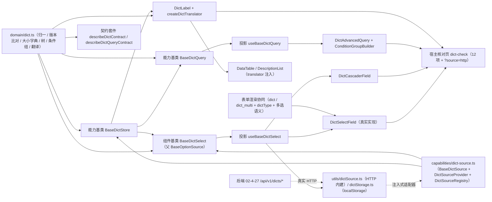

# 01 详细设计 · 字典字段

> 前端组件库 · 06 字段类 · 06 字典字段（需求 06-6）· 详细设计

[文档首页](../../../../../../文档首页.md) › [06 字段类](../../06_字段类.md) › [06 字典字段](../06_字段类_06_字典字段.md) › 详细设计　|　[← 任务](../06_字段类_06_字典字段.md)

## 1. 设计目标与范围 <a id="goal"></a>

交付[需求 06-6](../../../../需求/06_需求_字段类.md#r06-6) 与[任务 06](../06_字段类_06_字典字段.md) 的**字典字段族**（四件 + 条件组构建件 + 族基类 + 数据通路），并与后端真实接口端到端打通：

- **字典下拉**：单选 / 多选、大小字典自动切换（探针 2001；超大字典虚拟滚动 + 远程搜索）、禁用项、级联父值、多选上限、只读回显。
- **字典级联**：树形多级字典（`parent_id` 构建），编辑态复用级联件、只读态路径回显。
- **标签回显**：`DictLabel` 件 + `createDictTranslator`（供 `07_05` `DataTable` / `DescriptionList` 注入），列表 / 详情 / 表单三处同源。
- **缓存与版本比对**：能力基类 `BaseDictStore`（全局一份缓存：类型 `{version, items}` + 子集 label + 并发去重 + 批量合并 + 本地二次缓存），同屏多字段合并为一次 `POST /dicts/batch`；版本一致零传输（`items=null`）；`values` 子集批量翻译防 N+1。
- **高级查询**：抽屉件（条件组构建 + 提供者选择与参数 + 结果预览 + 方案管理），复用 `08_06` 的 `layout.dictAdvanced` 配置口径。
- **数据来源统一**：注入式数据源插件轨 `BaseDictSource` + `DictSourceRegistry`（未注入即占位零请求）；`ui-ep` 内建 HTTP 实现（默认键 `http`）直连后端 `/api/v1/dicts/*`（含高级查询四接口）。
- **对外契约不变**：`DictSelectField` 的导出名与 `06_01` 冻结的 Props / 事件 / 插槽 / `data-test` 保持形状，本次只**向后兼容新增**可选 Props / 事件 / 插槽（变更走版本升级）。

### 1.1 口径与依从 <a id="positioning"></a>

- **架构铁律**：字典缓存（横切能力）落为**继承链上的基类** `BaseDictStore`；大小字典、搜索、级联、上限、回显均为**横切功能**，落 `BaseDictSelect`（组件基类）与 `domain/dict.ts`（领域纯函数）；高级查询编排落 `BaseDictQuery`（能力基类）；具体件只做渲染与交互回传，**不得链外挂接、不得重复实现归一 / 缓存 / 版本比对 / 防抖**。
- **继承链（唯一权威见《[前端基类清单](../../../../../../前端基类清单.md)》）**：`BaseObject → BaseCapability → BasePluggable → BaseComponent`（组件根）→ `BasePlaceholderState` → `BaseValue` → `BaseField` → `BaseOptionSource`（选项源能力）→ **`BaseDictSelect`（新增组件基类）** → 具体件（经投影 `useBaseDictSelect` 挂链）。
  - **缓存能力旁挂注入**：`BaseDictStore`（能力基类，父 `BaseComponent`）承载字典缓存与版本比对，经**注入引用**供 `BaseDictSelect` 与 `DictLabel` / 翻译器共用（同 `BaseUserDisplay` 模式）；`manifest` 登记 `dict-store: []`、`dict-select: ['option-source', 'dict-store']`、`dict-query: ['dict-store']`。
  - **选项源语义共用**：`BaseDictSelect` 派生 `BaseOptionSource`，候选同步 `options` / `dataVersion` / `getLabel` / `search`，与静态选项控件（`05_01`）共用加载与缓存口径。
- **核心框架无关（强制）**：核心包不得依赖 Vue / DOM / 浏览器 API；数据源走**注入式适配器** `DictSourceAdapter`，`fetch` / `localStorage` / `URLSearchParams` / 定时器归 `ui-ep`（`utils/` 单一落点）。
- **取数与交互分离**：取数归注入式数据源（`getType` / `batch` / 高级查询四接口）；件不自行发请求；**未注入即占位零请求**（保持 `06_01` 冻结口径）。
- **前后端打通（用户拍板）**：后端真实取数与缓存已提前落地（[02-4-27](../../../../../01_项目骨架/任务/02_后端基座/02_后端基座_04_跨阶段基座/02_后端基座_04_跨阶段基座_27_字典真实取数与缓存/02_后端基座_04_跨阶段基座_27_字典真实取数与缓存.md) / [需求 02-56](../../../../../01_项目骨架/需求/02_需求_后端基座.md#r02-56)）；`ui-ep` 内建 HTTP 数据源直连 `/api/v1/dicts/*`，核对页 `?source=http` 演示真实链路，实施 / 测试记录留联调证据。
- **真实能力边界**：真实字典 CRUD 管理页面归阶段八；前端「字典变更后展示同步」经缓存失效（`invalidate`）+ 版本比对验证（联调时经后端写接口改条目）。
- **表单渲染协同**：新增控件语义键 `dict-select` / `dict-multi` 与字段类型 `dict` / `dict_multi`；`FieldRenderAttrs.dictType` 透传；`select` / `multi_select` 且带 `dictType` 的字段优先分发字典件；多选语义沿用 `MULTIPLE_WIDGETS` 单一来源。
- **i18n**：占位、空态、上限、错误文案内置中文并可经 Props 覆盖；条目 label 由接口按 locale 下发（`_i18n` 回退）。
- **令牌（强制）**：禁用项 / 标记色 / 面板底走新增 `--bms-dict-*` 令牌组；**禁止硬编码色值**。
- **端范围**：**仅 PC**（`frontend/packages/ui-ep`）；移动端本期不落实现，契约套件与投影就位供后续同契约多实现。
- **工时**：本任务 64h；因新增 2 个能力基类（`BaseDictStore` / `BaseDictQuery`）+ 1 个组件基类（`BaseDictSelect`）+ 1 套插件基类 / 注册表 + 1 份领域纯函数 + 2 套契约套件 + 2 套投影 + 2 个工具 + 四件 + 条件组构建件 + 表单渲染协同 + 核对页，实际上浮在实施记录登记。

## 2. 交付物清单 <a id="deliver"></a>

| # | 交付物 | 落点 |
| --- | --- | --- |
| 1 | 字典领域纯函数与数据模型（新增） | `core/src/domain/dict.ts` |
| 2 | 字典数据源插件基类与注册表（新增） | `core/src/capabilities/dict-source.ts` |
| 3 | 字典缓存能力基类 `BaseDictStore`（新增，父 `BaseComponent`） | `core/src/capabilities/dict-store.ts` |
| 4 | 字典选择族组件基类 `BaseDictSelect`（新增，父 `BaseOptionSource`） | `core/src/capabilities/dict-select.ts` |
| 5 | 高级查询编排能力基类 `BaseDictQuery`（新增，父 `BaseComponent`） | `core/src/capabilities/dict-query.ts` |
| 6 | 能力依赖登记（修改：`dict-store` / `dict-select` / `dict-query` 新增） | `core/src/capabilities/manifest.ts` |
| 7 | 表单渲染字段映射与属性（修改：语义键 + `dictType`） | `core/src/domain/form-render.ts`、`core/src/domain/form-layout.ts` |
| 8 | 核心导出面登记（修改） | `core/src/index.ts` |
| 9 | 契约套件 `describeDictContract` / `describeDictQueryContract`（新增） | `core/testing/dict.ts`、`core/testing/index.ts` |
| 10 | 核心用例（领域 + 两基类 + 映射回归） | `core/tests/domain-dict.spec.ts`、`core/tests/dict-select.spec.ts`、`core/tests/dict-store.spec.ts`、`domain-form-render.spec.ts`（补断言） |
| 11 | 字典选择族投影（新增） | `ui-ep/src/composables/useBaseDictSelect.ts` |
| 12 | 高级查询投影（新增） | `ui-ep/src/composables/useBaseDictQuery.ts` |
| 13 | HTTP 内建数据源与注册（新增，`fetch` 单一落点） | `ui-ep/src/utils/dictSource.ts` |
| 14 | 本地二次缓存通道（新增，`localStorage` 单一落点） | `ui-ep/src/utils/dictStorage.ts` |
| 15 | 字典选择字段（真实实现，保留 `06_01` 冻结契约） | `ui-ep/src/components/field/DictSelectField.vue` |
| 16 | 字典级联字段（新增） | `ui-ep/src/components/field/DictCascaderField.vue` |
| 17 | 字典标签回显件（新增，含翻译器工厂） | `ui-ep/src/components/field/DictLabel.vue`、`ui-ep/src/utils/dictTranslator.ts` |
| 18 | 高级查询抽屉件（新增） | `ui-ep/src/components/field/DictAdvancedQuery.vue` |
| 19 | 条件组构建件（新增，可独立复用） | `ui-ep/src/components/field/ConditionGroupBuilder.vue` |
| 20 | 表单渲染协同（修改：分发字典件 + `dictType` 透传 + 多选语义） | `ui-ep/src/utils/formWidgets.ts`、`ui-ep/src/components/form-render/FormRendererBody.vue` |
| 21 | 导出面登记（五件 + 投影 + 工具 + 类型） | `ui-ep/src/index.ts` |
| 22 | 设计令牌（新增 `--bms-dict-*` 组，亮 / 暗两套） | `apps/desktop/src/styles/tokens.scss` |
| 23 | 用例（投影 + 五件 + 工具 + 表单协同 + 翻译器） | `ui-ep/tests/field-dict.spec.ts`、`interaction-form-renderer.spec.ts`（补字典分支） |
| 24 | 宿主核对页（`vite build` 不含；含 `?source=http` 真实模式） | `apps/desktop/dict-check.html`、`apps/desktop/src/dev/{dictCheck.ts,DictCheck.vue}` |
| 25 | 登记回写（基类清单 / 组件设计 / 架构 / 布局令牌 / 计划与状态） | 见第 6 节 |
| 26 | 前后端联调（后端 `02-4-27` 真实接口） | 实施 / 测试记录（证据） |



```text
core/
├── src/
│   ├── domain/
│   │   ├── dict.ts                      # 新增：字典领域纯函数与数据模型
│   │   ├── form-render.ts               # 修改：FormWidget / FIELD_WIDGETS / FIELD_WIDGET_MAP 增字典语义键
│   │   └── form-layout.ts               # 修改：FieldRenderAttrs 增 dictType
│   └── capabilities/
│       ├── dict-source.ts               # 新增：BaseDictSource / DictSourceProvider / DictSourceRegistry
│       ├── dict-store.ts                # 新增：能力基类 BaseDictStore（缓存 / 版本 / 批量 / 本地二次缓存通道）
│       ├── dict-select.ts               # 新增：组件基类 BaseDictSelect（父 BaseOptionSource）
│       ├── dict-query.ts                # 新增：能力基类 BaseDictQuery（高级查询编排）
│       └── manifest.ts                  # 修改：dict-store / dict-select / dict-query 登记
├── testing/
│   ├── dict.ts                          # 新增：契约套件（两套）+ 数据源桩
│   └── index.ts                         # 修改：新增导出
└── tests/
    ├── domain-dict.spec.ts              # 新增：领域纯函数用例
    ├── dict-store.spec.ts               # 新增：缓存基类用例 + 契约
    ├── dict-select.spec.ts              # 新增：选择族基类用例 + 契约
    └── domain-form-render.spec.ts       # 修改：dict / dict_multi 映射断言同步

ui-ep/
├── src/
│   ├── components/
│   │   ├── field/
│   │   │   ├── DictSelectField.vue      # 修改：真实实现（保留 06_01 冻结契约）
│   │   │   ├── DictCascaderField.vue    # 新增
│   │   │   ├── DictLabel.vue            # 新增
│   │   │   ├── DictAdvancedQuery.vue    # 新增
│   │   │   └── ConditionGroupBuilder.vue# 新增
│   │   └── form-render/
│   │       └── FormRendererBody.vue     # 修改：字典分发 + dictType 透传
│   ├── composables/
│   │   ├── useBaseDictSelect.ts         # 新增：选择族投影
│   │   └── useBaseDictQuery.ts          # 新增：高级查询投影
│   ├── utils/
│   │   ├── dictSource.ts                # 新增：HTTP 内建数据源 + 注册表默认实例
│   │   ├── dictStorage.ts               # 新增：localStorage 二次缓存通道（单一落点）
│   │   ├── dictTranslator.ts            # 新增：createDictTranslator 工厂
│   │   └── formWidgets.ts               # 修改：字典语义键映射 + MULTIPLE_WIDGETS
│   └── index.ts                         # 修改：五件 + 投影 + 工具导出
└── tests/
    ├── field-dict.spec.ts               # 新增：契约套件适配 + 五件 + 工具 + 翻译器
    └── interaction-form-renderer.spec.ts # 补字典字段分支

apps/desktop/
├── dict-check.html                      # 新增：开发态核对页（不进构建产物）
└── src/
    ├── dev/{dictCheck.ts,DictCheck.vue} # 新增：12 项自检上屏（含 ?source=http）
    └── styles/tokens.scss               # 修改：--bms-dict-* 令牌组
```

## 3. 接口 / 契约与边界 <a id="contract"></a>

### 3.1 核心：`domain/dict.ts`（新增纯函数与数据模型） <a id="domain"></a>

```ts
/** 大小字典阈值（条目数 ≥ 阈值即超大字典）。 */
export const DICT_LARGE_THRESHOLD = 2000
/** 探针条数上限（首次取数以该值判别大小字典，与后端 DICT_PROBE_LIMIT 同源）。 */
export const DICT_PROBE_LIMIT = 2001
/** 远程搜索防抖（毫秒，与组织搜索同口径）。 */
export const DICT_SEARCH_DEBOUNCE = 300
/** 默认语言（与后端 DEFAULT_LOCALE 同源）。 */
export const DICT_DEFAULT_LOCALE = 'zh-CN'
/** 类型缓存条数上限（LRU 淘汰）。 */
export const DICT_CACHE_MAX = 200
/** 子集 label 缓存条数上限。 */
export const DICT_SUBSET_MAX = 1000
/** 本地二次缓存键前缀（utils 落点使用）。 */
export const DICT_STORAGE_PREFIX = 'bms:dict'
/** 本地二次缓存体积上限（JSON 字符数；超限不写）。 */
export const DICT_STORAGE_MAX_BYTES = 256 * 1024
/** 空值占位与只读连接符。 */
export const DICT_EMPTY_VALUE = '—'
export const DICT_JOIN = '、'
/** 占位 / 空态 / 上限文案。 */
export const DICT_PLACEHOLDER_TEXT = '字典数据未就绪（占位）'
export const DICT_EMPTY_TEXT = '暂无字典数据'
export const DICT_NO_MATCH_TEXT = '无匹配数据'
/** 字典错误码文案（40101 ~ 40103，与后端错误码分段同源）。 */
export const DICT_ERROR_TEXTS: Readonly<Record<number, string>> = {
  40101: '字典数据源不可用',
  40102: '字典类型不存在',
  40103: '不支持的语言',
}
/** 条件组最大嵌套深度（与后端引擎口径一致）。 */
export const DICT_CONDITION_MAX_DEPTH = 2
/** 高级查询单页条数上限。 */
export const DICT_QUERY_PAGE_MAX = 100
/** 字典条目状态。 */
export const DICT_STATUSES = ['enabled', 'disabled'] as const
/** 操作符清单（后端白名单同源）。 */
export const DICT_OPERATORS = [
  'eq', 'ne', 'contains', 'not_contains', 'starts_with', 'between',
  'gt', 'lt', 'is_null', 'not_null', 'in', 'not_in',
] as const

export type DictStatus = (typeof DICT_STATUSES)[number]
export type DictOperator = (typeof DICT_OPERATORS)[number]
export type DictTarget = 'items' | 'business'
export type DictDataType = 'text' | 'number' | 'date' | 'enum' | 'bool'

/** 字典条目（展示最小面；兼容后端 snake_case）。 */
export interface DictItem {
  value: string
  label: string
  code: string
  parentId?: string
  sort: number
  status: DictStatus
  color?: string
}
/** 单类型取数结果（`items === null` 表示版本一致，复用本地缓存）。 */
export interface DictTypeResult { version: number; items: DictItem[] | null; hasMore: boolean; total: number }
/** 批量取数结果（内层 null 表示该类型版本一致）。 */
export interface DictBatchResult { version: number; items: Record<string, DictTypeResult | null> }
/** 单类型查询参数（线参数由 buildDictTypeQuery 单一构造）。 */
export interface DictTypeQuery { dictType: string; version?: number; keyword?: string; parentId?: string; values?: readonly string[]; limit?: number }
/** 批量查询参数。 */
export interface DictBatchQuery { types: readonly string[]; version?: number; locale?: string }
/** 属性 schema（高级查询条件字段）。 */
export interface DictAttrSchema { attrKey: string; name: string; dataType: DictDataType; operators: readonly DictOperator[]; widget?: string; options?: readonly { label: string; value: string }[]; sort: number; scope: string }
/** 查询提供者（发现—选择—调用）。 */
export interface DictQueryProvider { key: string; name: string; target: DictTarget; dictTypes: readonly string[]; paramSchema: Record<string, unknown> }
/** 查询方案（三级作用域）。 */
export interface DictQueryScheme { id?: number; name: string; scope: 'user' | 'tenant' | 'platform'; target: DictTarget; dictType?: string; providerKey?: string; conditions?: DictConditionGroup; params?: Record<string, unknown>; isDefault: boolean; shared: boolean }
/** 条件项 / 条件组（AND / OR 分组树）。 */
export interface DictConditionItem { field: string; operator: DictOperator; value?: unknown }
export interface DictConditionGroup { logic: 'AND' | 'OR'; children: (DictConditionItem | DictConditionGroup)[] }
/** 高级查询结果（取项分页）。 */
export interface DictAdvQueryResult { items: DictItem[]; total: number; page: number; size: number }
/** 树节点（结构兼容级联件 CascadeOption）。 */
export interface DictTreeNode { value: string; label: string; disabled?: boolean; children?: DictTreeNode[] }

normalizeDictItem(raw): DictItem | undefined            // 兼容 snake_case；value 缺失剔除；status 归一
normalizeDictItems(raw): DictItem[]
normalizeDictTypeResult(raw): DictTypeResult            // items=null 保留版本一致语义
normalizeDictBatchResult(raw): DictBatchResult
normalizeDictValues(value, multiple): string[]          // 受控值归一（去重 / 单值）
isLargeDict(result): boolean                            // total / 条目数 ≥ 阈值 或 hasMore
applyDictSelection(current, incoming, options): { values: string[]; exceeded: boolean }
removeDictValue(values, value): string[]
dictLabelOf(items, value): string | undefined           // 命中 label；未命中 undefined
dictTranslateValues(items, values): string              // 「、」连接；未命中回退原值
filterDictItems(items, keyword): DictItem[]             // 本地搜索（label / value / code）
isDictItemDisabled(item): boolean                       // status=disabled
toDictTreeNodes(items): DictTreeNode[]                  // parent_id → children（按 sort）
toDictCascadeOptions(items): DictTreeNode[]             // 级联件 options（同结构）
dictCacheKey(locale, dictType): string                  // `${locale}:${dictType}`
dictSubsetKey(locale, dictType, value): string
buildDictTypeQuery(input): Record<string, unknown>      // version / keyword / parent_id / values / limit（非空才传）
buildDictBatchQuery(types, version, locale): Record<string, unknown>  // types / version / locale
buildDictAdvQuery(target, payload): Record<string, unknown>           // target / conditions / provider / params / page / size
defaultOperatorsOf(dataType): readonly DictOperator[]   // data_type → 默认操作符
isOperatorAllowed(dataType, operator): boolean
normalizeConditionGroup(raw): DictConditionGroup | undefined   // 结构归一 + 深度/白名单校验
validateConditionGroup(group, attrs): string | undefined       // 非法返回原因（null 值不过、未知字段等）
normalizeDictQueryScheme(raw): DictQueryScheme | undefined
dictSchemePriority(scope): number                       // user=0 / tenant=1 / platform=2
isDictErrorCode(code): boolean
resolveDictErrorText(code): string
```

| 行为 | 口径 |
| --- | --- |
| 归一 | `normalizeDictItem`：`value` 缺失剔除；`parent_id` → `parentId`；`status` 非法回落 `enabled`；`sort` 非有限值回落 0；`color` 原样 |
| 版本三态 | `items === null` → 版本一致（复用缓存）；`items.length === 0` → 空字典；非空 → 条目集 |
| 大小字典 | `isLargeDict`：`total ≥ DICT_LARGE_THRESHOLD` 或 `hasMore === true`（探针截断即大字典） |
| 受控值 | 单选取首值、多选包数组、去重、空值剔除、统一转字符串（与后端 `value` 字符串口径一致） |
| 选择与上限 | `applyDictSelection`：多选追加去重；`limit > 0` 超出截断并置 `exceeded`；单选替换 |
| 树构建 | `toDictTreeNodes`：`parentId` 分组递归；孤儿节点（父缺失）提升顶层；循环引用防护（深度上限 16） |
| 条件组 | `normalizeConditionGroup`：非法结构返回 `undefined`；深度 > `DICT_CONDITION_MAX_DEPTH` 拒绝；`validateConditionGroup` 校验字段（固定字段或 `attr.<key>`）与操作符白名单 |
| 参数构造 | `buildDictTypeQuery`：`version` / `keyword` / `parent_id` / `values` / `limit` 非空才传；`parent_id` 允许空串语义（不传） |
| 错误码 | `isDictErrorCode`：40101 ~ 40103；`resolveDictErrorText` 出中文（其余回落「字典数据源不可用」） |
| 纯数据 | 不触 DOM、不请求、不依赖渲染框架与第三方库；同输入同输出 |

### 3.2 核心：`capabilities/dict-source.ts`（新增插件基类与注册表） <a id="source"></a>

```ts
/** 单类型取数入参（与后端 DictTypeQuery 同形）。 */
export interface DictSourceTypeQuery { dictType: string; version?: number; keyword?: string; parentId?: string; values?: readonly string[]; limit?: number }
/** 批量取数入参。 */
export interface DictSourceBatchQuery { types: readonly string[]; version?: number; locale?: string }
/** 属性 schema 入参。 */
export interface DictSourceAttrsQuery { dictType: string; locale?: string }
/** 提供者清单入参。 */
export interface DictSourceProvidersQuery { dictType?: string }
/** 高级查询入参。 */
export interface DictSourceAdvQuery { dictType: string; target: DictTarget; conditions?: DictConditionGroup; provider?: string; params?: Record<string, unknown>; page?: number; size?: number }
/** 查询方案入参。 */
export interface DictSourceSchemeQuery { target: DictTarget; fieldKey?: string; schemeId?: number; scheme?: DictQueryScheme }

/** 字典数据源契约面（方法与 `BaseDictSource` 一致；未覆写的方法返回 `undefined`，即不请求）。 */
export interface DictSourceAdapter {
  getType?(query: DictSourceTypeQuery): Promise<unknown>
  batch?(query: DictSourceBatchQuery): Promise<unknown>
  loadAttrs?(query: DictSourceAttrsQuery): Promise<unknown>
  loadProviders?(query: DictSourceProvidersQuery): Promise<unknown>
  advancedQuery?(query: DictSourceAdvQuery): Promise<unknown>
  listSchemes?(query: DictSourceSchemeQuery): Promise<unknown>
  resolveDefaultScheme?(query: DictSourceSchemeQuery): Promise<unknown>
  saveScheme?(query: DictSourceSchemeQuery): Promise<unknown>
  deleteScheme?(query: DictSourceSchemeQuery): Promise<unknown>
}

/** 数据源装载选项。 */
export interface DictSourceOptions { endpoint?: string; headers?: Record<string, string> | (() => Record<string, string>) }

/** 字典数据源插件基类（抽象；未覆写的方法返回 `undefined`，即不请求）。 */
export abstract class BaseDictSource extends BasePluggable implements DictSourceAdapter {
  readonly pluginKey: string = 'dict-source'
  readonly pluginName: string = 'base'
  getType(query: DictSourceTypeQuery): Promise<unknown>
  batch(query: DictSourceBatchQuery): Promise<unknown>
  loadAttrs(query: DictSourceAttrsQuery): Promise<unknown>
  loadProviders(query: DictSourceProvidersQuery): Promise<unknown>
  advancedQuery(query: DictSourceAdvQuery): Promise<unknown>
  listSchemes(query: DictSourceSchemeQuery): Promise<unknown>
  resolveDefaultScheme(query: DictSourceSchemeQuery): Promise<unknown>
  saveScheme(query: DictSourceSchemeQuery): Promise<unknown>
  deleteScheme(query: DictSourceSchemeQuery): Promise<unknown>
}

/** 数据源注册项（工厂创建插件实例）。 */
export class DictSourceProvider extends BaseProvider { readonly key: string; readonly create: (options: DictSourceOptions) => BaseDictSource | Promise<BaseDictSource> }

/** 数据源注册表（统一注册表基座；同键唯一性拒重）。 */
export class DictSourceRegistry extends BaseProviderRegistry<DictSourceProvider> { readonly pluginKey = 'dict-source-registry'; readonly pluginName = 'core' }
```

| 行为 | 口径 |
| --- | --- |
| 可替换实现（纵向） | 内建 / 定制数据源继承 `BaseDictSource`，经 `DictSourceRegistry` 登记接入；**未登记 / 未注入即占位零请求** |
| 契约面兼容 | 注入面类型为 `DictSourceAdapter`（接口），插件基类实现同形方法；换实现不动调用方契约 |
| 未覆写即降级 | 基类方法返回 `Promise.resolve(undefined)`，基类据此不发请求、不改状态 |
| 单一数据源 | 普通取数与高级查询共用同一适配器（注入一处、切换一处）；**不拆两个插件轨**（同一后端实现） |
| 不含 | 真实取数（后端）、HTTP `fetch` 与端点装配（`ui-ep/src/utils/dictSource.ts`）、缓存（`BaseDictStore`） |

### 3.3 核心：能力基类 `BaseDictStore`（新增 `capabilities/dict-store.ts`） <a id="store"></a>

```ts
/** 本地二次缓存通道（浏览器 localStorage 经注入接入，核心不触浏览器 API）。 */
export interface DictStorageChannel {
  read(key: string): string | undefined
  write(key: string, value: string): void
  remove(key: string): void
}
/** 类型缓存项。 */
export interface DictCacheEntry { version: number; items: DictItem[]; hasMore: boolean; total: number }
/** 批量取数回调（由数据源注入；返回 undefined 表示未覆写）。 */
export type DictBatchLoader = (types: readonly string[], version: number | undefined) => Promise<DictBatchResult | undefined>
/** 单类型取数回调。 */
export type DictTypeLoader = (query: DictSourceTypeQuery) => Promise<DictTypeResult | undefined>
/** 子集取数回调（按值批量回填）。 */
export type DictSubsetLoader = (dictType: string, values: readonly string[]) => Promise<DictItem[] | undefined>

/** 字典缓存能力基类（抽象；全局一份缓存，跨件 / 跨表单共享）。 */
export abstract class BaseDictStore extends BaseComponent {
  readonly identifier: string = 'dict-store'
  ready = false                                        // 数据通路是否就绪（占位语义，缺省未就绪）
  locale: string = DICT_DEFAULT_LOCALE
  version = 0                                          // 最近一次全局版本
  source: DictSourceAdapter | undefined                // 注入式数据源（未注入即占位零请求）
  storage: DictStorageChannel | undefined              // 本地二次缓存通道（未注入即不持久化）
  readonly loadedTypes: string[]                       // 已加载类型（快照）
  readonly largeTypes: string[]                        // 大字典类型（探针判定）
  get cacheSize(): number                              // 类型缓存条数
  get subsetSize(): number                             // 子集缓存条数
  get requestCount(): number                           // 请求计数（占位态恒 0）

  setReady(value: boolean): void
  setLocale(locale: string): void                      // 变更清空缓存
  setSource(source: DictSourceAdapter | undefined): void
  setStorage(channel: DictStorageChannel | undefined): void
  ensureTypes(types: readonly string[]): Promise<void> // 批量合并入口（同 tick 去重 → batch 一次）
  ensureType(dictType: string): Promise<void>          // 单类型（探针 2001；命中缓存不请求）
  searchRemote(dictType: string, keyword: string): Promise<DictItem[]>   // 关键字（大字典）
  resolveValues(dictType: string, values: readonly string[]): Promise<void>  // values 子集回填（批量翻译防 N+1）
  itemsOf(dictType: string): DictItem[]                // 同步读缓存（未加载返回空数组）
  entryOf(dictType: string): DictCacheEntry | undefined
  isLoaded(dictType: string): boolean
  isLarge(dictType: string): boolean
  labelOf(dictType: string, value: string): string | undefined
  invalidate(dictType?: string): void                  // 失效（类型 / 全部）+ 清本地二次缓存
  preload(types: readonly string[]): Promise<void>     // 预加载（= ensureTypes；宿主登录后调用）
  bindBatchLoader(loader: DictBatchLoader): void       // 数据源装配（投影层接线）
  bindTypeLoader(loader: DictTypeLoader): void
  bindSubsetLoader(loader: DictSubsetLoader): void
}
```

| 行为 | 口径 |
| --- | --- |
| 占位语义 | `ready === false` 或未注入数据源 → `ensureTypes` / `ensureType` / `searchRemote` / `resolveValues` **零请求**（`requestCount` 恒 0），保持 `06_01` 冻结口径 |
| 批量合并 | `ensureTypes`：同微任务批次内多类型合并为一次 `batch(types, version)`；已在途的同类请求去重（pending Map）；命中缓存（条目版本一致）直接返回 |
| 版本比对 | 请求携带缓存条目 `version`；响应 `items === null` → 版本一致（保留缓存，仅更新版本号）；否则替换缓存 |
| 探针与大小字典 | `ensureType` 以 `limit = DICT_PROBE_LIMIT` 取数；`isLargeDict` 命中即登记 `largeTypes`（超大字典不整类型持久化，仅内存片段） |
| 类型缓存 | `Map` + LRU（`DICT_CACHE_MAX`）；条目含 `{version, items, hasMore, total}` |
| 子集缓存 | `resolveValues`：缺失值一次 `values=` 批量拉取（`limit` 免探针），入子集缓存（`DICT_SUBSET_MAX` LRU）；二次零请求 |
| 本地二次缓存 | 小字典（`!isLarge` 且条目数 < 阈值）且注入 `storage` 时写 `bms:dict:{locale}:{type}`（JSON `{version, items}`，超 `DICT_STORAGE_MAX_BYTES` 不写）；启动 / `ensureType` 先读本地，版本一致零请求；`invalidate` 同步删除 |
| 失效 | `invalidate(type)` 清类型 + 子集 + 本地键；`invalidate()` 全清；清后下次 `ensure` 重新请求 |
| 释放 | 随 `BaseComponent` 释放清空缓存与绑定；在途请求以序号丢弃结果（不写状态） |
| 纯数据 | 不触 DOM、不请求；`source` / `storage` 均为注入面，核心不 import 浏览器 API |

- 依赖登记：`dict-store: []`。
- 与选择族协作：`BaseDictSelect` 经注入引用持 `BaseDictStore`（同 `BaseOrgSelect` 持 `BaseUserDisplay` 口径）；翻译器 `createDictTranslator(store)` 亦共用同一实例。
- 不含：真实取数（数据源）、HTTP / localStorage（`ui-ep/utils/`）、件层渲染。

### 3.4 核心：组件基类 `BaseDictSelect`（新增 `capabilities/dict-select.ts`） <a id="select"></a>

```ts
/** 字典选择族组件基类（抽象；父基类 BaseOptionSource）。 */
export abstract class BaseDictSelect extends BaseOptionSource<string | string[]> {
  override readonly identifier: string = 'dict-select'
  override readonly depends: readonly string[] = ['option-source', 'dict-store']
  ready = false                                     // 数据通路是否就绪（缺省未就绪）
  dictType = ''
  keyword = ''
  parentId = ''                                     // 级联父值（空串 = 顶层）
  multiple = false
  limit = 0                                         // 多选上限（0 不限）
  readonly items: DictItem[]                        // 候选 + 回显条目（常驻内存，按 value 合并）
  limitExceeded = false
  errorCode: number | undefined
  errorMessage = ''
  loadingItems = false
  source: DictSourceAdapter | undefined             // 注入式数据源（未注入即占位零请求）
  store: BaseDictStore | undefined                  // 缓存能力（注入引用）

  get degraded: boolean                             // 继承（!ready）
  get isLarge: boolean                              // 大字典（store 判定）
  get selectedValues: string[]                      // 受控值归一
  get selectedItems: DictItem[]                     // 已选（未解析以 value 占位）
  get canLoad: boolean                              // 就绪 ∧ 数据源 ∧ 类型非空

  setStore(store: BaseDictStore | undefined): void
  setSource(source: DictSourceAdapter | undefined): void
  setDictType(dictType: string): void               // 变更清空候选 / 关键词 / 错误
  setKeyword(keyword: string): void
  setParent(parentId: string): void                 // 父值变更：清空受控值 + 候选 + 重载
  setMultiple(value: boolean): void
  setLimit(limit: number): void
  setValue(value): void                             // 继承（受控值归一）
  toggle(value: string): void                       // 多选增删 / 单选替换（含上限）
  remove(value: string): void
  clearSelection(): void
  override async load(): Promise<void>              // 小字典全量 / 大字典远程搜索（缓存命中不请求）
  async search(keyword: string): Promise<DictItem[]> // 远程搜索（大字典；返回候选不写类型缓存）
  async resolve(extra?: readonly string[]): Promise<void>  // 已选值批量回显（values 子集）
  itemOf(value: string): DictItem | undefined
  labelOf(value: string): string                    // 命中 label；未解析回退 value
  selectionText(): string                           // 「、」连接（空 → '—'）
  limitText(): string                               // 「最多选择 N 项」
  invalidate(): void
  syncStore(): void                                 // 订阅 store 变更（候选 / 回显刷新）
}
```

| 行为 | 口径 |
| --- | --- |
| 占位语义 | `ready === false` / 未注入数据源 / `dictType` 为空 → `load` / `search` / `resolve` 零请求；件层降级 + 禁用（保持 `06_01` 冻结口径） |
| 小字典加载 | `load()`：`store.ensureType(dictType)` → `itemsOf` → 本地过滤（`filterDictItems(keyword)`）；不产生远程搜索请求 |
| 大字典加载 | `load()`：远程 `getType({keyword, limit: DICT_PROBE_LIMIT})` → 候选（不进类型缓存，写内存候选）；关键字经件层 300ms 防抖调度 `search(keyword)` |
| 级联父值 | `parentId` 非空 → 查询传 `parent_id`；`setParent` 变更清空受控值（父级切换值失效）并重载；父值为空回顶层 |
| 回显 | `resolve`：已选值中未命中缓存的经 `store.resolveValues`（一次 `values=` 批量）→ 合并入 `items`（常驻，不随候选刷新清空） |
| 禁用项 | 候选含 `status=disabled` 条目（`isDictItemDisabled`）；件层置 `disabled` 不可选；已选值保留并标记 |
| 多选与上限 | `toggle`：多选去重、`limit > 0` 超限截断 + `limitExceeded`；单选替换；`remove` / `clearSelection` 同步受控值 |
| 选项源语义 | 候选 / 回显同步 `options`（`OptionItem{value,label}`）与 `dataVersion`；`getLabel` 数组 → 「、」连接（继承） |
| 订阅 | `store` 失效 / 加载后经 `syncStore()` 刷新 `items` 与 `options`（件层也可监听投影响应式面） |
| 错误 | 数据源抛错 → `errorCode`（兼容 `code` / `errorCode`）+ `resolveDictErrorText`；`reportError` 记录；件层提示 + 重试 |
| 纯数据 | 不触 DOM、不请求；`source` / `store` 为注入，核心不 import 任何浏览器 API |

- 不含：真实取数 / 缓存（store 与数据源）、`fetch` 与端点装配（`ui-ep`）、件层渲染与防抖调度（件层经 `utils/debounce.ts`）。

### 3.5 核心：能力基类 `BaseDictQuery`（新增 `capabilities/dict-query.ts`） <a id="query"></a>

```ts
/** 高级查询编排能力基类（抽象；条件组 / 提供者 / 结果 / 方案）。 */
export abstract class BaseDictQuery extends BaseComponent {
  readonly identifier: string = 'dict-query'
  override readonly depends: readonly string[] = ['dict-store']
  ready = false
  dictType = ''
  target: DictTarget = 'items'
  readonly attrs: DictAttrSchema[]                  // 属性 schema（元数据）
  readonly providers: DictQueryProvider[]           // 提供者清单
  conditions: DictConditionGroup = { logic: 'AND', children: [] }
  providerKey = ''
  providerParams: Record<string, unknown> = {}
  readonly schemes: DictQueryScheme[]
  readonly results: DictItem[]                      // 取项结果（target=items）
  readonly rows: Record<string, unknown>[]          // 业务筛选结果（target=business）
  total = 0
  page = 1
  size = 20
  loading = false
  errorCode: number | undefined
  errorMessage = ''
  source: DictSourceAdapter | undefined

  get degraded: boolean
  get error: boolean
  get empty: boolean
  get metaLoaded: boolean
  get fieldOptions(): DictAttrFieldOption[]          // 固定字段 + attrs（条件构建件用）

  setSource(source: DictSourceAdapter | undefined): void
  setReady(value: boolean): void
  setDictType(dictType: string): void
  setTarget(target: DictTarget): void
  setConditions(group: DictConditionGroup): void
  setProvider(key: string, params?: Record<string, unknown>): void
  setPage(page: number): void
  async loadMeta(): Promise<void>                    // attrs + providers 并行（单失败不整体报错）
  async run(): Promise<void>                         // advanced-query（条件 / provider 派发）
  reset(): void                                      // 条件 / provider / 结果清空
  async loadSchemes(): Promise<void>
  async resolveDefaultScheme(): Promise<void>
  applyScheme(scheme: DictQueryScheme): void
  async saveScheme(name: string, scope?, shared?): Promise<void>
  async deleteScheme(schemeId: number): Promise<void>
  toBusinessFilter(): Record<string, unknown>        // business → 列表筛选参数（宿主消费）
  selectedValues(): string[]                         // items → 选中值（宿主回填字段）
  invalidate(): void
}
```

| 行为 | 口径 |
| --- | --- |
| 占位语义 | `ready === false` / 未注入数据源 → `loadMeta` / `run` / 方案操作零请求（降级呈现） |
| 元数据 | `loadMeta`：`loadAttrs` 与 `loadProviders` **并行**（`Promise.all`）；任一失败仅该分区空、错误文案合并（不整体失败） |
| 条件校验 | 执行前 `validateConditionGroup(conditions, attrs)`；非法不发请求并置 `errorMessage`（件层提示） |
| 执行 | `run()`：`target=items` → 条件引擎（`buildDictAdvQuery`）；`target=business` → `provider` + `params`；结果分页写 `results` / `rows` / `total` |
| 方案 | `loadSchemes` / `resolveDefaultScheme` / `applyScheme`（载入条件与 provider）/ `saveScheme`（个人默认 `scope=user`）/ `deleteScheme`；三级优先级展示 |
| 释放 | 随 `BaseComponent` 释放在途结果按序号丢弃 |

- 依赖登记：`dict-query: ['dict-store']`；不含真实执行（后端）、件层渲染（抽屉 / 条件组构建）。

### 3.6 核心：契约套件（`@bms/core/testing`） <a id="testing"></a>

#### 3.6.1 `describeDictContract`（缓存 + 选择族） <a id="testing-dict"></a>

| 契约面（结构化接口） | 断言要点 |
| --- | --- |
| `ready` / `degraded` / `requestCount` / `version` / `loadedTypes` / `largeTypes` | 占位零请求（未就绪 / 未注入）；就绪后不再降级 |
| `setSource` / `setLocale` / `setStorage` / `ensureTypes` / `ensureType` / `searchRemote` / `resolveValues` / `itemsOf` / `labelOf` / `invalidate` / `preload` / `bindBatchLoader` 等 | 批量合并（同批多类型一次请求）；版本一致零传输（`items=null` 复用缓存）；探针判定大字典；远程搜索；`values` 子集一次回填、二次零请求；本地二次缓存写入 / 读回 / 失效；错误码与错误态 |
| 选择族（`dictType` / `multiple` / `limit` / `items` / `selectedValues` / `selectedItems` / `limitExceeded` / `labelOf` / `selectionText` / `limitText`） | 小字典本地过滤；大字典远程候选；级联父值参数与父变清空重载；禁用项标记；多选去重与上限截断；未解析回显回退 value；选项源语义（`options` / `getLabel` / `dataVersion`） |

- 契约目标约定：类型 `user_status`（两条 + 停用一条）/ `biz_type`（三条）；`region` 级联（父 `zj` → 子 `hz`）；子集回填 `u9` 未命中不占位；数据源为**桩实现**（记录调用轨迹与查询入参）；核心与 `ui-ep` 用例共用同一套断言（「同契约多实现」）。
- 复用 `describePlaceholderFieldContract`（`06_01` 冻结）：真实实现继续跑同一套件，断言不改动即通过。

#### 3.6.2 `describeDictQueryContract`（高级查询编排） <a id="testing-query"></a>

| 契约面 | 断言要点 |
| --- | --- |
| `ready` / `degraded` / `target` / `attrs` / `providers` / `conditions` / `results` / `total` / `errorCode` / `schemes` | 占位零请求；未注入零请求；元数据并行（两方法各一次）；条件执行与分页；条件非法不发请求；方案载入 / 应用 / 保存 / 删除；business 走 provider |

- 契约目标约定：attrs 两条（`text` 与 `enum`）；providers 两条（`builtin` / `dict_items`）；`advanced-query` 返回两条条目 + `total`；方案 CRUD 往返。

### 3.7 插件层：投影（新增） <a id="projection"></a>

```ts
/** `useBaseDictSelect` 选项。 */
export interface UseBaseDictSelectOptions {
  ready?: boolean
  dictType?: string
  multiple?: boolean
  limit?: number
  value?: DictSelectValue
  keyword?: string
  parentId?: string
  locale?: string
  source?: DictSourceAdapter
  store?: BaseDictStore             // 外部缓存实例（缺省内建并装配默认通道）
  storage?: DictStorageChannel      // 本地二次缓存通道（缺省内建 localStorage 通道）
  disabled?: boolean
}
/** `useBaseDictSelect` 返回面（核心方法一一对应的响应式面）。 */
export interface UseBaseDictSelectResult {
  select: BaseDictSelect
  store: BaseDictStore
  ready: Ref<boolean>
  degraded: Ref<boolean>
  disabled: ComputedRef<boolean>
  requestCount: Ref<number>
  value: Ref<string | string[] | undefined>
  items: Ref<DictItem[]>
  selectedValues: Ref<string[]>
  selectedItems: Ref<DictItem[]>
  keyword: Ref<string>
  isLarge: ComputedRef<boolean>
  loading: Ref<boolean>
  error: Ref<boolean>
  errorCode: Ref<number | undefined>
  errorMessage: Ref<string>
  errorText: ComputedRef<string>
  empty: ComputedRef<boolean>
  limitExceeded: Ref<boolean>
  limitText: ComputedRef<string>
  setReady(value: boolean): void
  setSource(source: DictSourceAdapter | undefined): void
  setDictType(dictType: string): void
  setKeyword(keyword: string): void
  setParent(parentId: string): void
  setMultiple(value: boolean): void
  setLimit(limit: number): void
  setValue(value: DictSelectValue | undefined): void
  syncValue(value: DictSelectValue | undefined): void   // 件层 modelValue 监听（回显触发）
  toggle(value: string): void
  remove(value: string): void
  clearSelection(): void
  load(): Promise<void>
  search(keyword: string): Promise<DictItem[]>
  resolve(extra?: readonly string[]): Promise<void>
  invalidate(): void
  labelOf(value: string): string
  selectionText(): string
  onValueChange(listener: (value) => void): () => void
}
```

- 薄适配（核心实例 ↔ Vue 响应式），不含判定逻辑；`onLifecycle('update')` → `sync()`；`onScopeDispose` 解除订阅并 `select.dispose()`。
- **数据源装配**：投影把 `source` 的 `getType` / `batch` 绑定到 `store` 的 `bindTypeLoader` / `bindBatchLoader`（含 `values` 子集经 `getType({values, limit: 0?})`），外部传入 `store` 时复用其缓存（跨件共享）；未注入 `source` 则不绑定（占位零请求）。
- **本地二次缓存装配**：缺省创建 `localStorageDictChannel`（`utils/dictStorage.ts`）；无 localStorage 环境（测试 / SSR）自动为 `undefined`（不持久化，不报错）。
- **防抖归件层**：投影不持定时器；件层按 `DICT_SEARCH_DEBOUNCE` 经 `utils/debounce.ts` 调度 `search`。

```ts
/** `useBaseDictQuery` 选项与返回面（与 BaseDictQuery 一一对应的响应式面）。 */
export interface UseBaseDictQueryOptions { ready?: boolean; dictType?: string; target?: DictTarget; source?: DictSourceAdapter; pageSize?: number }
export interface UseBaseDictQueryResult { /* query / attrs / providers / conditions / providerKey / results / rows / total / page / loading / error / errorText / empty / metaLoaded / fieldOptions + setSource / setReady / setDictType / setTarget / setConditions / setProvider / setPage / loadMeta / run / reset / loadSchemes / resolveDefaultScheme / applyScheme / saveScheme / deleteScheme / toBusinessFilter / selectedValues / invalidate */ }
```

### 3.8 插件层：工具（新增） <a id="utils"></a>

```ts
// ui-ep/src/utils/dictSource.ts
/** 链路内默认字典数据源注册表实例（宿主可登记定制实现或覆盖内建键）。 */
export const dictSourceRegistry: DictSourceRegistry
/** 登记字典数据源实现。 */
export function registerDictSource(key: string, create: (options: DictSourceOptions) => BaseDictSource | Promise<BaseDictSource>): void
/** 创建 HTTP 内建字典数据源（`fetch` 单一落点；未覆写的方法不请求）。 */
export function createHttpDictSource(options?: DictSourceOptions): BaseDictSource

// ui-ep/src/utils/dictStorage.ts
/** 本地二次缓存通道（localStorage 单一落点；不可用环境返回 `undefined`）。 */
export const localStorageDictChannel: DictStorageChannel | undefined

// ui-ep/src/utils/dictTranslator.ts
/** 创建字典标签翻译器（供 DataTable / DescriptionList 的 translator 注入；未加载先显示原值、加载后刷新）。 */
export function createDictTranslator(store: BaseDictStore): (dictType: string, value: unknown) => string | undefined
```

| 行为 | 口径 |
| --- | --- |
| HTTP 数据源 | `createHttpDictSource`：`GET /dicts/{type}`（版本 / 关键字 / `parent_id` / `values` / `limit`）、`POST /dicts/batch`、`GET /dicts/{type}/attrs`、`GET /dicts/query-providers`、`POST /dicts/{type}/advanced-query`、`GET/POST/PUT/DELETE /query-schemes`；线参数经 `buildDictTypeQuery` / `buildDictBatchQuery` / `buildDictAdvQuery` 单一来源 + `URLSearchParams`；响应解 `{code, message, data}`（无包装原样返回）；业务码非 0 / 200 抛 `BaseError`；`fetch` 不可用（测试 / SSR）→ 返回 `undefined` 降级（不抛错） |
| 注册默认键 | `registerDictSource('http', createHttpDictSource)`（同组织 `'http'` / 检索引擎 `'http'` 口径） |
| 本地通道 | `localStorageDictChannel`：`read/write/remove` + `try/catch` 与能力探测（隐私模式 / 配额异常静默降级）；键由 `BaseDictStore` 经 `DICT_STORAGE_PREFIX` 统一构造 |
| 翻译器 | `createDictTranslator(store)`：单值 → `store.labelOf`；未命中 → 触发 `store.ensureType` / `resolveValues`（异步回填，`undefined` 返回让宿主显示原值，缓存更新后下次渲染命中）；多值（数组）→ 「、」连接；未就绪 / 未注入数据源 → 恒 `undefined`（宿主原值展示，零请求） |
| 落点 | **浏览器 API（`fetch` / `URLSearchParams` / `localStorage`）只出现在 `utils/`**，核心与投影判定逻辑不触 DOM |

### 3.9 插件层：件族（`ui-ep/src/components/field/`） <a id="components"></a>

#### 3.9.1 `DictSelectField.vue`（真实实现 · 保留 `06_01` 冻结契约） <a id="c-dict"></a>

**对外导出名与既有 Props / 事件 / 插槽 / `data-test` 不变**，仅向后兼容新增。

| 面 | 内容 |
| --- | --- |
| Props（既有，保持） | `modelValue` / `ready`（缺省 `false`）/ `options` / `multiple`（缺省 `false`）/ `disabled` / `placeholder`（缺省「请选择」）/ `degradeText`（缺省「字典数据未就绪（占位）」） |
| Props（新增，全部可选） | `dictType` / `source` / `store` / `storage` / `locale` / `searchable`（缺省 `true`）/ `parentId` / `limit`（缺省 0）/ `readonly` / `required` / `errorMessage` / `emptyText` / `clearable`（缺省 `true`）/ `collapseAfter`（缺省 1）/ `showColor`（下拉显示语义色点）/ `readonlyTag`（只读以标签呈现） |
| 事件（既有，保持） | `update:modelValue` / `change` |
| 事件（新增） | `retry` / `invalid`（校验文案）/ `limit-exceed`（limit）/ `loaded`（`{ dictType, hasMore, total, source: 'cache' \| 'remote' }`） |
| 插槽（既有，保持） | `degrade` |
| 插槽（新增） | `empty` / `option`（作用域 `{ item }`）/ `prefix` |
| `data-test`（既有，保持） | `placeholder`（降级文案含「字典数据未就绪」） |
| `data-test`（新增） | `dict-select` / `dict-option-{value}` / `dict-readonly` / `dict-marker-disabled` / `dict-error` / `dict-retry` / `dict-empty` / `dict-virtual` |

- **就绪态渲染**：小字典 → `el-select` 全量选项（本地过滤 `searchable`）；**超大字典 → `el-select-v2`（虚拟滚动）** + 远程搜索（`filterable` + `remote-method` 防抖 300ms）；**仅传 `options` 未注入数据源** → 沿用 `SelectInput` 静态路径（保持 `06_01` 就绪语义）。
- **占位语义**：`ready !== true`（或未注入数据源 / 无 `dictType`）→ 降级 + 禁用 + 不发请求（保持 `06_01` 冻结口径与 `data-ready` / `data-degraded`）。
- **加载时机**：挂载后有受控值时 `resolve()` 批量回显（`values=` 子集）；下拉展开首次 `load()`（小字典全量 / 大字典首屏）；`dictType` / `parentId` 变更失效重载。
- **禁用项**：`status=disabled` 条目下拉置 `disabled`（不可选），已选保留并以标记呈现（`dict-marker-disabled`）。
- **只读回显**：`readonly` 时以 `selectionText`（多选经「、」连接；`readonlyTag` 时以标签形态）展示，空值「—」，不产生新请求（沿用已解析条目）。
- **多选上限**：受控控件选择结果超 `limit` 截断并上抛 `limit-exceed`（提示 `limitText()`）。
- **脱敏 / 明文**：字典值为枚举码，无脱敏语义；后端下发什么原样展示。

#### 3.9.2 `DictCascaderField.vue`（新增 · 字典级联） <a id="c-cascader"></a>

| 面 | 内容 |
| --- | --- |
| Props | `modelValue`（路径数组 / 多选路径数组）/ `ready` / `dictType` / `source` / `store` / `multiple`（缺省 `false`）/ `checkStrictly`（任意级可选，缺省 `true`）/ `searchable`（缺省 `true`）/ `lazy`（超大字典逐级加载，缺省 `false`）/ `disabled` / `readonly` / `placeholder`（缺省「请选择」）/ `degradeText` / `emptyText` / `errorMessage` |
| 事件 | `update:modelValue` / `change` / `retry` / `invalid` |
| 插槽 | `degrade` / `empty` / `readonly` |
| `data-test` | `dict-cascader-field` / `dict-cascader-readonly` / `dict-cascader-node-{value}` / `placeholder` |

- **数据来源**：`store.ensureType(dictType)`（探针）→ `toDictTreeNodes` 构建树；`lazy`（大字典）时按 `parentId` 逐级 `load()` 拉子级（合并入 store 子集）。
- **编辑态**复用 `CascadeField`（`06_02`）承载树语义（单选 / 多选 / 过滤）；**只读态**逐级解析 label 出「省 / 市 / 区」路径，未命中回退原值。
- **父级联动**：`parentId` 由级联件自身路径承载；树形数据一次构建（非级联下拉的两级过滤）。

#### 3.9.3 `DictLabel.vue`（新增 · 标签回显） <a id="c-label"></a>

| 面 | 内容 |
| --- | --- |
| Props | `value`（单值 / 数组）/ `dictType` / `source` / `store` / `separator`（缺省「、」）/ `emptyText`（缺省「—」）/ `tag`（标签形态）/ `showColor` / `ready`（缺省 `true`） |
| 事件 | `retry` |
| 插槽 | `default`（自定义渲染，作用域 `{ items, text }`） |
| `data-test` | `dict-label` / `dict-label-item-{value}` / `placeholder` |

- 经 `store` 翻译（未加载触发 `ensureType` / `resolveValues`，**异步不阻塞**：先显示原值，缓存更新后自动刷新）；未就绪 / 未注入数据源 → 原值纯文本（零请求）。
- 多值「、」连接；空值 `emptyText`；`tag` 形态以标签渲染（色点取 `color`，经 `--bms-dict-*` 令牌）。

#### 3.9.4 `DictAdvancedQuery.vue`（新增 · 高级查询抽屉） <a id="c-adv"></a>

| 面 | 内容 |
| --- | --- |
| Props | `visible` / `dictType` / `target`（缺省 `items`）/ `ready` / `source` / `title`（缺省按 target 派生）/ `pageSize`（缺省 20）/ `placeholder` / `degradeText` / `emptyText` |
| 事件 | `update:visible` / `apply`（items → 选中值数组；business → 筛选参数）/ `cancel` / `retry` |
| 插槽 | `degrade` / `fields`（条件构建区自定义）/ `result`（结果区自定义）/ `footer` |
| `data-test` | `dict-advanced-query` / `dict-adv-condition-group` / `dict-adv-provider` / `dict-adv-run` / `dict-adv-result` / `dict-adv-result-row-{index}` / `dict-adv-scheme` / `dict-adv-scheme-apply` / `dict-adv-scheme-save` / `dict-adv-scheme-delete` / `dict-adv-confirm` / `dict-adv-cancel` / `dict-adv-empty` |

- **布局**：顶部目标切换（取项 / 筛选）+ 提供者选择（含 `paramSchema` 派生的参数表单，轻量控件）+ 条件组构建件 + 右对齐「重置 / 执行查询」；中部结果表（分页）；底部「取消 / 应用」+ 方案管理（选择应用 / 保存 / 删除 / 恢复默认）。
- **受控语义**：打开时快照条件；应用才上抛 `apply`；取消恢复快照；关闭（`update:visible false`）不隐式应用。
- **配置位**：复用 `08_06` `LayoutDictAdvanced`（`fields` / `operators` / `scheme` / `columns`）作为条件字段与列的白名单来源（宿主传入 `fields` 时优先）。

#### 3.9.5 `ConditionGroupBuilder.vue`（新增 · 条件组构建件） <a id="c-cond"></a>

| 面 | 内容 |
| --- | --- |
| Props | `modelValue`（`DictConditionGroup`）/ `fields`（`DictAttrFieldOption[]`）/ `maxDepth`（缺省 `DICT_CONDITION_MAX_DEPTH`）/ `disabled` |
| 事件 | `update:modelValue` / `change` |
| 插槽 | `field`（字段选择自定义）/ `value`（值输入自定义） |
| `data-test` | `condition-group` / `condition-group-logic` / `condition-add` / `condition-group-add` / `condition-item-{index}` / `condition-remove-{index}` |

- 增删条件 / 子组、AND-OR 切换、字段选择（固定字段 + 属性）、操作符按 `dataType` 联动（`defaultOperatorsOf`）、值控件按操作符联动（文本 / 数值 / 区间双值 / 多值 / 空值免填）；可独立复用（列表筛选区）。

### 3.10 列表 / 详情标签回显协同（`07_05` 注入点） <a id="list-labels"></a>

| 变更点 | 内容 |
| --- | --- |
| 注入点 | `DataTable.translator` / `DescriptionList.translator`（`07_05` 已交付的注入面，签名 `(dictType, value) => string \| undefined`） |
| 实现 | `createDictTranslator(store)`（`utils/dictTranslator.ts`）统一走 `BaseDictStore` 缓存与批量翻译；宿主装配（页面 / 核对页）注入 |
| 口径 | 未注入即显示原值、**不发请求**（既有口径保持）；注入后未加载先显示原值、加载完刷新（不阻塞渲染） |
| 验证 | 核对页第 10 项（列表翻译 + 详情翻译 + 子集批量回填一次请求） |

### 3.11 表单渲染协同（修改 `08_06` 已交付件） <a id="form-render"></a>

| 变更点 | 内容 |
| --- | --- |
| 语义键与字段类型 | `core/src/domain/form-render.ts`：`FormWidget` 增 `'dict-select'` / `'dict-multi'`；`FIELD_WIDGETS` 同步；`FIELD_WIDGET_MAP` 增 `dict: 'dict-select'`、`dict_multi: 'dict-multi'`（前端先冻结并登记后端需求，只增不改） |
| 字段属性 | `core/src/domain/form-layout.ts`：`FieldRenderAttrs` 向后兼容新增 `dictType?: string`（设计器字段属性层承载，登记后端表单定制）；`normalizeField` 归一透传 |
| 分发 | `ui-ep/src/utils/formWidgets.ts`：`BUILTIN_WIDGETS['dict-select' / 'dict-multi'] = DictSelectField`；`select` / `multi-select` 字段**带 `dictType`** 时优先分发 `DictSelectField`（`resolveFieldComponent` 分支） |
| 多选语义 | `MULTIPLE_WIDGETS` 纳入 `'dict-multi'`（`FormRendererBody.isMultiple` 复用单一来源）；`dict` / `dict_multi` 由语义键天然区分单多选 |
| 透传 | `FormRendererBody.extraProps(field)`：`dict-select` / `dict-multi` → `{ dictType: field.base.dictType }`；`source` / `ready` 经既有 `fieldProps`（宿主逐字段注入） |
| 回归 | `core/tests/domain-form-render.spec.ts` 补 `dict` / `dict_multi` 映射断言；`ui-ep/tests/interaction-form-renderer.spec.ts` 补字典分支（分发 / 透传 / 多选） |
| 口径 | 变更属**向后兼容**（新增语义键与可选属性；既有字段行为不变）；`08_06` 任务文档补「协同契约（06_06 已交付）」注块 |

### 3.12 导出面 <a id="exports"></a>

- `core/src/index.ts`：新增 `domain/dict`（常量 / 类型 / 纯函数）、`capabilities/dict-source`（`BaseDictSource` / `DictSourceProvider` / `DictSourceRegistry` / `DictSourceAdapter` / `DictSourceOptions` 及查询类型）、`capabilities/dict-store`（`BaseDictStore` / `DictStorageChannel` / 缓存条目类型 / loader 类型）、`capabilities/dict-select`（`BaseDictSelect`）、`capabilities/dict-query`（`BaseDictQuery`）；`form-render` / `form-layout` 既有导出不变（新增成员随原导出）。
- `core/testing/index.ts`：新增 `describeDictContract` / `describeDictQueryContract` 与桩工厂导出。
- `ui-ep/src/index.ts`：新增 `DictCascaderField` / `DictLabel` / `DictAdvancedQuery` / `ConditionGroupBuilder` 与各自类型；`DictSelectField`（`DictFieldValue`）导出路径与名字不变；新增 `useBaseDictSelect` / `useBaseDictQuery` / `dictSource` / `dictStorage` / `dictTranslator` 导出。
- 机器护栏对账：`ui-ep/tests/guard-component-inheritance.spec.ts`（五件均实质挂链）、`core/tests/guard-manifest.spec.ts`（`dict-store` / `dict-select` / `dict-query` 登记与清单 / 代码一致）、`guard-jsdoc.spec.ts`（新增导出与类成员 JSDoc 齐备）、`guard-core-framework-agnostic.spec.ts`（核心零框架 / 浏览器 API）、`ui-ep/tests/guard-single-source.spec.ts`（组件不直用持久化 / 浏览器能力）、`guard-tokens.spec.ts`（无硬编码色值）。

### 3.13 设计令牌（新增） <a id="tokens"></a>

`apps/desktop/src/styles/tokens.scss` 新增（亮色 `:root` 与暗色 `[data-theme='dark']` 两套）：

```scss
:root {
  --bms-dict-option-hover-bg: #f5f7fa;             // 下拉候选悬停底
  --bms-dict-option-selected-bg: #ecf5ff;          // 已选项底
  --bms-dict-option-disabled-color: #a8abb2;       // 禁用项字色
  --bms-dict-tag-bg: #f5f7fa;                      // 标签底
  --bms-dict-marker-disabled-color: #e6a23c;       // 停用标记字
  --bms-dict-panel-bg: var(--bms-color-bg);        // 抽屉 / 面板底
  --bms-dict-border: var(--bms-color-border);      // 面板分隔线
  --bms-dict-result-active-bg: #eef4ff;            // 结果行选中底
}
```

- 暗色仅覆盖对比度相关项；**令牌只增不改**，既有令牌不变；登记《[布局设计 · 设计令牌](../../../../../../设计/布局设计/02_布局设计_设计令牌.html)》。

### 3.14 宿主核对页 <a id="check"></a>

`apps/desktop/dict-check.html` + `src/dev/{dictCheck.ts,DictCheck.vue}`（`vite build` 只构建 `index.html`，核对页不进产物）。自检项 12 项：

1. 占位降级与就绪切换（未就绪 / 未注入零请求，`requestCount` 恒 0）；
2. 批量合并（同屏多类型一次 `POST /dicts/batch`，桩记录请求数）；
3. 版本比对（版本一致 `items=null` 复用缓存、零重传；失效后重拉）；
4. 大小字典切换（探针 2001 判定；大字典虚拟滚动 + 远程搜索）；
5. 远程搜索防抖（300ms 内多次输入仅一次请求）；
6. 本地二次缓存（小字典写入 / 重读命中 / 版本不一致重拉）；
7. 级联父值（父变清空重载 + `parent_id` 参数透传）；
8. 禁用项（`status=disabled` 不可选、已选保留并标记）；
9. 多选上限与标签折叠（`limit=2` 第 3 项被拒 + `limit-exceed`）；
10. 标签回显与批量翻译（`DictLabel` + `DataTable` / `DescriptionList` translator + `values` 子集一次回填）；
11. 高级查询（条件组 / 提供者参数 / 结果分页 / 方案保存应用删除）；
12. 前后端打通（`?source=http` 真实数据源：`/api/v1/dicts/{type}` / `batch` / `values` / `advanced-query` / 写接口改条目后展示同步）。

以 chromium CDP 轮询等待异步与防抖相关项到位后导出 DOM 核验；真实模式需后端已启动（`uvicorn`）并已执行种子脚本。

## 4. 失败分支与边界 <a id="edge"></a>

| 边界 / 失败场景 | 处置 |
| --- | --- |
| 数据通路未就绪（`ready` 为假） | 占位：降级 + 禁用 + 零请求（保持 `06_01` 冻结口径） |
| 数据源未注入 / 未覆写方法 | 不请求；候选为空、空态提示；无错误态 |
| `dictType` 为空 | 不请求；占位呈现（未配置字典类型的字段不产生误请求） |
| 未展开下拉 | 不请求候选；有受控值时才触发 `resolve` 批量回填 |
| 版本一致（`items=null`） | 复用缓存（含本地二次缓存）；不替换条目、不写缓存 |
| 空字典（`items=[]`） | 空态提示；缓存空结果（短 TTL 由本地 / 内存清理） |
| 超大字典（探针 `has_more`） | 切虚拟滚动 + 远程搜索；**不写本地二次缓存**（体积不可控）；仅内存候选与子集 |
| 关键字无匹配 | 空态「无匹配数据」；保留已选回显（不受搜索影响） |
| 远程搜索失败 | 内联错误 + 重试入口（`retry`）；保留已选与既有候选（不闪空） |
| 批量回显失败 | 保留受控值；标签回退 value；错误提示与重试；不阻塞页面 |
| 条目停用 / 删除 | 停用：候选禁用 + 已选标记；已删除（子集未命中）：不占位、回退 value（与组织「已删除」占位不同） |
| 多选超上限 | `limit > 0` 超出截断 + `limitExceeded` + `limitText()` 提示（`limit-exceed` 上抛） |
| 重复选择同一 value | 去重（不重复追加） |
| 单选收到数组 / 多选收到单值 | `normalizeDictValues` 归一（取首值 / 包成数组），不静默丢值 |
| 级联父值变化 | 清空受控值 + 候选 + 重载；父级不可逆回退 |
| 树数据父缺失 / 循环引用 | 孤儿提升顶层；深度上限 16 防环 |
| 本地缓存损坏 / 版本陈旧 | 解析失败或版本不一致即丢弃重拉；写入异常静默（隐私模式 / 配额） |
| 缓存失效（`invalidate`） | 清类型 / 子集 / 本地键；下次 `ensure` 重拉 |
| 条件组非法（深度 / 字段 / 操作符） | 不发请求；件层给校验提示 |
| 高级查询 provider 未注册 / 参数缺失 | 展示错误文案（404 / 校验）；保留条件不丢 |
| 方案保存失败 / 越权 | 错误提示；个人方案越权不展示（后端过滤） |
| 表单字段未注入 `source` / `ready` | 占位降级（不误请求）；宿主在 `fieldProps` 注入后启用 |
| 移动端 | 本期不落实现；契约套件与投影就位供同契约多实现 |
| 释放 | `onScopeDispose` 解绑订阅并释放实例；在途响应按序号丢弃（防泄漏 / 脏写） |

## 5. 测试设计与验收映射 <a id="test"></a>

| 验收点（需求 06-6 / 任务 06） | 用例 |
| --- | --- |
| 归一（条目 / 结果三态 / 受控值）、大小字典判定、树构建、条件组归一与校验、参数构造、错误码 | `core/tests/domain-dict.spec.ts` |
| 缓存基类：占位零请求、批量合并、版本一致复用、探针 / 大字典、子集回填、本地二次缓存、失效、错误 | `core/tests/dict-store.spec.ts` + `describeDictContract` |
| 选择族：小字典过滤 / 大字典远程、级联父值、禁用项、多选上限、回显与选项源语义 | `core/tests/dict-select.spec.ts` + `describeDictContract` |
| 高级查询编排：元数据并行、条件执行、方案 CRUD、business 派发 | `core/tests/dict-select.spec.ts`（`describeDictQueryContract` 段） |
| 契约套件（同契约多实现） | `describeDictContract` / `describeDictQueryContract`（核心 + `ui-ep` 适配） |
| 投影薄适配（响应式面与同步、store / storage 装配、销毁） | `ui-ep/tests/field-dict.spec.ts` |
| 五件：`DictSelectField` 冻结契约保持 + 小字典 / 大字典虚拟滚动、`DictCascaderField`（树 / 路径回显 / 懒加载）、`DictLabel`（翻译 / 标签 / 空值）、`DictAdvancedQuery`（条件 / 执行 / 方案 / 应用）、`ConditionGroupBuilder`（增删 / 联动 / 深度限制） | 同上 |
| 翻译器工厂（DataTable / DescriptionList 注入；未命中不阻塞、加载后刷新；未注入零请求） | 同上 |
| 工具（HTTP 数据源：成功 / 解包 / 不可用降级 / 各端点参数；注册表登记与覆盖；本地通道读写与降级） | 同上 |
| 表单渲染协同（`dict` / `dict_multi` 分发、`dictType` 透传、多选语义） | `core/tests/domain-form-render.spec.ts`、`ui-ep/tests/interaction-form-renderer.spec.ts` |
| 既有能力基类回归（选项源重挂后 `08_04` / `08_10` 消费方行为不变） | `core/tests/capabilities-batch3.spec.ts`、`ai-assistant.spec.ts`、`ui-ep/tests/interaction-placeholder-3.spec.ts` |
| 能力登记对账（`dict-store` / `dict-select` / `dict-query` ↔ manifest ↔ 基类清单） | `core/tests/guard-manifest.spec.ts` |
| 注释齐备、核心框架无关、组件挂链、单一落点、令牌消费 | `guard-jsdoc.spec.ts`、`guard-core-framework-agnostic.spec.ts`、`guard-component-inheritance.spec.ts`、`guard-single-source.spec.ts`、`guard-tokens.spec.ts` |
| 开发态核对页 12 项自检（含 `?source=http` 真实模式） | chromium CDP 轮询后导出 DOM |
| 前后端联调（真实接口） | 后端启动 + 种子 → 核对页真实模式 + 接口脚本；证据入实施 / 测试记录 |
| `vue-tsc`、ESLint、Vitest 全通过 | 根 `npm run check` + 宿主 `vue-tsc -b` / `lint` / `test:cov` / `build` / `budget` |
| 文档链接与基座校验 | `check-links.py`、`check-base.py`、`check-status.py --stage 04_前端组件库` |

- 既有 `ui-ep/tests/field-placeholder.spec.ts`（`06_01` 冻结契约）**不得改动**，须原样通过（`DictSelectField` 占位降级 / 禁用 / 零请求断言保持）。
- Kiwi 用例 1 条（分类「平台骨架」/ 优先级 P2 / 状态 `CONFIRMED` / 标签「自动化」；编号于测试步登记后回填代码 `// kiwi_id: <编号>` 与记录）。

## 6. 登记落点 <a id="register"></a>

| 内容 | 落点 |
| --- | --- |
| 新增能力基类 `BaseDictStore`（能力键 `dict-store`，父 `BaseComponent`） | 《[前端基类清单](../../../../../../前端基类清单.md)》§2.1 全量基类登记表插入行（组件侧 · 能力基类，「已交付」）+ §2 继承链总览 + §5.2 能力基类表 + `capabilities/manifest.ts` |
| 新增组件基类 `BaseDictSelect`（能力键 `dict-select`，父 `BaseOptionSource`，依赖 `option-source` / `dict-store`） | 同上 §2.1（组件侧 · 组件基类）+ §2.2 继承链全景 + §5.3 组件基类表 |
| 新增能力基类 `BaseDictQuery`（能力键 `dict-query`，父 `BaseComponent`，依赖 `dict-store`） | 同上 §2.1（组件侧 · 能力基类）+ §5.2 |
| 新增插件基类 / 注册项 / 注册表 `BaseDictSource` / `DictSourceProvider` / `DictSourceRegistry` | 同上 §4「插件基类族与注册表」表（可替换实现 / 各域注册表） |
| 领域纯函数与数据模型 `domain/dict.ts` | 同上 §9「核心」（`domain/` 领域纯函数） |
| 契约套件 `describeDictContract` / `describeDictQueryContract` | 同上 §9（`core/testing/`） |
| 投影 `useBaseDictSelect` / `useBaseDictQuery`、件族五件（`components/field/`）、工具 `utils/{dictSource,dictStorage,dictTranslator}.ts` | 同上 §9「PC 插件」（组件目录与 `composables/`、`utils/` 清单） |
| 设计令牌 `--bms-dict-*` 组 | 《[布局设计 · 设计令牌](../../../../../../设计/布局设计/02_布局设计_设计令牌.html)》（登记项）；`apps/desktop/src/styles/tokens.scss` |
| **组件设计口径回写** | 《[组件设计 · 字典字段](../../../../../../设计/组件设计/06_字段类/01_组件设计_字典字段/01_组件设计_字典字段.md)》：数据来源改「后端 `/api/v1/dicts/*` 真实出口」（版本比对三态 / 批量合并 / `values` 子集 / 高级查询四接口）；缓存口径补「前端 `BaseDictStore` 单例 + 本地二次缓存注入通道」 |
| 架构设计同步 | 《[架构设计 · 前端组件体系](../../../../../../设计/架构设计/05_架构设计_前端组件体系.md)》「取数与缓存协作」节按本节点落地标注 |
| 任务 / 父任务 / 域任务 / 计划与状态 | [任务](../06_字段类_06_字典字段.md)、[父任务](../../06_字段类.md)（子任务清单状态 / 完成日期 / 关键依赖）、[计划](../../../../计划/01_计划_前端组件库.md)（`06_06` 由「搁置（阶段八窗口）」改「进行中（范围扩为前后端全链路）」；§1 域 06 与工时台账、§3 剩余表、§4 甘特、§5 M4 门禁同步） |
| 协同契约（消费方标注） | `05_01` 静态选项控件（选项源加载与缓存口径共用）、`07_05` 数据呈现（`translator` 注入复用 `DictLabel`）、`08_06` 表单渲染（`dict` / `dict_multi` 分发 + `dictType` 透传 + 多选语义）、`02-4-27` 后端（联调与契约缺口回写）、`06_01` 占位版（冻结契约保持与遗留闭环） |
| 需求文档 | 不承载进度（状态只在任务与计划两处一致）；遗留归口写在实施 / 测试记录与计划 |

## 7. 边界与开放项 <a id="open"></a>

- **不在本期**：真实权限码（`dict:query-scheme` 方案维护、`dict:manage`）→ RBAC 阶段；字典高级查询界面定制（`layout.dictAdvanced` 三级解析）与字典管理页面 → 阶段八「通用能力·字典模块」；移动端实现（契约套件与投影就位）。
- **协同契约（后端，已交付）**：`GET /api/v1/dicts/{type}`（`version` / `keyword` / `parent_id` / `values` / `limit`）、`POST /api/v1/dicts/batch`（`types` / `version` / `locale`）、`GET /packages/attrs`、`GET /query-providers`、`POST /advanced-query`、`/query-schemes` CRUD；错误码 `40101` ~ `40103`（与架构 09 错误码分段一致）。
- **契约缺口（前端先冻结 + 登记后端需求）**：`FieldRenderAttrs.dictType`（表单元数据字段属性）与字段类型 `dict` / `dict_multi`（后端 `02-4-27` 已登记 `fieldtype`）；表单元数据接口下发 `dictType` 随表单定制窗口。
- **与 `06_01` 协同**：件名与对外契约由 `06_01` 冻结，本次只向后兼容新增；`describePlaceholderFieldContract` 由真实实现继续复用；补齐 `searchable` 等可选 Props。
- **与 `02-03`（选项源）协同**：`BaseDictSelect` 派生 `BaseOptionSource`（只增不改）；`05_01` 静态选项控件与字典字段共用加载与缓存口径（`options` / `loader` / `load` / `dataVersion`）。
- **与 `07_05` 协同**：`DictLabel` + `createDictTranslator` 接入既有 `translator` 注入点（`07_05` 不改件）。
- **与 `08_06` 协同**：新增语义键 / 字段类型 / `dictType` 透传与多选语义；`08_06` 任务文档补协同契约注块。
- **新增数据源扩展位**：新增实现 = 继承 `BaseDictSource` 并登记 / 注入，不改组件契约；未覆写方法不请求。
- **Kiwi 用例编号**：本任务平台登记后回填代码 `// kiwi_id: <编号>` 与实施 / 测试记录。
- **工时**：名义 64h；因新增 2 个能力基类、1 个组件基类、1 套插件轨、1 份领域纯函数、2 套契约套件、2 套投影、3 个工具、五件与表单渲染协同、核对页与联调，实际上浮在实施记录登记。

## 8. 决策记录 <a id="decision"></a>

| # | 决策项 | 结论 |
| --- | --- | --- |
| 1 | 实施窗口 | 现在推进（用户拍板：重要组件，前后端必须打通；后端真实取数已提前落地 `02-4-27`） |
| 2 | 件清单 | 四件 + 条件组构建件：`DictSelectField`（真实实现）、`DictCascaderField`、`DictLabel`、`DictAdvancedQuery`、`ConditionGroupBuilder`（可独立复用） |
| 3 | 基类粒度 | 缓存能力 `BaseDictStore`（父 `BaseComponent`，注入引用）+ 组件基类 `BaseDictSelect`（父 `BaseOptionSource`）+ 高级查询能力 `BaseDictQuery`（父 `BaseComponent`） |
| 4 | 可替换实现 | 插件基类 `BaseDictSource` + 注册项 / 注册表；注入面 `DictSourceAdapter`（普通取数与高级查询**同一数据源**）；`ui-ep` 内建 HTTP 实现（默认键 `http`） |
| 5 | 大小字典 | 探针 `limit=2001`；超大字典远程搜索 + **虚拟滚动 `el-select-v2`**；小字典全量选项 + 本地过滤 |
| 6 | 级联 | `parentId` 两级过滤（下拉）+ `DictCascaderField` 树形多级（`parent_id` 构建 / 懒加载） |
| 7 | 批量口径 | 同屏多类型合并 `POST /dicts/batch`（批窗口 + pending 去重）；超大字典 `?values=` 子集批量翻译防 N+1 |
| 8 | 标签回显 | `DictLabel` 件 + `createDictTranslator`（`DataTable` / `DescriptionList` 注入，未注入零请求） |
| 9 | 本地二次缓存 | 纳入（小字典写 `bms:dict:{locale}:{type}`；刷新先读本地再版本比对；`localStorage` 归 `utils/` + 注入通道） |
| 10 | 表单协同 | 语义键 `dict-select` / `dict-multi` + 字段类型 `dict` / `dict_multi` + `FieldRenderAttrs.dictType` 透传 + `MULTIPLE_WIDGETS` 单一来源 |
| 11 | 令牌 | 新增 `--bms-dict-*` 组（亮 / 暗两套，只增不改） |
| 12 | 契约套件 | 新增 `describeDictContract`（缓存 + 选择族）与 `describeDictQueryContract`（高级查询）；继续复用 `describePlaceholderFieldContract` |
| 13 | 核对页 | 新增 `dict-check.html`（12 项自检 + `?source=http` 真实后端模式） |
| 14 | Kiwi 用例 | 登记 1 条（分类「平台骨架」/ P2 / `CONFIRMED` / 标签「自动化」），编号测试步回填 |
| 15 | 前后端联调 | 真实 HTTP 联调后端 `02-4-27`（含写接口改条目 → 前端失效重拉展示同步）；证据入实施 / 测试记录 |

## 9. 参考文档 <a id="ref"></a>

- [需求 06-6](../../../../需求/06_需求_字段类.md#r06-6)、[任务 06](../06_字段类_06_字典字段.md)、[父任务](../../06_字段类.md)、[计划](../../../../计划/01_计划_前端组件库.md)
- 《组件设计》[01 字典字段](../../../../../../设计/组件设计/06_字段类/01_组件设计_字典字段/01_组件设计_字典字段.md)（含[可交互原型](../../../../../../设计/组件设计/06_字段类/01_组件设计_字典字段/01_原型设计_字典字段.html)，原型即验收基准）、[12 级联选择](../../../../../../设计/组件设计/06_字段类/12_组件设计_级联选择/12_组件设计_级联选择.md)、[12 选项源能力](../../../../../../设计/组件设计/02_基础组件类/02_能力类/12_组件设计_选项源能力/12_组件设计_选项源能力.md)、[29 查询方案能力](../../../../../../设计/组件设计/02_基础组件类/02_能力类/29_组件设计_查询方案能力/29_组件设计_查询方案能力.md)、[05 异常与空状态](../../../../../../设计/组件设计/07_展示类/05_组件设计_异常与空状态/05_组件设计_异常与空状态.md)
- 《架构设计》[前端组件体系](../../../../../../设计/架构设计/05_架构设计_前端组件体系.md)（取数与缓存协作）、[数据架构](../../../../../../设计/架构设计/07_架构设计_数据架构.md)（字典与系统参数管理 / 缓存架构）、[扩展点与插件化](../../../../../../设计/架构设计/10_架构设计_子系统_扩展点与插件化.md)、[接口与集成](../../../../../../设计/架构设计/09_架构设计_接口与集成.md)
- 《概要设计》[09 字典管理](../../../../../../设计/概要设计/09_概要设计_字典管理.md)
- 后端 [02-4-27 字典真实取数与缓存](../../../../../01_项目骨架/任务/02_后端基座/02_后端基座_04_跨阶段基座/02_后端基座_04_跨阶段基座_27_字典真实取数与缓存/02_后端基座_04_跨阶段基座_27_字典真实取数与缓存.md)（含[详细设计](../../../../../01_项目骨架/任务/02_后端基座/02_后端基座_04_跨阶段基座/02_后端基座_04_跨阶段基座_27_字典真实取数与缓存/设计/27_详细设计_01_字典真实取数与缓存.md)）、[需求 02-56](../../../../../01_项目骨架/需求/02_需求_后端基座.md#r02-56)、[02-4-17 字典取数与缓存契约基座](../../../../../01_项目骨架/任务/02_后端基座/02_后端基座_04_跨阶段基座/02_后端基座_04_跨阶段基座_17_字典取数与缓存契约基座/02_后端基座_04_跨阶段基座_17_字典取数与缓存契约基座.md)
- 《布局设计》[设计令牌](../../../../../../设计/布局设计/02_布局设计_设计令牌.html)
- [《前端基类清单》](../../../../../../前端基类清单.md)、《[前端开发规范](../../../../../../规范/前端开发规范.md)》、《[命名规范](../../../../../../规范/命名规范.md)》、《[文档生成规范](../../../../../../规范/文档生成规范.md)》、《[测试规范](../../../../../../规范/测试规范.md)》
- [06_01 占位版交付](../../06_字段类_01_占位版交付/06_字段类_01_占位版交付.md)（冻结对外契约与占位语义）、[05_01 基础控件](../../../05_基础控件类/05_基础控件类_01_基础控件/05_基础控件类_01_基础控件.md)（选项源口径）、[07_05 数据呈现](../../../07_展示类/07_展示类_05_数据呈现/07_展示类_05_数据呈现.md)（translator 注入点）、[08_06 表单设计器与渲染器](../../../08_交互类/08_交互类_06_表单设计器与表单渲染器/08_交互类_06_表单设计器与表单渲染器.md)（渲染分发）、[06_05 组织选择字段](../../06_字段类_05_组织选择字段/06_字段类_05_组织选择字段.md)（范式参照）、[07_07 全局搜索](../../../07_展示类/07_展示类_07_全局搜索/07_展示类_07_全局搜索.md)（能力基类 + 插件轨 + 契约套件 + 投影 + 核对页做法）、[11 前端合规修复](../../../11_前端合规修复/11_前端合规修复.md)（继承链 / 单一落点 / 令牌护栏）

## 10. 实施对齐记录 <a id="align"></a>

| # | 设计口径 | 实施落定 | 原因 |
| --- | --- | --- | --- |
| — | （实施期回填） | — | — |

> 本文档依《[文档生成规范](../../../../../../规范/文档生成规范.md)》编写
