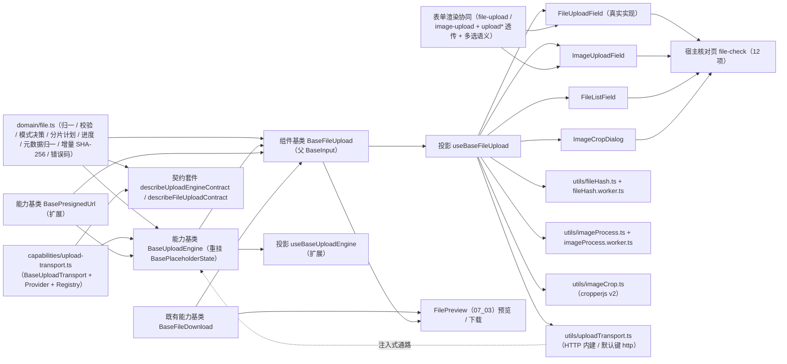

# 01 详细设计 · 文件上传字段

> 前端组件库 · 06 字段类 · 07 文件上传字段（需求 06-7）· 详细设计

[文档首页](../../../../../../文档首页.md) › [06 字段类](../../06_字段类.md) › [07 文件上传字段](../06_字段类_07_文件上传字段.md) › 详细设计　|　[← 任务](../06_字段类_07_文件上传字段.md)

## 1. 设计目标与范围 <a id="goal"></a>

交付[需求 06-7](../../../../需求/06_需求_字段类.md#r06-7) 与[任务 07](../06_字段类_07_文件上传字段.md) 的**文件上传字段族**（四件 + 族基类 + 上传通路 + 计算与处理工具）：

- **文件上传**：单 / 多文件、类型与大小数量限制、拖拽、进度聚合、失败重试、取消在途、只读回显与下载预览。
- **图片上传**：缩略图网格、多图拖拽排序、尺寸与比例校验、压缩、裁剪（含头像圆形形态）、只读缩略回显。
- **只读文件列表**：文件名 / 大小 / 图标、下载、预览（图片 / PDF）、失效占位（「文件已失效」）。
- **上传细节统一经上传引擎能力基类 `BaseUploadEngine`**（与富文本 / 头像 / 导入共用）：分片、秒传、断点续传、并发控制、进度聚合、取消中断与重试；**进度回传与取消为 `08_05` 已交付的前置契约**（`report(percent)` / `cancel()` / `abort` 钩子），本任务直接复用并向后兼容扩展。
- **预签名 URL 获取与失效重取经 `BasePresignedUrl`**：按文件标识缓存、用途（预览 / 下载 / 直传）、提前刷新、失效重取一次、并发合并与降级策略。
- **计算与浏览器处理单一落点**：整文件与每片 **SHA-256** 走核心纯 TS 增量实现（`domain/file.ts`），文件读取与哈希调度归 `utils/fileHash.ts`（Worker 优先）；图片压缩归 `utils/imageProcess.ts`（Worker 优先）；裁剪归 `utils/imageCrop.ts`（cropperjs v2，懒加载）。
- **数据通路注入式**（本轮范围拍板）：上传通路经插件基类 `BaseUploadTransport` + 注册表注入，`ui-ep` 交付 HTTP 内建实现（默认键 `http`）；**未注入即占位零请求**；真实文件存储（整包 / 分片真实托管、`sys_file`、下载预览接口、白名单与配额、状态机与孤儿回收）归**阶段八「通用能力 · 文件存储」窗口**。
- **对外契约不变**：`FileUploadField` 的导出名与 `06_01` 冻结的 Props / 事件 / 插槽 / `data-test` 保持形状（含 `field-placeholder.spec.ts` 原样通过），本次只**向后兼容新增**可选 Props / 事件 / 插槽（变更走版本升级）。

### 1.1 口径与依从 <a id="positioning"></a>

- **架构铁律**：分片、秒传、断点续传、并发、校验、进度聚合均为**横切功能**，落为**继承链上的基类**（`capabilities/upload-engine.ts`）与**领域纯函数**（`domain/file.ts`）；文件族状态（列表 / 上限 / 排序 / 只读）落**组件基类** `BaseFileUpload`；具体件只做渲染与交互回传，**不得链外挂接、不得重复实现归一 / 分片 / 进度 / 校验**。
- **继承链（唯一权威见《[前端基类清单](../../../../../../前端基类清单.md)》）**：`BaseObject → BaseCapability → BasePluggable → BaseComponent`（组件根）→ `BasePlaceholderState` → `BaseValue` → `BaseField` → `BaseInput`（输入组件基类）→ **`BaseFileUpload`（新增组件基类）** → 具体件（经投影 `useBaseFileUpload` 挂链）。
  - **上传引擎重挂占位语义**：`BaseUploadEngine` 父基类 `BaseComponent` → **`BasePlaceholderState`**（`depends` 改 `['placeholder-state', 'presigned-url']`），获得就绪 / 降级与占位零请求计数；既有字段与方法（`uploader` / `upload` / `cancel` / `progress` / `abort` / `canceled` / `chunkSize` / `maxSize`）**只增不改**，`08_05` 导入流行为不变。
  - **文件族基类承载族状态**：`BaseFileUpload` 承载文件列表（受控值为 id 或 id 数组）、类型 / 大小 / 数量校验、多选上限、多图排序、压缩与裁剪标记、进度与任务快照、只读回显与下载预览；具体件不重复实现。
  - **可替换实现走插件基类 + 注册表**：上传通路 `BaseUploadTransport`（未覆写的方法返回 `undefined` 即不请求）+ `UploadTransportProvider` + `UploadTransportRegistry`；`ui-ep` 内建 HTTP 实现（默认键 `http`）。
- **核心框架无关（强制）**：核心包不得依赖 Vue / DOM / 浏览器 API；`fetch` / `FormData` / `Blob` / `Worker` / `OffscreenCanvas` / `crypto` / `canvas` / cropperjs 一律归 `ui-ep`（`utils/` 单一落点）；核心不 import 任何浏览器 API。
- **取数与交互分离**：取数与传输归注入式通路（`hash` / `check` / `uploadWhole` / `initiate` / `uploadPart` / `complete` / `abort` / `listParts` / `resolveFiles` / `presign`）；件不自行发请求；**未注入即占位零请求**（保持 `06_01` 冻结口径）。
- **前端先行、通路注入式**：真实文件存储联调归**阶段八窗口**；本轮冻结通路契约、领域纯函数与降级分支，`ui-ep` 交付 HTTP 内建通路（可被宿主登记 / 覆盖），换通路不动组件对外契约；**契约缺口只增不改并登记后端需求**（整包 `POST /files`、已传分片查询、批量元数据、下载 / 预览预签名）。
- **限额口径与后端同源**（拍板）：整包阈值 `file.upload.max_size`（20MB）、单文件上限 `file.upload.max_file_size`（2GB）、缺省分片 `DEFAULT_PART_SIZE`（5MB，会话返回 `part_size` 覆盖）、分片并发 3、失败重试 3 次指数退避（1s 基数、上限 8s）、搜索 / 输入防抖 300ms（复用 `utils/debounce.ts`）。
- **图片处理口径**（拍板）：缩略图、多图排序、尺寸与比例校验、**压缩**（超阈值才压：最大边长 1920px 或体积 1MB；输出保持原格式；JPEG 质量 0.85；超大图 > 20MB 跳过）、**裁剪**（cropperjs v2；头像圆形 1:1 与通用比例矩形同件承载）；**大图走 Worker**（哈希与图片各一独立 Worker，能力缺失 / 加载失败降级主线程）。
- **i18n**：占位、空态、上限、校验与错误文案内置中文并可经 Props 覆盖；文件名按原样展示（不翻译）。
- **令牌（强制）**：拖拽区 / 文件项 / 进度 / 失效标记走新增 `--bms-file-*` 令牌组；**禁止硬编码色值**。
- **端范围**：**仅 PC**（`frontend/packages/ui-ep`）；移动端本期不落实现，契约套件与投影就位供后续同契约多实现。
- **工时**：本任务名义 16h；因新增 1 个组件基类 + 1 套插件基类 / 注册项 / 注册表 + 2 个既有基类扩展（引擎重挂 + 预签名扩展）+ 1 份领域纯函数（含增量 SHA-256）+ 2 套契约套件 + 2 套投影 + 5 个工具（HTTP 通路 / 哈希 + Worker / 图片处理 + Worker / 裁剪）+ 四件 + 表单渲染协同 + 令牌 + 核对页 + 新增依赖（cropperjs），实际上浮在实施记录登记。

## 2. 交付物清单 <a id="deliver"></a>

| # | 交付物 | 落点 |
| --- | --- | --- |
| 1 | 文件领域纯函数与数据模型（新增，含增量 SHA-256） | `core/src/domain/file.ts` |
| 2 | 上传通路插件基类与注册表（新增） | `core/src/capabilities/upload-transport.ts` |
| 3 | 上传引擎扩展 + 重挂占位语义（修改：父基类 `BasePlaceholderState`、任务队列 / 分片 / 秒传 / 断点 / 重试 / 并发） | `core/src/capabilities/upload-engine.ts` |
| 4 | 预签名能力扩展（修改：keyed 缓存 / 用途 / 提前刷新 / 并发合并 / 降级策略） | `core/src/capabilities/presigned-url.ts` |
| 5 | 文件上传族组件基类 `BaseFileUpload`（新增，父 `BaseInput`） | `core/src/capabilities/file-upload.ts` |
| 6 | 能力依赖登记（修改：`upload-engine` 依赖改 `placeholder-state`，新增 `file-upload`） | `core/src/capabilities/manifest.ts` |
| 7 | 表单渲染语义键与属性（修改：`file-upload` / `image-upload` + `upload*` 属性） | `core/src/domain/form-render.ts`、`core/src/domain/form-layout.ts` |
| 8 | 核心导出面登记（修改） | `core/src/index.ts` |
| 9 | 契约套件 `describeUploadEngineContract` / `describeFileUploadContract`（新增） | `core/testing/file-upload.ts`、`core/testing/index.ts` |
| 10 | 核心用例（领域 + 引擎 + 族基类 + 映射回归） | `core/tests/domain-file.spec.ts`、`core/tests/upload-engine.spec.ts`、`core/tests/file-upload.spec.ts`、`domain-form-render.spec.ts`（补断言） |
| 11 | 文件上传族投影（新增） | `ui-ep/src/composables/useBaseFileUpload.ts` |
| 12 | 上传引擎投影扩展（修改：通路装配 / 任务面 / 配置面） | `ui-ep/src/composables/useBaseUploadEngine.ts` |
| 13 | HTTP 内建上传通路与注册（新增，`fetch` / `FormData` 单一落点） | `ui-ep/src/utils/uploadTransport.ts` |
| 14 | 文件哈希工具与 Worker（新增，`Blob` / `Worker` 单一落点） | `ui-ep/src/utils/fileHash.ts`、`ui-ep/src/utils/fileHash.worker.ts` |
| 15 | 图片处理工具与 Worker（新增，`canvas` / `OffscreenCanvas` / `createImageBitmap` 单一落点） | `ui-ep/src/utils/imageProcess.ts`、`ui-ep/src/utils/imageProcess.worker.ts` |
| 16 | 图片裁剪工具（新增，cropperjs v2 懒加载单一落点） | `ui-ep/src/utils/imageCrop.ts` |
| 17 | 文件上传字段（真实实现，保留 `06_01` 冻结契约） | `ui-ep/src/components/field/FileUploadField.vue` |
| 18 | 图片上传字段（新增） | `ui-ep/src/components/field/ImageUploadField.vue` |
| 19 | 只读文件列表件（新增） | `ui-ep/src/components/field/FileListField.vue` |
| 20 | 图片裁剪弹窗件（新增） | `ui-ep/src/components/field/ImageCropDialog.vue` |
| 21 | 表单渲染协同（修改：语义键映射 + 上传属性透传 + 多选语义） | `ui-ep/src/utils/formWidgets.ts`、`ui-ep/src/components/form-render/FormRendererBody.vue` |
| 22 | 导出面登记（四件 + 投影 + 工具 + 类型） | `ui-ep/src/index.ts` |
| 23 | 设计令牌（新增 `--bms-file-*` 组，亮 / 暗两套） | `apps/desktop/src/styles/tokens.scss` |
| 24 | 分包登记（cropperjs 独立异步块） | `apps/desktop/vite.config.ts`（`manualChunks` 增 `vendor-cropperjs`） |
| 25 | 用例（投影 + 四件 + 工具 + 表单协同） | `ui-ep/tests/field-file-upload.spec.ts`、`interaction-form-renderer.spec.ts`（补文件分支） |
| 26 | 宿主核对页（`vite build` 不含） | `apps/desktop/file-check.html`、`apps/desktop/src/dev/{fileCheck.ts,FileCheck.vue}` |
| 27 | 新增依赖（剪裁库） | `frontend/packages/ui-ep/package.json`（`cropperjs@^2.2.0`）+ 根 `pnpm-lock.yaml` |
| 28 | 登记回写（基类清单 / 组件设计 / 架构 / 布局令牌 / 计划与状态 / 协同契约） | 见第 6 节 |



```text
core/
├── src/
│   ├── domain/
│   │   ├── file.ts                      # 新增：文件领域纯函数与数据模型（含增量 SHA-256）
│   │   ├── form-render.ts               # 修改：FormWidget / FIELD_WIDGETS / FIELD_WIDGET_MAP 增 file-upload / image-upload
│   │   └── form-layout.ts               # 修改：FieldRenderAttrs 增 uploadAccept / uploadMaxSize / uploadLimit / uploadMultiple
│   └── capabilities/
│       ├── upload-transport.ts          # 新增：BaseUploadTransport / UploadTransportProvider / UploadTransportRegistry
│       ├── upload-engine.ts             # 修改：重挂 BasePlaceholderState + 任务队列 / 分片 / 秒传 / 断点 / 并发 / 重试
│       ├── presigned-url.ts             # 修改：keyed 缓存 / 用途 / 提前刷新 / 并发合并 / 降级策略
│       ├── file-upload.ts               # 新增：组件基类 BaseFileUpload（父 BaseInput）
│       └── manifest.ts                  # 修改：upload-engine 依赖改 placeholder-state；新增 file-upload
├── testing/
│   ├── file-upload.ts                   # 新增：契约套件（两套）+ 通路桩
│   └── index.ts                         # 修改：新增导出
└── tests/
    ├── domain-file.spec.ts              # 新增：领域纯函数用例（含 SHA-256 标准向量）
    ├── upload-engine.spec.ts            # 新增：引擎用例 + 契约
    ├── file-upload.spec.ts              # 新增：族基类用例 + 契约
    └── domain-form-render.spec.ts       # 修改：file-upload / image-upload 映射断言同步

ui-ep/
├── src/
│   ├── components/
│   │   ├── field/
│   │   │   ├── FileUploadField.vue      # 修改：真实实现（保留 06_01 冻结契约）
│   │   │   ├── ImageUploadField.vue     # 新增
│   │   │   ├── FileListField.vue        # 新增
│   │   │   └── ImageCropDialog.vue      # 新增
│   │   └── form-render/
│   │       └── FormRendererBody.vue     # 修改：上传属性透传 + 多选语义
│   ├── composables/
│   │   ├── useBaseFileUpload.ts         # 新增：文件上传族投影
│   │   └── useBaseUploadEngine.ts       # 修改：通路装配 / 任务面 / 配置面
│   ├── utils/
│   │   ├── uploadTransport.ts           # 新增：HTTP 内建通路 + 注册表默认实例
│   │   ├── fileHash.ts                  # 新增：整文件 / 每片哈希调度（Worker 优先）
│   │   ├── fileHash.worker.ts           # 新增：哈希 Worker
│   │   ├── imageProcess.ts              # 新增：尺寸探测 / 压缩（Worker 优先）
│   │   ├── imageProcess.worker.ts       # 新增：图片处理 Worker
│   │   ├── imageCrop.ts                 # 新增：cropperjs v2 装配（懒加载）
│   │   └── formWidgets.ts               # 修改：语义键映射 + MULTIPLE_WIDGETS
│   └── index.ts                         # 修改：四件 + 投影 + 工具导出
└── tests/
    ├── field-file-upload.spec.ts        # 新增：契约套件适配 + 四件 + 工具 + 表单协同
    └── interaction-form-renderer.spec.ts # 补文件 / 图片字段分支

apps/desktop/
├── file-check.html                      # 新增：开发态核对页（不进构建产物）
└── src/
    ├── dev/{fileCheck.ts,FileCheck.vue} # 新增：12 项自检上屏
    ├── styles/tokens.scss               # 修改：--bms-file-* 令牌组
    └── vite.config.ts                   # 修改：cropperjs 独立分包
```

## 3. 接口 / 契约与边界 <a id="contract"></a>

### 3.1 核心：`domain/file.ts`（新增纯函数与数据模型） <a id="domain"></a>

```ts
/** 整包上传阈值（字节，20MB；超限转分片；与后端 `file.upload.max_size` 同源）。 */
export const FILE_WHOLE_MAX_SIZE = 20 * 1024 * 1024
/** 缺省分片大小（字节，5MB；与后端 `DEFAULT_PART_SIZE` 同源，会话返回 `part_size` 覆盖）。 */
export const FILE_PART_SIZE = 5 * 1024 * 1024
/** 单文件大小上限（字节，2GB；与后端 `file.upload.max_file_size` 同源）。 */
export const FILE_MAX_SIZE = 2 * 1024 * 1024 * 1024
/** 分片并发数（缺省 3）。 */
export const FILE_PART_CONCURRENCY = 3
/** 多文件并发数（缺省 3）。 */
export const FILE_TASK_CONCURRENCY = 3
/** 分片失败重试上限（缺省 3）与指数退避（1s 基数、8s 上限）。 */
export const FILE_RETRY_MAX = 3
export const FILE_RETRY_BASE_MS = 1000
export const FILE_RETRY_MAX_MS = 8000
/** 请求 / 搜索防抖（毫秒，与组织 / 字典同口径）。 */
export const FILE_DEBOUNCE = 300
/** 数量上限缺省（0 = 不限）。 */
export const FILE_LIMIT_DEFAULT = 0
/** 图片压缩缺省：最大边长 / 质量 / 触发体积 / 超大图跳过阈值。 */
export const IMAGE_COMPRESS_MAX_EDGE = 1920
export const IMAGE_COMPRESS_QUALITY = 0.85
export const IMAGE_COMPRESS_MIN_SIZE = 1024 * 1024
export const IMAGE_COMPRESS_SKIP_SIZE = 20 * 1024 * 1024
/** 裁剪缺省：头像比例 1:1、输出最大边长。 */
export const IMAGE_CROP_ASPECT = 1
export const IMAGE_CROP_OUTPUT_MAX_EDGE = 1024
/** 空值占位与连接符。 */
export const FILE_EMPTY_VALUE = '—'
export const FILE_JOIN = '、'
/** 失效标记。 */
export const FILE_INVALID_MARK = '文件已失效'
/** 占位 / 空态 / 上限文案。 */
export const FILE_PLACEHOLDER_TEXT = '文件上传未就绪（占位）'
export const FILE_EMPTY_TEXT = '暂无文件'
/** 文件错误码文案（50101 ~ 50105，与架构 09 错误码分段 / 组件设计第 4 节同源）。 */
export const FILE_ERROR_TEXTS: Readonly<Record<number, string>> = {
  50101: '文件类型不允许',
  50102: '文件超出大小限制',
  50103: '文件数量超出限制',
  50104: '文件上传失败',
  50105: '文件已失效',
}

/** 文件形态。 */
export type FileKind = 'file' | 'image'
/** 上传模式（整包 / 分片）。 */
export type UploadMode = 'whole' | 'multipart'
/** 上传任务阶段。 */
export type UploadTaskPhase = 'pending' | 'hashing' | 'uploading' | 'merging' | 'done' | 'failed' | 'canceled'
/** 中断信号（最小结构；与浏览器 `AbortSignal` 结构兼容，核心不依赖 DOM 类型）。 */
export interface UploadAbortSignal { readonly aborted: boolean }

/** 文件元信息（件层从文件对象裁剪，核心不触文件对象）。 */
export interface FileMeta { name: string; size: number; mime: string; lastModified?: number; dimension?: { width: number; height: number } }
/** 文件引用（受控值载体；`id` 为文件标识，非文件对象）。 */
export interface FileRef {
  id: string
  name: string
  size?: number
  mime?: string
  /** 直连地址（后端下发或已解析签名 URL）。 */
  url?: string
  /** 是否存在（批量回显未命中为 `false`）。 */
  exists?: boolean
  /** 原图尺寸（图片）。 */
  dimension?: { width: number; height: number }
  /** 压缩前原始体积（已压缩时记录，供展示）。 */
  originSize?: number
}
/** 分片计划项。 */
export interface UploadPartPlan { partNo: number; start: number; end: number; size: number }
/** 上传会话（归一结果；`partSize` / `totalParts` 以会话返回为准）。 */
export interface UploadSessionInfo { uploadId: string; key: string; partSize: number; totalParts: number; uploadedParts: number[] }
/** 上传任务快照（投影与件层消费）。 */
export interface UploadTaskSnapshot {
  id: string
  name: string
  size: number
  phase: UploadTaskPhase
  percent: number
  mode?: UploadMode
  fileId?: string
  errorCode?: number
  errorMessage: string
  attempts: number
}
/** 校验结果。 */
export interface FileCheckResult { valid: boolean; code?: number; message: string }
/** 输入校验选项。 */
export interface FileCheckOptions { accept?: string; maxSize?: number; kind?: FileKind }
/** 图片尺寸校验选项。 */
export interface ImageCheckOptions { minWidth?: number; maxWidth?: number; minHeight?: number; maxHeight?: number; aspect?: number }
/** 增量 SHA-256 哈希器（纯 TS；整文件与每片同源）。 */
export interface Sha256Hasher { update(data: Uint8Array): void; digestToHex(): string; reset(): void }
/** 哈希结果（整文件 + 每片）。 */
export interface FileHashResult { sha256: string; partHashes: readonly string[] }

parseAcceptList(accept): string[]                    // 逗号 / 分号分隔、小写、去重
fileExtOf(name): string
isImageFile(name, mime): boolean
matchAccept(name, mime, accept): boolean             // 扩展名 + MIME 双重；accept 为空视为通过
checkFileMeta(meta, options): FileCheckResult        // 空文件 / 类型 / 大小（数量由 applyFileSelection 判定）
checkImageDimension(dimension, options): FileCheckResult
formatFileSize(size): string                         // B / KB / MB / GB（保留 1 位）
imageDimensionText(dimension): string                // 「宽 × 高」
normalizeFileRef(raw): FileRef | undefined           // 兼容 snake_case；id 缺失剔除
normalizeFileRefs(raw): FileRef[]
normalizeFileValue(value, multiple): string[]        // 受控值归一（单值 / 数组 / 去重 / 空值剔除）
applyFileSelection(current, incoming, limit): { refs: FileRef[]; exceeded: boolean }
removeFileRef(refs, id): FileRef[]
moveFileRef(refs, from, to): FileRef[]               // 夹取索引；越界不动作
mergeFileRefs(base, incoming): FileRef[]             // 按 id 合并，入参覆盖同项（保留原 url 等缺失字段）
findFileRef(refs, id): FileRef | undefined
isFileRefInvalid(ref): boolean                       // exists === false
fileRefLabel(ref): string                            // 失效 → 「名称（文件已失效）」；名称缺失回退 id
fileListSummary(refs): string                        // 「、」连接（空 → '—'）
decideUploadMode(size, wholeMax?): UploadMode        // ≤ 阈值整包，否则分片
planParts(size, partSize): UploadPartPlan[]          // 分片计划（末片余量；part_no 从 1 起）
mergePartProgress(doneBytes, totalBytes, inflightPercent?): number   // 0 ~ 100 整数
missingParts(uploaded, total): number[]
shouldCompressImage(meta, options?): boolean         // 超最大边长或超触发体积
shouldSkipCompress(size, skipSize?): boolean         // 超大图跳过压缩
buildDedupQuery(sha256, size): Record<string, unknown>
buildMultipartInit(input): Record<string, unknown>   // key / size / sha256 / mime / part_size（非空才传）
buildResolveQuery(ids): Record<string, unknown>      // ids（逗号分隔）
normalizeUploadSession(raw): UploadSessionInfo       // upload_id / part_size / total_parts / uploaded_parts（兼容）
normalizePartResult(raw): { partNo: number; etag: string; size: number }
normalizeStoredFile(raw): FileRef                    // 合并产物 → FileRef（id 取 key / id）
normalizeResolvedFiles(raw): FileRef[]               // 批量元数据归一（未命中 → exists=false）
normalizeDedupRef(raw): FileRef | undefined          // 秒传命中引用归一
retryDelayMs(attempt): number                        // 指数退避夹取（1s * 2^n，上限 8s）
isFileErrorCode(code): boolean
resolveFileErrorText(code): string
createSha256(): Sha256Hasher                         // 纯 TS 增量实现（标准向量可断言）
```

| 行为 | 口径 |
| --- | --- |
| 校验 | `checkFileMeta`：0 字节空文件 → `50102`；`accept` 非空时扩展名 + MIME 双重匹配（`image/` 通配 MIME 支持）；`maxSize > 0` 超限 → `50102`；形态不符（`kind=image` 非图片）→ `50101` |
| 数量与去重 | `applyFileSelection`：多选追加、同 id 去重；`limit > 0` 超出截断并置 `exceeded`；单选整体替换 |
| 哈希 | `createSha256`：纯 TS 增量（分块 `update`，`digestToHex` 出 64 位小写十六进制）；同输入同输出，与后端 `sys_file.sha256` 口径一致 |
| 模式与分片 | `decideUploadMode`：`size ≤ wholeMax` 整包；否则分片。`planParts`：`ceil(size / partSize)` 片，末片余量；`part_no` 从 1 起（与后端 `02-4-18` 同源） |
| 进度 | `mergePartProgress`：`(doneBytes + total*inflightPercent/100) / totalBytes * 100`，夹取 0 ~ 100 整数 |
| 元数据 | `normalizeFileRef`：兼容 snake_case（`file_id` / `mime_type` / `origin_size`）；`id` 缺失剔除；`exists === false` → 失效；`normalizeUploadSession` 兼容 `upload_id` / `uploadId` 与 `uploaded_parts` |
| 失效 | `fileRefLabel`：`exists === false` → 「名称（文件已失效）」；名称缺失回退 `id`；`isFileRefInvalid` 供只读列表置灰不可下载（与组织「已删除」占位同口径） |
| 错误码 | `isFileErrorCode`：50101 ~ 50105；`resolveFileErrorText` 出中文（其余回落「文件上传失败」） |
| 纯数据 | 不触 DOM、不请求、不依赖渲染框架与第三方库；同输入同输出 |

### 3.2 核心：`capabilities/upload-transport.ts`（新增插件基类与注册表） <a id="transport"></a>

```ts
/** 整包上传入参。 */
export interface UploadWholeQuery { file: unknown; key?: string; name: string; size: number; mime: string; sha256?: string; report?: UploadProgressReporter; signal?: UploadAbortSignal }
/** 秒传判定入参。 */
export interface UploadCheckQuery { sha256: string; size: number }
/** 分片初始化入参。 */
export interface UploadInitQuery { key?: string; name: string; size: number; mime: string; sha256?: string; partSize?: number }
/** 分片上传入参（`file` 与字节区间由引擎下发，切片归通路实现）。 */
export interface UploadPartQuery { uploadId: string; partNo: number; file: unknown; start: number; end: number; sha256?: string; signal?: UploadAbortSignal }
/** 会话查询 / 合并 / 取消入参。 */
export interface UploadSessionQuery { uploadId: string }
/** 批量元数据入参。 */
export interface UploadResolveQuery { ids: readonly string[] }
/** 预签名入参（供 `BasePresignedUrl` 装配）。 */
export interface UploadPresignQuery { fileId: string; purpose: 'preview' | 'download'; expiresIn?: number }

/** 上传通路契约面（方法与 `BaseUploadTransport` 一致；未覆写的方法返回 `undefined`，即不请求）。 */
export interface UploadTransportAdapter {
  hash?(file: unknown, options?: { partSize?: number; signal?: UploadAbortSignal }): Promise<unknown>
  check?(query: UploadCheckQuery): Promise<unknown>
  uploadWhole?(query: UploadWholeQuery): Promise<unknown>
  initiate?(query: UploadInitQuery): Promise<unknown>
  uploadPart?(query: UploadPartQuery): Promise<unknown>
  complete?(query: UploadSessionQuery): Promise<unknown>
  abort?(query: UploadSessionQuery): Promise<unknown>
  listParts?(query: UploadSessionQuery): Promise<unknown>
  resolveFiles?(query: UploadResolveQuery): Promise<unknown>
  presign?(query: UploadPresignQuery): Promise<unknown>
}

/** 通路装载选项。 */
export interface UploadTransportOptions { endpoint?: string; headers?: Record<string, string> | (() => Record<string, string>) }

/** 上传通路插件基类（抽象；未覆写的方法返回 `undefined`，即不请求）。 */
export abstract class BaseUploadTransport extends BasePluggable implements UploadTransportAdapter {
  readonly pluginKey: string = 'upload-transport'
  readonly pluginName: string = 'base'
  hash(file, options?): Promise<unknown>
  check(query): Promise<unknown>
  uploadWhole(query): Promise<unknown>
  initiate(query): Promise<unknown>
  uploadPart(query): Promise<unknown>
  complete(query): Promise<unknown>
  abort(query): Promise<unknown>
  listParts(query): Promise<unknown>
  resolveFiles(query): Promise<unknown>
  presign(query): Promise<unknown>
}

/** 通路注册项（工厂创建插件实例）。 */
export class UploadTransportProvider extends BaseProvider { readonly key: string; readonly create: (options: UploadTransportOptions) => BaseUploadTransport | Promise<BaseUploadTransport> }

/** 通路注册表（统一注册表基座；同键唯一性拒重）。 */
export class UploadTransportRegistry extends BaseProviderRegistry<UploadTransportProvider> { readonly pluginKey = 'upload-transport-registry'; readonly pluginName = 'core' }
```

| 行为 | 口径 |
| --- | --- |
| 可替换实现（纵向） | 内建 / 定制通路继承 `BaseUploadTransport`，经 `UploadTransportRegistry` 登记接入；**未登记 / 未注入即占位零请求** |
| 契约面兼容 | 注入面类型为 `UploadTransportAdapter`（接口），插件基类实现同形方法；换实现不动调用方契约 |
| 未覆写即降级 | 基类方法返回 `Promise.resolve(undefined)`，引擎据此回落（整包未覆写 → 分片；分片未覆写 → 任务失败占位文案；`listParts` 未覆写 → 重传全部；`resolveFiles` 未覆写 → 保持 id 占位；`presign` 未覆写 → 用已有 `url`） |
| 单一通路 | 普通上传、分片、秒传、元数据、预签名共用同一适配器（注入一处、切换一处） |
| 不含 | 真实存储与落库（后端）、`fetch` / `FormData` / `Blob` / Worker / canvas（`ui-ep/utils/`） |

### 3.3 核心：`capabilities/upload-engine.ts`（扩展 + 重挂占位语义） <a id="engine"></a>

```ts
export abstract class BaseUploadEngine<TFile = unknown> extends BasePlaceholderState {
  readonly identifier: string = 'upload-engine'
  override readonly depends: readonly string[] = ['placeholder-state', 'presigned-url']
  // 既有（保持）：uploader / abort / canceled / chunkSize / maxSize / progress / upload(file) / cancel()
  ready = false                                        // 数据通路是否就绪（占位语义，缺省未就绪）
  wholeMaxSize: number = FILE_WHOLE_MAX_SIZE           // 整包阈值（超限转分片）
  maxFileSize: number = FILE_MAX_SIZE                  // 单文件上限
  partSize: number = FILE_PART_SIZE                    // 缺省分片（会话返回覆盖）
  concurrency: number = FILE_PART_CONCURRENCY          // 分片并发
  fileConcurrency: number = FILE_TASK_CONCURRENCY      // 多文件并发
  retryMax: number = FILE_RETRY_MAX                    // 分片重试上限
  autoDedup = true                                     // 秒传开关（关闭即跳过哈希与判定）
  transport: UploadTransportAdapter | undefined        // 注入式通路（未注入即占位零请求）
  presigned: BasePresignedUrl | undefined              // 注入引用（预签名重取）
  readonly tasks: UploadTaskSnapshot[]                 // 任务快照（队列 / 在途 / 完成）
  errorCode: number | undefined
  errorMessage = ''

  get degraded: boolean                                // 继承（!ready）
  get busy: boolean
  get canUpload: boolean                               // 就绪 ∧ 通路注入
  get totalPercent: number                             // 多任务聚合进度
  get doneCount: number
  get failedCount: number

  setTransport(transport: UploadTransportAdapter | undefined): void
  setPresigned(presigned: BasePresignedUrl | undefined): void
  setConfig(input: { chunkSize?: number; wholeMaxSize?: number; maxFileSize?: number; partSize?: number; concurrency?: number; fileConcurrency?: number; retryMax?: number; autoDedup?: boolean }): void
  enqueue(input: { file: TFile; meta: FileMeta; key?: string }): string | undefined   // 返回任务 id；占位 / 未就绪返回 undefined 且零请求
  async start(taskId?: string): Promise<void>          // 启动指定任务或全部待启动任务（并发受控）
  async retry(taskId: string): Promise<void>           // 失败任务重试（已传分片不重传）
  cancel(taskId?: string): void                        // 取消单任务 / 全部（复位进度，不视为失败）
  remove(taskId: string): void
  taskOf(taskId: string): UploadTaskSnapshot | undefined
  reset(): void                                        // 清空任务与错误（保留配置与注入）
}
```

| 行为 | 口径 |
| --- | --- |
| 占位语义 | `ready === false` 或未注入通路 → `enqueue` 不建任务、`errorMessage = FILE_PLACEHOLDER_TEXT`，**零请求**（`requestCount` 恒 0），保持 `06_01` 冻结口径 |
| 既有路径不变 | `upload(file)` 仍走 `uploader` 回调（`08_05` 导入流逐字不变：`report` / `cancel` / `abort` / 进度复位语义保持，取消不视为失败） |
| 任务编排 | `enqueue` 建任务（`pending`）→ `start` 并发调度（`fileConcurrency`）：`hashing`（秒传）→ `uploading` → `done` / `failed` / `canceled` |
| 秒传 | `autoDedup` ∧ 通路覆写 `hash` 与 `check` → 整文件哈希 → 命中直接 `done`（`fileId` = 命中引用），**零上传**；未命中继续上传；关闭秒传跳过哈希 |
| 模式决策 | `decideUploadMode(size, wholeMaxSize)`；整包走 `uploadWhole`（未覆写回落分片）；分片走 `initiate` → 分片调度 → `complete` |
| 分片调度 | 分片计划经 `planParts`；按 `concurrency` 并发；每片失败按 `retryDelayMs` 指数退避重试至 `retryMax`（重试期间阶段记 `uploading`，`attempts` 累加）；进度经 `mergePartProgress` 聚合（防抖上报由件层消费） |
| 断点续传 | 启动 / 重试时若通路覆写 `listParts` → 取已传分片，`missingParts` 仅补缺失；未覆写 → 全部分片重传 |
| 取消 | `cancel(taskId?)`：置任务 `canceled`（进度复位 0）、置中断信号 `aborted`、调通路 `abort`（若覆写）、在途分片结果丢弃；**取消不视为失败** |
| 合并 | 全部分片成功 → 阶段 `merging` → `complete` 归一为 `FileRef`（`fileId` 取 `key` / `id`） |
| 错误 | 通路抛错 → 任务 `failed` + `errorCode`（兼容 `code` / `errorCode`）+ `resolveFileErrorText`；`reportError` 记录；重试入口由族基类 / 件层提供 |
| 释放 | 随 `BaseComponent.dispose` 取消在途任务与信号、清空任务（在途响应按任务状态丢弃，不写状态） |
| 纯数据 | 不触 DOM、不请求；`transport` / `presigned` 均为注入面，核心不 import 浏览器 API |

- 依赖登记：`upload-engine: ['placeholder-state', 'presigned-url']`（原 `['presigned-url']` 追加 `placeholder-state`）。
- 不含：真实存储（通路与后端）、`fetch` / 切片（通路实现）、件层渲染与防抖调度。

### 3.4 核心：能力基类 `BasePresignedUrl` 扩展（修改 `capabilities/presigned-url.ts`） <a id="presigned"></a>

```ts
/** 预签名用途（预览 / 下载为 `GET`；上传直传为 `PUT`）。 */
export type PresignedPurpose = 'get' | 'put'
/** 降级策略（失效且重取失败时）：`download` 走后端下载 / `none` 不处理。 */
export type PresignedFallback = 'download' | 'none'
/** 取址入参（扩展）。 */
export interface PresignedFetchInput { key?: string; purpose?: PresignedPurpose; expiresIn?: number }
/** 取址选项。 */
export interface PresignedOptions { purpose?: PresignedPurpose; refreshAhead?: number; fallback?: PresignedFallback }

export abstract class BasePresignedUrl extends BaseComponent {
  readonly identifier: string = 'presigned-url'
  // 既有（保持）：url / expiresAt / get() / refresh() / isExpired(now)
  fetcher: ((input?: PresignedFetchInput) => Promise<PresignedResult>) | undefined
  defaultRefreshAhead = 300                      // 提前刷新阈值（秒）
  fallback: PresignedFallback = 'download'       // 降级策略声明（消费方据此回退）
  readonly cacheSize: number                     // keyed 缓存条数
  get(key?: string, options?: PresignedOptions): Promise<string | undefined>     // 无 key 保持既有单 URL 语义
  resolve(key: string, options?: PresignedOptions): Promise<PresignedResult | undefined>
  refresh(key?: string): void                    // 无 key 清单 URL；带 key 清该键
  isExpired(now?: number, key?: string): boolean
  clear(): void                                  // 清全部（单 URL + keyed 缓存）
}
```

| 行为 | 口径 |
| --- | --- |
| 兼容 | 无 key 的 `get()` / `refresh()` / `isExpired()` 与既有 `FilePreview`（`07_03`）/ `ApprovalFlow`（`08_08`）调用**逐字不变** |
| keyed 缓存 | 带 key 时按文件标识缓存 `{ url, expiresAt }`；命中且未过期（含提前刷新判定）直接返回 |
| 并发合并 | 同 key 并发 `get` 合并为一次取址（pending Map），防重复签发 |
| 失效重取一次 | 取址抛错 / 空结果时重试一次；仍失败返回 `undefined`（消费方按 `fallback` 降级：`download` 走 `BaseFileDownload` 后端下载） |
| 用途 | 带 `purpose` 透传取址（`get` 预览 / 下载、`put` 直传），由通路 `presign` 装配 |
| 纯数据 | 不触 DOM、不请求；`fetcher` 为注入面 |

### 3.5 核心：组件基类 `BaseFileUpload`（新增 `capabilities/file-upload.ts`） <a id="file-upload"></a>

```ts
/** 文件上传族组件基类（抽象；父基类 BaseInput，受控值为文件 id 或 id 数组）。 */
export abstract class BaseFileUpload extends BaseInput<string | string[]> {
  override readonly identifier: string = 'file-upload'
  override readonly depends: readonly string[] = ['input', 'upload-engine', 'presigned-url', 'file-download']
  ready = false                                     // 数据通路是否就绪（占位语义，缺省未就绪）
  kind: FileKind = 'file'
  multiple = true
  limit: number = FILE_LIMIT_DEFAULT
  accept = ''
  maxSize: number = FILE_MAX_SIZE
  wholeMaxSize: number = FILE_WHOLE_MAX_SIZE
  compress = true                                   // 图片压缩（kind=image）
  crop = false                                      // 图片裁剪（kind=image；头像等场景开启）
  cropShape: 'rect' | 'circle' = 'rect'
  cropAspect: number = IMAGE_CROP_ASPECT
  compressMaxEdge: number = IMAGE_COMPRESS_MAX_EDGE
  compressQuality: number = IMAGE_COMPRESS_QUALITY
  compressMinSize: number = IMAGE_COMPRESS_MIN_SIZE
  imageOptions: ImageCheckOptions | undefined
  draggable = false                                 // 多文件排序（多图场景开启）
  readonly readonlyView = false                     // 只读回显（件层传）
  readonly refs: FileRef[]                          // 已选 / 已回显文件（常驻；按 id 合并）
  readonly tasks: UploadTaskSnapshot[]              // 上传任务（来自引擎）
  limitExceeded = false
  fileError = ''
  errorCode: number | undefined
  errorMessage = ''
  transport: UploadTransportAdapter | undefined     // 注入式通路（未注入即占位零请求）
  engine: BaseUploadEngine | undefined              // 上传引擎（组合）
  presigned: BasePresignedUrl | undefined           // 预签名（组合引用）
  download: BaseFileDownload | undefined            // 下载触发（组合引用）

  get degraded: boolean                             // 继承（!ready）
  get effectiveDisabled: boolean                    // 件级禁用 ∨ 占位
  get busy: boolean
  get totalPercent: number
  get canUpload: boolean                            // 就绪 ∧ 通路 / 引擎就绪
  get canAddMore(): boolean                         // 数量未达上限
  get selectedIds(): string[]
  get invalidRefs(): FileRef[]                      // 失效引用
  get empty: boolean

  setReady(value: boolean): void
  setTransport(transport: UploadTransportAdapter | undefined): void
  setEngine(engine: BaseUploadEngine | undefined): void              // 订阅引擎变更
  setPresigned(presigned: BasePresignedUrl | undefined): void
  setDownload(download: BaseFileDownload | undefined): void
  setKind(kind: FileKind): void
  setMultiple(value: boolean): void
  setLimit(limit: number): void
  setAccept(accept: string): void
  setMaxSize(maxSize: number): void
  setWholeMaxSize(size: number): void
  setOptions(options: FileUploadOptions): void         // 合并式批量装配（件层用）
  setValue(value): void                                // 继承（受控值归一为 id 数组）
  acceptFiles(inputs: readonly { file: unknown; meta: FileMeta }[]): { added: FileRef[]; rejected: { meta: FileMeta; code: number; message: string }[] }
  retryTask(taskId: string): Promise<void>
  cancelTask(taskId: string): void
  remove(id: string): void                             // 取消在途任务 + 移除引用 + 同步受控值
  clearFiles(): void
  moveFile(from: number, to: number): void             // 多图排序（同步受控值）
  resolveFiles(ids?: readonly string[]): Promise<void> // 批量元数据回显（一次批量；未注入即回退）
  fileOf(id: string): FileRef | undefined
  labelOf(id: string): string                          // 失效标记（fileRefLabel）
  summary(): string                                    // 「、」连接（空 → '—'）
  previewUrlOf(id: string): Promise<string | undefined> // 经预签名（未注入回退已有 url，零请求）
  downloadFile(id: string): Promise<unknown>           // 经下载触发（未注入即不动作）
  invalidate(): void                                   // 清已解析缓存（重新回显）
  syncValue(): void                                    // 由 refs 派生受控值并上报
  syncTasks(): void                                    // 引擎任务并入 refs（完成合并 / 失败置错误）
}
```

| 行为 | 口径 |
| --- | --- |
| 占位语义 | `ready === false` → `degraded` 为真、件层禁用；`acceptFiles` / `resolveFiles` / `previewUrlOf` **零请求**，保持 `06_01` 冻结口径（`describePlaceholderFieldContract` 断言不变即通过） |
| 就绪与通路 | 三者同时满足才请求：`ready` ∧ 通路注入 ∧ 对应方法存在；请求前 `markLoaded()` 计数 |
| 校验与上限 | `acceptFiles`：逐项 `checkFileMeta`（空文件 / 类型 / 大小）→ 图片追加 `checkImageDimension`（已探测尺寸时）；数量经 `applyFileSelection` 截断并置 `limitExceeded`；拒绝项返回 `{code, message}` 供件层提示（不发请求） |
| 上传入队 | 合法项 `engine.enqueue({file, meta})` 并 `engine.start()`；未就绪 / 未注入通路时不入队、写占位文案（零请求） |
| 回显与失效 | `resolveFiles`：未解析 id 一次批量 `transport.resolveFiles`（未覆写即保持 id 占位）；未命中 → `exists=false`（「文件已失效」占位，不可下载）；已解析引用常驻，不随选择刷新清空 |
| 受控值 | `setValue` 归一 id（单值 / 数组）；`syncValue` 由 refs 出值并 `change` 上报；`remove` / `clearFiles` / `moveFile` 同步受控值 |
| 图片语义 | `compress` / `crop` / `cropShape` / `cropAspect` / `imageOptions` 为族配置；实际压缩与裁剪在件层经 `utils/imageProcess.ts` / `utils/imageCrop.ts` 执行后交 `acceptFiles`（族基类记录 `dimension` 与 `originSize` 标记，不触浏览器 API） |
| 预览 / 下载 | `previewUrlOf`：经预签名按 key 取址（未注入回退已有 `url`）；`downloadFile`：经 `BaseFileDownload`（取址失败按预签名降级策略回退后端下载）；权限由后端签发时校验，前端不重复判定 |
| 错误 | 通路 / 引擎抛错 → `errorCode` + `resolveFileErrorText`；`fileError` / `errorMessage` 供件层内联提示与重试入口 |
| 释放 | 随 `BaseComponent` 释放取消订阅与在途任务；在途响应丢弃（不写状态） |
| 纯数据 | 不触 DOM、不请求；`transport` / `engine` / `presigned` / `download` 均为注入面 |

- 依赖登记：`file-upload: ['input', 'upload-engine', 'presigned-url', 'file-download']`。
- 不含：真实存储（后端）、HTTP / Worker / canvas / cropperjs（`ui-ep/utils/`）、件层渲染与交互（四件）。

### 3.6 核心：契约套件（`@bms/core/testing`） <a id="testing"></a>

#### 3.6.1 `describeUploadEngineContract`（上传引擎） <a id="testing-engine"></a>

| 契约面（结构化接口） | 断言要点 |
| --- | --- |
| `ready` / `degraded` / `requestCount` / `tasks` / `busy` / `totalPercent` / `doneCount` / `failedCount` | 占位零请求（未就绪 / 未注入通路，`enqueue` 后仍为 0 且无任务）；就绪后不再降级 |
| `setTransport` / `setConfig` / `enqueue` / `start` / `retry` / `cancel` / `remove` / `reset` | 秒传命中零上传；整包 / 分片决策（阈值边界）；分片计划与并发上限；失败重试次数与已成功分片不重传；`listParts` 覆写时仅补缺失、未覆写时全量重传；取消在途（信号置位、通路 `abort` 调用、进度复位、任务 `canceled`）；错误码与错误态；释放后在途丢弃 |

- 契约目标约定：桩通路记录调用轨迹与入参（`hash` / `check` 命中可控、`initiate` 返回 `part_size=1MB`、`uploadPart` 第 2 片首次抛错、`listParts` 可选覆写）；任务文件 `meta` 大小可控（`1MB` 阈值下整包 / 分片两态）；核心与 `ui-ep` 用例共用同一套断言（「同契约多实现」）。
- 复用既有 `describePlaceholderFieldContract` 的占位口径（就绪 / 降级 / 零请求）由 `describeFileUploadContract` 覆盖。

#### 3.6.2 `describeFileUploadContract`（文件族） <a id="testing-file"></a>

| 契约面 | 断言要点 |
| --- | --- |
| `ready` / `degraded` / `requestCount` / `empty` / `refs` / `limitExceeded` / `fileError` / `errorCode` | 占位零请求（未就绪 / 未注入通路）；就绪后 `degraded=false` 且不再降级 |
| `setOptions` / `setValue` / `acceptFiles` / `remove` / `clearFiles` / `moveFile` / `resolveFiles` / `retryTask` / `cancelTask` / `previewUrlOf` / `labelOf` / `summary` | 校验（空文件 / 类型 / 大小 / 图片形态）；数量上限截断与 `limitExceeded`；受控值归一与同步；批量回显一次请求、二次零请求；未命中失效标记与名称回退；多图排序；预览取址与下载降级；未注入通路时全路径零请求 |

- 契约目标约定：文件 `a.pdf`（1KB）/ `b.png`（2MB，图片）/ `c.txt`（空文件）；`limit=1` 时第二项被截断；回显 `f1` 命中、`f9` 未命中（`exists=false`）；通路为桩实现（记录调用轨迹）。

### 3.7 核心：表单渲染协同（修改 `form-render.ts` / `form-layout.ts`） <a id="form-render"></a>

| 变更点 | 内容 |
| --- | --- |
| 语义键 | `FormWidget` 增 `'file-upload'` / `'image-upload'`（旧 `'file'` / `'image'` 保留为兼容键）；`FIELD_WIDGETS` 同步 |
| 字段类型映射 | `FIELD_WIDGET_MAP.file` → `'file-upload'`、`.image` → `'image-upload'`（表外类型仍回退 `plain`） |
| 字段属性 | `FieldRenderAttrs` 只增可选 `uploadAccept?: string` / `uploadMaxSize?: number`（字节）/ `uploadLimit?: number` / `uploadMultiple?: boolean`；`normalizeField` 归一透传 |
| 口径 | 变更属**向后兼容**（新增语义键与可选属性；旧键保留），`08_06` 任务文档补「协同契约（06_07 已交付）」注块 |

### 3.8 插件层：投影（新增 / 修改） <a id="projection"></a>

```ts
/** `useBaseFileUpload` 选项。 */
export interface UseBaseFileUploadOptions {
  ready?: boolean
  kind?: FileKind
  multiple?: boolean
  limit?: number
  accept?: string
  maxSize?: number
  wholeMaxSize?: number
  compress?: boolean
  crop?: boolean
  cropShape?: 'rect' | 'circle'
  cropAspect?: number
  draggable?: boolean
  value?: string | string[]
  transport?: UploadTransportAdapter
  engine?: BaseUploadEngine
  presigned?: BasePresignedUrl
  download?: BaseFileDownload
  disabled?: boolean
}
/** `useBaseFileUpload` 返回面（核心方法一一对应的响应式面）。 */
export interface UseBaseFileUploadResult {
  upload: BaseFileUpload
  ready: Ref<boolean>
  degraded: Ref<boolean>
  disabled: ComputedRef<boolean>
  requestCount: Ref<number>
  value: Ref<string | string[] | undefined>
  refs: Ref<FileRef[]>
  selectedIds: ComputedRef<string[]>
  tasks: Ref<UploadTaskSnapshot[]>
  busy: ComputedRef<boolean>
  totalPercent: Ref<number>
  empty: ComputedRef<boolean>
  limitExceeded: Ref<boolean>
  fileError: Ref<string>
  error: Ref<boolean>
  errorCode: Ref<number | undefined>
  errorMessage: Ref<string>
  errorText: ComputedRef<string>
  setReady(value: boolean): void
  setOptions(options: UseBaseFileUploadOptions): void
  setValue(value: string | string[] | undefined): void
  syncValue(value: string | string[] | undefined): void     // 件层 modelValue 监听（回显触发）
  acceptFiles(inputs): { added: FileRef[]; rejected: { meta: FileMeta; code: number; message: string }[] }
  retryTask(taskId: string): Promise<void>
  cancelTask(taskId: string): void
  remove(id: string): void
  clearFiles(): void
  moveFile(from: number, to: number): void
  resolveFiles(ids?: readonly string[]): Promise<void>
  previewUrlOf(id: string): Promise<string | undefined>
  downloadFile(id: string): Promise<unknown>
  labelOf(id: string): string
  summary(): string
  onValueChange(listener: (value) => void): () => void
}
```

- 薄适配（核心实例 ↔ Vue 响应式），不含判定逻辑；`onLifecycle('update')` → `sync()`；`onScopeDispose` 解除订阅并 `upload.dispose()`。
- **引擎装配**：未传 `engine` 时内建 `BaseUploadEngine` 实例（`ready` / `transport` 随选项装配；`setEngine` 订阅其 `onLifecycle`）；传入时复用（跨件共享任务面）。**预签名装配**：未传 `presigned` 时内建实例并由通路 `presign` 装配 `fetcher`（按 key 取址）。
- **防抖归件层**：投影不持定时器；件层按 `FILE_DEBOUNCE` 经 `utils/debounce.ts` 调度（如需）。

`useBaseUploadEngine` 扩展：新增 `transport` / `presigned` / `tasks` / `busy` / `totalPercent` 响应式面与 `setTransport` / `setPresigned` / `setConfig` / `enqueue` / `start` / `retry` / `cancelTask`；既有 `engine` / `progress` / `upload` / `cancel` 面**逐字保持**（`08_05` 消费不变）。

### 3.9 插件层：工具（新增 / 修改） <a id="utils"></a>

```ts
// ui-ep/src/utils/uploadTransport.ts
/** 链路内默认上传通路注册表实例（宿主可登记定制实现或覆盖内建键）。 */
export const uploadTransportRegistry: UploadTransportRegistry
/** 登记上传通路实现。 */
export function registerUploadTransport(key: string, create: (options: UploadTransportOptions) => BaseUploadTransport | Promise<BaseUploadTransport>): void
/** 创建 HTTP 内建上传通路（`fetch` / `FormData` 单一落点；未覆写的方法不请求）。 */
export function createHttpUploadTransport(options?: UploadTransportOptions): BaseUploadTransport

// ui-ep/src/utils/fileHash.ts + fileHash.worker.ts
/** 整文件 + 每片 SHA-256（Worker 优先；能力缺失 / 加载失败降级主线程）。 */
export function hashFile(file: unknown, options?: { partSize?: number; signal?: UploadAbortSignal }): Promise<FileHashResult>

// ui-ep/src/utils/imageProcess.ts + imageProcess.worker.ts
/** 探测图片尺寸（`createImageBitmap` 优先，降级 `Image`；失败返回 `undefined`）。 */
export function readImageDimension(file: unknown): Promise<{ width: number; height: number } | undefined>
/** 决定是否需要压缩（缺省口径；`skip` 为超大图跳过标记）。 */
export function decideImageCompress(meta, options?): { compress: boolean; skip: boolean; reason: string }
/** 压缩图片（Worker 优先；输出保持原格式；不可用环境返回原文件）。 */
export function compressImage(file: unknown, options?): Promise<unknown>
/** 取消 / 释放在途图片处理任务。 */
export function cancelImageProcess(): void

// ui-ep/src/utils/imageCrop.ts
/** 裁剪装配选项。 */
export interface ImageCropOptions { shape?: 'rect' | 'circle'; aspect?: number; outputMaxEdge?: number }
/** 在容器内装配裁剪器（cropperjs v2 懒加载；返回控制面，装配失败返回 `undefined`）。 */
export function mountImageCropper(container: HTMLElement, source: unknown, options?: ImageCropOptions): Promise<ImageCropperHandle | undefined>
/** 裁剪控制面。 */
export interface ImageCropperHandle { reset(): void; zoom(delta: number): void; toBlob(): Promise<Blob | undefined>; destroy(): void }
```

| 行为 | 口径 |
| --- | --- |
| HTTP 通路端点 | `check` → `GET /files/dedup?sha256=&size=`；`uploadWhole` → `POST /files`（`multipart/form-data`，字段 `file`；**契约缺口**）；`initiate` → `POST /files/uploads`（JSON `{key,size,sha256,mime,part_size}`，`key` 缺省由实现按 `files/{yyyyMMdd}/{uuid}{ext}` 生成，租户前缀由实现侧拼接）；`uploadPart` → `PUT /files/uploads/{upload_id}/parts/{part_no}`（表单字段 `data`）；`complete` → `POST /files/uploads/{upload_id}/complete`；`abort` → `DELETE /files/uploads/{upload_id}`；`listParts` → `GET /files/uploads/{upload_id}/parts`（**契约缺口**）；`resolveFiles` → `GET /files?ids=`（**契约缺口**）；`presign` → `GET /files/{id}/download-url` / `preview-url`（**契约缺口**，返回 `url` / `expires_in`）；`hash` → 委托 `hashFile`（无请求） |
| 线参数与解包 | 响应统一解 `{code, message, data}`（无包装原样返回）；业务码非 0 抛 `BaseError`；`fetch` 不可用（测试 / SSR）→ 返回 `undefined` 降级（不抛错） |
| 注册默认键 | `registerUploadTransport('http', createHttpUploadTransport)`（同组织 `'http'` / 字典 `'http'` 口径） |
| 哈希调度 | `hashFile`：`Blob.slice` 分片读取，一遍读取同时产出整文件与每片哈希（核心 `createSha256`）；优先 `new Worker(new URL('./fileHash.worker.ts', import.meta.url), { type: 'module' })`；Worker / `Blob` 不可用或加载失败 → 主线程降级；支持 `signal.aborted` 中断 |
| 图片处理 | `readImageDimension`：`createImageBitmap` 优先、`Image` 降级；`compressImage`：Worker（`OffscreenCanvas` + `createImageBitmap` + `convertToBlob`）优先，能力缺失 / 主线程降级用 `canvas.toBlob`；输出保持原格式（JPEG 质量缺省 0.85；PNG 仅缩尺寸）；不可用环境返回原文件（不阻断上传） |
| 裁剪装配 | `mountImageCropper`：`import('cropperjs')` 懒加载（独立异步块 `vendor-cropperjs`），JS API 装配 `CropperCanvas` / `CropperImage` / `CropperSelection`（头像圆形经选择区样式与输出圆形遮罩）；加载失败 → 返回 `undefined`（件层提示并降级直传原图） |
| 落点 | **浏览器 API（`fetch` / `FormData` / `Blob` / `Worker` / `OffscreenCanvas` / `canvas` / `createImageBitmap` / cropperjs）只出现在 `utils/`**，核心与投影判定逻辑不触 DOM |

### 3.10 插件层：件族（`ui-ep/src/components/field/`） <a id="components"></a>

#### 3.10.1 `FileUploadField.vue`（真实实现 · 保留 `06_01` 冻结契约） <a id="c-file"></a>

**对外导出名与既有 Props / 事件 / 插槽 / `data-test` 不变**，仅向后兼容新增。

| 面 | 内容 |
| --- | --- |
| Props（既有，保持） | `modelValue`（`UploadFieldItem[]`）/ `ready`（缺省 `false`）/ `limit` / `maxSize` / `accept`（缺省 `''`）/ `disabled` / `degradeText`（缺省「文件上传未就绪（占位）」） |
| Props（新增，全部可选） | `placeholder`（缺省「点击或拖拽上传」）/ `multiple`（缺省 `true`）/ `transport` / `engine` / `presigned` / `download` / `partSize` / `wholeMaxSize` / `concurrency` / `autoDedup`（缺省 `true`）/ `draggable`（缺省 `false`）/ `readonly` / `required` / `errorMessage` / `emptyText` / `showProgress`（缺省 `true`）/ `downloadable`（缺省 `true`）/ `previewable`（缺省 `true`） |
| 事件（既有，保持） | `update:modelValue` / `change` / `remove` |
| 事件（新增） | `retry`（任务 id）/ `cancel`（任务 id）/ `fail`（`{ id, code, message }`）/ `limit-exceed`（limit）/ `invalid`（校验文案）/ `progress`（`{ id, percent }`）/ `done`（`FileRef`） |
| 插槽（既有，保持） | `degrade` / `live`（作用域 `{ disabled }`） |
| 插槽（新增） | `empty` / `item`（作用域 `{ ref, task }`）/ `tip` / `actions`（作用域 `{ ref }`） |
| `data-test`（既有，保持） | `placeholder`（降级文案含「文件上传未就绪」）、`file-{id}`（文件项根，**项内首个按钮为移除**，兼容 `06_01` 冻结用例） |
| `data-test`（新增） | `file-upload` / `file-dropzone` / `file-input` / `file-progress-{id}` / `file-error` / `file-retry` / `file-cancel` / `file-empty` / `file-readonly` |

- **就绪态渲染**：拖拽区（`file-dropzone`，点击 / 拖放触发选择，`accept` 透传 `<input type="file">`）+ 文件列表（名称 / 大小 / 图标 / 进度条 / 重试 / 取消 / 移除 / 下载 / 预览）；`readonly` 时只渲染只读列表（复用 `FileListField` 语义）。
- **占位语义**：`ready !== true` → 降级 + 禁用 + 不发请求（保持 `06_01` 冻结口径与 `data-ready` / `data-degraded`）；`ready === true` 但未注入通路 → 渲染就绪界面，选择后仅校验与占位提示（零请求）。
- **上传与进度**：选择 / 拖放经族基类 `acceptFiles`（校验 + 入队 + 启动）；任务进度取自族基类任务快照；失败项内联错误 + 重试入口；取消项复位进度。
- **只读回显**：`modelValue` 仅 id 数组时挂载即 `resolveFiles()` 批量回填（未注入即保持 id 占位）；失效项「文件已失效」不可下载。
- **下载 / 预览**：图片预览复用 `07_03` `FilePreview`（签名取址经预签名能力）；下载经 `BaseFileDownload` + 件层 `triggerDownload` 单一落点。

#### 3.10.2 `ImageUploadField.vue`（新增 · 图片上传） <a id="c-image"></a>

| 面 | 内容 |
| --- | --- |
| Props | `modelValue` / `ready` / `multiple`（缺省 `true`）/ `limit`（缺省 9）/ `accept`（缺省 `image/png,image/jpeg,image/webp`）/ `maxSize` / `compress`（缺省 `true`）/ `crop`（缺省 `false`）/ `cropShape`（缺省 `rect`）/ `cropAspect` / `imageOptions`（尺寸 / 比例校验）/ `draggable`（缺省 `true`）/ `transport` / `engine` / `presigned` / `download` / `disabled` / `readonly` / `placeholder` / `degradeText` / `emptyText` / `errorMessage` |
| 事件 | `update:modelValue` / `change` / `remove` / `retry` / `cancel` / `fail` / `limit-exceed` / `invalid` / `crop`（`{ file, blob }`）/ `progress` / `done` |
| 插槽 | `degrade` / `empty` / `tip` / `item`（作用域 `{ ref }`）/ `actions` |
| `data-test` | `image-upload-field` / `image-add` / `image-thumb-{id}` / `image-remove-{id}` / `image-progress-{id}` / `image-crop-open` / `image-empty` / `placeholder` |

- **缩略图网格 + 添加卡**：`limit=1` 呈头像单图圆形形态（`cropShape=circle` 时圆形预览）；多图支持拖拽排序（复用 `utils/dragSortable.ts` 适配）。
- **校验**：类型 / 大小（族基类）+ 尺寸与比例（`imageOptions`，经 `readImageDimension` 探测后交族基类判定）。
- **压缩**：选择后经 `decideImageCompress` 决策（超最大边长 / 体积才压；超大图跳过），`compressImage`（Worker 优先）产出压缩文件再入队；界面标注「已压缩」原体积。
- **裁剪**：`crop` 开启时选择后进入 `ImageCropDialog` 裁剪（头像圆形 1:1 / 通用比例），确认后以裁剪产物入队；裁剪器装配失败 → 提示并降级直传原图。
- **只读回显**：缩略图 + 点击 `FilePreview` 预览；失效项占位。

#### 3.10.3 `FileListField.vue`（新增 · 只读文件列表） <a id="c-list"></a>

| 面 | 内容 |
| --- | --- |
| Props | `modelValue`（id / id 数组）/ `ready`（缺省 `true`）/ `kind`（缺省 `file`）/ `transport` / `presigned` / `download` / `downloadable`（缺省 `true`）/ `previewable`（缺省 `true`）/ `emptyText` / `degradeText` / `errorMessage` |
| 事件 | `retry` / `download`（`FileRef`）/ `preview`（`FileRef`） / `invalid` |
| 插槽 | `degrade` / `empty` / `item`（作用域 `{ ref }`）/ `actions`（作用域 `{ ref }`） |
| `data-test` | `file-list-field` / `file-list-item-{id}` / `file-size-{id}` / `file-mark-invalid-{id}` / `file-download-{id}` / `file-preview-{id}` / `file-empty` / `placeholder` |

- **展示**：文件名 + 大小（`formatFileSize`）+ 图标；图片呈缩略图；失效项「文件已失效」置灰不可下载（`exists=false`）。
- **回显**：挂载即 `resolveFiles`（一次批量）；未注入通路 → id / 已有名称原样展示（零请求）。
- **下载 / 预览**：图片 / PDF 经 `FilePreview`（`07_03`）内嵌预览；下载经 `BaseFileDownload`。
- **复用**：`FileUploadField` 只读态与 `ImageUploadField` 只读态内聚本件语义（同一族基类）。

#### 3.10.4 `ImageCropDialog.vue`（新增 · 图片裁剪弹窗） <a id="c-crop"></a>

| 面 | 内容 |
| --- | --- |
| Props | `visible` / `source`（文件 / Blob）/ `shape`（缺省 `rect`）/ `aspect`（缺省 1）/ `outputMaxEdge` / `title`（缺省「裁剪图片」）/ `degradeText` |
| 事件 | `update:visible` / `confirm`（`{ blob, width?, height? }`）/ `cancel` / `fail`（装配失败文案） |
| 插槽 | `footer` / `degrade` |
| `data-test` | `image-crop-dialog` / `image-crop-stage` / `image-crop-reset` / `image-crop-zoom-in` / `image-crop-zoom-out` / `image-crop-confirm` / `image-crop-cancel` / `placeholder` |

- **装配**：打开时经 `mountImageCropper` 在 `image-crop-stage` 装配（cropperjs v2 懒加载，独立异步块）；装配失败 → 降级提示（`fail`）并允许取消。
- **受控语义**：打开时快照；确定才上抛 `confirm`（blob 输出）；取消 / 关闭不隐式提交（同 `08_06` 弹窗口径）。
- **挂链**：经 `useBaseInput` 投影挂继承链（同 `ConditionGroupBuilder` 先例）。
- **头像形态**：`shape='circle'` 时选择区圆形遮罩、输出按比例 1:1（缺省）。

### 3.11 表单渲染协同（修改 `08_06` 已交付件） <a id="form-render-sync"></a>

| 变更点 | 内容 |
| --- | --- |
| 控件映射 | `ui-ep/src/utils/formWidgets.ts`：`BUILTIN_WIDGETS['file-upload'] = FileUploadField`、`['image-upload'] = ImageUploadField`（旧 `'file'` / `'image'` 键保留映射，兼容既有引用） |
| 多选语义 | `MULTIPLE_WIDGETS` 纳入 `'file-upload'` / `'image-upload'`（`FormRendererBody` 复用单一来源） |
| 属性透传 | `FormRendererBody.extraProps(field)`：`file-upload` / `image-upload` → `{ multiple: field.base.uploadMultiple ?? true, accept: field.base.uploadAccept, maxSize: field.base.uploadMaxSize, limit: field.base.uploadLimit }`；`source` / `ready` 经既有 `fieldProps`（宿主逐字段注入） |
| 回归 | `core/tests/domain-form-render.spec.ts` 补 `file` / `image` 映射断言（`file-upload` / `image-upload`）；`ui-ep/tests/interaction-form-renderer.spec.ts` 补文件 / 图片分支（分发 / 透传 / 多选） |
| 口径 | 变更属**向后兼容**（新增语义键与可选属性；旧键行为不变）；`08_06` 任务文档补「协同契约（06_07 已交付）」注块 |

### 3.12 导出面 <a id="exports"></a>

- `core/src/index.ts`：新增 `domain/file`（常量 / 类型 / 纯函数 / `createSha256`）、`capabilities/upload-transport`（`BaseUploadTransport` / `UploadTransportProvider` / `UploadTransportRegistry` / `UploadTransportAdapter` / `UploadTransportOptions` 及查询类型）、`capabilities/file-upload`（`BaseFileUpload` / 选项与校验类型）；`upload-engine` / `presigned-url` / `form-render` / `form-layout` 既有导出不变（新增成员随原导出）。
- `core/testing/index.ts`：新增 `describeUploadEngineContract` / `describeFileUploadContract` 与通路桩工厂导出。
- `ui-ep/src/index.ts`：新增 `ImageUploadField` / `FileListField` / `ImageCropDialog` 与各自类型；`FileUploadField`（`UploadFieldItem`）导出路径与名字不变；新增 `useBaseFileUpload` / `uploadTransport` / `fileHash` / `imageProcess` / `imageCrop` 导出。
- 机器护栏对账：`ui-ep/tests/guard-component-inheritance.spec.ts`（四件均实质挂链）、`core/tests/guard-manifest.spec.ts`（`file-upload` 新增与清单 / 代码一致，`upload-engine` 依赖改 `placeholder-state`）、`guard-jsdoc.spec.ts`（新增导出与类成员 JSDoc 齐备）、`guard-core-framework-agnostic.spec.ts`（核心零框架 / 浏览器 API）、`ui-ep/tests/guard-single-source.spec.ts`（组件不直引第三方 / 不直用浏览器能力）、`guard-tokens.spec.ts`（无硬编码色值）。

### 3.13 设计令牌（新增） <a id="tokens"></a>

`apps/desktop/src/styles/tokens.scss` 新增（亮色 `:root` 与暗色 `[data-theme='dark']` 两套）：

```scss
:root {
  --bms-file-drop-bg: #fafafa;                     // 拖拽区底
  --bms-file-drop-border: #dcdfe6;                 // 拖拽区边
  --bms-file-drop-active-border: var(--bms-color-primary);  // 拖拽悬停边
  --bms-file-item-bg: #f5f7fa;                     // 文件项底
  --bms-file-progress-bg: #ebeef5;                 // 进度槽底
  --bms-file-progress-bar: var(--bms-color-primary); // 进度条
  --bms-file-marker-invalid-color: #f56c6c;        // 失效标记字
  --bms-file-icon-color: #909399;                  // 文件图标字色
  --bms-file-crop-mask-bg: rgba(0, 0, 0, 0.45);    // 裁剪遮罩底
  --bms-file-border: var(--bms-color-border);      // 分隔线
}
```

- 暗色仅覆盖对比度相关项；**令牌只增不改**，既有令牌不变；登记《[布局设计 · 设计令牌](../../../../../../设计/布局设计/02_布局设计_设计令牌.html)》。

### 3.14 宿主核对页 <a id="check"></a>

`apps/desktop/file-check.html` + `src/dev/{fileCheck.ts,FileCheck.vue}`（`vite build` 只构建 `index.html`，核对页不进产物）。自检项 12 项（桩通路，记录调用轨迹）：

1. 占位降级与就绪切换（未就绪 / 未注入零请求，`requestCount` 恒 0）；
2. 校验（类型 / 大小 / 数量 / 空文件；拒绝并提示，不发请求）；
3. 秒传命中（桩返回既有引用 → 零上传完成）；
4. 整包 / 分片决策（阈值边界；分片计划与进度聚合正确）；
5. 分片并发与失败重试（并发 3、失败分片指数退避重试、已成功分片不重传）；
6. 断点续传（`listParts` 覆写 → 仅补缺失；未覆写 → 全量重传）；
7. 取消在途（中断 + 进度复位 + 任务 `canceled` + 不继续后续分片，取消不视为失败）；
8. 多文件队列与上限（并发受控；`limit=2` 第 3 项被拒 + `limit-exceed`）；
9. 只读文件列表（名称 / 大小 / 失效占位 / 下载 / 预览入口）；
10. 批量回显（`resolveFiles` 一次批量、二次零请求、未命中失效标记）；
11. 图片（尺寸校验 / 压缩决策 / 裁剪弹窗 / 多图排序 / 头像圆形形态）；
12. 数据源可替换（注册表默认键 `http` 与自定义通路登记 / 覆盖；错误码 50101 提示与重试）。

以 chromium CDP 轮询等待异步与退避相关项到位后导出 DOM 核验；桩通路无需后端。

## 4. 失败分支与边界 <a id="edge"></a>

| 边界 / 失败场景 | 处置 |
| --- | --- |
| 数据通路未就绪（`ready` 为假） | 占位：降级 + 禁用 + 零请求（保持 `06_01` 冻结口径） |
| 通路未注入 / 未覆写方法 | 不请求；整包未覆写回落分片；分片未覆写任务失败占位文案；`listParts` / `resolveFiles` / `presign` 未覆写按回落口径 |
| 0 字节空文件 | 校验拒绝（`50102`），不发请求 |
| 类型不符（扩展名 / MIME 双重） | 校验拒绝（`50101`），不发请求；后端白名单兜底 |
| 超出大小 / 数量上限 | `50102` / 数量截断 + `limitExceeded`（`limit-exceed` 上抛）；已选保留 |
| 同名文件重复选择 | 按 id / 内容去重（不重复追加）；重名不同文件允许（后端按 key 区分） |
| 秒传命中但大小不符 | 交由后端校验（前端按 `sha256 + size` 判定；命中即复用，不信任本地推断） |
| 超大文件（≤ 2GB） | 分片读取（`Blob.slice`）不整读内存；哈希与压缩走 Worker；超 2GB 校验拒绝 |
| 分片上传中失败 | 指数退避重试至 `retryMax`；超限任务 `failed` + 重试入口（补缺失分片） |
| 网络中断 / 刷新 | 会话与已传分片由后端 / 幂等键承载；重试经 `listParts` 仅补缺失（未覆写则全量重传） |
| 取消在途 | 中断信号置位 + 通路 `abort` + 进度复位；任务 `canceled`（不视为失败）；已上传分片按后端幂等保留 |
| 合并失败 | 任务 `failed`（`50104`）+ 重试入口（重合并 / 重新初始化） |
| 批量回显失败 | 保留受控值与既有名称；失效项占位；错误提示与重试；不阻塞页面 |
| 已删除 / 失效文件 | `exists=false` → 「文件已失效」置灰不可下载（与组织「已删除」占位口径区分：文件不展示原值猜测） |
| 预签名过期 | 提前刷新阈值内重取；过期自动重取一次；失败按降级策略回退后端下载（`download`） |
| 浏览器不支持 Worker | 哈希 / 压缩降级主线程（同一实现，不报错） |
| 浏览器不支持 `OffscreenCanvas` / `canvas.toBlob` | 跳过压缩（原文件上传）并提示 |
| cropperjs 加载失败 | 裁剪不可用提示（`fail`）+ 降级直传原图（不阻断上传） |
| 图片尺寸 / 比例不符 | 校验拒绝（内联提示），不发请求 |
| 图片压缩后类型 / 后缀 | 输出保持原格式（不改变文件类型与后续白名单校验） |
| 多图排序越界 | `moveFileRef` 夹取索引；越界不动作 |
| 单选收到数组 / 多选收到单值 | `normalizeFileValue` 归一（取首值 / 包数组），不静默丢值 |
| 表单字段未注入 `transport` / `ready` | 占位降级（不误请求）；宿主在 `fieldProps` 注入后启用 |
| 重复提交 / 快速连点 | 数量上限与去重拦截；同文件并发任务去重（任务唯一键含 id / 内容哈希） |
| 释放 | `onScopeDispose` 解绑订阅、cancel 在途、释放 Worker / 裁剪器；在途响应丢弃（防泄漏 / 脏写） |
| 移动端 | 本期不落实现；契约套件与投影就位供同契约多实现 |

## 5. 测试设计与验收映射 <a id="test"></a>

| 验收点（需求 06-7 / 任务 07） | 用例 |
| --- | --- |
| 归一 / 校验 / 模式决策 / 分片计划 / 进度聚合 / 元数据归一 / 增量 SHA-256 / 错误码 | `core/tests/domain-file.spec.ts`（含 SHA-256 标准向量：「abc」/ 空串 / 跨块长输入） |
| 引擎：占位零请求、秒传、整包 / 分片、并发、重试、断点、取消、错误、释放 | `core/tests/upload-engine.spec.ts` + `describeUploadEngineContract` |
| 文件族：校验、上限、受控值同步、排序、回显、失效、预览 / 下载、图片配置 | `core/tests/file-upload.spec.ts` + `describeFileUploadContract` |
| 契约套件（同契约多实现） | `describeUploadEngineContract` / `describeFileUploadContract`（核心 + `ui-ep` 适配） |
| 投影薄适配（响应式面与同步、引擎 / 预签名装配、销毁） | `ui-ep/tests/field-file-upload.spec.ts` |
| 四件：`FileUploadField` 冻结契约保持 + 拖拽 / 进度 / 重试 / 取消 / 只读；`ImageUploadField`（缩略图 / 排序 / 尺寸校验 / 压缩决策 / 裁剪入口 / 头像形态）；`FileListField`（列表 / 下载 / 预览 / 失效）；`ImageCropDialog`（装配 / 缩放 / 确认 / 取消 / 装配失败降级） | 同上 |
| 工具（HTTP 通路：端点与参数与解包与不可用降级；注册表默认键；哈希分片与 Worker 降级；图片处理决策与降级；裁剪装配失败降级） | 同上 |
| 表单渲染协同（`file` / `image` 分发、`upload*` 透传、多选语义） | `core/tests/domain-form-render.spec.ts`、`ui-ep/tests/interaction-form-renderer.spec.ts` |
| 既有 `08_05` 导入流回归（引擎 `uploader` 路径 / 进度 / 取消逐字不变） | `core/tests/capabilities-batch3.spec.ts`（或导入流既有用例）原样通过 |
| 既有 `07_03` 文件预览 / `08_08` 审批图回归（预签名无 key 调用逐字不变） | `ui-ep/tests/display-placeholder.spec.ts`、`interaction-approval.spec.ts` 原样通过 |
| 冻结契约 | `ui-ep/tests/field-placeholder.spec.ts` **不得改动**，原样通过（占位降级 / 禁用 / 零请求 / `live` 插槽 / 移除事件） |
| 能力登记对账（`file-upload` / `upload-engine` ↔ manifest ↔ 基类清单） | `core/tests/guard-manifest.spec.ts` |
| 注释齐备、核心框架无关、组件挂链、单一落点、令牌消费 | `guard-jsdoc.spec.ts`、`guard-core-framework-agnostic.spec.ts`、`guard-component-inheritance.spec.ts`、`guard-single-source.spec.ts`、`guard-tokens.spec.ts` |
| 开发态核对页 12 项自检 | chromium CDP 轮询后导出 DOM |
| `vue-tsc`、ESLint、Vitest 全通过 | 根 `pnpm run check` + 宿主 `vue-tsc -b` / `lint` / `test:cov` / `build` / `budget` |
| 文档链接与基座校验 | `check-links.py`、`check-base.py`、`check-status.py --stage 04_前端组件库` |

- Kiwi 用例 1 条（分类「平台骨架」/ 优先级 P2 / 状态 `CONFIRMED` / 标签「自动化」；编号于测试步登记后回填代码 `// kiwi_id: <编号>` 与记录）。

## 6. 登记落点 <a id="register"></a>

| 内容 | 落点 |
| --- | --- |
| 新增组件基类 `BaseFileUpload`（能力键 `file-upload`，父 `BaseInput`，依赖 `input` / `upload-engine` / `presigned-url` / `file-download`） | 《[前端基类清单](../../../../../../前端基类清单.md)》§2.1 全量基类登记表插入行（组件侧 · 组件基类，「已交付」）+ §2 继承链总览 + §5.3 组件基类表 + `capabilities/manifest.ts` |
| 上传引擎扩展与重挂（`BaseUploadEngine` 父基类 `BaseComponent` → `BasePlaceholderState`；能力键不变） | 同上 §2.1（父基类列更新）+ §5.2 能力基类表职责列补「任务队列 / 分片 / 秒传 / 断点 / 重试 / 并发」+ §8 继承链 + `manifest.ts`（`upload-engine: ['placeholder-state', 'presigned-url']`） |
| 预签名能力扩展（keyed 缓存 / 用途 / 提前刷新 / 并发合并 / 降级策略） | 同上 §2.1 职责列 + §5.2 能力基类表 |
| 新增插件基类 / 注册项 / 注册表 `BaseUploadTransport` / `UploadTransportProvider` / `UploadTransportRegistry` | 同上 §4「插件基类族与注册表」表（可替换实现 / 各域注册表） |
| 领域纯函数与数据模型 `domain/file.ts`（含增量 SHA-256） | 同上 §9「核心」（`domain/` 领域纯函数） |
| 契约套件 `describeUploadEngineContract` / `describeFileUploadContract` | 同上 §9（`core/testing/`） |
| 投影 `useBaseFileUpload`、四件（`components/field/`）、工具 `utils/{uploadTransport,fileHash,fileHash.worker,imageProcess,imageProcess.worker,imageCrop}.ts` | 同上 §9「PC 插件」（组件目录与 `composables/`、`utils/` 清单） |
| 设计令牌 `--bms-file-*` 组 | 《[布局设计 · 设计令牌](../../../../../../设计/布局设计/02_布局设计_设计令牌.html)》（登记项）；`apps/desktop/src/styles/tokens.scss` |
| **组件设计口径回写** | 《[组件设计 · 文件上传字段](../../../../../../设计/组件设计/06_字段类/06_组件设计_文件上传字段/06_组件设计_文件上传字段.md)》：数据来源补「上传通路注入式（未注入即占位零请求）+ 冻结的后端出口（分片 / 秒传 / 已传分片 / 批量元数据 / 预签名）」；行为语义补「哈希口径（整文件 + 每片 SHA-256）、断点续传（查询已传分片仅补缺失）、压缩与裁剪（超阈值才压 / 头像圆形与通用比例）、失效占位」 |
| 架构设计同步 | 《[架构设计 · 前端组件体系](../../../../../../设计/架构设计/05_架构设计_前端组件体系.md)》「取数与缓存协作」节标明上传引擎 / 预签名 / 文件下载协作关系 |
| 任务 / 父任务 / 域任务 / 计划与状态 | [任务](../06_字段类_07_文件上传字段.md)、[父任务](../../06_字段类.md)（子任务清单状态 / 完成日期 / 关键依赖）、[计划](../../../../计划/01_计划_前端组件库.md)（`06_07` 由「搁置（阶段八窗口）」改「进行中」并完成后移入 §2；§3 剩余表、§4 甘特、§5 M4 门禁同步） |
| 协同契约（消费方标注） | `06_01` 占位版（冻结契约保持与遗留闭环）、`08_05` 导入导出（上传引擎扩展只增不改、进度 / 取消保持）、`07_03` 文件预览（预签名无 key 调用保持 + 取址扩展复用）、`08_06` 表单渲染（`file-upload` / `image-upload` 分发 + `upload*` 透传 + 多选语义）、`02-4-18` 后端（契约缺口登记）、`07_05` 数据呈现（文件列展示可复用 `FileListField`，标注为后续接入位） |
| 后端契约缺口登记（只增不改） | 整包 `POST /files`、`GET /files/uploads/{id}/parts`（已传分片）、`GET /files?ids=`（批量元数据）、`GET /files/{id}/download-url` / `preview-url`（预签名）、文件白名单与限额参数下发；登记于 [02-4-18 任务](../..//../../../01_项目骨架/任务/02_后端基座/02_后端基座_04_跨阶段基座/02_后端基座_04_跨阶段基座_18_对象存储扩展基座/02_后端基座_04_跨阶段基座_18_对象存储扩展基座.md)「契约缺口」注块与计划「后续阶段待办」（阶段八文件存储窗口） |
| 需求文档 | 不承载进度（状态只在任务与计划两处一致）；遗留归口写在实施 / 测试记录与计划 |

## 7. 边界与开放项 <a id="open"></a>

- **不在本期**：真实文件存储与联调（整包 / 分片真实托管、`sys_file` 落库、分片状态机与孤儿回收、白名单与配额、病毒扫描、下载 / 预览接口）→ **阶段八「通用能力 · 文件存储」窗口**；权限码（`file:upload` / `file:download` / `file:manage`）→ RBAC 阶段；移动端实现（契约套件与投影就位）。
- **契约缺口（前端冻结 + 登记后端需求，只增不改）**：整包 `POST /files`；`GET /files/uploads/{id}/parts`；`GET /files?ids=`（或 `POST /files/resolve`）；`GET /files/{id}/download-url` / `preview-url`（返回 `url` / `expires_in`）；文件白名单与限额参数（`file.upload.whitelist` / `max_size` / `max_file_size`）下发口径；表单元数据 `uploadAccept` / `uploadMaxSize` / `uploadLimit` / `uploadMultiple`（`02-4-13` 字段类型注册表侧登记）。
- **与 `02-4-18` 协同（已交付）**：分片 `initiate` / `upload_part` / `complete` / `abort` / `check`（`/api/v1/files/*`）契约字段（snake_case）与前端归一一致；`key` 由上层按 `bms:{租户}:files:{业务键}` 构造（前端 HTTP 通路生成业务键段，租户前缀由实现侧拼接）。
- **与 `08_05` 协同**：`uploader` 单回调路径与 `report` / `cancel` / `abort` 语义**逐字保持**；导入流不迁移到任务队列（后续如迁移另立兼容变更）。
- **与 `07_03` 协同**：预签名无 key 调用行为不变；`FileListField` / `ImageUploadField` 预览复用 `FilePreview`（不改件）。
- **与 `08_06` 协同**：新增语义键与 `upload*` 属性透传；`08_06` 任务文档补协同契约注块。
- **与 `07_05` 协同**：表格文件列 / 描述列表可复用 `FileListField`（后续接入位，本任务只标注）。
- **新增通路扩展位**：新增实现 = 继承 `BaseUploadTransport` 并登记 / 注入，不改组件契约；未覆写方法按回落口径。
- **依赖与镜像**：`cropperjs@^2.2.0` 经 npmmirror 安装（`bms/frontend/.npmrc`）；CI 基础镜像随 `pnpm-lock.yaml` 变更由 `ci-base-build` 自动重建（`deploy/ci/Dockerfile.frontend` 已按锁文件 `pnpm install --frozen-lockfile`）。
- **Kiwi 用例编号**：本任务平台登记后回填代码 `// kiwi_id: <编号>` 与实施 / 测试记录。
- **工时**：名义 16h；因新增 1 个组件基类、1 套插件轨、2 个既有基类扩展、1 份领域纯函数（含增量 SHA-256）、2 套契约套件、2 套投影、5 个工具、四件、表单渲染协同、令牌、核对页与新增依赖，实际上浮在实施记录登记。

## 8. 决策记录 <a id="decision"></a>

| # | 决策项 | 结论 |
| --- | --- | --- |
| 1 | 实施范围 | 前端先行 + 通路注入式（用户拍板；真实文件存储联调归阶段八窗口） |
| 2 | 件清单 | 四件：`FileUploadField`（真实实现）、`ImageUploadField`、`FileListField`、`ImageCropDialog`（裁剪弹窗随任务交付） |
| 3 | 基类粒度 | 组件基类 `BaseFileUpload`（父 `BaseInput`）+ 上传引擎扩展 + 预签名扩展 |
| 4 | 引擎占位语义 | `BaseUploadEngine` 重挂 `BasePlaceholderState`（依赖登记 `placeholder-state`） |
| 5 | 可替换实现 | 插件基类 `BaseUploadTransport` + `UploadTransportProvider` + `UploadTransportRegistry`；注入面 `UploadTransportAdapter`；`ui-ep` 内建 HTTP 实现（默认键 `http`） |
| 6 | 预签名口径 | `BasePresignedUrl` 向后兼容扩展（keyed 缓存 / 用途 / 提前刷新 / 失效重取一次 / 并发合并 / 降级策略） |
| 7 | 哈希口径 | 核心纯 TS 增量 SHA-256（整文件 + 每片同源）+ 独立哈希 Worker（能力缺失降级主线程） |
| 8 | 断点续传 | 前端冻结 `listParts` 契约（后端只增不改，登记需求）；重试仅补缺失分片 |
| 9 | 回显出口 | 冻结 `resolveFiles` 批量元数据出口（避免 N+1；未注入零请求回退） |
| 10 | 图片范围 | 缩略图 / 排序 / 尺寸比例校验 / 压缩 / 裁剪；压缩与裁剪靠独立图片 Worker 与 cropperjs v2 |
| 11 | 语义键 | 成对新增 `file-upload` / `image-upload`（旧 `file` / `image` 保留兼容）；`FIELD_WIDGET_MAP.file` / `.image` 重挂新键 |
| 12 | 字段属性 | `uploadAccept` / `uploadMaxSize` / `uploadLimit` / `uploadMultiple`（`FieldRenderAttrs` 只增） |
| 13 | 多选语义 | `MULTIPLE_WIDGETS` 纳入 `file-upload` / `image-upload`；件新增可选 `multiple`（缺省 `true`） |
| 14 | 令牌 | 新增 `--bms-file-*` 组（亮 / 暗两套，只增不改） |
| 15 | 核对页 | `file-check.html` 12 项自检（桩通路，无需后端） |
| 16 | Kiwi 用例 | 登记 1 条（分类「平台骨架」/ P2 / `CONFIRMED` / 标签「自动化」），编号测试步回填 |
| 17 | 常量 | 与后端同源：分片 5MB / 整包阈值 20MB / 单文件 2GB / 分片与多文件并发 3 / 重试 3 次指数退避 / 防抖 300ms |
| 18 | 裁剪实现 | cropperjs `^2.2.0`（v2 Web Components，JS API 装配于 `utils/`；独立异步块 `vendor-cropperjs`） |
| 19 | Worker 装配 | 哈希与图片各一独立 Worker（`fileHash.worker` / `imageProcess.worker`）；能力缺失 / 加载失败降级主线程 |

## 9. 参考文档 <a id="ref"></a>

- [需求 06-7](../../../../需求/06_需求_字段类.md#r06-7)、[任务 07](../06_字段类_07_文件上传字段.md)、[父任务](../../06_字段类.md)、[计划](../../../../计划/01_计划_前端组件库.md)
- 《组件设计》[06 文件上传字段](../../../../../../设计/组件设计/06_字段类/06_组件设计_文件上传字段/06_组件设计_文件上传字段.md)（含[可交互原型](../../../../../../设计/组件设计/06_字段类/06_组件设计_文件上传字段/06_原型设计_文件上传字段.html)，原型即验收基准）、[13 上传引擎能力](../../../../../../设计/组件设计/02_基础组件类/02_能力类/13_组件设计_上传引擎能力/13_组件设计_上传引擎能力.md)、[22 预签名能力](../../../../../../设计/组件设计/02_基础组件类/02_能力类/22_组件设计_预签名能力/22_组件设计_预签名能力.md)、[08 文件预览](../../../../../../设计/组件设计/07_展示类/08_组件设计_文件预览/08_组件设计_文件预览.md)、[01 输入域基类](../../../../../../设计/组件设计/02_基础组件类/03_域基类/01_组件设计_输入域基类/01_组件设计_输入域基类.md)
- 《架构设计》[前端组件体系](../../../../../../设计/架构设计/05_架构设计_前端组件体系.md)（取数与缓存协作）、[文件管理子系统](../../../../../../设计/架构设计/20_架构设计_子系统_文件管理.md)（对象存储私有桶 / 分片状态机 / 断点续传 / 孤儿回收）、[扩展点与插件化](../../../../../../设计/架构设计/10_架构设计_子系统_扩展点与插件化.md)、[数据架构](../../../../../../设计/架构设计/07_架构设计_数据架构.md)（大文件与直传）
- 《概要设计》[13 文件管理](../../../../../../设计/概要设计/13_概要设计_文件管理.md)（文件表 `sys_file` / 整包与分片接口 / 类型与限额）、[10 系统参数](../../../../../../设计/概要设计/10_概要设计_系统参数.md)（`file.upload.*` 默认参数）、[09 字典管理](../../../../../../设计/概要设计/09_概要设计_字典管理.md)（范式参照）
- 后端 [02-4-18 对象存储扩展基座](../../../../../01_项目骨架/任务/02_后端基座/02_后端基座_04_跨阶段基座/02_后端基座_04_跨阶段基座_18_对象存储扩展基座/02_后端基座_04_跨阶段基座_18_对象存储扩展基座.md)、[需求 02-45](../../../../../01_项目骨架/需求/02_需求_后端基座.md#r02-45)、[02-17 文件存储基座](../../../../../01_项目骨架/任务/02_后端基座/02_后端基座_04_跨阶段基座/02_后端基座_04_跨阶段基座_01_文件存储基座/02_后端基座_04_跨阶段基座_01_文件存储基座.md)
- 《布局设计》[设计令牌](../../../../../../设计/布局设计/02_布局设计_设计令牌.html)、[表单页](../../../../../../设计/布局设计/08_布局设计_表单页.html)
- [《前端基类清单》](../../../../../../前端基类清单.md)、《[前端开发规范](../../../../../../规范/前端开发规范.md)》、《[命名规范](../../../../../../规范/命名规范.md)》、《[文档生成规范](../../../../../../规范/文档生成规范.md)》、《[测试规范](../../../../../../规范/测试规范.md)》
- [06_01 占位版交付](../../06_字段类_01_占位版交付/06_字段类_01_占位版交付.md)（冻结对外契约与占位语义）、[06_06 字典字段](../../06_字段类_06_字典字段/06_字段类_06_字典字段.md)（范式参照：领域纯函数 + 注入式插件轨 + 组件基类 + 契约套件 + 投影 + 件族 + 表单协同 + 核对页）、[06_05 组织选择字段](../../06_字段类_05_组织选择字段/06_字段类_05_组织选择字段.md)（范式参照）、[08_05 导入导出](../../../08_交互类/08_交互类_05_导入导出/08_交互类_05_导入导出.md)（上传引擎前置契约 / 进度与取消）、[07_03 文件预览与审计差异查看](../../../07_展示类/07_展示类_03_文件预览与审计差异查看/07_展示类_03_文件预览与审计差异查看.md)（预签名取址与预览件）、[08_06 表单设计器与表单渲染器](../../../08_交互类/08_交互类_06_表单设计器与表单渲染器/08_交互类_06_表单设计器与表单渲染器.md)（渲染分发）、[11 前端合规修复](../../../11_前端合规修复/11_前端合规修复.md)（继承链 / 单一落点 / 令牌护栏）

## 10. 实施对齐记录 <a id="align"></a>

| # | 设计口径 | 实施落定 | 原因 |
| --- | --- | --- | --- |
| 1 | 件族新增 Props 含 `engine` | **未落 `engine` prop**：引擎由投影内建（响应式任务面统一），件经 `transport` / `presigned` / `download` 注入 | 外部替换引擎会与投影的任务响应式面脱节；注入通路即可换实现，契约更小 |
| 2 | 族基类未列 `taskOfFile` / `taskIdOfFile` / `mergeRefs` | 补三方法（族基类 + 投影） | 件层按本地占位引用取任务进度、按受控项回显名需要 |
| 3 | `readImageDimension` 未列超时与异常口径 | 增 3s 解码超时降级；`createObjectUrl` 增 try/catch 降级 | 无图片解码能力环境（测试 / 受限浏览器）不得挂起；降级为原文件上传 |
| 4 | 核对页自检未列等待口径 | 自检改「轮询等待任务空闲」 | 引擎 `start()` 语义为调度待启动任务（非等待在途），与投影 `busy` 面配套 |
| 5 | Kiwi 用例编号待登记 | **965**（分类「平台骨架」/ P2 / CONFIRMED / 标签「自动化」），已回填四份用例文件 | 测试步平台登记后回填 |

> 实施 / 测试记录见[实施记录](../实施/01_实施_07_文件上传字段.md)与[测试记录](../测试/01_测试_07_文件上传字段.md)。

> 本文档依《[文档生成规范](../../../../../../规范/文档生成规范.md)》编写
