# 01 实施 · 多语言文案字段

> 前端组件库 · 06 字段类 · 08 多语言文案字段（需求 06-8）· 实施记录

[文档首页](../../../../../../文档首页.md) › [06 字段类](../../06_字段类.md) › [08 多语言文案字段](../06_字段类_08_多语言文案字段.md) › 实施记录　|　[← 详细设计](../设计/01_详细设计_08_多语言文案字段.md)　[测试记录 →](../测试/01_测试_08_多语言文案字段.md)

## 1. 实施信息 

| 项 | 值 |
| --- | --- |
| 任务 | 08 多语言文案字段（[任务](../06_字段类_08_多语言文案字段.md)） |
| 对应需求 | [06-8](../../../../需求/06_需求_字段类.md#r06-8) |
| 详细设计 | [01_详细设计_08_多语言文案字段.md](../设计/01_详细设计_08_多语言文案字段.md) |
| 实施日期 | 2026-10-10 |
| 实施人 | minjian |
| 实施环境 | Ubuntu 开发机 · Node v24.20.0 / pnpm workspace · TypeScript 严格模式 · Vue 3.5 · Vitest 5（node + jsdom）· Python 3.14（后端） |
| Kiwi 用例 | 2242（分类「平台骨架」/ P2 / CONFIRMED / 标签「自动化」；`@pytest.mark.kiwi_id(2242)` 标注于 platform 菜单元数据与种子一致性用例，前端件族经契约套件 + 件用例覆盖） |
| 提交 | `758c58d59`（设计层与任务文档）、`13239ac6e`（platform 菜单元数据收口）；本笔为件族实现与留痕 |
| 结论 | 完成标准达标（件族三件可用、语言清单驱动、必填与缺省回退生效、明细弹框草稿语义正确；core 1302 / ui-ep 969 用例全绿；typecheck / ESLint / 护栏 / 文档门禁通过） |

```mermaid
flowchart LR
    A["领域纯函数 domain/i18n-name.ts（清单归一 / 必填语言解析 / 语言行装配 / 缺失派生 / 回退链 / 提交载荷 / 校验 / 明细筛选）"] --> B["语言清单注入轨 capabilities/i18n-locale-source.ts（BaseI18nLocaleSource + Provider / Registry）"]
    B --> C["组件基类 capabilities/i18n-name-field.ts：BaseMultilingualName（父 BaseInput；能力键 multilingual-name）"]
    C --> D["契约套件 testing/multilingual-name.ts（同契约多实现）"]
    D --> E["ui-ep 投影 useBaseMultilingualName（响应式面 + 释放）"]
    E --> F["工具 utils/i18nLocaleSource.ts（HTTP 内建 + 注册表默认键 http）"]
    F --> G["件族三件：MultilingualNameField（单行）/ MultilingualTextField（多行）/ MultilingualDetailDialog（明细弹框，独立可复用）"]
    G --> H["登记回写：capabilities/manifest.ts、core 入口、form-render（i18n-name / i18n-text）、form-layout（i18nMaxLength）、《前端基类清单》"]
    H --> I["跨域项：platform 菜单元数据收口（入参去 name + 优先级派生 + 读侧完整 i18n + seed 一致性断言）"]
    I --> J["门禁：core / ui-ep 全量用例 + typecheck + ESLint + 护栏 + 文档门禁"]
```

## 2. 实施概览 

结果小结：新增核心领域 1 份、插件轨 1 套（含注册表）、组件基类 1 个、契约套件 1 套、核心用例 2 文件、投影 1 套、工具 1 个、件 3 个；`core` 106 文件 / 1302 用例、`ui-ep` 69 文件 / 969 用例全绿；两包 `typecheck` 与 `lint --max-warnings 0` 干净；`check-base.py`（清单与磁盘 196 ↔ 196 一致）与文档门禁通过。

## 3. 实施过程 

1. **口径确认（前置）**：主表默认文案为**按优先级兜底派生的快照**（系统默认语言 → 必填语言 → 首个有值语言）；必填语言＝**当前登录用户语言**（未启用回退系统默认语言）；界面**字段恒占一行**（文本框就地编辑必填语言 + 图标按钮开明细弹框）；明细弹框为独立可复用件、草稿确定回写、落库随宿主「保存」。
2. **核心领域 `domain/i18n-name.ts`**：常量和文案（占位 / 完整度 / 缺失 / 默认与必填标记 / 回退提示 / 长度上限 128 码点）、类型（`LocaleOption` / `LocaleRow` / `I18nNames` / `LocaleFilter`）与纯函数（`normalizeLocaleOptions` / `resolveDefaultLocale` / `resolveRequiredLocale` / `orderLocaleOptions` / `buildLocaleRows` / `deriveMissingNameLocales` / `resolveDisplayText` / `deriveDefaultText` / `buildI18nPayload` / `validateI18nNames` / `countFilled` / `nameHintText` / `fallbackHintText` / `filterLocaleRows` / `isNamesEqual`）。`deriveDefaultText` 与服务端派生规则**同口径**（同一用例表双侧对齐）。
3. **语言清单注入轨 `capabilities/i18n-locale-source.ts`**：`BaseI18nLocaleSource`（父 `BasePluggable`；`loadEnabledLocales` / `currentUserLocale` 未覆写即 `undefined` = 不请求）+ `I18nLocaleSourceProvider` + `I18nLocaleSourceRegistry`；装载选项含端点 / 请求头 / 当前登录用户语言。
4. **组件基类 `capabilities/i18n-name-field.ts`**（父 `BaseInput<I18nNames>`，能力键 `multilingual-name`）：语言清单归一与必填语言解析、语言行与缺失派生、受控值整体回写（编辑某语言 / 就地编辑必填语言 / 清空）、明细弹框草稿（开 / 编辑 / 确定回写 / 取消丢弃）、提交载荷、默认文案派生预览、校验与必填阻断、筛选与回退提示、基线脏判定、只读回显；语言清单未注入 / 取数失败即占位降级（**零请求**）并提示。
5. **契约套件 `testing/multilingual-name.ts`**：`describeMultilingualNameContract`（占位零请求、语言行随清单增减而契约不变、必填语言解析与阻断、提交载荷与派生优先级、弹框草稿语义、回退链与筛选、取数失败降级与恢复）+ 清单数据源桩；核心与 `ui-ep` 各传驱动器跑同一套断言（同契约多实现）。
6. **登记与导出**：`capabilities/manifest.ts` 增 `multilingual-name: ['input']`；`core/src/index.ts` 导出基类 / 插件轨 / 领域面 / 契约面；`testing/index.ts` 导出契约套件；`domain/form-render.ts` 增控件语义键 `i18n-name` / `i18n-text`（并入 `FIELD_WIDGETS` 与类型映射）；`domain/form-layout.ts` 的 `FieldRenderAttrs` 增 `i18nMaxLength`。
7. **《前端基类清单》登记**：§2.1 增 `BaseMultilingualName`（组件侧 · 组件基类，父 `BaseInput`）、§4 插件基类族与注册表两行增 `BaseI18nLocaleSource` / `I18nLocaleSourceRegistry`（注册项 `I18nLocaleSourceProvider`）、§5.3 组件基类表增对应行。
8. **投影 `useBaseMultilingualName`（ui-ep）**：把核心基类投影为响应式面（值 / 语言行 / 必填与默认语言 / 外壳文本与提示 / 缺失 / 降级 / 加载态 / 弹框可见与草稿行 / 生效禁用）与同名方法（编辑、装载、草稿、筛选、提交载荷、校验、派生预览），`onScopeDispose` 释放。
9. **工具 `utils/i18nLocaleSource.ts`**：`HttpI18nLocaleSource`（`GET {端点}/i18n/locales/enabled`、统一响应解包、业务码非零抛 `BaseError`）+ 注册表实例 + `registerI18nLocaleSource`，**默认键 `http` 自动登记**；无 `fetch` 能力时降级 `undefined`。
10. **件族三件**：
    - `MultilingualNameField.vue`（单行）：字段恒一行（文本框就地编辑必填语言 + 图标按钮，按钮 `title` 给出「已填 x / y」或「缺失：…」、降级时给出提示）+ 内联必填错误 + 内嵌明细弹框；
    - `MultilingualTextField.vue`（多行）：同口径完整件（文本域 + 明细按钮 + 弹框），长文案（描述 / 备注 / 正文）共用同一语义；
    - `MultilingualDetailDialog.vue`（明细弹框，**独立可复用**）：明细表（语言 / 文案两列行内编辑、必填置顶、默认与必填标记、缺失标记、缺省回退提示）+ 语言关键字与「仅看缺失 / 仅看已填」本地筛选 + 已填计数 + 确定 / 取消。
11. **件用例 `ui-ep/tests/multilingual-name.spec.ts`**：契约套件驱动（PC 实现）+ 外壳行为（就地编辑上报、按钮提示、必填错误与 `invalid` 事件、只读回退回显、多行形态与弹框开启）+ 弹框件（标记与回退提示、行内编辑事件、筛选三态与空态、确定 / 取消、不可见不渲染）+ HTTP 数据源（端点与解包、错误码抛错、注册表键）+ 投影（占位零请求、装载语言行、草稿隔离与确定回写）。
12. **跨域项（platform 菜单元数据收口）**：契约入参去 `name`（只收 `i18n` 映射）、错误码 `40208` 与必填语言校验、服务端按优先级派生主表默认文案、读侧出参补完整 `i18n` 与必填语言回填、路由级请求语言作用域、种子写入后「主表默认文案 ≡ 附表默认语言」一致性断言。

## 4. 问题与处置 

| # | 问题 | 处置与落点 |
| --- | --- | --- |
| 1 | 能力键含数字（`i18n-name-field`）被 `guard-manifest` 漏扫（其正则只认 `[a-z-]`），导致清单对账失败 | 能力键改无数字的 **`multilingual-name`**；同因类名正则 `Base[A-Za-z]+` 亦不接受数字，类名由 `BaseI18nNameField` 改为 **`BaseMultilingualName`**。护栏扫描约定记入类注释 |
| 2 | `guard-component-inheritance` 判「未实质挂继承链」：多行件初版为纯转发包装、弹框件仅类型引入 | 多行件改为**完整件**（自带投影 + 文本域 + 共用弹框）；弹框件以 `useBaseInput` 投影承载关键字输入链（同 `ImageCropDialog` 既有口径） |
| 3 | `guard-jsdoc` 报多行构造参数缺注释（其成员判定把接续行当成员） | 数据源注册项构造改**单行签名**，长类型抽 `I18nLocaleSourceFactory` 别名 |
| 4 | 编辑某语言时误用「载入」方法，把基线一并重置，脏判定恒假 | 抽出私有 `#applyNames`（只回写受控值与草稿），`setNames` 才重置基线；用例覆盖 |
| 5 | 前端导出面与既有同名符号冲突（`buildSubmitPayload` / `deriveMissingLocales` / `I18N_MISSING_TEXT`） | 领域符号改名去碰撞（`buildI18nPayload` / `deriveMissingNameLocales` / `I18N_ROW_MISSING_TEXT`）并同步导出面 |
| 6 | 件初版未就绪即提示「取数失败」，宿主直接给语言清单时误降级 | 件级「生效就绪态」：显式 `ready` 为准，否则「给了语言清单或数据源」即视为就绪；未给才降级提示 |

## 5. 登记回写 

- **代码落点**：`core/src/{domain/i18n-name.ts, capabilities/i18n-locale-source.ts, capabilities/i18n-name-field.ts, testing/multilingual-name.ts}`；`ui-ep/src/{composables/useBaseMultilingualName.ts, utils/i18nLocaleSource.ts, components/field/MultilingualNameField.vue, components/field/MultilingualTextField.vue, components/field/MultilingualDetailDialog.vue}`。
- **登记项**：`capabilities/manifest.ts`（`multilingual-name`）、《[前端基类清单](../../../../../../前端基类清单.md)》（§2.1 / §4 / §5.3）、`form-render` 控件语义键、`form-layout` 渲染属性、两端入口导出面。
- **上游待办（本次只登记）**：启用语言清单只读出口 `GET /api/v1/i18n/locales/enabled` 与 `sys_i18n_locale.is_default` 的实现随「国际化管理」阶段（《概要设计 · 国际化管理》已登记接口、表结构、错误码 44006 与验收要点）；本任务以**注入式占位**覆盖（未注入即降级，不造假数据）。

## 6. 偏差与遗留 

- **消费方页面实现未开工**：菜单表单页 / 业务码表单页 / 动作码表单页 / 自定义图标表单页与「表单定制 · 新建自定义字段」的件替换，归各自页面任务（本任务已改原型并冻结组件契约；页面在后端维护写入接口落地时随件接入）。
- **宿主 dev 核对页未落**：本次以契约套件 + 件用例覆盖（含弹框交互与降级分支），未加 dev 核对页；如需人工走查可在消费方页面接入时随页面核对页一并补。
- **停用语言存量值**：件层按「不存在于启用清单的键原样透传」处理（不进语言行）；后端启用语言只读出口落地后，停用语言的可见性与补齐手段由国际化管理模块给出。
- **移动端实现**：同契约多实现口径已就绪（契约套件就位），移动端件随后续移动端组件任务落地。

> 本文档依《[文档生成规范](../../../../../../规范/文档生成规范.md)》编写
