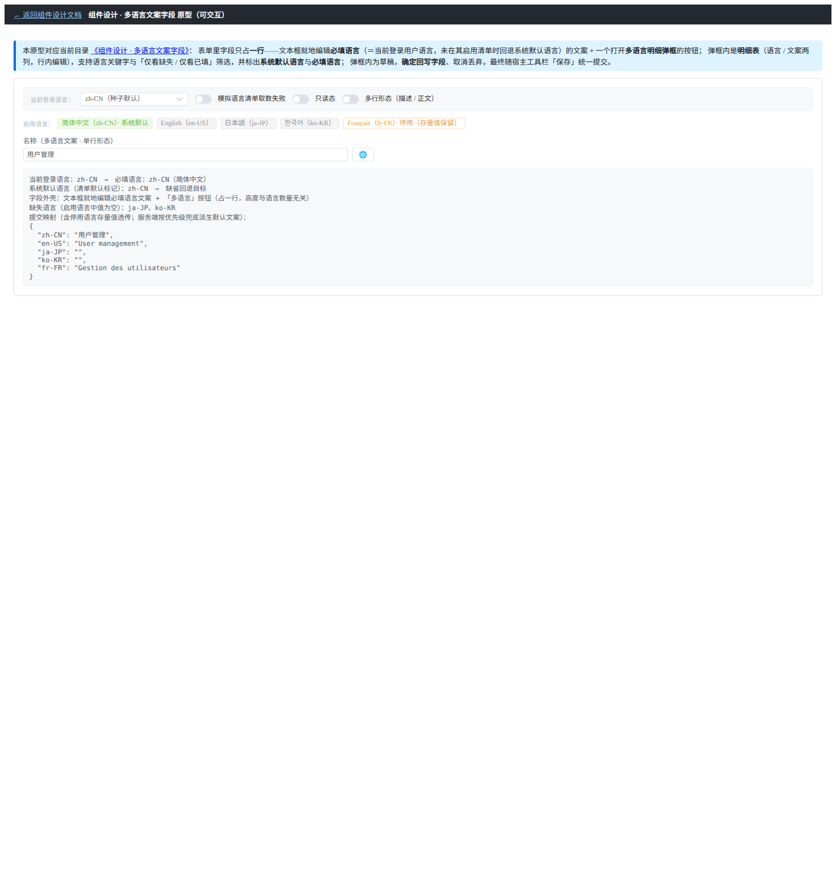
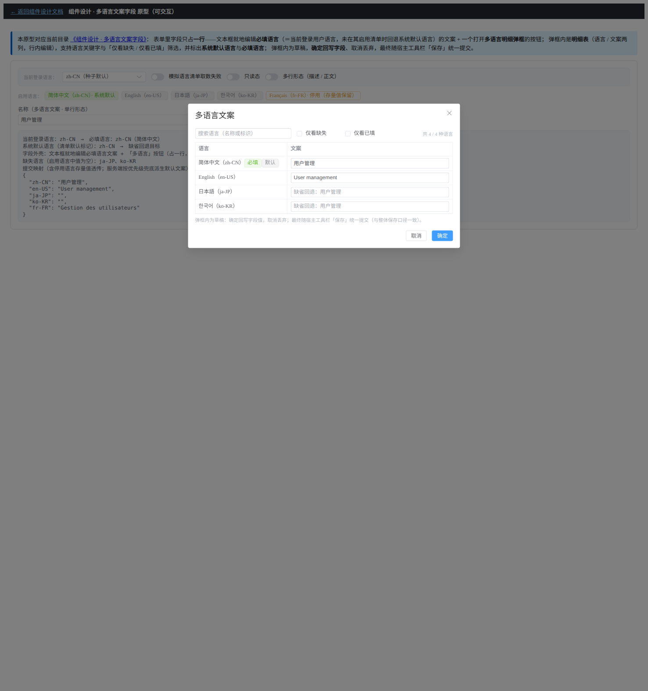

# 01 测试 · 多语言文案字段

> 前端组件库 · 06 字段类 · 08 多语言文案字段（需求 06-8）· 测试记录

[文档首页](../../../../../../文档首页.md) › [06 字段类](../../06_字段类.md) › [08 多语言文案字段](../06_字段类_08_多语言文案字段.md) › 测试记录　|　[← 实施记录](../实施/01_实施_08_多语言文案字段.md)

## 1. 测试信息 

| 项 | 值 |
| --- | --- |
| 任务 | 08 多语言文案字段（[任务](../06_字段类_08_多语言文案字段.md)） |
| 对应需求 | [06-8](../../../../需求/06_需求_字段类.md#r06-8) |
| 详细设计 | [01_详细设计_08_多语言文案字段.md](../设计/01_详细设计_08_多语言文案字段.md) |
| 实施记录 | [01_实施_08_多语言文案字段.md](../实施/01_实施_08_多语言文案字段.md) |
| 测试日期 | 2026-10-10 |
| 测试人 | minjian |
| 测试环境 | Ubuntu 开发机 · Vitest 5（core：node；ui-ep：jsdom + @vue/test-utils）· Vue 3.5 · TypeScript 严格模式 · Python 3.14（platform 定向用例与种子一致性） |
| Kiwi 用例 | 2242（分类「平台骨架」/ P2 / CONFIRMED / 标签「自动化」） |
| 结论 | 全部通过（core 1302 + ui-ep 969 用例；platform 定向 464 用例含新增 4 项；typecheck / ESLint / 护栏 / 文档门禁通过） |

## 2. 测试范围与用例 

| 层次 | 文件 | 覆盖范围 |
| --- | --- | --- |
| 核心 · 领域 | `core/tests/domain-i18n-name.spec.ts` | 清单归一（去空白 / 去重保序 / 默认标记唯一 / 语言名回落）、默认语言解析（标记缺失或重复即空串）、必填语言解析（用户语言命中 / 大小写与空白归一 / 未启用回退默认语言 / 回退清单首项）、语言行排序与标记、缺失派生与已填计数、回退链（当前 → 默认 → 首个有值 → 空串）、默认文案派生优先级（**与服务端共用一套期望值**）、提交载荷（去空白 + 停用语言存量值透传）、校验（必填缺失 + 长度按 Unicode 码点）、明细筛选三态与关键字、未保存变更判定、外壳提示与缺省回退提示 |
| 核心 · 组件基类 | `core/tests/i18n-name-field.spec.ts` | 占位零请求、清单驱动（一次装载 / 必填语言取用户语言）、用户语言未启用回退、取数失败降级与恢复、就地编辑与逐语言编辑与提交载荷、必填阻断与恢复、只读回退链与缺失提示、默认文案派生预览与脏判定、弹框草稿隔离与确定回写、弹框筛选三态 |
| 契约 · 同契约多实现 | `core/testing/multilingual-name.ts`（经 `ui-ep/tests/multilingual-name.spec.ts` 驱动） | 占位零请求与降级标记、语言行随清单增减而**受控值形状不变**、必填语言解析与阻断、提交载荷与派生优先级、弹框草稿隔离 / 取消丢弃 / 确定回写、回退链与筛选、取数失败降级与重注入恢复 |
| 插件 · 件族 | `ui-ep/tests/multilingual-name.spec.ts` | 单行件（就地编辑上报受控值、按钮提示完整度与缺失语言、必填内联错误与 `invalid` 事件、只读回退回显）、多行件（文本域同口径 + 弹框开启 + 受控值上报）、明细弹框件（必填 / 默认 / 缺失标记、已填计数、缺省回退提示、行内编辑事件、筛选三态与空态、确定与取消各自上报、不可见不渲染） |
| 插件 · 数据源与投影 | `ui-ep/tests/multilingual-name.spec.ts` | HTTP 内建数据源（端点 `/api/v1/i18n/locales/enabled` 与 `GET`、统一响应解包、业务码非零抛错、注册表默认键 `http`、当前登录用户语言解析）、投影（未就绪占位零请求、就绪即装载语言行、必填语言解析、草稿与确定回写、提交载荷） |
| 后端（跨域项） | `services/platform/tests/api/test_menu_metadata.py`、`tests/seed/test_seed_menu_consistency.py` | 缺必填语言拒绝（40208）、主表默认文案派生优先级（系统默认语言优先）、维护视图出参完整 `i18n` 与必填语言回填（菜单 / 字段 / 业务码）、种子「主表默认文案 ≡ 附表默认语言」一致性（正向 + 漂移拒绝） |
| 护栏 | `core/tests/guard-manifest.spec.ts`、`guard-base-registry.spec.ts`、`guard-jsdoc.spec.ts`、`guard-core-framework-agnostic.spec.ts`、`ui-ep/tests/guard-component-inheritance.spec.ts`、`guard-single-source.spec.ts`、`guard-tokens.spec.ts` | 能力文件 identifier ↔ 能力登记表 ↔ 清单已交付双向零差集、基类清单与源码定义与入口导出三向一致、JSDoc 齐备、核心框架无关（浏览器 API 只在 `ui-ep/utils/`）、组件实质挂继承链、不直引第三方 |

## 3. 执行记录与结果 

| 命令 | 结果 |
| --- | --- |
| `pnpm --filter @bms/core exec vitest run` | 106 文件 / **1302 用例通过**（新增 2 文件 / 27 用例） |
| `pnpm --filter @bms/ui-ep exec vitest run` | 69 文件 / **969 用例通过**（新增 1 文件 / 18 用例） |
| `pnpm --filter @bms/core run typecheck` / `run lint` | 通过（`tsc --noEmit`；`eslint --max-warnings 0`） |
| `pnpm --filter @bms/ui-ep run typecheck` / `run lint` | 通过（`vue-tsc --noEmit`；`eslint --max-warnings 0`） |
| `python3 scripts/tools/base-check/check-base.py` | 通过（清单登记 196 ↔ 磁盘 196，缺失 0） |
| `cd backend && uv run pytest services/platform/tests -q` | 464 用例通过（1 skipped；含本任务新增 4 项） |
| `cd backend && uv run ruff check` / `ruff format --check` / `uv run pyright <改动文件>` | 通过 |
| `python3 scripts/tools/base-check/check-prototype-review.py <任务目录> --task` | 通过（原型依据 + 逐项对照结论齐备） |

## 4. 问题与处置 

| # | 问题 | 处置与落点 |
| --- | --- | --- |
| 1 | 件初版未就绪即提示「取数失败」，宿主直接给清单时误判降级 | 件级「生效就绪态」以显式 `ready` 为准，否则「给了语言清单或数据源」即视为就绪。详见[实施记录 §4](../实施/01_实施_08_多语言文案字段.md#issues) 问题 6 |
| 2 | 能力键 / 类名含数字被登记护栏漏扫 | 键与类名改无数字口径（`multilingual-name` / `BaseMultilingualName`）。详见实施记录 §4 问题 1 |
| 3 | 多行件纯转发、弹框件纯类型引入，被继承链护栏判违规 | 多行件实现为完整件、弹框件以输入投影承载关键字输入链。详见实施记录 §4 问题 2 |
| 4 | 契约套件首版漏设初始文案，语言行缺失断言不符 | 套件内先设契约文案再断言语言行（已随套件固化）。详见实施记录 §4 问题 4 相关 |

## 5. 覆盖率 

- 核心新增模块（`domain/i18n-name.ts`、`capabilities/i18n-locale-source.ts`、`capabilities/i18n-name-field.ts`、`testing/multilingual-name.ts`）与 `ui-ep` 投影 / 工具 / 三件均有用例覆盖：清单归一与非法清单、必填语言全分支、缺失与回退链、提交载荷与停用语言透传、长度码点边界、明细筛选三态、弹框草稿三态（编辑 / 取消 / 确定）、占位与降级、取数失败与恢复、HTTP 端点与错误码。
- 未覆盖项：真实启用语言出口联调（接口随「国际化管理」阶段落地）、消费方页面内联接入（随各页面任务）、移动端实现（随移动端组件任务）。

## 6. 偏差与遗留 

- 消费方页面件替换、宿主 dev 核对页、移动端同契约实现均为后续交付，登记见[实施记录 §6](../实施/01_实施_08_多语言文案字段.md#deviations)。
- 上游依赖：启用语言清单只读出口与 `sys_i18n_locale.is_default` 随「国际化管理」阶段实现（本次以注入式占位覆盖，不造假数据）。

## 7. 原型对照结论 

原型依据：[组件设计 · 多语言文案字段](../../../../../../设计/组件设计/06_字段类/13_组件设计_多语言文案字段/13_组件设计_多语言文案字段.md) 自带可交互原型 [13_原型设计_多语言文案字段.html](../../../../../../设计/组件设计/06_字段类/13_组件设计_多语言文案字段/13_原型设计_多语言文案字段.html)；消费方形态依据页面原型 [动作码表单页.html](../../../../../../设计/原型设计/10_菜单管理/11_动作码表单页.html)（整改后同口径）。

| # | 对照项 | 原型依据 | 实现实测 | 结论 |
| --- | --- | --- | --- | --- |
| 1 | 字段形态 | 组件设计原型「字段外壳」：字段恒占一行，文本框就地编辑必填语言 + 图标按钮，标签不标注「多语言」 | `MultilingualNameField` / `MultilingualTextField` 同口径渲染（文本框 / 文本域 + `🌐` 按钮，按钮 `title` 给完整度或缺失语言） | 一致 |
| 2 | 语言清单驱动 | 原型顶部语言清单可切换（含默认与必填标记） | 语言行由 `setLocales` / 数据源驱动，清单增减只改行数，受控值形状与提交契约不变 | 一致 |
| 3 | 必填语言与阻断 | 原型标注「必填语言＝当前登录用户语言，未启用回退系统默认语言」 | `resolveRequiredLocale` 全分支 + 件内联错误 + `invalid` 事件 + 服务端按请求语言拒绝（40208） | 一致 |
| 4 | 明细弹框 | 原型「多语言明细弹框」：明细表行内编辑 + 默认 / 必填标记 + 关键字与「仅看缺失 / 仅看已填」筛选 + 缺省回退提示 | `MultilingualDetailDialog` 同口径（行内编辑事件、标记、计数、回退提示、筛选三态与空态、确定 / 取消） | 一致 |
| 5 | 草稿语义 | 原型说明「弹框内为草稿，确定回写、取消丢弃，落库随宿主保存」 | 核心基类草稿与基线分离；件层编辑不改受控值，确定回写、取消丢弃（用例覆盖） | 一致 |
| 6 | 消费方形态 | 页面原型 [动作码表单页.html](../../../../../../设计/原型设计/10_菜单管理/11_动作码表单页.html)（已整改：去掉写死的中英文两栏） | 组件契约与提交载荷（整体 `i18n` 映射）与之对齐；页面接入随消费方任务 | 一致 |

截图证据（原型实测）：

> 本文档依《[文档生成规范](../../../../../../规范/文档生成规范.md)》编写
