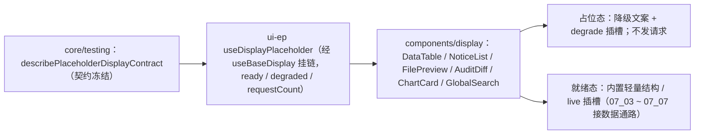

# 01 实施 · 占位版交付

> 前端组件库 · 07 展示类 · 子任务 01（需求 07-1）· 实施记录

[文档首页](../../../../../../文档首页.md) › [07 展示类](../../07_展示类.md) › [01 占位版交付](../07_展示类_01_占位版交付.md) › 实施记录　|　[← 任务](../07_展示类_01_占位版交付.md)

## 1. 实施信息 

| 项 | 值 |
| --- | --- |
| 任务 | [01 占位版交付](../07_展示类_01_占位版交付.md) |
| 对应需求 | [07-1](../../../../需求/07_需求_展示类.md#r07-1) |
| 详细设计 | [01 详细设计](../设计/01_详细设计_01_占位版交付.md) |
| 实施日期 | 2026-09-18 |
| 实施人 | minjian |
| 实施环境 | 本地开发机（Node v24.20.0 / pnpm 11.x，npmmirror） |
| 提交 | 任务基线 `b8d0e1a3` 后追加；实施见本次提交 |
| 结论 | 完成 |

## 2. 实施概览 

## 3. 实施过程 

1. **占位契约套件**：`@bms/core/testing` 新增 `describePlaceholderDisplayContract`（未就绪 → 降级 + 零请求、`load()` 仍零；就绪 → 不再降级），供六件占位与后续真实实现共用。
2. **占位组合式**：`useDisplayPlaceholder`（经 `useBaseDisplay` 挂链）：`ready` / `degraded` / `requestCount`（仅就绪后计数）/ `setReady` / `markLoaded` / 只读值。
3. **六件占位组件**（`components/display/`，与真实实现同名同契约）：`DataTable`（列 / 行 / 分页 / 排序 / 多选事件）、`NoticeList`（未读角标 / 打开 / 已读 / 删除）、`FilePreview`（类型分发 / 切换 / 下载 / 关闭）、`AuditDiff`（记录列表 / 查询 / 链校验 / 分页）、`ChartCard`（卡头 / 刷新 / 导出 / 图表点击）、`GlobalSearch`（关键词 / 可检索域 / 分组命中 / 引擎降级条）。
4. 统一输出 `data-ready` / `data-degraded`；`degrade` 插槽可替换降级内容；占位态一切只读且**不产生后端请求**；就绪态渲染内置轻量结构并允许 `live` 插槽替换。

## 4. 问题与处置 

| # | 问题 / 现象 | 原因 | 处置 |
| --- | --- | --- | --- |
| 1 | 表格排序列点击用例取错列 | 断言按含选择列索引取值，实际未启用多选 | 用例改按列索引 `[1]` 取排序列 |
| 2 | 分页「下一页」禁用致事件缺失 | 用例 `total` 小于页容量 | 用例改 `total: 25` 使下一页可用 |

## 5. 验证结果 

| 验证点 | 方法 | 结果 |
| --- | --- | --- |
| 类型检查 / Lint | 根 `pnpm run check`（core / vue / ui-ep） | 通过 |
| 单测（契约 + 组件） | `pnpm run ui-ep:test` | 28 文件 / 184 用例全通过（新增 10） |
| 单测（核心 / 绑定） | `core` / `vue` | 160 / 5 用例通过 |
| 文档校验 | `check-links.py` / `check-status.py` | 0 断链 / 硬规则不合规 0 |

## 6. 偏差与遗留 

- **偏差**：无（按详细设计实施）。
- **遗留**：① 真实数据通路随 `07_03` ~ `07_07`（不得改对外契约）；② 图表组件基类 `BaseChart` 随 `07_06` 新增并回写《前端基类清单》；③ 文件预签名重取、通知实时补偿、检索降级兜底细节随对应需求。

> 本文档依《[文档生成规范](../../../../../../规范/文档生成规范.md)》编写
