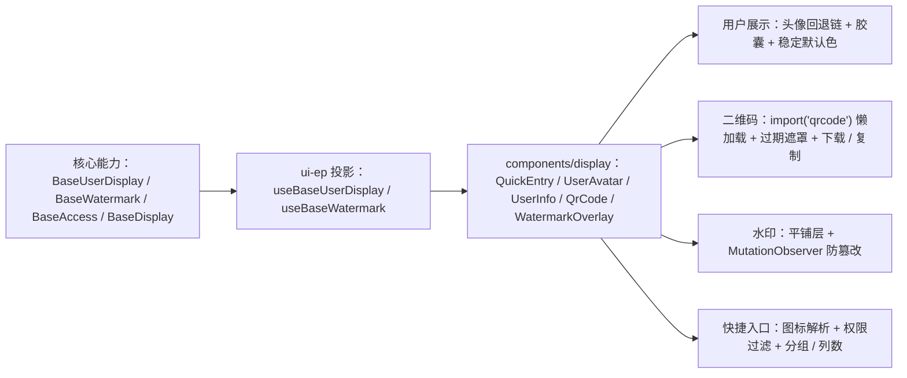

# 01 实施 · 轻量展示件

> 前端组件库 · 07 展示类 · 子任务 02（需求 07-2）· 实施记录

[文档首页](../../../../../../文档首页.md) › [07 展示类](../../07_展示类.md) › [02 轻量展示件](../07_展示类_02_轻量展示件.md) › 实施记录　|　[← 任务](../07_展示类_02_轻量展示件.md)

## 1. 实施信息 

| 项 | 值 |
| --- | --- |
| 任务 | [02 轻量展示件](../07_展示类_02_轻量展示件.md) |
| 对应需求 | [07-2](../../../../需求/07_需求_展示类.md#r07-2) |
| 详细设计 | [01 详细设计](../设计/01_详细设计_01_轻量展示件.md) |
| 实施日期 | 2026-09-18 |
| 实施人 | minjian |
| 实施环境 | 本地开发机（Node v24.20.0 / npm 11.19.0，npmmirror） |
| 提交 | 见本次提交 |
| 结论 | 完成 |

## 2. 实施概览 

## 3. 实施过程 

1. **新增依赖**：`qrcode@^1.5.4`（MIT，生成库，`import('qrcode')` 独立分包懒加载）与 `@types/qrcode`；`@element-plus/icons-vue@^2.3.2` 声明为直接依赖（快捷入口图标解析）。技术栈登记同步《架构设计 · 总体架构》6.2 与《项目规划说明》。
2. **投影**：`useBaseUserDisplay`（`BaseUserDisplay` 挂链，姓名 / 头像 / 状态 / 部门路径）、`useBaseWatermark`（`BaseWatermark` 挂链，用户 / 租户 / 开关）。
3. **快捷入口** `QuickEntry`：`entries` 按 `perm` 过滤（消费 `BaseAccess`）、按 `key` 去重、按 `order` 排序；`el:` 前缀懒加载 EP 图标解析、未知前缀降级问号；分组标题、角标、`auto` 列数（`ResizeObserver`）、`open` / `navigate` / `remove`。
4. **头像** `UserAvatar`：图片 → 首字母 → 默认图标回退链，默认色按姓名 hash 稳定派生（`hsl()`）；状态点、角标、头像组（超出 `+N`）。
5. **用户胶囊** `UserInfo`：头像 + 姓名（+ 部门）；空用户 `—`、已删除「已删除用户」；`popover` 悬停卡片、`text` 纯文字模式。
6. **二维码** `QrCode`：懒加载 `qrcode` 生成 dataURL（尺寸 / 容错级别 / 前景背景色 / 居中 logo）；`expiresIn` 倒计时过期遮罩 + 刷新；下载（位图）/ 复制；状态展示供扫码登录（轮询与换取会话后补）。
7. **水印** `WatermarkOverlay`：平铺水印层（文字 / 图片）、旋转 / 间距 / 偏移 / 透明度 / 全屏或局部；`MutationObserver` 监听被移除后自动恢复；`showTime` 分钟级刷新。

## 4. 问题与处置 

| # | 问题 / 现象 | 原因 | 处置 |
| --- | --- | --- | --- |
| 1 | 水印防篡改用例疑似死循环 | `Vue Test Utils` 游离挂载下 `isConnected` 恒为 `false`，恢复判定反复插入 | 恢复判定改用 `parentNode !== containerEl`，与是否接入 document 无关 |
| 2 | 全局 mock `@element-plus/icons-vue` 报 `No "Close" export` | EP 内部依赖该模块，全局 mock 破坏 EP | 用例改用真实图标模块，断言降级问号不出现 + `svg` 出现 |
| 3 | `Watermark` 单名单词触发 `vue/multi-word-component-names` | 组件命名规则 | 重命名 `WatermarkOverlay` |

## 5. 验证结果 

| 验证点 | 方法 | 结果 |
| --- | --- | --- |
| 类型检查 / Lint | 根 `npm run ui-ep:check` | 通过 |
| 单测 | `npm run ui-ep:test` | 29 文件 / 200 用例全通过（新增 16） |
| 文档校验 | `check-links.py` / `check-status.py` | 0 断链 / 硬规则不合规 0 |

## 6. 偏差与遗留 

- **偏差**：水印件命名定为 `WatermarkOverlay`（避单名单词 ESLint 规则）。
- **遗留**：① 扫码登录轮询与换取会话随认证阶段；② 域 08 图标选择器落地后统一 icon key 解析；③ 头像预签名 URL 随文件能力、用户批量取数随 RBAC。

> 本文档依《[文档生成规范](../../../../../../规范/文档生成规范.md)》编写
