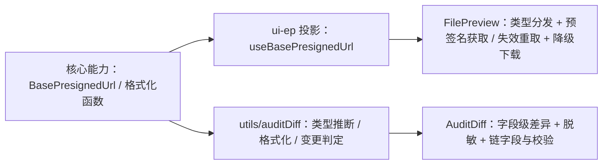

# 01 实施 · 文件预览与审计差异查看

> 前端组件库 · 07 展示类 · 子任务 03（需求 07-3）· 实施记录

[文档首页](../../../../../../文档首页.md) › [07 展示类](../../07_展示类.md) › [03 文件预览与审计差异查看](../07_展示类_03_文件预览与审计差异查看.md) › 实施记录　|　[← 任务](../07_展示类_03_文件预览与审计差异查看.md)

## 1. 实施信息 

| 项 | 值 |
| --- | --- |
| 任务 | [03 文件预览与审计差异查看](../07_展示类_03_文件预览与审计差异查看.md) |
| 对应需求 | [07-3](../../../../需求/07_需求_展示类.md#r07-3) |
| 详细设计 | [01 详细设计](../设计/01_详细设计_01_文件预览与审计差异查看.md) |
| 实施日期 | 2026-09-18 |
| 实施人 | minjian |
| 实施环境 | 本地开发机（Node v24.20.0 / npm 11.19.0，npmmirror） |
| 提交 | 见本次提交 |
| 结论 | 完成（前端 + mock；真实接口联调遗留） |

## 2. 实施概览 

## 3. 实施过程 

1. **预签名投影**：`useBasePresignedUrl`（`BasePresignedUrl` 挂链）：`setFetcher` / `get`（有效复用、失效重取、未注入降级）/ `refresh` / `isExpired`。
2. **审计值渲染纯函数** `utils/auditDiff.ts`：`inferValueType`（text / number / amount / date / boolean / json / richtext / dict）、`formatDiffValue`（复用核心 `formatAmount` / `formatNumber` / `formatDateTime`，脱敏值原样）、`diffKind`（新增 / 修改 / 删除 / 未变）。
3. **文件预览** `FilePreview`（在 `07_01` 契约上新增可选 `presignedFetcher` / `textLimit`，`PreviewFile` 增 `url?`）：类型分发（图片缩放旋转 / PDF 内嵌 / 音视频原生 / 文本拉取截断 / 其他降级下载）；加载失败**自动重取一次**，仍失败错误态 + 下载；预签名经能力注入，组件不硬编码接口。
4. **审计差异查看** `AuditDiff`（新增可选 `diff` / `prevHash` / `recordHash` / `chainVerified`）：变更列表 + 字段级旧值 → 新值类型感知渲染 + 脱敏原样 + 新增 / 修改 / 删除高亮 + 链字段缩写与校验结果（异常可定位篡改记录）。

## 4. 问题与处置 

| # | 问题 / 现象 | 原因 | 处置 |
| --- | --- | --- | --- |
| 1 | 媒体重取第二次失败后仍渲染图片 | 错误态判定被媒体分支 `v-if` 抢先 | 错误态分支提到最前，媒体分支仅在无错误时渲染 |

## 5. 验证结果 

| 验证点 | 方法 | 结果 |
| --- | --- | --- |
| 类型检查 / Lint | 根 `npm run ui-ep:check` | 通过 |
| 单测 | `npm run ui-ep:test` | 30 文件 / 205 用例全通过（新增 5） |
| 文档校验 | `check-links.py` / `check-status.py` | 0 断链 / 硬规则不合规 0 |

## 6. 偏差与遗留 

- **偏差**：无（在 `07_01` 冻结契约上仅新增可选属性，未改对外形状）。
- **遗留**：① 真实预签名 / 审计取数接口联调随阶段八（登记遗留）；② 审计字段元数据（label / valueType）由后端或页面注入；③ Office 在线预览不在 MVP（降级下载）。

> 本文档依《[文档生成规范](../../../../../../规范/文档生成规范.md)》编写
