# 01 实施 · 通知与消息

> 前端组件库 · 07 展示类 · 04 通知与消息（需求 07-4）· 实施记录

[文档首页](../../../../../../文档首页.md) › [07 展示类](../../07_展示类.md) › [04 通知与消息](../07_展示类_04_通知与消息.md) › 实施记录　|　[← 详细设计](../设计/01_详细设计_04_通知与消息.md)　[测试记录 →](../测试/01_测试_04_通知与消息.md)

## 1. 实施信息 

| 项 | 值 |
| --- | --- |
| 任务 | 07_04 通知与消息（[任务](../07_展示类_04_通知与消息.md)） |
| 对应需求 | [07-4](../../../../需求/07_需求_展示类.md#r07-4) |
| 详细设计 | [01_详细设计_04_通知与消息.md](../设计/01_详细设计_04_通知与消息.md) |
| 实施日期 | 2026-09-20 |
| 实施人 | minjian |
| 实施环境 | Ubuntu 开发机 · Node（workspace `@bms/core` + `@bms/ui-ep` + `apps/desktop`）· Vitest 5 / jsdom · Vue 3.5 / TypeScript 严格模式 · chromium headless（核对页） |
| Kiwi 用例 | 959（分类「平台骨架」/ P2 / CONFIRMED / 标签「自动化」） |
| 结论 | 完成标准达标（铃铛与列表详情可用、已读操作生效、实时与断线补偿正确、角标与实际未读一致；契约套件与核心 / 插件用例齐全；核对页 13/13） |

```mermaid
flowchart LR
    A["Kiwi 用例登记（959）"] --> B["核心领域纯函数 domain/notification.ts"]
    B --> C["能力基类 BaseNotificationCenter（父 BaseNotice）"]
    C --> D["组件基类 BaseNotification（父改之，补展示语义）"]
    D --> E["契约套件 describeNotificationContract"]
    E --> F["核心用例（domain + notification-center，新增 2 文件 / 50 用例）"]
    F --> G["投影 useBaseNotification + 工具 notificationRealtime / notificationChannel"]
    G --> H["notice 专题族四件（NoticeList 迁入 + NoticeBell / NoticeMessageItem / NoticeDetail 新增）"]
    H --> I["导出面 + 设计令牌（--bms-notice-*）"]
    I --> J["ui-ep 用例（display-notice，32 用例）"]
    J --> K["宿主核对页 notice-check（13 项自检）"]
    K --> L["门禁验证（根 check + 宿主 lint / cov / build / budget + 基座校验）"]
    L --> M["登记回写（基类清单 / 组件设计 / 架构 / 布局 / 需求 / 计划与状态）"]
```

## 2. 实施概览 

结果小结：新增 1 个能力基类、1 份领域纯函数、1 套契约套件、1 套投影、2 个浏览器工具、四件组件（1 迁入 + 3 新增）与 1 个宿主核对页；`core` 72 文件 / 881 用例、`ui-ep` 52 文件 / 698 用例全绿（本次 core 新增 2 文件 / 50 用例，ui-ep 新增 1 文件 / 32 用例）。

## 3. 实施过程 

1. **Kiwi 先行**：经容器内 Django shell 登记用例，取得编号 **959**（平台既有编号至 958）；两个核心用例文件与插件用例文件首行标注 `// kiwi_id: 959`。
2. **核心领域纯函数 `domain/notification.ts`**：消息与列表结果归一（`read` 兼容 `is_read`、`type` 白名单回落、`bizType` / `bizId` 兼容下划线）、角标夹取与 `99+` 文案、最近 N 条（按创建时间降序、时间缺失最旧且稳定保序）、类型 / 已读筛选、按 `id` 去重合并、实时增量（派生稳定键 + 未读 / 总数只加一次）、乐观已读 / 删除与快照回滚、类型语义色与文案、跳转目标判定、查询参数映射（`is_read` / `size`）、轮询判定与连接状态文案。
3. **新增能力基类 `BaseNotificationCenter`（`capabilities/notification-center.ts`）**：未读与角标、列表 / 详情取数编排（注入式 `NotificationJobs`）、未读数校准、批次 / 全部已读、单条删除、**本地乐观 + 失败回滚**、实时订阅与断线补偿（注入式 `NotificationRealtimeAdapter`）、轮询占位（30s、不可见暂停、恢复即时校准）、连接生命周期与释放。占位态（`ready=false`）零请求。
4. **组件基类 `BaseNotification` 父基类调整**：由 `BaseNotice` 改 `BaseNotificationCenter`（中间层插入为兼容变更），保留 `items` / `unread` / `push` / `markRead` / `markAllRead`（由父类继承，签名不变，`instanceof BaseNotice` 仍成立），补展示语义 `messageSemantic` / `messageLabel` / `jumpTargetOf`；`components-bases.spec.ts` 既有断言未改动即通过。
5. **能力依赖登记与导出面**：`manifest.ts` 新增 `notification-center: ['notice']`、`notification` 改 `['notification-center']`；`core/src/index.ts` 新增领域模块与能力基类导出。
6. **契约套件 `describeNotificationContract`**（`core/testing/notification.ts`）：占位零请求、就绪结算、未读校准、乐观已读 / 删除与失败回滚、批量去重、实时去重、断线补偿、角标 `99+`、连接派发与释放；核心与 `ui-ep` 各传适配器跑同一套断言。
7. **核心用例**：`domain-notification.spec.ts`（归一 / 角标 / 最近 N / 筛选 / 去重 / 实时 / 乐观回滚 / 语义与跳转 / 查询与轮询）与 `notification-center.spec.ts`（契约驱动 + 身份依赖 + 占位门控 + 取数错误 + 实时 / 轮询 + 勾选）。
8. **投影与工具**：`useBaseNotification`（核心实例 ↔ Vue 响应式薄适配，含多标签通道与可见性接线、`setUnreadCount` / `setItems` 本地覆盖）；`utils/notificationRealtime.ts`（轮询占位与可见性）；`utils/notificationChannel.ts`（`BroadcastChannel` 多标签同步，能力缺失静默降级）。
9. **notice 专题族四件**（`ui-ep/src/components/notice/`）：
   - `NoticeList`（自 `components/display/` 迁入 + 真实实现）：筛选 / 分页 / 批量已读 / 全部已读 / 单条删除 / 骨架·空·错误三态；**既有 Props / 事件 / 插槽 / `data-test` 保持 `07_01` 冻结形状**，仅向后兼容新增；旧路径删除；
   - `NoticeBell`（新增）：未读角标（`0` 不显示、`> 99` 显示 `99+`）、下拉最近 N 条（缺省 5）、查看全部 / 全部已读、连接状态；
   - `NoticeMessageItem`（新增）：类型语义色 + 文案、标题 / 摘要、相对时间（悬浮绝对时间）、未读高亮、跳转标记、删除入口；三处复用；
   - `NoticeDetail`（新增）：`ElDrawer` 抽屉、查看即已读（幂等）、跳转业务单据。
10. **导出面与令牌**：`ui-ep/src/index.ts` 迁移 `NoticeList` 路径并新增三件与投影 / 工具导出；`apps/desktop/src/styles/tokens.scss` 新增 `--bms-notice-unread-bg` / `--bms-notice-item-hover-bg` / `--bms-notice-badge-bg`（亮 / 暗两套，只增不改）。
11. **用例**：`ui-ep/tests/display-notice.spec.ts` 32 条（契约套件适配 + 投影 + 四件 + 轮询 / 多标签工具）；既有 `ui-ep/tests/display-placeholder.spec.ts`（`07_01` 冻结契约）**未改动即通过**。
12. **宿主核对页**：`apps/desktop/notice-check.html` + `src/dev/{noticeCheck.ts,NoticeCheck.vue}`（13 项自检），`vite build` 不包含；chromium headless（`--ozone-platform=headless --use-gl=swiftshader`）`--dump-dom` 核验 **13/13**（连续 3 次稳定）。

## 4. 验证结果 

| 命令 | 结果 |
| --- | --- |
| 根 `pnpm run check`（core + vue + ui-ep） | 72 + 2 + 52 文件 / 881 + 5 + 698 用例全绿（core 新增 2 文件 / 50 用例，ui-ep 新增 1 文件 / 32 用例） |
| 宿主 `pnpm exec vue-tsc -b` / `pnpm run lint` | 通过 |
| 宿主 `pnpm run test:cov` | 通过 |
| 宿主 `pnpm run build` / `pnpm run budget` | 通过（首屏合计 119.7 KB / 预算 260 KB；首屏最大单文件 104.2 KB / 预算 150 KB；14 个异步块不计入首屏） |
| 开发态核对页（chromium headless `--dump-dom`） | **13 / 13** 自检项通过 |
| 既有 `ui-ep/tests/display-placeholder.spec.ts`（`07_01` 冻结契约） | 未改动即通过（`NoticeList` 迁移路径与真实实现后，占位降级 / 未读数 / 点击 / 已读 / 删除 / 全部已读断言保持） |
| `python3 scripts/tools/base-check/check-links.py` / `check-base.py` | 通过（断链 0、失效锚点 0；基座清单与磁盘一致） |

对照完成标准：铃铛（角标实时增量 / `99+` / 下拉 / 查看全部）与列表详情可用；已读 / 删除操作生效（本地乐观 + 失败回滚）；实时增量去重与断线重连拉未读数补偿正确；角标以本地乐观即时 + 服务端重连 / 聚焦 / 批量响应三处校准收敛；Vitest 覆盖补偿与角标分支；`vue-tsc` / ESLint / Vitest 全通过。

## 5. 偏差与遗留 

- **工时偏差**：名义 14h；因新增 1 个能力基类、1 份领域纯函数、1 套契约套件、1 套投影、2 个浏览器工具、四件组件（1 迁入 + 3 新增）与 13 项自检核对页，实际上浮。
- **对外契约扩展**（向后兼容）：`NoticeList` 新增可选 Props（`total` / `page` / `pageSize` / `typeFilter` / `readFilter` / `selectable` / `selectedIds` / `error` / `firstLoad` / `emptyText` / `showHeader` / `showFilter` / `errorText`）、事件（`update:page` / `update:pageSize` / `update:typeFilter` / `update:readFilter` / `update:selectedIds` / `read-batch` / `retry` / `selection-change`）与插槽（`header` / `filter` / `error` / `footer` / `item-actions`）；`NoticeItem` 类型向后兼容新增可选 `bizType` / `bizId`；既有 Props / 事件 / 插槽 / `data-test` 不变（迁移至 `components/notice/`，导出名不变，旧路径删除）。
- **核心面新增**（只增不改）：新增能力基类 `BaseNotificationCenter`；`BaseNotification` 父基类由 `BaseNotice` 改 `BaseNotificationCenter`（中间层插入为兼容变更，既有行为不变）；`manifest.ts` `notification` 依赖改 `notification-center`；领域函数以 `notification` 前缀命名（避让既有 `domain` 同名导出）；列表加载态命名 `listLoading`（避让组件根 `loading`）。
- **口径出入（有意偏差）**：角标 / 已读 / 删除采用**本地乐观 + 失败回滚 + 服务端三处校准**，与《组件设计 · 通知与消息》§9「以服务端为唯一口径」不一致——按用户拍板执行并**已回写组件设计 §9**；需求 07-4 与任务条「复用用户展示能力基类 `BaseUserDisplay`」按语义改为「类型与已读状态用 `07_05` 语义色能力（`StatusTag` + `domain/status.ts`）；`BaseUserDisplay` 仅用于消息内用户信息」，**已回写需求与任务条文字**。
- **实时通道**：本轮冻结 `NotificationRealtimeAdapter` 接口 + 轮询占位（30s、可见才轮询）+ 断线补偿纯函数；**未新增 `socket.io-client` 依赖与分包**；真实 Socket.IO 客户端接入与联调归阶段八 + 十窗口（换通路不动组件对外契约）。
- **真实接口联调**：列表 / 详情 / 未读数 / 已读 / 删除经 `NotificationJobs` 注入，未注入即占位零请求；真实通知接口联调归口后续窗口。
- **多标签同步范围**：以未读数同步为准（`setUnreadCount`）；消息内容随服务端下次取数 / 校准收敛，避免跨标签重复请求。
- **工作台通知卡**：`NoticeMessageItem` 已就位供复用；卡片与工作台布局集成归首页工作台任务。
- **移动端**：本期仅 PC；契约套件 `describeNotificationContract` 就位供后续同契约多实现。
- **Kiwi 用例台账**：用例 959 已在平台登记（test 仓《Kiwi 用例台账》按该台账维护节奏补记）。

> 本文档依《[文档生成规范](../../../../../../规范/文档生成规范.md)》编写
