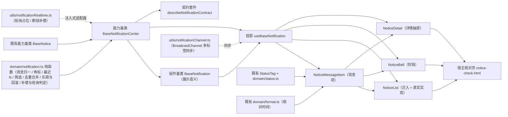

# 01 详细设计 · 通知与消息

> 前端组件库 · 07 展示类 · 04 通知与消息 · 需求 07-4 · 详细设计

[文档首页](../../../../../../文档首页.md) › [07 展示类](../../07_展示类.md) › [04 通知与消息](../07_展示类_04_通知与消息.md) › 详细设计　|　[← 任务](../07_展示类_04_通知与消息.md)

## 1. 设计目标与范围 <a id="goal"></a>

交付[需求 07-4](../../../../需求/07_需求_展示类.md#r07-4) 的**通知与消息**件族与通知中心编排能力：

- **顶栏铃铛**：未读角标（实时增量、`>99` 显示 `99+`）、下拉最近 N 条（缺省 5）、「查看全部」入口、空态。
- **通知列表**：类型 / 已读筛选、分页、勾选批量已读、全部已读、单条删除、加载 / 空 / 错误三态。
- **消息项**：类型图标与语义色、标题 / 摘要、相对时间、未读高亮、`biz_type` / `biz_id` 跳转、删除入口；列表 / 铃铛下拉 / 工作台通知卡三处复用。
- **通知详情**：标题 / 类型 / 时间 / 内容、**查看即已读**（幂等）、跳转业务单据；PC 用抽屉。
- **通知中心编排**：未读数与角标、列表 / 详情取数编排、实时订阅与**断线补偿**、批量 / 全部已读、单条删除、**本地乐观 + 失败回滚**、多标签页同步。
- **能力基类新增**：按《[前端基类清单](../../../../../../前端基类清单.md)》流程新增**通知中心编排能力基类 `BaseNotificationCenter`**（父 `BaseNotice`，`07_04` 交付），通知族链调整为 `BaseComponent → BaseNotice → BaseNotificationCenter → BaseNotification → 具体件`；能力依赖登记 `notification-center: ['notice']`、`notification: ['notification-center']`。
- **对外契约不变**：`NoticeList` 的导出名与既有 Props / 事件 / 插槽 / `data-test` 保持 `07_01` 冻结形状，本次只**向后兼容新增**可选 Props / 事件 / 插槽（变更走版本升级）。

### 1.1 口径与依从 <a id="positioning"></a>

- **架构铁律**：未读 / 角标、取数编排、实时订阅与补偿、批量已读与删除、乐观与回滚均为**横切功能**，落为**继承链上的能力基类**（`capabilities/notification-center.ts`）与**领域纯函数**（`domain/notification.ts`）；展示语义落组件基类 `BaseNotification`；具体件只做渲染与交互回传，**不得链外挂接、不得重复实现角标与补偿**。
- **继承链（唯一权威见《前端基类清单》）**：`BaseComponent`（组件根）→ `BaseNotice`（通知能力基类）→ `BaseNotificationCenter`（**新增**通知中心编排能力基类）→ `BaseNotification`（通知族组件基类）→ 具体件（经投影 `useBaseNotification` 挂链）。
- **核心框架无关（强制）**：核心包不得依赖 Vue / DOM / 浏览器 API / `socket.io-client`；实时通道以**注入式适配器** `NotificationRealtimeAdapter` 接入，轮询与 `BroadcastChannel` 归 `ui-ep`。
- **取数与交互分离**：**取数归使用方**（列表 / 详情 / 未读数 / 已读 / 删除经注入式处理函数 `NotificationJobs`）；四个件**不自行发请求**；**未注入即占位零请求**（保持 `07_01` 冻结口径）。
- **实时通道口径**：本轮冻结 `NotificationRealtimeAdapter` 接口与断线补偿纯函数，**未注入适配器即轮询占位**（周期 30s、页面可见才轮询、未就绪零请求）；真实 Socket.IO 客户端接入归后续窗口（换通路不动组件对外契约、不新增依赖与分包）。
- **一致性口径**：**本地乐观更新 + 失败回滚**——角标与已读 / 删除本地即时更新并快照，提交失败回滚并提示；服务端未读数在重连、聚焦、批量响应三处校准（对《组件设计 · 通知与消息》§9 的有意偏差，已随本任务回写，见 §8 决策记录 4 / 5）。
- **令牌（强制）**：角标底色复用 `--bms-color-danger`，未读高亮与悬停走新增 `--bms-notice-*` 令牌组；类型语义色复用 `--bms-color-*`（`StatusTag` 与 `domain/status.ts`）；**禁止硬编码色值**。
- **端范围**：**仅 PC**（`frontend/packages/ui-ep`）；移动端本期不落实现，但契约套件 `describeNotificationContract` 就位供后续同契约多实现。
- **工时**：本任务 14h；因新增 1 个能力基类、1 份领域纯函数、1 套契约套件、1 套投影、1 个实时 / 多标签工具、四件组件（1 迁入 + 3 新增）与宿主核对页，实际上浮在实施记录登记。

## 2. 交付物清单 <a id="deliver"></a>

| # | 交付物 | 落点 |
| --- | --- | --- |
| 1 | 通知领域纯函数与数据模型（新增） | `core/src/domain/notification.ts` |
| 2 | 通知中心编排能力基类 `BaseNotificationCenter`（新增） | `core/src/capabilities/notification-center.ts` |
| 3 | 通知族组件基类 `BaseNotification`（父基类改 `BaseNotificationCenter`，补展示语义） | `core/src/capabilities/notification.ts` |
| 4 | 能力依赖登记（新增 `notification-center` 一键，`notification` 改依赖） | `core/src/capabilities/manifest.ts` |
| 5 | 核心导出面登记 | `core/src/index.ts` |
| 6 | 契约套件 `describeNotificationContract`（新增） | `core/testing/notification.ts`、`core/testing/index.ts` |
| 7 | 核心用例（领域 + 能力基类） | `core/tests/domain-notification.spec.ts`、`core/tests/notification-center.spec.ts` |
| 8 | 通知族投影（新增） | `ui-ep/src/composables/useBaseNotification.ts` |
| 9 | 实时 / 轮询 / 多标签工具（新增） | `ui-ep/src/utils/notificationRealtime.ts`、`ui-ep/src/utils/notificationChannel.ts` |
| 10 | 消息项（新增，三处复用） | `ui-ep/src/components/notice/NoticeMessageItem.vue` |
| 11 | 通知列表（迁移 + 真实实现） | `ui-ep/src/components/notice/NoticeList.vue`（旧路径 `components/display/NoticeList.vue` 删除） |
| 12 | 顶栏铃铛（新增） | `ui-ep/src/components/notice/NoticeBell.vue` |
| 13 | 通知详情（新增，抽屉） | `ui-ep/src/components/notice/NoticeDetail.vue` |
| 14 | 导出面登记（路径迁移 + 三件新增 + 投影） | `ui-ep/src/index.ts` |
| 15 | 设计令牌（新增 `--bms-notice-*` 组，亮 / 暗两套） | `apps/desktop/src/styles/tokens.scss` |
| 16 | 用例（投影 + 四件 + 实时 / 补偿 / 乐观回滚 / 多标签） | `ui-ep/tests/display-notice.spec.ts` |
| 17 | 宿主核对页（`vite build` 不含） | `apps/desktop/notice-check.html`、`apps/desktop/src/dev/{noticeCheck.ts,NoticeCheck.vue}` |
| 18 | 登记回写（基类清单 / 组件设计 / 架构 / 布局 / 需求 / 计划与状态） | 见第 6 节 |



```text
ui-ep/src/components/
├── notice/                            # 新增专题族（通知与消息；同 data/ chart/ approval/ 先例）
│   ├── NoticeMessageItem.vue          # 消息项（新增；列表 / 铃铛下拉 / 工作台通知卡三处复用）
│   ├── NoticeList.vue                 # 通知列表（自 components/display/ 迁入 + 真实实现）
│   ├── NoticeBell.vue                 # 顶栏铃铛（新增：未读角标 + 下拉最近通知 + 查看全部）
│   └── NoticeDetail.vue               # 通知详情（新增：抽屉、查看即已读、跳转业务单据）
└── display/                           # NoticeList 迁出后其余件不动
                                        # （DataTable 等已迁出；FilePreview / AuditDiff / QrCode /
                                        #  UserAvatar / UserInfo / QuickEntry / WatermarkOverlay / GlobalSearch）
```

## 3. 接口 / 契约与边界 <a id="contract"></a>

### 3.1 核心：`domain/notification.ts`（新增纯函数与数据模型） <a id="domain"></a>

```ts
/** 未读角标显示上限（超过显示 `99+`）。 */
export const NOTIFICATION_BADGE_MAX = 99
/** 铃铛下拉最近通知条数（缺省）。 */
export const NOTIFICATION_RECENT_LIMIT = 5
/** 未注入实时适配器时的轮询间隔（毫秒）。 */
export const NOTIFICATION_POLL_INTERVAL = 30_000
/** 列表页长缺省与上限。 */
export const NOTIFICATION_PAGE_SIZE_DEFAULT = 20
export const NOTIFICATION_PAGE_SIZE_MAX = 200
/** 批量已读 id 列表上限（与后端 70003 同源）。 */
export const NOTIFICATION_BATCH_MAX = 500
/** 消息类型（与后端 `sys_notification.type` 同源）。 */
export const NOTIFICATION_TYPES: readonly NotificationMessageType[]
export type NotificationMessageType = 'notice' | 'todo' | 'system'
/** 已读筛选档。 */
export const NOTIFICATION_READ_FILTERS: readonly NotificationReadFilter[]
export type NotificationReadFilter = 'all' | 'unread' | 'read'
/** 实时通道状态。 */
export type NotificationConnectionState = 'idle' | 'connecting' | 'connected' | 'reconnecting' | 'offline'
/** 通知消息（归一形态；字段与后端 `sys_notification` 对齐）。 */
export interface NotificationMessage {
  id: string
  title: string
  content?: string
  type?: NotificationMessageType
  read?: boolean
  createdAt?: string
  bizType?: string
  bizId?: string
}
/** 列表查询条件。 */
export interface NotificationQuery {
  type?: NotificationMessageType | 'all'
  read?: NotificationReadFilter
  page?: number
  pageSize?: number
}
/** 列表结果（含未读数校准值）。 */
export interface NotificationPage {
  items: NotificationMessage[]
  total: number
  unreadCount?: number
}
/** 实时增量载荷（`notification.new` / `approval.todo`）。 */
export interface NotificationRealtimePayload {
  id?: string
  title: string
  type?: NotificationMessageType
  bizType?: string
  bizId?: string
  createdAt?: string
}
/** 乐观更新前的状态快照（回滚用）。 */
export interface NotificationSnapshot {
  items: NotificationMessage[]
  unreadCount: number
  total: number
}

normalizeNotificationMessage(value: unknown): NotificationMessage | undefined
normalizeNotificationMessages(value: unknown): NotificationMessage[]
normalizeNotificationPage(value: unknown): NotificationPage
isUnread(message: NotificationMessage): boolean
countUnread(items: readonly NotificationMessage[]): number
clampBadgeCount(count: unknown, max?: number): number
badgeTextOf(count: unknown, max?: number): string
shouldShowBadge(count: unknown): boolean
recentMessages(items: readonly NotificationMessage[], limit?: number): NotificationMessage[]
filterNotificationMessages(items: readonly NotificationMessage[], query: NotificationQuery): NotificationMessage[]
mergeMessages(
  existing: readonly NotificationMessage[],
  incoming: readonly NotificationMessage[],
): NotificationMessage[]
applyIncoming(
  snapshot: NotificationSnapshot,
  payload: NotificationRealtimePayload,
): NotificationSnapshot
applyOptimisticRead(
  snapshot: NotificationSnapshot,
  ids: readonly string[],
): { snapshot: NotificationSnapshot; changed: number }
applyOptimisticReadAll(snapshot: NotificationSnapshot): { snapshot: NotificationSnapshot; changed: number }
applyOptimisticRemove(snapshot: NotificationSnapshot, id: string): { snapshot: NotificationSnapshot; changed: number }
restoreSnapshot(snapshot: NotificationSnapshot): NotificationSnapshot
resolveMessageSemantic(type: unknown): StatusSemantic
messageTypeLabel(type: unknown): string
jumpTargetOf(message: NotificationMessage): { bizType: string; bizId: string } | undefined
hasJumpTarget(message: NotificationMessage): boolean
buildNotificationParams(query: NotificationQuery): { type?: string; is_read?: number; page?: number; size?: number }
parseUnreadCount(value: unknown): number
isPollingNeeded(ready: boolean, hasRealtime: boolean): boolean
shouldPoll(visible: boolean, lastMs: number, nowMs: number, intervalMs?: number): boolean
connectionLabel(state: NotificationConnectionState): string
```

| 行为 | 口径 |
| --- | --- |
| 消息归一 | `normalizeNotificationMessage`：`id` / `title` 缺失视为脏项剔除；`type` 非白名单回落 `notice`；`read` 归一布尔（缺省 `false`）；`bizId` 与 `bizType` 同时存在才构成跳转 |
| 页归一 | `normalizeNotificationPage`：非对象 / 脏项回落 `{ items: [], total: 0 }`；`total` 缺省取 `items.length`；`unreadCount` 缺省不产出（不覆盖本地角标） |
| 角标 | `clampBadgeCount` 夹取到 `≥ 0` 与 `≤ max`；`badgeTextOf`：`0` → 空串、`> max` → `` `${max}+` ``、否则十进制；`shouldShowBadge` 仅 `count > 0` |
| 最近 N | `recentMessages`：按 `createdAt` 降序（缺省视为最旧、稳定保序）取前 `limit` 条（缺省 `NOTIFICATION_RECENT_LIMIT`） |
| 筛选 | `filterNotificationMessages`：`type` 为 `all` / 缺省不过滤；`read` 为 `all` 不过滤、`unread` / `read` 按 `isUnread` |
| 去重合并 | `mergeMessages`：以 `id` 为准，命中即**用新值更新**并置原位（不重复插入），未命中插到最前；保证实时重复推送不产生重复项 |
| 实时增量 | `applyIncoming`：`payload.id` 缺省按 `realtime:{createdAt}:{title}` 派生稳定键；未读 +1（**仅当该键此前不存在**）；`items` 前插并裁剪到页长边界内（列表页长归件层） |
| 乐观已读 | `applyOptimisticRead`：命中的未读项置 `read = true`，返回变更计数；`unreadCount` 按变更数递减（夹取 `≥ 0`）；`applyOptimisticReadAll` 全量置读、未读归零 |
| 乐观删除 | `applyOptimisticRemove`：按 `id` 移除并返回变更计数；未命中不改变快照 |
| 回滚 | `restoreSnapshot`：返回快照浅拷贝（消息项与数组均新引用，避免共享引用被后续变更污染） |
| 展示语义 | `resolveMessageSemantic`：`notice` → `info`、`todo` → `warning`、`system` → `primary`，未知回落 `info`；`messageTypeLabel` 出中文（站内信 / 待办提醒 / 系统提示） |
| 跳转 | `jumpTargetOf`：`bizType` 与 `bizId` 均非空才有跳转目标，否则 `undefined`（无则打开详情） |
| 查询参数 | `buildNotificationParams`：`type` 非 `all` 才传；`read` → `is_read`（`unread` → `0`、`read` → `1`、`all` 不传）；`page` / `pageSize` 缺省不传（与后端 `/notifications` 查询契约同源） |
| 轮询判定 | `isPollingNeeded`：就绪且未注入实时适配器才为真；`shouldPoll`：页面可见且 `nowMs - lastMs ≥ intervalMs`（缺省 `NOTIFICATION_POLL_INTERVAL`） |
| 状态文案 | `connectionLabel`：`connected` → 「实时已连接」、`reconnecting` → 「实时重连中」、`offline` → 「实时已断开」、其余「实时未连接」 |
| 纯数据 | 不触 DOM、不请求、不依赖渲染框架与第三方库；同输入同输出 |

### 3.2 核心：能力基类 `BaseNotificationCenter`（新增） <a id="center"></a>

```ts
/** 通知取数与动作处理函数（使用方注入；未注入即占位零请求）。 */
export interface NotificationJobs {
  /** 列表取数（分页 + 筛选）。 */
  load?: (query: NotificationQuery) => Promise<NotificationPage | undefined>
  /** 未读数校准（初始化 / 重连 / 聚焦）。 */
  loadUnread?: () => Promise<number | undefined>
  /** 详情取数（查看即已读，幂等）。 */
  loadDetail?: (id: string) => Promise<NotificationMessage | undefined>
  /** 批量已读（返回服务端未读数校准值）。 */
  markRead?: (ids: readonly string[]) => Promise<{ unreadCount?: number } | undefined>
  /** 全部已读。 */
  markAllRead?: () => Promise<{ unreadCount?: number } | undefined>
  /** 单条删除（软删除）。 */
  remove?: (id: string) => Promise<boolean | undefined>
}
/** 实时适配器（宿主注入；未注入即轮询占位；核心不依赖 socket.io）。 */
export interface NotificationRealtimeAdapter {
  /** 建立连接。 */
  connect(): void
  /** 断开连接（幂等）。 */
  disconnect(): void
  /** 订阅连接状态。 */
  onState(handler: (state: NotificationConnectionState) => void): () => void
  /** 订阅实时消息。 */
  onMessage(handler: (payload: NotificationRealtimePayload) => void): () => void
}
/** 通知中心编排状态。 */
export type NotificationPhase = 'idle' | 'loading' | 'ready' | 'empty' | 'error'

/** 通知中心编排能力基类（抽象）。 */
export abstract class BaseNotificationCenter extends BaseNotice {
  /** 能力键。 */
  readonly identifier: string = 'notification-center'
  /** 依赖登记。 */
  override readonly depends: readonly string[] = ['notice']
  /** 数据通路是否就绪（占位语义，缺省 false）。 */
  ready: boolean
  /** 占位态请求计数（占位态恒 0）。 */
  requestCount: number
  /** 编排阶段。 */
  phase: NotificationPhase
  /** 错误文案。 */
  errorMessage: string
  /** 消息清单。 */
  readonly items: NotificationMessage[]
  /** 总数。 */
  total: number
  /** 页码（自 1）。 */
  page: number
  /** 页长。 */
  pageSize: number
  /** 类型筛选。 */
  typeFilter: NotificationMessageType | 'all'
  /** 已读筛选。 */
  readFilter: NotificationReadFilter
  /** 未读数（角标口径，本地乐观 + 服务端校准）。 */
  unreadCount: number
  /** 勾选集合（批量已读）。 */
  readonly selectedIds: Set<string>
  /** 实时连接状态。 */
  connectionState: NotificationConnectionState
  /** 取数处理函数（使用方注入）。 */
  jobs: NotificationJobs
  /** 实时适配器（宿主注入；未注入即轮询占位）。 */
  realtime: NotificationRealtimeAdapter | undefined

  get degraded(): boolean
  get empty(): boolean
  get error(): boolean
  get busy(): boolean
  get listLoading(): boolean
  get hasRealtime(): boolean
  get badgeCount(): number
  get badgeText(): string
  get showBadge(): boolean

  setReady(value: boolean): void
  setJobs(jobs: NotificationJobs): void
  setRealtime(adapter: NotificationRealtimeAdapter | undefined): void
  setPage(page: number): void
  setPageSize(size: number): void
  setTypeFilter(type: NotificationMessageType | 'all'): void
  setReadFilter(read: NotificationReadFilter): void
  setVisible(visible: boolean): void
  /** 直接设置未读数（本地校准 / 多标签同步，不发请求）。 */
  setUnreadCount(value: number): void
  /** 覆盖消息清单（种子 / 外部驱动，不发请求）。 */
  setItems(items: readonly NotificationMessage[]): void
  /** 当前查询参数（与后端契约同源）。 */
  queryParams(): Record<string, unknown>
  snapshot(): NotificationSnapshot
  /** 最近 N 条（铃铛下拉）。 */
  recent(limit?: number): NotificationMessage[]
  /** 列表取数（未就绪 / 未注入不请求）。 */
  load(): Promise<NotificationMessage[] | undefined>
  refresh(): Promise<NotificationMessage[] | undefined>
  /** 未读数校准（初始化 / 重连 / 聚焦）。 */
  syncUnread(): Promise<number | undefined>
  /** 详情取数（查看即已读，幂等）。 */
  loadDetail(id: string): Promise<NotificationMessage | undefined>
  /** 单条已读（本地乐观 + 失败回滚）。 */
  markRead(id: string): Promise<boolean>
  /** 批量已读（本地乐观 + 失败回滚；id 上限 `NOTIFICATION_BATCH_MAX`）。 */
  readBatch(ids: readonly string[]): Promise<boolean>
  /** 全部已读（本地乐观 + 失败回滚）。 */
  markAllRead(): Promise<boolean>
  /** 单条删除（本地乐观 + 失败回滚）。 */
  remove(id: string): Promise<boolean>
  toggleSelect(id: string): void
  selectAllCurrent(): void
  clearSelection(): void
  /** 接收实时增量（去重 + 角标 +1）。 */
  applyRealtime(payload: NotificationRealtimePayload): void
  /** 断线重连补偿：拉取未读数校准。 */
  compensate(): Promise<number | undefined>
  connect(): void
  disconnect(): void
  startPolling(): void
  stopPolling(): void
```

| 行为 | 口径 |
| --- | --- |
| 占位语义 | `ready === false` → `degraded` 为真；`load` / `refresh` / `loadDetail` / `syncUnread` / 已读 / 删除 / 补偿**零请求**（`requestCount` 恒 0），保持 `07_01` 冻结口径（`describePlaceholderDisplayContract` 断言不变即通过） |
| 取数 | 注入 `jobs.load` 后 `requestCount += 1`；成功：`items` 归一、`total` 取服务端、`unreadCount` 有则校准；空 → `phase = 'empty'`，否则 `ready`；失败 → `phase = 'error'` 并 `reportError` |
| 未读校准 | `syncUnread`：注入 `jobs.loadUnread` 才请求；`parseUnreadCount` 归一后覆盖本地角标（**服务端为最终口径**） |
| 乐观已读 | `markRead` / `readBatch` / `markAllRead`：先 `snapshot()` 并 `applyOptimisticXxx` 即时更新；注入处理函数则提交，成功用返回值 `unreadCount` 校准，失败 `restoreSnapshot` 回滚并返回 `false`；**未注入处理函数 → 仅本地变更、不发请求、不回滚**（本地优先可用） |
| 幂等与上限 | 单条已读幂等（已读项不再次递减）；`readBatch` 去重且超过 `NOTIFICATION_BATCH_MAX` 截断到上限；未勾选不发请求 |
| 乐观删除 | `remove`：先快照并本地移除，成功返回 `true`；失败回滚并 `reportError`；未命中 `id` 返回 `false` |
| 实时增量 | `applyRealtime`：`applyIncoming` 去重后置顶并角标 +1；与本地乐观并发时以「服务端校准事件（重连 / 聚焦 / 批量响应）」收敛 |
| 断线补偿 | `compensate`：连接状态回到 `connected` 或有 `reconnecting` → `connected` 迁移时调用 `syncUnread`；**不依赖逐条推送补齐** |
| 连接生命周期 | `connect`：注入适配器才注册 `onState` / `onMessage`；未注入适配器**不注册**（轮询占位）；`onState('connected')` 首次不算重连，`reconnecting → connected` 触发补偿 |
| 轮询占位 | `startPolling`：仅当 `ready && !hasRealtime` 且页面可见时按 `NOTIFICATION_POLL_INTERVAL` 调 `syncUnread`；`setVisible(false)` 暂停、`true` 恢复并立即校准一次；`disconnect` / 释放时 `stopPolling` |
| 分页与筛选 | `setPage` / `setPageSize`（经 `NOTIFICATION_PAGE_SIZE_MAX` 夹取）/ `setTypeFilter` / `setReadFilter` 均**不自行取数**（上抛由使用方决定重查），但 `queryParams()` 提供当前条件 |
| 本地覆盖 | `setUnreadCount` / `setItems`：本地校准 / 种子驱动，**不发请求**（多标签同步与宿主外部驱动用） |
| 命名避让 | 列表加载态命名 `listLoading`（避让组件根 `loading` 字段）；领域函数以 `notification` 前缀命名（`normalizeNotificationMessage` 等，避让既有 `domain` 同名函数） |
| 释放 | 随 `BaseComponent` 释放时 `stopPolling` + `realtime?.disconnect()` + 解绑订阅，防定时器与连接泄漏 |
| 纯数据 | 不触 DOM、不请求；`realtime` 为接口注入，核心不 import `socket.io-client` |

- 依赖登记：`notification-center: ['notice']`。
- 展示语义落子类 `BaseNotification`：`messageSemantic(type)` / `messageLabel(type)` / `jumpTargetOf(message)`。
- 不含：Socket.IO 客户端与实例（归后续窗口的 `ui-ep` 适配器）、取数接口（归使用方）、通知生成与落库（归后端）、公告（归公告管理）。

### 3.3 核心：组件基类 `BaseNotification`（父基类调整 + 展示语义） <a id="notification"></a>

```ts
/** 通知族组件基类（抽象；父基类由 `BaseNotice` 改为 `BaseNotificationCenter`）。 */
export abstract class BaseNotification extends BaseNotificationCenter {
  /** 能力键（组件基类身份）。 */
  override readonly identifier: string = 'notification'
  /** 消息类型语义色（复用 `domain/status.ts` 五档）。 */
  messageSemantic(type?: NotificationMessageType): StatusSemantic
  /** 消息类型中文标签。 */
  messageLabel(type?: NotificationMessageType): string
  /** 跳转目标（无 `bizType` / `bizId` 返回 `undefined`）。 */
  jumpTargetOf(message: NotificationMessage): { bizType: string; bizId: string } | undefined
}
```

| 项 | 口径 |
| --- | --- |
| 兼容性 | 既有 `items` / `unread` / `push` / `markRead` / `markAllRead` 与 `NotificationItem` 类型仍在（由父类 `BaseNotificationCenter` 继承，签名不变）；`instanceof BaseNotice` 仍成立；`components-bases.spec.ts` 既有断言不改即通过 |
| 展示语义 | 类型 → 语义色 / 文案委托 `domain/notification.ts`（`resolveMessageSemantic` / `messageTypeLabel` / `jumpTargetOf`），基类不重复实现 |
| 不含 | 具体件渲染、路由跳转（由使用方执行） |

### 3.4 核心：契约套件 `describeNotificationContract`（`@bms/core/testing`） <a id="testing"></a>

| 契约面（结构化接口） | 断言要点 |
| --- | --- |
| `ready` / `degraded` / `requestCount` / `phase` / `items` / `total` / `page` / `pageSize` / `unreadCount` / `badgeText` / `showBadge` / `connectionState` | 占位态降级且零请求（`load` / `syncUnread` / `markRead` / `remove` / `compensate` 后仍为 0）；就绪后不再降级 |
| `setReady` / `setJobs` / `setRealtime` / `setPage` / `setPageSize` / `setTypeFilter` / `setReadFilter` / `setVisible` / `load` / `refresh` / `syncUnread` / `loadDetail` / `markRead` / `readBatch` / `markAllRead` / `remove` / `toggleSelect` / `applyRealtime` / `compensate` / `connect` / `disconnect` / `startPolling` / `stopPolling` / `recent` | 未就绪降级零请求；就绪未注入处理函数仍零请求；取数成功置就绪 / 空态结算；未读校准覆盖本地；已读 / 删除乐观即时 + 失败回滚；批量去重与上限截断；实时增量去重且角标 +1；`reconnecting → connected` 触发补偿；角标 `0` 不显示、`> 99` 显示 `99+`；未注入适配器不注册实时、注入后按状态与消息派发；轮询仅在就绪且未注入适配器且可见时触发；销毁解绑 |

- 契约目标约定：消息 2 条（`n1` 未读站内信、`n2` 已读待办含 `bizType`/`bizId`）；取数返回 `{ items, total: 2, unreadCount: 1 }`；实时载荷 `{ id: 'n3', title: '新通知', type: 'notice' }`；适配器为**桩适配器**（记录调用与状态迁移），核心用例与 `ui-ep` 用例共用同一套断言（「同契约多实现」）。
- 复用 `describePlaceholderDisplayContract`（`07_01` 冻结）：真实实现继续跑同一套件，断言不改动即通过。

### 3.5 插件层：投影 `useBaseNotification`（新增） <a id="projection"></a>

```ts
/** `useBaseNotification` 选项。 */
export interface UseBaseNotificationOptions {
  ready?: boolean
  pageSize?: number
  typeFilter?: NotificationMessageType | 'all'
  readFilter?: NotificationReadFilter
  items?: NotificationMessage[]
  unreadCount?: number
  jobs?: NotificationJobs
  realtime?: NotificationRealtimeAdapter
  channelName?: string
}
/** `useBaseNotification` 返回面。 */
export interface UseBaseNotificationResult {
  center: BaseNotificationCenter
  ready: Ref<boolean>
  degraded: Ref<boolean>
  phase: Ref<NotificationPhase>
  errorMessage: Ref<string>
  items: Ref<NotificationMessage[]>
  total: Ref<number>
  page: Ref<number>
  pageSize: Ref<number>
  typeFilter: Ref<NotificationMessageType | 'all'>
  readFilter: Ref<NotificationReadFilter>
  unreadCount: Ref<number>
  badgeCount: Ref<number>
  badgeText: Ref<string>
  showBadge: Ref<boolean>
  connectionState: Ref<NotificationConnectionState>
  selectedIds: Ref<string[]>
  setReady(value: boolean): void
  setJobs(jobs: NotificationJobs): void
  setRealtime(adapter: NotificationRealtimeAdapter | undefined): void
  setPage(page: number): void
  setPageSize(size: number): void
  setTypeFilter(type: NotificationMessageType | 'all'): void
  setReadFilter(read: NotificationReadFilter): void
  setVisible(visible: boolean): void
  /** 直接设置未读数（本地校准 / 多标签同步）。 */
  setUnreadCount(value: number): void
  /** 覆盖消息清单（种子 / 外部驱动）。 */
  setItems(items: readonly NotificationMessage[]): void
  recent(limit?: number): NotificationMessage[]
  load(): Promise<NotificationMessage[] | undefined>
  refresh(): Promise<NotificationMessage[] | undefined>
  syncUnread(): Promise<number | undefined>
  loadDetail(id: string): Promise<NotificationMessage | undefined>
  markRead(id: string): Promise<boolean>
  readBatch(ids: readonly string[]): Promise<boolean>
  markAllRead(): Promise<boolean>
  remove(id: string): Promise<boolean>
  toggleSelect(id: string): void
  clearSelection(): void
  applyRealtime(payload: NotificationRealtimePayload): void
  compensate(): Promise<number | undefined>
  connect(): void
  disconnect(): void
}
```

- 薄适配（核心实例 ↔ Vue 响应式），不含判定逻辑；`onLifecycle('update')` → `sync()`；`onScopeDispose` 解除订阅并 `center.dispose()`（沿用投影骨架）。
- **多标签同步**：给定 `channelName` 时经 `utils/notificationChannel.ts` 的 `BroadcastChannel` 通道同步 `{ unreadCount, latestId, action, ids }`；**收到远端事件即校准本地未读数**（`setUnreadCount`，服务端仍为最终口径）；浏览器无 `BroadcastChannel` 时静默降级（不抛错）。已读 / 删除的消息内容同步由服务端在下次取数 / 校准时收敛（**本轮以未读数同步为准，避免跨标签重复请求**）。
- **聚焦校准**：监听 `document.visibilitychange`（件层可调 `setVisible`），可见时 `syncUnread()` 一次。
- 适配器（`realtime`）由宿主注入；未注入时投影按 `startPolling` 轮询占位，`channelName` 缺省 `bms:notification`。

### 3.6 插件层：实时 / 轮询 / 多标签工具（新增） <a id="utils"></a>

```ts
// ui-ep/src/utils/notificationRealtime.ts
/** 轮询占位调度（依赖注入的取未读数函数；返回启停句柄）。 */
export function startUnreadPolling(options: {
  intervalMs?: number
  visible: () => boolean
  loadUnread: () => Promise<number | undefined>
}): { stop(): void; kick(): void }
/** 浏览器可见性订阅（能力缺失降级为恒可见）。 */
export function onVisibilityChange(handler: (visible: boolean) => void): () => void

// ui-ep/src/utils/notificationChannel.ts
/** 多标签同步消息。 */
export interface NotificationChannelMessage {
  unreadCount?: number
  latestId?: string
  action?: 'read' | 'read-all' | 'remove' | 'incoming'
  ids?: string[]
}
/** 创建多标签同步通道（无 BroadcastChannel 时降级为空实现，返回订阅取消函数）。 */
export function createNotificationChannel(
  name: string,
  handler: (message: NotificationChannelMessage) => void,
): { publish(message: NotificationChannelMessage): void; close(): void }
```

| 行为 | 口径 |
| --- | --- |
| 轮询 | `startUnreadPolling`：`setInterval` 按 `intervalMs`（缺省 `NOTIFICATION_POLL_INTERVAL`）判定 `visible()` 后调 `loadUnread`；`kick()` 立即执行一次（可见恢复 / 聚焦）；`stop()` 幂等 |
| 可见性 | `onVisibilityChange`：无 `document` 能力（测试环境 / SSR）时回调 `visible = true` 且不注册监听（不抛错） |
| 多标签 | `createNotificationChannel`：无 `BroadcastChannel` 回落空实现；`publish` 忽略自身来源；`close()` 幂等 |
| 落点 | **浏览器 API（`document` / `BroadcastChannel` / `setInterval`）只出现在本两工具与件层**，核心与投影判定逻辑不触 DOM |

### 3.7 插件层：`NoticeMessageItem.vue`（新增 · 消息项） <a id="item"></a>

件族迁入专题目录 `ui-ep/src/components/notice/`（同 `data/` / `chart/` / `approval/` 先例）。

| 面 | 内容 |
| --- | --- |
| Props | `message`（`NoticeItem`，必填）/ `compact`（紧凑，铃铛下拉用）/ `showType`（类型标签）/ `showRemove`（删除入口）/ `highlightUnread`（缺省 `true`）/ `translator`（字典 / 类型文案翻译注入，未注入用内置） |
| 事件 | `open`（点击项）/ `read`（标记已读）/ `remove`（删除） |
| 插槽 | `default`（整体替换）/ `icon` / `actions` / `meta` |
| `data-test` | `notice-item` / `notice-item-<id>` / `notice-type` / `notice-title` / `notice-summary` / `notice-time` / `notice-unread` / `notice-read` / `notice-remove` |

- 类型展示：类型图标 + `StatusTag`（语义色来自 `resolveMessageSemantic`，`todo` 用 `warning` 点状）；**不硬编码色值**。
- 时间：相对时间经既有 `domain/format.ts` 的 `formatRelativeTime`，悬浮提示绝对时间（`formatDateTime`）。
- 未读：未读高亮圆点（`data-test="notice-unread"`）+ 标题加粗；`compact` 时摘要省略、操作收敛。
- 跳转：`hasJumpTarget` 为真时点击上抛 `open`（携带跳转目标，路由归使用方），否则同 `open`（打开详情）。

### 3.8 插件层：`NoticeList.vue`（迁移 + 真实实现） <a id="list"></a>

**对外导出名、既有 Props / 事件 / 插槽 / `data-test` 不变**，旧路径 `components/display/NoticeList.vue` 删除。

| 面 | 内容 |
| --- | --- |
| 数据面（既有，保持） | `ready`（缺省 `false`）/ `items`（`NoticeItem[]`）/ `loading` / `unreadCount` / `compact` / `degradeText` |
| 数据面（新增，全部可选） | `total` / `page` / `pageSize` / `typeFilter`（`notice` / `todo` / `system` / `all`）/ `readFilter`（`all` / `unread` / `read`）/ `selectable`（批量已读）/ `selectedIds` / `error` / `firstLoad` / `emptyText` / `showFilter` / `showHeader` / `errorText` / `jumpResolver`（跳转执行注入） |
| 事件（既有，保持） | `open`（item）/ `read`（id）/ `read-all` / `remove`（id） |
| 事件（新增） | `update:page` / `update:pageSize` / `update:typeFilter` / `update:readFilter` / `update:selectedIds` / `read-batch`（ids）/ `retry` / `selection-change`（ids） |
| 插槽（既有，保持） | `degrade` / `empty` / `item`（作用域 `{ item }`） |
| 插槽（新增） | `header` / `filter` / `error` / `footer` / `item-actions`（作用域 `{ item }`） |
| `data-test`（既有，保持） | `placeholder` / `header` / `unread-count` / `read-all` / `items` / `notice-<id>` / `mark-read` / `remove` / `empty` |
| `data-test`（新增） | `notice-list` / `filter` / `filter-type` / `filter-read` / `select-<id>` / `select-all` / `read-batch` / `error` / `retry` / `skeleton` / `pagination` |

- **消息项复用**：列表项渲染 `NoticeMessageItem`（既有 `item` 插槽优先）；`compact` 透传。
- **状态视图**：首屏（`firstLoad`）骨架；空态（既有 `empty` 插槽 / `emptyText` 缺省「暂无通知」）；失败内联错误 + 重试（`error` + `retry`）；筛选无结果（「未找到相关通知」+ 清筛选入口）。
- **筛选与分页**：类型 / 已读筛选变更上抛 `update:*`（不自行取数）；分页同上；`selectable` 为真时渲染勾选列与「批量已读」（`read-batch`）。
- **占位语义**：`ready !== true` → 降级、不发请求（保持 `07_01` 冻结口径）。
- **既有冻结断言**：`data-test="unread-count"` 文案含未读数、`data-test="notice-<id>"` 点击上抛 `open`、`data-test="remove"` 上抛 `remove`、`data-test="read-all"` 上抛 `read-all`、未就绪渲染 `placeholder`——**全部保持**。

### 3.9 插件层：`NoticeBell.vue`（新增 · 顶栏铃铛） <a id="bell"></a>

| 面 | 内容 |
| --- | --- |
| Props | `ready`（缺省 `false`）/ `unreadCount` / `items`（最近通知）/ `recentLimit`（缺省 5）/ `badgeMax`（缺省 99）/ `connectionState`（可选，展示连接状态）/ `degradeText` |
| 事件 | `open`（item）/ `read`（id）/ `read-all` / `view-all` / `retry` |
| 插槽 | `degrade` / `empty` / `item`（作用域 `{ item }`）/ `footer` |
| `data-test` | `notice-bell` / `placeholder` / `notice-badge` / `notice-dropdown` / `notice-recent` / `view-all` / `read-all` / `empty` / `connection` |

- **单一入口**：角标挂铃铛；`0` 不显示、`> badgeMax` 显示 `99+`（`badgeText` 领域纯函数）。
- 下拉复用 `NoticeMessageItem`（`compact`）；「查看全部」上抛 `view-all`（路由归使用方）；空态复用 `03_02` 口径。
- 占位：`ready !== true` → 降级提示、不发请求。

### 3.10 插件层：`NoticeDetail.vue`（新增 · 详情抽屉） <a id="detail"></a>

| 面 | 内容 |
| --- | --- |
| Props | `modelValue`（显隐）/ `message`（`NoticeItem | null`）/ `ready`（缺省 `false`）/ `loading` / `jumpEnabled`（缺省 `true`）/ `degradeText` |
| 事件 | `update:modelValue` / `read`（id，**打开即触发一次**，幂等）/ `jump`（`{ bizType, bizId }`）/ `close` |
| 插槽 | `default` / `footer` / `degrade` |
| `data-test` | `notice-detail` / `notice-detail-title` / `notice-detail-type` / `notice-detail-time` / `notice-detail-content` / `notice-jump` / `notice-close` / `placeholder` |

- **查看即已读**：抽屉打开且 `message` 未读时上抛 `read` 一次（幂等；重复打开同一条不再上抛）；角标同步由编排层（`markRead` 乐观 + 校准）负责。
- 内容：纯文本（不渲染富文本 HTML）；类型用 `StatusTag`；时间相对 + 绝对悬浮。
- 跳转：`hasJumpTarget` 且 `jumpEnabled` 时渲染「查看单据」，点击上抛 `jump`（路由归使用方，按目标路由权限显隐由使用方保证）。
- 占位：`ready !== true` → 降级内容、不发请求。

### 3.11 导出面与件族目录 <a id="exports"></a>

- `ui-ep/src/index.ts`：`NoticeList` 导出路径由 `./components/display/NoticeList.vue` 改为 `./components/notice/NoticeList.vue`（`NoticeItem` / `NoticeType` 名字与形状保持，仅向后兼容新增可选字段）；新增 `NoticeMessageItem` / `NoticeBell` / `NoticeDetail` 与各自类型导出；新增 `useBaseNotification` 导出。
- `core/src/index.ts`：新增 `domain/notification`（常量 / 类型 / 纯函数）与 `capabilities/notification-center`（`BaseNotificationCenter` / `NotificationJobs` / `NotificationRealtimeAdapter` / `NotificationRealtimePayload` / `NotificationConnectionState` / `NotificationPhase` 等）导出；`capabilities/notification` 的 `BaseNotification` 父基类调整并补展示语义方法。
- `core/testing/index.ts`：新增 `describeNotificationContract` 导出。
- 机器护栏：`ui-ep/tests/guard-component-inheritance.spec.ts`（四件均实质挂链）、`core/tests/guard-manifest.spec.ts`（`notification-center` 新增与 `notification` 依赖变更对账）、`guard-jsdoc.spec.ts`（新增导出与类成员 JSDoc 齐备）、`guard-core-framework-agnostic.spec.ts`（核心零框架 / 浏览器 API 依赖）。

### 3.12 设计令牌（新增） <a id="tokens"></a>

`apps/desktop/src/styles/tokens.scss` 新增（亮色 `:root` 与暗色 `[data-theme='dark']` 两套）：

```scss
:root {
  --bms-notice-unread-bg: #ecf5ff;        // 未读高亮底（对齐 --bms-color-primary 淡色）
  --bms-notice-item-hover-bg: #f5f7fa;    // 消息项悬停底
  --bms-notice-badge-bg: var(--bms-color-danger);  // 角标底
}
```

- 暗色仅覆盖对比度相关项；**令牌只增不改**，既有令牌不变；登记《[布局设计 · 设计令牌](../../../../../../设计/布局设计/02_布局设计_设计令牌.html)》。

### 3.13 宿主核对页 <a id="check"></a>

`apps/desktop/notice-check.html` + `src/dev/{noticeCheck.ts,NoticeCheck.vue}`（`vite build` 只构建 `index.html`，核对页不进产物）。自检项 13 项：

1. 占位降级与就绪切换（四件 `ready` 驱动、占位零请求）；
2. 顶栏铃铛角标（`0` 不显示、实时 +1、`>99` 显示 `99+`）与单一入口；
3. 铃铛下拉最近 5 条、「查看全部」入口与空态；
4. 消息项三处复用（列表 / 铃铛下拉 / 详情）与类型语义色、相对时间、未读高亮；
5. 通知列表类型 / 已读筛选与分页（不自行取数、上抛条件）；
6. 批量已读（勾选 + 上限截断）与全部已读；
7. 单条删除（本地即时移除）；
8. 详情抽屉「查看即已读」（幂等，重复打开不再上抛）与跳转业务单据；
9. 本地乐观 + 失败回滚（桩处理函数先成功后失败，角标与列表回滚一致）；
10. 实时增量（桩适配器派发 `notification.new` / `approval.todo`，角标 +1、重复推送去重）；
11. 断线补偿（桩适配器 `connected → reconnecting → connected`，重连拉未读数校准）；
12. 轮询占位（未注入适配器时 30s 轮询；页面不可见暂停、恢复立即校准一次）；
13. 多标签同步（`BroadcastChannel` 已读 / 未读数跨标签一致；能力缺失降级不抛错）。

以 chromium headless `--dump-dom` 核验全部自检项；异步与轮询相关项以 `waitFor` 轮询等待到位后再断言。

## 4. 失败分支与边界 <a id="edge"></a>

| 边界 / 失败场景 | 处置 |
| --- | --- |
| 数据通路未就绪（`ready` 为假） | 占位：降级 + 不发请求（保持 `07_01` 冻结口径） |
| 取数 / 动作处理函数未注入 | 就绪但不请求；列表渲染传入数据（空则空态）；已读 / 删除**仅本地变更**（不发请求、不回滚） |
| 实时适配器未注入 | 不注册实时、轮询占位（30s、可见才轮询）；连接状态展示「实时未连接」 |
| 轮询期间页面不可见 | 暂停轮询；恢复可见立即校准一次 |
| 断线（`reconnecting` / `offline`） | 展示连接状态；回到 `connected` 才补偿拉未读数 |
| 重复推送同一条 | `mergeMessages` 按 `id` 去重更新，角标不重复 +1 |
| 批量已读与实时推送并发 | 本地乐观 + 失败回滚；服务端未读数在批量响应 / 重连 / 聚焦三处校准收敛 |
| 批量已读超上限（`> 500`，70003） | 前端截断到 `NOTIFICATION_BATCH_MAX`；未勾选不发请求 |
| 已读 / 删除提交失败 | 回滚到快照并提示（`reportError` + `notice` 队列）；角标恢复 |
| 已读幂等 | 已读项再次标记不递减角标、不重复提交（重复打开详情无副作用） |
| 越权（70002 / 70006） | 后端拒绝，前端回滚并提示；数据强制按当前用户过滤（使用时传参） |
| 无跳转目标（无 `bizType` / `bizId`） | 点击打开详情（不跳转） |
| 跳转目标路由无权限 | 使用方按目标路由权限显隐「查看单据」；无权限不渲染入口 |
| 消息内容含富文本 | 纯文本渲染（不渲染 HTML）；如需富文本按 `06` 富文本字段件清洗后渲染 |
| 免打扰延后推送 | 站内信仍落库；角标以服务端未读数为准，延迟在下次校准体现 |
| 角标超上限 | `> 99` 显示 `99+`；`0` 不显示 |
| 列表取数失败 | 内联错误 + 重试（`retry`）；保留既有数据不闪空 |
| 最后一页被删空 | 由使用方回退上一页（件层 `setPage` 只上抛） |
| `BroadcastChannel` / `document` 能力缺失 | 静默降级（不抛错）：多标签不同步、视为恒可见 |
| 页面卸载 / 登出 | 停轮询 + 断连 + 解绑订阅（防定时器与连接泄漏） |
| 移动端 | 本期不落实现；契约套件 `describeNotificationContract` 就位供同契约多实现 |

## 5. 测试设计与验收映射 <a id="test"></a>

| 验收点（需求 07-4 / 任务 07_04） | 用例 |
| --- | --- |
| 消息归一、页归一、角标夹取与 `99+`、最近 N、筛选、去重合并、实时增量、乐观已读 / 删除与回滚、跳转判定、查询参数、轮询判定 | `core/tests/domain-notification.spec.ts` |
| 能力基类：占位零请求、取数结算、未读校准、乐观 + 失败回滚、批量去重 / 上限、实时去重、断线补偿、轮询门控、连接派发、释放 | `core/tests/notification-center.spec.ts` + `describeNotificationContract` |
| 契约套件（同契约多实现） | `describeNotificationContract`（核心 + `ui-ep` 适配） |
| 组件基类兼容（`items` / `unread` / `push` / `markRead` / `markAllRead` 与 `instanceof BaseNotice` 不变） | `core/tests/components-bases.spec.ts`（原样通过） |
| 投影薄适配（响应式面与同步、多标签同步、聚焦校准、销毁） | `ui-ep/tests/display-notice.spec.ts` |
| 四件真实实现：占位降级、铃铛角标 / 下拉 / 99+、列表筛选 / 分页 / 批量 / 全部已读 / 删除、消息项三处复用、详情查看即已读与跳转 | 同上（保留 `display-placeholder.spec.ts` 不改动原样通过） |
| 实时 / 轮询 / 补偿 / 乐观回滚（桩适配器与桩处理函数） | 同上 |
| 能力登记对账（`notification-center` 新增 ↔ manifest ↔ 基类清单） | `core/tests/guard-manifest.spec.ts` |
| 注释齐备与核心框架无关护栏 | `core/tests/guard-jsdoc.spec.ts`、`guard-core-framework-agnostic.spec.ts` |
| 组件继承链护栏（四件均实质挂链） | `ui-ep/tests/guard-component-inheritance.spec.ts` |
| 开发态核对页 13 项自检 | chromium headless `--dump-dom` |
| `vue-tsc`、ESLint、Vitest 全通过 | 根 `pnpm run check` + 宿主 `vue-tsc -b` / `lint` / `test:cov` / `build` / `budget` |
| 文档链接与基座校验 | `check-links.py`、`check-base.py`、`check-status.py --stage 04_前端组件库` |

- 既有 `ui-ep/tests/display-placeholder.spec.ts`（`07_01` 冻结契约）**不得改动**，须原样通过（`NoticeList` 迁移路径与真实实现后，占位降级、`unread-count`、`notice-n1` 点击、`mark-read`、`remove`、`read-all` 断言保持）。
- Kiwi 用例 1 条（一任务一条，编号于测试步登记后回填；分类「平台骨架」、优先级 P2、状态 `CONFIRMED`、标签「自动化」）。

## 6. 登记落点 <a id="register"></a>

| 内容 | 落点 |
| --- | --- |
| 新增能力基类 `BaseNotificationCenter`（能力键 `notification-center`，父 `BaseNotice`，依赖 `notice`） | 《[前端基类清单](../../../../../../前端基类清单.md)》§2.1 全量基类登记表插入行（组件侧 · 能力基类，「已交付」）+ §2 继承链总览通知族 + §5.2 能力基类表 + §5.3 组件基类表 `BaseNotification` 父基类改 `BaseNotificationCenter` + §8 通知族链 + §10 迁移映射行 + `capabilities/manifest.ts` |
| 组件基类 `BaseNotification` 父基类调整（`BaseNotice` → `BaseNotificationCenter`，中间层插入为兼容变更）与展示语义补齐 | 同上 §2.1 对应行父基类列 + §5.3 + `capabilities/manifest.ts`（`notification: ['notification-center']`） |
| 领域纯函数与数据模型 `domain/notification.ts` | 同上 §9「核心」（`domain/` 领域纯函数） |
| 契约套件 `describeNotificationContract` | 同上 §9（`core/testing/`） |
| 投影 `useBaseNotification`、件族 `components/notice/`（四件）、工具 `utils/notificationRealtime.ts` / `notificationChannel.ts` | 同上 §9「PC 插件」（组件目录与 `composables/`、`utils/` 清单） |
| 设计令牌 `--bms-notice-*` 组 | 《[布局设计 · 设计令牌](../../../../../../设计/布局设计/02_布局设计_设计令牌.html)》「颜色令牌」节（登记项②）；`apps/desktop/src/styles/tokens.scss` |
| **组件设计口径回写** | 《[组件设计 · 通知与消息](../../../../../../设计/组件设计/07_展示类/06_组件设计_通知与消息/06_组件设计_通知与消息.md)》§9「状态编排语义」：未读数口径由「以服务端为准」改为「**本地乐观即时 + 服务端重连 / 聚焦 / 批量响应三处校准 + 失败回滚**」；§11.2 三项上游变更（通知组件契约与消息字段 / 实时订阅与断线补偿 / 顶栏铃铛位置与工作台复用）随本任务落定标注 |
| **需求 / 任务条文字口径回写** | 需求 07-4 条 3 与任务 07_04 §2 条 3：由「复用用户展示能力基类 `BaseUserDisplay`」改为「消息类型与已读状态展示复用 **`07_05` 语义色能力（`StatusTag` + `domain/status.ts`）**；`BaseUserDisplay` 仅用于消息内出现的用户信息」 |
| 架构设计同步 | 《[架构设计 · 前端组件体系](../../../../../../设计/架构设计/05_架构设计_前端组件体系.md)》补 `BaseNotificationCenter` 与实时适配器注入口径；《[架构设计 · 实时推送](../../../../../../设计/架构设计/18_架构设计_子系统_实时推送.md)》§5 / §6 补前端订阅与断线补偿落点 |
| 任务 / 父任务 / 域任务 / 计划与状态 | [任务](../07_展示类_04_通知与消息.md)、[父任务](../../07_展示类.md)、[计划](../../../../计划/01_计划_前端组件库.md)（`07_04` 由 `搁置（阶段八 + 十窗口）` 改「阶段四窗口内推进（前端先行、通路注入式）」并入 §2；§1 域 07 与工时台账同步；甘特移除本节点） |
| 需求文档 | 不承载进度（状态只在任务与计划两处一致）；遗留归口写在实施 / 测试记录与计划 |

## 7. 边界与开放项 <a id="open"></a>

- **不在本期**：Socket.IO 客户端接入与真实实时联调（本轮冻结 `NotificationRealtimeAdapter` 接口，真实通路归阶段八 + 十窗口；换通路不动组件对外契约、不新增依赖）；真实通知接口联调（列表 / 详情 / 未读数 / 已读 / 删除经 `NotificationJobs` 注入，未注入即占位零请求）；工作台通知卡页面集成（消息项件就位供复用，卡片与布局归首页工作台任务）；移动端实现（不落实现，契约套件就位）。
- **协同契约**：列表查询参数 `type` / `is_read` / `page` / `size` 与后端 `/notifications` 契约同源；批量已读上限 500（70003）、单条删除软删除与用户归属（70002 / 70006）；未读数接口 `/notifications/unread-count` 为校准唯一来源；实时事件 `notification.new` / `approval.todo` 字段（`title` / `type` / `biz_type` / `biz_id` / `created_at`）与架构 18 §5 一致。
- **与 `07_01` 协同**：件名与对外契约由 `07_01` 冻结，本次只向后兼容新增；`describePlaceholderDisplayContract` 由真实实现继续复用。
- **与 `07_02` 协同**：消息内出现的用户信息（如审批待办发起人）复用 `UserAvatar` / `UserInfo`（经 `BaseUserDisplay`）；类型与已读状态展示用 `07_05` `StatusTag`。
- **与 `08_08` 协同**：`approval.todo` 实时事件与待办角标共用顶栏铃铛单一入口（`08_08` 遗留项「待办角标与 `approval.todo` 实时订阅」由本任务前置提供订阅与补偿口径，真实通路归阶段八 + 十）。
- **与 `07_05` 协同**：列表筛选 / 分页参数口径与查询筛选区一致（`page` / `size`、已读筛选用后端 `is_read`）；通知列表页可用「查询筛选区 + 通用表格」组装（本任务提供通知件，页面组装归宿主）。
- **新增能力扩展位**：新增消息类型 = `NOTIFICATION_TYPES` + `resolveMessageSemantic` / `messageTypeLabel` 一条 + 消息项图标映射，不改容器；新增实时通道实现 = 实现 `NotificationRealtimeAdapter` 并注入，不改组件契约。
- **Kiwi 用例编号**：本任务平台登记后回填代码 `// kiwi_id: <编号>` 与实施 / 测试记录。
- **工时**：名义 14h；因新增 1 个能力基类、1 份领域纯函数、1 套契约套件、1 套投影、2 个工具、四件组件（1 迁入 + 3 新增）与 13 项自检核对页，实际上浮在实施记录登记。

## 8. 决策记录 <a id="decision"></a>

| # | 决策项 | 结论 |
| --- | --- | --- |
| 1 | 实施窗口 | 现在推进（前端先行、通路注入式；真实联调归阶段八 + 十窗口）；计划 `07_04` 窗口口径同步校正 |
| 2 | 件族落点 | 新建专题族 `ui-ep/src/components/notice/`，`NoticeList` 迁入并删除旧路径，三新件同族 |
| 3 | 实时通道 | 注入式适配器 `NotificationRealtimeAdapter` + 轮询占位；不新增 `socket.io-client` 依赖与分包预算，真实通路归后续窗口 |
| 4 | 角标口径 | **本地乐观更新 + 失败回滚 + 服务端（重连 / 聚焦 / 批量响应）三处校准**；对组件设计 §9「以服务端为唯一口径」为有意偏差，已随本任务回写 |
| 5 | 已读 / 删除口径 | **全部本地乐观 + 失败回滚**（与决策 4 一致）；组件设计 §9 一并回写 |
| 6 | 多标签与跨端 | 多标签经 `BroadcastChannel` 同步；跨端以服务端未读数在聚焦 / 重连校准；能力缺失静默降级 |
| 7 | 基类职责切分 | **新增能力基类 `BaseNotificationCenter`（父 `BaseNotice`）承载编排**，`BaseNotification`（组件基类）承载展示语义；链为 `BaseNotice → BaseNotificationCenter → BaseNotification`（中间层插入为兼容变更）；`BaseFeedback` 保持反馈族不变 |
| 8 | 领域纯函数 | 新增 `domain/notification.ts`（与 `BaseNotification` 同源命名） |
| 9 | 件清单 | 四件：`NoticeList`（迁入 + 真实）、`NoticeBell`（新增）、`NoticeMessageItem`（新增，三处复用）、`NoticeDetail`（新增） |
| 10 | 消息项命名 | `NoticeMessageItem`（避开已导出的 `NoticeItem` 接口） |
| 11 | 详情形态 | PC `ElDrawer` 抽屉（查看即已读、幂等） |
| 12 | 契约套件 | 新增 `describeNotificationContract`；继续复用 `describePlaceholderDisplayContract` |
| 13 | 占位与轮询 | 未就绪零请求；就绪未注入适配器则轮询 30s、不可见暂停、恢复立即校准 |
| 14 | 角标 / 下拉常量 | 角标上限 99（`>99` 显示 `99+`、`0` 不显示）、下拉最近 5 条 |
| 15 | 类型展示 | 按语义用 `StatusTag` + `domain/status.ts` 语义色；`BaseUserDisplay` 仅用于消息内用户信息（需求 / 任务条文字一并回写） |
| 16 | 宿主核对页 | 新增 `notice-check.html` + `src/dev/noticeCheck.*`（13 项自检，不进 `vite build`） |
| 17 | 上游回写 | 组件设计 §9 口径 + §11.2 三项、需求 / 任务条文字、架构 05 / 18 随本任务一并回写 |
| 18 | 本次范围 | 仅 `07_04`；`07_07` 全局搜索随后单独详细设计与提交 |
| 19 | 领域函数命名 | **实施期修订**：以 `notification` 前缀命名（`normalizeNotificationMessage` / `normalizeNotificationMessages` / `normalizeNotificationPage` / `filterNotificationMessages` / `buildNotificationParams`），避让既有 `domain` 同名导出 |
| 20 | 列表加载态命名 | **实施期修订**：`listLoading`（避让组件根 `loading` 字段） |
| 21 | 本地覆盖方法 | **实施期新增**：`setUnreadCount` / `setItems`（不发请求，供多标签同步与宿主外部驱动） |
| 22 | 多标签同步范围 | **实施期收敛**：以未读数同步为准（`setUnreadCount`）；消息内容随服务端校准收敛，避免跨标签重复请求 |
| 23 | 核对页核验 | chromium headless（`--ozone-platform=headless --use-gl=swiftshader`）`--dump-dom`，13/13 通过 |

## 9. 参考文档 <a id="ref"></a>

- [需求 07-4](../../../../需求/07_需求_展示类.md#r07-4)、[任务 07_04](../07_展示类_04_通知与消息.md)、[父任务](../../07_展示类.md)、[计划](../../../../计划/01_计划_前端组件库.md)
- 《组件设计》[06 通知与消息](../../../../../../设计/组件设计/07_展示类/06_组件设计_通知与消息/06_组件设计_通知与消息.md)（含[可交互原型](../../../../../../设计/组件设计/07_展示类/06_组件设计_通知与消息/06_原型设计_通知与消息.html)，原型即验收基准）、[03 状态标签与描述列表](../../../../../../设计/组件设计/07_展示类/03_组件设计_状态标签与描述列表/03_组件设计_状态标签与描述列表.md)、[05 异常与空状态](../../../../../../设计/组件设计/07_展示类/05_组件设计_异常与空状态/05_组件设计_异常与空状态.md)、[12 头像与用户信息](../../../../../../设计/组件设计/07_展示类/12_组件设计_头像与用户信息/12_组件设计_头像与用户信息.md)
- 《架构设计》[前端组件体系](../../../../../../设计/架构设计/05_架构设计_前端组件体系.md)、[实时推送](../../../../../../设计/架构设计/18_架构设计_子系统_实时推送.md)、[前端架构](../../../../../../设计/架构设计/08_架构设计_前端架构.md)
- 《概要设计》[通知中心](../../../../../../设计/概要设计/16_概要设计_通知中心.md)、[用户喜好](../../../../../../设计/概要设计/04_概要设计_用户喜好.md)
- 《布局设计》[导航](../../../../../../设计/布局设计/05_布局设计_导航.html)（铃铛单一入口与角标）、[首页工作台](../../../../../../设计/布局设计/13_布局设计_首页工作台.html)（通知卡复用消息项）、[设计令牌](../../../../../../设计/布局设计/02_布局设计_设计令牌.html)、[异常与空状态](../../../../../../设计/布局设计/12_布局设计_异常与空状态.html)
- [《前端基类清单》](../../../../../../前端基类清单.md)、《[前端开发规范](../../../../../../规范/前端开发规范.md)》、《[命名规范](../../../../../../规范/命名规范.md)》、《[文档生成规范](../../../../../../规范/文档生成规范.md)》
- [07_01 占位版交付](../../07_展示类_01_占位版交付/07_展示类_01_占位版交付.md)（冻结对外契约与占位语义）、[07_02 轻量展示件](../../07_展示类_02_轻量展示件/07_展示类_02_轻量展示件.md)（`BaseUserDisplay` 复用）、[07_05 数据呈现](../../07_展示类_05_数据呈现/07_展示类_05_数据呈现.md)（`StatusTag` / 语义色 / 通路注入式先例）、[07_06 图表卡](../../07_展示类_06_图表卡/07_展示类_06_图表卡.md)（组件基类 + 领域 + 契约套件 + 投影 + 核对页做法）

> 本文档依《[文档生成规范](../../../../../../规范/文档生成规范.md)》编写
