# 01 实施 · 数据呈现

> 前端组件库 · 07 展示类 · 05 数据呈现（需求 07-5）· 实施记录

[文档首页](../../../../../../文档首页.md) › [07 展示类](../../07_展示类.md) › [05 数据呈现](../07_展示类_05_数据呈现.md) › 实施记录　|　[← 详细设计](../设计/01_详细设计_01_数据呈现.md)　[测试记录 →](../测试/01_测试_01_数据呈现.md)

## 1. 实施信息 

| 项 | 值 |
| --- | --- |
| 任务 | 07_05 数据呈现（[任务](../07_展示类_05_数据呈现.md)） |
| 对应需求 | [07-5](../../../../需求/07_需求_展示类.md#r07-5) |
| 详细设计 | [01_详细设计_01_数据呈现.md](../设计/01_详细设计_01_数据呈现.md) |
| 实施日期 | 2026-09-20 |
| 实施人 | minjian |
| 实施环境 | Ubuntu 开发机 · Node（workspace `@bms/core` + `@bms/ui-ep` + `apps/desktop`）· Vitest 5 / jsdom · Vue 3.5 / TypeScript 严格模式 · chromium headless（核对页） |
| Kiwi 用例 | 958（分类「平台骨架」/ P2 / CONFIRMED / 标签「自动化」） |
| 结论 | 完成标准达标（列表页可由「通用表格 + 查询筛选区」直接组装；列个性化与查询方案持久化生效；分页与排序与后端契约一致；四套契约套件与核心 / 插件用例齐全；核对页 14/14） |

```mermaid
flowchart LR
    A["Kiwi 用例登记（958）"] --> B["核心领域五份纯函数（table / filter / status / metric / list-preference）"]
    B --> C["基类扩展（BaseTable 组合选中与列配置 / BaseColumnConfig / BaseQueryScheme）"]
    C --> D["四套契约套件（表格 / 查询方案 / 状态语义色 / 指标）"]
    D --> E["核心用例（5 份领域 + 3 份基类，831 用例）"]
    E --> F["投影 useBaseTable / useBaseQueryScheme"]
    F --> G["data 专题族四件（DataTable 迁入 + QueryFilter / StatusTag / DescriptionList / MetricCard 新增）"]
    G --> H["导出面与设计令牌（--bms-color-info + --bms-table-*）"]
    H --> I["用例（ui-ep 4 份 / 62 用例）"]
    I --> J["宿主核对页 data-display-check（14 项自检）"]
    J --> K["门禁验证（根 check + 宿主 build / budget / cov + 基座校验）"]
    K --> L["登记回写（基类清单 / 组件设计 4 节点 / 上游 13 项 / 计划与状态）"]
```

## 2. 实施概览 

结果小结：新增 5 份领域纯函数、扩展 3 个既有组件基类、新增 4 套契约套件、2 套投影、4 件组件（1 迁入 + 3 新增）与 1 个宿主核对页；`core` 70 文件 / 831 用例、`ui-ep` 51 文件 / 666 用例全绿（本次 core 新增 8 文件 / 92 用例，ui-ep 新增 4 文件 / 62 用例）。

## 3. 实施过程 

1. **Kiwi 先行**：经容器内 Django shell 登记用例，取得编号 **958**（平台既有编号至 957）；四个 ui-ep 用例文件首行标注 `// kiwi_id: 958`。
2. **核心领域五份纯函数**：
   - `domain/table.ts`：列渲染优先级（插槽 → 字典 → 状态 → 脱敏 → 格式化 → 原值）、声明式列与元数据列合并、可见列解析、多列排序叠加（≤ 3 列）与 `order_by`/`order` 参数、树形展平与全量键收集、自动列宽测算、密度映射（`small` → `compact`）、虚拟阈值判定、列宽夹取；
   - `domain/filter.ts`：**操作符白名单以后端筛选契约为权威（11 种）**、条件归一与生效判定、逐分支序列化（等值 / 多值逗号 / 区间 `*_start`·`*_end` / 空值标记）、条件摘要、失效剔除、区间与数值校验、查询方案归一与三级优先级解析；
   - `domain/status.ts`：语义色五档、三层取色（显式 → 数据源色 → 字段映射 → 内置 → 兜底 `info`，非法值回落下一层）、布尔归一、令牌名（`--bms-color-*`）；
   - `domain/metric.ts`：数值格式化四口径与精度夹取、紧凑缩写（万 / 亿）、趋势方向与语义色（`higherIsBetter` 反转）、数字滚动插值、迷你折线几何（< 2 点或全等值不渲染）；
   - `domain/list-preference.ts`：偏好键 `list.{form_key}`、结构归一（`columns`/`page_size`/`density`/`query`）、列偏好双向映射、失效剔除、UTF-8 体积估算与 64KB 裁剪。
3. **基类扩展**（三处均只增不改）：
   - `BaseTable`：分页 / 多列排序 / 密度 / **组合 `BaseSelection`（多选权威）与 `BaseColumnConfig`（列状态权威）**、树形与展开键、行内编辑态；`selected` / `toggleSelect` / `selectedKeys` / `sortBy` 保留为兼容垫片（键统一字符串口径）；能力依赖登记更新为 `['data-state', 'selection', 'column-config']`；列表密度字段命名 `listDensity`（避开组件根 `density` 的尺寸档位口径），经 `densityToken` 映射到根元素；
   - `BaseColumnConfig`：末列保护、列宽夹取、顺序移动与重排、冻结、与列种子归一（保留既有显隐与相对顺序、剔除已删列、追加新增列）、恢复默认（`resetColumns`，避开偏好持久化基类的 `reset` 签名）；
   - `BaseQueryScheme`：条件生效判定、序列化与参数化、失效剔除、方案保存 / 应用 / 删除 / 重命名 / 设默认、三级作用域分组与默认解析。
4. **契约套件**（`core/testing/`）：`describeTableContract`（分页夹取 / 多列排序与序列化 / 密度映射 / 列归一与末列保护 / 多选与树形展开）、`describeQuerySchemeContract`（序列化逐分支 / 关键字与重置 / 失效剔除 / 方案 CRUD / 三级优先级）、`describeStatusContract`（三层优先级与兜底 / 非法值回落 / 布尔归一 / 令牌前缀与文案回退）、`describeMetricContract`（格式化与紧凑 / 趋势方向与反转 / 折线几何与退化）；四套套件均以**结构化契约面**定义，核心与 `ui-ep` 各传适配器跑同一套断言。
5. **核心用例**：`domain-{table,filter,status,metric,list-preference}.spec.ts` 五份 + `table.spec.ts` / `column-config.spec.ts` / `query-scheme.spec.ts` 三份（含契约驱动），并适配 `components-bases.spec.ts` 的选中键口径（键统一字符串）。
6. **投影**：`useBaseTable`（表状态 + 列偏好 + `list.{formKey}` 读写 + 失效剔除 + 变更序号触发重算）与 `useBaseQueryScheme`（条件 / 方案 / 摘要 / 查询参数）；`remoteSaver` 由宿主注入，未注入即仅本地。
7. **data 专题族四件**（`ui-ep/src/components/data/`）：
   - `DataTable`（自 `components/display/` 迁入 + 真实实现）：声明式列配置与渲染优先级、分页与多列排序（Shift 叠加）、多选（经选中集合基类）、展开行、树形、行内编辑、列设置抽屉（显隐 / 上下移动 / 列宽重置 / 恢复默认）、工具栏（刷新 / 密度 / 列设置 / 全屏 / 自动列宽）、空·加载·错误三态（骨架 / 遮罩 / 错误重试 / 搜索无结果）、虚拟滚动（阈值 200 行、定高窗口化、与树形 / 展开 / 行内编辑互斥并开发态告警）；**对外契约保持 `07_01` 冻结形状**，仅向后兼容新增；旧路径删除；
   - `QueryFilter`（新增）：条件模型与按类型分发的条件控件、折叠阈值与窄屏口径（< 1024px 仅关键字）、查询 / 重置回第 1 页、条件摘要 chips（单个移除即重查 / 清空全部）、查询方案面板（应用 / 保存 / 另存为 / 设默认 / 重命名 / 删除）、失效提示与区间内联校验、高级查询入口；
   - `StatusTag`（新增）：语义色三层取色与五形态（胶囊 / 点状 / 圆点 / 图标 / 浅色底）；
   - `DescriptionList`（新增）：响应式列数（3/2/1）与跨列、描述项各类型只读回显（文本 / 数值 / 金额 / 百分比 / 日期 / 字典 / 枚举 / 开关 / 状态 / 文件 / 富文本摘要 / 脱敏）、长文本折叠、分组与标题、纯文本模式；
   - `MetricCard`（新增）：数值与单位 / 前缀、格式化与紧凑缩写、环比同比与趋势状态色（`higherIsBetter` 反转）、口径说明、轻量内联 SVG 迷你折线（`trend` 插槽可注入重图表）、数字滚动（遵守系统减弱动效）、加载 / 空态、点击跳转与刷新。
8. **导出面与令牌**：`ui-ep/src/index.ts` 新增四件与两投影导出（`DataTable` 来源改 `components/data/`）；`apps/desktop/src/styles/tokens.scss` 新增 `--bms-color-info` 与 `--bms-table-*` 一组（亮 / 暗两套，只增不改）。
9. **用例**：`ui-ep/tests/{data-table,data-query-filter,data-status-description,data-metric-card}.spec.ts` 四份 62 条（含四套契约套件适配）；既有 `ui-ep/tests/display-placeholder.spec.ts`（`07_01` 冻结契约）**未改动即通过**。
10. **宿主核对页**：`apps/desktop/data-display-check.html` + `src/dev/{dataDisplayCheck.ts,DataDisplayCheck.vue}`（14 项自检：占位降级与就绪切换、列表页组装、列设置抽屉、多列排序、多选与批量、树形、行内编辑、展开行、虚拟滚动、三态、折叠、条件摘要与查询方案、状态标签与描述列表、指标卡），`vite build` 不包含；chromium headless `--dump-dom` 核验 **14/14**。

## 4. 验证结果 

| 命令 | 结果 |
| --- | --- |
| `pnpm run check`（core + vue + ui-ep） | 70 + 2 + 51 文件 / 831 + 5 + 666 用例全绿（core 新增 8 文件 / 92 用例，ui-ep 新增 4 文件 / 62 用例） |
| 宿主 `pnpm exec vue-tsc -b` / `pnpm run lint` | 通过 |
| 宿主 `pnpm run test:cov` | 通过（10 文件 / 35 用例；语句覆盖 86.79%） |
| 宿主 `pnpm run build` / `pnpm run budget` | 通过（首屏合计 119.6 KB / 预算 260 KB；首屏最大单文件 104.2 KB / 预算 150 KB；14 个异步块不计入首屏） |
| 开发态核对页（chromium headless `--dump-dom`） | **14 / 14** 自检项通过 |
| 既有 `ui-ep/tests/display-placeholder.spec.ts`（`07_01` 冻结契约） | 未改动即通过（`DataTable` 迁移路径与真实实现后，占位降级 / 就绪 / 排序 / 行点击 / 分页 / 空态断言保持） |
| `python3 scripts/tools/base-check/check-links.py` / `check-base.py` | 通过（断链 0、失效锚点 0；基座清单与磁盘一致） |

对照完成标准：列表页可由「通用表格 + 查询筛选区」直接组装（核对页第 2 项：筛选回传参数 + 回第 1 页 + 表格联动）；列个性化与查询方案持久化生效（`list.{form_key}` 经偏好持久化基类读写、失效剔除与 64KB 裁剪）；分页与排序与后端契约一致（`order_by` 逗号分隔 + `order` 方向数组、白名单同源）；Vitest 覆盖列配置与条件模型；`vue-tsc` / ESLint / Vitest 全通过。

## 5. 偏差与遗留 

- **工时偏差**：名义 30h；因新增 5 份领域纯函数、扩展 3 个既有组件基类、新增 4 套契约套件、2 套投影、4 件组件（1 迁入 + 3 新增）与 14 项自检核对页，实际上浮。
- **对外契约扩展**（向后兼容）：`DataTable` 新增可选 Props（`columnMeta` / `sorts` / `density` / `tree` / `childrenKey` / `defaultExpandAll` / `expandable` / `editable` / `virtual` / `rowHeight` / `virtualHeight` / `showToolbar` / `showFooter` / `formKey` / `error` / `firstLoad` / `searchActive` / `emptyText` / `plainEnabled` / `translator`）、事件（`sorts-change` / `update:density` / `update:expanded` / `expand-change` / `row-dblclick` / `cell-change` / `column-change` / `refresh` / `retry` / `clear-filter` / `add-row` / `remove-row` / `move-row` / `selection-summary`）与插槽（`error` / `expand` / `column-settings` / `footer-left`）；既有 Props / 事件 / 插槽 / `data-test` **不变**（`DataTable` 迁移至 `components/data/`，导出名不变，旧路径删除）。
- **核心面新增**（只增不改）：`BaseTable` 组合 `BaseSelection` 与 `BaseColumnConfig` 并更新能力依赖登记；`BaseColumnConfig` 恢复默认方法命名 `resetColumns`（避让偏好持久化基类签名）；`BaseTable` 列表密度字段命名 `listDensity`（避让组件根尺寸档位 `density`）；`useBaseTable` 增 `revision` 变更序号（实例态非响应式，供件层重算）。
- **三处口径冲突已按拍板回写**：操作符白名单以后端筛选契约为权威（组件设计《查询筛选区》§3 表述改为语义名并指向后端契约）；语义色令牌统一 `--bms-color-*`（组件设计《状态标签与描述列表》§3.3/§3.4 与布局设计《设计令牌》同步）；密度档位以后端偏好契约 `default`/`small` 为持久化取值（组件设计《通用表格》§9 措辞回写）。
- **登记项口径校正**：设计 §3.15 第 1 项原写「四件 ready 驱动」，实际**三件**（通用表格 / 查询筛选区 / 指标卡）具备数据通路就绪语义，状态标签与描述列表为纯只读呈现件（无 `ready`）；核对页按三件核验。
- **迷你趋势图**：轻量内联 SVG 折线（去轴去图例 + 淡色面积），`trend` 具名插槽可注入图表卡渲染件；不引第三方图表实例。
- **工具栏「导出」**：件内不实现，由使用方接入打印导出的导出编排（`08_03_03`）。
- **虚拟滚动**：本期落定高窗口化（阈值 200 行显式开启、与树形 / 展开 / 行内编辑互斥并开发态告警）；列宽拖拽（表头拖拽改宽）与固定列仅保留列状态与布局能力，交互手势归后续窗口。
- **真实取数与方案远端读写**：分页 / 排序 / 筛选参数与后端已交付契约一致，真实列表接口联调归后续窗口；查询方案远端读写经注入处理函数，未注入即仅本地（不发请求）。
- **移动端**：本期仅 PC；四套契约套件就位供后续同契约多实现。
- **Kiwi 用例台账**：用例 958 已在平台登记（test 仓《Kiwi 用例台账》按该台账维护节奏补记）。

> 本文档依《[文档生成规范](../../../../../../规范/文档生成规范.md)》编写
