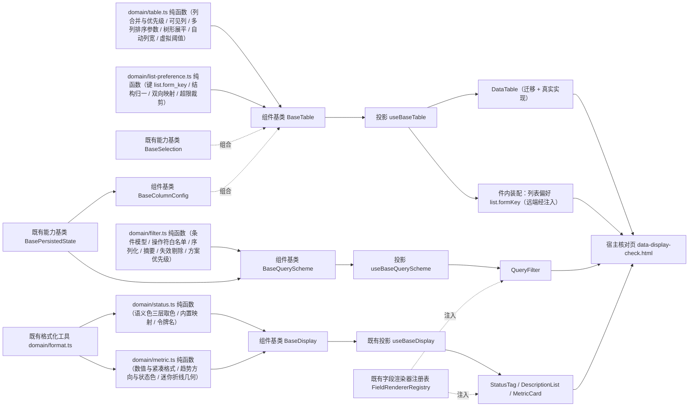

# 01 详细设计 · 数据呈现

> 前端组件库 · 07 展示类 · 05 数据呈现 · 需求 07-5 · 详细设计

[文档首页](../../../../../../文档首页.md) › [07 展示类](../../07_展示类.md) › [05 数据呈现](../07_展示类_05_数据呈现.md) › 详细设计　|　[← 任务](../07_展示类_05_数据呈现.md)

## 1. 设计目标与范围 <a id="goal"></a>

交付[需求 07-5](../../../../需求/07_需求_展示类.md#r07-5) 的四类数据呈现件与两套持久化能力：

- **通用表格**：声明式列配置与渲染优先级、分页与多列排序、多选 / 展开行 / 树形 / 行内编辑、虚拟滚动、列个性化持久化、工具栏与空·加载·错误三态。
- **查询筛选区**：条件模型与按字段类型分发的条件渲染、折叠与窄屏口径、条件摘要、查询方案（应用 / 保存 / 另存为 / 设默认 / 重命名 / 删除 / 恢复默认）与条件持久化、高级查询入口挂载。
- **状态标签与描述列表**：语义色三层取色与兜底、标签五种形态、描述列表响应式列数与跨列、描述项各类型只读回显、长文本折叠、空值占位。
- **指标卡**：数值与单位 / 前缀、环比同比与趋势状态色、口径说明、轻量迷你趋势图、数字滚动、加载 / 空态与跳转。
- **组件基类演练**：扩展既有组件基类 `BaseTable` / `BaseColumnConfig` / `BaseQueryScheme`（均已在《[前端基类清单](../../../../../../前端基类清单.md)》§2.1 登记为「已交付」）承载完整语义，按清单流程回写。
- **对外契约不变**：`07_01` 冻结的件导出名、既有 Props / 事件 / 插槽 / `data-test` 保持形状，本次只**向后兼容新增**可选 Props / 事件 / 插槽（变更走版本升级）；`ui-ep/tests/display-placeholder.spec.ts` 原样通过。

### 1.1 口径与依从 <a id="positioning"></a>

- **架构铁律**：列状态、条件模型、语义色取色、数值与趋势编排均为**横切功能**，一律落为**继承链上的基类**（核心 `capabilities/`）与**领域纯函数**（核心 `domain/`）；具体件只做渲染与交互回传，**不得链外挂接、不得重复实现取色与渲染**。
- **继承链（唯一权威见《前端基类清单》）**：表格件走 `BaseComponent`（组件根）→ `BaseDataState`（数据状态能力基类）→ `BaseTable`（组件基类，经投影 `useBaseTable` 挂链）；查询筛选区走 `BaseComponent` → `BasePersistedState`（偏好持久化能力基类）→ `BaseQueryScheme`（组件基类，经投影 `useBaseQueryScheme` 挂链）；状态标签 / 描述列表 / 指标卡走 `BaseComponent` → `BaseValue`（值能力基类）→ `BaseDisplay`（组件基类，经既有 `useBaseDisplay` 挂链）。
- **依赖登记与组合（非继承）**：`BaseTable` 组合两个能力基类的**可实例化默认实现**——`BaseSelection`（多选权威：行键 / 当前页键 / 跨页全选 / 汇总）与 `BaseColumnConfig`（列状态权威：显隐 / 顺序 / 宽度 / 冻结）；两者仍各在自身继承链上，**不构成多重继承**（体系唯一多重继承项仍为 `BaseError`）。依赖登记表补 `table: ['data-state', 'selection', 'column-config']`。
- **核心框架无关（强制）**：核心包不得依赖 Vue / DOM / UI 库；四个件只消费核心语义与投影。
- **取数与交互分离**：**取数归使用方**（页面经列表取数持列表 / 总数 / 加载 / 错误）；四个件**不自行发请求**。查询方案远端读写、列表偏好远端同步、条件控件与描述项渲染器均以**注入式处理函数 / 注册表**接入；**未注入即占位零请求**（保持 `07_01` 冻结口径）。
- **令牌（强制）**：语义色一律消费 `--bms-color-*`（**沿用现有前缀**，`--color-*` 视为语义别名不落地）；表格斑马纹 / 边框 / 悬停 / 选中与表头底色走新增的 `--bms-table-*` 令牌组；**禁止硬编码色值**。
- **端范围**：**仅 PC**（`frontend/packages/ui-ep`）；移动端本期不落实现，但四套契约套件就位供后续同契约多实现。

## 2. 交付物清单 <a id="deliver"></a>

| # | 交付物 | 落点 |
| --- | --- | --- |
| 1 | 表格领域纯函数与数据模型（新增） | `core/src/domain/table.ts` |
| 2 | 筛选与查询方案领域纯函数（新增） | `core/src/domain/filter.ts` |
| 3 | 状态语义色领域纯函数（新增） | `core/src/domain/status.ts` |
| 4 | 指标与趋势领域纯函数（新增） | `core/src/domain/metric.ts` |
| 5 | 列表偏好领域纯函数（新增） | `core/src/domain/list-preference.ts` |
| 6 | 表格组件基类扩展（`BaseTable`：多列排序 / 分页与密度 / 组合多选与列配置 / 树形 / 展开 / 行内编辑） | `core/src/capabilities/table.ts` |
| 7 | 列配置组件基类扩展（顺序 / 宽度 / 冻结 / 归一 / 恢复默认） | `core/src/capabilities/column-config.ts` |
| 8 | 查询方案组件基类扩展（条件模型 / 三级作用域 / 序列化 / 失效剔除 / 方案 CRUD） | `core/src/capabilities/query-scheme.ts` |
| 9 | 能力依赖登记更新（`table` 依赖补两项） | `core/src/capabilities/manifest.ts` |
| 10 | 核心导出面登记 | `core/src/index.ts` |
| 11 | 契约套件 `describeTableContract`（新增） | `core/testing/table.ts`、`core/testing/index.ts` |
| 12 | 契约套件 `describeQuerySchemeContract`（新增） | `core/testing/query-scheme.ts`、`core/testing/index.ts` |
| 13 | 契约套件 `describeStatusContract`（新增） | `core/testing/status.ts`、`core/testing/index.ts` |
| 14 | 契约套件 `describeMetricContract`（新增） | `core/testing/metric.ts`、`core/testing/index.ts` |
| 15 | 核心用例（五份领域 + 三份基类扩展） | `core/tests/domain-table.spec.ts`、`domain-filter.spec.ts`、`domain-status.spec.ts`、`domain-metric.spec.ts`、`domain-list-preference.spec.ts`、`table.spec.ts`、`column-config.spec.ts`、`query-scheme.spec.ts` |
| 16 | 表格基类投影（新增） | `ui-ep/src/composables/useBaseTable.ts` |
| 17 | 查询方案基类投影（新增） | `ui-ep/src/composables/useBaseQueryScheme.ts` |
| 18 | 通用表格（迁移 + 真实实现） | `ui-ep/src/components/data/DataTable.vue`（旧路径 `components/display/DataTable.vue` 删除） |
| 19 | 查询筛选区（新增） | `ui-ep/src/components/data/QueryFilter.vue` |
| 20 | 状态标签（新增） | `ui-ep/src/components/data/StatusTag.vue` |
| 21 | 描述列表（新增） | `ui-ep/src/components/data/DescriptionList.vue` |
| 22 | 指标卡（新增） | `ui-ep/src/components/data/MetricCard.vue` |
| 23 | 导出面登记（四件迁入 / 新增） | `ui-ep/src/index.ts` |
| 24 | 设计令牌（新增 `--bms-color-info` 与 `--bms-table-*` 组，亮 / 暗两套） | `apps/desktop/src/styles/tokens.scss` |
| 25 | 用例（投影 + 四件 + 持久化 + 虚拟滚动） | `ui-ep/tests/data-table.spec.ts`、`data-query-filter.spec.ts`、`data-status-description.spec.ts`、`data-metric-card.spec.ts` |
| 26 | 宿主核对页（`vite build` 不含） | `apps/desktop/data-display-check.html`、`apps/desktop/src/dev/{dataDisplayCheck.ts,DataDisplayCheck.vue}` |
| 27 | 登记回写（基类清单 / 组件设计 4 节点 / 13 项上游 / 计划与状态） | 见第 6 节 |



```text
ui-ep/src/components/
├── data/                              # 新增专题族（数据呈现；同 chart/ print/ approval/ 先例）
│   ├── DataTable.vue                  # 通用表格（自 components/display/ 迁入 + 真实实现）
│   ├── QueryFilter.vue                # 查询筛选区（新增）
│   ├── StatusTag.vue                  # 状态标签（新增）
│   ├── DescriptionList.vue            # 描述列表（新增）
│   └── MetricCard.vue                 # 指标卡（新增）
└── display/                           # 四件迁出后其余件不动（NoticeList / FilePreview / AuditDiff / QrCode /
                                       # UserAvatar / UserInfo / QuickEntry / WatermarkOverlay / GlobalSearch）
```

## 3. 接口 / 契约与边界 <a id="contract"></a>

### 3.1 核心：`domain/table.ts`（新增纯函数与数据模型） <a id="domain-table"></a>

```ts
/** 列对齐。 */
export type TableColumnAlign = 'left' | 'center' | 'right'
/** 列固定位置。 */
export type TableColumnFixed = 'left' | 'right'
/** 列值格式化口径（复用 `domain/format.ts`）。 */
export type TableColumnFormat = 'number' | 'amount' | 'percent' | 'date' | 'datetime' | 'fileSize' | 'boolean'
/** 表格密度档位（后端 `LIST_DENSITIES` 同源）。 */
export type TableDensity = 'default' | 'small'
/** 列渲染优先级（自上而下命中即用）。 */
export const TABLE_RENDER_PRIORITY: readonly TableRenderKind[]
export type TableRenderKind = 'slot' | 'dict' | 'status' | 'mask' | 'format' | 'raw'
/** 表格列声明（声明式列配置）。 */
export interface TableColumn {
  key: string
  title: string
  width?: number
  minWidth?: number
  align?: TableColumnAlign
  fixed?: TableColumnFixed
  sortable?: boolean
  sortField?: string
  ellipsis?: boolean
  format?: TableColumnFormat
  dictType?: string
  status?: boolean
  mask?: boolean
  visible?: boolean
  editable?: boolean
  localSort?: boolean
}
/** 表单元数据生成的列（明细区列配置 → 表列映射）。 */
export interface TableColumnMeta {
  key: string
  title: string
  width?: number
  fixed?: TableColumnFixed
  visible?: boolean
}
/** 树形展平行。 */
export interface TableTreeRow {
  row: unknown
  key: string
  level: number
  hasChildren: boolean
  expanded: boolean
}
/** 树形选项。 */
export interface TableTreeOptions {
  rowKey: string
  childrenKey: string
  expandedKeys: ReadonlySet<string | number>
}
/** 页长候选 / 默认 / 上限 / 明细区默认。 */
export const PAGE_SIZE_OPTIONS: readonly number[]
export const PAGE_SIZE_DEFAULT = 20
export const PAGE_SIZE_MAX = 200
export const DETAIL_PAGE_SIZE_DEFAULT = 10
/** 多列排序上限。 */
export const MAX_SORT_COLUMNS = 3
/** 虚拟滚动阈值（显式开启时进入虚拟模式的建议行数下限）。 */
export const VIRTUAL_ROW_THRESHOLD = 200
/** 列宽边界与自动列宽采样行数。 */
export const TABLE_MIN_COLUMN_WIDTH = 60
export const TABLE_DEFAULT_COLUMN_WIDTH = 160
export const AUTO_WIDTH_SAMPLE_ROWS = 20

mergeTableColumns(declared: readonly TableColumn[], meta?: readonly TableColumnMeta[]): TableColumn[]
resolveRenderKind(column: TableColumn): TableRenderKind
resolveVisibleColumns(columns: readonly TableColumn[], states?: readonly ColumnState[]): TableColumn[]
resolveColumnStyle(column: TableColumn): { width?: string; minWidth: string }
sortFieldOf(column: TableColumn): string
toggleSort(sorts: readonly SortSpec[], column: TableColumn, additive?: boolean): SortSpec[]
buildSortParams(sorts: readonly SortSpec[]): { order_by?: string; order?: string[] }
parseSortParams(orderBy: string | undefined, order?: readonly string[]): SortSpec[]
sortIndexOf(sorts: readonly SortSpec[], field: string): number
rowKeyOf(row: unknown, rowKey: string): string
flattenTreeRows(rows: readonly unknown[], options: TableTreeOptions): TableTreeRow[]
collectTreeKeys(rows: readonly unknown[], rowKey: string): string[]
resolveDensityToken(density: TableDensity): 'default' | 'compact'
isVirtualEnabled(virtual: boolean, rowCount: number): boolean
measureAutoWidth(title: string, rows: readonly unknown[], key: string): number
clampColumnWidth(width: number): number
```

| 行为 | 口径 |
| --- | --- |
| 列合并 | `mergeTableColumns`：以 `key` 合并声明式与元数据；元数据提供默认（列头 / 宽度 / 固定 / 默认可见），**声明可覆盖**；仅一侧有时取该侧；顺序按声明列顺序（声明缺该列则追加元数据列） |
| 渲染优先级 | `resolveRenderKind`：具名插槽 → 字典翻译 → 状态标签 → 脱敏 → 格式化 → 原值（**空值统一 `—`**）；判定只依赖列声明（`dictType` / `status` / `mask` / `format`），**不触网络** |
| 可见列 | `resolveVisibleColumns`：按偏好状态过滤 `visible` 并按 `order` 排序；状态中不存在的列按声明 `visible`（缺省真）保留在末尾（**防偏好裁剪后列丢失**） |
| 列宽 | `resolveColumnStyle`：显式 `width` 优先（夹取到 `TABLE_MIN_COLUMN_WIDTH` 以上）；否则输出 `minWidth`（标注自适应基准）；宽度夹取统一 `clampColumnWidth` |
| 多列排序 | `toggleSort`：非叠加时单列（升 → 降 → 取消）；叠加时按追加顺序（**≤ `MAX_SORT_COLUMNS`**，超出忽略）；同一字段重复点击切换方向不新增项 |
| 排序参数 | `buildSortParams`：`order_by` 逗号分隔多值 + `order` 方向数组（位置一一对应，缺省 `desc`）；空集合返回空对象（**不传参数**）；`parseSortParams` 为逆向解析（白名单外字段由后端忽略） |
| 树形展平 | `flattenTreeRows`：按 `childrenKey` 递归展平，仅展开节点下沉（**不分页**）；输出带 `level` / `hasChildren` / `expanded`；`collectTreeKeys` 收集全量行键供「展开全部」 |
| 虚拟模式 | `isVirtualEnabled`：`virtual` 为真且行数 ≥ `VIRTUAL_ROW_THRESHOLD`；与树形 / 展开行 / 行内编辑互斥（件层按声明判定并在开发态告警一次） |
| 自动列宽 | `measureAutoWidth`：按列头文案与当前页前 `AUTO_WIDTH_SAMPLE_ROWS` 行内容长度测算（**纯函数、无 DOM 测量**），结果经 `clampColumnWidth` |
| 密度映射 | `resolveDensityToken`：`small` → `compact`（写根元素 `data-density`），`default` → `default`；**不引入第三档** |
| 纯数据 | 不触 DOM、不请求、不依赖渲染框架与第三方库；同输入同输出 |

### 3.2 核心：`domain/filter.ts`（新增纯函数与数据模型） <a id="domain-filter"></a>

```ts
/** 筛选操作符白名单（与后端 `FILTER_OPERATORS` / 数据范围同源，11 种）。 */
export const FILTER_OPERATORS: readonly string[]
/** 操作符中文标签（条件控件下拉）。 */
export const FILTER_OPERATOR_LABELS: Readonly<Record<string, string>>
/** 多值分隔符。 */
export const FILTER_MULTI_SEPARATOR = ','
/** 缺省操作符。 */
export const FILTER_DEFAULT_OPERATOR = 'eq'
/** 条件控件暴露的常用操作符子集。 */
export const FIELD_QUERY_OPERATORS: readonly string[]
/** 关键字字段名（跨字段模糊，命中列由后端定义）。 */
export const KEYWORD_FIELD = 'keyword'
/** 查询方案作用域（三级）与目标。 */
export const QUERY_SCHEME_SCOPES: readonly QuerySchemeScope[]
export type QuerySchemeScope = 'user' | 'tenant' | 'platform'
export const QUERY_SCHEME_TARGETS: readonly QuerySchemeTarget[]
export type QuerySchemeTarget = 'items' | 'business'
export const QUERY_SCHEME_TARGET_BUSINESS: QuerySchemeTarget = 'business'
/** 个人方案数量上限。 */
export const SCHEME_DEFAULT_MAX = 20
/** 折叠阈值与窄屏断点。 */
export const QUERY_COLLAPSE_THRESHOLD = 3
export const QUERY_NARROW_BREAKPOINT = 1024
/** 字段类型（查询区）与控件语义键映射（解析口径同字段渲染器注册表）。 */
export const FILTER_FIELD_TYPES: readonly FilterFieldType[]
export type FilterFieldType = 'text' | 'textarea' | 'select' | 'multi_select' | 'switch' | 'number' | 'datetime' | 'date' | 'dept'
export const FILTER_WIDGET_BY_TYPE: Readonly<Record<FilterFieldType, string>>
/** 单条筛选条件（与后端 `FilterSpec` 同形）。 */
export interface FilterCondition { field: string; operator: string; value: unknown }
/** 查询类字段声明（元数据 / 页面声明）。 */
export interface FilterField {
  key: string
  label: string
  type: FilterFieldType
  operators?: readonly string[]
  options?: readonly { label: string; value: unknown }[]
  defaultValue?: unknown
  span?: number
  placeholder?: string
  query?: boolean
  includeChildren?: boolean
}
/** 查询方案条目（与后端 `QueryScheme` 同源）。 */
export interface QuerySchemeEntry {
  id?: string
  name: string
  scope: QuerySchemeScope
  ownerId?: string
  target: QuerySchemeTarget
  dictType?: string
  fieldKey?: string
  providerKey?: string
  conditions: FilterCondition[]
  params?: Record<string, unknown>
  layout?: Record<string, unknown>
  isDefault?: boolean
  shared?: boolean
  status?: string
}
/** 条件摘要项。 */
export interface ConditionSummary { field: string; label: string; text: string }

normalizeConditions(value: unknown): FilterCondition[]
isConditionActive(condition: FilterCondition): boolean
defaultOperatorOf(type: FilterFieldType): string
fieldOf(fields: readonly FilterField[], key: string): FilterField | undefined
serializeCondition(condition: FilterCondition): Record<string, unknown>
serializeConditions(conditions: readonly FilterCondition[]): Record<string, unknown>
buildQueryParams(conditions: readonly FilterCondition[], keyword?: string): Record<string, unknown>
conditionText(condition: FilterCondition, field: FilterField | undefined): string
summarizeConditions(conditions: readonly FilterCondition[], fields: readonly FilterField[]): ConditionSummary[]
pruneConditions(conditions: readonly FilterCondition[], fields: readonly FilterField[]): { conditions: FilterCondition[]; removed: number }
validateConditionRange(condition: FilterCondition, field: FilterField | undefined): string | undefined
toConditionValue(condition: FilterCondition, next: unknown): FilterCondition
schemePriority(scope: QuerySchemeScope): number
normalizeSchemeEntry(value: unknown): QuerySchemeEntry | undefined
normalizeSchemes(value: unknown): QuerySchemeEntry[]
resolveScheme(schemes: readonly QuerySchemeEntry[], name: string): QuerySchemeEntry | undefined
resolveDefaultScheme(schemes: readonly QuerySchemeEntry[]): QuerySchemeEntry | undefined
hasSchemeName(schemes: readonly QuerySchemeEntry[], name: string): boolean
```

| 行为 | 口径 |
| --- | --- |
| 操作符权威 | **与后端 `FILTER_OPERATORS` 同源同序**（`eq` / `ne` / `in` / `like` / `gt` / `gte` / `lt` / `lte` / `between` / `is_null` / `is_not_null`），前端不另立别名（**`contains` 归 `like`、`not_null` 归 `is_not_null`、无 `not_in`**） |
| 控件子集 | `FIELD_QUERY_OPERATORS`（`eq` / `in` / `like` / `between` / `is_null`）供条件控件下拉；高级操作符由字典高级查询承载（本节点只挂入口） |
| 序列化 | `serializeCondition` 与后端 `FilterSpec.serialize()` 逐分支一致：等值直传；`in` 逗号拼接；`between` → `{field}_start` / `{field}_end`（单边可空）；`is_null` → `{field}_is_null=1`；`is_not_null` → `{field}_is_not_null=1`；布尔 `1` / `0`（未选不传） |
| 空条件 | `isConditionActive` 为假的条件**不参与请求**（不传空串 / `null`）；`buildQueryParams` 合并 `keyword`（空串不传） |
| 条件摘要 | `summarizeConditions`：仅出**已生效**条件，文本为 `文本：关键字` / `区间：a ~ b` / `多值：a、b` / `日期：yyyy-MM-dd ~ yyyy-MM-dd`（复用 `domain/format.ts`）；字典与枚举值由件层翻译后传入（本函数不请求） |
| 失效剔除 | `pruneConditions`：字段不存在 / 非查询类 / 选项值失效（`options` 非空且不含该值）→ 剔除并计数（**连续 ≥ 1 项时件层提示一次**） |
| 区间校验 | `validateConditionRange`：`between` 起 > 止、非数值 → 返回错误文案（内联提示且不提交）；`gt` / `gte` / `lt` / `lte` 单值非数值同理 |
| 方案优先级 | `schemePriority`：`user` = 2 > `tenant` = 1 > `platform` = 0；`resolveDefaultScheme` 取优先级最高且 `isDefault` 的方案 |
| 归一 | `normalizeConditions` / `normalizeSchemes`：非数组 / 脏项剔除；`conditions` 缺省空数组、`target` 缺省 `business`、`scope` 缺省 `user` |
| 纯数据 | 不触 DOM、不请求、不依赖渲染框架与第三方库 |

### 3.3 核心：`domain/status.ts`（新增纯函数与数据模型） <a id="domain-status"></a>

```ts
/** 语义色五档。 */
export const STATUS_SEMANTICS: readonly StatusSemantic[]
export type StatusSemantic = 'success' | 'warning' | 'danger' | 'info' | 'primary'
/** 语义色 → 设计令牌变量名。 */
export const STATUS_SEMANTIC_TOKENS: Readonly<Record<StatusSemantic, string>>
/** 兜底语义色。 */
export const STATUS_FALLBACK_SEMANTIC: StatusSemantic = 'info'
/** 内置语义映射（常量表，小写归一后命中）。 */
export const STATUS_BUILTIN_MAP: Readonly<Record<string, StatusSemantic>>
/** 标签形态。 */
export const STATUS_SHAPES: readonly StatusShape[]
export type StatusShape = 'capsule' | 'dot' | 'bullet' | 'icon' | 'light'
/** 状态圆点直径（组件内置图形尺寸，豁免项）。 */
export const STATUS_BULLET_SIZE = 8
/** 审批 / 流程状态固定色（不因模块改色）。 */
export const STATUS_FIXED_MAP: Readonly<Record<string, StatusSemantic>>

normalizeStatusValue(value: unknown): string
isStatusSemantic(value: unknown): value is StatusSemantic
normalizeStatusColorMap(value: unknown): Record<string, StatusSemantic>
resolveStatusSemantic(input: {
  value?: unknown
  semantic?: unknown
  sourceColor?: unknown
  colorMap?: unknown
}): StatusSemantic
statusTokenOf(semantic: StatusSemantic): string
resolveStatusText(text: unknown, value: unknown): string
describeStatus(value: unknown, map?: unknown): { semantic: StatusSemantic; token: string; text: string; known: boolean }
```

| 行为 | 口径 |
| --- | --- |
| 取色优先级 | `resolveStatusSemantic`：① 显式 `semantic` → ② 数据源自带色 `sourceColor` → ③ 字段级 `colorMap` → ④ 内置 `STATUS_BUILTIN_MAP` → ⑤ 兜底 `info`（**未知值回退原值文本 + info 色**，开发态告警一次） |
| 归一 | `normalizeStatusValue`：去首尾空格 + 转小写；布尔 `true` → `success`、`false` → `info`（与开关只读口径一致） |
| 内置映射 | 覆盖组件设计 §3.4 全集（`enabled` / `normal` / `active` / `approved` / `passed` / `finished` / `启用` / `正常` / `已通过` / `已完成` → `success`；`pending` / `auditing` / `processing` / `partial` / `待审` / `进行中` / `待处理` / `部分完成` → `warning`；`locked` / `rejected` / `failed` / `overdue` / `错误` / `锁定` / `驳回` / `失败` / `已逾期` → `danger`；`disabled` / `inactive` / `draft` / `canceled` / `stopped` / `停用` / `未开始` / `草稿` / `已取消` → `info`） |
| 固定色 | `STATUS_FIXED_MAP`：通过 / 待审 / 驳回 = `success` / `warning` / `danger`，**不因模块改色**；数据源冲突色由件层按令牌语义优先提示 |
| 令牌（强制） | `STATUS_SEMANTIC_TOKENS` 一律映射到 `--bms-color-*`（`primary` / `success` / `warning` / `danger` / `info`）；**不硬编码色值** |
| 纯数据 | 不触 DOM、不请求 |

### 3.4 核心：`domain/metric.ts`（新增纯函数与数据模型） <a id="domain-metric"></a>

```ts
/** 指标数值格式化口径。 */
export const METRIC_FORMATS: readonly MetricFormat[]
export type MetricFormat = 'number' | 'amount' | 'percent' | 'custom'
/** 环比 / 同比。 */
export const METRIC_COMPARE_KINDS: readonly MetricCompareKind[]
export type MetricCompareKind = 'mom' | 'yoy'
export const METRIC_COMPARE_LABELS: Readonly<Record<MetricCompareKind, string>>
/** 趋势方向。 */
export const METRIC_TREND_DIRECTIONS: readonly MetricTrendDirection[]
export type MetricTrendDirection = 'up' | 'down' | 'flat'
/** 空值占位与紧凑缩写阈值。 */
export const METRIC_EMPTY_TEXT = '—'
export const METRIC_PRECISION_MAX = 6
export const METRIC_COMPACT_THRESHOLD = 10_000
export const METRIC_COMPACT_UNITS: readonly { limit: number; suffix: string }[]
/** 迷你趋势图几何参数。 */
export const SPARKLINE_DEFAULT_WIDTH = 120
export const SPARKLINE_DEFAULT_HEIGHT = 32
export const SPARKLINE_PADDING = 2
/** 环比 / 同比输入。 */
export interface MetricCompare { kind: MetricCompareKind; value: number; higherIsBetter?: boolean }
/** 趋势结果。 */
export interface MetricTrend {
  direction: MetricTrendDirection
  semantic: StatusSemantic
  text: string
  token: string
}
/** 迷你折线几何。 */
export interface SparklineGeometry {
  width: number
  height: number
  line: string
  area: string
  points: readonly { x: number; y: number }[]
}
/** 数值格式化选项。 */
export interface MetricFormatOptions {
  format: MetricFormat
  precision?: number
  prefix?: string
  unit?: string
  compact?: boolean
  custom?: (value: number) => string
}

isMetricEmpty(value: unknown): boolean
formatMetricValue(value: unknown, options: MetricFormatOptions): string
compactMetricValue(value: number): string
normalizeTrend(values: unknown): number[]
resolveMetricTrend(compare: MetricCompare | undefined): MetricTrend | undefined
clampMetricRatio(value: number): number
interpolateMetricValue(from: number, to: number, ratio: number): number
buildSparkline(values: readonly number[], options?: { width?: number; height?: number }): SparklineGeometry | undefined
```

| 行为 | 口径 |
| --- | --- |
| 空值 | `isMetricEmpty`：`null` / `undefined` / 空串 / `NaN` → 真；件层渲染 `METRIC_EMPTY_TEXT`（`—`） |
| 格式化 | `formatMetricValue`：`number` 千分位、`amount` 2 位 + 币种前缀、`percent` 百分比、`custom` 交调用方；精度经 `METRIC_PRECISION_MAX` 夹取；**复用 `domain/format.ts` 的格式化器**（同一套时区与小数规则） |
| 紧凑缩写 | `compactMetricValue`：≥ 阈值时按 `METRIC_COMPACT_UNITS`（万 / 亿）缩写并保留一位小数（`1.2万`） |
| 趋势 | `resolveMetricTrend`：`value > 0` → `up`、`< 0` → `down`、`= 0` → `flat`；语义色默认「升 = `success`、降 = `danger`、持平 = `info`」，`higherIsBetter === false` 时**反转**；文案含类型（较上月 / 较去年同期）与符号百分比 |
| 趋势令牌 | `token` 取 `STATUS_SEMANTIC_TOKENS`（**引用语义令牌，不硬编码**） |
| 数字滚动 | `interpolateMetricValue` + `clampMetricRatio`：纯函数提供插值，`requestAnimationFrame` 编排归件层；**尊重系统减弱动效设置**（`prefers-reduced-motion` 时直接到终值） |
| 迷你折线 | `buildSparkline`：把数值序列归一为 `line` / `area` 路径（`SPARKLINE_PADDING` 留边、去轴去图例）；序列长度 < 2 或全等值 → 返回 `undefined`（件层不渲染）；**纯几何计算，不触 DOM 与第三方库** |
| 纯数据 | 同输入同输出 |

### 3.5 核心：`domain/list-preference.ts`（新增纯函数与数据模型） <a id="domain-list-pref"></a>

```ts
/** 列表偏好键前缀（域）。 */
export const LIST_PREF_KEY_PREFIX = 'list'
/** 密度取值（与后端 `LIST_DENSITIES` 同源）。 */
export const LIST_DENSITIES: readonly ListDensity[]
export type ListDensity = 'default' | 'small'
/** 单键体积上限（字节）。 */
export const LIST_PREF_MAX_BYTES = 65_536
/** 列偏好（与后端 `ListColumnPreference` 同形）。 */
export interface ListColumnPreference { prop: string; visible: boolean; order: number; width?: number }
/** 列表偏好（与后端 `ListPreference` 同形）。 */
export interface ListPreference {
  columns: ListColumnPreference[]
  page_size: number
  density: ListDensity
  query: ListQueryPreference
}
/** 条件偏好子键。 */
export interface ListQueryPreference { keyword?: string; conditions: FilterCondition[] }

buildListPrefKey(formKey: string): string
emptyListPreference(): ListPreference
normalizeListPreference(value: unknown): ListPreference
toColumnPreferences(states: readonly ColumnState[]): ListColumnPreference[]
fromColumnPreferences(prefs: readonly ListColumnPreference[], columns: readonly TableColumn[]): ColumnState[]
withQuery(pref: ListPreference, conditions: readonly FilterCondition[], keyword?: string): ListPreference
withoutQuery(pref: ListPreference): ListPreference
pruneListPreference(
  pref: ListPreference,
  fields: readonly FilterField[],
  columns: readonly TableColumn[],
): { preference: ListPreference; removedConditions: number; removedColumns: number }
listPreferenceBytes(pref: ListPreference): number
isListPreferenceOversized(pref: ListPreference): boolean
trimListPreference(pref: ListPreference): ListPreference
```

| 行为 | 口径 |
| --- | --- |
| 键 | `buildListPrefKey('user_form')` = `list.user_form`（与后端 `build_list_pref_key` 一致）；读写经既有偏好持久化能力基类（键即持久化 `stateKey`） |
| 结构 | `{columns:[{prop,visible,order,width}], page_size, density, query}`：字段名**与后端 `ListPreference` 契约一致**（`page_size` 下划线口径；件层 Props 仍用 `pageSize`，映射在件层完成） |
| 条件子键 | `query` = `{keyword?, conditions:[{field,operator,value}]}`——存**条件模型**而非序列化参数，理由：可无损回填、可按 `operator` 定位失效项、与后端 `FilterSpec` 一一对应；序列化在取数时经 `buildQueryParams` 完成（**对组件设计 §6.2 示例形式为有意偏差，见 §8 决策记录 16**） |
| 归一 | `normalizeListPreference`：非对象 / 脏值回落缺省（`page_size` 缺省 `PAGE_SIZE_DEFAULT` 并夹取到 `PAGE_SIZE_MAX`；`density` 非法回落 `default`；列偏好按 `prop` 去重保序） |
| 双向映射 | `toColumnPreferences` / `fromColumnPreferences`：列状态 ↔ 偏好列（`fromColumnPreferences` 对偏好中不存在于声明列的项**剔除**，声明列缺失项**追加默认可见**） |
| 失效剔除 | `pruneListPreference`：条件按 `pruneConditions` 剔除、列按声明列表剔除，返回剔除计数供件层一次性提示 |
| 体积保护 | `listPreferenceBytes` 按 UTF-8 字节估算；超 `LIST_PREF_MAX_BYTES` → `trimListPreference` 依次裁剪（列偏好 → 条件数），并供件层告警 |
| 重置 | `withoutQuery`：清 `query` 子键（「重置」语义）；整份恢复默认经 `emptyListPreference` |
| 纯数据 | 不触 DOM、不请求、不读写存储（读写归件层经偏好持久化能力） |

### 3.6 核心：组件基类扩展（向后兼容） <a id="base"></a>

**`BaseTable`（`capabilities/table.ts`）**

```ts
/** 表格组件基类（抽象）：数据 / 分页 / 多列排序 / 组合多选与列配置 / 树形 / 展开 / 行内编辑。 */
export abstract class BaseTable extends BaseDataState {
  override readonly identifier: string = 'table'
  override readonly depends: readonly string[] = ['data-state', 'selection', 'column-config']
  rows: unknown[]
  total: number
  page: number
  pageSize: number
  sort: SortSpec | undefined
  readonly sorts: SortSpec[]
  density: TableDensity
  readonly selection: BaseSelection
  readonly columnConfig: BaseColumnConfig
  tree: boolean
  childrenKey: string
  readonly expandedKeys: Set<string | number>
  editable: boolean
  readonly selected: Set<string | number>          // 兼容垫片（读 selection）
  get selectedKeys(): Array<string | number>
  setRows(rows: readonly unknown[], total?: number): void
  sortBy(field: string, order: 'asc' | 'desc'): void
  toggleSort(column: TableColumn, additive?: boolean): SortSpec[]
  clearSort(): void
  sortParams(): { order_by?: string; order?: string[] }
  setPage(page: number): void
  setPageSize(size: number): void
  resetToFirstPage(): void
  setDensity(density: TableDensity): void
  toggleSelect(key: string | number): void          // 兼容垫片 → selection
  setRowKeys(keys: readonly string[]): void
  rowKeySet(): string[]
  toggleExpand(key: string | number): void
  expandAll(keys?: readonly string[]): void
  collapseAll(): void
  setEditable(value: boolean): void
}
```

| 项 | 口径 |
| --- | --- |
| 组合（非继承） | `selection` / `columnConfig` 为**组件内组合的状态持有者**（核心内提供可实例化默认实现）；`selection` 为多选**权威**（跨页全选 / 汇总 / 模式），`columnConfig` 为列状态**权威**（显隐 / 顺序 / 宽度 / 冻结） |
| 兼容垫片 | `selected` / `selectedKeys` / `toggleSelect` 保留签名不变，内部读写 `selection`（**标注为兼容垫片，新代码用 `selection`**）；`sort` / `sortBy` 保留为**主排序**，多列排序走 `sorts` / `toggleSort` |
| 分页 | 页长经 `PAGE_SIZE_OPTIONS` / `PAGE_SIZE_MAX` 夹取；`resetToFirstPage` 供「查询 / 重置 / 条件移除」统一调用 |
| 排序参数 | `sortParams` 委托 `buildSortParams`（`order_by` + `order`），与后端排序契约同源，**件层不自行拼串** |
| 树形 | `tree` / `childrenKey` / `expandedKeys` 只承载状态；展平计算委托 `flattenTreeRows`（件层渲染用） |
| 行内编辑 | `editable` 为编辑态开关；**末行自动空行、空行过滤、校验与整体事务归调用方**（件层只按 `editable` 渲染可编辑单元格并上抛变更） |
| 释放 | 基类对象销毁时随 `BaseComponent` 释放；组合对象不额外持有外部资源 |

**`BaseColumnConfig`（`capabilities/column-config.ts`）**

```ts
/** 列种子（声明式列或元数据列的归一形态）。 */
export interface ColumnSeed { key: string; width?: number; visible?: boolean; frozen?: boolean }
export abstract class BaseColumnConfig extends BasePersistedState {
  readonly columns: ColumnState[]
  setColumns(columns: readonly ColumnState[]): void
  toggleVisible(key: string): void
  setVisible(key: string, visible: boolean): void
  setWidth(key: string, width: number): void
  setFrozen(key: string, frozen: boolean): void
  moveColumn(key: string, offset: number): void
  normalizeWith(seeds: readonly ColumnSeed[]): void
  reset(seeds: readonly ColumnSeed[]): void
  get visibleColumns(): ColumnState[]
  get visibleOrder(): string[]
  has(key: string): boolean
}
```

| 项 | 口径 |
| --- | --- |
| 既有行为 | `setColumns` / `toggleVisible` / `visibleColumns` 签名与语义不变（向后兼容） |
| 顺序 | `moveColumn(key, offset)`：在**全量列序列**内按偏移移动并**重排 `order`**（偏移越界夹取）；顺序属偏好内容（可持久化） |
| 宽度 | `setWidth` 经 `clampColumnWidth`（`TABLE_MIN_COLUMN_WIDTH` 起）；「自动列宽」与拖拽结果同入口写回，**用户拖拽过的列不被自动列宽覆盖**（件层记录标记） |
| 归一 | `normalizeWith(seeds)`：保留既有列的 `visible` / `width` / `order`，剔除声明中不存在的列，追加新增列（默认可见、顺序追加）——用于「声明列变化后偏好与列对齐」 |
| 恢复默认 | `reset(seeds)`：按种子全量重建（可见性 / 顺序 / 宽度回声明默认）；冻结不持久化（会话态，随 `normalizeWith` 缺省 `false`） |
| 持久化 | 本地即时快照能力（`setLocal` / `snapshot` / `rollback`）不变；**列表偏好整份写入 `list.{form_key}` 归件层**（经 `toColumnPreferences` 映射），基类不感知键格式 |

**`BaseQueryScheme`（`capabilities/query-scheme.ts`）**

```ts
/** 查询方案（扩展：作用域 / 默认 / 共享）。 */
export interface QueryScheme {
  id?: string
  name: string
  scope: QuerySchemeScope
  conditions: FilterCondition[]
  isDefault?: boolean
  shared?: boolean
  ownerId?: string
}
export abstract class BaseQueryScheme extends BasePersistedState {
  readonly conditions: FilterCondition[]
  keyword: string
  readonly defaults: FilterCondition[]
  readonly schemes: QueryScheme[]
  activeScheme: string | undefined
  get defaultScheme(): QueryScheme | undefined
  setDefaults(conditions: readonly FilterCondition[]): void
  setConditions(conditions: readonly FilterCondition[]): void
  setKeyword(value: string): void
  resetConditions(): void
  activeConditions(): FilterCondition[]
  queryParams(): Record<string, unknown>
  prune(fields: readonly FilterField[]): number
  setSchemes(schemes: readonly QuerySchemeEntry[]): void
  normalizeSchemes(value: unknown): void
  saveScheme(scheme: QueryScheme): void
  applyScheme(name: string): FilterCondition[] | undefined
  removeScheme(name: string): boolean
  renameScheme(oldName: string, newName: string): boolean
  setDefaultScheme(name: string | undefined): void
  schemesByScope(scope: QuerySchemeScope): QueryScheme[]
  resolveDefault(): QueryScheme | undefined
}
```

| 项 | 口径 |
| --- | --- |
| 既有行为 | `schemes` / `activeScheme` / `saveScheme`（同名覆盖）/ `applyScheme` 保留（向后兼容，`QueryScheme` 向后兼容扩展 `scope` 等可选字段，缺省 `scope = 'user'`） |
| 条件模型 | 当前条件 `conditions` + `keyword` 为**取数唯一来源**；`activeConditions` 剔空、`queryParams` 委托 `buildQueryParams`（**件层不自行序列化**） |
| 重置 | `resetConditions` 回 `defaults`（元数据 `defaultValue` 种子 + 无默认则空） |
| 失效剔除 | `prune(fields)` 委托 `pruneConditions`，返回剔除数供件层一次性提示 |
| 方案作用域 | 三级（`user` > `tenant` > `platform`）经 `domain/filter.ts` 的优先级解析；`resolveDefault` 取最高优先级命中项 |
| 远端读写 | 方案列表拉取 / 保存 / 另存为 / 设默认 / 重命名 / 删除由**使用方注入处理函数**（`BaseQueryScheme` 只承载状态与本地语义）；**未注入即仅本地**（不发请求，保持占位口径） |
| 持久化 | `setLocal` 等本地即时能力不变；条件持久化整份写入 `list.{form_key}.query` 归件层 |

- **不新增基类**：本次为既有组件基类的**向后兼容扩展**（新增成员 / 可选字段），不新增能力基类与组件基类；`BaseError` 仍是体系唯一多重继承项。

### 3.7 核心：契约套件（新增 4 套） <a id="testing"></a>

| 套件 | 契约面（结构化接口） | 断言要点 |
| --- | --- | --- |
| `describeTableContract(name, create)` | `rows` / `total` / `page` / `pageSize` / `sorts` / `density` / `tree` / `editable` / `selectedKeys` / `selection` / `columnConfig` + `setRows` / `setPage` / `setPageSize` / `resetToFirstPage` / `toggleSort` / `sortParams` / `setDensity` / `toggleSelect` / `setRowKeys` / `toggleExpand` / `expandAll` / `collapseAll` | 分页夹取（超 `PAGE_SIZE_MAX` 收敛）；多列排序 ≤ 3 且 `order_by` / `order` 位置对应、缺省 `desc`；叠加与非叠加切换；`selection` 与 `selectedKeys` 一致（**兼容垫片与权威同源**）；`columnConfig.normalizeWith` 剔除 / 追加；树形展开键累积与 `collapseAll` 清空；密度映射 `small` → `compact` |
| `describeQuerySchemeContract(name, create)` | `conditions` / `keyword` / `schemes` / `activeScheme` / `defaultScheme` + `setConditions` / `setKeyword` / `resetConditions` / `activeConditions` / `queryParams` / `prune` / `setSchemes` / `saveScheme` / `applyScheme` / `removeScheme` / `renameScheme` / `setDefaultScheme` | 条件序列化逐分支（等值 / `in` 逗号 / `between` `*_start`·`*_end` / `is_null` 标记 / 布尔 1·0）；空条件不传；`prune` 剔除计数；同名覆盖保存；`applyScheme` 返回条件副本（**外部修改不回写**）；三级优先级取默认；重名检测 |
| `describeStatusContract(name, create)` | `describe(value, options)` 面（语义 / 令牌 / 文本 / 已知性） | 三层优先级 + 兜底 `info`；数据源色与字段映射仅接受五档语义值（非法值被忽略回落下一层）；令牌名以 `--bms-` 开头；布尔归一；未知值回退原值文本且 `known === false` |
| `describeMetricContract(name, create)` | `format(value, options)` / `trend(compare)` / `sparkline(values)` | 空值 `—`；三种格式 + `custom`；紧凑缩写；升 / 降 / 持平方向与语义色，`higherIsBetter === false` 反转；令牌名以 `--bms-` 开头；序列 < 2 或全等值 → 无折线 |

- 复用 `describePlaceholderDisplayContract`（`07_01` 冻结）：四件真实实现继续跑同一套件（表格件经件层适配），断言不改动即通过。
- 契约目标约定：表格列 `name` / `amount`，行 2 条；条件 `{field:'status', operator:'eq', value:'enabled'}`；状态值 `enabled`；指标 `value = 1234.5`、`compare = { kind:'mom', value: 12.5 }`、`trend = [1, 3, 2, 5]`。

### 3.8 插件层：投影（新增 2 套） <a id="projection"></a>

```ts
/** `useBaseTable` 选项。 */
export interface UseBaseTableOptions {
  ready?: boolean
  formKey?: string
  rowKey?: string
  pageSize?: number
  density?: TableDensity
  tree?: boolean
  childrenKey?: string
  editable?: boolean
  columns?: TableColumn[]
  columnMeta?: TableColumnMeta[]
  rows?: unknown[]
  total?: number
  remoteSaver?: PersistedRemoteSaver
}
/** `useBaseTable` 返回面。 */
export interface UseBaseTableResult {
  table: BaseTable
  ready: Ref<boolean>
  degraded: Ref<boolean>
  requestCount: Ref<number>
  rows: Ref<unknown[]>
  total: Ref<number>
  page: Ref<number>
  pageSize: Ref<number>
  sorts: Ref<SortSpec[]>
  density: Ref<TableDensity>
  editable: Ref<boolean>
  columns: Ref<TableColumn[]>
  visibleColumns: Ref<TableColumn[]>
  selectedKeys: Ref<string[]>
  summary: Ref<SelectionSummary>
  preference: Ref<ListPreference>
  setReady(value: boolean): void
  markLoaded(): void
  setRows(rows: readonly unknown[], total?: number): void
  setPage(page: number): void
  setPageSize(size: number): void
  resetToFirstPage(): void
  toggleSort(column: TableColumn, additive?: boolean): SortSpec[]
  clearSort(): void
  setDensity(density: TableDensity): void
  setVisible(key: string, visible: boolean): void
  moveColumn(key: string, offset: number): void
  setWidth(key: string, width: number): void
  resetColumns(): void
  toggleSelect(key: string): void
  setRowKeys(keys: readonly string[]): void
  selectAllAcrossPages(): void
  clearSelection(): void
  toggleExpand(key: string): void
  expandAll(): void
  collapseAll(): void
  setEditable(value: boolean): void
  savePreference(patch: Partial<ListPreference>): void
  restorePreference(value: ListPreference): void
}
/** `useBaseQueryScheme` 选项与返回面（同构：scheme / conditions / keyword / schemes / defaultScheme + 方法集）。 */
export interface UseBaseQuerySchemeOptions {
  fields?: FilterField[]
  conditions?: FilterCondition[]
  keyword?: string
  schemes?: QuerySchemeEntry[]
  remoteSaver?: PersistedRemoteSaver
}
export interface UseBaseQuerySchemeResult {
  scheme: BaseQueryScheme
  conditions: Ref<FilterCondition[]>
  keyword: Ref<string>
  schemes: Ref<QueryScheme[]>
  activeScheme: Ref<string | undefined>
  defaultScheme: Ref<QueryScheme | undefined>
  summaries: ComputedRef<ConditionSummary[]>
  queryParams: ComputedRef<Record<string, unknown>>
  setConditions(conditions: readonly FilterCondition[]): void
  setKeyword(value: string): void
  resetConditions(): void
  prune(): number
  saveScheme(name: string, scope?: QuerySchemeScope): void
  applyScheme(name: string): void
  removeScheme(name: string): boolean
  renameScheme(oldName: string, newName: string): boolean
  setDefaultScheme(name: string | undefined): void
}
```

- 薄适配（核心实例 ↔ Vue 响应式），不含判定逻辑；`onLifecycle('update')` → `sync()`；`onScopeDispose` 解除订阅并 `dispose()`（沿用投影骨架）。
- `useBaseTable` 在给定 `formKey` 时内部经 `useBasePersistedState({ stateKey: buildListPrefKey(formKey), remoteSaver })` 读写整份列表偏好，并把列 / 分页 / 密度 / 条件映射进 / 出（`toColumnPreferences` / `fromColumnPreferences` / `withQuery` / `withoutQuery` / `pruneListPreference`）；**未注入 `remoteSaver` 即本地回退**。
- 组合对象（`selection` / `columnConfig`）**不进入响应式**（沿用 `markRaw(toRaw())` 口径），响应式面由投影显式同步。

### 3.9 插件层：`DataTable.vue`（迁移 + 真实实现） <a id="table"></a>

件族迁入专题目录 `ui-ep/src/components/data/`（同 `chart/` / `print/` / `approval/` 先例），**对外导出名、既有 Props / 事件 / 插槽 / `data-test` 不变**，旧路径 `components/display/DataTable.vue` 删除。

| 面 | 内容 |
| --- | --- |
| 数据面（既有，保持） | `ready`（缺省 `false`）/ `columns`（`DataTableColumn[]`）/ `data` / `loading` / `total` / `page` / `pageSize` / `rowKey`（缺省 `id`）/ `selectable` / `degradeText` |
| 数据面（新增，全部可选） | `columnMeta`（元数据列）/ `sorts`（多列排序）/ `density`（`default` / `small`）/ `tree` / `childrenKey`（缺省 `children`）/ `defaultExpandAll` / `expandable` / `editable` / `virtual` / `rowHeight` / `virtualHeight` / `showToolbar` / `showFooter` / `formKey`（列个性化偏好键）/ `error` / `firstLoad` / `searchActive` / `emptyText` |
| 事件（既有，保持） | `update:page` / `update:pageSize` / `sort-change`（**单列主排序**，形状不变）/ `selection-change`（`string[]`）/ `row-click` |
| 事件（新增） | `sorts-change`（`DataTableSort[]` 全量多列）/ `update:density` / `update:expanded` / `expand-change` / `row-dblclick` / `cell-change`（行内编辑 `{ row, column, value }`）/ `column-change`（列偏好变更）/ `retry` / `add-row` / `remove-row` / `move-row`（编辑态行操作，均上抛由调用方执行）/ `selection-summary` |
| 插槽（既有，保持） | `degrade` / `toolbar` / `cell-<columnKey>`（作用域 `{ row, column }`）/ `empty` |
| 插槽（新增） | `error` / `expand`（展开行内容，作用域 `{ row }`）/ `column-settings`（列设置抽屉扩展位）/ `footer-left` |
| `data-test`（既有，保持） | `placeholder` / `toolbar` / `data-table` / `select-all` / `row-<rowId>` / `empty` / `footer` / `total` / `prev` / `page` / `next` |
| `data-test`（新增） | `skeleton` / `overlay` / `error` / `retry` / `refresh` / `density` / `column-settings` / `settings-panel` / `settings-item-<key>` / `settings-move-<key>` / `settings-width-reset` / `settings-reset` / `fullscreen` / `auto-width` / `sort-index-<key>` / `tree-toggle-<rowId>` / `expand-toggle-<rowId>` / `expanded-<rowId>` / `cell-input-<rowId>-<key>` / `virtual-scroll` / `empty-clear` / `selection-summary` |

- **渲染优先级**：具名插槽 `cell-<key>` → 字典翻译（经注入的字典翻译处理函数）→ 状态标签（复用 `StatusTag`）→ 脱敏（经注入的权限判定）→ 格式化（`domain/format.ts`）→ 原值（空值 `—`）；判定走 `domain/table.ts` 的 `resolveRenderKind`。
- **表头**：既有列头渲染保持（`<th>` + `data-sortable` + 点击 `sort-change`）；新增排序优先级序号（`data-test="sort-index-<key>"`）、树形缩进箭头（**落在首列单元格内，不新增 `<th>`**）、展开箭头（**落在首列单元格内**）——**既有 `findAll('th')` 索引不受影响**。
- **虚拟模式**：复用核心 `computeVirtualRange`（`VirtualListContainer` 先例）+ `ElScrollbar`；定高（`rowHeight` 缺省 44），表头固定于滚动区之外；`virtualHeight` 提供视口高度；**与树形 / 展开行 / 行内编辑互斥**（开发态告警一次并忽略 `virtual`）。
- **工具栏**：刷新 / 密度 / 列设置 / 全屏 / 自动列宽（图标 + 悬浮提示；无权限经注入判定不渲染）；**导出件内不实现**——`toolbar` 插槽由使用方注入导出入口（委托 `08_03_03` 打印导出 / `08_05` 导入导出）。
- **状态视图**：首屏（`firstLoad`）骨架屏（与列结构一致的占位行）；后续加载内容区遮罩（`overlay`）；空态（`empty` 插槽 / `emptyText`）；搜索无结果（`searchActive` → 「未找到相关内容」+ 清筛选入口）；失败内联错误 + 重试（`error` + `retry`）。
- **列设置抽屉**：显隐复选、上下移动、列宽重置、恢复默认；变更即写偏好（`column-change` 上抛 + 偏好防抖写入）。
- **行内编辑**：`editable` 为真时按列 `editable` 渲染可编辑单元格（复用字段类件注入；缺省渲染 `input`），变更上抛 `cell-change`；**末行自动空行、空行过滤、校验与整体事务归调用方**。
- **占位语义**：`ready !== true` → 降级、**不发请求**（保持 `07_01` 冻结口径）；`markLoaded` 仅就绪后计数。

### 3.10 插件层：`QueryFilter.vue`（新增） <a id="query-filter"></a>

| 面 | 内容 |
| --- | --- |
| 数据面 | `ready`（缺省 `false`）/ `fields`（`FilterField[]`）/ `conditions`（`v-model:conditions`）/ `keyword`（`v-model:keyword`）/ `collapsed`（受控，缺省按阈值）/ `loading` / `maxPerRow`（缺省 3）/ `collapseThreshold`（缺省 3）/ `showScheme` / `schemes`（`QuerySchemeEntry[]`）/ `activeScheme` / `showAdvanced` / `invalidHint` / `narrowBreakpoint`（缺省 1024）/ `degradeText` |
| 事件 | `update:conditions` / `update:keyword` / `update:collapsed` / `search`（携带 `{ conditions, keyword, params }`）/ `reset` / `scheme-change` / `save-scheme` / `save-as-scheme` / `set-default-scheme` / `rename-scheme` / `delete-scheme` / `advanced` / `invalid`（条件校验失败） |
| 插槽 | `degrade` / `field-<fieldKey>`（自定义条件控件，作用域 `{ field, condition, setValue }`）/ `scheme-panel` / `summary` / `actions` |
| `data-test` | `query-filter` / `placeholder` / `field-<fieldKey>` / `input-<fieldKey>` / `keyword` / `search` / `reset` / `collapse-toggle` / `summary` / `chip-<fieldKey>` / `chip-remove-<fieldKey>` / `clear-all` / `scheme-trigger` / `scheme-panel` / `scheme-item-<name>` / `scheme-save` / `scheme-save-as` / `scheme-default` / `scheme-rename` / `scheme-delete` / `invalid-hint` / `advanced-<fieldKey>` |

- **控件分发**：字段类型 → 控件语义键经 `FILTER_WIDGET_BY_TYPE` 与**既有字段渲染器注册表**（`FieldRendererRegistry.resolveByType`）解析；**未登记类型与需外部数据的类型（字典 / 组织树）回落具名插槽 `field-<key>`**，无插槽则渲染只读占位（**不发请求**）。
- **栅格与折叠**：label 在上方、宽屏一行 `maxPerRow` 项；条件数 ≤ `collapseThreshold` 不折叠，> 阈值默认折叠为一行；折叠只改行数、按钮位置不动；关键字条件恒第一项且不参与折叠；宽度 < `narrowBreakpoint` 时默认折叠并**仅保留关键字 + 查询 / 重置**。
- **查询与重置**：仅「查询」按钮与文本条件回车触发；查询 / 重置 / 条件移除 / 应用方案后**回第 1 页**（`search` 事件携带 `params`，页面据此取数）；重置 = 回字段默认值 + 清 `query` 偏好子键 + 立即重查；区间起 > 止内联提示（`invalid`）且不提交。
- **条件摘要**：查询后渲染 chips（仅已生效条件，`summarizeConditions` 出文案）；单个 chip 移除即回第 1 页重查；右侧「清空全部」等价重置；摘要为空不渲染。
- **高级查询入口**：字典类条件（`select` / `multi_select`）右侧漏斗图标（`advanced-<fieldKey>`），点击上抛 `advanced`（面板归字典字段节点，本节点只挂入口）。
- **查询方案**：条件区右侧方案入口（图标 + 提示）；下拉按作用域分组展示（个人 / 租户 / 平台 + 默认标记）；应用 / 保存 / 另存为 / 设默认 / 重命名 / 删除 / 恢复默认；个人方案免权限码，租户 / 共享方案维护按注入权限判定；方案列表拉取与保存经**使用方注入处理函数**（未注入即仅本地）。

### 3.11 插件层：`StatusTag.vue` / `DescriptionList.vue`（新增） <a id="status-desc"></a>

**`StatusTag.vue`**（经 `useBaseDisplay` 挂 `BaseDisplay`）

| 面 | 内容 |
| --- | --- |
| 数据面 | `value` / `text` / `semantic`（显式指定，最高优先级）/ `sourceColor`（数据源自带色）/ `colorMap`（字段级 `value → 语义色`）/ `shape`（`capsule` 缺省 / `dot` / `bullet` / `icon` / `light`）/ `size`（`default` / `small`）/ `icon` / `clickable` / `title`（无文案形态的悬浮提示） |
| 事件 | `click` |
| 插槽 | `default`（文案）/ `icon` |
| `data-test` | `status-tag` / `status-dot` / `status-bullet` / `status-icon` |

- 取色一律 `resolveStatusSemantic`（三层 + 兜底）；颜色只经 `statusTokenOf` 输出 `--bms-color-*`；审批 / 流程状态色固定（`STATUS_FIXED_MAP`）；未知值回退原值文本 + `info` 色。

**`DescriptionList.vue`**（经 `useBaseDisplay` 挂 `BaseDisplay`）

| 面 | 内容 |
| --- | --- |
| 数据面 | `items`（`DescItem[]`）/ `data`（单条记录）/ `columns`（`1` / `2` / `3` / `'auto'`，自动按断点 1536 / 1024）/ `border` / `density`（`default` / `small`）/ `labelPlacement`（`left` / `top`）/ `title` / `groups` / `plainText`（全部纯文本）/ `emptyText`（缺省 `—`）/ `masked`（脱敏字段集）/ `plainEnabled`（明文权限，注入判定） |
| 事件 | `plain-toggle` / `item-click` / `collapse-toggle` |
| 插槽 | `item-<key>` / `label-<key>` / `title` / `empty` |
| `data-test` | `description-list` / `desc-item-<key>` / `desc-label-<key>` / `desc-value-<key>` / `desc-empty-<key>` / `desc-collapse-<key>` / `desc-plain-<key>` / `desc-group-<index>` |

- `DescItem`：`{ key, label, type?, dictType?, options?, statusMap?, format?, mask?, span?, crossColumn?, collapse?, emptyText? }`。
- **值渲染分发**：字段类型经 `FILTER_WIDGET_BY_TYPE` 同源的语义键与**既有字段渲染器注册表**解析；**未登记类型回落内置轻量只读渲染**（文本 / 长文本 2 行折叠 + 悬浮全文 / 数字金额 / 日期时间 / 枚举开关 / 状态标签 / 组织路径 / 文件「数量 + 首个文件名」/ 富文本纯文本摘要 / 脱敏掩码 / 空值占位）与具名插槽 `item-<key>`；**字典 label 翻译经注入处理函数**（未注入即显示原值，不请求）。
- 跨列：`crossColumn` 或长文本默认跨整行；`plainText` 为真时全部走纯文本（不使用状态标签）；脱敏字段默认掩码，`plainEnabled` 为真时提供「查看明文」切换。

### 3.12 插件层：`MetricCard.vue`（新增） <a id="metric-card"></a>

| 面 | 内容 |
| --- | --- |
| 数据面 | `ready`（缺省 `false`）/ `title` / `value` / `unit` / `prefix` / `format`（`number` / `amount` / `percent` / `custom`）/ `precision` / `compare`（`{ kind, value, higherIsBetter? }`）/ `trend`（数值序列）/ `statusColor`（缺省 `true`）/ `caption`（口径说明）/ `linkTo` / `loading` / `size`（`small` / `default`）/ `animate`（缺省 `true`）/ `compact` / `degradeText` |
| 事件 | `click` / `refresh` / `nav`（`linkTo` 存在且点击时上抛，跳转归使用方） |
| 插槽 | `degrade` / `default`（数值区替换）/ `unit` / `compare` / `trend`（注入 `ChartRenderer` 等重图表）/ `caption` |
| `data-test` | `metric-card` / `placeholder` / `metric-title` / `metric-value` / `metric-prefix` / `metric-unit` / `metric-compare` / `metric-trend` / `metric-sparkline` / `metric-caption` / `metric-loading` / `metric-empty` / `metric-refresh` |

- 数值与趋势编排全走 `domain/metric.ts`（格式化 / 紧凑缩写 / 趋势方向与语义色 / 空值）；**迷你趋势图为件内自绘 SVG 折线**（`buildSparkline` 出几何 + `--bms-color-primary` 描边与淡色面积；去轴去图例），`trend` 插槽可替换为 `ChartRenderer` 等重图表（**不默认加载 ECharts**）。
- 数字滚动：`animate` 且非 `prefers-reduced-motion` 时首次加载从 0 滚动到目标（`interpolateMetricValue` + `requestAnimationFrame`，短时长）；刷新不重复动画。
- 占位：`ready !== true` → 降级提示、**不发请求**；`loading` 渲染骨架；空值渲染 `—`；`caption` 为标准配置项（数据卡片必填由使用方保证）。

### 3.13 导出面与件族目录 <a id="exports"></a>

- `ui-ep/src/index.ts`：四件导出路径由 `./components/display/DataTable.vue` 改为 `./components/data/DataTable.vue`，新增 `QueryFilter` / `StatusTag` / `DescriptionList` / `MetricCard` 与各自类型（`DataTableColumn` / `DataTableSort` 名字与形状保持），新增 `useBaseTable` / `useBaseQueryScheme` 导出。
- `core/src/index.ts`：新增五份领域模块导出（`domain/table` / `filter` / `status` / `metric` / `list-preference`）与基类扩展相关类型（`TableColumn` / `TableColumnMeta` / `TableDensity` / `ColumnSeed` / `FilterCondition` / `FilterField` / `QuerySchemeEntry`）。
- 机器护栏：`ui-ep/tests/guard-component-inheritance.spec.ts`（四件均实质挂链）、`core/tests/guard-manifest.spec.ts`（`table` 依赖变更对账）、`guard-jsdoc.spec.ts`（新增导出与类成员 JSDoc 齐备）、`guard-core-framework-agnostic.spec.ts`（核心零框架依赖）。

### 3.14 设计令牌（新增） <a id="tokens"></a>

`apps/desktop/src/styles/tokens.scss` 新增（亮色 `:root` 与暗色 `[data-theme='dark']` 两套）：

```scss
::root {
  --bms-color-info: #909399; // 语义色第五档（info 兜底 / 持平趋势），对齐 Element Plus info
  --bms-table-border: var(--bms-color-border);
  --bms-table-header-bg: #f5f7fa;
  --bms-table-row-hover-bg: #f5f7fa;
  --bms-table-zebra-bg: #fafafa;
  --bms-table-selected-bg: #ecf5ff;
}
```

- 暗色仅覆盖对比度相关项（表头 / 悬停 / 斑马纹 / 选中底），语义序列色保持语义一致；**令牌只增不改**，既有令牌不变；`[data-density='loose']` 保留备用（本次不使用）。

### 3.15 宿主核对页 <a id="check"></a>

`apps/desktop/data-display-check.html` + `src/dev/{dataDisplayCheck.ts,DataDisplayCheck.vue}`（`vite build` 只构建 `index.html`，核对页不进产物）。自检项 14 项：

1. 数据呈现件占位降级与就绪切换（四件 `ready` 驱动、占位零请求）；
2. **列表页组装**：查询筛选区 + 通用表格联动（查询 / 重置回第 1 页、排序保留筛选）；
3. 列配置与列设置抽屉（显隐 / 上下移动 / 列宽重置 / 恢复默认）与偏好写入；
4. 多列排序（点击切换 + Shift 叠加 ≤ 3、优先级序号、`order_by` / `order` 参数）；
5. 多选与批量（`BaseSelection` 当前页 / 跨页全选 / 汇总）；
6. 树形表格（缩进箭头、默认展开、不分页、与虚拟模式互斥提示）；
7. 行内编辑（编辑态开关、末行自动空行、单元格变更上抛）；
8. 展开行（插槽内容）；
9. **虚拟滚动**（阈值 200 行显式开启、固定表头、滚动区间渲染）；
10. 空 / 加载 / 错误三态（骨架屏、遮罩、错误 + 重试、搜索无结果文案）；
11. 查询筛选区折叠与窄屏（< 1024px 仅关键字）；
12. 条件摘要 chips（单个移除即重查、清空全部）与查询方案（应用 / 另存为 / 设默认）；
13. 状态标签取色三层 + 形态五档；描述列表响应式列数（3/2/1）与跨列、长文本折叠、脱敏切换；
14. 指标卡数值与单位、环比同比趋势色（含 `higherIsBetter` 反转）、迷你趋势折线、数字滚动、空态与跳转。

以 chromium headless `--dump-dom` 核验全部自检项；异步与滚动相关项以 `waitFor` 轮询等待到位后再断言。

## 4. 失败分支与边界 <a id="edge"></a>

| 边界 / 失败场景 | 处置 |
| --- | --- |
| 数据通路未就绪（`ready` 为假） | 占位：降级 + 不发请求（保持 `07_01` 冻结口径） |
| 列表取数处理函数未注入 | 占位：不请求；件层仅渲染传入数据（空则空态） |
| 偏好在列声明变更后含已删列 | `normalizeWith` / `fromColumnPreferences` 剔除；新增列默认可见追加 |
| 偏好条件字段已停用 / 不可见 / 选项失效 | `prune` 剔除该条件，连续 ≥ 1 项时提示一次「部分筛选条件已失效，已忽略」 |
| 偏好超 64KB | `trimListPreference` 依次裁剪（列偏好 → 条件数）并告警（不阻塞交互） |
| 区间起 > 止 / 非数值 | 内联提示（`invalid`）且不提交；条件摘要不渲染该条件 |
| 多列排序超 3 列 | 超出项忽略（保留前 3 项），表头序号只显示前三 |
| 排序字段非白名单 | 前端只在可排序列开启入口；后端忽略该项（双层防注入，前端不校验白名单） |
| 最后一页被删空 | 由使用方回退上一页（件层 `resetToFirstPage` 只处理查询 / 重置路径） |
| 树形层级过深 / 子节点多 | 缩进递归渲染 + 横向滚动；深度与子节点数由业务侧约束（前端只展示不校验） |
| 虚拟模式与树形 / 展开 / 行内编辑叠加 | 开发态告警一次并忽略虚拟模式（按普通模式渲染） |
| 虚拟模式未提供行高 / 视口高度 | 回落 `rowHeight = 44`、`virtualHeight` 缺省取容器高度；尺寸为 0 不渲染行 |
| 自动列宽遇用户拖拽过的列 | 不覆盖（件层记录拖拽标记）；拖拽到极限经 `clampColumnWidth` 夹取 |
| 编辑态末行未录入 | 空行过滤与整体事务归调用方（件层不拦截保存） |
| 列设置把列全部隐藏 | 至少保留一列（末列不允许取消勾选） |
| 条件控件类型未登记且无插槽 | 渲染只读占位（降级提示），**不发请求** |
| 字典 / 组织等外部数据未注入 | 显示原值 / 占位，**不发请求**（通路注入式） |
| 描述项值为空数组 / 空串 / `null` | 统一渲染 `emptyText`（缺省 `—`） |
| 描述项长文本 | > 120 字符折叠 2 行 + 「展开 / 收起」（折叠态带全文悬浮提示） |
| 脱敏字段无明文权限 | 保持掩码；有权限才渲染「查看明文」入口 |
| 状态值未知 | 回退原值文本 + `info` 色（开发态告警一次） |
| 数据源状态色与令牌语义冲突 | 以令牌语义优先（审批 / 流程状态色固定），评审纠正配置 |
| 指标值为空 / 非数值 | 渲染 `—`（不参与趋势与折线） |
| 环比无基期 / 趋势数据缺失 | 不渲染环比区 / 不渲染折线（不报错） |
| 指标超大数值 | 紧凑缩写（万 / 亿）保留一位小数 |
| 系统减弱动效 | 数字滚动直接到终值 |
| 导出 | 件内不实现，`toolbar` 插槽由使用方接（委托 `08_03_03` / `08_05`） |
| 只读 / 权限 | 列可见性与行内可编辑经注入判定；无权限按钮不渲染 |

## 5. 测试设计与验收映射 <a id="test"></a>

| 验收点（需求 07-5 / 任务 07_05） | 用例 |
| --- | --- |
| 列合并与渲染优先级、可见列计算、列宽夹取与自动列宽 | `core/tests/domain-table.spec.ts` |
| 多列排序叠加与上限、`order_by` / `order` 构参与逆向解析、树形展平与全量键、虚拟阈值与互斥、密度映射 | 同上 |
| 条件模型归一、操作符白名单与常用子集、序列化逐分支、空条件不传、条件摘要、失效剔除、区间校验 | `core/tests/domain-filter.spec.ts` |
| 语义色三层优先级与兜底、布尔归一、内置映射全集、固定色、令牌名前缀 | `core/tests/domain-status.spec.ts` |
| 数值格式化与紧凑缩写、空值、趋势方向与反转、令牌、插值与夹取、迷你折线几何与退化 | `core/tests/domain-metric.spec.ts` |
| 列表偏好键、结构归一、列偏好双向映射、条件子键读写与重置、失效剔除计数、体积保护与裁剪 | `core/tests/domain-list-preference.spec.ts` |
| 表格基类扩展（分页夹取 / 多列排序 / 组合多选与列配置 / 树形 / 编辑态）+ 契约套件 | `core/tests/table.spec.ts` + `describeTableContract` |
| 列配置基类扩展（顺序 / 宽度 / 归一 / 恢复默认） | `core/tests/column-config.spec.ts` |
| 查询方案基类扩展（条件模型 / 序列化 / 失效剔除 / 方案 CRUD / 三级优先级）+ 契约套件 | `core/tests/query-scheme.spec.ts` + `describeQuerySchemeContract` |
| 状态语义色与指标契约套件（同契约多实现） | `describeStatusContract` / `describeMetricContract`（核心 + `ui-ep` 适配） |
| 投影薄适配（响应式面与同步、偏好读写、销毁） | `ui-ep/tests/data-table.spec.ts` |
| 通用表格真实实现：占位降级、就绪渲染、列设置、多列排序、多选、树形、行内编辑、展开行、虚拟滚动、三态 | 同上（保留 `display-placeholder.spec.ts` 不改动原样通过） |
| 查询筛选区：折叠与阈值、查询 / 重置回第 1 页、条件摘要增删、方案应用 / 另存 / 设默认、失效提示、区间校验 | `ui-ep/tests/data-query-filter.spec.ts` |
| 状态标签取色三层与形态、描述列表响应式列数 / 跨列 / 长文本折叠 / 各类型只读回显 / 空值 / 脱敏切换 | `ui-ep/tests/data-status-description.spec.ts` |
| 指标卡：格式化与空值、趋势方向与反转、迷你折线、数字滚动、占位降级、跳转与刷新 | `ui-ep/tests/data-metric-card.spec.ts` |
| 能力登记对账（`table` 依赖变更 ↔ manifest ↔ 基类清单） | `core/tests/guard-manifest.spec.ts` |
| 注释齐备与核心框架无关护栏 | `core/tests/guard-jsdoc.spec.ts`、`guard-core-framework-agnostic.spec.ts` |
| 组件继承链护栏（四件均实质挂链） | `ui-ep/tests/guard-component-inheritance.spec.ts` |
| 开发态核对页 14 项自检 | chromium headless `--dump-dom` |
| `vue-tsc`、ESLint、Vitest 全通过 | 根 `pnpm run check` + 宿主 `vue-tsc -b` / `lint` / `test:cov` / `build` / `budget` |
| 文档链接与基座校验 | `check-links.py`、`check-base.py`、`check-status.py --stage 04_前端组件库` |

- 既有 `ui-ep/tests/display-placeholder.spec.ts`（`07_01` 冻结契约）**不得改动**，须原样通过（`DataTable` 占位降级、就绪渲染、`sort-change` 单列形状、`row-click`、分页事件与空态断言保持）。
- Kiwi 用例 1 条（一任务一条，编号于测试步登记后回填；分类「平台骨架」、优先级 P2、状态 `CONFIRMED`、标签「自动化」）。

## 6. 登记落点 <a id="register"></a>

| 内容 | 落点 |
| --- | --- |
| 组件基类扩展（`BaseTable` / `BaseColumnConfig` / `BaseQueryScheme`，职责与依赖变化） | 《[前端基类清单](../../../../../../前端基类清单.md)》§2.1 全量登记表对应三行职责更新 + §2 继承链总览补组合说明 + §5.3 组件基类表 + `capabilities/manifest.ts`（`table` 依赖补 `selection` / `column-config`） |
| 领域纯函数五份（`domain/table.ts` / `filter.ts` / `status.ts` / `metric.ts` / `list-preference.ts`） | 同上 §9「核心」（`domain/` 领域纯函数） |
| 契约套件四套 | 同上 §9（`core/testing/`） |
| 性能与包体：虚拟滚动复用核心虚拟区间能力、趋势图不引重图表 | 同上 §9「PC 插件」（`utils/` 清单不变；`ElScrollbar` 复用既有） |
| 投影 `useBaseTable` / `useBaseQueryScheme`、件族 `components/data/`（四件） | 同上 §9「PC 插件」（组件目录与 `composables/` 清单） |
| 设计令牌（`--bms-color-info` + `--bms-table-*` 组） | 《[布局设计 · 设计令牌](../../../../../../设计/布局设计/02_布局设计_设计令牌.html)》「颜色令牌」节（登记项②）；`apps/desktop/src/styles/tokens.scss` |
| **上游登记回写（13 项，一并）** | ① 多列排序参数专条 → [《架构设计 · 接口与集成](../../../../../../设计/架构设计/09_架构设计_接口与集成.md)》「接口规范」节 + [《API接口规范](../../../../../../规范/API接口规范.md)》「参数与分页」节；② 列表偏好结构 → [《概要设计 · 用户喜好](../../../../../../设计/概要设计/04_概要设计_用户喜好.md)」；③ 明细区列配置生成表列 → [《概要设计 · 表单定制](../../../../../../设计/概要设计/36_概要设计_表单定制.md)」；④ 导出参数含排序 → [《概要设计 · 导入导出](../../../../../../设计/概要设计/19_概要设计_导入导出.md)」；⑤ 泛化查询方案表 → [《概要设计 · 字典管理](../../../../../../设计/概要设计/09_概要设计_字典管理.md)」；⑥ 新增方案权限码 → [《架构设计 · 权限计算引擎](../../../../../../设计/架构设计/15_架构设计_子系统_权限计算引擎.md)」+ [《英文简称规范](../../../../../../规范/英文简称规范.md)」；⑦ 查询类字段判定与下发 → 概要设计 36 +《API接口规范》；⑧ 条件持久化结构 → 概要设计 04；⑨ 字典条目颜色 → 概要设计 09；⑩ 令牌状态语义色映射 → 布局设计 02；⑪ 字段属性状态色映射与只读形态 → 概要设计 36；⑫ 统计卡指标结构与趋势 → [《概要设计 · 首页工作台](../../../../../../设计/概要设计/35_概要设计_首页工作台.md)」+ [《架构设计 · 首页工作台](../../../../../../设计/架构设计/29_架构设计_子系统_首页工作台.md)」；⑬ 卡片规格与数值标注 + 趋势色可达性 → [《布局设计 · 首页工作台](../../../../../../设计/布局设计/13_布局设计_首页工作台.html)」+ 布局设计 02 |
| **组件设计口径回写（4 节点 4 处）** | ① 《组件设计 · 查询筛选区》§3 操作符白名单改为「**以后端筛选契约为权威（11 种）**」；② 《组件设计 · 状态标签与描述列表》§3.3 令牌写法 `--color-*` → `--bms-color-*`；③ 《组件设计 · 通用表格》§9 密度措辞「宽松 / 紧凑」→ **档位取值 `default` / `small`**；④ 《组件设计 · 查询筛选区》§6.2 条件持久化结构改为**条件模型**（`{keyword, conditions}`） |
| 任务 / 父任务 / 域任务 / 计划与状态 | [任务](../07_展示类_05_数据呈现.md)、[父任务](../../07_展示类.md)、[计划](../../../../计划/01_计划_前端组件库.md)（`07_05` 由 `搁置（阶段八后 ~ 十五）` 改「阶段四窗口内推进（前端先行、通路注入式）」并入 §2；§1 域 07 与工时台账同步；甘特移除已完成节点） |
| 需求文档 | 不承载进度（状态只在任务与计划两处一致）；遗留归口写在实施 / 测试记录与计划 |

## 7. 边界与开放项 <a id="open"></a>

- **不在本期**：真实列表接口联调（分页 / 排序 / 筛选参数已按后端契约冻结，取数与提交由使用方经注入处理函数驱动，真实联调归口阶段八后 ~ 十五窗口）；列表偏好与查询方案的真实落库 / 跨端同步（归口通用能力阶段）；租户 / 共享方案的 `query:scheme` 权限码校验（归口 RBAC 阶段）；字典条件候选与 label 翻译（归口字典取数 / 字典字段件）；高级查询面板本体（归口字典字段节点，本节点只挂入口）；描述项富文本正文渲染（归口富文本字段件）；导出实现（归口 `08_03_03` / `08_05`）；工作台页面集成与卡片编辑（归口首页工作台任务）；移动端实现（不落实现，契约套件就位）。
- **协同契约**：分页 `page` / `size`（默认 20、上限 200）、排序 `order_by`（逗号分隔）+ `order`（方向数组）、筛选序列化（等值直传 / 多值逗号 / 区间 `*_start`·`*_end` / 布尔 `1`·`0`）与后端已交付契约一致；列表偏好键 `list.{form_key}`、结构 `{columns, page_size, density, query}` 与后端 `ListPreference` 一致；查询方案三级作用域与后端 `BaseQuerySchemeStore` 一致。
- **与 `07_01` 协同**：件名与对外契约由 `07_01` 冻结，本次只向后兼容新增；`describePlaceholderDisplayContract` 由真实实现继续复用。
- **与 `08_03_03` 协同**（列表导出）：列表选中集合复用 `BaseSelection` 与 `BaseBulkAction`（本次把 `BaseTable` 的多选权威统一到 `BaseSelection`，为本协同提供前置）；导出参数与列表筛选 / 排序一致（含多列排序），导出列顺序遵循导出模板而非页面列偏好。
- **与 `07_06` 协同**：指标卡迷你趋势图默认轻量 SVG，`trend` 插槽可注入 `ChartRenderer`；`ChartCard` 的数据表视图待本任务交付后由 `DataTable` 自然升级（`07_06` 遗留项之一闭环）。
- **新增能力扩展位**：新增列渲染类型 = 字段渲染器注册表登记一条 + `resolveRenderKind` 分支，不改表格容器；新增条件控件类型 = 注册表登记一条或具名插槽，不改条件区容器；新增方案作用域 = `QUERY_SCHEME_SCOPES` + `schemePriority` 一条。
- **Kiwi 用例编号**：本任务平台登记后回填代码 `// kiwi_id: <编号>` 与实施 / 测试记录。
- **工时**：名义 30h；因新增五份领域纯函数、三个组件基类扩展、四套契约套件、两套投影、四件组件（一迁三新）、宿主核对页与列表页组装，实际上浮在实施记录登记。

## 8. 决策记录 <a id="decision"></a>

| # | 决策项 | 结论 |
| --- | --- | --- |
| 1 | 实施窗口 | 现在推进（真实实现 + 通路注入式取数；真实列表接口联调归后续窗口）；计划 `07_05` 窗口口径同步校正 |
| 2 | 件族落点 | 新建专题族 `ui-ep/src/components/data/`，`DataTable` 迁入并删除旧路径，三新件同族 |
| 3 | 值 / 控件分发 | 复用核心既有字段渲染器注册表；未登记类型回落件内内置轻量渲染 + 具名插槽 |
| 4 | 表格多选 | `BaseTable` 组合 `BaseSelection` 为多选权威；`selected` / `toggleSelect` 保留为兼容垫片 |
| 5 | 专题族目录名 | `components/data/` |
| 6 | 核心层改造范围 | 基类扩展 + 五份领域纯函数 + 四套契约套件（全量体系化） |
| 7 | 迷你趋势图 | 轻量内联 SVG 折线 + `trend` 具名插槽（不默认加载 ECharts） |
| 8 | 表格能力范围 | 全落**含虚拟滚动**（定高窗口化、阈值 200 行显式开启、列宽必填、与树形 / 展开 / 行内编辑互斥） |
| 9 | 操作符口径 | 以后端 `FILTER_OPERATORS`（11 种）为权威；组件设计《查询筛选区》§3 表述回写 |
| 10 | 持久化落点 | 新增 `domain/list-preference.ts` + 件层 `useBasePersistedState`（`stateKey = list.{formKey}`，`remoteSaver` 宿主注入） |
| 11 | 表格渲染基座 | 原生自研 `<table>` + 虚拟模式复用 `computeVirtualRange` + `ElScrollbar`；列宽拖拽 / 固定列 / 树形缩进 / 行内编辑自研 |
| 12 | 上游回写 | 13 项一并随本任务回写（只增不改） |
| 13 | 语义色令牌 | 沿用 `--bms-color-*`；组件设计 §3.3 的 `--color-*` 回写为 `--bms-` 口径 |
| 14 | 密度档位 | 以后端 `LIST_DENSITIES`（`default` / `small`）为持久化取值，件内映射 `data-density`（`small` → `compact`） |
| 15 | 宿主核对页 | 新增 `data-display-check.html` + `src/dev/dataDisplayCheck.*`（14 项自检，不进 `vite build`） |
| 16 | 列表偏好结构字段名 | **推导结论**：持久化 JSON 字段名与后端 `ListPreference` 一致（`page_size` 下划线；件层 Props 仍用 `pageSize`）——依据决策 9 与 10 的「接口字段以后端已交付契约为准」口径；概要设计 04 结构与组件设计 §6.2 一并回写 |
| 17 | 条件持久化子键形态 | **推导结论（偏差）**：`query` 存**条件模型**（`{keyword, conditions:[{field,operator,value}]}`）而非序列化参数——可无损回填、可按 `operator` 定位失效项、与后端 `FilterSpec` 一一对应；序列化在取数时进行（**对组件设计 §6.2 示例形式为有意偏差，已登记回写**） |
| 18 | `BaseTable` 组合形态 | 组合而非继承（体系唯一多重继承项仍为 `BaseError`）；依赖登记 `table: ['data-state', 'selection', 'column-config']` |
| 19 | 工具栏导出 | 件内不实现，事件上抛 + `toolbar` 插槽由使用方注入（委托 `08_03_03` / `08_05`） |
| 20 | 本次范围 | 仅 `07_05`；`07_04` / `07_07` / 域 06 余项随后单独详细设计与提交 |

## 9. 参考文档 <a id="ref"></a>

- [需求 07-5](../../../../需求/07_需求_展示类.md#r07-5)、[任务 07_05](../07_展示类_05_数据呈现.md)、[父任务](../../07_展示类.md)
- 《组件设计》[01 通用表格](../../../../../../设计/组件设计/07_展示类/01_组件设计_通用表格/01_组件设计_通用表格.md)、[02 查询筛选区](../../../../../../设计/组件设计/07_展示类/02_组件设计_查询筛选区/02_组件设计_查询筛选区.md)、[03 状态标签与描述列表](../../../../../../设计/组件设计/07_展示类/03_组件设计_状态标签与描述列表/03_组件设计_状态标签与描述列表.md)、[10 指标卡](../../../../../../设计/组件设计/07_展示类/10_组件设计_指标卡/10_组件设计_指标卡.md)（均含可交互原型，原型即验收基准）
- 《架构设计》[前端组件体系](../../../../../../设计/架构设计/05_架构设计_前端组件体系.md)（八类组件与边界 / 取数与缓存协作）、[前端架构](../../../../../../设计/架构设计/08_架构设计_前端架构.md)（性能 / 分包）、[接口与集成](../../../../../../设计/架构设计/09_架构设计_接口与集成.md)（公共约定）、[数据架构](../../../../../../设计/架构设计/07_架构设计_数据架构.md)（租户库表）
- 《概要设计》[用户喜好](../../../../../../设计/概要设计/04_概要设计_用户喜好.md)、[字典管理](../../../../../../设计/概要设计/09_概要设计_字典管理.md)、[导入导出](../../../../../../设计/概要设计/19_概要设计_导入导出.md)、[首页工作台](../../../../../../设计/概要设计/35_概要设计_首页工作台.md)、[表单定制](../../../../../../设计/概要设计/36_概要设计_表单定制.md)
- 《布局设计》[列表页](../../../../../../设计/布局设计/07_布局设计_列表页.html)、[表格明细](../../../../../../设计/布局设计/09_布局设计_表格明细.html)、[响应式适配](../../../../../../设计/布局设计/11_布局设计_响应式适配.html)、[异常与空状态](../../../../../../设计/布局设计/12_布局设计_异常与空状态.html)、[设计令牌](../../../../../../设计/布局设计/02_布局设计_设计令牌.html)、[首页工作台](../../../../../../设计/布局设计/13_布局设计_首页工作台.html)
- [《API接口规范](../../../../../../规范/API接口规范.md)》「参数与分页」节、[《前端开发规范](../../../../../../规范/前端开发规范.md)》、《[命名规范](../../../../../../规范/命名规范.md)》、《[文档生成规范](../../../../../../规范/文档生成规范.md)》
- [《前端基类清单](../../../../../../前端基类清单.md)》（组件基类 §5.3 / 目录与依赖 §9 / 扩展规则 §11.2）
- [07_01 占位版交付](../../07_展示类_01_占位版交付/07_展示类_01_占位版交付.md)（冻结对外契约与占位语义）、[07_06 图表卡](../../07_展示类_06_图表卡/07_展示类_06_图表卡.md)（组件基类 + 领域 + 契约套件 + 投影 + 核对页做法）、[02-4-20 列表查询与偏好契约基座](../../../../../01_项目骨架/任务/02_后端基座/02_后端基座_04_跨阶段基座/02_后端基座_04_跨阶段基座_20_列表查询与偏好契约基座/02_后端基座_04_跨阶段基座_20_列表查询与偏好契约基座.md)（后端契约前置）
- [08_03_03 打印与导出 PDF](../../../08_交互类/08_交互类_03_面板与工具/08_交互类_03_面板与工具_03_打印与导出PDF/08_交互类_03_面板与工具_03_打印与导出PDF.md)（协同：列表导出与列表选中集合）

> 本文档依《[文档生成规范](../../../../../../规范/文档生成规范.md)》编写
