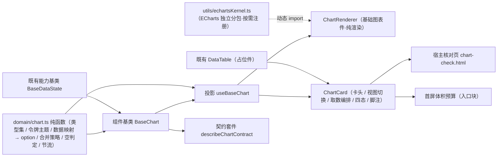

# 01 详细设计 · 图表卡

> 前端组件库 · 07 展示类 · 06 图表卡 · 需求 07-6 · 详细设计

[文档首页](../../../../../../文档首页.md) › [07 展示类](../../07_展示类.md) › [06 图表卡](../07_展示类_06_图表卡.md) › 详细设计　|　[← 任务](../07_展示类_06_图表卡.md)

## 1. 设计目标与范围 <a id="goal"></a>

交付[需求 07-6](../../../../需求/07_需求_展示类.md#r07-6) 的**图表卡**与**图表组件基类**：

- **图表卡真实实现**：可挂数据集渲染、令牌色板与深浅主题、加载 / 空 / 错误 / 降级四态、工作台卡片形态（卡头 / 视图切换 / 刷新 / 详情 / 编辑态移除 / 脚注 / 轮询 / 视口懒渲染）、容器尺寸自适应、导出图片。
- **组件基类新增**：随本需求演练新增**图表组件基类 `BaseChart`**（父基类 `BaseDataState`，`07_06` 交付），按《前端基类清单》流程（候选 → 设计节点 → 评审 → 清单登记 → 代码登记 + 契约用例）落位并回写登记。
- **按需分包**：ECharts 独立分包懒加载、按需注册（未用类型不注册），**不进首屏主包**；纳入首屏体积预算。
- **对外契约不变**：`ChartCard` 导出名、既有 Props / 事件 / 插槽 / `data-test` 保持 `07_01` 冻结形状，本次只**向后兼容新增**可选 Props / 事件 / 插槽（变更走版本升级）。

### 1.1 口径与依从 <a id="positioning"></a>

- **架构铁律**：图表实例生命周期、尺寸自适应、主题重建、四态判定均为**横切功能**，一律落为**继承链上的组件基类**（核心 `capabilities/chart.ts`）与**领域纯函数**（核心 `domain/chart.ts`）；具体件只做渲染与投影，不得链外挂接、不得重复实现取色与渲染。
- **继承链**：`BaseComponent`（组件根）→ `BaseDataState`（数据状态能力基类）→ `BaseChart`（组件基类）→ 具体件（`ChartRenderer` / `ChartCard`，经 `useBaseChart` 投影挂链）。依赖登记 `chart: ['data-state']`。
- **核心框架无关（强制）**：核心包不得依赖 ECharts / Vue / DOM。图表引擎以**注入式适配器**（`ChartEngineAdapter`）接入：核心只维护状态与调用语义，容器与 ECharts 实例由 ui-ep 适配器持有。
- **取数与配置分离**：**取数归使用方**（图表卡编排数据状态机）；**基础图表件只接收数据 / 配置渲染，不发起请求**（保持纯渲染）；图表配置生成与主题生成落核心纯函数。
- **色板令牌（强制）**：配色一律取设计令牌 `--bms-chart-color-1..8` 与辅助令牌 `--bms-chart-axis` / `--bms-chart-grid` / `--bms-chart-text` / `--bms-chart-tooltip-bg` / `--bms-chart-tooltip-text`；**禁止硬编码色值**（沿用 `--bms-` 前缀，回写《布局设计 · 设计令牌》）。
- **端范围**：**仅 PC**（`frontend/packages/ui-ep`）；移动端本期不落实现，但契约套件 `describeChartContract` 就位供后续同契约多实现。
- **工时**：本任务 14h；因新增 1 个组件基类、1 份领域纯函数、1 套契约套件、1 套投影、1 个内核适配工具、2 件组件（迁入专题族 + 新增）与宿主核对页、体积预算脚本改造，实际上浮在实施记录登记。

## 2. 交付物清单 <a id="deliver"></a>

| # | 交付物 | 落点 |
| --- | --- | --- |
| 1 | 图表领域纯函数与数据模型（新增） | `core/src/domain/chart.ts` |
| 2 | 图表组件基类 `BaseChart`（新增） | `core/src/capabilities/chart.ts` |
| 3 | 能力依赖登记（新增 `chart` 一键） | `core/src/capabilities/manifest.ts` |
| 4 | 核心导出面登记 | `core/src/index.ts` |
| 5 | 契约套件 `describeChartContract`（新增） | `core/testing/chart.ts`、`core/testing/index.ts` |
| 6 | 核心用例（领域 + 组件基类） | `core/tests/domain-chart.spec.ts`、`core/tests/chart.spec.ts` |
| 7 | 图表组件基类投影（新增） | `ui-ep/src/composables/useBaseChart.ts` |
| 8 | 基础图表件（新增，纯渲染） | `ui-ep/src/components/chart/ChartRenderer.vue` |
| 9 | 图表卡（迁移 + 真实实现） | `ui-ep/src/components/chart/ChartCard.vue`（旧路径 `components/display/ChartCard.vue` 删除） |
| 10 | ECharts 内核适配（单一落点 / 独立分包入口） | `ui-ep/src/utils/echartsKernel.ts` |
| 11 | 导出面登记（旧路径移除） | `ui-ep/src/index.ts` |
| 12 | 插件依赖（图表库） | `ui-ep/package.json`（`echarts`） |
| 13 | 用例（投影 + 两件 + 分包 / 四态 / 主题） | `ui-ep/tests/display-chart.spec.ts` |
| 14 | 设计令牌图表色板（亮 / 暗） | `apps/desktop/src/styles/tokens.scss` |
| 15 | 分包命名与首屏体积预算改造 | `apps/desktop/vite.config.ts`、`apps/desktop/scripts/check-bundle-budget.mjs`、`apps/desktop/budget.json` |
| 16 | 宿主核对页（`vite build` 不含） | `apps/desktop/chart-check.html`、`apps/desktop/src/dev/{chartCheck.ts,ChartCheck.vue}` |
| 17 | 登记回写（基类清单 / 组件设计 / 架构 / 布局 / 计划与状态） | 见第 6 节 |



## 3. 接口 / 契约与边界 <a id="contract"></a>

### 3.1 核心：`domain/chart.ts`（新增纯函数与数据模型） <a id="domain"></a>

```ts
/** 图表取数权限码（与报表中心一致）。 */
export const CHART_VIEW_PERM = 'rpt:view'
/** 图表占位文案（数据通路未就绪）。 */
export const CHART_PLACEHOLDER_TEXT = '图表数据未就绪（占位）'
/** 空数据文案。 */
export const CHART_EMPTY_TEXT = '暂无数据'
/** 图表色板令牌名（1..8）。 */
export const CHART_COLOR_TOKENS: readonly string[]
/** 图表辅助令牌名。 */
export const CHART_AXIS_TOKEN = '--bms-chart-axis'
export const CHART_GRID_TOKEN = '--bms-chart-grid'
export const CHART_TEXT_TOKEN = '--bms-chart-text'
export const CHART_TOOLTIP_BG_TOKEN = '--bms-chart-tooltip-bg'
export const CHART_TOOLTIP_TEXT_TOKEN = '--bms-chart-tooltip-text'
/** 尺寸自适应节流间隔（毫秒）。 */
export const CHART_RESIZE_INTERVAL = 150
/** 短缓存存活时间（毫秒）。 */
export const CHART_CACHE_TTL = 30_000

/** 图表类型。 */
export type ChartKind =
  | 'line' | 'area' | 'bar' | 'hbar' | 'stacked_bar' | 'pie' | 'doughnut'
  | 'scatter' | 'funnel' | 'radar' | 'gauge' | 'table' | 'map'
/** 图表类型项。 */
export interface ChartKindOption { kind: ChartKind; label: string; hasAxis: boolean; hasLegend: boolean }
/** 图表类型集（顺序即下拉顺序）。 */
export const CHART_KINDS: readonly ChartKindOption[]
/** 渲染模式。 */
export type ChartRenderMode = 'canvas' | 'svg'
/** 主题模式。 */
export type ChartThemeMode = 'auto' | 'light' | 'dark'
/** 视图。 */
export type ChartView = 'chart' | 'table'
/** 数据集字段（与报表数据集一致）。 */
export interface ChartField { name: string; type: string }
/** 数据集结果。 */
export interface ChartDatasetResult { columns: ChartField[]; rows: Record<string, unknown>[] }
/** 数据映射（维度 / 度量 / 系列）。 */
export interface ChartMapping { dimension?: string; metrics: string[]; series?: string }
/** 常用样式。 */
export interface ChartStyleOptions {
  legend?: boolean
  axisName?: string
  smooth?: boolean
  stacked?: boolean
  label?: boolean
  paletteIndex?: number
}
/** 图表配置（`chart_config` 结构；设计器与图表卡共用）。 */
export interface ChartConfig {
  version: number
  chartType: ChartKind
  title?: string
  mapping: ChartMapping
  style?: ChartStyleOptions
  override?: Record<string, unknown>
}
/** 令牌读取口（宿主注入，不触 DOM）。 */
export type ChartTokenReader = (name: string) => string | undefined
/** 图表主题（令牌解析结果）。 */
export interface ChartTheme {
  name: string
  mode: 'light' | 'dark'
  color: string[]
  axis: string
  grid: string
  text: string
  tooltipBg: string
  tooltipText: string
}
/** 图表四态名（沿用数据状态）。 */
export type ChartStateName = 'loading' | 'ready' | 'empty' | 'error'

normalizeChartKind(value: unknown): ChartKind
chartKindOption(kind: ChartKind): ChartKindOption
hasChartAxis(kind: ChartKind): boolean
emptyMapping(): ChartMapping
normalizeMapping(value: unknown, fields?: readonly ChartField[]): ChartMapping
defaultMapping(fields: readonly ChartField[]): ChartMapping
normalizeChartConfig(value: unknown, fields?: readonly ChartField[]): ChartConfig
buildChartTheme(reader: ChartTokenReader, mode: 'light' | 'dark'): ChartTheme
resolveChartMode(mode: ChartThemeMode, prefersDark: boolean): 'light' | 'dark'
isChartEmpty(result: ChartDatasetResult | undefined, config: ChartConfig): boolean
buildChartOption(config: ChartConfig, result: ChartDatasetResult | undefined, theme: ChartTheme): Record<string, unknown>
chartOptionSignature(config: ChartConfig): string
shouldReplaceOption(prev: ChartConfig | undefined, next: ChartConfig): boolean
mergeChartOption(prev: Record<string, unknown> | undefined, next: Record<string, unknown>, replace: boolean): Record<string, unknown>
shouldResize(lastMs: number, nowMs: number, intervalMs?: number): boolean
chartConfigEqual(a: ChartConfig | undefined, b: ChartConfig | undefined): boolean
serializeChartConfig(config: ChartConfig): string
```

| 行为 | 口径 |
| --- | --- |
| 类型集 | `CHART_KINDS` 与《组件设计 · 图表卡》§3.2 完全一致（13 类 + 中文标签 + 是否有轴 / 图例）；`normalizeChartKind` 未知值回落 `line` |
| 映射归一 | `normalizeMapping`：维度 / 系列取存在的字段名，缺失回落首个文本字段 / 首个数值字段；`metrics` 剔空去重、缺省取全部数值字段（**只认字段清单内字段，防脏引用**） |
| 配置归一 | `normalizeChartConfig`：`version` 缺省 `1`；`mapping` 经归一；`style` 补确定值（`legend: true`、`smooth: false`、`stacked: false`、`label: false`、`paletteIndex: 0`）；`override` 缺省不生成空对象（**运行态确定值，无 `undefined.trim()` 类崩溃**） |
| 主题生成 | `buildChartTheme`：按 `CHART_COLOR_TOKENS` 顺序读令牌（缺省回落内置基准色，仅作兜底），轴 / 网格 / 文字 / 提示读辅助令牌；**纯读取，不触 DOM**（reader 由宿主以 `getComputedStyle` 实现） |
| 模式解析 | `resolveChartMode`：`auto` 时随 `prefersDark`，否则按显式模式 |
| 空判定 | `isChartEmpty`：`result` 缺失 / 行数为 0 → 空；`table` 类型不适用（有行即可）；折线 / 柱 / 饼等按映射的度量列判断是否有有效数值（全空 / 全非数 → 空） |
| 选项生成 | `buildChartOption`：按类型 + 映射 + 样式生成 ECharts `option`（**纯对象，不 import echarts**）；饼 / 仪表盘无坐标轴；多度量生成多系列；`series` 映射生成分组系列；色板取主题 `color`（循环），**不写死色值**；最后 `deepMerge` 应用 `override` |
| 合并策略 | `shouldReplaceOption`：类型变化或映射签名变化 → 全量替换（防旧系列残留）；否则增量（`mergeChartOption` 深合并） |
| 节流 | `shouldResize`：`nowMs - lastMs >= intervalMs`（缺省 `CHART_RESIZE_INTERVAL`）才允许自适应 |
| 脏比对 | `chartConfigEqual` / `serializeChartConfig`：经既有 `stableStringify` 逐字比对（键序无关）；`chartOptionSignature` 取类型 + 映射 + 样式的稳定签名 |
| 纯数据 | 不触 DOM、不请求、不依赖渲染框架与第三方库；同输入同输出 |

### 3.2 核心：组件基类 `BaseChart`（新增） <a id="base"></a>

```ts
/** 图表引擎适配器（由渲染插件实现：ECharts 实例 / 容器 / ResizeObserver 全在此）。 */
export interface ChartEngineAdapter {
  /** 初始化实例。 */
  init?(payload: { theme: ChartTheme; renderMode: ChartRenderMode }): void
  /** 写入选项（`replace` 为真全量替换）。 */
  update?(option: Record<string, unknown>, replace: boolean): void
  /** 主题切换重建（图实例主题固化，需销毁重建）。 */
  applyTheme?(theme: ChartTheme, option: Record<string, unknown>): void
  /** 重算尺寸。 */
  resize?(): void
  /** 导出图片（dataURL）。 */
  exportImage?(type: 'png' | 'svg'): string | undefined
  /** 事件注册 / 解绑。 */
  on?(event: string, handler: (payload: unknown) => void): void
  /** 全量解绑。 */
  offAll?(): void
  /** 销毁（幂等）。 */
  dispose?(): void
}
/** 引擎装载结果。 */
export interface ChartEngineHandle {
  /** 装载引擎适配器（懒加载完成后由渲染件注入）。 */
  adapter: ChartEngineAdapter
}
/** 图表卡处理函数（取数由使用方注入；未注入即不请求）。 */
export interface ChartJobs {
  /** 数据集取数：返回 `{ columns, rows }`。 */
  load?: (input: { datasetId: string; params?: Record<string, unknown> }) => Promise<ChartDatasetResult | undefined>
}

/** 图表组件基类（抽象）。 */
export abstract class BaseChart extends BaseDataState {
  /** 能力键（组件基类身份）。 */
  readonly identifier: string = 'chart'
  /** 依赖登记。 */
  override readonly depends = ['data-state']
  /** 数据通路是否就绪（占位语义，缺省 false）。 */
  ready = false
  /** 占位态请求计数（占位态恒 0）。 */
  requestCount = 0
  /** 图表配置。 */
  config: ChartConfig
  /** 数据集结果。 */
  result: ChartDatasetResult | undefined
  /** 完整选项直给（优先于由配置生成；高级用法）。 */
  rawOption: Record<string, unknown> | undefined
  /** 视图（图表 / 数据表）。 */
  view: ChartView = 'chart'
  /** 主题模式。 */
  themeMode: ChartThemeMode = 'auto'
  /** 渲染模式。 */
  renderMode: ChartRenderMode = 'canvas'
  /** 容器高度（px，0 表示由容器决定）。 */
  height = 0
  /** 已解析主题。 */
  theme: ChartTheme | undefined
  /** 引擎适配器（渲染件注入）。 */
  engine: ChartEngineAdapter | undefined
  /** 令牌读取口（宿主注入）。 */
  tokens: ChartTokenReader | undefined
  /** 是否偏好深色（宿主注入）。 */
  prefersDark = false
  /** 取数处理函数（使用方注入）。 */
  jobs: ChartJobs = {}

  get degraded(): boolean
  get empty(): boolean
  get loading(): boolean
  get error(): boolean
  get busy(): boolean
  get option(): Record<string, unknown> | undefined
  get activeTheme(): ChartTheme | undefined

  setReady(value: boolean): void
  setTokens(reader: ChartTokenReader | undefined): void
  setPrefersDark(value: boolean): void
  setJobs(jobs: ChartJobs): void
  setConfig(config: ChartConfig): void
  setRawOption(option: Record<string, unknown> | undefined): void
  setChartType(kind: ChartKind): void
  setMapping(mapping: ChartMapping): void
  setView(view: ChartView): void
  setThemeMode(mode: ChartThemeMode): void
  setRenderMode(mode: ChartRenderMode): void
  setHeight(height: number): void
  setEngine(engine: ChartEngineAdapter | undefined): void
  setResult(result: ChartDatasetResult | undefined): void
  load(input: { datasetId: string; params?: Record<string, unknown> }): Promise<ChartDatasetResult | undefined>
  refresh(): Promise<ChartDatasetResult | undefined>
  resize(nowMs?: number): boolean
  exportImage(type?: 'png' | 'svg'): string | undefined
}
```

| 行为 | 口径 |
| --- | --- |
| 占位语义 | `ready === false` → `degraded` 为真；`load` / `refresh` **零请求**（`requestCount` 恒 0），保持 `07_01` 冻结口径（`describePlaceholderDisplayContract` 断言不变即通过） |
| 就绪门控 | 就绪前 `setResult` 仅记录、**不初始化引擎**（空数据不初始化实例同理）；就绪后 `setResult` 触发生成 option 并写引擎 |
| 四态 | 经 `BaseDataState`：取数开始 `begin()` → 结算 `settle(token, 'ready' \| 'empty' \| 'error')`；`isChartEmpty` 为真结算 `empty`；取数抛错结算 `error` |
| 引擎写入 | `setEngine` 注入后，若已有 option 且非空 → `engine.init({ theme, renderMode })` + `update(option, replace)`；无 option 不初始化 |
| 完整选项直给 | `setRawOption` 直接写入完整选项（优先于配置生成，供报表 / 大屏自定义配置）；`#mount` 空判定对 `rawOption` 放行 |
| 配置变更 | `setConfig` / `setChartType` / `setMapping`：按 `shouldReplaceOption` 决定 `replace`；`table` 类型不写图表引擎（渲染件切数据表） |
| 主题切换 | `setThemeMode` / `setPrefersDark` / `setTokens` → 重算 `theme`；引擎存在时 `engine.applyTheme(theme, option)`（**销毁重建**，图实例主题不可热改） |
| 自适应 | `resize(nowMs)` 经 `shouldResize` 节流（缺省 150ms）；通过且引擎存在 → `engine.resize()`，返回是否触发 |
| 导出 | `exportImage` 未就绪 / 无引擎 → `undefined`（不报错） |
| 取数 | `load` 未就绪 / 未注入 `jobs.load` → 不发请求（`requestCount` 不加）；注入后 `requestCount += 1`、经 `BaseDataState` 结算、成功 `setResult`；失败置 `error` 并 `reportError` |
| 释放 | 基类对象销毁（`BaseComponent.onDispose`）时调 `engine.dispose()`，防离屏实例常驻 |
| 纯数据 | 不触 DOM、不请求；`engine` 为接口注入，核心不 import ECharts |

- 依赖登记：`chart: ['data-state']`。
- 不含：图表库与实例（归 `utils/echartsKernel.ts`）、取数接口（归使用方图表卡）、数据集 SQL 与聚合（归后端报表中心）、通用表格渲染（归 `DataTable`）。

### 3.3 核心：契约套件 `describeChartContract`（`@bms/core/testing`） <a id="testing"></a>

| 契约面（结构化接口） | 断言要点 |
| --- | --- |
| `ready` / `degraded` / `requestCount` / `state` / `view` / `themeMode` / `option()` / `activeTheme()` | 占位态降级且零请求（`load` / `refresh` 后仍为 0）；就绪后不再降级 |
| `setReady` / `setTokens` / `setPrefersDark` / `setJobs` / `setConfig` / `setChartType` / `setMapping` / `setView` / `setThemeMode` / `setRenderMode` / `setHeight` / `setEngine` / `setResult` / `load` / `refresh` / `resize` / `exportImage` | 未注入引擎不报错、返回 `undefined` / `false`；注入引擎后按语义调用（`init` / `update` 的 `replace` 标记、`applyTheme`、`resize`、`dispose`）；空数据结算 `empty` 且不初始化引擎；就绪未注入 `jobs.load` 仍零请求；取数成功置 `ready` 并生成 option；类型 / 映射变化触发全量替换；`resize` 节流（同帧重复调用为 `false`）；主题切换派发 `applyTheme`；销毁派发 `dispose` |

- 契约目标约定：图表类型 `bar`、映射维度 `month` + 度量 `receipt`；取数返回 2 行；引擎为**桩适配器**（记录调用轨迹），核心用例与 `ui-ep` 用例共用同一套断言（「同契约多实现」）。
- 复用 `describePlaceholderDisplayContract`（`07_01` 冻结）：真实实现继续跑同一套件，断言不改动即通过。

### 3.4 插件层：投影 `useBaseChart`（新增） <a id="projection"></a>

```ts
export interface UseBaseChartOptions {
  ready?: boolean
  chartType?: ChartKind
  mapping?: ChartMapping
  config?: ChartConfig
  result?: ChartDatasetResult
  view?: ChartView
  themeMode?: ChartThemeMode
  renderMode?: ChartRenderMode
  height?: number
  tokens?: ChartTokenReader
  prefersDark?: boolean
  jobs?: ChartJobs
  engine?: ChartEngineAdapter
}
export interface UseBaseChartResult {
  chart: BaseChart
  ready: Ref<boolean>
  degraded: Ref<boolean>
  state: Ref<DataStateName>
  view: Ref<ChartView>
  config: Ref<ChartConfig>
  option: Ref<Record<string, unknown> | undefined>
  theme: Ref<ChartTheme | undefined>
  errorMessage: Ref<string>
  setReady(value: boolean): void
  setTokens(reader: ChartTokenReader | undefined): void
  setPrefersDark(value: boolean): void
  setJobs(jobs: ChartJobs): void
  setConfig(config: ChartConfig): void
  setRawOption(option: Record<string, unknown> | undefined): void
  setChartType(kind: ChartKind): void
  setMapping(mapping: ChartMapping): void
  setView(view: ChartView): void
  setThemeMode(mode: ChartThemeMode): void
  setRenderMode(mode: ChartRenderMode): void
  setHeight(height: number): void
  setEngine(engine: ChartEngineAdapter | undefined): void
  setResult(result: ChartDatasetResult | undefined): void
  load(input: { datasetId: string; params?: Record<string, unknown> }): Promise<ChartDatasetResult | undefined>
  refresh(): Promise<ChartDatasetResult | undefined>
  resize(nowMs?: number): boolean
  exportImage(type?: 'png' | 'svg'): string | undefined
}
```

- 薄适配（核心实例 ↔ Vue 响应式），不含判定逻辑；`onLifecycle('update')` → `sync()`；`onScopeDispose` 解除订阅并 `chart.dispose()`（沿用 `08_06` 投影 8 步骨架）。
- `engine` 由渲染件在容器挂载后经 `setEngine` 注入（**跨实例基类对象不进入响应式**，沿用 `markRaw(toRaw())` 坑记录）。

### 3.5 插件层：ECharts 内核适配 `utils/echartsKernel.ts`（新增 · 独立分包入口） <a id="kernel"></a>

```ts
/** ECharts 引擎装载选项。 */
export interface EchartsEngineOptions {
  container: () => HTMLElement | undefined
  renderMode?: ChartRenderMode
  theme?: ChartTheme
}
/** 装载 ECharts 引擎（动态 import，独立分包）。 */
export function createEchartsEngine(options: EchartsEngineOptions): Promise<ChartEngineAdapter>
/** 懒加载并注册地图地理数据（独立分包）。 */
export function loadChartMap(name: string): Promise<boolean>
```

| 行为 | 口径 |
| --- | --- |
| 按需注册 | `import('echarts/core')` + 按 `CHART_KINDS` 注册用到的 `LineChart` / `BarChart` / `PieChart` / `ScatterChart` / `FunnelChart` / `RadarChart` / `GaugeChart` / `MapChart` 与 `GridComponent` / `TooltipComponent` / `LegendComponent` / `TitleComponent` / `ToolboxComponent` / `DataZoomComponent` / `MarkLineComponent`、`CanvasRenderer`（`svg` 模式另注册 `SVGRenderer`）与 `LabelLayout` / `UniversalTransition`；**`table` 类型不注册图表库**（走 `DataTable`） |
| 主题 | 注册 `bms-light` / `bms-dark` 两个主题（由 `buildChartTheme` 生成），实例以主题名初始化；主题切换走 `applyTheme`（销毁 + 重建 + 重放 option） |
| 自适应 | 适配器持有 `ResizeObserver` 监听容器（非 window），尺寸为 0 不重算；断连在 `dispose` |
| 懒渲染 | 容器宽高均 > 0 才 `echarts.init`；隐藏 / 尺寸 0 时延迟 |
| 地图 | `loadChartMap(name)` 动态 `import('../assets/maps/{name}')` 并 `registerMap`；加载失败返回 `false`（件层降级提示）；地理数据不进首屏 |
| 导出 | `exportImage` 经 `getDataURL` |
| 释放 | `dispose`：解绑事件 + 断开 `ResizeObserver` + `echarts.dispose`（幂等） |
| 落点 | **浏览器 API 与 ECharts 只出现在本工具与两件**（核心与投影不触 DOM / 第三方） |

### 3.6 插件层：`ChartRenderer.vue`（新增 · 基础图表件·纯渲染） <a id="renderer"></a>

| 面 | 内容 |
| --- | --- |
| 数据面 | `ready`（缺省 `false`）/ `option`（完整配置，优先）/ `chartType`（便捷类型，缺省 `line`）/ `data`（`ChartDatasetResult`）/ `config`（`ChartConfig`）/ `themeMode` / `renderMode` / `height` / `lazy`（视口懒渲染，缺省 `false`）/ `loading` / `emptyText` / `errorText` / `degradeText` |
| 事件 | `ready`（实例就绪）/ `resize`（容器尺寸变化）/ `retry`（错误态重试）/ `chart-click`（数据点点击）/ `legend-change` |
| 插槽 | `degrade` / `empty` / `error` / `loading` / `live`（作用域回传 `{ chartType, option }`） |
| `data-test` | `chart-renderer`（`data-subpackage="chart-kernel"`）/ `placeholder` / `empty` / `error` / `loading` / `canvas`（`data-chart-type`） |

- 纯渲染：只接收数据 / 配置，**不取数、不请求**；`option` 与 `config` 二选一（给 `option` 时以之为准，`chartType` 仅作兜底）。
- 容器挂载后经 `createEchartsEngine`（动态 import）装载适配器并 `setEngine`；卸载 `dispose`。
- `lazy` 为真时用 `IntersectionObserver` 进入视口才装载（工作台多卡场景），能力缺失降级为立即装载不抛错。
- 四态：`ready` 为假 → `degrade`；空数据 → `empty`（**不渲染坐标轴与图例**）；错误 → `error` + 重试；加载 → `loading` 骨架。

### 3.7 插件层：`ChartCard.vue`（迁移 + 真实实现） <a id="card"></a>

件族迁入专题目录 `ui-ep/src/components/chart/`（同 `form-design/`、`approval/` 先例），**对外导出名、既有 Props / 事件 / 插槽 / `data-test` 不变**，旧路径 `components/display/ChartCard.vue` 删除。

| 面 | 内容 |
| --- | --- |
| 数据面（既有，保持） | `ready`（缺省 `false`）/ `title` / `chartType`（既有枚举）/ `option` / `loading` / `height` / `degradeText` |
| 数据面（新增，全部可选） | `datasetId` / `datasetName` / `datasetRemark`（脚注口径说明）/ `data`（`ChartDatasetResult`）/ `mapping` / `chartStyle`（常用样式，避开 Vue 保留属性名）/ `config` / `themeMode` / `renderMode` / `view`（`chart` / `table`）/ `showViewSwitch` / `showRefresh` / `showDetail` / `pollInterval`（秒，0 不轮询）/ `editable` / `updatedAt` / `jobs`（取数处理函数）/ `tokens` / `prefersDark` |
| 事件（既有，保持） | `refresh` / `chart-click` / `download` |
| 事件（新增） | `update:view`（`ChartView`）/ `detail`（下钻：携带维度值）/ `remove`（编辑态移除）/ `state-change`（`loading` / `empty` / `error` / `unavailable` / `forbidden`）/ `loaded`（`ChartDatasetResult`）/ `failed`（`{ message }`） |
| 插槽（既有，保持） | `actions` / `live` / `degrade` |
| 插槽（新增） | `header-actions` / `empty` / `error` / `footer` / `params` |
| `data-test`（既有，保持） | `placeholder` / `header` / `title` / `chart`（`data-chart-type`）/ `refresh` / `download` |
| `data-test`（新增） | `view-chart` / `view-table` / `detail` / `remove` / `footnote` / `updated-at` / `error` / `empty` / `data-table` |

**事件与注入双轨**：点击一律**保留既有事件上抛**；**仅当宿主注入 `jobs`** 时件内才驱动真实取数（避免宿主两种用法重复执行）。现有冻结用例（未注入 `jobs`）断言不变即通过。

**取值口径**：`ready` 受控优先；四态由 `BaseChart` 与取数状态机驱动；图 / 表视图切换复用 `DataTable`（`07_01` 占位件以 `ready=true` 渲染只读表，真实通用表格 `07_05` 交付后自然升级）。

**取数口径**：注入 `jobs.load` 后，按 `datasetId` + 参数（`params` 序列化对齐查询筛选区：区间 `*_start`/`*_end`、多值逗号、布尔 `1/0`）取数；同卡同参数**短缓存**（`CHART_CACHE_TTL`，手动刷新强制绕过）；轮询仅当 `pollInterval > 0` 且页面可见（不可见暂停）。

**卡形态**：卡头（标题 + 视图切换 / 刷新 / 详情 / 编辑态移除）+ 内容区（图表 / 数据表 / 四态）+ 脚注（数据集标注与最后更新，无标注不渲染）。

### 3.8 分包入口与依赖 <a id="chunk"></a>

| 入口 | 宿主 | 说明 |
| --- | --- | --- |
| `utils/echartsKernel.ts`（ECharts 独立分包入口） | `ChartRenderer` | 动态 import ECharts 内核 + 地图数据；首屏不加载 |
| `ChartRenderer`（基础图表件） | `ChartCard` / 报表设计器 / 大屏 | 纯渲染件（小体量，静态引入）；容器挂载后才动态装载内核 |

- `echartsKernel` 与地图数据经**动态 `import()`** 独立成块；`apps/desktop/vite.config.ts` `manualChunks` 为 `echarts` / `zrender` 命名独立 vendor 块（**异步块，不进首屏**）。
- **静态件 + 动态库**：`ChartRenderer` / `ChartCard` 保持静态可同步渲染（保证 `07_01` 冻结用例同步断言），重量级图表库经 `echartsKernel` 动态装载，首屏不加载。
- 新增依赖：`echarts@^6.1.0`（随 `ui-ep` 依赖安装，走 npmmirror 源）；**不进核心**（核心保持框架与第三方无关）。

### 3.9 首屏体积预算改造 <a id="budget"></a>

| 项 | 改动 |
| --- | --- |
| 统计口径 | `check-bundle-budget.mjs` 由「全量 dist 块」改为**入口块首屏预算**：解析 `dist/index.html` 的静态引用（`<script type="module">` / `<link rel="modulepreload">` / `<link rel="stylesheet">`）得出入口块集合，仅统计入口块 gzip 体积；异步 `import()` 块（`vendor-echarts` 等）不计入首屏 |
| 保留项 | 仍统计「入口合计」与「入口最大单文件」两个上限；输出注明被排除的异步块清单（评审可见） |
| `budget.json` | 备注更新为「首屏按入口块统计；子分包（ECharts / gridstack 等）不计入首屏预算，单独观察」 |

### 3.10 设计令牌图表色板 <a id="tokens"></a>

`apps/desktop/src/styles/tokens.scss` 新增（亮色 `:root` 与暗色 `[data-theme='dark']` 两套）：

```scss
:root {
  --bms-chart-color-1: #0969da; // 主序列（对齐 --bms-color-primary）
  --bms-chart-color-2: #2da44e;
  --bms-chart-color-3: #d4a72c;
  --bms-chart-color-4: #cf222e;
  --bms-chart-color-5: #57606a;
  --bms-chart-color-6: #8250df;
  --bms-chart-color-7: #1b7c83;
  --bms-chart-color-8: #bc4c00;
  --bms-chart-axis: var(--bms-color-border);
  --bms-chart-grid: var(--bms-color-border);
  --bms-chart-text: var(--bms-color-text-secondary);
  --bms-chart-tooltip-bg: var(--bms-color-bg);
  --bms-chart-tooltip-text: var(--bms-color-text);
}
```

- 暗色仅覆盖对比度相关辅助令牌（网格 / 文字由暗色 `--bms-color-*` 派生），序列色保持语义一致；**令牌只增不改**，既有令牌不变。

### 3.11 宿主核对页 <a id="check"></a>

`apps/desktop/chart-check.html` + `src/dev/{chartCheck.ts,ChartCheck.vue}`（`vite build` 只构建 `index.html`，核对页不进产物）。自检项 12 项：

1. 占位降级与就绪切换；
2. 类型集切换（13 类，`table` 切数据表视图）；
3. 数据映射（维度 / 度量 / 系列）与多度量；
4. 常用样式（标题 / 图例 / 轴名 / 平滑 / 堆叠 / 数据标注 / 色板序号）；
5. 高级配置 JSON 覆盖（非法 JSON 降级忽略）；
6. 令牌色板与深浅主题切换（重建实例，无硬编码色值）；
7. 四态（加载 / 空数据不画轴 / 错误重试 / 数据集不可用 / 无权限降级）；
8. 容器 resize 自适应（防抖 150ms，只触发一次）；
9. 视图切换（图表 / 数据表）与数据表复用；
10. 地图类型懒加载（地理数据加载失败降级提示）；
11. 卡头操作（刷新 / 导出图片 / 详情 / 编辑态移除）与脚注数据集标注；
12. ECharts 独立分包（首屏不含，进入视口 / 初始化后才加载）。

以 chromium headless `--dump-dom` 核验全部自检项；懒加载件以 `waitFor` 轮询等待到位后再断言。

## 4. 失败分支与边界 <a id="edge"></a>

| 边界 / 失败场景 | 处置 |
| --- | --- |
| 数据通路未就绪（`ready` 为假） | 占位：降级 + 不初始化实例 + 取数零请求（保持 `07_01` 冻结口径） |
| 取数处理函数未注入 | 占位：不请求、返回 `undefined`；件层显示就绪但无数据骨架 / 空态 |
| 空结果 | 空态插画 + 文案，**不渲染坐标轴与图例**；不初始化实例 |
| 单点 / 单序列 | 正常渲染（不触发空判定） |
| 超长类目标签 | 轴标签省略 + 提示（ECharts 内置 `axisLabel` 配置） |
| 超多序列 | 色板循环 + 图例滚动分页（`legend.type: 'scroll'`） |
| 结果集超限（90005） | 错误态提示（件层按 i18n `error.90005` 细化） |
| 数据集停用 / 删除（90001） | 「数据集不可用」降级占位（无重试或仅提示）；编辑态可移除 |
| 无权限（`rpt:view` 缺失 / 数据范围为空） | 「无权限查看」降级，不中断整页 |
| 从库不可用 / 超时（90003）/ 限流（90006） | 错误态 + 重试；重试由使用方重新取数 |
| 地图地理数据加载失败 | 降级提示（不抛错） |
| 容器尺寸为 0（隐藏 Tab / 布局未完成） | 延迟初始化 / 不重算，待可见后按需初始化 |
| 深浅 / 租户品牌切换 | 重建实例并重放最近一次配置（主题不可热改） |
| 高级配置 JSON 非法 | 忽略覆盖并提示，保留主题与生成结果（不硬编码色值） |
| `table` 类型 | 不注册 / 不初始化图表库，走 `DataTable` 只读表 |
| 懒加载分包件 / 内核加载失败 | 降级提示（沿用反馈件口径） |
| 只读 / 编辑态 | `editable` 为假不显示移除手柄；移除仅前端布局变更，由宿主保存 |
| 轮询与页面不可见 | 不可见暂停；`pollInterval` 为 0 不轮询 |

## 5. 测试设计与验收映射 <a id="test"></a>

| 验收点（需求 07-6 / 任务 07_06） | 用例 |
| --- | --- |
| 类型集归一、映射归一、配置归一（缺省项补确定值） | `core/tests/domain-chart.spec.ts` |
| 令牌主题生成、模式解析、空判定、选项生成（多度量 / 分组 / 色板循环） | 同上 |
| 合并策略（类型 / 映射变化全量替换）、节流、脏比对 | 同上 |
| 组件基类：占位零请求、就绪门控、四态结算、引擎调用轨迹（init / update / applyTheme / resize / dispose）、懒渲染、导出 | `core/tests/chart.spec.ts` + `describeChartContract` |
| 契约套件（同契约多实现） | `describeChartContract`（核心 + `ui-ep` 适配） |
| 投影薄适配（响应式面与同步、销毁） | `ui-ep/tests/display-chart.spec.ts` |
| 图表卡真实实现：占位降级、就绪渲染卡头与图表、视图切换、事件上抛、注入 `jobs` 取数、四态、脚注 | 同上（保留 `display-placeholder.spec.ts` 不改动原样通过） |
| 基础图表件：四态、懒渲染、内核装载（mock）、卸载释放 | 同上 |
| 分包边界（`data-subpackage="chart-kernel"`、`vi.dynamicImportSettled`） | 同上 |
| 能力登记对账（能力文件 ↔ manifest ↔ 基类清单） | `core/tests/guard-manifest.spec.ts`（自动覆盖新增 `chart` 键） |
| 注释齐备与核心框架无关护栏 | `core/tests/guard-jsdoc.spec.ts`、`guard-core-framework-agnostic.spec.ts` |
| 组件继承链护栏（两件均实质挂链） | `ui-ep/tests/guard-component-inheritance.spec.ts` |
| 开发态核对页 12 项自检 | chromium headless `--dump-dom` |
| `vue-tsc`、ESLint、Vitest 全通过 | 根 `npm run check` + 宿主 `vue-tsc -b` / `lint` / `test:cov` / `build` / `budget` |
| 文档链接与基座校验 | `check-links.py`、`check-base.py` |

- 既有 `ui-ep/tests/display-placeholder.spec.ts`（`07_01` 冻结契约）**不得改动**，须原样通过（`ChartCard` 占位降级与就绪事件断言保持）。
- Kiwi 用例 1 条（一任务一条，编号于测试步登记后回填；分类「平台骨架」、优先级 P2、状态 `CONFIRMED`、标签「自动化」）。

## 6. 登记落点 <a id="register"></a>

| 内容 | 落点 |
| --- | --- |
| 新增组件基类 `BaseChart`（能力键 `chart`，父基类 `BaseDataState`，依赖 `data-state`） | 《[前端基类清单](../../../../../../前端基类清单.md)》§2.1 全量基类登记表插入行（组件侧 · 组件基类，「已交付」）+ §2 继承链总览 + §5.3 组件基类表 + §10 迁移映射行（`BaseChart` 由规划改已交付）+ `capabilities/manifest.ts` |
| 领域纯函数与数据模型 `domain/chart.ts` | 同上 §9「核心」（`domain/` 领域纯函数） |
| 契约套件 `describeChartContract` | 同上 §9（`core/testing/`） |
| 投影 `useBaseChart`、件族 `components/chart/`（`ChartRenderer` / `ChartCard`）、内核工具 `utils/echartsKernel.ts` | 同上 §9「PC 插件」（组件目录与 `composables/`、`utils/` 清单） |
| 设计令牌图表色板 | 《[布局设计 · 设计令牌](../../../../../../设计/布局设计/02_布局设计_设计令牌.html)》「颜色令牌」节（登记项②）；`apps/desktop/src/styles/tokens.scss` |
| 上游登记回写（组件设计 · 图表卡 4 项 + 组件设计 · 图表域基类 3 项） | 《组件设计 · 图表卡》§9.2（数据集运行取数接口 / 图表色板令牌 / 工作台卡片元数据 / 前端架构分包与性能）；《组件设计 · 图表域基类》§6.2（图表域基类契约 / 图表主题令牌 / 报表大屏图表契约）；同步《[架构设计 · 前端组件体系](../../../../../../设计/架构设计/05_架构设计_前端组件体系.md)》《[架构设计 · 前端架构](../../../../../../设计/架构设计/08_架构设计_前端架构.md)》 |
| 任务 / 父任务 / 域任务 / 计划状态 | [任务](../07_展示类_06_图表卡.md)、[父任务](../../07_展示类.md)、[计划](../../../../计划/01_计划_前端组件库.md)（`07_06` 完成后父任务转 `部分完成` 并留在 §3） |
| 需求文档 | 不承载进度（状态只在任务与计划两处一致）；遗留归口写在实施 / 测试记录与计划 |

## 7. 边界与开放项 <a id="open"></a>

- **不在本期**：真实数据集取数接口联调（`POST /rpt/datasets/{id}/query` 未回写概要设计，取数经 `jobs.load` 注入，真实联调归口报表 BI 窗口）；通用表格真实实现（`07_05`，本期数据表视图复用 `07_01` 占位 `DataTable`）；地图地理数据全量（本期先落懒加载机制与 china 一份，其余按需扩展）；工作台页面集成（布局卡槽与编辑面板，归首页工作台任务）；移动端实现（不落实现，契约套件就位）。
- **协同契约**：取数处理函数由宿主注入（本任务不实现后端通路）；令牌读取口与深色偏好由宿主注入；**未注入即占位零请求**。
- **与 `08-9-1` 协同**：图表配置 `ChartConfig` / 选项生成 `buildChartOption` / 主题 `buildChartTheme` / 契约套件由本任务**前置交付**；报表设计器只做配置与布局编排，**不重定义渲染契约**（复用 `BaseChart` + `ChartRenderer`）。
- **图表类型扩展**：新增类型 = `CHART_KINDS` + `buildChartOption` 分支 + `echartsKernel` 按需注册一条，不改卡片容器。
- **Kiwi 用例编号**：本任务平台登记后回填代码 `// kiwi_id: <编号>` 与实施 / 测试记录。

## 8. 决策记录 <a id="decision"></a>

| # | 决策项 | 结论 |
| --- | --- | --- |
| 1 | 实施窗口 | 现在推进（真实实现 + 注入式取数通路；真实联调归口报表 BI 窗口），并在 `08-9-1` 之前先行交付（`08-9-1` 的渲染前置） |
| 2 | 依赖版本 | ECharts 最新稳定版 `^6.1.0`（npmmirror 源）；gridstack 随 `08-9-1` 引入 |
| 3 | `BaseChart` 落点与形态 | 核心组件基类（父 `BaseDataState`）+ 注入式引擎适配器 `ChartEngineAdapter`；核心保持框架无关 |
| 4 | 图表族目录 | 新增专题族 `ui-ep/src/components/chart/`（`ChartRenderer` 新增 + `ChartCard` 迁入，旧路径删除，对外契约不变） |
| 5 | 主题与选项生成 | 核心纯函数 `domain/chart.ts`；ui-ep `utils/echartsKernel.ts` 负责注册与实例 |
| 6 | 令牌前缀 | 沿用 `--bms-` 前缀（`--bms-chart-color-1..8` 与辅助令牌） |
| 7 | 图表卡范围 | 完整卡形态（卡头 / 视图切换 / 刷新 / 详情 / 编辑态移除 / 脚注 / 轮询 / 视口懒渲染 / 导出） |
| 8 | 地图类型 | 含 `map`，地理数据懒加载（独立分包），加载失败降级 |
| 9 | 数据表视图 | 复用 `07_01` 占位 `DataTable`（`ready=true` 渲染只读表），待 `07_05` 升级 |
| 10 | 首屏体积预算 | 改造为**入口块首屏预算**（解析 `index.html` 静态引用），异步子分包不计入首屏 |
| 11 | 宿主核对页 | 新增 `chart-check.html` + `src/dev/chartCheck.*`（12 项自检，不进 `vue build`） |
| 12 | 上游回写 | 本次一并回写图表卡 §9.2 四项 + 图表域基类 §6.2 三项 + 架构 / 布局同步 |
| 13 | 对外契约 | 保持 `07_01` 冻结形状，仅向后兼容新增可选 Props / 事件 / 插槽；`data-test` 与既有事件不变 |
| 14 | 本次范围 | 仅 `07_06`；`08-9-1` 报表设计器随后单独详细设计与提交 |

## 9. 参考文档 <a id="ref"></a>

- [需求 07-6](../../../../需求/07_需求_展示类.md#r07-6)、[任务 07_06](../07_展示类_06_图表卡.md)、[父任务](../../07_展示类.md)
- 《组件设计》[04 图表卡](../../../../../../设计/组件设计/07_展示类/04_组件设计_图表卡/04_组件设计_图表卡.md)（含[可交互原型](../../../../../../设计/组件设计/07_展示类/04_组件设计_图表卡/04_原型设计_图表卡.html)，原型即验收基准）、[04 图表域基类](../../../../../../设计/组件设计/02_基础组件类/03_域基类/04_组件设计_图表域基类/04_组件设计_图表域基类.md)
- 《架构设计》[前端组件体系](../../../../../../设计/架构设计/05_架构设计_前端组件体系.md)（分包与加载策略）、[前端架构](../../../../../../设计/架构设计/08_架构设计_前端架构.md)（技术要点 / 性能）、[报表 BI](../../../../../../设计/架构设计/23_架构设计_子系统_报表BI.md)、[首页工作台](../../../../../../设计/架构设计/29_架构设计_子系统_首页工作台.md)
- 《概要设计》[报表中心](../../../../../../设计/概要设计/27_概要设计_报表中心.md)、[首页工作台](../../../../../../设计/概要设计/35_概要设计_首页工作台.md)
- 《布局设计》[设计令牌](../../../../../../设计/布局设计/02_布局设计_设计令牌.html)、[首页工作台](../../../../../../设计/布局设计/13_布局设计_首页工作台.html)、[异常与空状态](../../../../../../设计/布局设计/12_布局设计_异常与空状态.html)
- [《前端基类清单》](../../../../../../前端基类清单.md)、《[前端开发规范](../../../../../../规范/前端开发规范.md)》、《[文档生成规范](../../../../../../规范/文档生成规范.md)》
- [07_01 占位版交付](../../07_展示类_01_占位版交付/07_展示类_01_占位版交付.md)（冻结对外契约与占位语义）、[08_06_01 表单设计器](../../../08_交互类/08_交互类_06_表单设计器与表单渲染器/08_交互类_06_表单设计器与表单渲染器_01_表单设计器/设计/01_详细设计_01_表单设计器.md)（组件基类 + 领域 + 契约套件 + 投影 + 核对页做法）

> 本文档依《[文档生成规范](../../../../../../规范/文档生成规范.md)》编写
