# 01 实施 · 全局搜索

> 前端组件库 · 07 展示类 · 07 全局搜索（需求 07-7）· 实施记录

[文档首页](../../../../../../文档首页.md) › [07 展示类](../../07_展示类.md) › [07 全局搜索](../07_展示类_07_全局搜索.md) › 实施记录　|　[← 详细设计](../设计/01_详细设计_07_全局搜索.md)　[测试记录 →](../测试/01_测试_07_全局搜索.md)

## 1. 实施信息 

| 项 | 值 |
| --- | --- |
| 任务 | 07_07 全局搜索（[任务](../07_展示类_07_全局搜索.md)） |
| 对应需求 | [07-7](../../../../需求/07_需求_展示类.md#r07-7) |
| 详细设计 | [01_详细设计_07_全局搜索.md](../设计/01_详细设计_07_全局搜索.md) |
| 实施日期 | 2026-09-21 |
| 实施人 | minjian |
| 实施环境 | Ubuntu 开发机 · Node（workspace `@bms/core` + `@bms/ui-ep` + `apps/desktop`）· Vitest 5 / jsdom · Vue 3.5 / TypeScript 严格模式 · chromium（CDP 轮询后 `--dump-dom`） |
| Kiwi 用例 | 961（分类「平台骨架」/ P2 / CONFIRMED / 标签「自动化」） |
| 结论 | 完成标准达标（命中与高亮正确、域权限二次过滤生效、降级兜底可用、命令面板键盘流顺畅；契约套件与核心 / 插件用例齐全；核对页 13/13） |

```mermaid
flowchart LR
    A["Kiwi 用例登记（961）"] --> B["核心领域纯函数 domain/search.ts"]
    B --> C["插件基类 BaseSearchEngine + SearchEngineProvider / SearchEngineRegistry"]
    C --> D["能力基类 BaseGlobalSearch（父 BasePlaceholderState）"]
    D --> E["组件基类 BaseSearch（父 BaseGlobalSearch）"]
    E --> F["契约套件 describeSearchContract"]
    F --> G["核心用例（domain-search + global-search，新增 2 文件）"]
    G --> H["投影 useBaseSearch"]
    H --> I["工具 searchHighlight / searchEngine"]
    I --> J["search 专题族六件（GlobalSearch 迁入 + SearchEntry / SearchPalette / SearchHitItem / SearchLogTab / SearchFileTab 新增）"]
    J --> K["导出面 + 设计令牌（--bms-search-*）"]
    K --> L["ui-ep 用例（display-search）"]
    L --> M["宿主核对页 search-check（13 项自检）"]
    M --> N["门禁验证（core / vue / ui-ep check + 宿主 lint / build / budget + 基座校验）"]
    N --> O["登记回写（基类清单 / 组件设计 / 架构 / 布局 / 计划与状态）"]
```

## 2. 实施概览 

结果小结：新增 2 个基类（1 能力基类 + 1 组件基类）、1 个插件基类 / 注册项 / 注册表、1 份领域纯函数、1 套契约套件、1 套投影、2 个插件工具、六件组件（1 迁入 + 5 新增）与 1 个宿主核对页；`core` 76 文件 / 942 用例、`vue` 2 文件 / 5 用例、`ui-ep` 56 文件 / 763 用例全绿（本次 core 新增 2 文件，ui-ep 新增 1 文件 / 25 用例）。

## 3. 实施过程 

1. **Kiwi 先行**：经容器内 Django shell 登记用例，取得编号 **961**（平台既有编号至 960）；核心用例文件与插件用例文件首行标注 `// kiwi_id: 961`。
2. **核心领域纯函数 `domain/search.ts`**：域 / 命中 / 聚合结果归一（`docType` 兼容 `doc_type`、`bizId` 兼容 `biz_id`）、域权限过滤、关键词去空白与按码点截断、分页与限深夹取、全局 / 日志 / 文件查询参数构造（`q` / `types` / `log_type` / `start_time` / `end_time` / `file_type` / `page` / `size`）、审计时间范围校验（必填 + ≤ 31 天 + 自然日向上取整）、按域分组（域清单保序、未知域追加）与即时建议各域 Top N、最近搜索去重置顶与上限、命中稳定键与跳转目标、降级解析与错误码 `10101` ~ `10107` 文案。
3. **插件基类与注册表 `capabilities/search-engine.ts`**：`BaseSearchEngine`（继承 `BasePluggable`，方法未覆写返回 `undefined` 即不请求）、`SearchEngineProvider`（继承 `BaseProvider`）、`SearchEngineRegistry`（继承 `BaseProviderRegistry`，同键拒重）；契约面 `SearchEngineAdapter` 保留为注入面类型。
4. **新增能力基类 `BaseGlobalSearch`（`capabilities/global-search.ts`，父 `BasePlaceholderState`）**：关键词与域状态、即时建议、多域分组、审计日志与文件内容检索、降级与错误码、最近搜索（经 `BasePersistedState` 通道落盘）、域权限二次过滤（`BaseAccess`）与 `log:query` / `file:query` 页签门控、替代入口域清单。**未就绪 / 未注入引擎零请求**（`requestCount` 恒 0，保持 `07_01` 冻结口径）；请求竞态以序号防旧响应覆盖。
5. **新增组件基类 `BaseSearch`（`capabilities/search.ts`，父 `BaseGlobalSearch`）**：搜索族身份骨架与展示语义（域标签 / 命中稳定键 / 跳转目标 / 命中语义色 / 可见分组）。
6. **能力依赖登记与导出面**：`manifest.ts` 新增 `global-search: ['placeholder-state', 'access', 'persisted-state']` 与 `search: ['global-search']`；`core/src/index.ts` 新增领域模块、插件基类 / 注册表与两个基类导出。
7. **契约套件 `describeSearchContract`**（`core/testing/search.ts`）：占位零请求、未注入引擎零请求、检索装载分组 / 空态 / 降级结算、域权限二次过滤（不展示、不进 `types`）、即时建议 Top N、审计 `log:query` 与范围校验、文件 `file:query`、错误态与错误码、最近搜索；核心与 `ui-ep` 各传适配器跑同一套断言。
8. **核心用例**：`domain-search.spec.ts`（归一 / 权限过滤 / 关键词与参数 / 日志范围 / 分组与建议 / 最近搜索 / 降级错误码）与 `global-search.spec.ts`（契约驱动 + 身份依赖 + 可见分组与语义 + 权限门控）。
9. **投影与工具**：`useBaseSearch`（核心实例 ↔ Vue 响应式薄适配，另持 `BasePersistedState` 通道持久化最近搜索、`registerShortcut` 经 `utils/keyboard.ts` 全局订阅快捷键）；`utils/searchHighlight.ts`（`escapeSearchText` / `highlightKeyword` / `sanitizeHighlight` / `highlightHit`，关键词与文本先转义再包裹 `<em>`，后端片段经 `sanitizeHtml` 白名单清洗）；`utils/searchEngine.ts`（`createHttpSearchEngine` 以 `fetch` 访问 `/search/{global,logs,files}`，`searchEngineRegistry` 默认实例与 `registerSearchEngine`，不可用时降级返回 `undefined`）。
10. **search 专题族六件**（`ui-ep/src/components/search/`）：
    - `GlobalSearch`（自 `components/display/` 迁入 + 真实实现）：顶栏入口 + 多域分组 / 页签 + 分页 + 降级 / 错误 / 空态 + 审计与文件页签装配；**既有 Props / 事件 / 插槽 / `data-test` 保持 `07_01` 冻结形状**，仅向后兼容新增；旧路径删除；
    - `SearchEntry`（新增）：顶栏入口、快捷键提示与呼出、域提示、降级；
    - `SearchPalette`（新增）：即时建议、可检索域提示、最近搜索标签与清除、↑↓ 环回 / 回车打开 / Esc 关闭；
    - `SearchHitItem`（新增）：域标识 / 高亮标题 / 高亮片段 / 相对时间（悬浮绝对时间）/ 点击上抛；面板、结果页、日志与文件页签四处复用；
    - `SearchLogTab`（新增）：`log:query`、时间范围必填与 ≤ 31 天内联校验、命中列表与分页；
    - `SearchFileTab`（新增）：`file:query`、文件类型筛选、不可检索文件提示（10106）。
11. **导出面与令牌**：`ui-ep/src/index.ts` 迁移 `GlobalSearch` 路径并新增五件、投影与工具导出（`SearchDomain` / `SearchGroup` / `SearchHit` 改由核心领域统一导出）；`apps/desktop/src/styles/tokens.scss` 新增 `--bms-search-*` 组（亮 / 暗两套，只增不改）。
12. **用例**：`ui-ep/tests/display-search.spec.ts` 25 条（契约套件适配 + 高亮清洗 + 引擎 + 六件）；既有 `ui-ep/tests/display-placeholder.spec.ts`（`07_01` 冻结契约）**未改动即通过**。
13. **宿主核对页**：`apps/desktop/search-check.html` + `src/dev/{searchCheck.ts,SearchCheck.vue}`（13 项自检），`vite build` 不包含；经 CDP 轮询等待到位后 `--dump-dom` 核验 **13/13**。

## 4. 验证结果 

| 命令 | 结果 |
| --- | --- |
| 根 `npm run check`（core + vue + ui-ep） | 76 + 2 + 56 文件 / 942 + 5 + 763 用例全绿（core 新增 2 文件，ui-ep 新增 1 文件 / 25 用例） |
| 宿主 `npx vue-tsc -b` / `npm run lint` | 通过 |
| 宿主 `npm run build` / `npm run budget` | 通过（首屏合计 121.9 KB / 预算 260 KB；首屏最大单文件 106.0 KB / 预算 150 KB；15 个异步块不计入首屏） |
| 开发态核对页（chromium CDP 轮询后 `--dump-dom`） | **13 / 13** 自检项通过 |
| 既有 `ui-ep/tests/display-placeholder.spec.ts`（`07_01` 冻结契约） | 未改动即通过（`GlobalSearch` 迁移路径与真实实现后，占位降级 / 域 / 降级条 / 重试 / 命中点击 / 输入 / 搜索断言保持） |
| 机器护栏（基类登记对账 / 注释 / 核心框架无关 / 组件挂链 / 单一落点 / 令牌消费） | 全部通过 |
| `python3 scripts/tools/base-check/check-links.py` / `check-base.py` | 通过（断链 0、失效锚点 0；基座清单与磁盘一致） |

对照完成标准：多域分组结果与关键词高亮正确（片段白名单清洗）、命令面板键盘流顺畅（↑↓ 环回 / 回车 / Esc）、域权限二次过滤生效（无权限域不展示不查询）、检索引擎降级给出提示条与替代入口且不阻塞页面、错误态可重试；Vitest 覆盖降级与过滤分支；`vue-tsc` / ESLint / Vitest 全通过。

## 5. 偏差与遗留 

- **工时偏差**：名义 12h；因新增 1 个能力基类、1 个组件基类、1 个插件基类 / 注册项 / 注册表、1 份领域纯函数、1 套契约套件、1 套投影、2 个插件工具、六件组件（1 迁入 + 5 新增）与 13 项自检核对页，实际上浮。
- **对外契约扩展**（向后兼容）：`GlobalSearch` 新增可选 Props（`activeDomain` / `total` / `page` / `pageSize` / `error` / `errorText` / `emptyText` / `showPagination` / `access` / `engine`）、事件（`update:activeDomain` / `update:page` / `update:pageSize` / `fallback`）与插槽；`SearchDomain` 向后兼容新增可选 `perm`；`SearchHit` 向后兼容新增可选 `unsearchable`；既有 Props / 事件 / 插槽 / `data-test` 不变（迁移至 `components/search/`，导出名不变，旧路径删除）。
- **核心面新增**（只增不改）：新增能力基类 `BaseGlobalSearch`（父 `BasePlaceholderState`）与组件基类 `BaseSearch`（父 `BaseGlobalSearch`）；新增插件基类 / 注册项 / 注册表 `BaseSearchEngine` / `SearchEngineProvider` / `SearchEngineRegistry`；`manifest.ts` 新增 `global-search` / `search`；投影实例名 `state`（避让 `search()` 方法同名）；补充审计 / 文件分页 setter（`setLogPage` / `setLogPageSize` / `setFilePage` / `setFilePageSize`）。
- **真实检索联调**：`suggest` / `searchGlobal` / `searchLogs` / `searchFiles` 经注入式 `SearchEngineAdapter` 注入，未注入即占位零请求；内建 HTTP 引擎以默认键 `http` 登记，宿主可登记定制实现或覆盖；真实 ES 检索与索引实现归**阶段十八（全文检索）窗口**。
- **权限口径**：可检索域由宿主传入（含权限码）并由 `BaseAccess` 二次过滤（`perm` 缺省可见、`access` 未注入视为全部可见）；审计 / 文件页签需**显式** `log:query` / `file:query`（`access` 未注入视为无权限，页签不展示）；租户隔离与动作级数据范围在检索侧强制，前端不感知越权内容。
- **降级口径**：检索引擎降级（10103）时**结果仍展示**，仅置降级标记并给出提示条与替代入口（`fallback` 上抛，宿主装配「前往各域列表」）；10101 / 10102 错误态 + 重试；10104 / 10106 / 10107 分档提示。
- **遗留**：真实 ES 检索联调（归口阶段十八）、移动端实现（契约套件 `describeSearchContract` 与投影就位供同契约多实现）、域内列表页替代入口的宿主路由装配。
- **对齐回写**：实施期口径调整已回写[详细设计 §10 实施对齐记录](../设计/01_详细设计_07_全局搜索.md#align)（投影实例名 / `unsearchable` 字段 / 分页 setter / `access` prop / 默认引擎键 / 权限语义 / Kiwi 961 / 核对页核验方式）。

## 6. 参考文档 

- [任务](../07_展示类_07_全局搜索.md)、[详细设计](../设计/01_详细设计_07_全局搜索.md)、[测试记录](../测试/01_测试_07_全局搜索.md)
- 《组件设计》[07 全局搜索](../../../../../../设计/组件设计/07_展示类/07_组件设计_全局搜索/07_组件设计_全局搜索.md)、[05 异常与空状态](../../../../../../设计/组件设计/07_展示类/05_组件设计_异常与空状态/05_组件设计_异常与空状态.md)
- 《架构设计》[全文检索](../../../../../../设计/架构设计/25_架构设计_子系统_全文检索.md)、[前端组件体系](../../../../../../设计/架构设计/05_架构设计_前端组件体系.md)、[扩展点与插件化](../../../../../../设计/架构设计/10_架构设计_子系统_扩展点与插件化.md)
- [《前端基类清单》](../../../../../../前端基类清单.md)、《[前端开发规范](../../../../../../规范/前端开发规范.md)》、《[命名规范](../../../../../../规范/命名规范.md)》、《[文档生成规范](../../../../../../规范/文档生成规范.md)》、《[测试规范](../../../../../../规范/测试规范.md)》
- [07_01 占位版交付](../../07_展示类_01_占位版交付/07_展示类_01_占位版交付.md)、[07_04 通知与消息](../../07_展示类_04_通知与消息/07_展示类_04_通知与消息.md)、[08_10 AI 助手](../../../08_交互类/08_交互类_10_AI助手/08_交互类_10_AI助手.md)、[11 前端合规修复](../../../11_前端合规修复/11_前端合规修复.md)

> 本文档依《[文档生成规范](../../../../../../规范/文档生成规范.md)》编写
