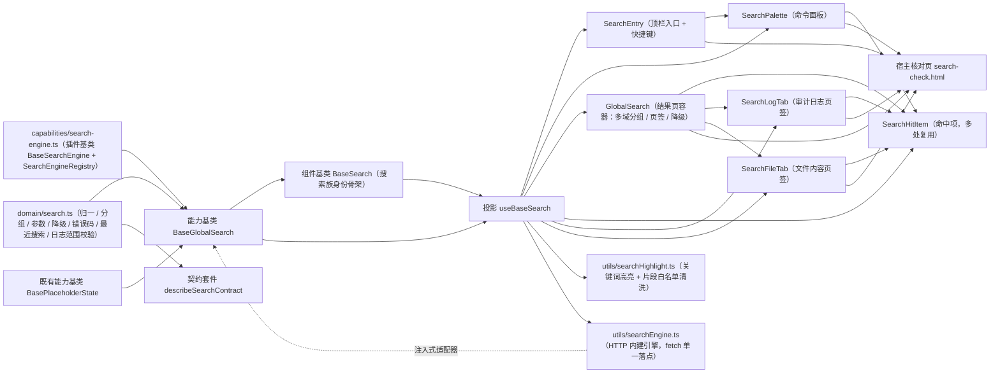

# 01 详细设计 · 全局搜索

> 前端组件库 · 07 展示类 · 07 全局搜索（需求 07-7）· 详细设计

[文档首页](../../../../../../文档首页.md) › [07 展示类](../../07_展示类.md) › [07 全局搜索](../07_展示类_07_全局搜索.md) › 详细设计　|　[← 任务](../07_展示类_07_全局搜索.md)

## 1. 设计目标与范围 <a id="goal"></a>

交付[需求 07-7](../../../../需求/07_需求_展示类.md#r07-7) 与[任务 07](../07_展示类_07_全局搜索.md) 的**全局搜索**：

- **顶栏入口与快捷键**：顶栏常驻搜索入口（输入框 + 快捷键提示，缺省 `Ctrl/Cmd+K` 呼出命令面板，可经 prop 覆盖）。
- **命令面板**：即时建议（防抖）、可检索域提示、最近搜索、键盘导航（↑/↓ 选择、回车打开 / 查看全部、Esc 关闭）、空态。
- **结果页**：多域分组 / 页签（全部 + 各域）、关键词高亮、分页 / 限深（≤ 100 页）、命中项（域 / 标题 / 高亮片段 / 时间 / 跳转回查）。
- **审计日志页签**：独立检索（`log:query`、时间范围必填、单次 ≤ 31 天、跨月多索引归后端）。
- **文件内容页签**：独立检索（`file:query` + 数据范围、命中文件 ID + 上下文高亮、不可检索文件提示 10106）。
- **降级与错误处理**：检索引擎故障返回降级标记（10103）→ 降级提示条 + 替代入口（`fallback` 上抛，宿主装配「前往各域列表」）；10101 / 10102 → 错误态 + 重试；10104 / 10106 / 10107 分档提示。
- **权限与租户过滤**：可检索域 = 目标域既有业务权限并集；**宿主传入域清单（含权限码）+ 能力基类按 `BaseAccess` 二次过滤**（前端双重生效）；租户隔离与动作级数据范围由检索侧强制（前端不感知越权内容）。
- **两轨可替换实现**：前端检索通路经**注入式 `SearchEngineAdapter`**（未注入即占位零请求）；可替换实现走**插件基类 `BaseSearchEngine` + 注册表 `SearchEngineRegistry`**（同 `11_前端合规修复` 的图表引擎 / 实时通道 / AI 流式口径）。
- **对外契约不变**：`GlobalSearch` 的导出名与既有 Props / 事件 / 插槽 / `data-test` 保持 `07_01` 冻结形状，本次只**向后兼容新增**可选 Props / 事件 / 插槽（变更走版本升级）。

### 1.1 口径与依从 <a id="positioning"></a>

- **架构铁律**：关键词 / 域状态、即时建议、分组聚合、降级与错误码、最近搜索、审计与文件检索编排均为**横切功能**，落为**继承链上的能力基类**（`capabilities/global-search.ts`）与**领域纯函数**（`domain/search.ts`）；搜索族身份骨架落**组件基类** `BaseSearch`；具体件只做渲染与交互回传，**不得链外挂接、不得重复实现防抖 / 分组 / 降级分支**。
- **继承链（唯一权威见《[前端基类清单](../../../../../../前端基类清单.md)》）**：`BaseComponent`（组件根）→ `BasePlaceholderState`（占位状态能力基类）→ `BaseGlobalSearch`（**新增**搜索编排能力基类）→ `BaseSearch`（**新增**搜索族组件基类）→ 具体件（经投影 `useBaseSearch` 挂链）。
- **核心框架无关（强制）**：核心包不得依赖 Vue / DOM / 浏览器 API；检索通路以**注入式适配器** `SearchEngineAdapter` 接入，`fetch` 请求、全局快捷键、`localStorage` 归 `ui-ep`（`utils/` 单一落点）。
- **取数与交互分离**：**取数归注入式引擎**（`suggest` / `searchGlobal` / `searchLogs` / `searchFiles`）；件**不自行发请求**；**未注入即占位零请求**（保持 `07_01` 冻结口径）。
- **前端先行、通路注入式**：真实 ES 检索联调归**阶段十八（全文检索）窗口**；本轮冻结 `SearchEngineAdapter` 契约、领域纯函数与降级分支，`ui-ep` 交付 HTTP 内建引擎（可被宿主登记 / 覆盖），换通路不动组件对外契约。
- **权限双重过滤**：可检索域由宿主传入并附权限码；能力基类按 `BaseAccess` 再过滤（`has(perm)`），审计页签叠加 `log:query`、文件页签叠加 `file:query`；租户过滤在检索侧强制（前端只渲染返回内容）。
- **高亮安全**：检索返回的高亮片段含标记（如 `<em>`），渲染前经 `utils/searchHighlight.ts` **白名单清洗**（复用 08 富文本净化口径，防 XSS）；关键词不参与 i18n 翻译。
- **令牌（强制）**：高亮底 / 高亮字、命中悬停底、降级条底 / 边、激活项底走新增 `--bms-search-*` 令牌组；**禁止硬编码色值**。
- **端范围**：**仅 PC**（`frontend/packages/ui-ep`）；移动端本期不落实现，但契约套件 `describeSearchContract` 与投影就位供后续同契约多实现。
- **工时**：本任务 12h；因新增 1 个能力基类 + 1 个组件基类 + 1 个插件基类 / 注册表、1 份领域纯函数、1 套契约套件、1 套投影、2 个插件工具、六件组件（1 迁移 + 5 新增）与宿主核对页，实际上浮在实施记录登记。

## 2. 交付物清单 <a id="deliver"></a>

| # | 交付物 | 落点 |
| --- | --- | --- |
| 1 | 搜索领域纯函数与数据模型（新增） | `core/src/domain/search.ts` |
| 2 | 搜索引擎插件基类与注册表（新增） | `core/src/capabilities/search-engine.ts` |
| 3 | 搜索编排能力基类 `BaseGlobalSearch`（新增） | `core/src/capabilities/global-search.ts` |
| 4 | 搜索族组件基类 `BaseSearch`（新增，父 `BaseGlobalSearch`） | `core/src/capabilities/search.ts` |
| 5 | 能力依赖登记（新增 `global-search` / `search`） | `core/src/capabilities/manifest.ts` |
| 6 | 核心导出面登记 | `core/src/index.ts` |
| 7 | 契约套件 `describeSearchContract`（新增） | `core/testing/search.ts`、`core/testing/index.ts` |
| 8 | 核心用例（领域 + 能力基类） | `core/tests/domain-search.spec.ts`、`core/tests/global-search.spec.ts` |
| 9 | 搜索族投影（新增） | `ui-ep/src/composables/useBaseSearch.ts` |
| 10 | 高亮清洗单一落点（新增） | `ui-ep/src/utils/searchHighlight.ts` |
| 11 | HTTP 内建检索引擎与注册（新增，`fetch` 单一落点） | `ui-ep/src/utils/searchEngine.ts` |
| 12 | 顶栏入口件（新增） | `ui-ep/src/components/search/SearchEntry.vue` |
| 13 | 命令面板件（新增） | `ui-ep/src/components/search/SearchPalette.vue` |
| 14 | 结果页容器（迁移 + 真实实现） | `ui-ep/src/components/search/GlobalSearch.vue`（旧 `components/display/GlobalSearch.vue` 删除） |
| 15 | 命中项件（新增，面板 / 结果页 / 日志 / 文件复用） | `ui-ep/src/components/search/SearchHitItem.vue` |
| 16 | 审计日志页签件（新增） | `ui-ep/src/components/search/SearchLogTab.vue` |
| 17 | 文件内容页签件（新增） | `ui-ep/src/components/search/SearchFileTab.vue` |
| 18 | 导出面登记（路径迁移 + 五件新增 + 投影 / 工具 / 类型） | `ui-ep/src/index.ts` |
| 19 | 设计令牌（新增 `--bms-search-*` 组，亮 / 暗两套） | `apps/desktop/src/styles/tokens.scss` |
| 20 | 用例（投影 + 六件 + 降级 / 权限过滤 / 键盘导航 / 日志范围 / 文件不可检索） | `ui-ep/tests/display-search.spec.ts` |
| 21 | 宿主核对页（`vite build` 不含） | `apps/desktop/search-check.html`、`apps/desktop/src/dev/{searchCheck.ts,SearchCheck.vue}` |
| 22 | 登记回写（基类清单 / 组件设计 / 架构 / 布局 / 需求 / 计划与状态） | 见第 6 节 |



```text
core/src/
├── domain/search.ts                     # 新增：搜索领域纯函数与数据模型
├── capabilities/
│   ├── search-engine.ts                 # 新增：BaseSearchEngine / SearchEngineProvider / SearchEngineRegistry
│   ├── global-search.ts                 # 新增：能力基类 BaseGlobalSearch（父 BasePlaceholderState）
│   ├── search.ts                        # 新增：组件基类 BaseSearch（父 BaseGlobalSearch）
│   └── manifest.ts                      # 追加 global-search / search
└── testing/search.ts                    # 新增：契约套件 describeSearchContract

ui-ep/src/
├── components/
│   ├── search/                          # 新增专题族（全局搜索；同 data/ notice/ chart/ ai/ 先例）
│   │   ├── SearchEntry.vue              # 顶栏入口（新增：输入框 + 快捷键 + 降级提示）
│   │   ├── SearchPalette.vue            # 命令面板（新增：即时建议 / 最近搜索 / 键盘导航）
│   │   ├── GlobalSearch.vue             # 结果页容器（自 display/ 迁入 + 真实实现）
│   │   ├── SearchHitItem.vue            # 命中项（新增：域 / 标题 / 高亮片段 / 时间 / 跳转）
│   │   ├── SearchLogTab.vue             # 审计日志页签（新增：log:query + 时间范围必填 ≤ 31 天）
│   │   └── SearchFileTab.vue            # 文件内容页签（新增：file:query + 不可检索提示）
│   └── display/                         # GlobalSearch 迁出后其余件不动
├── composables/useBaseSearch.ts         # 新增：搜索族投影（另持持久化通道 + 快捷键注册）
└── utils/
    ├── searchHighlight.ts               # 新增：关键词高亮 + 片段白名单清洗（单一落点）
    └── searchEngine.ts                  # 新增：HTTP 内建引擎 + 注册表默认实例
```

## 3. 接口 / 契约与边界 <a id="contract"></a>

### 3.1 核心：`domain/search.ts`（新增纯函数与数据模型） <a id="domain"></a>

```ts
/** 审计日志检索权限码。 */
export const SEARCH_LOG_PERM = 'log:query'
/** 文件内容检索权限码。 */
export const SEARCH_FILE_PERM = 'file:query'
/** 即时建议防抖（毫秒）。 */
export const SEARCH_SUGGEST_DEBOUNCE = 250
/** 即时建议总量上限与各域上限。 */
export const SEARCH_SUGGEST_LIMIT = 8
export const SEARCH_SUGGEST_PER_DOMAIN = 3
/** 结果页页长缺省与上限。 */
export const SEARCH_PAGE_SIZE_DEFAULT = 20
export const SEARCH_PAGE_SIZE_MAX = 100
/** 结果页限深（≤ 100 页）。 */
export const SEARCH_PAGE_DEPTH_MAX = 100
/** 最近搜索上限。 */
export const SEARCH_RECENT_MAX = 8
/** 审计日志单次时间范围上限（天，与 10107 同源）。 */
export const SEARCH_LOG_RANGE_MAX_DAYS = 31
/** 关键词长度上限（码点）。 */
export const SEARCH_KEYWORD_MAX = 200
/** 占位 / 降级 / 空态 / 提示文案。 */
export const SEARCH_PLACEHOLDER_TEXT = '搜索服务未就绪（占位）'
export const SEARCH_DEGRADE_TEXT = '检索服务降级，结果可能不完整'
export const SEARCH_DEGRADE_FALLBACK_TEXT = '前往各域列表'
export const SEARCH_EMPTY_TEXT = '未找到相关内容'
export const SEARCH_LOG_RANGE_REQUIRED_TEXT = '请选择时间范围'
export const SEARCH_LOG_RANGE_EXCEED_TEXT = '单次检索时间范围不得超过 31 天'
export const SEARCH_FILE_UNSEARCHABLE_TEXT = '该文件不可检索'
export const SEARCH_RATE_LIMIT_TEXT = '请求过于频繁，请稍后重试'

/** 已知检索域（`doc_type`，与后端索引域同源）。 */
export const SEARCH_DOC_TYPES: readonly SearchDocType[]
export type SearchDocType = 'user' | 'dept' | 'role' | 'dict' | 'prd' | 'file_meta' | 'help_article' | 'log'
/** 降级原因（不可用 / 超时 / 兜底）。 */
export type SearchDegradeReason = 'unavailable' | 'timeout' | 'fallback'
/** 检索阶段。 */
export type SearchPhase = 'idle' | 'loading' | 'ready' | 'empty' | 'error'

/** 可检索域（`perm` 为该域业务权限码，缺省表示无单独权限要求）。 */
export interface SearchDomain { key: string; label: string; perm?: string }
/** 命中项（字段与后端检索结果对齐；详情回查库）。 */
export interface SearchHit { docType: string; bizId: string; title: string; highlight?: string; updatedAt?: string }
/** 分组结果。 */
export interface SearchGroup { key: string; label: string; items: SearchHit[] }
/** 聚合结果（含降级标记）。 */
export interface SearchResult { groups: SearchGroup[]; total: number; degraded?: boolean; degradeReason?: SearchDegradeReason }
/** 时间范围。 */
export interface SearchRange { start?: string; end?: string }
/** 全局搜索查询。 */
export interface SearchGlobalQuery { keyword: string; types?: readonly string[]; page?: number; pageSize?: number }
/** 审计日志检索查询。 */
export interface SearchLogQuery { keyword: string; logType?: string; start: string; end: string; page?: number; pageSize?: number }
/** 文件内容检索查询。 */
export interface SearchFileQuery { keyword: string; fileType?: string; page?: number; pageSize?: number }
/** 校验结果。 */
export interface SearchValidation { valid: boolean; message?: string }

normalizeSearchDomain(value): SearchDomain | undefined
normalizeSearchDomains(value): SearchDomain[]
normalizeSearchHit(value): SearchHit | undefined
normalizeSearchHits(value): SearchHit[]
normalizeSearchGroup(value): SearchGroup | undefined
normalizeSearchResult(value): SearchResult
filterAccessibleDomains(domains, granted: ReadonlySet<string>): SearchDomain[]
domainLabelOf(domains: readonly SearchDomain[], key: string): string
isBlankKeyword(keyword): boolean
normalizeKeyword(keyword, max?): string
clampSearchPage(page): number
clampSearchPageSize(size): number
buildGlobalParams(query: SearchGlobalQuery): { q: string; types?: string; page: number; size: number }
buildLogParams(query: SearchLogQuery): { q: string; log_type?: string; start_time: string; end_time: string; page: number; size: number }
buildFileParams(query: SearchFileQuery): { q: string; file_type?: string; page: number; size: number }
diffDays(start, end): number
validateLogRange(range: SearchRange, maxDays?): SearchValidation
groupHits(hits: readonly SearchHit[], domains?: readonly SearchDomain[]): SearchGroup[]
topHits(hits: readonly SearchHit[], perDomain?, total?): SearchHit[]
normalizeRecentKeywords(value, max?): string[]
addRecentKeyword(list, keyword, max?): string[]
removeRecentKeyword(list, keyword): string[]
hitKey(hit): string
hitRouteTarget(hit): { docType: string; bizId: string }
parseDegraded(value): boolean
parseDegradeReason(value): SearchDegradeReason | undefined
isSearchErrorCode(value): boolean
resolveSearchErrorText(code): string
```

| 行为 | 口径 |
| --- | --- |
| 域归一 | `normalizeSearchDomain`：`key` 缺失视为脏项剔除；`label` 缺省回落 `key`；`perm` 去空保留 |
| 命中归一 | `normalizeSearchHit`：`bizId` / `title` 缺失视为脏项剔除；`docType` 缺省回落 `unknown`；`highlight` / `updatedAt` 去空保留 |
| 结果归一 | `normalizeSearchResult`：非对象 / 脏组回落 `{ groups: [], total: 0 }`；`total` 缺省取各域命中合计；`degraded` 归一布尔，`degradeReason` 非白名单回落 `undefined` |
| 域权限过滤 | `filterAccessibleDomains`：`perm` 缺省一律可见；有 `perm` 需落在授权集合内（无权限域不展示、不查询） |
| 关键词归一 | `isBlankKeyword` 仅 `trim` 后为空为真；`normalizeKeyword` 去首尾空白并按 `SEARCH_KEYWORD_MAX` 截断（码点） |
| 分页夹取 | `clampSearchPage` 夹取 `1 ~ SEARCH_PAGE_DEPTH_MAX`；`clampSearchPageSize` 夹取 `1 ~ SEARCH_PAGE_SIZE_MAX`（非法回落缺省） |
| 查询参数 | `buildGlobalParams`：`types` 非空才传（逗号拼接）；`buildLogParams`：`log_type` 非空才传、`start_time` / `end_time` 必传；`buildFileParams`：`file_type` 非空才传（与后端 `GET /search/global`、`/search/logs`、`/search/files` 契约同源） |
| 日志范围校验 | `diffDays` 按自然日向上取整（≤ 0 视为非法）；`validateLogRange`：起点 / 终点任一缺失 → 必填提示；跨度 > `maxDays`（缺省 31）→ 超限提示 |
| 分组聚合 | `groupHits`：按 `docType` 分组（域顺序按传入 `domains` 保序，未知域追加末尾）；`topHits`：各域取前 `perDomain` 条并截断到 `total`（缺省 `SEARCH_SUGGEST_PER_DOMAIN` / `SEARCH_SUGGEST_LIMIT`），供命令面板即时建议 |
| 最近搜索 | `normalizeRecentKeywords` 过滤空串、去重、截断上限；`addRecentKeyword` 去重后置顶并截断（缺省 `SEARCH_RECENT_MAX`）；`removeRecentKeyword` 精确移除 |
| 跳转 | `hitKey` 出稳定键 `${docType}:${bizId}`；`hitRouteTarget` 出 `{ docType, bizId }`（路由映射归宿主，命中只含 ID + 高亮，详情回查库） |
| 降级与错误码 | `parseDegraded` / `parseDegradeReason`：`10101` 不可用、`10102` 超时、`10103` 兜底；`isSearchErrorCode` 落在 `10101 ~ 10107`；`resolveSearchErrorText` 出中文（不可用 10101 / 超时 10102 / 降级 10103「结果可能不完整」/ 索引未就绪 10104 / 文件不可检索 10106 / 时间范围超限 10107；其余回落「检索失败」） |
| 纯数据 | 不触 DOM、不请求、不依赖渲染框架与第三方库；同输入同输出 |

### 3.2 核心：`capabilities/search-engine.ts`（新增插件基类与注册表） <a id="engine"></a>

```ts
/** 全局检索请求。 */
export interface SearchGlobalRequest { keyword: string; types?: readonly string[]; page: number; pageSize: number }
/** 审计日志检索请求。 */
export interface SearchLogRequest { keyword: string; logType?: string; start: string; end: string; page: number; pageSize: number }
/** 文件内容检索请求。 */
export interface SearchFileRequest { keyword: string; fileType?: string; page: number; pageSize: number }
/** 检索适配器契约面（方法与 `BaseSearchEngine` 一致）。 */
export interface SearchEngineAdapter {
  suggest?(input: { keyword: string; types?: readonly string[] }): Promise<unknown>
  searchGlobal?(input: SearchGlobalRequest): Promise<unknown>
  searchLogs?(input: SearchLogRequest): Promise<unknown>
  searchFiles?(input: SearchFileRequest): Promise<unknown>
}
/** 检索引擎装载选项。 */
export interface SearchEngineOptions {
  /** 端点前缀（缺省 `/api/v1`）。 */
  endpoint?: string
  /** 请求头（含鉴权，由宿主注入）。 */
  headers?: Record<string, string> | (() => Record<string, string>)
}
/** 检索引擎插件基类（抽象；未覆写的方法返回 `undefined`，即不请求）。 */
export abstract class BaseSearchEngine extends BasePluggable implements SearchEngineAdapter {
  readonly pluginKey: string = 'search-engine'
  readonly pluginName: string = 'base'
  suggest(input: { keyword: string; types?: readonly string[] }): Promise<unknown>
  searchGlobal(input: SearchGlobalRequest): Promise<unknown>
  searchLogs(input: SearchLogRequest): Promise<unknown>
  searchFiles(input: SearchFileRequest): Promise<unknown>
}
/** 检索引擎注册项（工厂创建插件实例）。 */
export class SearchEngineProvider extends BaseProvider {
  readonly key: string
  readonly create: (options: SearchEngineOptions) => BaseSearchEngine | Promise<BaseSearchEngine>
}
/** 检索引擎注册表（统一注册表基座；同键唯一性拒重）。 */
export class SearchEngineRegistry extends BaseProviderRegistry<SearchEngineProvider> {
  readonly pluginKey = 'search-engine-registry'
  readonly pluginName = 'core'
  protected providerKey(provider: SearchEngineProvider): string
}
```

| 行为 | 口径 |
| --- | --- |
| 可替换实现（纵向） | 内建 / 定制检索实现继承 `BaseSearchEngine`（`BasePluggable` 派生），经 `SearchEngineRegistry` 登记接入；**未登记 / 未注入即占位零请求** |
| 契约面兼容 | 注入面类型为 `SearchEngineAdapter`（接口），插件基类实现同形方法；换实现不动调用方契约 |
| 未覆写即降级 | 基类方法返回 `Promise.resolve(undefined)`，能力基类据此不发请求、不改状态 |
| 不含 | ES / 数据库查询与降级实现（后端）、HTTP `fetch` 与端点装配（`ui-ep/src/utils/searchEngine.ts`） |

### 3.3 核心：能力基类 `BaseGlobalSearch`（新增） <a id="base"></a>

```ts
/** 搜索编排能力基类（抽象；父 `BasePlaceholderState`）。 */
export abstract class BaseGlobalSearch extends BasePlaceholderState {
  readonly identifier: string = 'global-search'
  override readonly depends: readonly string[] = ['placeholder-state', 'access', 'persisted-state']
  ready = false
  phase: SearchPhase = 'idle'
  errorMessage = ''
  errorCode: number | undefined
  keyword = ''
  activeDomain = 'all'
  domains: SearchDomain[]
  groups: SearchGroup[]
  total: number
  page: number
  pageSize: number
  suggestions: SearchHit[]
  suggestLoading: boolean
  recentKeywords: string[]
  logItems: SearchHit[]
  logTotal: number
  logPage: number
  logPageSize: number
  logType: string
  logRange: SearchRange
  fileItems: SearchHit[]
  fileTotal: number
  filePage: number
  filePageSize: number
  fileType: string
  engineDegraded: boolean
  degradeReason: SearchDegradeReason | undefined
  engine: SearchEngineAdapter | undefined
  access: BaseAccess | undefined
  persisted: BasePersistedState | undefined

  get empty: boolean
  get error: boolean
  get busy: boolean
  get loading: boolean
  get hasLogPermission: boolean
  get hasFilePermission: boolean
  get accessibleDomains: SearchDomain[]
  get fallbackDomains: SearchDomain[]
  get canSearch: boolean
  get canSearchLogs: boolean
  get canSearchFiles: boolean

  setEngine(engine: SearchEngineAdapter | undefined): void
  setAccess(access: BaseAccess | undefined): void
  attachPersisted(persisted: BasePersistedState): void
  setDomains(domains: readonly SearchDomain[]): void
  setKeyword(keyword: string): void
  setActiveDomain(key: string): void
  setPage(page: number): void
  setPageSize(size: number): void
  setLogType(type: string): void
  setLogRange(range: SearchRange): void
  setFileType(type: string): void
  /** 全局搜索（未就绪 / 未注入引擎不请求）。 */
  search(): Promise<SearchGroup[] | undefined>
  /** 审计日志检索（`log:query` + 范围校验；未就绪 / 未注入不请求）。 */
  searchLogs(): Promise<SearchHit[] | undefined>
  /** 文件内容检索（`file:query`；未就绪 / 未注入不请求）。 */
  searchFiles(): Promise<SearchHit[] | undefined>
  /** 即时建议（防抖由调用方 / 件层按 `SEARCH_SUGGEST_DEBOUNCE` 触发）。 */
  suggest(): Promise<SearchHit[] | undefined>
  clearSuggestions(): void
  addRecentKeyword(keyword: string): void
  removeRecentKeyword(keyword: string): void
  clearRecentKeywords(): void
  /** 把最近搜索写入本地存储（无持久化通道返回 `false`）。 */
  persistRecent(): boolean
  /** 从本地存储恢复最近搜索。 */
  restoreRecent(): boolean
  globalParams(): Record<string, unknown>
  logParams(): Record<string, unknown>
  fileParams(): Record<string, unknown>
}
```

| 行为 | 口径 |
| --- | --- |
| 占位语义 | `ready === false` → `degraded` 为真；`search` / `searchLogs` / `searchFiles` / `suggest` **零请求**（`requestCount` 恒 0），保持 `07_01` 冻结口径（`describePlaceholderDisplayContract` 断言不变即通过） |
| 就绪与引擎 | 三者同时满足才请求：`ready` ∧ 引擎注入 ∧ 对应方法存在；请求前 `requestCount += 1`、`phase = 'loading'` |
| 域权限 | `accessibleDomains` = `filterAccessibleDomains(domains, granted)`（`granted` 由 `access.codes` 得出；未注入 `access` 视为全部可见）；`search` 的 `types` 取 `accessibleDomains` 键（`activeDomain !== 'all'` 时限定单域） |
| 全局检索 | `search`：成功 → `groups` 归一、`total` 取服务端；空 → `phase = 'empty'`；降级标记（`parseDegraded` / `parseDegradeReason`）→ `engineDegraded` / `degradeReason` 置位（**仍展示结果**，不置错误）；失败 → `phase = 'error'` + `errorCode` + `reportError`；**竞态**：以请求序号防旧响应覆盖（同 `BaseDataState` 口径） |
| 即时建议 | `suggest`：仅关键词非空才请求；成功 → `topHits(normalizeSearchHits(res), SEARCH_SUGGEST_PER_DOMAIN, SEARCH_SUGGEST_LIMIT)`；`suggestLoading` 前后切换；失败静默（不阻塞面板，`reportError` 记录）；`clearSuggestions` 清空 |
| 审计日志 | `searchLogs`：`canSearchLogs` = `ready` ∧ (`access` 无或 `has(SEARCH_LOG_PERM)`) ∧ 范围校验通过 ∧ 引擎方法存在；范围不合法 → 不请求、置 `errorMessage` 为 `validateLogRange().message`；成功 → `logItems` / `logTotal` |
| 文件检索 | `searchFiles`：`canSearchFiles` = `ready` ∧ (`access` 无或 `has(SEARCH_FILE_PERM)`) ∧ 引擎方法存在；成功 → `fileItems` / `fileTotal`；命中不可检索文件（10106）由后端标记，前端按 `errorCode` 提示 |
| 分页与筛选 | `setPage` / `setPageSize` / `setActiveDomain` / `setLogType` / `setLogRange` / `setFileType` 均**不自行取数**（上抛由使用方 / 件层决定重查），`*Params()` 提供当前条件 |
| 最近搜索 | `addRecentKeyword` / `removeRecentKeyword` / `clearRecentKeywords` 更新本地数组（领域纯函数去重 / 上限），随即 `persistRecent()`（未挂持久化通道则仅内存） |
| 降级替代入口 | `fallbackDomains` = `accessibleDomains`（供宿主装配「前往各域列表」）；件层降级条上抛 `fallback`，**不自行跳转** |
| 命名避让 | 检索侧降级标记命名 `engineDegraded`（避让占位语义的 `degraded` getter）；加载态命名 `loading`（`phase === 'loading'`，与组件根同义不冲突） |
| 释放 | 随 `BaseComponent` 释放解绑持久化 / 权限订阅（若投影登记），防泄漏 |
| 纯数据 | 不触 DOM、不请求；`engine` 为接口注入，核心不 import 任何浏览器 API |

- 依赖登记：`global-search: ['placeholder-state', 'access', 'persisted-state']`。
- 组件基类 `BaseSearch` 派生其下，承载搜索族身份骨架与展示语义。
- 不含：ES 查询与降级实现（后端）、`fetch` 与端点装配（`ui-ep` 引擎）、路由跳转与宿主顶栏装配（宿主）、详情数据（回查库）。

### 3.4 核心：组件基类 `BaseSearch`（新增） <a id="search-base"></a>

```ts
/** 搜索族组件基类（抽象；父基类 `BaseGlobalSearch`）。 */
export abstract class BaseSearch extends BaseGlobalSearch {
  /** 能力键（组件基类身份）。 */
  override readonly identifier: string = 'search'
  /** 域展示名（未登记回落键名）。 */
  domainLabel(key: string): string
  /** 命中稳定键（`${docType}:${bizId}`）。 */
  hitKey(hit: SearchHit): string
  /** 命中跳转目标（路由映射归宿主）。 */
  hitTarget(hit: SearchHit): { docType: string; bizId: string }
  /** 命中语义色（复用 `domain/status.ts` 五档；审计 / 文件用 `info`，主数据用 `primary`）。 */
  hitSemantic(hit: SearchHit): StatusSemantic
  /** 「全部」页签下的可见分组（按可检索域过滤，且只保留有命中的域）。 */
  visibleGroups(): SearchGroup[]
}
```

| 项 | 口径 |
| --- | --- |
| 链位置 | `BasePlaceholderState → BaseGlobalSearch → BaseSearch → 具体件`（组件基类为搜索族身份骨架，后续移动端同契约多实现） |
| 展示语义 | 域标签 / 命中键 / 跳转目标 / 语义色委托 `domain/search.ts` 与 `domain/status.ts`，基类不重复实现 |
| 不含 | 具体件渲染、路由跳转执行（由使用方执行） |

### 3.5 核心：契约套件 `describeSearchContract`（`@bms/core/testing`） <a id="testing"></a>

| 契约面（结构化接口） | 断言要点 |
| --- | --- |
| `ready` / `degraded` / `requestCount` / `phase` / `keyword` / `domains` / `accessibleDomains` / `groups` / `total` / `page` / `pageSize` / `suggestions` / `recentKeywords` / `logItems` / `fileItems` / `engineDegraded` / `hasLogPermission` / `hasFilePermission` | 占位态降级且零请求（`search` / `suggest` / `searchLogs` / `searchFiles` 后仍为 0）；就绪后不再降级 |
| `setReady` / `setEngine` / `setAccess` / `setDomains` / `setKeyword` / `setActiveDomain` / `setPage` / `setPageSize` / `setLogType` / `setLogRange` / `setFileType` / `search` / `suggest` / `searchLogs` / `searchFiles` / `addRecentKeyword` / `removeRecentKeyword` / `clearRecentKeywords` | 未注入引擎仍零请求；域权限二次过滤（无权限域不展示、`types` 不含）；全局检索分组 / 空态 / 降级标记置位且仍展示结果；即时建议按各域 Top N 截断；审计需 `log:query` 且范围合法（缺范围 / 超 31 天不请求并提示）；文件需 `file:query`；最近搜索去重 / 置顶 / 上限 |

- 契约目标约定：域 `user`（`perm: 'user:query'`）、`log`（`perm: SEARCH_LOG_PERM`）；命中 `u1` / `u2`；引擎为**桩引擎**（记录调用并返回结果 / 降级标记），核心用例与 `ui-ep` 用例共用同一套断言（「同契约多实现」）。
- 复用 `describePlaceholderDisplayContract`（`07_01` 冻结）：真实实现继续跑同一套件，断言不改动即通过。

### 3.6 插件层：投影 `useBaseSearch`（新增） <a id="projection"></a>

```ts
/** `useBaseSearch` 选项。 */
export interface UseBaseSearchOptions {
  ready?: boolean
  keyword?: string
  activeDomain?: string
  domains?: SearchDomain[]
  groups?: SearchGroup[]
  page?: number
  pageSize?: number
  recentKeywords?: string[]
  engine?: SearchEngineAdapter
  access?: BaseAccess
  storage?: PersistedStorageOption
  storageKey?: string
}
/** `useBaseSearch` 返回面（与核心方法一一对应的响应式面 + 快捷键注册）。 */
export interface UseBaseSearchResult {
  search: BaseSearch
  ready: Ref<boolean>
  degraded: Ref<boolean>
  requestCount: Ref<number>
  phase: Ref<SearchPhase>
  errorMessage: Ref<string>
  keyword: Ref<string>
  activeDomain: Ref<string>
  accessibleDomains: ComputedRef<SearchDomain[]>
  groups: Ref<SearchGroup[]>
  total: Ref<number>
  page: Ref<number>
  pageSize: Ref<number>
  suggestions: Ref<SearchHit[]>
  recentKeywords: Ref<string[]>
  engineDegraded: Ref<boolean>
  degradeReason: Ref<SearchDegradeReason | undefined>
  setReady(value: boolean): void
  setEngine(engine: SearchEngineAdapter | undefined): void
  setAccess(access: BaseAccess | undefined): void
  setDomains(domains: readonly SearchDomain[]): void
  setKeyword(keyword: string): void
  setActiveDomain(key: string): void
  setPage(page: number): void
  setPageSize(size: number): void
  search(): Promise<SearchGroup[] | undefined>
  suggest(): Promise<SearchHit[] | undefined>
  clearSuggestions(): void
  addRecentKeyword(keyword: string): void
  removeRecentKeyword(keyword: string): void
  clearRecentKeywords(): void
  /** 注册全局快捷键（`mod+k` / 自定义），返回取消函数。 */
  registerShortcut(handler: () => void, shortcut?: string): () => void
}
```

- 薄适配（核心实例 ↔ Vue 响应式），不含判定逻辑；`onLifecycle('update')` → `sync()`；`onScopeDispose` 解除订阅并 `search.dispose()`。
- **最近搜索持久化**：内部经 `useBasePersistedState`（默认 `local`，键 `bms_search_recent`）；`attachPersisted` 挂到能力基类，恢复 / 保存走 `BasePersistedState`（**不在件层直用 `localStorage`**）。
- **快捷键**：`registerShortcut` 经 `ui-ep/src/utils/keyboard.ts` 的 `onGlobalKeydown` 全局订阅（浏览器 API 单一落点），按「`mod+k`」（Ctrl / Cmd + K，可传 `'alt+k'` 等）匹配并回调；无 `window` 能力时静默降级。

### 3.7 插件层：工具（新增） <a id="utils"></a>

```ts
// ui-ep/src/utils/searchHighlight.ts
/** 转义纯文本（`& < > "`）。 */
export function escapeSearchText(text: string): string
/** 关键词高亮（先转义关键词与文本，再以 `<em>` 包裹命中；空关键词原样转义返回）。 */
export function highlightKeyword(text: string, keyword: string): string
/** 清洗检索返回的高亮片段（复用 `sanitizeHtml` 白名单，仅保留 `<em>` 等安全标签）。 */
export function sanitizeHighlight(html: string): string
/** 命中「片段优先、其次标题」的高亮 HTML（片段缺失回落标题）。 */
export function highlightHit(hit: SearchHit, keyword: string): { title: string; summary: string }

// ui-ep/src/utils/searchEngine.ts
/** 链路内默认检索引擎注册表实例（宿主可登记定制实现或覆盖内建键）。 */
export const searchEngineRegistry: SearchEngineRegistry
/** 登记检索引擎实现。 */
export function registerSearchEngine(key: string, create: (options: SearchEngineOptions) => BaseSearchEngine | Promise<BaseSearchEngine>): void
/** 创建 HTTP 内建检索引擎（`fetch` 单一落点；未覆盖的方法不请求）。 */
export function createHttpSearchEngine(options?: SearchEngineOptions): BaseSearchEngine
```

| 行为 | 口径 |
| --- | --- |
| 高亮 | `highlightKeyword`：关键词先 `escapeSearchText`、文本先转义，再按正则替换包裹 `<em>`（正则特殊字符转义），**防注入**；`sanitizeHighlight` 对后端片段走既有 `sanitizeHtml` 白名单（`em` 已列白名单） |
| HTTP 引擎 | `createHttpSearchEngine`：`fetch(`${endpoint}/search/global|logs|files`, { method: 'GET', headers, signal })`；按查询参数拼接；`suggest` 复用 `/search/global` 取各域 Top N；`fetch` 不可用（测试 / SSR）→ 返回 `undefined` 降级（不抛错） |
| 落点 | **浏览器 API（`fetch` / `window`）只出现在本两工具与投影 / 件层**，核心与投影判定逻辑不触 DOM |

### 3.8 插件层：件族（`ui-ep/src/components/search/`） <a id="components"></a>

件族落 `ui-ep/src/components/search/`（同 `data/`、`notice/`、`chart/`、`ai/` 先例）；`GlobalSearch` 自 `components/display/` 迁入并删除旧路径，**对外导出名、既有 Props / 事件 / 插槽 / `data-test` 不变**；新增 `SearchEntry` / `SearchPalette` / `SearchHitItem` / `SearchLogTab` / `SearchFileTab`。

#### 3.8.1 `SearchEntry.vue`（新增 · 顶栏入口） <a id="c-entry"></a>

| 面 | 内容 |
| --- | --- |
| Props | `ready`（缺省 `false`）/ `modelValue` / `placeholder` / `shortcut`（缺省 `mod+k`）/ `domains`（可检索域标签）/ `degradeText`（缺省 `SEARCH_PLACEHOLDER_TEXT`） |
| 事件 | `update:modelValue` / `search`（keyword）/ `open-panel`（keyword）/ `focus` / `fallback` |
| 插槽 | `degrade` / `prefix` / `suffix` |
| `data-test` | `search-entry` / `search-entry-input` / `search-entry-kbd` / `search-entry-degrade` / `search-entry-domains` |

- 常驻入口：输入框 + 快捷键提示（`Ctrl/Cmd K`）；输入回车 `search`、聚焦 / 快捷键 `open-panel`。
- 快捷键经 `useBaseSearch().registerShortcut` 注册（`utils/keyboard.ts` 单一落点），聚焦输入框并上抛 `open-panel`；`shortcut` 可覆盖以避让冲突。
- 占位：`ready !== true` → 降级提示、不发请求。

#### 3.8.2 `SearchPalette.vue`（新增 · 命令面板） <a id="c-palette"></a>

| 面 | 内容 |
| --- | --- |
| Props | `modelValue`（显隐）/ `keyword` / `suggestions`（`SearchHit[]`）/ `recentKeywords` / `domains` / `loading` / `ready` / `emptyText` / `degradeText` |
| 事件 | `update:modelValue` / `update:keyword` / `select`（hit）/ `search`（keyword）/ `recent-select`（keyword）/ `recent-clear` / `domain-select`（key） |
| 插槽 | `default`（整体替换）/ `suggestions`（作用域 `{ suggestions }`）/ `recent` / `empty` / `footer` |
| `data-test` | `search-palette` / `search-palette-keyword` / `palette-section-suggest` / `palette-suggestion-{docType}-{bizId}` / `palette-empty` / `palette-recent` / `palette-recent-{index}` / `palette-clear-recent` / `palette-domains` / `palette-domain-{key}` / `palette-view-all` |

- **键盘导航**：↑/↓ 移动激活项（越过边界环回）、回车打开激活命中或提交搜索、Esc 关闭面板（`update:modelValue false`）；`mousedown.prevent` 防失焦。
- 即时建议区（防抖由件层按 `SEARCH_SUGGEST_DEBOUNCE` 调度 `suggest`）+ 最近搜索标签 + 「查看全部结果」；空态复用 `03_02` 口径。
- 命中项渲染复用 `SearchHitItem`（`compact`）。

#### 3.8.3 `GlobalSearch.vue`（迁移 + 真实实现 · 结果页容器） <a id="c-global"></a>

**对外导出名、既有 Props / 事件 / 插槽 / `data-test` 不变**，旧路径 `components/display/GlobalSearch.vue` 删除。

| 面 | 内容 |
| --- | --- |
| 数据面（既有，保持） | `ready`（缺省 `false`）/ `modelValue` / `domains` / `groups` / `loading` / `engineDegraded` / `degradeText` |
| 数据面（新增，全部可选） | `keyword` / `activeDomain` / `total` / `page` / `pageSize` / `error` / `errorText` / `suggestions` / `recentKeywords` / `engine` / `access` / `showTabs` / `showPagination` / `showFallback` / `emptyText` |
| 事件（既有，保持） | `update:modelValue` / `search`（keyword）/ `open`（hit）/ `retry` |
| 事件（新增） | `update:activeDomain` / `update:page` / `update:pageSize` / `fallback`（domains）/ `suggest`（keyword）/ `open-log`（hit）/ `open-file`（hit）/ `error` |
| 插槽（既有，保持） | `degrade` / `empty` |
| 插槽（新增） | `header` / `tabs` / `hit`（作用域 `{ hit }`）/ `log` / `file` / `error` / `footer` |
| `data-test`（既有，保持） | `placeholder` / `search-bar` / `keyword` / `search` / `domains` / `domain-{key}` / `engine-degraded` / `retry` / `groups` / `group-{key}` / `hit-{docType}-{bizId}` / `empty` |
| `data-test`（新增） | `global-search` / `search-tabs` / `search-tab-{key}` / `skeleton` / `error` / `fallback` / `log-tab` / `file-tab` / `pagination` |

- **多域分组 / 页签**：「全部」聚合 + 各域页签 + 「审计日志」（`log:query`）/「文件」（`file:query`）页签；「全部」下按域分组 Top N + 各域「更多」。
- **降级**：`engineDegraded` 或降级标记 → 顶部降级条（既有 `engine-degraded` / `retry` 元素保持）+「前往各域列表」`fallback` 上抛（`showFallback` 控制）。
- **占位语义**：`ready !== true` → 降级、不发请求（保持 `07_01` 冻结口径）。
- **既有冻结断言**：`data-test="placeholder"` 文案含「搜索服务未就绪」、`domain-user`、`engine-degraded`、`retry`、`hit-user-1` 点击上抛 `open`、`keyword` 输入上抛 `update:modelValue`、`search` 点击上抛 `search`——**全部保持**。
- 审计 / 文件页签分别内聚 `SearchLogTab` / `SearchFileTab`。

#### 3.8.4 `SearchHitItem.vue`（新增 · 命中项） <a id="c-hit"></a>

| 面 | 内容 |
| --- | --- |
| Props | `hit`（`SearchHit`，必填）/ `keyword` / `compact` / `showDomain`（缺省 `true`）/ `showTime`（缺省 `true`）/ `translator`（域文案翻译注入，未注入用内置） |
| 事件 | `open`（hit） |
| 插槽 | `default`（整体替换）/ `icon` / `actions` / `meta` |
| `data-test` | `search-hit` / `hit-{docType}-{bizId}` / `hit-domain` / `hit-title` / `hit-summary` / `hit-time` |

- 域标识 + 标题（高亮）+ 高亮摘要（1-2 行省略）+ 时间（`domain/format.ts` 相对时间，悬浮绝对时间）。
- 高亮经 `utils/searchHighlight.ts`（`highlightTitle` / `highlightSummary`）白名单清洗后以 `v-html` 渲染（**片段含标记，已清洗**）。
- 点击上抛 `open`（跳转由使用方按 `hitTarget` 路由，详情回查库）。

#### 3.8.5 `SearchLogTab.vue`（新增 · 审计日志页签） <a id="c-log"></a>

| 面 | 内容 |
| --- | --- |
| Props | `ready`（缺省 `false`）/ `items`（`SearchHit[]`）/ `total` / `page` / `pageSize` / `loading` / `error` / `errorText` / `logType` / `timeRange`（`SearchRange`）/ `maxRangeDays`（缺省 31）/ `degradeText` |
| 事件 | `update:logType` / `update:timeRange` / `update:page` / `search` / `retry` / `open`（hit） |
| 插槽 | `filter` / `hits` / `empty` / `error` / `footer` |
| `data-test` | `search-log-tab` / `log-type` / `log-range` / `log-search` / `log-range-error` / `log-hits` / `log-hit-{docType}-{bizId}` / `log-empty` / `log-error` / `log-pagination` |

- 时间范围必填、单次 ≤ `maxRangeDays`；不合法时内联提示（`SEARCH_LOG_RANGE_REQUIRED_TEXT` / `SEARCH_LOG_RANGE_EXCEED_TEXT`）且不触发 `search`。
- 仅 `log:query` 时由 `GlobalSearch` 展示本页签；命中项复用 `SearchHitItem`。

#### 3.8.6 `SearchFileTab.vue`（新增 · 文件内容页签） <a id="c-file"></a>

| 面 | 内容 |
| --- | --- |
| Props | `ready`（缺省 `false`）/ `items`（`SearchHit[]`）/ `total` / `page` / `pageSize` / `loading` / `error` / `errorText` / `fileType` / `degradeText` |
| 事件 | `update:fileType` / `update:page` / `search` / `retry` / `open`（hit） |
| 插槽 | `filter` / `hits` / `empty` / `error` / `footer` |
| `data-test` | `search-file-tab` / `file-type` / `file-search` / `file-hits` / `file-hit-{docType}-{bizId}` / `file-unsearchable` / `file-empty` / `file-error` / `file-pagination` |

- 仅 `file:query` 时由 `GlobalSearch` 展示本页签；命中文件 ID + 上下文高亮；不可检索文件（10106）展示 `SEARCH_FILE_UNSEARCHABLE_TEXT`；命中项复用 `SearchHitItem`。

### 3.9 导出面 <a id="exports"></a>

- `ui-ep/src/index.ts`：`GlobalSearch` 导出路径由 `./components/display/GlobalSearch.vue` 改为 `./components/search/GlobalSearch.vue`（`SearchDomain` / `SearchGroup` / `SearchHit` 名字与形状保持，改由核心 `domain/search` 统一导出）；新增 `SearchEntry` / `SearchPalette` / `SearchHitItem` / `SearchLogTab` / `SearchFileTab` 与各自类型导出；新增 `useBaseSearch` 与 `searchHighlight` / `searchEngine` 相关导出。
- `core/src/index.ts`：新增 `domain/search`（常量 / 类型 / 纯函数）、`capabilities/search-engine`（`BaseSearchEngine` / `SearchEngineProvider` / `SearchEngineRegistry` / `SearchEngineAdapter` / `SearchEngineOptions` 及请求类型）、`capabilities/global-search`（`BaseGlobalSearch`）、`capabilities/search`（`BaseSearch`）导出。
- `core/testing/index.ts`：新增 `describeSearchContract` 导出。
- 机器护栏对账：`ui-ep/tests/guard-component-inheritance.spec.ts`（六件均实质挂链）、`core/tests/guard-manifest.spec.ts`（`global-search` / `search` 新增与清单 / 代码一致）、`guard-jsdoc.spec.ts`（新增导出与类成员 JSDoc 齐备）、`guard-core-framework-agnostic.spec.ts`（核心零框架 / 浏览器 API）、`ui-ep/tests/guard-single-source.spec.ts`（组件不直引 `dompurify` / 不直用 `document.addEventListener` / `localStorage`）、`ui-ep/tests/guard-tokens.spec.ts`（无硬编码色值）。

### 3.10 设计令牌（新增） <a id="tokens"></a>

`apps/desktop/src/styles/tokens.scss` 新增（亮色 `:root` 与暗色 `[data-theme='dark']` 两套）：

```scss
:root {
  --bms-search-highlight-bg: #fff8c5;          // 关键词高亮底
  --bms-search-highlight-color: #9a6700;       // 关键词高亮字
  --bms-search-hit-hover-bg: #f5f7fa;          // 命中项悬停底
  --bms-search-active-bg: #eef4ff;             // 面板激活项底
  --bms-search-panel-bg: var(--bms-color-bg-container);  // 面板底
  --bms-search-degrade-bg: #fff8c5;            // 降级条底
  --bms-search-degrade-border: #d4a72c;        // 降级条边
}
```

- 暗色仅覆盖对比度相关项；**令牌只增不改**，既有令牌不变；登记《[布局设计 · 设计令牌](../../../../../../设计/布局设计/02_布局设计_设计令牌.html)》。

### 3.11 宿主核对页 <a id="check"></a>

`apps/desktop/search-check.html` + `src/dev/{searchCheck.ts,SearchCheck.vue}`（`vite build` 只构建 `index.html`，核对页不进产物）。自检项 13 项：

1. 占位降级与就绪切换（六件 `ready` 驱动、占位零请求）；
2. 顶栏入口与快捷键（`mod+k` 呼出命令面板、可覆盖 `shortcut`）；
3. 命令面板即时建议（防抖、各域 Top N）与键盘导航（↑/↓ 环回、回车打开、Esc 关闭）；
4. 最近搜索（去重 / 置顶 / 上限 / 清除，本地持久化恢复）；
5. 结果页多域分组与页签（全部 / 各域）与「各域更多」；
6. 关键词高亮与片段白名单清洗（`<script>` 被剔除，`<em>` 保留）；
7. 命中项展示（域 / 标题 / 片段 / 时间 / 跳转回查）与点击上抛；
8. 分页与限深（≤ 100 页）上抛；
9. 降级标记（10103）降级条 + 替代入口 `fallback` 上抛与重试；
10. 错误态（10101 / 10102）内联错误 + 重试；
11. 审计日志页签（`log:query` 可见、时间范围必填、> 31 天拒绝、跨月提示）；
12. 文件内容页签（`file:query` 可见、不可检索文件 10106 提示）；
13. 域权限二次过滤（无权限域不展示、不进 `types`）。

以 chromium headless `--dump-dom` 核验全部自检项；异步与防抖相关项以 `waitFor` 轮询等待到位后再断言。

## 4. 失败分支与边界 <a id="edge"></a>

| 边界 / 失败场景 | 处置 |
| --- | --- |
| 数据通路未就绪（`ready` 为假） | 占位：降级 + 禁用 + 零请求（保持 `07_01` 冻结口径） |
| 检索引擎未注入 / 未登记 | 不请求；结果区渲染传入数据（空则空态）；即时建议为空 |
| 无权限域 | 域不展示、不进 `types`（`BaseAccess` 二次过滤）；越权内容由检索侧强制过滤，前端不感知 |
| 无 `log:query` / `file:query` | 对应页签不展示、不查询 |
| 空关键词 | 不请求；即时建议清空；结果区空态 |
| 关键词超长 | `normalizeKeyword` 按 `SEARCH_KEYWORD_MAX` 截断（码点） |
| 即时建议失败 | 静默（不阻塞面板，`reportError` 记录） |
| 结果页失败 | 内联错误 + 重试（`retry`）；保留既有数据不闪空 |
| 检索引擎降级（10103） | 降级提示条 + 替代入口（`fallback` 上抛），**结果仍展示**、不阻塞页面 |
| 引擎不可用（10101）/ 超时（10102） | 错误态 + 重试；限流错误码 → 稍后重试提示（`SEARCH_RATE_LIMIT_TEXT`） |
| 目标索引未就绪（10104） | 按错误码提示（i18n `error.10104`） |
| 超过限深（> 100 页） | `clampSearchPage` 夹取到上限并提示 |
| 审计时间范围缺失 | 不请求，内联必填提示（`SEARCH_LOG_RANGE_REQUIRED_TEXT`） |
| 审计时间范围 > 31 天（10107） | 不请求，内联超限提示（`SEARCH_LOG_RANGE_EXCEED_TEXT`） |
| 跨月 / 多索引 | 归后端路由（前端只传 `start_time` / `end_time`） |
| 文件不可检索（10106） | 展示不可检索提示，不跳转 |
| 命中缺 `bizId` / `title` | 归一剔除脏项（不渲染） |
| 跳转目标路由无权限 | 使用方按目标路由权限显隐；无权限不渲染入口 / 不上抛 |
| 高亮片段含脚本 / 事件属性 | `sanitizeHighlight` 白名单清洗（防 XSS）；关键词不翻译 |
| 最近搜索超上限 | 去重 + 截断到 `SEARCH_RECENT_MAX` |
| 本地存储受限 / 缺失 | `BasePersistedState` 静默降级（仅内存，不抛错） |
| 快捷键冲突 | 缺省 `mod+k` 可经 `shortcut` 覆盖；无 `window` 能力时不注册（不抛错） |
| 页面卸载 / 释放 | 解绑快捷键与持久化订阅（防泄漏） |
| 移动端 | 本期不落实现；契约套件 `describeSearchContract` 与投影就位供同契约多实现 |

## 5. 测试设计与验收映射 <a id="test"></a>

| 验收点（需求 07-7 / 任务 07） | 用例 |
| --- | --- |
| 域 / 命中 / 结果归一、域权限过滤、关键词归一与截断、分页夹取、查询参数、日志范围校验、分组与 Top N、最近搜索、降级与错误码、跳转目标 | `core/tests/domain-search.spec.ts` |
| 能力基类：占位零请求、引擎注入与就绪、全局检索分组 / 空态 / 降级、即时建议截断、审计 `log:query` 与范围校验、文件 `file:query`、域二次过滤、最近搜索持久化、竞态、释放 | `core/tests/global-search.spec.ts` + `describeSearchContract` |
| 契约套件（同契约多实现） | `describeSearchContract`（核心 + `ui-ep` 适配） |
| 投影薄适配（响应式面与同步、最近搜索持久化、快捷键注册与解绑、销毁） | `ui-ep/tests/display-search.spec.ts` |
| 六件真实实现：占位降级、顶栏入口与快捷键、命令面板即时建议 / 最近搜索 / 键盘导航、结果页多域分组 / 页签 / 分页 / 降级 / 重试、命中项高亮与清洗、审计页签范围校验、文件页签不可检索提示 | 同上 |
| 高亮与清洗（`<script>` 剔除、`<em>` 保留、关键词转义）、HTTP 引擎（桩 `fetch`：成功 / 降级 / 失败 / 不可用） | 同上 |
| 能力登记对账（`global-search` / `search` 新增 ↔ manifest ↔ 基类清单） | `core/tests/guard-manifest.spec.ts` |
| 注释齐备、核心框架无关、组件挂链、单一落点、令牌消费 | `guard-jsdoc.spec.ts`、`guard-core-framework-agnostic.spec.ts`、`guard-component-inheritance.spec.ts`、`guard-single-source.spec.ts`、`guard-tokens.spec.ts` |
| 开发态核对页 13 项自检 | chromium headless `--dump-dom` |
| `vue-tsc`、ESLint、Vitest 全通过 | 根 `pnpm run check` + 宿主 `vue-tsc -b` / `lint` / `test:cov` / `build` / `budget` |
| 文档链接与基座校验 | `check-links.py`、`check-base.py`、`check-status.py --stage 04_前端组件库` |

- 既有 `ui-ep/tests/display-placeholder.spec.ts`（`07_01` 冻结契约）**不得改动**，须原样通过（`GlobalSearch` 迁移路径与真实实现后，占位降级、`domain-user`、`engine-degraded`、`retry`、`hit-user-1` 点击、`keyword` 输入、`search` 点击断言保持）。
- Kiwi 用例 1 条（一任务一条，编号于测试步登记后回填；分类「平台骨架」、优先级 P2、状态 `CONFIRMED`、标签「自动化」）。

## 6. 登记落点 <a id="register"></a>

| 内容 | 落点 |
| --- | --- |
| 新增能力基类 `BaseGlobalSearch`（能力键 `global-search`，父 `BasePlaceholderState`，依赖 `placeholder-state` / `access` / `persisted-state`） | 《[前端基类清单](../../../../../../前端基类清单.md)》§2.1 全量基类登记表插入行（组件侧 · 能力基类，「已交付」）+ §2 继承链总览 + §5.2 能力基类表 + `capabilities/manifest.ts` |
| 新增组件基类 `BaseSearch`（能力键 `search`，父 `BaseGlobalSearch`，搜索族） | 同上 §2.1（组件侧 · 组件基类）+ §5.3 组件基类表 + `capabilities/manifest.ts`（`search: ['global-search']`） |
| 新增插件基类 / 注册项 / 注册表 `BaseSearchEngine` / `SearchEngineProvider` / `SearchEngineRegistry` | 同上 §4「插件基类族与注册表」表（可替换实现 / 各域注册表） |
| 领域纯函数与数据模型 `domain/search.ts` | 同上 §9「核心」（`domain/` 领域纯函数） |
| 契约套件 `describeSearchContract` | 同上 §9（`core/testing/`） |
| 投影 `useBaseSearch`、件族 `components/search/`（六件）、工具 `utils/searchHighlight.ts` / `searchEngine.ts` | 同上 §9「PC 插件」（组件目录与 `composables/`、`utils/` 清单） |
| 设计令牌 `--bms-search-*` 组 | 《[布局设计 · 设计令牌](../../../../../../设计/布局设计/02_布局设计_设计令牌.html)》（登记项）；`apps/desktop/src/styles/tokens.scss` |
| **组件设计口径回写** | 《[组件设计 · 全局搜索](../../../../../../设计/组件设计/07_展示类/07_组件设计_全局搜索/07_组件设计_全局搜索.md)》§10.2 三项上游变更随本任务落定标注（前端搜索交互与多域 / 页签 / 降级、前端查询接口与降级口径、顶栏搜索入口形态）；如实施中发现契约偏差，先回写本设计再改码（见第 8 节） |
| 架构设计同步 | 《[架构设计 · 全文检索](../../../../../../设计/架构设计/25_架构设计_子系统_全文检索.md)》§4 / §6：可检索域按权限并集、结果只返 ID + 高亮、白名单清洗、降级标记与替代入口的前端落点（引用本节点） |
| 任务 / 父任务 / 域任务 / 计划与状态 | [任务](../07_展示类_07_全局搜索.md)、[父任务](../../07_展示类.md)、[计划](../../../../计划/01_计划_前端组件库.md)（`07_07` 由「搁置（阶段十八窗口）」改「阶段四窗口内推进（前端先行、通路注入式）」并入 §2；§1 域 07 与工时台账同步；甘特移除本节点） |
| 需求文档 | 不承载进度（状态只在任务与计划两处一致）；遗留归口写在实施 / 测试记录与计划 |

## 7. 边界与开放项 <a id="open"></a>

- **不在本期**：真实 ES 检索联调（`suggest` / `searchGlobal` / `searchLogs` / `searchFiles` 经 `SearchEngineAdapter` 注入，归口阶段十八全文检索窗口）；检索引擎 / 索引同步 / 重建（架构）；域内列表页（用户 / 部门 / 字典等）；详情数据（命中只含 ID + 高亮，一律回查库）；语义搜索 / 文件问答（向量检索，归 `08_10` AI 助手）；移动端实现（契约套件与投影就位）。
- **协同契约**：`GET /search/global`（`q` / `types` / `page` / `size`）、`GET /search/logs`（`log_type` / `q` / `start_time` / `end_time` / `page` / `size`）、`GET /search/files`（`q` / `file_type` / `page` / `size`）；错误码 `10101` ~ `10107`（与《架构设计 · 接口与集成》错误码分段一致）；分页限深 ≤ 100 页。
- **与 `07_01` 协同**：件名与对外契约由 `07_01` 冻结，本次只向后兼容新增；`describePlaceholderDisplayContract` 由真实实现继续复用。
- **与 `07_05` / `07_04` 协同**：状态 / 空态 / 加载复用 `03_02` 与 `07_05` 口径；语义色复用 `domain/status.ts`；时间复用 `domain/format.ts`；交互上抛与分页口径与 `07_05` 查询筛选区一致。
- **与 `11_前端合规修复` 协同**：可替换实现走插件基类 + 注册表（`BaseSearchEngine` / `SearchEngineRegistry`）；浏览器能力走 `utils/` 单一落点（`keyboard` / `searchHighlight` / `searchEngine`）；色值一律令牌（`--bms-search-*`）。
- **新增能力扩展位**：新增可检索域 = `SEARCH_DOC_TYPES` + 域映射一条，不改容器；新增检索实现 = 继承 `BaseSearchEngine` 并登记 / 注入，不改组件契约。
- **Kiwi 用例编号**：本任务平台登记后回填代码 `// kiwi_id: <编号>` 与实施 / 测试记录。
- **工时**：名义 12h；因新增 2 个基类 + 1 个插件基类 / 注册表、1 份领域纯函数、1 套契约套件、1 套投影、2 个工具、六件组件（1 迁移 + 5 新增）与 13 项自检核对页，实际上浮在实施记录登记。

## 8. 决策记录 <a id="decision"></a>

| # | 决策项 | 结论 |
| --- | --- | --- |
| 1 | 实施窗口 | 现在推进（前端先行 + 通路注入式；真实 ES 检索联调归口阶段十八窗口） |
| 2 | 基类粒度 | 能力基类 `BaseGlobalSearch`（父 `BasePlaceholderState`）+ 组件基类 `BaseSearch`（父 `BaseGlobalSearch`）两层 |
| 3 | 件清单 | 六件：`GlobalSearch`（迁移 + 真实：结果页容器）、`SearchEntry`（新增：顶栏入口 + 快捷键）、`SearchPalette`（新增：命令面板）、`SearchHitItem`（新增：命中项）、`SearchLogTab`（新增：审计日志页签）、`SearchFileTab`（新增：文件内容页签） |
| 4 | 审计日志承载 | 独立 `SearchLogTab` 件（`log:query` 可见） |
| 5 | 文件内容范围 | 本期一并实现独立 `SearchFileTab` 件（`file:query` + 不可检索提示 10106） |
| 6 | 可替换实现 | 新增插件基类 `BaseSearchEngine` + 注册项 `SearchEngineProvider` + 注册表 `SearchEngineRegistry`；注入面类型 `SearchEngineAdapter` |
| 7 | 高亮清洗 | 新增 `utils/searchHighlight.ts` 单一落点（关键词包裹 `<em>` + 片段 `sanitizeHtml` 白名单清洗） |
| 8 | 最近搜索 | 经 `BasePersistedState` 通道（投影注入本地存储，键 `bms_search_recent`）+ 领域纯函数去重 / 上限 8 |
| 9 | 降级替代入口 | 降级条 + `fallback` 上抛（携带可检索域，宿主装配「前往各域列表」） |
| 10 | 域权限过滤 | 宿主传入域清单（含权限码）+ 能力基类按 `BaseAccess` 二次过滤 |
| 11 | 快捷键 | 缺省 `mod+k`（Ctrl/Cmd+K）可经 `shortcut` 覆盖；经 `utils/keyboard.ts` 全局订阅 |
| 12 | 审计时间范围 | 必填、单次 ≤ 31 天（`SEARCH_LOG_RANGE_MAX_DAYS`）；跨月多索引归后端 |
| 13 | 设计令牌 | 新增 `--bms-search-*` 组（亮 / 暗两套，只增不改） |
| 14 | 契约套件 | 新增 `describeSearchContract`；继续复用 `describePlaceholderDisplayContract` |
| 15 | 核对页与移动端 | 新建 `search-check.html`（13 项自检）；仅 PC，移动端不落实现、契约套件与投影就位 |
| 16 | Kiwi 用例 | 登记 1 条（分类「平台骨架」/ P2 / `CONFIRMED` / 标签「自动化」），编号测试步回填 |

## 9. 参考文档 <a id="ref"></a>

- [需求 07-7](../../../../需求/07_需求_展示类.md#r07-7)、[任务 07](../07_展示类_07_全局搜索.md)、[父任务](../../07_展示类.md)、[计划](../../../../计划/01_计划_前端组件库.md)
- 《组件设计》[07 全局搜索](../../../../../../设计/组件设计/07_展示类/07_组件设计_全局搜索/07_组件设计_全局搜索.md)（含[可交互原型](../../../../../../设计/组件设计/07_展示类/07_组件设计_全局搜索/07_原型设计_全局搜索.html)，原型即验收基准）、[05 异常与空状态](../../../../../../设计/组件设计/07_展示类/05_组件设计_异常与空状态/05_组件设计_异常与空状态.md)、[03 状态标签与描述列表](../../../../../../设计/组件设计/07_展示类/03_组件设计_状态标签与描述列表/03_组件设计_状态标签与描述列表.md)
- 《架构设计》[全文检索](../../../../../../设计/架构设计/25_架构设计_子系统_全文检索.md)、[前端组件体系](../../../../../../设计/架构设计/05_架构设计_前端组件体系.md)、[扩展点与插件化](../../../../../../设计/架构设计/10_架构设计_子系统_扩展点与插件化.md)、[接口与集成](../../../../../../设计/架构设计/09_架构设计_接口与集成.md)（错误码分段）
- 《概要设计》[全文检索](../../../../../../设计/概要设计/33_概要设计_全文检索.md)
- 《布局设计》[导航](../../../../../../设计/布局设计/05_布局设计_导航.html)（顶栏搜索入口）、[移动端细化](../../../../../../设计/布局设计/16_布局设计_移动端细化.html)（移动端搜索）、[设计令牌](../../../../../../设计/布局设计/02_布局设计_设计令牌.html)
- [《前端基类清单》](../../../../../../前端基类清单.md)、《[前端开发规范](../../../../../../规范/前端开发规范.md)》、《[命名规范](../../../../../../规范/命名规范.md)》、《[文档生成规范](../../../../../../规范/文档生成规范.md)》
- [07_01 占位版交付](../../07_展示类_01_占位版交付/07_展示类_01_占位版交付.md)（冻结对外契约与占位语义）、[07_04 通知与消息](../../07_展示类_04_通知与消息/07_展示类_04_通知与消息.md)（能力基类 + 领域 + 契约套件 + 投影 + 核对页做法）、[07_05 数据呈现](../../07_展示类_05_数据呈现/07_展示类_05_数据呈现.md)（通路注入式、语义色与分页口径）、[08_10 AI 助手](../../../08_交互类/08_交互类_10_AI助手/08_交互类_10_AI助手.md)（插件基类 + 注入式适配器 + 单一落点）、[11 前端合规修复](../../../11_前端合规修复/11_前端合规修复.md)（继承链 / 单一落点 / 令牌三类护栏）

## 10. 实施对齐记录 <a id="align"></a>

| # | 设计口径 | 实施落定 | 原因 |
| --- | --- | --- | --- |
| 1 | 投影返回面 `search: BaseSearch` + 方法 `search()` | 实例改名 `state: BaseSearch`，方法仍为 `search()` | 两者同名冲突（`search` 既是实例又是方法），改名避让；`BaseSearch` 实例经 `state` 访问 |
| 2 | `SearchHit { docType, bizId, title, highlight?, updatedAt? }` | **向后兼容新增可选字段 `unsearchable?: boolean`** | 文件域不可检索文件（10106）需前端标记；归一兼容 `unsearchable` / `searchable === false` |
| 3 | 能力基类仅列 `setPage` / `setPageSize` | 补充审计 / 文件分页 `setLogPage` / `setLogPageSize` / `setFilePage` / `setFilePageSize`（及投影同名方法） | 审计 / 文件页签独立分页所需，只增不改 |
| 4 | `GlobalSearch` 新增可选 Props 未含 `access` | 新增可选 `access?: BaseAccess` | `log:query` / `file:query` 页签门控与域二次过滤需由件透传权限上下文 |
| 5 | 内建检索引擎未命名默认键 | 登记默认键 `http`（`registerSearchEngine('http', createHttpSearchEngine)`） | 与图表引擎 `'echarts'` 同口径，宿主可登记定制实现或覆盖内建键 |
| 6 | `hasLogPermission` / `hasFilePermission` 语义 | **需显式 `log:query` / `file:query`**（`access` 未注入视为无权限） | 「审计日志页签仅 `log:query` 时显示」；域可见性另按 `perm` 二次过滤（`perm` 缺省可见，`access` 未注入视为全部可见） |
| 7 | Kiwi 用例编号待登记 | **961**（分类「平台骨架」/ P2 / CONFIRMED / 标签「自动化」），已回填 `core/tests/global-search.spec.ts` 与 `ui-ep/tests/display-search.spec.ts` | 测试步平台登记后回填 |
| 8 | 核对页 13 项自检 | chromium + CDP 轮询等待后 `--dump-dom` **13/13 通过** | `--virtual-time-budget` 偶发过早 dump，改用 CDP 轮询确定性核验 |

> 本文档依《[文档生成规范](../../../../../../规范/文档生成规范.md)》编写
