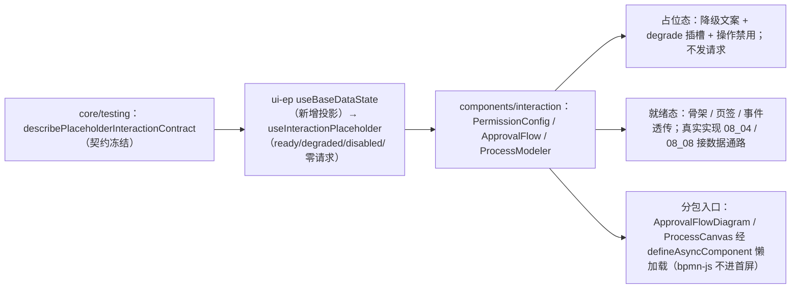

# 01 实施 · 配置与工作流占位

> 前端组件库 · 08 交互类 · 01 占位版交付 · 嵌套子任务 01（需求 08-1）· 实施记录

[文档首页](../../../../../../../文档首页.md) › [08 交互类](../../../08_交互类.md) › [01 占位版交付](../../08_交互类_01_占位版交付.md) › 实施记录　|　[← 任务](../08_交互类_01_占位版交付_01_配置与工作流占位.md)

## 1. 实施信息 

| 项 | 值 |
| --- | --- |
| 任务 | [01 配置与工作流占位](../08_交互类_01_占位版交付_01_配置与工作流占位.md) |
| 对应需求 | [08-1](../../../../../需求/08_需求_交互类.md#r08-1) |
| 详细设计 | [01 详细设计](../设计/01_详细设计_01_配置与工作流占位.md)（设计提交 `641f2bfc`） |
| 实施日期 | 2026-09-18 |
| 实施人 | minjian |
| 实施环境 | 本地开发机（Node v24.20.0 / npm 11.19.0，npmmirror） |
| Kiwi 用例 | 760（登记于实施前，代码 `// kiwi_id: 760` 标注） |
| 结论 | 完成 |

## 2. 实施概览 

## 3. 实施过程 

1. **Kiwi 先登记**：实施前经 mjbk `bms-kiwi` Django shell 登记用例（编号 760，分类「平台骨架」/ 优先级 P2 / 状态 CONFIRMED / 标签「自动化」）。
2. **占位契约套件**：`@bms/core/testing` 新增 `describePlaceholderInteractionContract`（未就绪 → 降级 + 禁用 + 零请求、`load()` 仍零；就绪 → 不再降级 / 禁用），供三件与后续真实实现共用。
3. **共享基础设施**：新增投影 `useBaseDataState`（值引核心 `BaseDataState` 子类，`loading → ready/empty/error` + 竞态令牌）与占位组合式 `useInteractionPlaceholder`（基于该投影；`ready` / `degraded` / `disabled` / `requestCount`，仅就绪后计数）；供 `08_01_02` / `08_01_03` 复用。
4. **三件占位**（`components/interaction/`，与真实实现同名同契约）：
   - `PermissionConfig`：权限树（隐含推导只读）/ 字段权限矩阵 / 数据范围 / 主体绑定四页签骨架与契约；另挂 `useBaseTreeData`（树域）。
   - `ApprovalFlow`：节点进度 / 审批时间线 / 操作区（同意 / 驳回 / 转办 / 撤回 / 评论）骨架与契约，操作按 `canApprove` / `canWithdraw` 与占位禁用。
   - `ProcessModeler`：工具栏 / 元素调板（BPMN 子集）/ 建模画布 / 节点属性面板骨架与契约，只读态禁用编辑与调板。
5. **分包入口**：`ApprovalFlowDiagram`（只读 BPMN 图）与 `ProcessCanvas`（建模画布）经 `defineAsyncComponent(() => import(...))` 独立分包懒加载；占位态为轻量骨架，真实实现（`08_08`）原地换 bpmn-js。
6. 统一输出 `data-ready` / `data-degraded`；`degrade` / `empty` / `live` 插槽；占位态一切只读禁用且**不产生后端请求**。

## 4. 问题与处置 

| # | 问题 / 现象 | 原因 | 处置 |
| --- | --- | --- | --- |
| 1 | 异步分包件单测首次未解析 | `flushPromises()` 不等待动态 import 结算 | 用例改用 `vi.dynamicImportSettled()` + `flushPromises()` |
| 2 | 画布 `select` 事件类型不匹配 | 内部画布元素类型为宽 `string`，外层契约为 `ModelerElementType` | 外层处理器按宽类型入参、落库时收窄为 `ModelerElement` |

## 5. 验证结果 

| 验证点 | 方法 | 结果 |
| --- | --- | --- |
| 类型检查 / Lint / 单测 | 根 `npm run check`（core / vue / ui-ep） | 通过 |
| 单测（ui-ep） | `npm run ui-ep:test` | 31 文件 / 218 用例全通过（新增 13） |
| 单测（核心 / 绑定） | `npm run core:test` / `npm run vue:test` | 160 / 5 用例通过 |
| 文档校验 | `check-links.py` / `check-base.py` | 断链 0 / 基座校验通过 |

## 6. 偏差与遗留 

- **偏差**：无（按详细设计实施）。
- **遗留**：① 真实数据通路与权限 / 审批 / BPMN 引擎对接随 `08_04` / `08_08`（不得改对外契约）；② bpmn-js 依赖在 `08_08` 引入并进入既有分包入口；③ 共享基础设施（`useBaseDataState` / `useInteractionPlaceholder` / `describePlaceholderInteractionContract`）待 `08_01_02` / `08_01_03` 复用。

> 本文档依《[文档生成规范](../../../../../../../规范/文档生成规范.md)》编写
