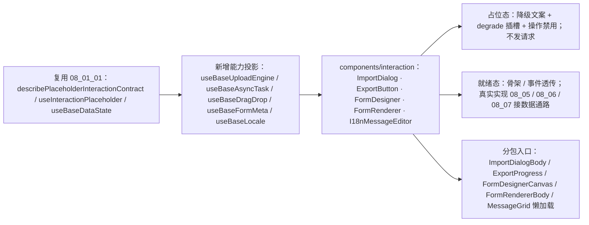

# 01 实施 · 数据进出与表单占位

> 前端组件库 · 08 交互类 · 01 占位版交付 · 嵌套子任务 02（需求 08-1）· 实施记录

[文档首页](../../../../../../../文档首页.md) › [08 交互类](../../../08_交互类.md) › [01 占位版交付](../../08_交互类_01_占位版交付.md) › 实施记录　|　[← 任务](../08_交互类_01_占位版交付_02_数据进出与表单占位.md)

## 1. 实施信息 

| 项 | 值 |
| --- | --- |
| 任务 | [01 数据进出与表单占位](../08_交互类_01_占位版交付_02_数据进出与表单占位.md) |
| 对应需求 | [08-1](../../../../../需求/08_需求_交互类.md#r08-1) |
| 详细设计 | [02 详细设计](../设计/02_详细设计_01_数据进出与表单占位.md)（设计提交 `0e3548e1`） |
| 实施日期 | 2026-09-18 |
| 实施人 | minjian |
| 实施环境 | 本地开发机（Node v24.20.0 / npm 11.19.0，npmmirror） |
| Kiwi 用例 | 761（登记于实施前，代码 `// kiwi_id: 761` 标注） |
| 结论 | 完成 |

## 2. 实施概览 

## 3. 实施过程 

1. **Kiwi 先登记**：实施前经 mjbk `bms-kiwi` Django shell 登记用例（编号 761，分类「平台骨架」/ 优先级 P2 / 状态 CONFIRMED / 标签「自动化」）。
2. **新增能力投影**（薄适配，值引核心能力基类子类）：`useBaseUploadEngine`（分片 / 进度 / 取消）、`useBaseAsyncTask`（提交 / 进度 / 取消 / 退避）、`useBaseDragDrop`（拖拽阶段与订阅）、`useBaseFormMeta`（加载 / 版本比对）、`useBaseLocale`（locale / 时区 / 格式上下文）。
3. **五件占位**（`components/interaction/`，与真实实现同名同契约）：
   - `ImportDialog`：三步（选文件 → 上传解析 → 结果 / 错误行）骨架与契约；文件类型 / 大小校验、幂等键生成与重置、模板与错误明细下载；另挂 `useBaseUploadEngine`。
   - `ExportButton`：当前筛选 / 选中导出触发、脱敏提示、异步阈值口径；另挂 `useBaseAsyncTask`。
   - `FormDesigner`：三区 + 工具栏骨架、层级 / 只读禁用、字段拖入事件；另挂 `useBaseDragDrop`。
   - `FormRenderer`：三态渲染主体骨架、`defineExpose` 校验 / 取数 / 设值 / 重置 / 提交；另挂 `useBaseFormMeta`。
   - `I18nMessageEditor`：语言清单 + `msg_key` × 多语言网格骨架、缺失高亮、批量保存与缓存失效入口；另挂 `useBaseLocale`。
4. **分包入口**：`ImportDialogBody` / `ExportProgress` / `FormDesignerCanvas` / `FormRendererBody` / `MessageGrid` 经 `defineAsyncComponent(() => import(...))` 独立分包懒加载；测试用 `vi.dynamicImportSettled()` 等待。
5. 统一输出 `data-ready` / `data-degraded`；`degrade` / `empty` / `live` 插槽；占位态一切只读禁用且**不产生后端请求**；共用 `08_01_01` 冻结契约套件。

## 4. 问题与处置 

| # | 问题 / 现象 | 原因 | 处置 |
| --- | --- | --- | --- |
| 1 | 设计器画布 `select` 事件类型不匹配 | 内部画布元素类型宽于外层契约 | 外层按宽类型入参、收窄为 `DesignerSelection` |
| 2 | `FormMode` 导出与 `useBaseFormPage` 同名冲突 | 既有导出已占用 `FormMode` | 渲染器三态改名 `FormRenderMode` |
| 3 | 测试二次 `defineProperty('files')` 报「Cannot redefine」 | 首次定义为不可配置 | 定义时显式 `configurable/writable` |

## 5. 验证结果 

| 验证点 | 方法 | 结果 |
| --- | --- | --- |
| 类型检查 / Lint / 单测 | 根 `npm run check`（core / vue / ui-ep） | 通过 |
| 单测（ui-ep） | `npm run ui-ep:test` | 32 文件 / 237 用例全通过（新增 19） |
| 单测（核心 / 绑定） | `npm run core:test` / `npm run vue:test` | 160 / 5 用例通过 |
| 文档校验 | `check-links.py` / `check-base.py` | 断链 0 / 基座校验通过 |

## 6. 偏差与遗留 

- **偏差**：无功能偏差；件数口径按确认由 10 调整为 11（导入导出拆双件），已同步父任务 / 域 / 计划。
- **遗留**：① 真实数据通路随 `08_05` / `08_06` / `08_07`（不得改对外契约）；② 拖拽内核与重字段控件在真实实现引入并进入既有分包入口；③ 五投影待对应真实实现继续复用。

> 本文档依《[文档生成规范](../../../../../../../规范/文档生成规范.md)》编写
