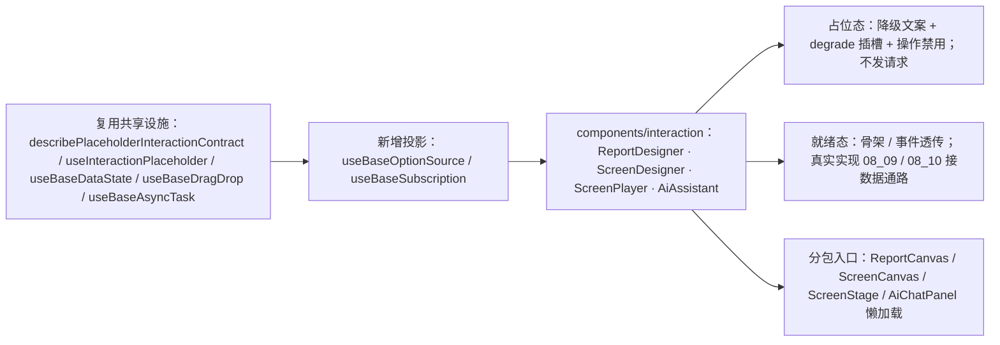

# 01 实施 · 报表大屏与 AI 占位

> 前端组件库 · 08 交互类 · 01 占位版交付 · 嵌套子任务 03（需求 08-1）· 实施记录

[文档首页](../../../../../../../文档首页.md) › [08 交互类](../../../08_交互类.md) › [01 占位版交付](../../08_交互类_01_占位版交付.md) › 实施记录　|　[← 任务](../08_交互类_01_占位版交付_03_报表大屏与AI占位.md)

## 1. 实施信息 

| 项 | 值 |
| --- | --- |
| 任务 | [03 报表大屏与 AI 占位](../08_交互类_01_占位版交付_03_报表大屏与AI占位.md) |
| 对应需求 | [08-1](../../../../../需求/08_需求_交互类.md#r08-1) |
| 详细设计 | [03 详细设计](../设计/03_详细设计_01_报表大屏与AI占位.md)（设计提交 `43b01497`） |
| 实施日期 | 2026-09-18 |
| 实施人 | minjian |
| 实施环境 | 本地开发机（Node v24.20.0 / npm 11.19.0，npmmirror） |
| Kiwi 用例 | 762（登记于实施前，代码 `// kiwi_id: 762` 标注） |
| 结论 | 完成（`08_01` 三嵌套子任务全部完成） |

## 2. 实施概览 

## 3. 实施过程 

1. **Kiwi 先登记**：实施前经 mjbk `bms-kiwi` Django shell 登记用例（编号 762，分类「平台骨架」/ 优先级 P2 / 状态 CONFIRMED / 标签「自动化」）。
2. **新增能力投影**：`useBaseOptionSource`（选项 / 数据集加载、版本比对、搜索回显）、`useBaseSubscription`（点分主题订阅、广播、释放自动取消）。
3. **四件占位**（`components/interaction/`，与真实实现同名同契约）：
   - `ReportDesigner`：数据集选择 / 12 列网格画布 / 图表配置三区 + 工具栏骨架；数据集经 `BaseOptionSource`（占位本地映射、零请求）；停用数据集不可选；只读禁用。
   - `ScreenDesigner`：组件面板 / 自由画布 / 属性面板三区 + 工具栏（多页与预览播放）骨架；拖拽经 `BaseDragDrop`；只读禁用。
   - `ScreenPlayer`：多页轮播控制（上一页 / 播放暂停 / 下一页 / 刷新）与全屏骨架；数据刷新经 `BaseAsyncTask`。
   - `AiAssistant`：四模式（ask / report / approval / doc_qa）+ 会话列表 + 对话面板 + 输入区骨架；流式通道经 `BaseSubscription`（占位无订阅、不发请求）；自动执行二次确认与撤销入口。
4. **分包入口**：`ReportCanvas` / `ScreenCanvas` / `ScreenStage` / `AiChatPanel` 经 `defineAsyncComponent(() => import(...))` 独立分包懒加载；测试用 `vi.dynamicImportSettled()` 等待。
5. 统一输出 `data-ready` / `data-degraded`；`degrade` / `empty` / `live` 插槽；占位态一切只读禁用且**不产生后端请求**；共用 `08_01_01` 冻结契约套件。
6. **件数口径偏差处置**：大屏设计器与播放按确认拆 `ScreenDesigner` + `ScreenPlayer`，`08_01` 件数由 11 调整为 12，同步父任务 / 域 / 计划 / 风险表。

## 4. 问题与处置 

| # | 问题 / 现象 | 原因 | 处置 |
| --- | --- | --- | --- |
| 1 | 只读态保存按钮未禁用 | 仅绑定了占位禁用，未含 `readOnly` | 报表 / 大屏设计器保存与发布按钮并入 `readOnly` |
| 2 | `BaseSubscription.registerUnsubscribe` 为受保护方法 | 投影子类内可访问，外部不可 | 投影子类封装 `subscribe/emit` 并经 `registerDisposable` 登记取消 |
| 3 | 大屏播放切换语义 | `autoplay` 初值为播放中 | 用例按 `playing` 取反断言（`toggle` → `false`） |

## 5. 验证结果 

| 验证点 | 方法 | 结果 |
| --- | --- | --- |
| 类型检查 / Lint / 单测 | 根 `npm run check`（core / vue / ui-ep） | 通过 |
| 单测（ui-ep） | `npm run ui-ep:test` | 33 文件 / 251 用例全通过（新增 14） |
| 单测（核心 / 绑定） | `npm run core:test` / `npm run vue:test` | 160 / 5 用例通过 |
| 文档校验 | `check-links.py` / `check-base.py` | 断链 0 / 基座校验通过 |

## 6. 偏差与遗留 

- **偏差**：无功能偏差；件数口径按确认由 11 调整为 12（大屏拆双件），已同步父任务 / 域 / 计划 / M4 门禁 / 风险表。
- **遗留**：① 真实数据通路随 `08_09` / `08_10`（不得改对外契约）；② gridstack / vue-flow / ECharts / Markdown 内核在真实实现引入并进入既有分包入口；③ 两投影与共享设施待对应真实实现继续复用。

> 本文档依《[文档生成规范](../../../../../../../规范/文档生成规范.md)》编写
