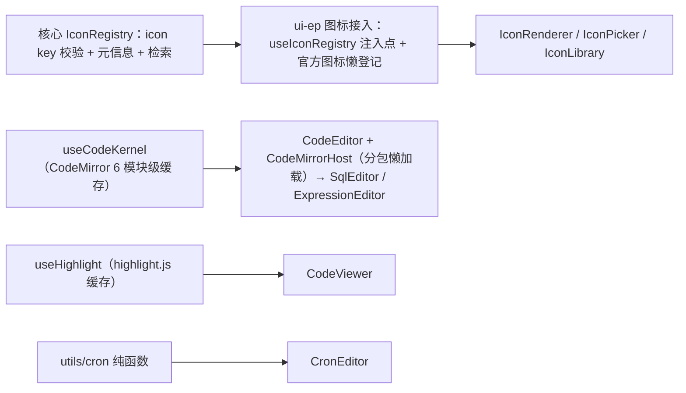

# 01 实施 · 图标选择器与代码表达式编辑器

> 前端组件库 · 08 交互类 · 子任务 02（需求 08-2）· 实施记录

[文档首页](../../../../../../文档首页.md) › [08 交互类](../../08_交互类.md) › [02 图标选择器与代码表达式编辑器](../08_交互类_02_图标选择器与代码表达式编辑器.md) › 实施记录　|　[← 任务](../08_交互类_02_图标选择器与代码表达式编辑器.md)

## 1. 实施信息 

| 项 | 值 |
| --- | --- |
| 任务 | [02 图标选择器与代码表达式编辑器](../08_交互类_02_图标选择器与代码表达式编辑器.md) |
| 对应需求 | [08-2](../../../../需求/08_需求_交互类.md#r08-2) |
| 详细设计 | [02 详细设计](../设计/02_详细设计_01_图标选择器与代码表达式编辑器.md)（设计提交 `7e79c59f`） |
| 实施日期 | 2026-09-18 |
| 实施人 | minjian |
| 实施环境 | 本地开发机（Node v24.20.0 / pnpm 11.x，npmmirror） |
| Kiwi 用例 | 763（登记于实施前，代码 `// kiwi_id: 763` 标注） |
| 结论 | 完成 |

## 2. 实施概览 

## 3. 实施过程 

1. **Kiwi 先登记**：实施前经 mjbk `bms-kiwi` Django shell 登记用例（编号 763，分类「平台骨架」/ 优先级 P2 / 状态 CONFIRMED / 标签「自动化」）。
2. **依赖引入**：ui-ep 新增 `codemirror` / `@codemirror/state` / `@codemirror/view` / `@codemirror/lang-sql` / `@codemirror/lang-json` / `@codemirror/lang-javascript` / `highlight.js`（npmmirror 源，均按需动态 import）。
3. **核心图标注册表扩展**：`assertIconKey`（`前缀:段`，段允许大小写 / 数字 / `._-`）替换图标键校验，兼容模块键；`IconProvider` 增 `name` / `category` / `tags`；`IconRegistry` 增 `byPrefix` / `search` / `resolve`（检索归一保留中英文）。
4. **ui-ep 图标**：`useIconRegistry`（活动注册表 + `setIconRegistry` 注入点 + 类型守卫）、`official.ts`（懒加载官方图标并幂等登记 `el:{PascalCase}`，`markRaw` 防响应式）、`IconRenderer`（多来源解析 + 未知降级兜底 + 去重告警，自定义 SVG 经 DOMPurify）、`IconPicker`（搜索防抖 / 分类 / 网格 / 最近使用 / 清除）、`IconLibrary`（来源分组 / 复制 / 引用计数 / 自定义按权限）。
5. **编辑器内核**：`useCodeKernel` 经 `BaseEditorKernel`；CodeMirror 模块级 `Promise` 缓存与加载计数（**不重复加载**）；`useHighlight` 经 `BaseObject` 运行时，highlight.js 模块级缓存 + 按需语言注册。
6. **编辑器四件**：`CodeEditor`（通用内核宿主，`host` 可覆盖便于测试；能力缺失降级纯文本域；`defineExpose` 取值 / 设值 / 插入 / 选区）+ 异步分包 `CodeMirrorHost`；`SqlEditor`（仅 SELECT 轻校验 / 格式化 / 测试执行 / 字段插入）；`ExpressionEditor`（字段 / 变量 / 模板插入 + 轻校验）；`CronEditor`（5 段 + 描述 + 模板 + 校验）；`CodeViewer`（只读高亮 + 复制 + 长文折叠）。`utils/cron` 提供纯函数。
7. **护栏适配**：新组件 / 组合式按继承链要求引入核心基类或基类投影（图标注册表迁至 `composables/useIconRegistry`；`useHighlight` 挂 `BaseObject` 运行时；Cron/Sql/Expression 经 `useBaseDataState` 承载校验状态）。

## 4. 问题与处置 

| # | 问题 / 现象 | 原因 | 处置 |
| --- | --- | --- | --- |
| 1 | cron 纯函数解析失败 | JSDoc 中 `*/n` 提前闭合块注释 | 注释改写为「步进」描述 |
| 2 | 中文图标检索失配 | 归一化删除了非 ASCII | 归一化改为仅去分隔符、保留中英文 |
| 3 | `v-html` 触发 ESLint 告警 | 清洗 / 高亮 HTML 渲染 | `eslint-disable vue/no-v-html` 并注明已清洗 |
| 4 | 继承链护栏拦截新件 | 组件 / 组合式未值引入核心基类或投影 | 注册表迁 `composables/useIconRegistry`、`useHighlight` 挂 `BaseObject`、编辑器经 `useBaseDataState` |
| 5 | 图标组件被响应式包装告警 | 组件对象进入响应式 | 官方图标 `markRaw`；`IconRenderer` 用 `shallowRef` |

## 5. 验证结果 

| 验证点 | 方法 | 结果 |
| --- | --- | --- |
| 类型检查 / Lint / 单测 | 根 `pnpm run check`（core / vue / ui-ep） | 通过 |
| 单测（ui-ep） | `pnpm run ui-ep:test` | 34 文件 / 264 用例全通过（新增 13） |
| 单测（核心 / 绑定） | `pnpm run core:test` / `pnpm run vue:test` | 162（新增 2）/ 5 用例通过 |
| 文档校验 | `check-links.py` / `check-base.py` | 断链 0 / 基座校验通过 |

## 6. 偏差与遗留 

- **偏差**：无（按详细设计实施）。
- **遗留**：① 自定义图标 CRUD 与 `sys_icon` 后端联动、SQL 测试执行真实后端、表达式后端校验接口随对应后端任务；② 业务图标（`biz:`）随代码发布后登记；③ 编辑器主题接设计令牌的细粒度色板随品牌化任务完善。

> 本文档依《[文档生成规范](../../../../../../规范/文档生成规范.md)》编写
