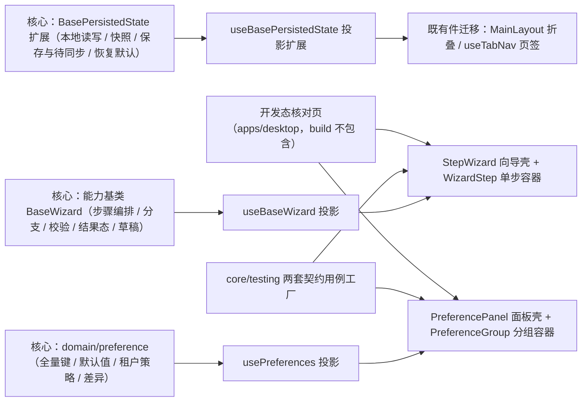

# 01 实施 · 向导与偏好设置

> 前端组件库 · 08 交互类 · 03 面板与工具 · 嵌套子任务 01（需求 08-3）· 实施记录

[文档首页](../../../../../../../文档首页.md) › [08 交互类](../../../08_交互类.md) › [03 面板与工具](../../08_交互类_03_面板与工具.md) › [01 向导与偏好设置](../08_交互类_03_面板与工具_01_向导与偏好设置.md) › 实施记录　|　[← 任务](../08_交互类_03_面板与工具_01_向导与偏好设置.md)

## 1. 实施信息 

| 项 | 值 |
| --- | --- |
| 任务 | [01 向导与偏好设置](../08_交互类_03_面板与工具_01_向导与偏好设置.md) |
| 对应需求 | [08-3](../../../../../需求/08_需求_交互类.md#r08-3) |
| 详细设计 | [01 详细设计](../设计/01_详细设计_01_向导与偏好设置.md)（设计提交 `cc95d896`；数据面口径修订随本次 docs 提交） |
| 实施日期 | 2026-09-19 |
| 实施人 | minjian |
| 实施环境 | 本地开发机（Node v24.20.0 / pnpm 11.x，npmmirror） |
| Kiwi 用例 | 764（实施前经 mjbk `bms-kiwi` Django shell 登记，代码 `// kiwi_id: 764` 标注） |
| 结论 | 完成 |

## 2. 实施概览 

## 3. 实施过程 

1. **Kiwi 先登记**：实施前经 mjbk `bms-kiwi` Django shell 登记用例（编号 764，分类「平台骨架」/ 优先级 P2 / 状态 CONFIRMED / 标签「自动化」），先回读确认既有最大编号为 763。
2. **核心能力基类新增**：`capabilities/wizard.ts` 承载步骤编排（归一与初始定位 / 可见步骤过滤 / 分步与整体校验 / 已到达步跳转 / 结果态 / 草稿经偏好持久化）；`manifest.ts` 登记 `wizard: ['persisted-state']`；`index.ts` 导出面同步。
3. **核心能力基类扩展**：`persisted-state.ts` 补本地存储读写（`PersistedStorage` 最小接口）/ 快照回滚 / 脏判定 / 保存与待同步 / 恢复默认 / 清空；全部为兼容新增，`stateKey` / `remoteVersion` / `loadRemote` / `needsRemoteRefresh` 语义不变。
4. **偏好领域纯函数**：`domain/preference.ts` 落全量偏好键（13 键，含 `notify.*`）、平台默认值、扁平读写、归一（非法值回退基线）、平台默认 ∩ 租户默认、租户策略可见 / 可选判定、差异计算。
5. **契约用例工厂**：`@bms/core/testing` 新增 `describeWizardContract` / `describePreferencesContract`（结构化契约面，`ui-ep` 投影适配接入，后续移动端复用同一套断言）。
6. **投影层**：`useBaseWizard`（步骤编排响应式面 + 草稿）、`usePreferences`（值 / 编辑副本 / 默认值 / 策略 / 脏判定 / 保存与回滚 / 恢复默认）、`useBasePersistedState` 扩展（`storage` / `remoteSaver` / `saveDelay` + 新成员响应式面）。
7. **具体件**：`StepWizard`（步骤条横 / 纵 / 进度三形态 + 紧凑 + 窄屏自动纵向 + 单步隐藏 + 分步校验阻断 + 已到达步跳转 + 草稿提示条 + 结果步 + 操作栏与插槽）、`WizardStep`（单步标题 / 序号 / 描述 / 错误行 + 数据状态）、`PreferencePanel`（宽屏抽屉 / 窄屏弹窗自动 + 分组渲染 + 即时预览 + 保存 / 取消 / 恢复默认二次确认 + 租户策略受控）、`PreferenceGroup`（分组标题 / 描述 + 折叠）。
8. **既有件迁移（消除重复实现）**：`MainLayout` 折叠与 `useTabNav` 页签的手写 `sessionStorage` 读写改为经偏好持久化能力（`storage: 'session'` + `restore` / `persist`）；两件既有用例零回归。
9. **开发态核对页**：`apps/desktop/wizard-preference-check.html` + `src/dev/{wizardPreferenceCheck.ts,WizardPreferenceCheck.vue}`；9 项自检上屏（`data-check`），支持 `?auto=1` 脚本化走查与人工交互两条路径；`vite build` 只构建 `index.html`，核对页不入产物。

## 4. 问题与处置 

| # | 问题 / 现象 | 原因 | 处置 |
| --- | --- | --- | --- |
| 1 | 件内读取注入的持久化基类实例报 `Cannot read private member #hasLocal from an object whose class did not declare it` | 跨实例基类对象经 props 后进入响应式，私有字段（`#`）经代理读取失效 | 投影与件两处在赋值时 `markRaw(toRaw(...))` 去响应式（框架适配层职责，核心保持框架无关） |
| 2 | 组件用例无法用自定义桩替换动态 `:is` 壳组件 | 动态组件按名匹配桩不可靠 | 用例改为对 EP 壳组件下桩（渲染默认与页脚插槽），宽 / 窄屏分别断言抽屉 / 弹窗桩 |
| 3 | 偏好变更未触发即时预览（根元素令牌属性不变） | 只补了打开 / 取消 / 恢复默认三处 `applyPreview`，漏了变更链路 | 增补 `watch(draft, applyPreview)`（编辑副本整体替换触发） |
| 4 | 核对页自检结论刷新会自触发（`onUpdated` 内赋值新对象） | 刷新函数每次写新对象 → 再次触发更新钩子 | 结论未变化不赋值 + 改为 300ms 轻量轮询；`?auto=1` 自动走查在**提交前**刷新一次（草稿按步落盘、提交成功后即被清除） |
| 5 | `prettier --check` 对全部文件报不通过（含未改动文件） | 仓库级无 prettier 配置，仅 `frontend/apps/desktop/.prettierrc.json` | 以该配置核对本次文件；`core/src/index.ts` 与 `ui-ep/src/index.ts` 在 HEAD 即不合规（导出块换行风格），本次新增块与邻接风格一致、不夹带无关重排 |
| 6 | 用例中「草稿」断言需显式构造前置草稿 | 提交成功后草稿即被清除（设计语义），二次挂载时无草稿 | 用例改为：先断言提交后存储已清空，再预置草稿验证「丢弃」路径 |

## 5. 验证结果 

| 验证点 | 方法 | 结果 |
| --- | --- | --- |
| 类型检查 / Lint / 单测（核心与插件） | 根 `pnpm run check`（core / vue / ui-ep） | 通过 |
| 单测（core） | `core:check` | 31 文件 / 183 用例（新增 21） |
| 单测（vue） | `vue:check` | 2 文件 / 5 用例 |
| 单测（ui-ep） | `ui-ep:check` | 35 文件 / 288 用例（新增 24，含两套契约套件驱动） |
| 宿主（PC）门禁 | `pnpm exec vue-tsc -b` / `pnpm run lint` / `pnpm run test:cov` | 通过；30 用例；覆盖率 86.91%（阈值 70） |
| 构建与体积预算 | `pnpm run build` / `pnpm run budget` | 通过；合计 120.7 KB / 260 KB，最大单文件 102.2 KB / 150 KB；`dist` 只有 `index.html`（核对页不入产物） |
| 开发态核对页（对照原型逐项自检） | chromium `--dump-dom "…/wizard-preference-check.html?auto=1"` | **9/9 自检项 pass**（步骤条 / 分支 / 校验阻断 / 已到达步跳转 / 草稿 / 结果步 / 即时预览 / 保存与待同步 / 租户受控） |
| 文档校验 | `check-base.py` / `check-links.py` / `check-status.py --stage 04_前端组件库 --strict` | 通过（见测试记录） |

## 6. 偏差与遗留 

- **设计偏差（已回写设计）**：偏好面板数据面由 `persisted`（外部注入持久化实例）改为 `storageKey`（面板内经投影自建实例，便于注入存储键）；其余契约按设计落地。
- **工时偏差**：名义 12h；因新增两套契约用例工厂（决策 11）、开发态核对页（决策 14）、步骤条三形态（决策 7）与既有件迁移回归，实际工时上浮（预估 ~20h），按名义 12h 回写、偏差登记于此。
- **遗留（归口）**：
  1. 宿主接线（`apps/desktop` 顶栏「偏好设置」入口、深色令牌变量组、首屏本地预读防闪烁）——随交互类「主题与品牌化」与布局任务（本任务只做面板内即时生效）。
  2. 用户偏好后端接口 `GET/PUT /user/preferences` 真实联调、多端合并与冲突口径——随后端「用户喜好」任务（本期本地真实 + 远端占位注入点）。
  3. 语言资源动态加载（切换语言后刷新文案）——随交互类「国际化文案编辑器」任务。
  4. 单步表单复用「表单渲染器」——随 `08_06`；本任务单步内容走插槽。
  5. 本地持久化键统一 `bms_` 前缀（规范 §8.1）需改宿主 `App.vue` 传入的 `storage-key`——随宿主接线一并处理（现值 `bms:desktop:layout` / `bms:desktop:tabs` 保持不变，避免上下文丢失）。
  6. 向导「取消」脏数据二次确认由承载壳（弹窗 / 抽屉）或宿主按 `cancel.dirty` 处置（件内不内置确认）——协同契约见设计 §7。

> 本文档依《[文档生成规范](../../../../../../../规范/文档生成规范.md)》编写
