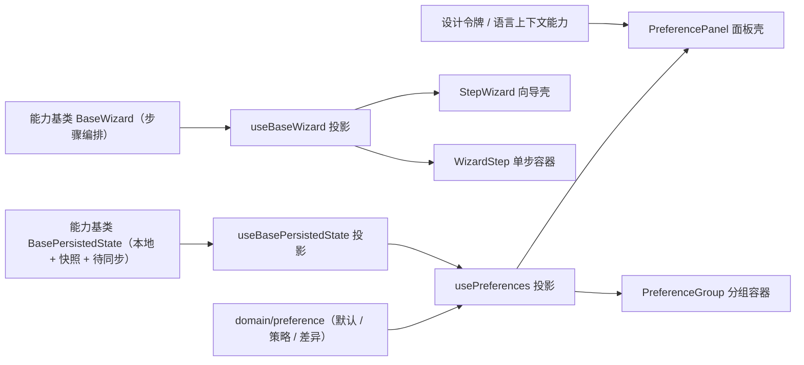

# 01 详细设计 · 向导与偏好设置

> 前端组件库 · 08 交互类 · 嵌套子任务 03-1（需求 08-3）· 详细设计

[文档首页](../../../../../../../文档首页.md) › [08 交互类](../../../08_交互类.md) › [03 面板与工具](../../08_交互类_03_面板与工具.md) › 详细设计　|　[← 任务](../08_交互类_03_面板与工具_01_向导与偏好设置.md)

## 1. 设计目标与范围 <a id="goal"></a>

交付两件真实能力：**向导与步骤**（步骤条 + 分步校验 + 前后跳转 + 分支步骤 + 草稿 + 结果步）与**偏好设置面板**（分组偏好 + 即时预览 + 保存/取消/恢复默认 + 本地持久化 + 远端占位同步）。

- **向导编排入链**：新增能力基类 `BaseWizard`（核心 `capabilities/wizard.ts`，挂组件根），承载步骤状态编排（可见步骤 / 当前步 / 已到达步 / 分步与整体校验 / 结果态 / 草稿），供页面级向导、弹窗内向导、导入映射、开通流程复用；UI 侧经 `useBaseWizard` 投影。
- **偏好持久化入链**：扩展既有能力基类 `BasePersistedState`（本地读写 / 快照回滚 / 脏判定 / 保存与待同步 / 恢复默认），并把 `MainLayout` 折叠、`useTabNav` 页签两处手写 `sessionStorage` 迁移到同一能力（消除重复实现）。
- **偏好键与默认值下沉核心**：`domain/preference.ts` 承载平台默认值、租户策略合并、差异计算（纯函数，框架无关）。
- **宿主接线不在本期**：`apps/desktop` 顶栏入口、深色令牌变量组、首屏本地预读防闪烁登记为遗留（随交互类「主题与品牌化」与布局任务）；本期做到**面板内即时生效**（写根元素属性 + 经设计令牌 / 语言上下文投影生效 + 取消回滚）。

### 1.1 口径与依从 <a id="positioning"></a>

- **架构铁律**：向导的步骤编排与偏好的本地持久化均为**横切功能**，一律落为**继承链上的能力基类**（核心 `capabilities/`），不在链外自由挂接；具体件仅做渲染与编排。
- **同契约多实现**：`BaseWizard` / 偏好持久化契约由 `@bms/core/testing` 契约套件承载（本期新增 `describeWizardContract` / `describePreferencesContract`），后续移动端实现跑同一套断言。
- **占位口径**：用户偏好后端接口（`GET/PUT /user/preferences`）未就绪——本地存储**真实生效**，远端**占位**（注入点未注入时不发请求，置待同步标记）。
- **工时**：嵌套子任务名义 12h；因新增契约套件（决策 11）、开发态核对页（决策 14）、步骤条三形态（决策 7），实际工时预估上浮，偏差在实施记录登记。

## 2. 交付物清单 <a id="deliver"></a>

| # | 交付物 | 落点 |
| --- | --- | --- |
| 1 | 向导编排能力基类（新增） | `core/src/capabilities/wizard.ts` |
| 2 | 能力依赖登记（新增 `wizard` 键） | `core/src/capabilities/manifest.ts` |
| 3 | 偏好持久化能力基类扩展 | `core/src/capabilities/persisted-state.ts` |
| 4 | 偏好键 / 默认值 / 策略与合并纯函数 | `core/src/domain/preference.ts` |
| 5 | 核心导出面登记 | `core/src/index.ts` |
| 6 | 契约套件两套（向导 / 偏好） | `core/testing/index.ts` |
| 7 | 核心用例（向导编排 / 偏好纯函数） | `core/tests/wizard.spec.ts`、`core/tests/domain-preference.spec.ts` |
| 8 | 向导编排投影 | `ui-ep/src/composables/useBaseWizard.ts` |
| 9 | 偏好状态编排投影 | `ui-ep/src/composables/usePreferences.ts` |
| 10 | 偏好持久化投影扩展（存储后端 / 快照 / 保存） | `ui-ep/src/composables/useBasePersistedState.ts` |
| 11 | 向导壳 | `ui-ep/src/components/interaction/StepWizard.vue` |
| 12 | 单步容器 | `ui-ep/src/components/interaction/WizardStep.vue` |
| 13 | 偏好面板壳 | `ui-ep/src/components/interaction/PreferencePanel.vue` |
| 14 | 偏好分组容器 | `ui-ep/src/components/interaction/PreferenceGroup.vue` |
| 15 | 既有件迁移（折叠 / 页签持久化经能力基类） | `ui-ep/src/components/layout/MainLayout.vue`、`ui-ep/src/composables/useTabNav.ts` |
| 16 | 导出面登记 | `ui-ep/src/index.ts` |
| 17 | 用例 | `ui-ep/tests/interaction-wizard-preference.spec.ts` |
| 18 | 开发态核对页（`vite build` 不包含） | `apps/desktop/wizard-preference-check.html`、`apps/desktop/src/dev/{wizardPreferenceCheck.ts,WizardPreferenceCheck.vue}` |
| 19 | 登记回写：清单 / 组件设计 14、15 / 计划 / 任务状态 | 见第 6 节 |



## 3. 接口 / 契约与边界 <a id="contract"></a>

### 3.1 核心：能力基类 `BaseWizard`（新增） <a id="wizard-base"></a>

```ts
/** 向导步骤定义。 */
export interface WizardStep {
  key: string
  title: string
  description?: string
  /** 可见条件（分支步骤）；`false` 时该步不出现。 */
  visible?: boolean
  /** 当前步校验器：`true` 通过；字符串为错误文案；支持异步。 */
  validate?: () => boolean | string | Promise<boolean | string>
}

/** 校验结果。 */
export interface WizardValidation {
  valid: boolean
  /** 首个出错步骤键。 */
  stepKey?: string
  message?: string
}

/** 结果态。 */
export interface WizardResult {
  status: 'success' | 'error'
  title?: string
  message?: string
}

export abstract class BaseWizard extends BaseComponent {
  readonly identifier: string = 'wizard'
  steps: WizardStep[]
  currentKey: string | undefined
  readonly visited: string[]          // 已到达步骤键（保序）
  stepError: string                   // 当前步校验失败文案
  result: WizardResult | undefined     // 未提交为 undefined
  draftKey: string                     // 空串不启用草稿
  draft: BasePersistedState | undefined // 草稿持久化（注入）

  get visibleSteps(): WizardStep[]     // 按 visible 过滤
  get current(): WizardStep | undefined
  get currentIndex(): number
  get isFirst(): boolean
  get isLast(): boolean
  get isResult(): boolean

  setSteps(steps: WizardStep[]): void          // 归一 + 定位首个可见步 + 清结果态
  setVisible(key: string, visible: boolean): void // 分支重算（当前步失效回退最近有效步）
  validateStep(key: string): Promise<WizardValidation>
  next(): Promise<boolean>                     // 校验当前步 → 前进；失败停在本步并写 stepError
  prev(): boolean
  goTo(key: string): boolean                   // 仅可跳「已到达」步
  validateAll(): Promise<WizardValidation>     // 按可见步顺序校验，停于首错并定位
  complete(result: WizardResult): void         // 进入结果态 + 清草稿
  reset(): void

  saveDraft(value: unknown): void              // 经 draft 落盘（未注入则仅内存）
  readDraft(): unknown
  clearDraft(): void
}
```

| 行为 | 口径 |
| --- | --- |
| 步骤归一 | `setSteps` 去重键、剔除无 `key` 项；`visited` 重置为 `[首个可见步]` |
| 分步校验 | 只校验当前步；`validate` 抛错 / 拒绝视为**校验失败**（文案取错误信息或默认「请完善当前步骤」） |
| 整体校验 | **按可见步骤顺序**逐个校验并**停于首错**（顺序执行以保证「定位出错步」语义，异步步骤不并发） |
| 步骤跳转 | `goTo` 仅接受可见且**已到达**的步骤；向前跳不接受（需 `next()` 逐步通过） |
| 分支重算 | `setVisible` 后若当前步不可见 → 回退到之前最近的有效可见步（无则首个可见步）；`visited` 剔除不可见步 |
| 结果态 | `complete` 置 `result` 并清草稿；结果态下 `next` / `prev` / `goTo` 不动作 |
| 草稿 | `draftKey` 为空或 `draft` 未注入时草稿仅内存；`saveDraft` 写 `draft.setLocal` + `draft.persist()` |

- 依赖登记：`wizard: ['persisted-state']`（草稿经偏好持久化能力，登记为链上单向依赖）。
- 基类**不含渲染语义**（步骤条方向 / 紧凑 / 是否显示步骤条由具体件与宿主决定）。

### 3.2 核心：`BasePersistedState` 扩展 <a id="persisted-base"></a>

```ts
/** 本地存储后端（`localStorage` / `sessionStorage` 的最小接口）。 */
export interface PersistedStorage {
  getItem(key: string): string | null
  setItem(key: string, value: string): void
  removeItem(key: string): void
}

export abstract class BasePersistedState extends BaseComponent {
  readonly identifier: string = 'persisted-state'
  stateKey: string
  remoteVersion: number
  storage: PersistedStorage | undefined          // 未注入则不落盘
  remoteSaver: ((value: unknown) => Promise<void>) | undefined
  pendingSync: boolean                           // 远端未同步标记

  get local(): unknown
  get hasLocal(): boolean                        // 是否已有值（区分 undefined）
  get dirty(): boolean                           // 与快照比较（稳定序列化）
  setLocal(value: unknown): void                 // 仅内存 + 通知
  restore(): boolean                             // 存储 → 内存
  persist(): boolean                             // 内存 → 存储
  snapshot(): void                               // 记录快照（打开面板 / 进入向导）
  rollback(): boolean                            // 回滚到快照
  clear(): void                                  // 清内存 + 删存储 + 清快照
  reset(defaults: unknown): Promise<boolean>     // 以默认值重置并保存
  save(): Promise<boolean>                       // 本地 + 远端（注入时）；失败置 pendingSync
  async loadRemote(): Promise<unknown>           // 占位：未注入 remoteSaver 时返回本地快照
  needsRemoteRefresh(version: number): boolean
}
```

- **兼容性**：全部为**新增成员**（`stateKey` / `remoteVersion` / `setLocal` / `loadRemote` / `needsRemoteRefresh` 语义不变），属兼容变更。
- `restore` / `persist` 解析失败（非法 JSON）一律降级为「不落盘 / 不恢复」，不抛错。
- `save` 无 `remoteSaver` 时只写本地并置 `pendingSync = true`（远端占位口径）。

### 3.3 核心：`domain/preference.ts`（新增纯函数） <a id="preference-domain"></a>

```ts
/** 偏好值（设计 §3.1 全量键）。 */
export interface PreferenceValues {
  themeMode: 'light' | 'dark' | 'system'
  accent: boolean
  locale: string
  timezone: string
  sidebarCollapsed: boolean
  tabsEnabled: boolean
  tabsStyle: 'card' | 'plain'
  listDensity: 'compact' | 'comfortable' | 'loose'
  defaultRoute: string
  notify: { inbox: boolean; email: boolean; sms: boolean }
  shortcuts: boolean
}

/** 平台默认值。 */
export const PREFERENCE_DEFAULTS: Readonly<PreferenceValues>

/** 偏好键（含嵌套键 `notify.inbox` 等）。 */
export type PreferenceKey = 'themeMode' | 'accent' | 'locale' | ... | 'notify.inbox' | 'notify.email' | 'notify.sms'

/** 租户策略项（缺省即可见且可选）。 */
export interface PreferencePolicy { visible?: boolean; enabled?: boolean }
export type PreferencePolicyMap = Partial<Record<PreferenceKey, PreferencePolicy>>

mergePreferences(base: PreferenceValues, override: Partial<PreferenceValues>): PreferenceValues
resolvePreferenceDefaults(tenantDefaults?: Partial<PreferenceValues>, policy?: PreferencePolicyMap): PreferenceValues
diffPreferences(a: PreferenceValues, b: PreferenceValues): PreferenceKey[]
isPreferenceVisible(key: PreferenceKey, policy?: PreferencePolicyMap): boolean
isPreferenceEnabled(key: PreferenceKey, policy?: PreferencePolicyMap): boolean
```

- 平台默认值：`themeMode: 'light'` / `accent: false` / `locale: 'zh-CN'` / `timezone: 'Asia/Shanghai'` / `sidebarCollapsed: false` / `tabsEnabled: true` / `tabsStyle: 'card'` / `listDensity: 'comfortable'` / `defaultRoute: '/dashboard'` / `notify: { inbox: true, email: false, sms: false }` / `shortcuts: true`。
- 「恢复默认」= **平台默认 ∩ 租户默认**（`resolvePreferenceDefaults`）；租户策略 `enabled: false` 的项在恢复默认时**跳过**（保留现值）。
- 键清单即文档口径，供组件设计 15 §3.1 与《概要设计 · 用户喜好》登记项对齐。

### 3.4 契约套件（`@bms/core/testing`） <a id="testing"></a>

| 套件 | 契约面（结构化接口） | 断言要点 |
| --- | --- | --- |
| `describeWizardContract(name, create)` | `visibleSteps` / `currentKey` / `visited` / `stepError` / `result` / `setSteps` / `setVisible` / `validateStep` / `next` / `prev` / `goTo` / `validateAll` / `complete` / `reset` | 初始定位首个可见步；分步校验失败停本步、通过则前进并记已到达；未到达步不可跳；分支隐藏后当前步回退；整体校验停于首错并定位；结果态后导航不动作；`reset` 归零 |
| `describePreferencesContract(name, create)` | `values` / `defaults` / `policy` / `dirty` / `pendingSync` / `setValue` / `save` / `cancel` / `reset` | 仅可见项可写；不可选（`enabled:false`）项写入不生效；`setValue` 后 `dirty` 为真；`cancel` 回滚到打开前快照且 `dirty` 转假；`save` 写本地、无远端注入时 `pendingSync` 为真；`reset` 取平台默认 ∩ 租户默认（跳过不可选项） |

- 套件同时被 `ui-ep`（投影适配）与后续移动端实现消费；本期无第二实现时由 `ui-ep` 用例驱动（决策 11）。

### 3.5 投影 <a id="bindings"></a>

```ts
// useBaseWizard：向导编排投影
export interface UseBaseWizardOptions { steps?: WizardStep[]; draftKey?: string; draft?: BasePersistedState }
export interface UseBaseWizardResult {
  wizard: BaseWizard
  steps: Ref<WizardStep[]>
  visibleSteps: Ref<WizardStep[]>
  currentKey: Ref<string | undefined>
  currentIndex: Ref<number>
  visited: Ref<string[]>
  stepError: Ref<string>
  result: Ref<WizardResult | undefined>
  isFirst: Ref<boolean>; isLast: Ref<boolean>; isResult: Ref<boolean>
  setSteps(steps: WizardStep[]): void
  setVisible(key: string, visible: boolean): void
  validateStep(key: string): Promise<WizardValidation>
  next(): Promise<boolean>; prev(): boolean; goTo(key: string): boolean
  validateAll(): Promise<WizardValidation>
  complete(result: WizardResult): void; reset(): void
  saveDraft(value: unknown): void; readDraft(): unknown; clearDraft(): void
}

// usePreferences：偏好状态编排投影
export interface UsePreferencesOptions {
  defaults?: Partial<PreferenceValues>
  policy?: PreferencePolicyMap
  storage?: 'local' | 'session' | PersistedStorage   // 缺省 'local'（不可用则不落盘）
  storageKey?: string                                 // 缺省 'bms_preferences'
  remoteSaver?: (value: unknown) => Promise<void>
  saveDelay?: number                                  // 防抖毫秒（缺省 300）
}
export interface UsePreferencesResult {
  persisted: BasePersistedState
  values: Ref<PreferenceValues>       // 已保存值
  draft: Ref<PreferenceValues>        // 编辑副本（即时预览源）
  defaults: Ref<PreferenceValues>
  policy: Ref<PreferencePolicyMap | undefined>
  dirty: Ref<boolean>
  pendingSync: Ref<boolean>
  setValue(key: PreferenceKey, value: unknown): void   // 写 draft + 即时预览 + 防抖保存
  replace(values: Partial<PreferenceValues>): void
  save(): Promise<boolean>
  cancel(): void
  reset(): Promise<boolean>
  isVisible(key: PreferenceKey): boolean
  isEnabled(key: PreferenceKey): boolean
}

// useBasePersistedState：新增 storage（'local' | 'session' | PersistedStorage）、remoteSaver、saveDelay
// 并对齐 BasePersistedState 扩展成员（restore / persist / snapshot / rollback / clear / reset / save / dirty / pendingSync）
```

- 防抖保存由**投影层**承载（`setTimeout` 经异步资源登记，卸载自动清理）；核心基类保持同步纯逻辑。
- 存储后端缺省 `globalThis.localStorage`，不可用（SSR / 隐私模式）时降级为「不落盘」，不抛错。

### 3.6 `StepWizard` 向导壳契约 <a id="step-wizard"></a>

| 面 | 内容 |
| --- | --- |
| 数据面 | `steps`（必填）/ `modelValue`（向导数据，`v-model`）/ `direction`（`horizontal` / `vertical` / `progress`，缺省 `horizontal`）/ `compact`（缺省 `false`）/ `showSteps`（缺省 `true`）/ `draftKey`（缺省 `''`）/ `persisted`（草稿持久化注入）/ `showCancel`（缺省 `true`）/ `submitText`（缺省「提交」）/ `loading` |
| 事件 | `update:modelValue` / `step-change`（`key`、`index`）/ `validate`（`WizardValidation`）/ `submit`（向导数据）/ `cancel`（`{ dirty }`）/ `draft-restore`（草稿数据）/ `draft-discard` |
| 对外能力 | `next()` / `prev()` / `goTo(key)` / `validateAll()` / `reset()` / `complete(result)` / `saveDraft()` / `currentKey`（`defineExpose`） |
| 插槽 | 默认（当前步内容）/ `#step`（自定义单步容器）/ `#actions`（自定义底部操作栏）/ `#result`（自定义结果步）/ `#draft`（自定义草稿提示条） |
| 行为 | 步骤条 `el-steps`（`direction`）/ `el-progress`（进度形态）/ `simple`（`compact`）；窄屏经 `useResponsive` 自动转纵向；单步（`visibleSteps.length === 1`）自动隐藏步骤条；末步按钮文案取 `submitText`；结果步内按钮「重试 / 关闭」经事件透传 |

### 3.7 `WizardStep` 单步容器契约 <a id="wizard-step"></a>

| 面 | 内容 |
| --- | --- |
| 数据面 | `title` / `description` / `error`（当前步错误文案）/ `index`（步骤序号，用于标题前缀）/ `active`（是否当前步） |
| 事件 | 无 |
| 插槽 | 默认（步骤内容）/ `#title`（标题区替换）/ `#extra`（标题右侧） |
| 行为 | 标题 / 描述 / 序号 + 步骤内错误汇总（`error` 非空时显示错误行）；`active` 为假时不做校验触发（校验触发归向导壳） |

### 3.8 `PreferencePanel` 面板壳契约 <a id="preference-panel"></a>

| 面 | 内容 |
| --- | --- |
| 数据面 | `modelValue`（显隐，`v-model`）/ `values`（当前偏好，`v-model:values`）/ `defaults`（平台默认覆盖）/ `policy`（租户策略）/ `items`（分组与项定义，缺省内置全量分组）/ `groups`（分组裁剪，缺省全部）/ `title`（缺省「偏好设置」）/ `remoteSaver`（远端保存注入点）/ `storageKey`（本地存储键，缺省 `bms_preferences`） |
| 事件 | `update:modelValue` / `update:values`（保存成功）/ `change`（`{ key, value, values }`，即时预览）/ `save`（值）/ `reset`（值）/ `cancel` / `sync-pending` |
| 对外能力 | `open()` / `close()` / `save()` / `cancel()` / `restoreDefaults()` / `setValue(key, value)`（`defineExpose`） |
| 插槽 | 默认（分组区整体替换）/ `#item-<key>`（单项控件替换）/ `#footer`（操作栏替换） |
| 行为 | 宽屏 `el-drawer`（`size` 360 ~ 420）、窄屏 `el-dialog`（经 `useResponsive` 自动切换）；打开记录快照并写 `draft`；变更即时预览（写根元素属性 + 设计令牌 / 语言上下文投影）+ 防抖保存；「取消」回滚快照；「恢复默认」二次确认后取平台默认 ∩ 租户默认；受策略控制项隐藏（`visible:false`）/ 不可选（`enabled:false`） |

即时生效映射（面板内）：

| 偏好键 | 生效动作 |
| --- | --- |
| `themeMode` | `data-theme` 写根元素（`system` 经 `matchMedia('(prefers-color-scheme: dark)')` 解析为生效值）+ `BaseDesignToken.setTheme` |
| `listDensity` | `data-density`（`compact` / `default` / `loose`） |
| `locale` | `document.documentElement.lang` + `BaseLocale.setLocale` |
| `timezone` | `BaseLocale.setTimezone` |
| `tabsEnabled` / `sidebarCollapsed` / `defaultRoute` / `notify.*` / `shortcuts` / `accent` | 仅值变更与事件透传（为主框架 / 标签导航 / 布局消费） |

### 3.9 `PreferenceGroup` 分组容器契约 <a id="preference-group"></a>

| 面 | 内容 |
| --- | --- |
| 数据面 | `title`（必填）/ `description` / `collapsible`（缺省 `false`）/ `collapsed`（`v-model:collapsed`） |
| 事件 | `update:collapsed` |
| 插槽 | 默认（偏好项）/ `#extra`（标题右侧） |
| 行为 | 分组标题 / 描述 + 项插槽；可折叠时点击标题折叠（用于窄屏与独立设置页复用） |

### 3.10 既有件迁移（消除重复实现） <a id="migration"></a>

| 既有件 | 现状 | 迁移后 |
| --- | --- | --- |
| `MainLayout.vue` | 折叠状态经 `useBasePersistedState` 内存 + 手写 `sessionStorage.setItem` / 读取时手工解析 | 存储后端注入（`session`）+ `restore()` 恢复 + `setLocal` + `persist()`；删除手写读写 |
| `useTabNav.ts` | 页签与激活键手写 `sessionStorage` 读写 + 手工 `JSON.parse` | 同上（`storage: 'session'`）；`restore()` 取代手工解析，解析失败降级为空页签 |

- 行为不变（键与数据结构保持一致，避免宿主上下文丢失）；两件既有用例须零回归。
- 键名统一 `bms_` 前缀（规范 §8.1）需要改宿主 `App.vue` 传入的 `storage-key`，属宿主接线范围，**登记为遗留**（决策 9 口径）。

### 3.11 开发态核对页 <a id="devcheck"></a>

- `apps/desktop/wizard-preference-check.html`（仅开发态入口，`vite build` 只构建 `index.html`，故不入产物）+ `src/dev/wizardPreferenceCheck.ts` + `src/dev/WizardPreferenceCheck.vue`。
- 核对页内容：`StepWizard`（四步示例：基本信息 → 套餐（分支）→ 管理员 → 确认）+ 草稿提示条 + 结果步；`PreferencePanel`（全量分组 + 策略示例）+ 右侧预览区（显示生效值与根元素属性）。
- 交互自检上屏（`data-check` 断言项）：分步校验阻断 / 已到达步可跳 / 未到达步不可跳 / 分支重算 / 草稿保存与恢复 / 结果步 / 偏好即时预览 / 取消回滚 / 恢复默认 / 待同步标记。

## 4. 失败分支与边界 <a id="edge"></a>

| 边界 / 失败场景 | 处置 |
| --- | --- |
| 步骤定义为空 / 键重复 | `setSteps` 归一为可见步骤为空；向导壳渲染空态提示并禁用操作按钮 |
| 单步（仅一个可见步骤） | 自动隐藏步骤条；按钮仅「提交」 |
| 校验器抛错 / 异步拒绝 | 视为校验失败，文案取错误信息或默认「请完善当前步骤」 |
| 整体校验多步同时出错 | 顺序校验，停于**首个**出错步并定位（不并发） |
| 跳转到未到达步 | `goTo` 返回 `false`，位置不变（开发态告警） |
| 分支隐藏当前步 | 当前步回退到最近有效可见步；`visited` 剔除不可见步 |
| 结果态下导航 | `next` / `prev` / `goTo` 不动作 |
| 草稿未注入持久化能力 | 草稿仅内存（不落盘），事件照常发出 |
| 草稿存储解析失败 / 不可用（隐私模式） | 降级为无草稿（不恢复、不抛错） |
| 提交失败 | 结果态置 `error` 并展示原因与重试入口（重试经事件透传宿主） |
| 无未保存修改时取消 | `cancel` 事件 `dirty: false`，由承载壳决定是否确认 |
| 偏好存储不可用 | 降级为不落盘（会话内有效），`save` 后置 `pendingSync` |
| 远端保存失败 | 保留本地写入，置 `pendingSync` 并发 `sync-pending` 事件 |
| 租户策略 `visible:false` / `enabled:false` | 项隐藏 / 不可选（写值不生效）；恢复默认跳过不可选项 |
| 非法偏好值（手改存储） | `mergePreferences` 逐键校验并回退平台默认 |
| 非法时区 / 语言 | 仍写入并透传（真实校验随后端与语言资源任务），登记遗留 |
| 面板打开期间被外部关闭 | 视为取消（回滚快照），不落盘 |
| 主题 `system` 且 `matchMedia` 不可用 | 回退 `light` |

## 5. 测试设计与验收映射 <a id="test"></a>

| 验收点（需求 08-3 / 任务 03-1） | 用例 |
| --- | --- |
| 向导分步校验与跳转正确 | `ui-ep/tests/interaction-wizard-preference.spec.ts` + `core/tests/wizard.spec.ts` |
| 已到达步可跳、未到达步不可跳 | 同上 |
| 分支步骤重算与当前步修正 | 同上 |
| 草稿保存 / 恢复 / 丢弃 / 提交后清除 | 同上 |
| 结果步（成功 / 失败 + 重试透传） | 同上 |
| 步骤条三形态 + 紧凑 + 窄屏自动纵向 + 单步隐藏 | 同上 |
| 偏好项全量键与默认值 | `core/tests/domain-preference.spec.ts` |
| 偏好即时生效（根元素属性 + 令牌 / 语言投影） | `ui-ep` 用例（jsdom 断言 `document.documentElement.dataset`） |
| 保存 / 取消回滚 / 恢复默认（平台 ∩ 租户） | 同上 |
| 持久化正确（本地读写、脏判定、待同步标记） | 同上 + `core/tests/capabilities-batch3.spec.ts` 补充 |
| 租户策略受控项隐藏 / 不可选 | 同上 |
| 既有件迁移零回归（折叠 / 页签） | `ui-ep/tests/main-layout.spec.ts`、`ui-ep/tests/tab-nav.spec.ts` |
| 契约套件两套通过 | `ui-ep` 用例驱动 `@bms/core/testing` 两套件 |
| 开发态核对页自检项全绿 | `--dump-dom` 断言 + 实施记录对照表 |
| `vue-tsc`、ESLint、Vitest 全通过 | 根 `npm run check` |

## 6. 登记落点 <a id="register"></a>

| 内容 | 落点 |
| --- | --- |
| 新增能力基类 `BaseWizard`（能力键 `wizard`） | 《[前端基类清单](../../../../../../../前端基类清单.md)》§2.1 新增行（父基类 `BaseComponent`，状态「已交付」）+ §5.2 能力基类表 + 能力依赖登记表 `capabilities/manifest.ts` |
| `BasePersistedState` 扩展 | 同上 §2.1 职责行（补本地存储 / 快照 / 保存与待同步 / 恢复默认） |
| 组件落点 | 同上 §9「PC 插件」（`components/interaction/` 两件 + 两件） |
| 投影落点 | 同上 §9（`useBaseWizard` / `usePreferences` / `useBasePersistedState` 扩展） |
| 设计口径回写（冲突修复） | 《组件设计》[向导与步骤](../../../../../../../设计/组件设计/08_交互类/14_组件设计_向导与步骤/14_组件设计_向导与步骤.md)、[偏好设置面板](../../../../../../../设计/组件设计/08_交互类/15_组件设计_偏好设置面板/15_组件设计_偏好设置面板.md)：继承链行改现行口径（组件根 → 能力基类 → 组件基类 → 具体件），「职责与组成」表按链层语义重排（决策 3） |
| 任务 / 域 / 计划状态 | [任务](../08_交互类_03_面板与工具_01_向导与偏好设置.md)、[父任务](../../08_交互类_03_面板与工具.md)、[域任务](../../../08_交互类.md)、[计划](../../../../../../../项目/04_前端组件库/计划/01_计划_前端组件库.md)（窗口按实际回写，§4 甘特同步） |
| 需求文档 | **不承载进度**（状态只在[任务](../08_交互类_03_面板与工具_01_向导与偏好设置.md)与[计划](../../../../../../../项目/04_前端组件库/计划/01_计划_前端组件库.md)两处一致）；遗留归口写在实施 / 测试记录与计划 |

## 7. 边界与开放项 <a id="open"></a>

- **不在本期**：宿主接线（`apps/desktop` 顶栏「偏好设置」入口、深色令牌变量组、首屏本地预读防闪烁）、租户品牌化（交互类「主题与品牌化」）、用户偏好后端接口（`GET/PUT /user/preferences`，随阶段后端「用户喜好」）、语言资源动态加载（国际化文案编辑器任务）、向导与表单渲染器的单步表单联动（表单渲染器随 `08_06`）。
- **上游登记待确认**（组件设计 14/15 已列）：① 表单页「分步表单」细则；② 弹窗「弹窗内多步」细则；③ 响应式「分步表单窄屏」；④ 用户偏好项集合（`概要设计 · 用户喜好`）；⑤ 偏好入口与快捷键（`布局设计 · 导航`）；⑥ 主题优先级（`布局设计 · 主题与租户品牌化`）——本任务只落组件契约，不代上游裁决。
- **协同契约**：弹窗内向导的脏数据确认与关闭语义由承载壳（`FormDialog` / `FormDrawer`）或宿主按 `cancel.dirty` 处置；`StepWizard` 不内置二次确认。
- Kiwi 用例编号于测试步登记后回填实施 / 测试记录与用例文件（预计 764）。

## 8. 决策记录 <a id="decision"></a>

| # | 决策项 | 结论 |
| --- | --- | --- |
| 1 | 向导步骤编排落点 | 新增能力基类 `BaseWizard`（核心 `capabilities/wizard.ts`，挂组件根）+ `useBaseWizard` 投影 |
| 2 | 偏好与草稿持久化落点 | 扩展 `BasePersistedState`（本地读写 / 快照回滚 / 保存与待同步 / 恢复默认），并迁移 `MainLayout` 折叠与 `useTabNav` 页签 |
| 3 | 组件设计 14/15 旧口径 | 回写继承链行为现行口径 +「职责与组成」表按链层语义重排 |
| 4 | 向导交付件 | `StepWizard` + `WizardStep` |
| 5 | 偏好交付件 | `PreferencePanel` + `PreferenceGroup` + `usePreferences` + `domain/preference.ts` |
| 6 | 步骤与校验契约 | `validate` 支持同步 / 异步、返回 `true` 或错误文案；整体校验停于首错并定位 |
| 7 | 步骤条形态 | 横向 / 纵向 / 进度三形态 + 紧凑 + 窄屏自动纵向 + 单步隐藏 |
| 8 | 偏好项范围 | 设计 §3.1 全量键 + 平台默认 + 租户策略受控 |
| 9 | 即时生效范围 | 面板内即时生效（根元素属性 + 令牌 / 语言投影 + 取消回滚）；宿主接线登记遗留 |
| 10 | 后端接口口径 | 本地真实 + 远端占位注入点（未注入不发请求、置待同步） |
| 11 | 契约套件 | 新增 `describeWizardContract` / `describePreferencesContract` |
| 12 | 用例与 Kiwi | 单文件 `interaction-wizard-preference.spec.ts` + 一条用例（预计 764） |
| 13 | 计划窗口 | 按实际提前重排（§3 窗口 + §4 甘特回写） |
| 14 | 开发态核对 | 做开发态核对页（`vite build` 不包含） |
| 15 | 面板形态 | 宽屏 `el-drawer` + 窄屏 `el-dialog` 自动切换 |
| 16 | 草稿提示 | 件内置草稿提示条（恢复 / 丢弃）+ 事件透传；提交成功后清除 |

## 9. 参考文档 <a id="ref"></a>

- [需求 08-3](../../../../../需求/08_需求_交互类.md#r08-3)、[任务 03-1](../08_交互类_03_面板与工具_01_向导与偏好设置.md)、[父任务 03 面板与工具](../../08_交互类_03_面板与工具.md)
- 《组件设计》[14 向导与步骤](../../../../../../../设计/组件设计/08_交互类/14_组件设计_向导与步骤/14_组件设计_向导与步骤.md)、[15 偏好设置面板](../../../../../../../设计/组件设计/08_交互类/15_组件设计_偏好设置面板/15_组件设计_偏好设置面板.md)（含可交互原型，原型即验收基准）
- [《前端基类清单》](../../../../../../../前端基类清单.md)、[《前端开发规范》](../../../../../../../规范/前端开发规范.md)、[《文档生成规范》](../../../../../../../规范/文档生成规范.md)
- [计划 · 前端组件库](../../../../../../../项目/04_前端组件库/计划/01_计划_前端组件库.md)

> 本文档依《[文档生成规范](../../../../../../../规范/文档生成规范.md)》编写
