# 02 实施 · 批量操作与主题租户

> 前端组件库 · 08 交互类 · 嵌套子任务 03-2（需求 08-3）· 实施记录

[文档首页](../../../../../../../文档首页.md) › [08 交互类](../../../08_交互类.md) › [03 面板与工具](../../08_交互类_03_面板与工具.md) › 实施记录　|　[← 详细设计](../设计/01_详细设计_02_批量操作与主题租户.md)　[测试记录 →](../测试/01_测试_02_批量操作与主题租户.md)

## 1. 信息 

| 项 | 值 |
| --- | --- |
| 任务 | 08-3-2 批量操作与主题租户（[任务](../08_交互类_03_面板与工具_02_批量操作与主题租户.md)） |
| 详细设计 | [01_详细设计_02_批量操作与主题租户.md](../设计/01_详细设计_02_批量操作与主题租户.md)（定稿提交 `23bbd342`） |
| 实施日期 | 2026-09-19 |
| Kiwi 用例 | 765（分类「平台骨架」/ P2 / CONFIRMED / 标签「自动化」） |
| 交付件 | 4 个能力基类 + 1 份领域纯函数 + 4 套投影 + 5 件组件 + 3 套契约套件 + 宿主首屏主题预读与深色语义最小集 + 开发态核对页 |

```mermaid
flowchart LR
    A["核心基类（selection / bulk-action / theme / tenant）"] --> B["领域纯函数 domain/brand"]
    B --> C["能力依赖登记 manifest + 核心导出面"]
    C --> D["契约套件三套（core/testing）"]
    D --> E["核心用例四份（39 用例）"]
    E --> F["ui-ep 投影四套 + 五件组件"]
    F --> G["ui-ep 用例（27 用例，驱动三套契约）"]
    G --> H["宿主接线（首屏预读 + 深色最小集）+ 开发态核对页"]
    H --> I["门禁验证 + 登记回写"]
```

## 2. 过程 

1. **核心能力基类**：`BaseSelection`（选中集合 / 跨页全选 / 键归一）→ `BaseBulkAction`（动作定义 / 权限过滤 / 危险与超量确认 / 执行阶段与进度 / 部分成功汇总 / 完成后清空）；`BaseTheme`（继承 `BaseDesignToken`，模式解析 / 系统偏好 / 品牌注入 / 品牌令牌派生）；`BaseTenant`（列表 / 切换阶段状态机 / 失败回退 / 重试）。
2. **领域纯函数**：`domain/brand.ts` 落颜色解析（`#rgb` / `#rrggbb` / `rgb()` / `rgba()`）、混色与提暗提亮、品牌令牌派生六项、主题解析优先级、品牌配置归一。
3. **登记与导出**：`capabilities/manifest.ts` 新增 `selection` / `bulk-action` / `theme` / `tenant` 四键（依赖单向）；`core/src/index.ts` 追加能力基类、类型与领域函数导出。
4. **契约套件**：`describeBulkActionContract` / `describeThemeContract` / `describeTenantContract`（结构化接口，供后续移动端实现复用同一套断言）。
5. **核心用例**：`domain-brand.spec.ts` / `bulk-action.spec.ts` / `theme.spec.ts` / `tenant.spec.ts`（39 用例，core 合计 222 用例全绿）。
6. **插件层**：四套投影（`useBaseSelection` / `useBaseBulkAction` / `useBaseTheme` / `useBaseTenant`）与五件组件（`BulkActionBar` / `ThemeSwitch` / `BrandProvider` / `TenantSwitcher` / `TenantList`），组件模板为自绘 + 令牌变量（不新增第三方依赖），统一 `data-test` 便于断言。
7. **宿主接线**：`src/utils/initialTheme.ts` 首屏预读（挂载前解析偏好 `themeMode` → 写 `data-theme`），`main.ts` 顶部调用；`tokens.scss` 补深色语义最小集（背景 / 文本 / 边框 / 阴影）。
8. **开发态核对页**：`bulk-theme-tenant-check.html` + `src/dev/bulkThemeTenantCheck.ts` + `src/dev/BulkThemeTenantCheck.vue`（五件实例 + 10 项自检上屏；`vite build` 只构建 `index.html`，该页不进产物）。

## 3. 问题与处置 

| # | 问题 | 处置 |
| --- | --- | --- |
| 1 | `BaseTenant.visible` 与组件根 `visible` 显隐字段冲突（TS2611） | 改名 `multiTenant`（语义更准：是否多租户），并回写详细设计 §3.4 / §3.11 |
| 2 | `BaseTheme` 无法表达「用户未显式设置模式」（`mode` 默认 `light` 会遮蔽租户默认） | 增加内部「用户是否显式设置」标记：`setMode` / `attachPersisted` 置位，`resolved` 仅在置位时采用用户模式；回写详细设计 §3.3 |
| 3 | 动作执行异常的阶段口径（设计写「回 `idle`」，与「结果统一汇总」不一致） | 统一为「异常也走结果汇总」（阶段 `done` + `failed = count` + 提示），件层据结果反馈；回写详细设计 §3.2 |
| 4 | 清单对账护栏 `guard-manifest.spec.ts` 拦截：新增能力基类必须在《前端基类清单》登记为已交付 | 清单 §2.1 插入 4 行（编号 37 ~ 40），原 37 ~ 62 顺延至 41 ~ 66；§5.2 能力基类表追加 4 行；§9 追加 4 套投影与契约套件名 |
| 5 | 批量契约接口 `BulkActionContractAction` 无 `label`，与核心 `BulkActionDef` 不兼容 | 投影侧映射补 `label`（`{ label: action.key, ...action }`），契约面保持最小 |
| 6 | `BrandTokenMap` 无字符串索引签名，不满足契约面 `Record<string, string>` | 投影侧经 `Object.fromEntries(Object.entries(...))` 转换 |
| 7 | 受控组件初始选中丢失（composable 未接 `selected` 初值） | `useBaseSelection` / `useBaseBulkAction` 增加 `selected` 选项并在初始化时 `replace`（按内容比较，避免回环） |
| 8 | 跨页全选后显式选中集合被清空（条件全选语义），用例初版断言写错 | 用例断言修正为「跨页全选清空显式键、计数取总记录数」 |
| 9 | 契约目标工厂创建顺序影响用户模式解析（初版 `create()` 传了 `mode: 'light'`） | 契约目标改为「不显式设置模式」（与契约约定一致），优先级断言恢复正确 |

## 4. 验证 

| 命令 | 结果 |
| --- | --- |
| `npm run core:typecheck` / `core:lint` | 通过 |
| `npm run core:test` | 35 文件 / 222 用例全绿（本次新增 39） |
| `npm run ui-ep:typecheck` / `ui-ep:lint` | 通过 |
| `npm run check`（core + vue + ui-ep） | 36 文件 / 315 用例全绿（ui-ep 本次新增 27） |
| 宿主 `npx vue-tsc -b` / `npm run lint` | 通过 |
| 宿主 `npm run test:cov` | 通过（全库行覆盖 86.79%；`utils/initialTheme.ts` 94.73%） |
| 宿主 `npm run build` / `npm run budget` | 通过（合计 121.0 KB / 预算 260 KB；最大单文件 102.3 KB / 预算 150 KB） |
| `python3 scripts/tools/base-check/check-links.py` | 通过（断链 0、失效锚点 0） |

## 5. 覆盖率与产物 

- 新增核心文件：`capabilities/selection.ts` / `bulk-action.ts` / `theme.ts` / `tenant.ts`、`domain/brand.ts`（核心用例覆盖各分支：键归一、翻页剔除、跨页全选、权限过滤、三类确认、并发防重、异常汇总、解析优先级、禁用暗色、强调色条件、令牌派生、阶段推进、失败回退与重试）。
- 新增插件文件：四套投影 + 五件组件（ui-ep 用例覆盖渲染、`data-test` 交互、事件上抛与根元素注入）。
- 宿主新增：`src/utils/initialTheme.ts`（4 用例覆盖无偏好 / `dark` / `system` 降级 / 非法偏好降级）。
- 构建产物：五件组件未进入宿主主包（宿主当前仅开发态核对页引用），主包体积与预算基线基本持平。

## 6. 偏差与遗留 

- **与通用表格（`07_05`）的接入**：本期选中集合经外部 `v-model` 工作，未与表格件联动；接入随 `07_05`（阶段六后）推进。
- **真实接口联调**：`GET /tenant/my`、`POST /tenant/switch`、`GET /tenant/brand` 未就绪——切换阶段状态机与失败回退真实生效，重载步骤由宿主注入（本期占位跳过）；联调随阶段七 RBAC 与阶段八「租户管理」。
- **批量长任务**：批量导出 / 导入的大结果集转异步任务（`BaseAsyncTask`）随 `08_05`。
- **完整深色令牌与组件深色样式适配**：本期只落背景 / 文本 / 边框 / 阴影最小语义组；完整深色令牌与全量组件适配遗留。
- **宿主顶栏入口**：主题切换器 / 租户切换器的真实宿主接入（顶栏与偏好面板联动）留待宿主布局任务。
- **开发态核对页自检**：10 项自检已随页交付，本轮以 Vitest 断言为准；浏览器人工核验登记为遗留（随宿主接线一并复核）。
- **上游登记项**（组件设计 16 / 17 / 18 已列，本任务不代上游裁决）：批量操作细则与跨页选择语义、批量操作审计、主题解析与品牌优先级、品牌令牌覆盖、租户品牌字段、我的租户与切换接口、租户切换入口、切换重载与租户标识。

> 本文档依《[文档生成规范](../../../../../../../规范/文档生成规范.md)》编写
