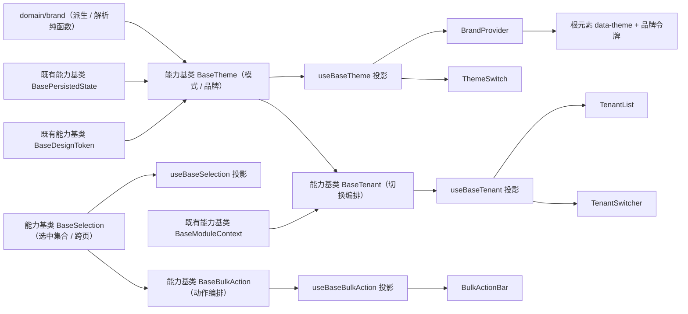

# 02 详细设计 · 批量操作与主题租户

> 前端组件库 · 08 交互类 · 嵌套子任务 03-2（需求 08-3）· 详细设计

[文档首页](../../../../../../../文档首页.md) › [08 交互类](../../../08_交互类.md) › [03 面板与工具](../../08_交互类_03_面板与工具.md) › 详细设计　|　[← 任务](../08_交互类_03_面板与工具_02_批量操作与主题租户.md)

## 1. 设计目标与范围 <a id="goal"></a>

交付五件真实能力，覆盖需求 08-3 的三条内容：**批量操作栏**（选中集合 / 跨页全选 / 动作编排 / 权限过滤 / 危险与超量确认 / 部分成功汇总 / 完成后清空）、**主题与品牌化**（亮暗跟随系统 / 品牌注入 / 品牌色派生 / 防闪烁 / 即时生效）、**租户切换**（租户列表与搜索 / 当前租户 / 切换阶段编排 / 失败回退 / 缓存失效）。

- **选中集合入链**：新增能力基类 `BaseSelection`（核心 `capabilities/selection.ts`，挂组件根），承载选中集合 / 行键 / 当前页键 / 跨页全选 / 清除，供批量操作栏、后续通用表格（`07_05`）、文件管理等复用。
- **动作编排入链**：新增能力基类 `BaseBulkAction`（继承 `BaseSelection`），承载动作定义 / 权限过滤 / 危险与超量确认 / 执行阶段 / 进度 / 部分成功汇总 / 完成后清空。
- **主题入链**：新增能力基类 `BaseTheme`（继承 `BaseDesignToken`），承载模式解析（用户 > 租户默认 > 平台默认）/ 系统偏好监听 / 品牌注入 / 品牌色派生 / 持久化衔接（复用偏好 `themeMode` 真源）。
- **租户入链**：新增能力基类 `BaseTenant`（挂组件根），承载当前租户 / 可切换列表 / 切换阶段状态机 / 失败回退 / 重试；重载步骤由宿主注入（本期占位）。
- **品牌色派生下沉核心**：`domain/brand.ts` 承载颜色解析 / 混色 / 品牌令牌派生 / 主题解析纯函数（框架无关，跨端与宿主共用，纳入契约断言）。
- **通用表格接入不在本期**：批量操作栏经外部 `v-model` 的选中集合工作，不直接依赖表格件；与「通用表格」（`07_05`，阶段六后）的接入登记为遗留。

### 1.1 口径与依从 <a id="positioning"></a>

- **架构铁律**：选中集合、批量动作编排、主题与品牌、租户切换均为**横切功能**，一律落为**继承链上的能力基类**（核心 `capabilities/`），不在链外自由挂接；具体件仅做渲染与编排投影。
- **继承链**：`BaseComponent`（组件根）→ 能力基类 → 具体件。本期新增四条链：`BaseComponent → BaseSelection → BaseBulkAction`、`BaseComponent → BaseDesignToken → BaseTheme`、`BaseComponent → BaseTenant`；能力基类依赖单向登记于 `capabilities/manifest.ts`。
- **同契约多实现**：四套能力契约由 `@bms/core/testing` 契约套件承载（本期新增 `describeBulkActionContract` / `describeThemeContract` / `describeTenantContract`，选中集合断言并入批量套件），后续移动端实现跑同一套断言。
- **占位口径**：租户切换接口（`POST /tenant/switch`）、我的租户列表（`GET /tenant/my`）、租户品牌接口（`GET /tenant/brand`）均未就绪——**切换阶段状态机与失败回退真实生效**，各阶段具体动作（取权限 / 拉菜单 / 清缓存 / 跳主页）由宿主注入钩子，未注入时该阶段视为跳过；品牌配置经 `brand` 入参注入，未注入用平台默认。
- **令牌口径**：颜色与尺寸一律消费令牌语义变量（品牌令牌经 `--bms-color-primary` 及派生态写入根元素），不硬编码色值（护栏 `guard-core-framework-agnostic` 与硬编码色值检查拦截）。
- **工时**：嵌套子任务名义 14h；因新增 4 个能力基类、5 件组件、3 套契约套件、品牌派生纯函数与开发态核对页，实际工时预估上浮，偏差在实施记录登记。

## 2. 交付物清单 <a id="deliver"></a>

| # | 交付物 | 落点 |
| --- | --- | --- |
| 1 | 选中集合能力基类（新增） | `core/src/capabilities/selection.ts` |
| 2 | 批量动作编排能力基类（新增，继承 `BaseSelection`） | `core/src/capabilities/bulk-action.ts` |
| 3 | 主题与品牌能力基类（新增，继承 `BaseDesignToken`） | `core/src/capabilities/theme.ts` |
| 4 | 租户切换能力基类（新增） | `core/src/capabilities/tenant.ts` |
| 5 | 能力依赖登记（新增 `selection` / `bulk-action` / `theme` / `tenant` 四键） | `core/src/capabilities/manifest.ts` |
| 6 | 品牌派生与主题解析纯函数 | `core/src/domain/brand.ts` |
| 7 | 核心导出面登记 | `core/src/index.ts` |
| 8 | 契约套件三套（批量 / 主题 / 租户） | `core/testing/index.ts` |
| 9 | 核心用例（品牌纯函数 / 批量 / 主题 / 租户） | `core/tests/domain-brand.spec.ts`、`core/tests/bulk-action.spec.ts`、`core/tests/theme.spec.ts`、`core/tests/tenant.spec.ts` |
| 10 | 四套基类投影 | `ui-ep/src/composables/useBaseSelection.ts`、`useBaseBulkAction.ts`、`useBaseTheme.ts`、`useBaseTenant.ts` |
| 11 | 批量操作栏壳 | `ui-ep/src/components/interaction/BulkActionBar.vue` |
| 12 | 主题切换件 | `ui-ep/src/components/interaction/ThemeSwitch.vue` |
| 13 | 品牌应用器（包裹器） | `ui-ep/src/components/interaction/BrandProvider.vue` |
| 14 | 租户切换件 | `ui-ep/src/components/interaction/TenantSwitcher.vue` |
| 15 | 租户列表件 | `ui-ep/src/components/interaction/TenantList.vue` |
| 16 | 导出面登记 | `ui-ep/src/index.ts` |
| 17 | 用例（五件 + 契约驱动） | `ui-ep/tests/interaction-bulk-theme-tenant.spec.ts` |
| 18 | 宿主接线（首屏主题预读 + 品牌与深色语义变量最小集） | `apps/desktop/src/main.ts`、`apps/desktop/src/styles/tokens.scss` |
| 19 | 开发态核对页（`vite build` 不包含） | `apps/desktop/bulk-theme-tenant-check.html`、`apps/desktop/src/dev/{bulkThemeTenantCheck.ts,BulkThemeTenantCheck.vue}` |
| 20 | 登记回写：基类清单 / 组件设计 16、17、18 / 计划 / 任务状态 | 见第 6 节 |



## 3. 接口 / 契约与边界 <a id="contract"></a>

### 3.1 核心：能力基类 `BaseSelection`（新增） <a id="selection-base"></a>

```ts
/** 选中项键（行键）。 */
export type SelectionKey = string | number

/** 选择模式。 */
export type SelectionMode = 'page' | 'cross-page'

/** 选中摘要（供操作栏显示）。 */
export interface SelectionSummary {
  /** 已选数量（跨页全选时为总记录数）。 */
  count: number
  /** 是否按条件全选（跨页）。 */
  allAcrossPages: boolean
  /** 当前查询总记录数。 */
  total: number
  /** 选择模式。 */
  mode: SelectionMode
}

export abstract class BaseSelection extends BaseComponent {
  readonly identifier: string = 'selection'
  mode: SelectionMode              // 缺省 'page'；'cross-page' 才允许跨页全选
  total: number                    // 当前查询总记录数（跨页提示用）
  pageKeys: SelectionKey[]          // 当前页行键（列表/表格注入）
  readonly selected: SelectionKey[] // 选中键集合（保序、去重）
  allAcrossPages: boolean           // 按当前条件全选标记

  get count(): number               // 跨页全选时为 total，否则为 selected.length
  get isEmpty(): boolean
  get isAllPageSelected(): boolean  // 当前页全选（pageKeys 非空且全部命中）
  get somePageSelected(): boolean   // 当前页部分选中
  get summary(): SelectionSummary

  setMode(mode: SelectionMode): void      // 切出 cross-page 时清 allAcrossPages
  setTotal(total: number): void
  setPageKeys(keys: SelectionKey[]): void // 翻页/条件变化：page 模式剔除不在当前页的键并清跨页标记
  isSelected(key: SelectionKey): boolean
  select(key: SelectionKey, selected?: boolean): void
  toggle(key: SelectionKey): void
  selectPage(): void                       // 当前页全选
  deselectPage(): void                     // 当前页取消
  invertPage(): void                       // 当前页反选
  selectAllAcrossPages(): void             // 跨页全选（进入条件全选模式）
  clear(): void                            // 清选中集合 + 清跨页标记
  replace(keys: SelectionKey[]): void      // 外部整体回写（受控入口）
}
```

| 行为 | 口径 |
| --- | --- |
| 键归一 | 键统一转字符串去重保序；`select` / `toggle` / `replace` 均按内容比较，避免受控回写回环 |
| 翻页语义 | `setPageKeys` 替换当前页键；`page` 模式剔除已不在当前页的选中项（跨页选择需切 `cross-page`）；切页清 `allAcrossPages` |
| 跨页全选 | `selectAllAcrossPages` 置 `allAcrossPages = true` 且清空显式键（只存条件语义，不全量拉取行数据）；`count` 取 `total` |
| 条件变化 | 宿主在查询条件变化时调 `setPageKeys([])` 或 `clear()`；`allAcrossPages` 随之清空（口径见组件设计 16 登记项③） |
| 空态 | `total` 为 0 或 `pageKeys` 为空时 `isAllPageSelected` 为假，`selectPage` 无效果 |
| 纯数据 | 不触 DOM、不请求、不依赖渲染框架 |

- 依赖登记：`selection: []`（无依赖，链上独立能力）。
- 基类不含渲染语义（浮出 / 吸顶、位置、文案由具体件与宿主决定）。

### 3.2 核心：能力基类 `BaseBulkAction`（新增，继承 `BaseSelection`） <a id="bulk-base"></a>

```ts
/** 动作定义。 */
export interface BulkActionDef {
  key: string
  label: string
  icon?: string
  /** 危险动作（红色 + 默认二次确认）。 */
  danger?: boolean
  /** 权限码（未注入权限能力时不过滤）。 */
  perm?: string
  /** 强制二次确认（即使非危险）。 */
  confirm?: boolean
  /** 确认文案（缺省按动作与数量生成）。 */
  confirmText?: string
  /** 超量阈值（>= 该数量强制确认；缺省取组件级阈值）。 */
  threshold?: number
  /** 处理逻辑（宿主/业务提供）。 */
  run: (context: BulkActionContext) => BulkActionResult | Promise<BulkActionResult>
}

/** 动作执行上下文。 */
export interface BulkActionContext {
  keys: SelectionKey[]
  allAcrossPages: boolean
  total: number
  setProgress(current: number, total: number): void
}

/** 动作结果（支持部分成功）。 */
export interface BulkActionResult {
  success: number
  failed: number
  failures?: { key: SelectionKey; reason: string }[]
  message?: string
}

/** 执行阶段。 */
export type BulkActionPhase = 'idle' | 'confirming' | 'running' | 'done'

export abstract class BaseBulkAction extends BaseSelection {
  readonly identifier: string = 'bulk-action'
  actions: BulkActionDef[]
  confirmThreshold: number          // 超量确认阈值（0 = 不限制）
  clearAfterDone: boolean           // 完成后清空（缺省 true）
  maxVisible: number                // 常用动作直显数（其余收进「更多」）
  phase: BulkActionPhase
  pendingActionKey: string | undefined
  progress: { current: number; total: number }
  lastResult: BulkActionResult | undefined
  access: BaseAccess | undefined    // 权限注入（缺省不过滤）
  notice: BaseNotice | undefined    // 提示注入（缺省不发通知）

  get running(): boolean
  get visibleActions(): BulkActionDef[]   // 按权限码过滤
  get hasVisibleActions(): boolean
  actionOf(key: string): BulkActionDef | undefined
  isAllowed(action: BulkActionDef): boolean
  needsConfirm(action: BulkActionDef): boolean  // danger || confirm || count >= threshold
  request(key: string): Promise<BulkActionResult | undefined>   // 确认 → 执行
  confirm(): Promise<BulkActionResult | undefined>              // 确认当前待确认动作
  cancel(): void                                                // 取消确认（阶段回 idle）
  run(key: string): Promise<BulkActionResult | undefined>        // 直接执行（跳过确认）
  applyResult(result: BulkActionResult): void                    // 汇总结果 + 通知 + 按需清空
}
```

| 行为 | 口径 |
| --- | --- |
| 空选中 | `count` 为 0 时 `request` / `run` 直接返回 `undefined`，阶段不变 |
| 权限过滤 | `visibleActions` 按 `access.has(perm)` 过滤；`perm` 缺省视为有权；未注入 `access` 不过滤 |
| 确认判定 | 危险动作、显式 `confirm`、`count >= threshold`（动作级优先，其次组件级；0 表示该级不限制）任一命中即需确认；`request` 置 `confirming` 等待 `confirm` |
| 超量确认 | 数量接近 `total`（跨页全选）时确认文案含「共 N 项」；阈值与文案由件层渲染，基类只给判定 |
| 执行阶段 | `run` 置 `running` 并重置 `progress`；`run` 抛错 / 拒绝 → 记为整体失败（`failed = count`、文案取错误信息），与正常路径统一走结果汇总（阶段 `done`）并保留 `lastResult`（实施口径收敛，见实施记录 §3-3） |
| 并发 | `running` 期间的 `request` / `run` 直接返回 `undefined`（防重复提交，件层同时禁用按钮） |
| 部分成功 | 结果汇总为「成功 X / 失败 Y」；`failures` 明细上抛宿主（明细查看归调用方）；`applyResult` 经 `notice` 提示（注入时） |
| 完成后清空 | `clearAfterDone` 为真时 `applyResult` 调 `clear()`；为假保留选中（连续操作） |
| 审计 | 逐条记录操作日志归各业务概要（本基类不实现，仅透传结果） |

- 依赖登记：`bulk-action: ['selection', 'access', 'notice']`（继承链上父基类为 `BaseSelection`，另声明 `access` / `notice` 两项协作者，均单向）。
- 长任务（批量导出 / 导入）不在本基类实现：转异步任务经 `BaseAsyncTask`，本基类只提供 `setProgress` 与结果汇总入口。

### 3.3 核心：能力基类 `BaseTheme`（新增，继承 `BaseDesignToken`） <a id="theme-base"></a>

```ts
/** 主题模式。 */
export type ThemeMode = 'light' | 'dark' | 'system'

/** 有效主题。 */
export type ResolvedTheme = 'light' | 'dark'

/** 租户品牌配置（未注入用平台默认）。 */
export interface BrandConfig {
  name?: string
  logo?: string
  favicon?: string
  primaryColor?: string
  defaultMode?: ThemeMode
  loginBg?: string
  /** 是否允许用户改强调色。 */
  allowUserAccent?: boolean
  /** 是否禁用暗色（禁用时强制亮色）。 */
  disableDark?: boolean
}

export abstract class BaseTheme extends BaseDesignToken {
  readonly identifier: string = 'theme'
  mode: ThemeMode                  // 用户模式（真源：偏好 themeMode）
  brand: BrandConfig | undefined
  accent: string | undefined       // 用户强调色（brand.allowUserAccent 为真时生效）
  followSystem: boolean            // 是否监听系统偏好（缺省 true）
  systemPrefersDark: boolean       // 系统偏好（注入或由件层写入）
  persisted: BasePersistedState | undefined  // 偏好通道（themeMode 读写）
  // 内部：用户是否显式设置过模式（setMode / attachPersisted 置位；未设置时回落租户默认与平台默认）

  get resolved(): ResolvedTheme              // 解析优先级：用户 > 品牌 defaultMode > 平台 light
  get primary(): string                      // 有效主色：accent ∩ allowUserAccent > brand.primaryColor > 令牌默认
  get brandTokens(): Record<string, string>  // deriveBrandTokens(primary) 结果（CSS 变量名 → 值）
  get canUseDark(): boolean                  // brand.disableDark 为假
  get displayMode(): ThemeMode               // 件层展示用（禁用暗色时 system 亦归一亮色展示）

  setMode(mode: ThemeMode): ResolvedTheme    // 写用户模式 + 联动 setTheme（BaseDesignToken）
  setBrand(brand: BrandConfig | undefined): ResolvedTheme
  setAccent(color: string | undefined): ResolvedTheme
  setSystemPrefersDark(value: boolean): ResolvedTheme   // 仅 followSystem 且 mode 为 system 时联动
  attachPersisted(persisted: BasePersistedState): void  // 读偏好 themeMode 并落 mode（单向读）
  syncPersisted(): boolean                   // 把 mode 写回偏好（持久化真源统一）
  toggle(): ResolvedTheme                    // 亮暗互切（system 下切到与系统相反的一侧）
  resolve(): ResolvedTheme                   // 重算并 setTheme（幂等；值未变不触发通知）
}
```

| 行为 | 口径 |
| --- | --- |
| 解析优先级 | 用户模式（`light` / `dark`）优先；用户为 `system` 时按系统偏好取 `light` / `dark`；用户**未显式设置过**（经内部标记判定，非「mode 为空串」）时回落品牌 `defaultMode`，再回落平台默认 `light` |
| 禁用暗色 | `brand.disableDark` 为真时 `resolved` 强制 `light`，`canUseDark` 为假，件层隐藏暗色选项 |
| 用户强调色 | 仅 `brand.allowUserAccent` 为真时 `accent` 参与 `primary`；否则忽略（口径见组件设计 17 登记项①） |
| 品牌派生 | `brandTokens` 由 `deriveBrandTokens(primary)` 生成（见 3.5）；核心只产出变量表，写 DOM 由件层 |
| 持久化 | 复用偏好 `themeMode`（与 `PreferencePanel` 同一真源，见决策 6）：`attachPersisted` 读、`syncPersisted` 写，核心不直接触存储 |
| 系统监听 | 核心只持 `systemPrefersDark`；`matchMedia` 订阅与降级（不可用回退 `light`）在投影层完成 |
| DOM 注入 | 核心不触 DOM——`data-theme` 写根元素、品牌 CSS 变量注入、标题与 favicon 设置由 `BrandProvider` 在件层完成 |
| 防闪烁 | 投影层提供同步 `preload()`：在应用挂载前解析并返回 `ResolvedTheme`，宿主据此写根元素属性（宿主接线见 3.13） |

- 依赖登记：`theme: ['design-token', 'persisted-state']`（父基类 `BaseDesignToken`，另持持久化通道 `BasePersistedState`，均单向）。

### 3.4 核心：能力基类 `BaseTenant`（新增） <a id="tenant-base"></a>

```ts
/** 租户摘要。 */
export interface TenantSummary {
  id: string
  name: string
  code?: string
  logo?: string
  /** 该租户下的角色名（列表展示用）。 */
  roleName?: string
}

/** 切换阶段。 */
export type TenantSwitchPhase = 'idle' | 'switching' | 'reloading' | 'clearing' | 'navigating' | 'done' | 'failed'

/** 切换编排步骤（宿主注入；未注入的步骤视为跳过）。 */
export interface TenantSwitchSteps {
  /** 换取新租户会话 / 令牌。 */
  switchSession?(tenant: TenantSummary): Promise<void>
  /** 重取用户 / 权限 / 菜单。 */
  reloadContext?(tenant: TenantSummary): Promise<void>
  /** 重取品牌（经主题能力）。 */
  reloadBrand?(tenant: TenantSummary): Promise<void>
  /** 清理缓存与页面级标签。 */
  clearCache?(tenant: TenantSummary): Promise<void>
  /** 跳转该租户默认主页。 */
  navigateHome?(tenant: TenantSummary): Promise<void>
}

export abstract class BaseTenant extends BaseComponent {
  readonly identifier: string = 'tenant'
  tenants: TenantSummary[]
  current: TenantSummary | undefined
  phase: TenantSwitchPhase
  errorMessage: string
  confirmRequired: boolean                 // 切换前二次确认（缺省 true）
  steps: TenantSwitchSteps                 // 宿主注入（本期占位可不注入）
  theme: BaseTheme | undefined             // 品牌重载协作者
  notice: BaseNotice | undefined           // 提示协作者
  context: BaseModuleContext | undefined   // 租户标识注入协作者（只读）

  get multiTenant(): boolean               // 可切换租户数 > 1（单租户隐藏入口；避让组件根 `visible` 显隐字段）
  get switching(): boolean                 // 处于切换任一中间阶段
  get canSwitch(): boolean                 // 非切换中且存在目标
  isCurrent(id: string): boolean
  tenantOf(id: string): TenantSummary | undefined
  setTenants(list: TenantSummary[]): void
  setCurrent(tenant: TenantSummary | undefined): void
  search(keyword: string): TenantSummary[]  // 名称 / 编码 / 角色包含匹配（不区分大小写）
  request(targetId: string): Promise<boolean>   // 校验 → 二次确认（件层）→ switchTo
  confirm(targetId: string): Promise<boolean>
  switchTo(targetId: string): Promise<boolean>  // 阶段推进会：switching → reloading → clearing → navigating → done
  retry(): Promise<boolean>                     // 从失败目标重试
  reset(): void                                 // 阶段回 idle、清错误（保留当前租户）
}
```

| 行为 | 口径 |
| --- | --- |
| 显示条件 | `tenants.length > 1` 才 `multiTenant`（避让组件根 `visible` 显隐字段）；单租户隐藏入口（口径见组件设计 18 §4） |
| 切换前置校验 | 目标不存在、目标即当前、`switching` 为真 → 返回 `false` 且不改状态（防重复点击） |
| 阶段推进 | `switching`（switchSession）→ `reloading`（reloadContext + reloadBrand）→ `clearing`（clearCache）→ `navigating`（navigateHome）→ `done`；未注入的步骤跳过、不视为失败 |
| 品牌重载 | 注入 `theme` 时，`reloadBrand` 阶段后调 `theme.resolve()` 重算（品牌数据由注入方写入主题能力）；未注入则跳过 |
| 失败回退 | 任一阶段抛错 → 阶段置 `failed`、写 `errorMessage`，`current` 保持原租户不变（不回写目标），经 `notice` 提示（注入时）；提供 `retry` |
| 成功后 | `current` 置目标租户、阶段置 `done`；调用方（件层）据 `done` 关闭入口加载态 |
| 缓存失效 | 清理动作由 `clearCache` 钩子承载；核心负责「阶段顺序」与「失败不污染当前租户」语义，不直接触缓存实现 |
| 租户标识 | 请求头 `X-Tenant-Id` 注入归请求层；核心经 `context`（`BaseModuleContext`）持有租户上下文引用，不自行拼请求 |

- 依赖登记：`tenant: ['module-context', 'theme', 'notice']`（父基类 `BaseComponent`，三项协作者均单向；`theme` 反向不依赖 `tenant`）。
- 审计（管理员切换进入租户）归后端与审计概要不在此实现；核心只保证切换动作可被件层透传上报。

### 3.5 核心：`domain/brand.ts`（新增纯函数） <a id="brand-domain"></a>

```ts
/** 品牌派生令牌（CSS 变量名 → 值）。 */
export interface BrandTokenMap {
  '--bms-color-primary': string
  '--bms-color-primary-hover': string
  '--bms-color-primary-active': string
  '--bms-color-primary-light': string
  '--bms-color-primary-border': string
  '--bms-color-on-primary': string
}

/** 主题解析输入。 */
export interface ThemeResolveInput {
  mode?: ThemeMode
  systemPrefersDark: boolean
  defaultMode?: ThemeMode
  disableDark?: boolean
}

parseColor(input: string): { r: number; g: number; b: number } | undefined   // #rgb / #rrggbb / rgb() / rgba()
toHex(color: { r: number; g: number; b: number }): string
luminance(color: string): number                    // 相对亮度（0 ~ 1，对比色判定用）
mixColor(from: string, to: string, weight: number): string   // weight 为 to 的占比（0 ~ 1）
lighten(color: string, amount: number): string      // 亮度提升（0 ~ 1）
darken(color: string, amount: number): string       // 亮度压暗（0 ~ 1）
isValidColor(input: string): boolean
deriveBrandTokens(primary: string): BrandTokenMap   // 非法主色回退平台默认主色
resolveThemeMode(input: ThemeResolveInput): ResolvedTheme
normalizeBrand(brand?: BrandConfig): BrandConfig    // 去空值 + 非法色值剔除
```

派生算法（写入契约断言，跨端一致）：

| 令牌 | 算法 |
| --- | --- |
| `--bms-color-primary` | 主色归一为十六进制（大写 / 一律 `#rrggbb`） |
| `--bms-color-primary-hover` | `darken(primary, 0.08)` |
| `--bms-color-primary-active` | `darken(primary, 0.16)` |
| `--bms-color-primary-light` | `mixColor(primary, '#ffffff', 0.88)` |
| `--bms-color-primary-border` | `mixColor(primary, '#ffffff', 0.68)` |
| `--bms-color-on-primary` | `luminance(primary) > 0.6 ? '#1a1a1a' : '#ffffff'` |

| 行为 | 口径 |
| --- | --- |
| 非法色值 | `parseColor` 返回 `undefined`；`deriveBrandTokens` 与 `normalizeBrand` 回退平台默认主色（`#1677ff`），不抛错 |
| 主题解析 | `disableDark` 为真直接返回 `light`；`mode` 为 `light` / `dark` 直接返回；`system` 按 `systemPrefersDark`；`mode` 未给时用 `defaultMode`，再回落 `light` |
| 幂等 | 纯函数无副作用，同输入同输出（契约断言固定样例取值） |

### 3.6 契约套件（`@bms/core/testing`） <a id="testing"></a>

| 套件 | 契约面（结构化接口） | 断言要点 |
| --- | --- | --- |
| `describeBulkActionContract(name, create)` | `mode` / `total` / `count` / `selected` / `allAcrossPages` / `setPageKeys` / `select` / `toggle` / `selectPage` / `invertPage` / `selectAllAcrossPages` / `clear` / `actions` / `visibleActions` / `needsConfirm` / `request` / `confirm` / `cancel` / `run` / `phase` / `progress` / `lastResult` / `clearAfterDone` | 选中按内容去重保序；`page` 模式翻页剔除不在当前页的键；跨页全选后 `count` 取 `total` 且条件变化清空；权限过滤生效（无权动作不出现在 `visibleActions`）；危险 / 显式 / 超量三类触发确认；`running` 期间重复请求返回 `undefined`；执行抛错记失败且阶段回 `idle`；部分成功汇总成功 / 失败数并保留明细；`clearAfterDone` 为真时结果后清空 |
| `describeThemeContract(name, create)` | `mode` / `brand` / `accent` / `systemPrefersDark` / `resolved` / `primary` / `brandTokens` / `canUseDark` / `setMode` / `setBrand` / `setAccent` / `setSystemPrefersDark` / `toggle` / `syncPersisted` | 解析优先级（用户 > 品牌默认 > 平台）；`system` 随系统偏好切换；`disableDark` 强制亮色；`accent` 仅在 `allowUserAccent` 为真时生效；主色变更后派生令牌随之变化（六项齐全）；`setTheme` 联动（经 `theme` 与 `onThemeChange`）；`syncPersisted` 写回偏好键 `themeMode` |
| `describeTenantContract(name, create)` | `tenants` / `current` / `phase` / `multiTenant` / `switching` / `isCurrent` / `search` / `setTenants` / `setCurrent` / `request` / `confirm` / `switchTo` / `retry` / `reset` | 单租户 `multiTenant` 为假；搜索按名称 / 编码 / 角色匹配；切换阶段依序推进（`switching → reloading → clearing → navigating → done`）；未注入步骤跳过；中段失败置 `failed` 且 `current` 保持原租户；`retry` 从失败目标重试成功；`switching` 中重复请求返回 `false`；`reset` 归 `idle` |

- 套件同时被 `ui-ep`（投影适配）与后续移动端实现消费；本期无第二实现时由 `ui-ep` 用例驱动。

### 3.7 投影（`ui-ep/src/composables/`） <a id="bindings"></a>

```ts
// useBaseSelection：选中集合投影
export interface UseBaseSelectionOptions { mode?: SelectionMode; total?: number; pageKeys?: SelectionKey[]; selected?: SelectionKey[] }
export interface UseBaseSelectionResult {
  selection: BaseSelection
  selected: Ref<SelectionKey[]>
  count: Ref<number>
  summary: Ref<SelectionSummary>
  isAllPageSelected: Ref<boolean>
  somePageSelected: Ref<boolean>
  setPageKeys(keys: SelectionKey[]): void
  select(key: SelectionKey, selected?: boolean): void
  toggle(key: SelectionKey): void
  selectPage(): void; invertPage(): void; clear(): void
  selectAllAcrossPages(): void
  replace(keys: SelectionKey[]): void
}

// useBaseBulkAction：动作编排投影
export interface UseBaseBulkActionOptions extends UseBaseSelectionOptions {
  actions?: BulkActionDef[]
  confirmThreshold?: number
  clearAfterDone?: boolean
  maxVisible?: number
  access?: BaseAccess
  notice?: BaseNotice
}
export interface UseBaseBulkActionResult extends UseBaseSelectionResult {
  bulk: BaseBulkAction
  visibleActions: Ref<BulkActionDef[]>
  phase: Ref<BulkActionPhase>
  running: Ref<boolean>
  progress: Ref<{ current: number; total: number }>
  lastResult: Ref<BulkActionResult | undefined>
  needsConfirm(action: BulkActionDef): boolean
  request(key: string): Promise<BulkActionResult | undefined>
  confirm(): Promise<BulkActionResult | undefined>
  cancel(): void
  run(key: string): Promise<BulkActionResult | undefined>
}

// useBaseTheme：主题与品牌投影（含系统监听与 DOM 注入辅助）
export interface UseBaseThemeOptions {
  mode?: ThemeMode
  brand?: BrandConfig
  followSystem?: boolean
  persisted?: BasePersistedState          // 偏好通道（themeMode 真源）
  mediaQuery?: string                     // 缺省 '(prefers-color-scheme: dark)'
}
export interface UseBaseThemeResult {
  theme: BaseTheme
  mode: Ref<ThemeMode>
  resolved: Ref<ResolvedTheme>
  primary: Ref<string>
  brandTokens: Ref<Record<string, string>>
  canUseDark: Ref<boolean>
  setMode(mode: ThemeMode): void
  setBrand(brand?: BrandConfig): void
  setAccent(color?: string): void
  toggle(): ResolvedTheme
  applyToElement(target?: HTMLElement): void   // 写 data-theme + 品牌变量
  preload(): ResolvedTheme                     // 挂载前同步解析（防闪烁）
}

// useBaseTenant：租户切换投影
export interface UseBaseTenantOptions {
  tenants?: TenantSummary[]
  current?: TenantSummary
  steps?: TenantSwitchSteps
  confirmRequired?: boolean
  theme?: BaseTheme
  notice?: BaseNotice
  context?: BaseModuleContext
}
export interface UseBaseTenantResult {
  tenant: BaseTenant
  tenants: Ref<TenantSummary[]>
  current: Ref<TenantSummary | undefined>
  phase: Ref<TenantSwitchPhase>
  errorMessage: Ref<string>
  multiTenant: Ref<boolean>
  switching: Ref<boolean>
  setTenants(list: TenantSummary[]): void
  search(keyword: string): TenantSummary[]
  request(targetId: string): Promise<boolean>
  confirm(targetId: string): Promise<boolean>
  switchTo(targetId: string): Promise<boolean>
  retry(): Promise<boolean>
  reset(): void
}
```

- 系统主题监听在**投影层**承载（`matchMedia` + 变更订阅），经异步资源登记，卸载自动清理；`matchMedia` 不可用时回退 `light` 且不抛错。核心基类保持同步纯逻辑。
- `applyToElement` 缺省目标 `document.documentElement`：写 `data-theme`（`resolved`）与品牌令牌（`--bms-*`），并设置 `document.title`（品牌 `name`）与 favicon（品牌 `favicon`，404 降级不报错）。

### 3.8 `BulkActionBar` 操作栏壳契约 <a id="bulk-bar"></a>

| 面 | 内容 |
| --- | --- |
| 数据面 | `selected`（选中集合，`v-model:selected`）/ `actions`（动作定义）/ `total`（总记录数）/ `mode`（`page` / `cross-page`）/ `rowKey`（缺省 `id`）/ `pageKeys`（当前页键）/ `confirmThreshold`（缺省 0）/ `clearAfterDone`（缺省 `true`）/ `maxVisible`（常用直显数，缺省 3）/ `position`（`float` 浮出 / `sticky` 吸顶，缺省 `float`）/ `permChecker`（权限判定注入）/ `notice`（提示注入） |
| 事件 | `update:selected` / `update:pageKeys` / `action`（`{ key, keys, allAcrossPages }`）/ `done`（`BulkActionResult`，含部分成功明细）/ `clear` / `progress`（`{ current, total }`）/ `select-all-across` |
| 对外能力 | `clear()` / `run(key)` / `selectAllAcrossPages()` / `count`（`defineExpose`） |
| 插槽 | 默认（自定义动作区）/ `#summary`（选中数提示替换）/ `#actions`（动作按钮整体替换）/ `#extra`（右侧扩展区） |
| 行为 | 无选中时不渲染（`v-if`）；显示「已选 N 项」；`cross-page` 且非全选时显示「可全选本条件下共 M 项」入口；常用动作直显 + 其余收「更多」下拉；危险动作标注并在件内确认区二次确认（不引入基础件之外的依赖）；超量确认含数量与影响；权限过滤后无可显示动作时隐藏动作区；运行时按钮禁用 + 进度展示；完成后上抛 `done`（含部分成功明细）由宿主提示；受控回写按内容比较避免回环 |

### 3.9 `ThemeSwitch` 主题切换件契约 <a id="theme-switch"></a>

| 面 | 内容 |
| --- | --- |
| 数据面 | `modelValue`（`ThemeMode`，`v-model`）/ `variant`（`icon` 图标 / `segment` 分段 / `list` 列表，缺省 `icon`）/ `showAccent`（是否显示强调色选择，缺省 `false`）/ `accent`（`v-model:accent`）/ `canUseDark`（缺省 `true`）/ `disabled` |
| 事件 | `update:modelValue` / `update:accent` / `change`（`{ mode, resolved }`） |
| 插槽 | `#icon`（自定义触发图标）/ 默认（列表形态内容） |
| 行为 | 三形态渲染（图标点击展开下拉 / 分段直选 / 列表）；`system` 选项按当前系统偏好显示解析结果；`canUseDark` 为假时隐藏暗色选项（`system` 归一亮色展示）；切换即时生效（写偏好 + `applyToElement`），不刷新页面 |

### 3.10 `BrandProvider` 品牌应用器契约 <a id="brand-provider"></a>

| 面 | 内容 |
| --- | --- |
| 数据面 | `brand`（品牌配置）/ `mode`（`v-model:mode`，写用户偏好）/ `followSystem`（缺省 `true`）/ `persisted`（偏好通道注入）/ `applyTitle`（是否设置文档标题，缺省 `true`）/ `applyFavicon`（缺省 `true`）/ `restoreOnUnmount`（卸载是否还原，缺省 `false`）/ `loading` |
| 事件 | `update:mode` / `applied`（`{ resolved, primary }`）/ `brand-error`（品牌资源 404 等降级） |
| 插槽 | 默认（应用内容）/ `#fallback`（品牌解析中或失败时的兜底） |
| 行为 | 包裹应用根；**挂载前**（`setup` 同步）经 `preload()` 解析主题并写根元素 `data-theme`，避免首屏闪白 / 闪黑；`brand` 变更即时应用（标题 / favicon / 品牌令牌 / 根属性）；主题模式变更即时生效；品牌资源 404 降级为平台默认且发 `brand-error`；卸载时按 `restoreOnUnmount` 还原根属性 |

### 3.11 `TenantSwitcher` 租户切换件契约 <a id="tenant-switcher"></a>

| 面 | 内容 |
| --- | --- |
| 数据面 | `current`（当前租户）/ `tenants`（可切换列表）/ `confirm`（切换是否二次确认，缺省 `true`）/ `variant`（`dropdown` 下拉 / `popover` 弹层，缺省 `dropdown`）/ `searchable`（缺省 `true`）/ `pageSize`（租户多时分页，缺省 0 不分页）/ `steps`（切换步骤注入）/ `theme`（品牌重载协作者）/ `notice`（提示注入） |
| 事件 | `switch`（目标租户，确认前）/ `switched`（目标租户，完成后）/ `failed`（`{ target, message }`） |
| 对外能力 | `open()` / `close()` / `switchTo(id)` / `retry()`（`defineExpose`） |
| 插槽 | 默认（入口内容替换）/ `#item`（租户项自定义，转发 `TenantList`）/ `#empty`（无租户兜底） |
| 行为 | `tenants.length <= 1` 时整体不渲染（单租户隐藏）；入口显示当前租户名（+ Logo）；展开下拉内嵌 `TenantList`；切换前二次确认（提示「将重新加载，未保存修改将丢失」）；切换中入口加载态 + 禁用（防重复点击）；成功后关闭下拉；失败提示并保留原租户（可重试） |

### 3.12 `TenantList` 租户列表件契约 <a id="tenant-list"></a>

| 面 | 内容 |
| --- | --- |
| 数据面 | `tenants`（必填）/ `currentId`（当前租户标识）/ `keyword`（`v-model:keyword` 搜索词）/ `searchable`（缺省 `true`）/ `pageSize`（缺省 0 不分页）/ `loading` / `emptyText`（缺省「暂无可用租户」） |
| 事件 | `update:keyword` / `select`（租户项）/ `page-change`（页码） |
| 插槽 | `#item`（单项替换，参数为租户）/ `#empty`（空态替换） |
| 行为 | 经租户能力投影挂链（列表归一与关键词过滤复用能力，不直接依赖其它件）；名称 / 编码 / 角色关键词过滤（不分大小写）；当前租户高亮 + 勾选标记；点击即选中（自身点击不发 `select`）；`pageSize > 0` 时本地分页（自绘分页条）；展示名称 / 编码 / 角色 / Logo（缺失用首字母占位）；空态可替换；可独立复用于「租户管理 / 全量租户浏览」页面 |

### 3.13 宿主接线与开发态核对页 <a id="host"></a>

- **首屏主题预读（防闪烁）**：`apps/desktop/src/main.ts` 顶部同步执行——读 `localStorage` 偏好键 `bms_preferences` 的 `themeMode`（解析失败降级 `light`）→ 经 `resolveThemeMode` 解析 → 写 `document.documentElement.dataset.theme`；再挂载应用。**不新增内联脚本**（沿用 01 任务已定的本地存储键与解析路径）。
- **令牌与深色语义变量最小集**：`apps/desktop/src/styles/tokens.scss` 补 `[data-theme='dark']` 下的背景 / 文本 / 边框三组语义变量与品牌变量占位（`--bms-color-primary*` 由运行时注入覆盖）；**完整深色令牌与组件样式适配登记为遗留**（见第 7 节）。
- **开发态核对页**：`apps/desktop/bulk-theme-tenant-check.html`（仅开发态入口，`vite build` 只构建 `index.html`，故不入产物）+ `src/dev/bulkThemeTenantCheck.ts` + `src/dev/BulkThemeTenantCheck.vue`；页面内容：`BulkActionBar`（示例动作：批量启停 / 批量删除（危险 + 确认）/ 批量导出（进度）+ 跨页全选提示）+ `ThemeSwitch` 三形态 + `BrandProvider`（品牌主色与 Logo 即时预览）+ `TenantSwitcher` + `TenantList`（搜索 / 分页）。
- 交互自检上屏（`data-check` 断言项）：无选中隐藏 / 已选数展示 / 危险动作二次确认 / 超量确认 / 权限过滤隐藏 / 跨页全选计数 / 进度反馈 / 部分成功汇总 / 完成后清空 / 主题即时生效（根元素 `data-theme`）/ 品牌色派生六项 / 品牌资源 404 降级 / 租户搜索与当前标记 / 切换阶段推进 / 切换失败回退 / 单租户隐藏。

## 4. 失败分支与边界 <a id="edge"></a>

| 边界 / 失败场景 | 处置 |
| --- | --- |
| 无选中项 | 操作栏不渲染；`request` / `run` 返回 `undefined`，阶段不变 |
| 选中项在执行前被删除 | 后端返回失败明细，归入 `failures`；汇总提示「成功 X / 失败 Y」 |
| 跨页全选后翻页 / 改条件 | `setPageKeys` 清 `allAcrossPages`；件层提示需重新全选 |
| `cross-page` 未开启时跨页选择 | 翻页剔除不在当前页的键（`page` 模式语义），件层不可发起跨页全选 |
| 权限不足 | 动作从 `visibleActions` 过滤（不渲染）；后端仍按数据范围校验，越权项进 `failures` |
| 超量选择 | 命中阈值强制确认（文案含「共 N 项」）；未设阈值则不强制 |
| 动作重复触发 | `running` 期间 `request` / `run` 返回 `undefined`；件层按钮禁用 |
| 执行抛错 / 拒绝 | 记为整体失败（`failed = count`），阶段回 `idle`，保留 `lastResult` 供件层提示 |
| 部分成功 | 汇总成功 / 失败数，`failures` 明细透传宿主；不清空选择可配 |
| 长任务未完成即离开 | 转后台任务与通知归异步任务能力（不在本基类）；件层只显示进度 |
| 非法品牌色值 | `deriveBrandTokens` 回退平台默认主色并告警，不抛错 |
| 品牌资源 404 | Logo / favicon 降级为平台默认，发 `brand-error`，不阻断应用 |
| 租户禁用暗色 | `resolved` 强制 `light`，切换件隐藏暗色选项 |
| 系统主题不可监停（`matchMedia` 缺失） | 回退 `light`，`system` 模式仍可用（不动态） |
| 用户强调色 vs 租户主色 | 仅 `allowUserAccent` 为真时强调色生效，否则以品牌主色为准 |
| 登录前后主题不一致 | 登录后按用户偏好覆盖（宿主在拉取偏好后 `setMode` + `applyToElement`） |
| 租户切换失败 | 阶段置 `failed`，`current` 保持原租户，提示并支持 `retry` |
| 重载阶段部分失败 | 归 `failed`（任一阶段失败即整体失败）；按 `retry` 从失败目标重试 |
| 切换中重复点击 | `switching` 为真时 `request` 返回 `false`，入口加载态禁用 |
| 目标租户无对应路由权限 | 深链不可达时由 `navigateHome` 回默认主页（步骤注入方负责判定） |
| 单租户 | `visible` 为假，切换件整体不渲染 |
| 租户列表为空 | 列表显示空态（可替换插槽），切换入口隐藏 |
| 品牌未配置 | 用平台默认（标题 / 主色 / 无 Logo），不报错 |

## 5. 测试设计与验收映射 <a id="test"></a>

| 验收点（需求 08-3 / 任务 03-2） | 用例 |
| --- | --- |
| 选中集合（去重保序 / 翻页剔除 / 反选 / 清除） | `core/tests/bulk-action.spec.ts` + `ui-ep/tests/interaction-bulk-theme-tenant.spec.ts` |
| 跨页全选与条件变化清空 | 同上 |
| 动作权限过滤（无权不渲染） | 同上 |
| 危险 / 显式 / 超量三类二次确认 | 同上 |
| 执行阶段 / 进度 / 并发防重 | 同上 |
| 部分成功汇总与失败明细透传 | 同上 |
| 完成后清空（可配保留） | 同上 |
| 主题解析优先级（用户 > 品牌 > 平台） | `core/tests/theme.spec.ts` + `ui-ep` 用例（jsdom 断言 `document.documentElement.dataset.theme`） |
| 系统偏好跟随与不可用降级 | 同上 |
| 禁用暗色 / 强调色生效条件 | 同上 |
| 品牌色派生六项令牌（固定样例） | `core/tests/domain-brand.spec.ts` |
| 主题持久化与偏好真源一致 | 同上 + `ui-ep` 用例 |
| 免刷新即时生效（仅改根属性 / 变量） | `ui-ep` 用例 |
| 品牌注入（标题 / favicon / 变量）+ 404 降级 | 同上 |
| 租户列表搜索 / 当前标记 / 分页 | `core/tests/tenant.spec.ts` + `ui-ep` 用例 |
| 切换阶段推进与未注入步骤跳过 | 同上 |
| 切换失败回退（当前租户不变）与重试 | 同上 |
| 单租户隐藏 / 切换防重复 | 同上 |
| 契约套件三套通过 | `ui-ep/tests/interaction-bulk-theme-tenant.spec.ts` 驱动 `@bms/core/testing` 三套件 |
| 开发态核对页自检项全绿 | `--dump-dom` 断言 + 实施记录对照表 |
| `vue-tsc`、ESLint、Vitest 全通过 | 根 `pnpm run check` + 宿主 `vue-tsc -b` / `lint` / `test:cov` / `build` / `budget` |

- Kiwi 用例 1 条（一任务一条，编号于测试步登记后回填，预计 765；分类「平台骨架」、优先级 P2、状态 CONFIRMED、标签「自动化」）。

## 6. 登记落点 <a id="register"></a>

| 内容 | 落点 |
| --- | --- |
| 新增能力基类 `BaseSelection`（能力键 `selection`） | 《[前端基类清单](../../../../../../../前端基类清单.md)》§2.1 插入行（父基类 `BaseComponent`，状态「已交付」，后续编号顺延）+ §5.2 能力基类表 + `capabilities/manifest.ts` |
| 新增能力基类 `BaseBulkAction`（能力键 `bulk-action`） | 同上（父基类 `BaseSelection`；依赖 `selection` / `access` / `notice`） |
| 新增能力基类 `BaseTheme`（能力键 `theme`） | 同上（父基类 `BaseDesignToken`；依赖 `design-token` / `persisted-state`） |
| 新增能力基类 `BaseTenant`（能力键 `tenant`） | 同上（父基类 `BaseComponent`；依赖 `module-context` / `theme` / `notice`） |
| 领域纯函数 `domain/brand.ts` | 同上 §9「核心」（`domain/` 领域纯函数） |
| 组件落点 | 同上 §9「PC 插件」（`components/interaction/` 五件） |
| 投影落点 | 同上 §9（`useBaseSelection` / `useBaseBulkAction` / `useBaseTheme` / `useBaseTenant`） |
| 契约套件 | 同上 §9（`core/testing/`：批量 / 主题 / 租户三套） |
| 设计口径回写（冲突修复） | 《组件设计》[16 批量操作栏](../../../../../../../设计/组件设计/08_交互类/16_组件设计_批量操作栏/16_组件设计_批量操作栏.md)、[17 主题与品牌化](../../../../../../../设计/组件设计/08_交互类/17_组件设计_主题与品牌化/17_组件设计_主题与品牌化.md)、[18 租户切换](../../../../../../../设计/组件设计/08_交互类/18_组件设计_租户切换/18_组件设计_租户切换.md)：继承链行改现行口径（组件根 → 能力基类 → 具体件）、去掉英文类名与「能力类」表述（决策 12） |
| 任务 / 父任务 / 域任务 / 计划状态 | [任务](../08_交互类_03_面板与工具_02_批量操作与主题租户.md)、[父任务](../../08_交互类_03_面板与工具.md)、[域任务](../../../08_交互类.md)、[计划](../../../../../../../项目/04_前端组件库/计划/01_计划_前端组件库.md)（嵌套子任务并入父任务行，窗口按实际回写，§4 甘特同步） |
| 需求文档 | 不承载进度（状态只在任务与计划两处一致）；遗留归口写在实施 / 测试记录与计划 |

## 7. 边界与开放项 <a id="open"></a>

- **不在本期**：与通用表格（`07_05`）的选中集合联动（本期经外部 `v-model` 工作，接入随 `07_05`）；批量导出 / 导入的长任务转异步（经 `BaseAsyncTask`，随 `08_05`）；租户切换的真实接口联调（`GET /tenant/my`、`POST /tenant/switch`，随阶段七 RBAC 与阶段八）；品牌接口（`GET /tenant/brand`）与租户品牌配置存储（随阶段八「租户管理」）；**完整深色令牌与全量组件深色样式适配**（本期只落背景 / 文本 / 边框最小语义组与品牌变量）；审计日志（逐条记录归各业务概要）。
- **上游登记待确认**（组件设计 16 / 17 / 18 已列）：① 列表页「批量操作」细则；② 批量操作审计；③ 跨页（全选）选择语义；④ 主题解析与品牌优先级；⑤ 品牌令牌覆盖；⑥ 租户品牌配置字段；⑦ 我的租户与切换接口；⑧ 租户切换入口；⑨ 切换重载与租户标识——本任务只落组件契约，不代上游裁决。
- **协同契约**：`BulkActionBar` 不内置业务动作实现（`actions[].run` 由调用方提供）；`TenantSwitcher` 的重载步骤（取权限 / 拉菜单 / 清缓存 / 跳主页）由宿主注入，未注入视为跳过；`BrandProvider` 不拉取品牌接口（品牌数据由宿主传入，拉取归宿主与「租户管理」联调）。
- **遗留登记**：`page` 模式翻页剔除语义在通用表格接入时可能需扩展（跨页勾选记忆），随 `07_05` 复核；品牌派生算法与《布局设计 · 设计令牌》登记项②对齐后如有调整，回写 `domain/brand.ts` 与契约断言。
- Kiwi 用例编号于测试步登记后回填实施 / 测试记录与用例文件（预计 765）。

## 8. 决策记录 <a id="decision"></a>

| # | 决策项 | 结论 |
| --- | --- | --- |
| 1 | 选中集合 / 跨页全选落点 | 新增能力基类 `BaseSelection`（挂组件根） |
| 2 | 批量动作编排落点 | 新增能力基类 `BaseBulkAction`（继承 `BaseSelection`） |
| 3 | 主题与品牌化落点 | 新增能力基类 `BaseTheme`（继承 `BaseDesignToken`） |
| 4 | 租户切换落点 | 新增能力基类 `BaseTenant`（挂组件根，依赖 `module-context` / `theme` / `notice`） |
| 5 | 交付件清单 | 五件：`BulkActionBar` / `ThemeSwitch` / `BrandProvider` / `TenantSwitcher` / `TenantList` |
| 6 | 主题持久化 | 复用偏好 `themeMode`（偏好面板与主题切换件同一真源） |
| 7 | 品牌色派生 | 核心落纯函数 `deriveBrandTokens`（框架无关、跨端复用、纳入契约断言） |
| 8 | 租户切换重载编排 | 件内阶段状态机 + 重载步骤宿主注入（本期占位跳过） |
| 9 | 契约套件 | 三套：`describeBulkActionContract` / `describeThemeContract` / `describeTenantContract` |
| 10 | 通用表格接入 | 本期只自身可用（外部 `v-model`），表格联动列遗留随 `07_05` |
| 11 | 开发态核对页 | 做（`vite build` 不包含） |
| 12 | 组件设计 16 / 17 / 18 旧口径 | 回写为 Base 继承链表述、去掉英文类名与「能力类」表述 |
| 13 | 用例与 Kiwi | 单文件 `interaction-bulk-theme-tenant.spec.ts` + 一条用例（预计 765） |
| 14 | 宿主接线范围 | 首屏主题预读（`main.ts`）+ 深色语义变量最小集（`tokens.scss`）；完整深色适配遗留 |
| 15 | 实施期偏差回写 | `BaseTenant.visible` → `multiTenant`（避让组件根字段）；`BaseTheme` 增「用户显式设置」内部标记；动作执行异常统一走结果汇总（阶段 `done`）；投影选项补初始 `selected`；件内交互自绘（不引入基础件之外的依赖）；详见[实施记录 §3](../实施/01_实施_02_批量操作与主题租户.md) |

## 9. 参考文档 <a id="ref"></a>

- [需求 08-3](../../../../../需求/08_需求_交互类.md#r08-3)、[任务 03-2](../08_交互类_03_面板与工具_02_批量操作与主题租户.md)、[父任务 03 面板与工具](../../08_交互类_03_面板与工具.md)
- 《组件设计》[16 批量操作栏](../../../../../../../设计/组件设计/08_交互类/16_组件设计_批量操作栏/16_组件设计_批量操作栏.md)、[17 主题与品牌化](../../../../../../../设计/组件设计/08_交互类/17_组件设计_主题与品牌化/17_组件设计_主题与品牌化.md)、[18 租户切换](../../../../../../../设计/组件设计/08_交互类/18_组件设计_租户切换/18_组件设计_租户切换.md)（均含可交互原型，原型即验收基准）
- 《布局设计》[列表页](../../../../../../../设计/布局设计/07_布局设计_列表页.html)、[主题与租户品牌化](../../../../../../../设计/布局设计/03_布局设计_主题与租户品牌化.html)、[设计令牌](../../../../../../../设计/布局设计/02_布局设计_设计令牌.html)、[导航](../../../../../../../设计/布局设计/05_布局设计_导航.html)
- [《前端基类清单》](../../../../../../../前端基类清单.md)、[《前端开发规范》](../../../../../../../规范/前端开发规范.md)、[《文档生成规范》](../../../../../../../规范/文档生成规范.md)
- [计划 · 前端组件库](../../../../../../../项目/04_前端组件库/计划/01_计划_前端组件库.md)

> 本文档依《[文档生成规范](../../../../../../../规范/文档生成规范.md)》编写
