# 03 实施 · 打印与导出 PDF

> 前端组件库 · 08 交互类 · 嵌套子任务 03-3（需求 08-3）· 实施记录

[文档首页](../../../../../../../文档首页.md) › [08 交互类](../../../08_交互类.md) › [03 面板与工具](../../08_交互类_03_面板与工具.md) › 实施记录　|　[← 详细设计](../设计/01_详细设计_03_打印与导出PDF.md)　[测试记录 →](../测试/01_测试_03_打印与导出PDF.md)

## 1. 信息 

| 项 | 值 |
| --- | --- |
| 任务 | 08-3-3 打印与导出 PDF（[任务](../08_交互类_03_面板与工具_03_打印与导出PDF.md)） |
| 详细设计 | [01_详细设计_03_打印与导出PDF.md](../设计/01_详细设计_03_打印与导出PDF.md)（定稿提交 `2e2b9c87`） |
| 实施日期 | 2026-09-19 |
| Kiwi 用例 | 766（分类「平台骨架」/ P2 / CONFIRMED / 标签「自动化」） |
| 交付件 | 2 个能力基类 + 1 份领域纯函数（打印数据模型与分页）+ 1 套契约套件 + 2 套投影 + 3 件组件 + 宿主打印令牌组与开发态核对页 |

```mermaid
flowchart LR
    A["Kiwi 用例登记（766）"] --> B["领域纯函数 domain/print（纸张 / 行容量 / 预分页 / 字段分行 / 汇总 / 页脚 / 色调 / 单元格格式化）"]
    B --> C["能力基类 BasePrintTemplate（模板 / 数据 / 纸张 / 黑白 / 水印 / 上下文）"]
    C --> D["能力基类 BasePrint（预览 / 缩放 / 批量 / 导出阶段 / 失败重试）"]
    D --> E["登记与导出（manifest 两键 + 核心导出面 + 清单登记）"]
    E --> F["契约套件 describePrintContract + 核心用例 35 条"]
    F --> G["ui-ep 投影两套 + 三件组件（print/ 新目录）"]
    G --> H["ui-ep 用例 29 条（契约驱动 + 三件）"]
    H --> I["宿主打印令牌组 + 开发态核对页（12 项自检）"]
    I --> J["门禁验证 + 登记回写"]
```

## 2. 过程 

1. **Kiwi 先行**：按《测试规范》先登记用例（Django shell 批量登记），取得编号 **766** 后再写自动化代码，用例文件首行标注 `// kiwi_id: 766`。
2. **领域纯函数**：`domain/print.ts` 落打印数据模型（模板 / 字段 / 明细列 / 页）与纯函数——纸张解析（横向交换宽高、自定义回落 A4）、行容量（至少 1 行）、预分页（模板级容量优先，其次按纸张与行高）、字段分行、数值汇总、页脚文案、色调解析、样式变量名表与单元格格式化（文本 / 金额 / 数字 / 日期 / 时间，缺失回落占位）。
3. **能力基类两条链**：`BasePrintTemplate`（模板定义 / 数据装配 / 纸张与方向 / 黑白 / 水印 / 打印上下文 / 单元格格式化，持水印与语言上下文两个协作者）→ `BasePrint`（预览显隐与缩放 / 模板选择 / 批量逐份·合并 / 浏览器打印阶段 / 导出与批量任务 / 进度 / 失败重试 / 导出许可与权限过滤，持异步任务 / 权限 / 提示三个协作者）。
4. **登记与导出**：`capabilities/manifest.ts` 新增 `print-template: ['watermark', 'locale']` 与 `print: ['print-template', 'async-task', 'access', 'notice']`；`core/src/index.ts` 追加能力基类、领域函数与类型导出；《前端基类清单》§2.1 插入 41 / 42 两行（原 41 ~ 66 顺延至 43 ~ 68）、§2 继承链总览、§5.2 能力基类表与 §9 落点同步。
5. **契约套件**：`describePrintContract` 覆盖模板选择与纸张方向、预分页页码连续、字段缺失占位、水印与黑白、缩放夹取、导出占位（未注入不动作）、阶段推进、失败重试、并发防重与导出许可共 11 组断言。
6. **核心用例**：`domain-print.spec.ts`（15 条）+ `print.spec.ts`（20 条），含异步任务协作（进度回传与失败处置）与提示上抛。
7. **插件层**：投影 `useBasePrintTemplate` / `useBasePrint`（薄适配 + `markRaw(toRaw())` 隔离跨实例基类对象）；三件组件落 `components/print/`——`PrintSheet`（单页纸：页眉 / 标题 / 字段区 / 明细表每页重复表头 / 汇总 / 签章 / 页脚 / 水印层）、`PrintPreview`（预览壳：工具栏 + 多页 + 空态 + 打印 / 导出 / 批量 + 进度与失败重试）、`PrintButton`（入口下拉：打印预览 / 浏览器打印 / 导出 PDF / 批量打印）；`utils/printWindow.ts` 收口浏览器打印调用（件层 DOM 语义唯一落点）。
8. **宿主接线**：`tokens.scss` 新增打印令牌组（纸面底色 / 文本 / 页边距 / 字号 / 行高 / 线宽 / 水印色 / 黑白滤镜）与 `@media print` 的 `@page` 页边距；`tokens.spec.ts` 补令牌组断言；开发态核对页 `print-export-check.html` + `src/dev/{printExportCheck.ts,PrintExportCheck.vue}`（12 项自检上屏，`vite build` 不含）。

## 3. 问题与处置 

| # | 问题 | 处置 |
| --- | --- | --- |
| 1 | 单页纸汇总口径错位：纸面只持有本页明细，汇总按本页求和（首页 1,300.00 而非全单 4,220.00） | `PrintSheet` 增加「全量明细」入参（`rows`，缺省回落本页明细）：渲染用页明细、汇总取全量；预览壳透传整单明细 |
| 2 | 预览工具栏「方向 / 水印」切换误读 `props`（宿主未接 `v-model` 时被回退，方向切换把纸张重置回 A4） | 方向切换改用内部投影态（`paper`）；水印开关改用投影返回的 `watermarkEnabled` 响应式面；对外仍上抛受控事件 |
| 3 | 缩放步进出现浮点误差（`0.6 + 0.1 = 0.7000000000000001`） | `BasePrint.setZoom` 夹取后归一到两位小数（回写详细设计 §3.3） |
| 4 | `useBasePrint` 初版未把选项透传给模板投影，编排实例模板集为空（预览不渲染纸面） | 模板投影改为接收完整选项（`useBasePrintTemplate(options)`） |
| 5 | `PrintSheet` 字段区渲染为占位：预览未向纸面传主表字段值 | `PrintSheet` 增加 `fields` 入参，预览壳透传 `data.fields` |
| 6 | 导出项就绪态缺失：未注入处理时导出按钮仍可点击 | 预览壳与入口件补 `exportReady` 判定（未就绪禁用并提示「导出未就绪（占位）」），基类占位语义不变（不请求、返回 `undefined`） |
| 7 | 水印文案口径落地：宿主传入的是用户 / 租户文案，单据级标签需与能力真源拼接 | 预览壳以内联水印能力承接宿主文案，交基类按「单据级标签 · 用户 / 租户信息」拼接后渲染（回写详细设计 §3.7） |
| 8 | 核对页「导出结果」断言取 `fileId`，实际件层展示 `fileName` 优先 | 断言按展示口径校正为文件名；核对页 12 项自检全绿 |
| 9 | 《前端基类清单》§2 继承链总览遗漏 `08_03_01` / `08_03_02` 新增的五项能力基类（向导 / 选中集合 / 批量动作 / 主题 / 租户） | 本次一并补记（同一条目含本任务两项），消除总览与 §2.1 全量表的口径漂移 |

## 4. 验证 

| 命令 | 结果 |
| --- | --- |
| `pnpm run core:typecheck` / `core:lint` | 通过 |
| `pnpm run core:test` | 37 文件 / 257 用例全绿（本次新增 35） |
| `pnpm run check`（core + vue + ui-ep） | 37 + 2 + 37 文件 / 606 用例全绿（ui-ep 本次新增 29） |
| 宿主 `pnpm exec vue-tsc -b` / `pnpm run lint` | 通过 |
| 宿主 `pnpm run test:cov` | 通过（全库行覆盖 87.61%；`tokens.scss` 打印令牌组断言纳入） |
| 宿主 `pnpm run build` / `pnpm run budget` | 通过（合计 121.1 KB / 预算 260 KB；最大单文件 102.3 KB / 预算 150 KB） |
| 开发态核对页（chromium headless `--dump-dom`） | 12 / 12 自检项通过 |
| `python3 scripts/tools/base-check/check-links.py` | 通过（断链 0、失效锚点 0） |

## 5. 覆盖率与产物 

- 新增核心文件：`capabilities/print-template.ts` / `capabilities/print.ts`、`domain/print.ts`（用例覆盖纸张解析、行容量下限、分页与页码连续、字段分行、汇总、页脚、色调、单元格格式化、模板选择、字段缺失占位、语言上下文格式化、水印拼接与开关、打印上下文、预览与缩放夹取、批量模式、导出占位与阶段推进、失败重试、并发防重、权限过滤、导出许可、异步任务协作与提示上抛）。
- 新增插件文件：投影 `useBasePrintTemplate` / `useBasePrint`、三件组件与 `utils/printWindow.ts`（用例覆盖纸面渲染与每页表头重复、末页余量、水印层与黑白、空明细占位、纸张方向、预览受控显隐、工具栏事件上抛、导出占位与失败重试、批量、权限过滤、入口件下拉与占位提示）。
- 宿主新增：打印令牌组（8 项）+ `@media print` 页边距；开发态核对页（五件实例 + 12 项自检）。
- 构建产物：三件组件未进入宿主主包（宿主当前仅开发态核对页引用），主包体积与预算基线基本持平（121.0 → 121.1 KB）。

## 6. 偏差与遗留 

- **工时偏差**：名义 10h；因新增 2 个能力基类、3 件组件、1 套契约套件、1 份领域纯函数（含数据模型）与宿主令牌组和核对页，实际上浮，明细见本节与 §3。
- **真实接口联调**：导出 PDF 与批量打印接口未就绪——处理函数由宿主注入，未注入即占位（不请求、按钮禁用 + 提示）；阶段机、进度与失败重试已真实生效。联调随阶段八（通用能力 · 文件存储 / 导入导出）。
- **PDF 存储与归档**：生成产物存文件管理、命名与保留期、下载与分享、审计关联归《概要设计 · 文件管理》（登记项③），本任务不实现。
- **模板定义来源与模板设计器**：模板元数据归《概要设计 · 表单定制》（阶段八）；本期模板定义由调用方传入。
- **移动端**：本期仅 PC；窄屏预览适配与「分享 / 另存 PDF」登记为遗留。
- **跨浏览器打印样式**：以标准 `@media print` 与 `@page` 为主，逐浏览器核验登记为遗留（人工核验）。
- **宿主打印入口接入**：`PrintButton` 在表单页 / 详情工具栏与列表工具栏的真实接入留待宿主布局任务。
- **纸面毫米与像素换算**：纸面尺寸以毫米声明、渲染像素依赖容器栅格与 DPI，人工核验登记为遗留。
- **上游登记项**（组件设计 19 已列，本任务只登记归口、不代上游裁决）：① 打印 / 导出 PDF 任务（导出类型含 PDF、模板选择、逐份 / 合并、异步任务与完成通知、下载与重试）→《概要设计 · 导入导出》「导出类型」节；② 打印入口与预览（含打印样式令牌组）→《布局设计 · 表单页》「打印」节与《布局设计 · 设计令牌》；③ 打印产物存储 →《概要设计 · 文件管理》「来源与归档」节。
- **Kiwi 用例台账**：用例 766 已登记于平台；test 仓《Kiwi 用例台账》策展补记按该台账维护节奏处理（登记缺口与对账口径见台账 §6）。

> 本文档依《[文档生成规范](../../../../../../../规范/文档生成规范.md)》编写
