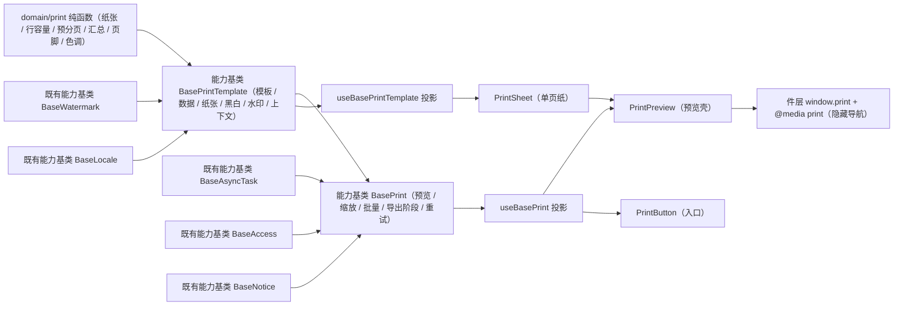

# 03 详细设计 · 打印与导出 PDF

> 前端组件库 · 08 交互类 · 嵌套子任务 03-3（需求 08-3）· 详细设计

[文档首页](../../../../../../../文档首页.md) › [08 交互类](../../../08_交互类.md) › [03 面板与工具](../../08_交互类_03_面板与工具.md) › 详细设计　|　[← 任务](../08_交互类_03_面板与工具_03_打印与导出PDF.md)

## 1. 设计目标与范围 <a id="goal"></a>

交付[需求 08-3](../../../../../需求/08_需求_交互类.md#r08-3) 第 6 条「打印与导出 PDF」：**打印模板**（页眉 / 标题 / 字段区 / 明细表 / 汇总 / 签章 / 页脚）+ **打印预览**（A4 纸张、分页、缩放、黑白 / 彩色）+ **打印编排**（浏览器打印、服务端高保真 PDF 导出、批量打印、进度与失败重试），样式与分页可控。

- **模板入链**：新增能力基类 `BasePrintTemplate`（核心 `capabilities/print-template.ts`，挂组件根），承载模板定义（页眉 / 标题 / 字段 / 明细列 / 汇总 / 签章 / 页脚）、单据数据装配、纸张与方向、黑白、水印（标签 + 用户 / 租户信息）、打印上下文（打印时间 / 打印人）与单元格格式化。
- **编排入链**：新增能力基类 `BasePrint`（继承 `BasePrintTemplate`），承载预览显隐与缩放、模板选择、批量模式（逐份 / 合并）、浏览器打印阶段、服务端导出与批量打印（经异步任务能力）、进度、失败与重试、导出许可与权限过滤、占位语义。
- **分页下沉核心**：`domain/print.ts` 承载打印数据模型（模板 / 字段 / 明细列 / 页）与纯函数（纸张解析、行容量计算、预分页、字段分行、数值汇总、页脚文案、色调解析、打印样式变量名），框架无关、跨端与宿主共用，纳入契约断言。
- **纸面渲染在组件层**：单页纸与预览壳分件（`PrintSheet` / `PrintPreview`），另交入口件 `PrintButton`（打印预览 / 浏览器打印 / 导出 PDF / 批量打印）。
- **真实导出随后端**：`GET/POST` 导出与批量打印接口未就绪——导出与批量**处理函数由宿主注入**，未注入时**不产生请求**（占位提示 + 按钮禁用），阶段机、进度与失败重试真实生效。

### 1.1 口径与依从 <a id="positioning"></a>

- **架构铁律**：打印模板与打印编排均为**横切功能**，一律落为**继承链上的能力基类**（核心 `capabilities/`），不在链外自由挂接；具体件只做渲染与编排投影。
- **继承链**：`BaseComponent`（组件根）→ 能力基类 → 具体件。本期新增一条链：`BaseComponent → BasePrintTemplate → BasePrint`；能力基类依赖单向登记于 `capabilities/manifest.ts`。
- **同契约多实现**：契约由 `@bms/core/testing` 的 `describePrintContract` 承载（模板 + 编排一套断言），后续移动端实现跑同一套断言。
- **占位口径**：导出 PDF 与批量打印**接口未就绪**——处理函数未注入即占位（不请求、返回 `undefined`、写占位文案），件层禁用按钮并提示；注入后阶段机、进度与重试全部真实生效。
- **令牌口径**：打印样式（页边距 / 字号 / 行高 / 线宽 / 纸面底色 / 文本色 / 水印色 / 黑白滤镜）经宿主打印令牌组（`--bms-print-*`）注入，核心只提供**变量名常量**，不硬编码色值；打印样式与屏幕样式解耦（屏幕样式不影响纸面）。
- **水印口径**：水印**用户 / 租户信息**真源为水印能力基类（`BaseWatermark`，与展示类水印件同源）；另设**单据级水印标签**（`watermarkLabel`，如「样张 / 作废 / 机密」，属单据业务语义而非用户信息），两者拼接为纸面水印文案。
- **端范围**：**仅 PC**（`frontend/packages/ui-ep`），移动端适配登记为遗留。
- **工时**：嵌套子任务名义 10h；因新增 2 个能力基类、3 件组件、1 套契约套件、1 份领域纯函数与开发态核对页，实际工时预估上浮，偏差在实施记录登记。

## 2. 交付物清单 <a id="deliver"></a>

| # | 交付物 | 落点 |
| --- | --- | --- |
| 1 | 打印模板能力基类（新增） | `core/src/capabilities/print-template.ts` |
| 2 | 打印与导出编排能力基类（新增，继承 `BasePrintTemplate`） | `core/src/capabilities/print.ts` |
| 3 | 能力依赖登记（新增 `print-template` / `print` 两键） | `core/src/capabilities/manifest.ts` |
| 4 | 打印数据模型与分页纯函数 | `core/src/domain/print.ts` |
| 5 | 核心导出面登记 | `core/src/index.ts` |
| 6 | 契约套件（打印模板 + 编排） | `core/testing/index.ts` |
| 7 | 核心用例（领域纯函数 / 模板 / 编排） | `core/tests/domain-print.spec.ts`、`core/tests/print.spec.ts` |
| 8 | 两套基类投影 | `ui-ep/src/composables/useBasePrintTemplate.ts`、`useBasePrint.ts` |
| 9 | 单页纸件 | `ui-ep/src/components/print/PrintSheet.vue` |
| 10 | 打印预览壳 | `ui-ep/src/components/print/PrintPreview.vue` |
| 11 | 打印入口件 | `ui-ep/src/components/print/PrintButton.vue` |
| 12 | 导出面登记 | `ui-ep/src/index.ts` |
| 13 | 用例（三件 + 契约驱动） | `ui-ep/tests/interaction-print.spec.ts` |
| 14 | 打印令牌组（宿主权威源） | `apps/desktop/src/styles/tokens.scss` |
| 15 | 开发态核对页（`vite build` 不包含） | `apps/desktop/print-export-check.html`、`apps/desktop/src/dev/{printExportCheck.ts,PrintExportCheck.vue}` |
| 16 | 登记回写：基类清单 / 组件设计 19 / 计划 / 任务状态 | 见第 6 节 |



## 3. 接口 / 契约与边界 <a id="contract"></a>

### 3.1 核心：`domain/print.ts`（新增纯函数与数据模型） <a id="print-domain"></a>

```ts
/** 纸张名。 */
export type PaperName = 'A4' | 'A5' | 'custom'
/** 纸张方向。 */
export type PaperOrientation = 'portrait' | 'landscape'
/** 打印色调。 */
export type PrintTone = 'color' | 'mono'
/** 纸张尺寸（毫米）。 */
export interface PaperSize { width: number; height: number }
/** 内置纸张尺寸（毫米，纵向）。 */
export const PAPER_SIZES: Readonly<Record<'A4' | 'A5', PaperSize>>
/** 字段缺失占位文本。 */
export const PRINT_MISSING_TEXT = '—'
/** 打印样式变量名（值由宿主打印令牌组注入）。 */
export const PRINT_STYLE_VARS: Readonly<Record<'paper' | 'text' | 'margin' | 'fontSize' | 'lineHeight' | 'lineWidth' | 'watermark' | 'monoFilter', string>>

/** 单元格格式。 */
export type PrintCellFormat = 'text' | 'amount' | 'number' | 'date' | 'datetime'
/** 打印字段（字段区一项）。 */
export interface PrintFieldDef { key: string; label: string; value?: unknown; span?: number }
/** 明细列。 */
export interface PrintColumnDef { key: string; label: string; width?: number; align?: 'left' | 'center' | 'right'; format?: PrintCellFormat }
/** 明细行。 */
export type PrintRowData = Record<string, unknown>
/** 打印模板定义。 */
export interface PrintTemplateDef {
  key: string
  title: string
  subtitle?: string
  fields?: PrintFieldDef[]
  columns?: PrintColumnDef[]
  signLabels?: string[]
  footerNote?: string
  summaryKey?: string
  summaryLabel?: string
  rowsPerPage?: number
  rowHeight?: number
  chromeHeight?: number
}
/** 单据数据（主表字段 + 明细）。 */
export interface PrintData { fields?: Record<string, unknown>; rows?: PrintRowData[] }
/** 打印页（预分页结果）。 */
export interface PrintPage {
  index: number
  total: number
  rows: PrintRowData[]
  isFirst: boolean
  isLast: boolean
  footer: string
}
/** 分页输入。 */
export interface BuildPagesInput {
  template: PrintTemplateDef
  data?: PrintData
  paperSize: PaperSize
  printedAt?: string
  printedBy?: string
}

resolvePaperSize(paper: PaperName, orientation?: PaperOrientation, custom?: PaperSize): PaperSize
computeRowsPerPage(input: { paperHeight: number; rowHeight: number; chromeHeight: number }): number
paginateRows<T>(rows: readonly T[], size: number): T[][]
distributeFields<T>(fields: readonly T[], columns: number): T[][]
sumNumeric(rows: readonly PrintRowData[], key: string): number
formatPageFooter(input: { index: number; total: number; printedAt?: string; printedBy?: string; note?: string }): string
resolvePrintTone(tone: PrintTone): { mono: boolean; filter: string }
buildPrintPages(input: BuildPagesInput): PrintPage[]
```

| 行为 | 口径 |
| --- | --- |
| 纸张解析 | `A4` / `A5` 取内置毫米尺寸；横向（`landscape`）交换宽高；`custom` 用传入尺寸，缺失回落 `A4`；非法（宽高非正）回落 `A4` |
| 行容量 | `computeRowsPerPage` = `floor((paperHeight - chromeHeight) / rowHeight)`，结果**至少 1**；`rowHeight` 非正时按 1 处理 |
| 预分页 | `rowsPerPage`（模板级）优先；未声明或非正时按纸张高、行高与占位高度计算；空明细返回**单页空页**（供空数据打印提示与占位） |
| 页码连续 | 每页 `index` 自 1 递增、`total` 为总页数；首页 `isFirst`、末页 `isLast`；表头由件层在每页重复渲染（模板列定义不随页变化） |
| 页脚文案 | `第 X 页 / 共 Y 页` + 打印时间 + 打印人（缺失项不输出）；附加 `note`（模板页脚备注） |
| 字段分行 | `distributeFields` 按列数分行（默认 2 列），保持原顺序；不足一行留空（件层渲染空位） |
| 汇总 | `sumNumeric` 仅累加有限数值，其余跳过；模板 `summaryKey` 缺省时汇总为 0 |
| 色调 | `mono` 为真时返回黑白滤镜值名（供件层置灰），彩色时为空串；核心不含色值 |
| 样式变量 | 核心只给变量名（`--bms-print-*`）与取用顺序，**不内置色值与尺寸字面量**（护栏：核心框架无关 + 组件不硬编码样式） |
| 纯数据 | 不触 DOM、不请求、不依赖渲染框架；同输入同输出 |

### 3.2 核心：能力基类 `BasePrintTemplate`（新增） <a id="print-template-base"></a>

```ts
/** 页眉品牌（宿主 / 主题能力注入）。 */
export interface PrintBrand { name?: string; logo?: string }
/** 打印上下文。 */
export interface PrintContext { printedAt?: string; printedBy?: string }

export abstract class BasePrintTemplate extends BaseComponent {
  readonly identifier: string = 'print-template'
  templates: PrintTemplateDef[]        // 可选模板集
  templateKey: string | undefined      // 当前模板键（默认首个）
  data: PrintData                      // 单据数据（主表字段 + 明细）
  paper: PaperName
  orientation: PaperOrientation
  tone: PrintTone
  customSize: PaperSize | undefined
  brand: PrintBrand | undefined
  watermarkLabel: string               // 单据级水印标签（样张 / 作废 / 机密）
  watermarkEnabled: boolean            // 是否叠加水印（缺省 true）
  locale: BaseLocale | undefined       // 语言与格式上下文（金额 / 日期格式化）
  watermark: BaseWatermark | undefined // 水印能力（用户 / 租户信息真源）
  printedAt: string
  printedBy: string

  get template(): PrintTemplateDef | undefined
  get paperSize(): PaperSize
  get mono(): boolean
  get rowsPerPage(): number
  get pages(): PrintPage[]
  get fieldRows(): PrintFieldDef[][]
  get summary(): number
  get watermarkText(): string
  get hasWatermark(): boolean
  get styleVars(): Readonly<Record<string, string>>   // 变量名（件层据此消费）

  setTemplates(list: PrintTemplateDef[]): void
  selectTemplate(key: string): void
  setData(data: PrintData): void
  setPaper(paper: PaperName, orientation?: PaperOrientation): void
  setTone(tone: PrintTone): void
  toggleTone(): PrintTone
  setCustomSize(size: PaperSize | undefined): void
  setBrand(brand: PrintBrand | undefined): void
  setWatermarkLabel(label: string): void
  setWatermarkEnabled(value: boolean): void
  setContext(input: PrintContext): void
  fieldValue(field: PrintFieldDef): string
  cellText(column: PrintColumnDef, row: PrintRowData): string
}
```

| 行为 | 口径 |
| --- | --- |
| 模板选择 | `setTemplates` 后 `templateKey` 归位首个模板键；`selectTemplate` 命中不存在键时不变更并告警（`log('warn')`） |
| 数据装配 | `setData` 整体替换（受控入口）；字段区取模板 `fields[].key` 在 `data.fields` 中的值，缺失回落 `PRINT_MISSING_TEXT` |
| 单元格格式化 | 按列 `format` 经语言上下文格式化金额 / 数字 / 日期 / 时间；无 `locale` 时用核心缺省格式化；非文本字段值缺失同样回落占位 |
| 纸张与方向 | `setPaper` 支持 `A4` / `A5` / `custom`；`custom` 需 `setCustomSize` 提供尺寸，缺失回落 `A4` |
| 黑白 | `mono` 由 `tone === 'mono'` 得出；`toggleTone` 在彩色 / 黑白间切换（件层据此置灰纸面） |
| 水印 | `watermarkText` = 单据级标签与注入水印能力的用户 / 租户文本拼接（去空、以 ` · ` 连接）；`watermarkEnabled` 为假或文案为空时 `hasWatermark` 为假 |
| 打印上下文 | `printedAt` / `printedBy` 由宿主注入（打印时间与打印人）；缺省空串，页脚不输出 |
| 样式 | 只输出变量名表 `styleVars`，不输出色值；件层以 `var(--bms-print-*, fallback)` 消费 |
| 纯数据 | 不触 DOM、不请求；模板与数据变更经生命周期 `update` 通知 |

- 依赖登记：`print-template: ['watermark', 'locale']`（组件根之下，两项协作者均单向）。
- 不含预览编排、导出与批量语义（归 `BasePrint`）；不含模板定义来源（归《概要设计 · 表单定制》，登记见第 7 节）。

### 3.3 核心：能力基类 `BasePrint`（新增，继承 `BasePrintTemplate`） <a id="print-base"></a>

```ts
/** 编排阶段。 */
export type PrintPhase = 'idle' | 'printing' | 'exporting' | 'batching' | 'done' | 'failed'
/** 批量模式。 */
export type PrintBatchMode = 'separate' | 'merged'
/** 进度。 */
export interface PrintProgress { current: number; total: number }
/** 任务载荷（导出 / 批量共用）。 */
export interface PrintJobPayload {
  templateKey: string
  paper: PaperName
  orientation: PaperOrientation
  tone: PrintTone
  watermark: string
  keys: string[]
  mode: PrintBatchMode
}
/** 任务结果（服务端返回文件信息）。 */
export interface PrintJobResult { fileId?: string; fileName?: string; url?: string; message?: string }
/** 任务处理函数（宿主注入；`report` 回传进度）。 */
export type PrintJobHandler = (
  payload: PrintJobPayload,
  report: (progress: PrintProgress) => void,
) => Promise<PrintJobResult>
/** 注入的处理函数集。 */
export interface PrintJobs { exportPdf?: PrintJobHandler; batchPrint?: PrintJobHandler }

export abstract class BasePrint extends BasePrintTemplate {
  readonly identifier: string = 'print'
  previewVisible: boolean            // 预览显隐（受控）
  zoom: number                       // 缩放（夹取 minZoom ~ maxZoom）
  minZoom: number                    // 缺省 0.6
  maxZoom: number                    // 缺省 1.2
  batchMode: PrintBatchMode          // 逐份 / 合并
  allowExport: boolean               // 导出许可（模板 / 业务开关）
  printPerm: string                  // 打印权限码（空 = 不校验）
  exportPerm: string                 // 导出权限码（空 = 不校验）
  phase: PrintPhase
  progress: PrintProgress
  errorMessage: string
  lastResult: PrintJobResult | undefined
  jobs: PrintJobs                    // 宿主注入（未注入即占位）
  task: BaseAsyncTask<PrintJobResult> | undefined   // 异步任务协作（批量 / 大结果集）
  access: BaseAccess | undefined     // 权限上下文（未注入不校验）
  notice: BaseNotice | undefined     // 提示通知（未注入不发通知）

  get busy(): boolean                // 打印 / 导出 / 批量进行中
  get canPrint(): boolean
  get canExport(): boolean
  get exportReady(): boolean         // 已注入导出处理函数
  get batchReady(): boolean

  open(): void
  close(): void
  togglePreview(): boolean
  setZoom(value: number): number
  zoomIn(): number
  zoomOut(): number
  setBatchMode(mode: PrintBatchMode): void
  setAllowExport(value: boolean): void
  beginPrint(): void                              // 置 printing（件层随后调起浏览器打印）
  finishPrint(): PrintJobResult                   // 置 done（浏览器打印结果前端不可感知，只记调起）
  exportPdf(): Promise<PrintJobResult | undefined>
  batchPrint(keys: string[]): Promise<PrintJobResult | undefined>
  retry(): Promise<PrintJobResult | undefined>     // 从失败目标重试上一动作
  reset(): void                                    // 阶段回 idle、清错误（保留模板与数据）
}
```

| 行为 | 口径 |
| --- | --- |
| 预览显隐 | `open` / `close` / `togglePreview` 改 `previewVisible`（件层 `v-model:visible` 受控同步） |
| 缩放 | `setZoom` 夹取到 `[minZoom, maxZoom]`；`zoomIn` / `zoomOut` 步长 0.1；返回夹取后值（幂等：同值不通知） |
| 批量模式 | `separate`（逐份）与 `merged`（合并）写入载荷；真实逐份生成归处理函数 |
| 占位 | 未注入对应处理函数时：阶段不变更、`errorMessage` 写占位文案、返回 `undefined`（**不产生请求**）；件层据 `exportReady` / `batchReady` 禁用入口 |
| 权限 | `canPrint` / `canExport` 在权限上下文已注入且声明了权限码时按 `has(perm)` 判定；未注入或未声明视为有权 |
| 导出阶段 | `exportPdf`：`exporting` → 成功 `done`、失败 `failed`；结果写 `lastResult`，经提示能力上抛（注入时） |
| 批量阶段 | `batchPrint(keys)`：`batching`，进度总量取单据数；`keys` 为空直接返回 `undefined`（不动作） |
| 异步协作 | 注入异步任务能力时经其提交（进度经任务回传同步到 `progress`）；未注入时直接 `await` 处理函数；两种路径的阶段与结果口径一致 |
| 进度 | 处理函数经 `report({ current, total })` 上报，件层渲染进度；上报值原样透出（不做百分比换算） |
| 失败与重试 | `failed` 时保留 `errorMessage` 与失败目标（动作 + 单据键）；`retry` 重放上一动作（未注入处理函数时返回 `undefined`） |
| 并发 | `busy` 期间的 `exportPdf` / `batchPrint` 直接返回 `undefined`（防重复提交，件层同时禁用） |
| 浏览器打印 | 核心只记阶段（`beginPrint` / `finishPrint`）；`window.print()` 调起与 `@media print` 样式归件层，核心不触 DOM |
| 显示条件 | 阶段 `printing` / `exporting` / `batching` 期间件层禁用入口并展示进度 |

- 依赖登记：`print: ['print-template', 'async-task', 'access', 'notice']`（父基类 `BasePrintTemplate`，三项协作者均单向）。
- 导出任务 / 异步机制归《概要设计 · 导入导出》（登记项①）；PDF 文件存储归《概要设计 · 文件管理》（登记项③）——本基类只做编排与阶段，不实现存储。

### 3.4 契约套件（`@bms/core/testing`） <a id="testing"></a>

| 套件 | 契约面（结构化接口） | 断言要点 |
| --- | --- | --- |
| `describePrintContract(name, create)` | `templateKey` / `paperSize` / `rowsPerPage` / `pageCount` / `pageRows()` / `pageIndexes()` / `mono` / `watermarkText` / `fieldText(key)` / `zoom` / `previewVisible` / `batchMode` / `canExport` / `setTemplates` / `selectTemplate` / `setData` / `setPaper` / `setTone` / `setWatermarkLabel` / `setZoom` / `setBatchMode` / `setAllowExport` / `setExportHandler` / `open` / `close` / `exportPdf` / `retry` | 模板选择与纸张方向（横向交换宽高）；预分页每页行数与页码连续、末页余量；字段渲染与缺失占位；水印标签与黑白；缩放夹取；导出占位（未注入处理不动作、返回 `undefined` 且阶段不变）；注入后阶段推进与结果保留；失败置 `failed` 且 `retry` 可恢复；导出中重复请求不动作；`allowExport` 为假时不可导出 |

- 目标约定：两模板（`order` 三列明细 + 每页 2 行、`label` 单列）、五行明细、数据字段 `customer` 有值而 `remark` 缺失；初始未注入导出处理。
- 套件同时被 `ui-ep`（投影适配）与后续移动端实现消费；本期无第二实现时由 `ui-ep` 用例驱动。

### 3.5 投影（`ui-ep/src/composables/`） <a id="bindings"></a>

```ts
// useBasePrintTemplate：模板与数据装配投影
export interface UseBasePrintTemplateOptions {
  templates?: PrintTemplateDef[]
  templateKey?: string
  data?: PrintData
  paper?: PaperName
  orientation?: PaperOrientation
  tone?: PrintTone
  customSize?: PaperSize
  brand?: PrintBrand
  watermarkLabel?: string
  watermarkEnabled?: boolean
  locale?: BaseLocale
  watermark?: BaseWatermark
  printedAt?: string
  printedBy?: string
}
export interface UseBasePrintTemplateResult {
  print: BasePrintTemplate
  templateKey: Ref<string | undefined>
  paperSize: Ref<PaperSize>
  mono: Ref<boolean>
  rowsPerPage: Ref<number>
  pages: Ref<PrintPage[]>
  fieldRows: Ref<PrintFieldDef[][]>
  summary: Ref<number>
  watermarkText: Ref<string>
  hasWatermark: Ref<boolean>
  styleVars: Record<string, string>
  setTemplates(templates: PrintTemplateDef[]): void
  selectTemplate(key: string): void
  setData(data: PrintData): void
  setPaper(paper: PaperName, orientation?: PaperOrientation): void
  setTone(tone: PrintTone): void
  setWatermarkLabel(label: string): void
  setContext(input: PrintContext): void
}

// useBasePrint：编排投影（在模板投影之上）
export interface UseBasePrintOptions extends UseBasePrintTemplateOptions {
  visible?: boolean
  zoom?: number
  batchMode?: PrintBatchMode
  allowExport?: boolean
  printPerm?: string
  exportPerm?: string
  jobs?: PrintJobs
  task?: BaseAsyncTask<PrintJobResult>
  permChecker?: (perm: string) => boolean
  notice?: BaseNotice
}
export interface UseBasePrintResult {
  print: BasePrint
  previewVisible: Ref<boolean>
  zoom: Ref<number>
  batchMode: Ref<PrintBatchMode>
  phase: Ref<PrintPhase>
  busy: Ref<boolean>
  progress: Ref<PrintProgress>
  errorMessage: Ref<string>
  lastResult: Ref<PrintJobResult | undefined>
  canExport: Ref<boolean>
  exportReady: Ref<boolean>
  batchReady: Ref<boolean>
  open(): void
  close(): void
  setZoom(value: number): number
  zoomIn(): number
  zoomOut(): number
  setBatchMode(mode: PrintBatchMode): void
  setAllowExport(value: boolean): void
  beginPrint(): void
  finishPrint(): PrintJobResult
  exportPdf(): Promise<PrintJobResult | undefined>
  batchPrint(keys: string[]): Promise<PrintJobResult | undefined>
  retry(): Promise<PrintJobResult | undefined>
  reset(): void
}
```

- 投影为薄适配（核心实例 ↔ Vue 响应式），判定逻辑全部在核心；`permChecker` 内联为权限上下文（与批量操作栏同口径），不引入额外依赖。
- `window.print()`、`matchMedia` 之外的浏览器 API 一律留在件层；投影不触 DOM。

### 3.6 `PrintSheet` 单页纸件契约 <a id="print-sheet"></a>

| 面 | 内容 |
| --- | --- |
| 数据面 | `template`（模板定义，必填）/ `page`（页对象，必填）/ `brand`（页眉品牌）/ `watermark`（水印文案）/ `mono`（黑白）/ `paper` / `orientation` / `zoom`（纸面缩放）/ `emptyText` |
| 事件 | 无（纯渲染件） |
| 插槽 | `#header`（页眉替换）、`#fields`（字段区替换）、`#table`（明细表替换）、`#footer`（页脚替换）、`#watermark`（水印层替换） |
| 行为 | 经模板投影挂链并渲染单页：页眉（品牌 Logo / 名称 + 副信息）、标题、字段区（按 `fieldRows` 分行）、明细表（**每页重复表头**）、汇总、签章区、页脚（页码 / 总页数 / 打印时间 / 打印人 / 备注）；`data-mono` 驱动置灰；水印层绝对定位铺满纸面；样式全部消费 `--bms-print-*` 令牌与 `var(…, fallback)`；纸面尺寸按 `paperSize`（毫米）与缩放换算 |
| 复用 | 可独立用于批量合并页预览与导出对账；不依赖预览壳 |

### 3.7 `PrintPreview` 预览壳契约 <a id="print-preview"></a>

| 面 | 内容 |
| --- | --- |
| 数据面 | `visible`（`v-model:visible` 受控显隐）/ `templates` / `templateKey`（`v-model`）/ `data` / `paper`（`v-model`）/ `orientation`（`v-model`）/ `tone`（`v-model`）/ `zoom`（`v-model`）/ `batchMode`（`v-model`）/ `brand` / `watermark` / `watermarkLabel` / `watermarkEnabled` / `allowExport` / `jobs`（导出与批量处理注入）/ `printPerm` / `exportPerm` / `permChecker` / `batchKeys`（批量单据键）/ `locale` / `emptyText`（缺省「无可打印数据」） |
| 事件 | `update:visible` / `update:templateKey` / `update:paper` / `update:orientation` / `update:tone` / `update:zoom` / `update:batchMode` / `print`（已调起浏览器打印）/ `exported`（导出结果）/ `batch-printed`（批量结果）/ `failed`（`{ phase, message }`） |
| 对外能力 | `open()` / `close()` / `print()` / `exportPdf()` / `batchPrint()` / `retry()`（`defineExpose`） |
| 插槽 | `#toolbar`（工具栏整体替换）/ `#actions`（动作区替换）/ `#empty`（无数据兜底）/ `#footer`（底部扩展） |
| 行为 | 工具栏：纸张（A4 / A5）、方向（纵 / 横）、黑白切换、缩放（− / 百分比 / ＋，夹取 60% ~ 120%）、水印开关（文案取自水印能力与标签）、模板选择（多模板时）；主区滚动渲染多页 `PrintSheet`（单页 = 单据打印）；「浏览器打印」经 `beginPrint()` → `window.print()` → `finishPrint()` 并上抛 `print`；「导出 PDF」在未注入处理或无权时禁用并提示占位；导出 / 批量进行中按钮禁用 + 进度展示；失败展示错误并提供重试；无数据时渲染空态（复用布局类空状态件）；**打印样式隐藏导航与工具栏**（`@media print`，仅打印纸面） |

### 3.8 `PrintButton` 入口件契约 <a id="print-button"></a>

| 面 | 内容 |
| --- | --- |
| 数据面 | `label`（缺省「打印」）/ `variant`（`dropdown` 下拉 / `button` 单按钮，缺省 `dropdown`）/ `templates` / `templateKey` / `data` / `paper` / `orientation` / `tone` / `zoom` / `batchMode` / `brand` / `watermark` / `watermarkLabel` / `jobs` / `printPerm` / `exportPerm` / `permChecker` / `batchKeys`（批量单据键，空则批量项禁用）/ `showPreview`（是否含「打印预览」项，缺省 `true`）/ `batchModeEnabled` / `disabled` |
| 事件 | `preview`（请求打开预览）/ `print`（已调起浏览器打印）/ `exported` / `batch-printed` / `failed` |
| 对外能力 | `run(action)`（`preview` / `print` / `export` / `batch`）/ `open()`（展下拉）（`defineExpose`） |
| 插槽 | 默认（触发器内容替换）/ `#menu`（菜单项替换） |
| 行为 | 入口挂表单页 / 详情工具栏与列表工具栏；下拉项按权限与就绪态过滤（无导出权限不渲染导出项；未注入处理项禁用并提示）；「浏览器打印」经编排件调起 `window.print()`（入口件内不自绘纸面，预览由预览壳负责）；批量项在无选中单据时禁用；点击后关闭下拉 |

### 3.9 宿主接线与开发态核对页 <a id="host"></a>

- **打印令牌组**：`apps/desktop/src/styles/tokens.scss` 新增 `:root` 打印令牌组（`--bms-print-paper-bg` / `--bms-print-text` / `--bms-print-margin` / `--bms-print-font-size` / `--bms-print-line-height` / `--bms-print-line-width` / `--bms-print-watermark-color` / `--bms-print-mono-filter`），并把 `@media print` 的纸面基础规则（隐藏非纸面元素、`@page` 页边距取令牌）落在令牌组同文件；件层消费令牌并提供 `var(…, fallback)` 降级。**打印令牌归《布局设计 · 设计令牌》登记项②**（见第 7 节）。
- **开发态核对页**：`apps/desktop/print-export-check.html`（仅开发态入口，`vite build` 只构建 `index.html`，故不入产物）+ `src/dev/printExportCheck.ts` + `src/dev/PrintExportCheck.vue`；页面内容：`PrintPreview`（销售订单样例数据，多页 + 缩放 + 黑白 + 水印 + 模板切换）+ `PrintButton` 下拉 + `PrintSheet`（单页复用示例）+ 导出 / 批量处理注入样例（首次失败演示重试）。
- **自检上屏**（`data-check` 断言项）：模板与数据渲染 / 分页与页码连续 / 每页表头重复 / 纸张与方向 / 黑白置灰 / 水印层 / 缩放夹取 / 空数据占位 / 导出占位（未注入不请求）/ 导出阶段与失败重试 / 批量逐份合并与进度 / 权限过滤（无导出权限不渲染导出项）。

## 4. 失败分支与边界 <a id="edge"></a>

| 边界 / 失败场景 | 处置 |
| --- | --- |
| 无模板 | 预览空态提示；`template` 为 `undefined` 时页对象为空数组，不渲染纸面 |
| 无明细数据 | `buildPrintPages` 返回单页空页（表头 + 空态行占位），打印仍可行 |
| 模板字段缺失 | 字段值回落 `PRINT_MISSING_TEXT`（`—`），不抛错 |
| 明细列键在行内缺失 | 单元格回落占位；格式化失败回落原值字符串 |
| 长明细跨页 | 按行容量预分页；每页重复表头、页码连续；余量不足一页时末页留白 |
| 纸张非法 / 自定义尺寸缺失 | 回落 `A4` 纵向；横向交换宽高 |
| 行高 / 占位高度非法 | 行容量至少 1；`rowHeight` 非正按 1 处理 |
| 导出处理未注入 | 占位：不请求、返回 `undefined`、写占位文案、按钮禁用 + 提示 |
| 导出 / 批量失败 | 阶段 `failed`、写 `errorMessage`、经提示能力提示（注入时）；保留失败目标供 `retry` |
| 导出中重复点击 | `busy` 期间直接返回 `undefined`；件层禁用按钮 |
| 批量无单据键 | `batchPrint` 返回 `undefined`，件层批量项禁用 |
| 无导出权限 | 导出入口不渲染（件层）；基类 `canExport` 为假时 `exportPdf` 返回 `undefined` |
| 导出许可关闭 | `allowExport` 为假：件层隐藏导出入口、基类拒绝 |
| 水印文案为空 / 关闭水印 | `hasWatermark` 为假，不渲染水印层 |
| 跨浏览器打印样式差异 | 以标准 `@media print` 与 `@page` 为主；浏览器差异登记为边界（人工核验遗留） |
| 大批量打印 | 逐份 / 合并由处理函数与后端异步任务承担；核心只编排阶段与进度，避免前端一次性渲染 |
| 移动端 | 本期仅 PC；窄屏适配与「分享 / 另存 PDF」登记为遗留（见第 7 节） |
| 深色主题下打印 | 纸面样式与屏幕解耦（打印令牌独立），深色主题不影响纸面；黑白模式置灰纸面 |
| 打印令牌未注入 | 件层 `var(…, fallback)` 降级，不报错、不阻断 |

## 5. 测试设计与验收映射 <a id="test"></a>

| 验收点（需求 08-3 / 任务 03-3） | 用例 |
| --- | --- |
| 纸张解析与横向交换、行容量下限 | `core/tests/domain-print.spec.ts` |
| 预分页与页码连续、每页行数、空数据单页 | 同上 + `core/tests/print.spec.ts` |
| 字段分行、汇总、页脚文案、色调 | 同上 |
| 模板选择与数据装配（含缺失占位与格式化） | `core/tests/print.spec.ts` + `ui-ep/tests/interaction-print.spec.ts` |
| 预览显隐与缩放夹取 | 同上 |
| 水印标签与用户 / 租户信息拼接、开关 | 同上 |
| 黑白置灰（纸面 `data-mono`） | `ui-ep` 用例 |
| 导出占位（未注入处理不请求、按钮禁用） | 同上（含契约套件「导出占位不动作」） |
| 导出阶段推进、进度、结果保留 | 同上（含契约套件「注入后阶段推进」） |
| 导出失败与重试 | 同上（含契约套件「失败置 failed，retry 恢复」） |
| 导出中重复请求不动作 | 同上（含契约套件同名断言） |
| 批量模式（逐份 / 合并）与批量进度 | 同上 |
| 导出许可与权限过滤（无权限不渲染） | 同上 |
| 单页纸可独立复用与每页表头重复 | `ui-ep` 用例（`PrintSheet` 直接挂载断言） |
| 空态与无数据提示 | 同上 |
| 契约套件通过（模板 + 编排） | `ui-ep` 用例驱动 `@bms/core/testing` 的 `describePrintContract` |
| 开发态核对页自检项全绿 | `--dump-dom` 断言 + 实施记录对照表 |
| `vue-tsc`、ESLint、Vitest 全通过 | 根 `pnpm run check` + 宿主 `vue-tsc -b` / `lint` / `test:cov` / `build` / `budget` |

- Kiwi 用例 1 条（一任务一条，编号于测试步登记后回填，预计 766；分类「平台骨架」、优先级 P2、状态 CONFIRMED、标签「自动化」）。

## 6. 登记落点 <a id="register"></a>

| 内容 | 落点 |
| --- | --- |
| 新增能力基类 `BasePrintTemplate`（能力键 `print-template`） | 《[前端基类清单](../../../../../../../前端基类清单.md)》§2.1 插入行（父基类 `BaseComponent`，状态「已交付」，后续编号顺延）+ §5.2 能力基类表 + `capabilities/manifest.ts` |
| 新增能力基类 `BasePrint`（能力键 `print`） | 同上（父基类 `BasePrintTemplate`；依赖 `print-template` / `async-task` / `access` / `notice`） |
| 领域纯函数与数据模型 `domain/print.ts` | 同上 §9「核心」（`domain/` 领域纯函数） |
| 组件落点 | 同上 §9「PC 插件」（`components/print/` 三件：单页纸 / 预览壳 / 入口件） |
| 投影落点 | 同上 §9（`useBasePrintTemplate` / `useBasePrint`） |
| 契约套件 | 同上 §9（`core/testing/`：打印模板 + 编排一套） |
| 设计口径回写 | 《组件设计》[19 打印与导出 PDF](../../../../../../../设计/组件设计/08_交互类/19_组件设计_打印与导出PDF/19_组件设计_打印与导出PDF.md)：继承链行改现行口径（组件根 → 能力基类 → 具体件）、去旧分层表述；水印行补「水印能力真源 + 单据级标签」 |
| 上游登记（3 项，本任务只登记归口、不代上游裁决） | ① 打印 / 导出 PDF 任务 → 《概要设计 · 导入导出》「导出类型」节；② 打印入口与预览（含打印样式令牌组）→ 《布局设计 · 表单页》「打印」节与《布局设计 · 设计令牌》；③ 打印产物存储 → 《概要设计 · 文件管理》「来源与归档」节 |
| 任务 / 父任务 / 域任务 / 计划状态 | [任务](../08_交互类_03_面板与工具_03_打印与导出PDF.md)、[父任务](../../08_交互类_03_面板与工具.md)、[域任务](../../../08_交互类.md)、[计划](../../../../../../../项目/04_前端组件库/计划/01_计划_前端组件库.md)（嵌套子任务并入父任务行；`08_03` 完成后由 §3 移入 §2，窗口按实际回写，§4 甘特同步） |
| 需求文档 | 不承载进度（状态只在任务与计划两处一致）；遗留归口写在实施 / 测试记录与计划 |

## 7. 边界与开放项 <a id="open"></a>

- **不在本期**：真实导出 / 批量接口联调（`POST` 导出、批量任务与完成通知，随阶段八通用能力与《概要设计 · 导入导出》）；PDF 文件存储与归档（《概要设计 · 文件管理》）；模板定义来源与模板设计器（《概要设计 · 表单定制》，阶段八）；服务端渲染口径（后端实现）；移动端预览适配与「分享 / 另存 PDF」；跨浏览器打印样式差异的逐浏览器核验；审计（打印 / 导出留痕归各业务与审计概要）。
- **上游登记待确认**（组件设计 19 已列，本任务只登记归口）：① 打印 / 导出 PDF 任务（导出类型含 PDF、模板选择、逐份 / 合并、异步任务与完成通知、下载与重试）；② 打印入口与预览（表单 / 详情工具栏与批量入口、A4 预览形态、**打印样式令牌组**）；③ 打印产物存储（来源 = 打印 / 导出、命名、保留期、下载与分享、审计关联）。
- **协同契约**：`PrintPreview` 不自绘外部样式源（纸面样式全部在组件内消费打印令牌）；导出与批量处理函数由宿主注入（本任务不实现后端通路）；水印用户 / 租户信息取自水印能力（宿主注入），单据级标签由业务方传入；打印权限码由调用方声明。
- **遗留登记**：`PrintSheet` 的**纸面毫米尺寸**与浏览器渲染像素的换算依赖容器栅格与 DPI，人工核验登记为遗留；打印样式令牌组需与《布局设计 · 设计令牌》对齐后如有调整，回写 `domain/print.ts` 与件层样式；`PrintButton` 的真实宿主接入（表单页 / 列表工具栏）留待宿主布局任务。
- Kiwi 用例编号于测试步登记后回填实施 / 测试记录与用例文件（预计 766）。

## 8. 决策记录 <a id="decision"></a>

| # | 决策项 | 结论 |
| --- | --- | --- |
| 1 | 能力基类拆分 | 两条链：`BasePrintTemplate` → `BasePrint`（模板语义与编排语义分层） |
| 2 | 纸面渲染落点 | 组件层：`PrintSheet`（单页纸）+ `PrintPreview`（预览壳） |
| 3 | 导出 PDF 通路 | 服务端高保真为主、前端触发；异步经异步任务能力协作，未注入即占位不动作 |
| 4 | 浏览器打印 | 件内 `window.print()` + 打印样式（`@media print` 隐藏导航与工具栏） |
| 5 | 分页策略 | 核心纯函数按「行容量 + 行高」预分页 + CSS `break-inside` 兜底 |
| 6 | 交付件范围 | 三件：`PrintPreview` / `PrintSheet` / `PrintButton` |
| 7 | 水印接入 | 复用 `BaseWatermark` 协作注入（用户 / 租户信息真源） |
| 8 | 打印样式 | 新增打印令牌组（`--bms-print-*`）入宿主令牌，件消费令牌不硬编码 |
| 9 | 宿主接线 | 打印令牌组最小集 + 开发态核对页（`vite build` 不含） |
| 10 | 契约套件 | 一套 `describePrintContract`（模板 + 编排） |
| 11 | 用例与 Kiwi | 单文件 `interaction-print.spec.ts` + 一条用例（预计 766） |
| 12 | 批量打印 | 本期前端编排 + 异步任务占位（逐份 / 合并、进度、失败重试） |
| 13 | 组件设计 19 回写 | 回写为现行口径（继承链、去旧分层表述、水印行补标签语义） |
| 14 | 上游登记 | 本任务只落组件契约，3 项上游登记留待确认并在记录中登记归口 |
| 15 | 水印文案口径 | 水印能力真源（用户 / 租户信息）+ 单据级标签字段（样张 / 作废 / 机密），两者拼接 |
| 16 | 组件落点目录 | 新建 `ui-ep/src/components/print/` 子目录（打印专题自成一族） |
| 17 | 能力键命名 | `print-template` / `print` |

## 9. 参考文档 <a id="ref"></a>

- [需求 08-3](../../../../../需求/08_需求_交互类.md#r08-3)、[任务 03-3](../08_交互类_03_面板与工具_03_打印与导出PDF.md)、[父任务 03 面板与工具](../../08_交互类_03_面板与工具.md)
- 《组件设计》[19 打印与导出 PDF](../../../../../../../设计/组件设计/08_交互类/19_组件设计_打印与导出PDF/19_组件设计_打印与导出PDF.md)（含[可交互原型](../../../../../../../设计/组件设计/08_交互类/19_组件设计_打印与导出PDF/19_原型设计_打印与导出PDF.html)，原型即验收基准）
- 《布局设计》[表单页](../../../../../../../设计/布局设计/08_布局设计_表单页.html)、[设计令牌](../../../../../../../设计/布局设计/02_布局设计_设计令牌.html)、[列表页](../../../../../../../设计/布局设计/07_布局设计_列表页.html)、[移动端](../../../../../../../设计/布局设计/15_布局设计_移动端.html)
- 《概要设计》[导入导出](../../../../../../../设计/概要设计/19_概要设计_导入导出.md)、[文件管理](../../../../../../../设计/概要设计/13_概要设计_文件管理.md)、[表单定制](../../../../../../../设计/概要设计/36_概要设计_表单定制.md)
- [《前端基类清单》](../../../../../../../前端基类清单.md)、[《前端开发规范》](../../../../../../../规范/前端开发规范.md)、[《文档生成规范》](../../../../../../../规范/文档生成规范.md)
- [计划 · 前端组件库](../../../../../../../项目/04_前端组件库/计划/01_计划_前端组件库.md)

> 本文档依《[文档生成规范](../../../../../../../规范/文档生成规范.md)》编写
