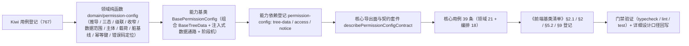

# 01 实施 · 授权编排基类与领域

> 前端组件库 · 08 交互类 · 04 权限配置 · 嵌套子任务 01（需求 08-4）· 实施记录

[文档首页](../../../../../../../文档首页.md) › [08 交互类](../../../08_交互类.md) › [04 权限配置](../../08_交互类_04_权限配置.md) › 实施记录　|　[← 详细设计](../设计/01_详细设计_01_授权编排基类与领域.md)　[测试记录 →](../测试/01_测试_01_授权编排基类与领域.md)

## 1. 实施信息 <a id="meta"></a>

| 项 | 值 |
| --- | --- |
| 任务 | 08-4-1 授权编排基类与领域（[任务](../08_交互类_04_权限配置_01_授权编排基类与领域.md)） |
| 对应需求 | [08-4](../../../../需求/08_需求_交互类.md#r08-4) |
| 详细设计 | [01_详细设计_01_授权编排基类与领域.md](../设计/01_详细设计_01_授权编排基类与领域.md)（定稿提交 `8e86b532`） |
| 实施日期 | 2026-09-19 |
| 实施人 | minjian |
| 实施环境 | Ubuntu 开发机 · Node（workspace `@bms/core`）· Vitest 5 / TypeScript（`tsconfig.base.json` 严格模式） |
| Kiwi 用例 | 767（分类「平台骨架」/ P2 / CONFIRMED / 标签「自动化」） |
| 提交 | `69d7ed9a`（代码）、`a26bc49e`（文档登记） |
| 结论 | 完成标准达标（隐含推导 / 三态级联 / 字段与数据范围默认口径 / 幂等与脏基线 / 上下文刷新 / 占位零请求） |

## 2. 实施概览 <a id="overview"></a>



结果小结：新增 1 个能力基类、1 份领域纯函数（含数据模型与 25 个导出函数）、1 套契约套件与 39 条核心用例；能力依赖登记与《前端基类清单》同步完成；`core` 门禁全绿（39 文件 / 296 用例）。

## 3. 实施过程 <a id="process"></a>

1. **Kiwi 先行**：按《[测试规范](../../../../../../../规范/测试规范.md)》与《[KiwiTCMS部署使用说明](../../../../../../../资料/开发服务器/linux/KiwiTCMS部署使用说明.md)》，经容器内 Django shell 批量登记用例，取得编号 **767**；核心用例文件首行标注 `// kiwi_id: 767`。

   ```bash
   ssh <账号>@<mjbk-IP> "docker exec -i bms-kiwi /Kiwi/manage.py shell" < register_cases.py
   # created case id = 767
   ```

2. **领域纯函数**：`core/src/domain/permission-config.ts` 落权限配置数据模型与纯函数——扁平化 / 查找 / 可授予判定 / 三态 / 级联 / 勾选集合（含业务隐含推导） / 字段归一与收窄 / 字段归属校验 / 数据范围收集 / 主体绑定（去重与上限） / 载荷打包（数组排序保证同内容同载荷） / 载荷稳定序列化（脏基线） / 内容派生幂等键（FNV-1a 32 位） / 错误码解析与页签定位 / 错误码映射表。

3. **能力基类**：`core/src/capabilities/permission-config.ts` 落 `BasePermissionConfig`——四类授权状态、**组合**树族组件基类（节点与勾选集合双向同步）、注入式数据通路（取数 / 提交 / 权限码取数三项处理函数，未注入即占位）、阶段机（`idle → loading / saving → refreshing → done / failed`）、防重复提交、基线下移与撤销、权限上下文刷新（未注入不发请求 + 待刷新标记；刷新失败不否定保存成功）。

4. **登记与导出**：`capabilities/manifest.ts` 新增 `permission-config: ['tree-data', 'access', 'notice']`；`core/src/index.ts` 追加能力基类与领域函数 / 类型导出；`core/testing/index.ts` 追加 `describePermissionConfigContract`（17 组断言）。

5. **清单回写**：《[前端基类清单](../../../../../../../前端基类清单.md)》§2.1 全量表插入编号 43（原 43 ~ 68 顺延为 44 ~ 69）、§2 继承链总览与 §5.2 能力基类表补 `BasePermissionConfig`、§9 契约用例工厂补「权限配置契约套件」。

6. **验证**：`npm run core:typecheck` / `core:lint` / `core:test` 全绿；Prettier 按仓库配置（`frontend/apps/desktop/.prettierrc.json`）格式化。

## 4. 问题与处置 <a id="issues"></a>

| # | 问题 | 处置 |
| --- | --- | --- |
| 1 | 字段权限装载输入允许省略 `visible` / `editable`（后端未配置即默认全开），但内部矩阵需要确定布尔值，原设计只有一种矩阵类型 | 拆分**输入口径**与**运行态口径**：新增 `FieldPermInputCell` / `FieldPermInputRow` 作为装载输入，`normalizeFieldPerms` / `setFieldPerm` / `collectFieldEntries` / `findFieldMismatch` 接输入口径并统一归一出确定布尔值；详细设计 §3.1 已回写 |
| 2 | `disabled` 在组件根 `BaseComponent` 已是属性，基类原设计为访问器覆写 → `TS2611` | 改为**属性覆写并随就绪态联动**（`setReady` 同步 `disabled = !ready`，初值 `true`）；占位语义不变，详细设计 §3.2 已回写 |
| 3 | 首次实现把「字段校验」写进 `setFieldPerm` 的行级过滤，导致 `formKey` 参数未被使用（`TS6133`） | 行级过滤回收进 `setFieldPerm`（`row.formKey === formKey && field.key === fieldKey` 命中才改动），参数重新生效 |
| 4 | 核心 `granted` 为访问器，用例按方法调用 → `TS6234` | 用例统一改为属性访问（`config.granted`） |
| 5 | 单元用例初版未注入权限上下文即断言 `dirty`，`canGrant` 为假致勾选被拒 | 用例补齐 `setCodes(['role:grant'])`（与契约套件「有权」前置一致） |
| 6 | 树族机制的勾选集合若只做节点同步会与树族语义脱节 | `syncTree` 同时同步 `tree.checked`（按已勾选节点键重建），件层可直接消费树族的过滤 / 展开 / 勾选集合 |

## 5. 验证结果 <a id="verify"></a>

| 命令 | 结果 |
| --- | --- |
| `npm run core:typecheck` | 通过 |
| `npm run core:lint` | 通过（`--max-warnings 0`） |
| `npm run core:test` | 39 文件 / 296 用例全绿（本次新增 39：领域 21 + 编排 18），含能力登记对账护栏与注释齐备护栏 |
| Prettier（仓库配置） | 通过（5 个文件已格式化） |

对照完成标准：隐含推导（菜单 → 表单 → 业务只读）、三态与级联（勾选联动、半选、取消连带）、动作默认全无（菜单不联动动作）、挂接缺失不可授予、字段默认全开与收窄载荷、数据范围默认无、主体去重与上限、脏基线与撤销、内容派生幂等键、提交阶段推进与上下文刷新、未注入零请求（占位）、提交失败保留本地并按错误码定位与重试、防重复提交——均有自动化用例覆盖。

## 6. 偏差与遗留 <a id="deviations"></a>

- **工时偏差**：名义 12h；因新增 1 个能力基类、1 份领域纯函数（25 个导出函数）、1 套契约套件与 39 条用例，实际上浮，明细见第 4 节。
- **内部口径调整**（已回写详细设计）：字段权限输入口径拆类型、`disabled` 改属性覆写、`syncTree` 同步树族勾选集合。
- **RBAC 真实联调**：取数 / 全量覆盖提交 / 权限码取数三项处理函数由宿主注入，未注入即占位（不请求）；真实联调随阶段七。
- **幂等键边界**：内容派生幂等键在「同一授权内容两次提交之间被他人改动」时可能被后端按键去重返回首次结果，属幂等语义固有边界，登记为边界。
- **移动端**：`ui-vant` 侧实现未做，契约套件已就位供复用（遗留）。
- **Kiwi 用例台账**：用例 767 已登记于平台；test 仓《Kiwi 用例台账》策展补记按该台账维护节奏处理。

> 本文档依《[文档生成规范](../../../../../../../规范/文档生成规范.md)》编写
