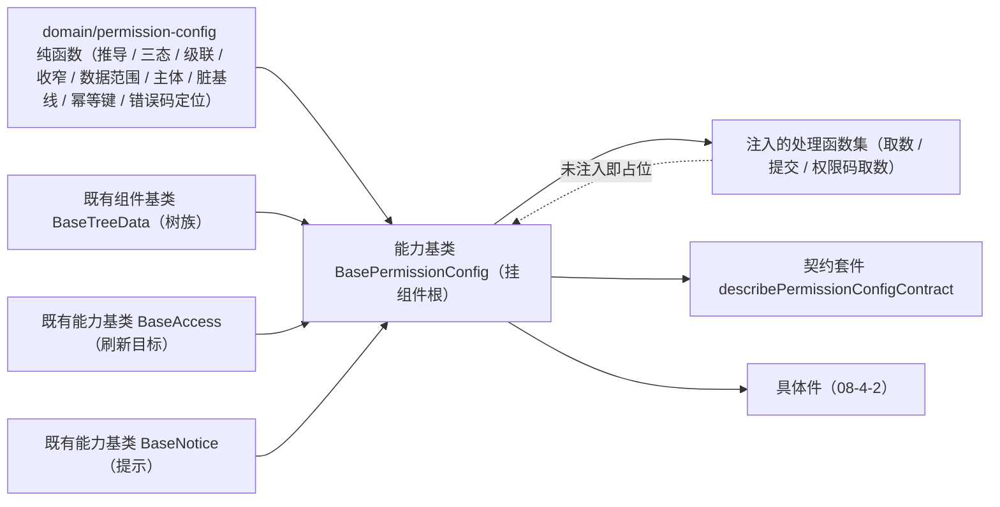

# 01 详细设计 · 授权编排基类与领域

> 前端组件库 · 08 交互类 · 04 权限配置 · 嵌套子任务 01（需求 08-4）· 详细设计

[文档首页](../../../../../../../文档首页.md) › [08 交互类](../../../08_交互类.md) › [04 权限配置](../../08_交互类_04_权限配置.md) › 详细设计　|　[← 任务](../08_交互类_04_权限配置_01_授权编排基类与领域.md)

## 1. 设计目标与范围 <a id="goal"></a>

交付[需求 08-4](../../../../../需求/08_需求_交互类.md#r08-4) 的**授权编排内核**：四类授权状态（权限树 / 字段权限矩阵 / 动作数据范围 / 主体绑定）、隐含推导（菜单 → 表单 → 业务，业务只读）、三态联动与父级级联、全量覆盖提交（幂等键 / 防重复提交 / 失败保留本地）、脏基线判定与撤销，以及保存后的**权限上下文刷新**。

- **领域入核心**：新增 `domain/permission-config.ts`——权限树推导、三态、级联、字段收窄、数据范围收集、主体绑定上限、脏基线稳定序列化、幂等键派生、错误码 → 页签定位，全部为框架无关纯函数。
- **编排入链**：新增能力基类 `BasePermissionConfig`（核心 `capabilities/permission-config.ts`，挂组件根），承载编排状态机与四类授权状态；**组合**树族组件基类 `BaseTreeData` 承接权限树机制（加载 / 勾选集合 / 展开 / 过滤），不在编排层重复实现树机制。
- **数据通路注入式**：取数 / 全量覆盖提交 / 权限码取数三个处理函数由宿主注入；**未注入即占位**（不发请求、返回 `undefined`、写占位文案），与 `08_01_01` 冻结的占位语义一致，真实 RBAC 联调随阶段七。
- **契约套件**：`describePermissionConfigContract` 一套（`@bms/core/testing`），后续移动端实现跑同一套断言。

### 1.1 口径与依从 <a id="positioning"></a>

- **架构铁律**：授权编排为**横切功能**，一律落为**继承链上的能力基类**（核心 `capabilities/`），不在链外自由挂接；具体件只做渲染与投影。
- **继承链**：`BaseComponent`（组件根）→ 能力基类 `BasePermissionConfig` → 具体件（`08-4-2`）。能力基类依赖单向登记于 `capabilities/manifest.ts`。
- **占位口径**：`08_01_01` 已冻结 `PermissionConfig` 对外契约与 `describePlaceholderInteractionContract`；本任务**继续跑同一套占位断言**（未就绪 → 降级 + 禁用 + 零请求），真实实现只换数据通路。
- **上下文刷新口径**（决策）：保存成功后**另发权限码请求**（独立取数处理函数注入点），刷新 `BaseAccess`；未注入时不发请求、仅置「待刷新」标记；刷新失败**不否定保存成功**。
- **字段权限口径**：未配置字段**默认全部可见可编辑**，提交只落**收窄项**（与 `sys_role_field` 仅存收窄记录一致）；字段归属校验失败拒绝（30049）。运行时与布局叠加渲染归 `08_06` 表单渲染器，不在本期。
- **端范围**：**仅 PC**（`frontend/packages/ui-ep`）；移动端复用同一套契约断言，实现遗留。
- **工时**：本嵌套子任务 12h；因新增 1 个能力基类、1 份领域纯函数与 1 套契约套件，实际上浮在实施记录登记。

## 2. 交付物清单 <a id="deliver"></a>

| # | 交付物 | 落点 |
| --- | --- | --- |
| 1 | 权限配置领域纯函数与数据模型 | `core/src/domain/permission-config.ts` |
| 2 | 授权编排能力基类 | `core/src/capabilities/permission-config.ts` |
| 3 | 能力依赖登记（新增 `permission-config` 键） | `core/src/capabilities/manifest.ts` |
| 4 | 核心导出面登记 | `core/src/index.ts` |
| 5 | 契约套件（授权编排） | `core/testing/index.ts` |
| 6 | 核心用例（领域 / 编排） | `core/tests/domain-permission-config.spec.ts`、`core/tests/permission-config.spec.ts` |
| 7 | 登记回写（基类清单 / 组件设计 07 / 实施与测试记录） | 见第 6 节 |



## 3. 接口 / 契约与边界 <a id="contract"></a>

### 3.1 核心：`domain/permission-config.ts`（新增纯函数与数据模型） <a id="domain"></a>

```ts
/** 权限节点类型（业务为推导只读）。 */
export type PermissionNodeType = 'menu' | 'form' | 'business' | 'action'
/** 授权页签。 */
export type PermissionTab = 'tree' | 'field' | 'scope' | 'subject'
/** 权限节点。 */
export interface PermissionNode {
  key: string
  label: string
  type: PermissionNodeType
  icon?: string
  checked?: boolean
  detached?: boolean          // 挂接缺失（菜单缺表单 / 表单缺业务）→ 不可授予
  children?: PermissionNode[]
}
/** 勾选三态。 */
export type PermissionCheckState = 'checked' | 'indeterminate' | 'unchecked'
/** 字段权限项（未配置默认全开）。 */
export interface FieldPermCell { key: string; label: string; visible: boolean; editable: boolean }
/** 字段权限矩阵行（表单 × 字段）。 */
export interface FieldPermRow { formKey: string; formLabel: string; fields: FieldPermCell[] }
/** 字段权限输入项（可省略，省略即默认全开）。 */
export interface FieldPermInputCell { key: string; label: string; visible?: boolean; editable?: boolean }
/** 字段权限输入行（装载输入口径，省略即可见可编辑）。 */
export interface FieldPermInputRow { formKey: string; formLabel: string; fields: FieldPermInputCell[] }
/** 动作数据范围行（默认无）。 */
export interface DataScopeRow { actionKey: string; actionLabel: string; expression: string; builtin?: boolean }
/** 主体类型（后续实体仅扩枚举）。 */
export type PermissionSubjectType = 'user' | 'position' | 'dept'
/** 主体绑定项。 */
export interface PermissionSubject { id: string; type: PermissionSubjectType; name: string }
/** 授权快照（四类授权 + 角色；字段权限按装载输入口径，省略即默认全开）。 */
export interface PermissionSnapshot {
  roleId?: string | number
  nodes: PermissionNode[]
  fieldPerms: FieldPermInputRow[]
  dataScopes: DataScopeRow[]
  subjects: PermissionSubject[]
}
/** 扁平节点（模板不做递归）。 */
export interface FlatPermissionNode { node: PermissionNode; depth: number }
/** 勾选集合（业务为推导只读，不进载荷）。 */
export interface PermissionGranted { menus: string[]; forms: string[]; actions: string[]; implied: string[] }
/** 字段收窄项（仅收窄入选载荷）。 */
export interface FieldPermEntry { formKey: string; fieldKey: string; visible: boolean; editable: boolean }
/** 数据范围项（仅非空表达式入选载荷）。 */
export interface DataScopeEntry { actionKey: string; expression: string }
/** 全量覆盖提交载荷。 */
export interface PermissionPayload {
  roleId?: string | number
  menus: string[]
  forms: string[]
  actions: string[]
  fields: FieldPermEntry[]
  dataScopes: DataScopeEntry[]
  subjects: PermissionSubject[]
}
/** 错误码定位（不定位页签时为整体错误）。 */
export interface PermissionErrorTarget { tab?: PermissionTab; key?: string; i18nKey: string }
/** 主体绑定结果。 */
export interface SubjectBindResult { list: PermissionSubject[]; applied: boolean; reason?: 'duplicate' | 'limit' }

/** 授权写权限码。 */
export const PERMISSION_GRANT_CODE = 'role:grant'
/** 页签顺序。 */
export const PERMISSION_TABS: readonly PermissionTab[]
/** 单主体可绑定角色数上限缺省值。 */
export const PERMISSION_SUBJECT_LIMIT = 20
/** 占位文案（数据通路未就绪）。 */
export const PERMISSION_PLACEHOLDER_TEXT: string
/** 错误码 → 页签 / 处置映射表。 */
export const PERMISSION_ERROR_TARGETS: Readonly<Record<number, PermissionErrorTarget>>

flattenPermissionTree(nodes: readonly PermissionNode[], depth?: number): FlatPermissionNode[]
findPermissionNode(nodes: readonly PermissionNode[], key: string): PermissionNode | undefined
isGrantable(node: PermissionNode): boolean
resolveCheckState(node: PermissionNode): PermissionCheckState
applyPermissionCheck(nodes: readonly PermissionNode[], key: string, checked?: boolean): PermissionNode[]
deriveGranted(nodes: readonly PermissionNode[]): PermissionGranted
normalizeFieldPerms(rows: readonly FieldPermInputRow[]): FieldPermRow[]
setFieldPerm(rows: readonly FieldPermInputRow[], formKey: string, fieldKey: string, patch: { visible?: boolean; editable?: boolean }): FieldPermRow[]
collectFieldEntries(rows: readonly FieldPermInputRow[]): FieldPermEntry[]
findFieldMismatch(rows: readonly FieldPermInputRow[], registry: Readonly<Record<string, readonly string[]>>): { formKey: string; fieldKey: string } | undefined
setDataScope(rows: readonly DataScopeRow[], actionKey: string, expression: string): DataScopeRow[]
collectDataScopes(rows: readonly DataScopeRow[]): DataScopeEntry[]
bindSubject(list: readonly PermissionSubject[], subject: PermissionSubject, limit?: number): SubjectBindResult
unbindSubject(list: readonly PermissionSubject[], id: string, type?: PermissionSubjectType): PermissionSubject[]
collectPayload(snapshot: PermissionSnapshot): PermissionPayload
payloadKey(snapshot: PermissionSnapshot): string
deriveIdempotencyKey(roleId: string | number | undefined, key: string): string
resolveErrorCode(error: unknown): number | undefined
resolveErrorTarget(code: number | undefined): PermissionErrorTarget | undefined
```

| 行为 | 口径 |
| --- | --- |
| 扁平化 | 深度优先，`depth` 自 0 起（供件层缩进渲染；模板不做递归） |
| 可授予判定 | 业务节点**只读**（推导结果，不提供直接勾选入口）；挂接缺失（`detached`）节点不可授予 —— 两者 `isGrantable` 为假 |
| 勾选级联（下行） | 勾选：本节点与其**后代中的菜单 / 表单 / 业务**置勾选，**动作不联动**（动作默认全无、须显式勾选）；取消：本节点与其**全部后代**（含动作）置取消（菜单取消连带取消其表单 / 动作） |
| 三态 | 自身勾选 → `checked`；否则任一后代勾选 → `indeterminate`（半选）；否则 `unchecked` |
| 隐含推导 | `deriveGranted` 分别收集已勾选菜单 / 表单 / 动作；`implied` = 命中「自身或其祖先（菜单 / 表单）已勾选」的业务节点键。**业务键仅供只读展示，不进提交载荷**（由后端按挂接关系落库） |
| 字段默认 | `normalizeFieldPerms` 把缺省的 `visible` / `editable` 补为 `true`（未配置字段全部可见可编辑） |
| 字段收窄 | `collectFieldEntries` 只收集 `visible === false` 或 `editable === false` 的项（与 `sys_role_field` 仅存收窄记录一致）；字段不存在时 `setFieldPerm` 原样返回（不新增） |
| 字段校验 | `findFieldMismatch` 校验字段属该表单字段集合，命中即拒绝（30049） |
| 数据范围默认 | 默认**无**数据权限：空表达式不入载荷；`collectDataScopes` 只收集非空（去空白）表达式行 |
| 主体绑定 | `bindSubject` 幂等（同 `type + id` 重复绑定返回 `applied: false, reason: 'duplicate'`）；超出上限返回 `applied: false, reason: 'limit'`（不写入）；`unbindSubject` 按 `id`（可带 `type`）移除 |
| 载荷确定性 | `collectPayload` 各数组**排序**（键集合语义），保证同内容同载荷；菜单 / 表单 / 动作取自定义项派生结果，主体按 `type + id` 排序 |
| 脏基线 | `payloadKey` = 载荷的稳定序列化（`stableStringify`）；基线键与当前键不等即脏 —— 与节点顺序、字段顺序无关，只反映**授权语义** |
| 幂等键 | `deriveIdempotencyKey` = `perm:{roleId}:{FNV-1a 32 位十六进制}`（载荷键派生）：同内容 → 同键（重试 / 重复提交结果一致），内容变更 → 新键；核心不自造随机数、不依赖加密库 |
| 错误码定位 | `resolveErrorCode` 从错误对象取数值 `code`（`BaseError.code` 或宿主请求层错误）；`resolveErrorTarget` 查映射表，未命中返回 `undefined` |
| 纯数据 | 不触 DOM、不请求、不依赖渲染框架；同输入同输出 |

**错误码映射表**（文案走 i18n `error.{code}`，见第 7 节上游登记）：

| 错误码 | 含义 | 定位页签 |
| --- | --- | --- |
| 30043 | 内置角色保护（归属不可改） | 不定位（整体错误） |
| 30044 | 角色仍存在主体绑定，删除被拒 | 主体绑定 |
| 30046 | 菜单缺表单 / 表单缺业务（挂接缺失） | 权限树 |
| 30047 | 数据范围规则表达式非法 | 数据范围 |
| 30048 | 三权分立冲突（职责互斥 / 兼任） | 主体绑定 |
| 30049 | 字段不属该表单字段集合 | 字段权限 |

### 3.2 核心：能力基类 `BasePermissionConfig`（新增） <a id="base"></a>

```ts
/** 取数处理函数（未注入即占位）。 */
export type PermissionLoadHandler = (input: { roleId: string | number | undefined }) => Promise<PermissionSnapshot>
/** 提交结果。 */
export interface PermissionSubmitResult { recordVersion?: number; version?: number; message?: string }
/** 提交处理函数（全量覆盖 + 幂等键；未注入即占位）。 */
export type PermissionSubmitHandler = (input: {
  roleId: string | number | undefined
  payload: PermissionPayload
  idempotencyKey: string
}) => Promise<PermissionSubmitResult>
/** 权限码取数处理函数（保存成功后刷新上下文；未注入不发请求）。 */
export type PermissionCodesHandler = () => Promise<readonly string[]>
/** 注入的处理函数集。 */
export interface PermissionJobs {
  load?: PermissionLoadHandler
  submit?: PermissionSubmitHandler
  loadPermissionCodes?: PermissionCodesHandler
}
/** 授权编排阶段。 */
export type PermissionPhase = 'idle' | 'loading' | 'saving' | 'refreshing' | 'done' | 'failed'

export abstract class BasePermissionConfig extends BaseComponent {
  readonly identifier: string = 'permission-config'
  roleId: string | number | undefined
  nodes: PermissionNode[]
  fieldPerms: FieldPermRow[]
  dataScopes: DataScopeRow[]
  subjects: PermissionSubject[]
  tab: PermissionTab                     // 缺省 'tree'
  ready: boolean                         // 数据通路就绪（占位语义开关）
  requestCount: number                   // 实际发起的请求计数（占位期恒 0）
  phase: PermissionPhase
  errorMessage: string
  errorTarget: PermissionErrorTarget | undefined
  pendingAccessRefresh: boolean          // 权限上下文待刷新
  refreshError: string                   // 刷新失败文案（不否定保存成功）
  lastResult: PermissionSubmitResult | undefined
  grantPerm: string                      // 缺省 PERMISSION_GRANT_CODE
  subjectLimit: number                   // 缺省 PERMISSION_SUBJECT_LIMIT
  jobs: PermissionJobs
  tree: BaseTreeData                     // 组合的树族机制实例
  access: BaseAccess | undefined         // 刷新目标（未注入不校验 / 不刷新）
  notice: BaseNotice | undefined         // 提示（未注入不发通知）

  disabled: boolean                      // 占位态强制禁用（随 setReady 与 ready 联动）
  get degraded(): boolean                // !ready
  get busy(): boolean                    // loading / saving / refreshing
  get dirty(): boolean
  get payload(): PermissionPayload
  get idempotencyKey(): string
  get granted(): PermissionGranted
  get canGrant(): boolean                // 权限上下文未注入或未声明权限码时视为有权
  get canSave(): boolean
  get refreshReady(): boolean            // 已注入权限码取数处理函数

  setReady(value: boolean): void
  setTab(tab: PermissionTab): void
  setRole(roleId: string | number | undefined): void
  setJobs(jobs: PermissionJobs): void
  load(): Promise<PermissionSnapshot | undefined>
  applySnapshot(snapshot: PermissionSnapshot): void
  toggleNode(key: string, checked?: boolean): boolean
  checkState(key: string): PermissionCheckState | undefined
  setFieldPerm(formKey: string, fieldKey: string, patch: { visible?: boolean; editable?: boolean }): boolean
  setDataScope(actionKey: string, expression: string): boolean
  bindSubject(subject: PermissionSubject): boolean
  unbindSubject(id: string, type?: PermissionSubjectType): boolean
  save(): Promise<PermissionSubmitResult | undefined>
  refreshAccess(): Promise<boolean>
  retry(): Promise<PermissionSubmitResult | undefined>
  reset(): void
  discard(): void
}
```

| 行为 | 口径 |
| --- | --- |
| 装载 | `applySnapshot` 整体替换四类授权、把权限树同步进组合的树族机制（`tree.load`）、**深拷贝记脏基线**并清脏；空树由件层判空态 |
| 切换角色 | `setRole` 清空四类授权与基线、树清空、阶段回 `idle`（须重新取数） |
| 取数 | `load()` 仅在 `ready` 且已注入取数处理函数时发请求（`requestCount + 1`）并计阶段 `loading`；未就绪 / 未注入**不发请求**、返回 `undefined`；失败置 `failed` 并写错误码定位 |
| 勾选 | `toggleNode` 在未就绪 / 无权 / 业务只读 / 挂接缺失 / 节点不存在时**不动作**并返回 `false`；成功经领域级联更新并同步树族机制 |
| 提交前置 | `canSave` = 就绪 ∧ 有权 ∧ 非进行中；未注入提交处理函数时 `save()` 占位（不请求、写占位文案、返回 `undefined`） |
| 全量覆盖提交 | `save()` 打包四类授权载荷 + `Idempotency-Key`（内容派生，同内容同键）交处理函数；**进行中重复提交返回 `undefined`**（防重复提交，件层同时禁用按钮） |
| 提交成功 | 基线前移（提交内容即新基线、清脏）→ 阶段 `refreshing` → 刷新权限上下文 → 阶段 `done`；经提示能力提示「已生效」（注入时） |
| 上下文刷新 | `refreshAccess()`：未注入取码处理函数 → **不发请求**、置 `pendingAccessRefresh = true`、返回 `false`；注入后取码并 `access.setCodes(codes)`、清待刷新标记；**取码失败置 `refreshError` 与待刷新标记，但阶段仍为 `done`**（刷新失败不否定保存成功），件层可再次触发或提示 |
| 提交失败 | 阶段 `failed`、写 `errorMessage` 与 `errorTarget`（由错误码定位页签）；**不回写基线、不清行内变更**（保存失败保留本地）；`retry()` 仅在 `failed` 阶段重放 `save()` |
| 撤销 | `discard()` 从基线深拷贝回滚四类授权（撤销未保存变更）；`reset()` 只把阶段回 `idle` 并清错误（保留数据） |
| 脏判定 | `dirty` 由「当前载荷键 ≠ 基线键」得出；**未装载（无基线）时恒为假** |
| 权控 | `canGrant`：权限上下文已注入且声明了写权限码时按 `has(grantPerm)` 判定；未注入或权限码为空视为有权（后端兜底） |
| 占位语义 | `ready === false` → `degraded` / `disabled` 为真、所有取数与提交**零请求**（`requestCount` 恒 0），保持 `08_01_01` 冻结口径 |
| 纯数据 | 不触 DOM、不请求；状态变更经生命周期 `update` 通知 |

- 依赖登记：`permission-config: ['tree-data', 'access', 'notice']`（组件根之下，三项协作者均单向）。
- 不含渲染与字段壳语义（归 `08-4-2` 具体件）；不含权限计算与缓存（归权限计算引擎）。

### 3.3 契约套件（`@bms/core/testing`） <a id="testing"></a>

| 套件 | 契约面（结构化接口） | 断言要点 |
| --- | --- | --- |
| `describePermissionConfigContract(name, create)` | `ready` / `degraded` / `disabled` / `requestCount` / `dirty` / `phase` / `canSave` / `pendingAccessRefresh` / `accessCodes` / `setReady` / `setAccess` / `setHandlers` / `load` / `applySnapshot` / `toggleNode` / `checkState` / `granted()` / `fieldPerm` / `setFieldPerm` / `scopeExpression` / `setDataScope` / `subjectIds` / `bindSubject` / `payload()` / `idempotencyKey()` / `submitCount()` / `save` / `retry` / `discard` / `refreshAccess` / `errorTargetTab()` | 占位零请求与就绪不变占位；隐含推导（菜单 → 表单 → 业务只读）与三态半选；动作默认全无、菜单不联动动作；取消菜单连带取消表单 / 动作；挂接缺失不可授予；字段默认全开与收窄入载荷；数据范围默认无；主体去重与上限；脏基线与撤销回滚；同内容同幂等键、内容变更换键；提交阶段 `saving → refreshing → done`；注入取码刷新上下文、未注入置待刷新且不增请求；未注入提交不请求且保留本地；提交失败按错误码定位页签并可重试；进行中重复提交不动作；无权不可保存且不可勾选 |

- 目标约定：角色 `r1`；权限树含菜单 `menu:user`（表单 `form:user` → 业务 `biz:user`，动作 `act:user:create` 默认无）与挂接缺失菜单 `menu:orphan`；字段矩阵含表单 `form:user` 的字段 `name` / `salary`；数据范围含动作 `act:user:list`（表达式初始为空）；主体初始为空。
- 套件同时被 `ui-ep`（投影适配）与后续移动端实现消费；本期无第二实现时由 `ui-ep` 用例驱动。

### 3.4 投影与件（归 `08-4-2`） <a id="bindings"></a>

本子任务只交付核心；`ui-ep` 侧的投影（`useBasePermissionConfig` / `useBaseFieldPerm`）与五件组件由 [08-4-2](../../08_交互类_04_权限配置_02_授权组件与宿主核对页/08_交互类_04_权限配置_02_授权组件与宿主核对页.md) 交付，契约面不变。

## 4. 失败分支与边界 <a id="edge"></a>

| 边界 / 失败场景 | 处置 |
| --- | --- |
| 数据通路未就绪（`ready` 为假） | 占位：渲染降级提示、操作禁用、取数与提交零请求 |
| 处理函数未注入 | 占位：不请求、返回 `undefined`、写占位文案；件层据 `refreshReady` 等禁用入口 |
| 业务权限节点被直接勾选 | 只读：不动作、返回 `false`（界面不给勾选入口） |
| 挂接缺失节点被勾选 | 不动作、返回 `false`；件层标记「未挂接」并提示（30046） |
| 未勾选任何菜单 / 表单 | 载荷授权集合为空（空角色未授权合法） |
| 字段不在表单字段集合 | 拒绝（30049），件层按错误码定位到字段权限页签 |
| 数据范围表达式非法 | 提交后由后端拒绝（30047）；核心按错误码定位到数据范围页签并保留本地 |
| 主体重复绑定 | 幂等：不写入、返回 `false`（`duplicate`） |
| 主体超上限 | 不写入、返回 `false`（`limit`），件层提示上限 |
| 全量覆盖提交失败 | 阶段 `failed`、保留本地未保存变更；重试重放同内容（同幂等键） |
| 提交 / 刷新进行中重复提交 | 不动作、返回 `undefined`（防重复提交） |
| 取码处理函数未注入 | 不发请求、置「待刷新」标记、阶段仍 `done`（不否定保存成功） |
| 取码失败 | 写 `refreshError` 与待刷新标记、阶段仍 `done`；件层提示并允许再次刷新 |
| 无权（缺 `role:grant`） | `canSave` 为假、勾选与编辑不动作；后端兜底 |
| 三权分立冲突（30048） | 由后端拒绝；核心按错误码定位到主体绑定页签并提示 |
| 内置角色保护（30043） | 由后端拒绝；核心按错误码给出整体提示（不定位页签） |
| 大树 | 树机制走 `BaseTreeData`（展开 / 过滤 / 懒渲染由件层消费）；核心只做纯数据推导 |

## 5. 测试设计与验收映射 <a id="test"></a>

| 验收点（需求 08-4 / 子任务 08-4-1） | 用例 |
| --- | --- |
| 隐含推导（菜单 → 表单 → 业务只读） | `core/tests/domain-permission-config.spec.ts` + 契约套件「隐含推导」+ 编排用例 |
| 三态联动的半选与父级级联 | 同上（领域断言 + 契约套件「三态」） |
| 动作默认全无、菜单不联动动作 | 同上 |
| 取消菜单连带取消表单 / 动作 | 同上 |
| 挂接缺失不可授予 | 同上 |
| 字段权限默认全开、收窄入载荷、字段不匹配 | 同上 + 契约套件「字段矩阵」 |
| 数据范围默认无、非空表达式入载荷 | 同上 |
| 主体绑定去重与上限 | 同上 + 契约套件「主体绑定」 |
| 脏基线与撤销回滚 | 同上 + 契约套件「脏基线与撤销」 |
| 幂等（同内容同键、内容变更换键、重复提交结果一致） | 同上 + 契约套件「幂等键」 |
| 全量覆盖提交阶段推进与上下文刷新 | 编排用例（取码注入 / 未注入两路径）+ 契约套件 |
| 提交失败保留本地、错误码定位、可重试 | 编排用例 + 契约套件「失败与重试」 |
| 防重复提交 | 同上 |
| 占位语义（降级 / 禁用 / 零请求） | 契约套件驱动 `describePlaceholderInteractionContract`（`08_01_01` 冻结，真实实现继续跑） |
| `vue-tsc`、ESLint、Vitest 全通过 | 根 `npm run check` |
| 文档链接与基座校验 | `check-links.py`、`check-base.py` |

- Kiwi 用例 1 条（一任务一条，编号于测试步登记后回填，预计 767；分类「平台骨架」、优先级 P2、状态 CONFIRMED、标签「自动化」）。

## 6. 登记落点 <a id="register"></a>

| 内容 | 落点 |
| --- | --- |
| 新增能力基类 `BasePermissionConfig`（能力键 `permission-config`） | 《[前端基类清单](../../../../../../../前端基类清单.md)》§2.1 插入行（父基类 `BaseComponent`，组件侧·能力基类，状态「已交付」，后续编号顺延）+ §2 继承链总览 + §5.2 能力基类表 + `capabilities/manifest.ts` |
| 领域纯函数与数据模型 `domain/permission-config.ts` | 同上 §9「核心」（`domain/` 领域纯函数） |
| 契约套件 | 同上 §9（`core/testing/`：授权编排一套） |
| 设计口径回写 | 《组件设计》[07 权限配置](../../../../../../../设计/组件设计/08_交互类/07_组件设计_权限配置/07_组件设计_权限配置.md)：继承链行改为现行口径（组件根 → 能力基类 → 具体件；树族机制为组合的组件基类）；字段权限「默认全开 + 仅存收窄」与「动作默认全无」口径与模型节对齐 |
| 上游登记（3 项，本任务只登记归口、不代上游裁决） | ① 授权交互与批量接口口径 → 《概要设计 · 角色管理》「接口设计」节；② 权限树挂接与按钮 / 字段来源 → 《概要设计 · 菜单管理》；③ 数据范围规则编辑与校验（含预置变量与已注册字段下发）→ 《架构设计 · 权限计算引擎》「数据范围」节 |
| 任务 / 父任务 / 域任务 / 计划状态 | [任务](../08_交互类_04_权限配置_01_授权编排基类与领域.md)、[父任务](../../08_交互类_04_权限配置.md)、[域任务](../../../08_交互类.md)、[计划](../../../../../../../项目/04_前端组件库/计划/01_计划_前端组件库.md)（嵌套子任务并入父任务行；完成后由 §3 移入 §2，§4 甘特同步） |
| 需求文档 | 不承载进度（状态只在任务与计划两处一致）；遗留归口写在实施 / 测试记录与计划 |

## 7. 边界与开放项 <a id="open"></a>

- **不在本期**：RBAC 真实接口联调（取数 / 全量覆盖提交 / 权限概要取码，随阶段七）；字段权限与布局叠加的运行时渲染（`08_06` 表单渲染器）；菜单 / 字段实体维护（菜单管理）；角色增删改与列表（页面 + 通用表格）；权限计算与缓存（权限计算引擎）；三权分立规则判定（后端）；移动端实现（契约套件已就位供复用）。
- **上游登记待确认**（组件设计 07 已列，本任务只登记归口）：① 授权交互与批量接口口径（页签、全量覆盖 + `Idempotency-Key` + 版本一次 +1、隐含推导由后端落库）；② 权限树挂接与按钮 / 字段来源（挂接缺失拦截 30046）；③ 数据范围规则编辑与校验（预置变量与已注册字段下发、保存前沙箱校验、读写双向与租户强制叠加）。
- **协同契约**：取数 / 提交 / 权限码取数三个处理函数由宿主注入（本任务不实现后端通路）；权限上下文由宿主注入 `BaseAccess` 实例；提示经 `BaseNotice`；主体上限默认 20，可由调用方覆盖（`role.max_per_subject`）。
- **遗留登记**：幂等键为**内容派生**——若同一份授权内容在两次提交之间被他人改动，后端按键去重可能返回首次结果（幂等语义的固有边界，登记为边界）；RBAC 联调后核对「提交响应是否返回版本号」（本任务只记录 `recordVersion` 缺省不消费）。
- Kiwi 用例编号于测试步登记后回填实施 / 测试记录与用例文件（预计 767）。

## 8. 决策记录 <a id="decision"></a>

| # | 决策项 | 结论 |
| --- | --- | --- |
| 1 | 后端依赖处置 | 真实编排 + 注入式数据通路；未注入即占位不请求；RBAC 真实联调遗留阶段七（同 `07_03` 口径） |
| 2 | 编排落点 | 新增能力基类 `BasePermissionConfig`（挂组件根） |
| 3 | 权限树挂链 | 编排基类**组合** `BaseTreeData`，树机制不重复实现；依赖登记加 `tree-data` |
| 4 | 任务粒度 | 父任务 08-04 拆两个嵌套子任务（本任务 12h / `08-4-2` 8h） |
| 5 | 幂等键 | 核心生成（内容派生）、同内容复用同键；内容变更换键 |
| 6 | 上下文刷新 | 核心另发权限码请求：独立取数处理函数注入点；未注入不发请求 + 待刷新标记；刷新失败不否定保存成功 |
| 7 | 错误码定位 | 核心内置「错误码 → 页签 / 处置」映射表，文案走 i18n `error.300xx` |
| 8 | 业务权限语义 | 推导只读（不可勾选、不进载荷），由后端按挂接关系落库 |
| 9 | 动作权限语义 | 默认全无、须显式勾选；菜单勾选**不联动**动作 |
| 10 | 字段权限语义 | 默认全开、只提交收窄项（与 `sys_role_field` 仅存收窄记录一致） |
| 11 | 数据范围语义 | 默认无、只提交非空表达式 |
| 12 | 脏基线 | 载荷稳定序列化比对（与顺序无关，只反映授权语义）；`discard` 回滚 |
| 13 | 能力键命名 | `permission-config`（依赖 `tree-data` / `access` / `notice`） |
| 14 | 领域文件命名 | `domain/permission-config.ts`（避开既有 `domain/permission.ts` 权限判定纯函数） |
| 15 | 字段权限族基类 | 由 `08-4-2` 的矩阵单元格子件挂 `useBaseFieldPerm`（本任务只登记契约） |

## 9. 参考文档 <a id="ref"></a>

- [需求 08-4](../../../../../需求/08_需求_交互类.md#r08-4)、[任务 08-4-1](../08_交互类_04_权限配置_01_授权编排基类与领域.md)、[父任务 04 权限配置](../../08_交互类_04_权限配置.md)
- 《组件设计》[07 权限配置](../../../../../../../设计/组件设计/08_交互类/07_组件设计_权限配置/07_组件设计_权限配置.md)（含[可交互原型](../../../../../../../设计/组件设计/08_交互类/07_组件设计_权限配置/07_原型设计_权限配置.html)，原型即验收基准）
- 《[架构设计 · 子系统 · 权限计算引擎](../../../../../../../设计/架构设计/15_架构设计_子系统_权限计算引擎.md)》、《[架构设计 · 前端组件体系](../../../../../../../设计/架构设计/05_架构设计_前端组件体系.md)》、《[架构设计 · 扩展点与插件化](../../../../../../../设计/架构设计/10_架构设计_子系统_扩展点与插件化.md)》
- 《概要设计》[角色管理](../../../../../../../设计/概要设计/06_概要设计_角色管理.md)、[菜单管理](../../../../../../../设计/概要设计/07_概要设计_菜单管理.md)
- [《前端基类清单》](../../../../../../../前端基类清单.md)、《[前端开发规范](../../../../../../../规范/前端开发规范.md)》、《[文档生成规范](../../../../../../../规范/文档生成规范.md)》
- [08_01_01 配置与工作流占位](../../../08_交互类_01_占位版交付/08_交互类_01_占位版交付_01_配置与工作流占位/08_交互类_01_占位版交付_01_配置与工作流占位.md)（冻结对外契约与占位套件）

> 本文档依《[文档生成规范](../../../../../../../规范/文档生成规范.md)》编写
