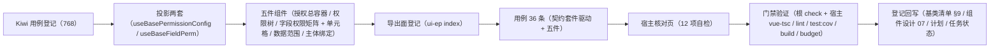

# 02 实施 · 授权组件与宿主核对页

> 前端组件库 · 08 交互类 · 04 权限配置 · 嵌套子任务 02（需求 08-4）· 实施记录

[文档首页](../../../../../../../文档首页.md) › [08 交互类](../../../08_交互类.md) › [04 权限配置](../../08_交互类_04_权限配置.md) › 实施记录　|　[← 详细设计](../设计/01_详细设计_02_授权组件与宿主核对页.md)　[测试记录 →](../测试/01_测试_02_授权组件与宿主核对页.md)

## 1. 实施信息 

| 项 | 值 |
| --- | --- |
| 任务 | 08-4-2 授权组件与宿主核对页（[任务](../08_交互类_04_权限配置_02_授权组件与宿主核对页.md)） |
| 对应需求 | [08-4](../../../../../需求/08_需求_交互类.md#r08-4) |
| 详细设计 | [01_详细设计_02_授权组件与宿主核对页.md](../设计/01_详细设计_02_授权组件与宿主核对页.md)（定稿提交 `d4ad1680`） |
| 实施日期 | 2026-09-19 |
| 实施人 | minjian |
| 实施环境 | Ubuntu 开发机 · Node（workspace `@bms/ui-ep` + `apps/desktop`）· Vitest 5 / jsdom · Vue 3.5 / TypeScript 严格模式 |
| Kiwi 用例 | 768（分类「平台骨架」/ P2 / CONFIRMED / 标签「自动化」） |
| 结论 | 完成标准达标（五件可用、隐含推导与只读标识正确、默认口径正确、提交幂等与上下文刷新可验证、核对页 12/12） |

## 2. 实施概览 

结果小结：新增 2 套投影与 6 个组件文件（5 件 + 单元格子件），`PermissionConfig` 对外契约保持并作向后兼容扩展；契约套件在 `ui-ep` 投影上驱动通过（18 组断言）；`ui-ep` 38 文件 / 380 用例全绿（本次新增 36）。

## 3. 实施过程 

1. **Kiwi 先行**：经容器内 Django shell 登记用例，取得编号 **768**；用例文件首行标注 `// kiwi_id: 768`。
2. **投影两套**（`ui-ep/src/composables/`）：`useBasePermissionConfig`（编排投影：四类授权 / 阶段机 / 提交与刷新 / 就绪联动，另提供 `setJobs` / `setAccess` 注入入口）与 `useBaseFieldPerm`（字段权限三态投影）；跨实例基类对象经 `markRaw(toRaw(x))` 隔离。
3. **五件组件**（`ui-ep/src/components/interaction/`）：
   - `PermissionConfig.vue`（授权总容器）：四类页签装配（`tab` 受控 + `update:tab`）、自动取数、全量覆盖提交、撤销 / 重试 / 刷新、脏数据与错误码定位展示、占位降级；既有 Props 语义升级为**受控覆盖**（`treeNodes` / `fieldPerms` / `dataScopes` / `subjects` / `loading` / `dirty`），新增 `jobs` / `access` / `grantPerm` / `subjectLimit` / `autoLoad` / `subjectCandidates` / `scope*` 与 `saved` / `failed` 事件。
   - `PermissionTree.vue`（权限树）：树机制经树族投影（加载 / 展开 / 过滤文本），三态与级联读领域纯函数；业务只读标识、挂接缺失禁用、搜索命中父链、展开收起全部、图标经图标渲染件。
   - `FieldPermMatrix.vue` + `FieldPermCell.vue`（字段权限矩阵与单元格）：默认全开、收窄、批量（全选可见 / 全选不可见 / 全选可编辑）、仅显示已收窄、搜索、分页（缺省 20 行 / 页）；单元格经字段权限族投影承载三态与生效禁用。
   - `DataScopePanel.vue`（数据范围）：按动作切换 + 单编辑区复用表达式编辑器（预置变量 / 字段插入、模板套用、校验），空表达式展示「无数据权限」，支持清除。
   - `SubjectBinding.vue`（主体绑定）：主体类型页签 + 候选经选项源基类（本地候选加载 + 名称搜索）+ 勾选绑定 / 移除解绑 + 达上限提示。
4. **导出面**：`ui-ep/src/index.ts` 追加五件、两投影与类型导出；权限配置对外类型（`DataScopeRow` / `FieldPermRow` / `PermissionNode` / `PermissionTab` / `SubjectItem`）改由核心领域模块统一导出，`SubjectItem` 映射到核心 `PermissionSubject`（保持既有公开名）。
5. **用例**：`ui-ep/tests/interaction-permission.spec.ts`（36 条）——契约套件驱动（18 组断言，含投影适配）+ 两投影 + 四件单测 + 容器件（占位零请求、勾选联动、保存与刷新、失败定位与重试、页签受控、受控覆盖）。
6. **宿主核对页**：`apps/desktop/permission-config-check.html` + `src/dev/permissionConfigCheck.ts` + `src/dev/PermissionConfigCheck.vue`（容器 + 五件单独复用示例 + 12 项自检上屏，`vite build` 只构建 `index.html` 故不入产物）；以 chromium headless `--dump-dom` 核验 12/12 通过。
7. **登记回写**：《前端基类清单》§9 补两投影；《组件设计 07 权限配置》继承链行改现行口径；计划 §1 / §2 / §3 / §4 / §5 与任务三处状态一致。

## 4. 问题与处置 

| # | 问题 | 处置 |
| --- | --- | --- |
| 1 | 字段权限装载输入允许省略 `visible` / `editable`，契约套件快照即如此，核心运行态却要求确定布尔值 | 领域拆**输入口径**（`FieldPermInputCell` / `FieldPermInputRow`）与运行态口径，归一函数统一补默认全开；详细设计已回写 |
| 2 | 数据范围表达式同样可省略，`collectDataScopes` 读 `expression.trim()` 抛错（契约套件用例暴露） | 新增 `DataScopeInputRow` 与 `normalizeDataScopes`，收集函数按「省略即无数据权限」处理；详细设计已回写 |
| 3 | 组件根 `BaseComponent` 已有 `disabled` 属性，能力基类原设计用访问器覆写 → `TS2611` | 改为属性覆写并随就绪态联动（`setReady` 同步 `disabled = !ready`） |
| 4 | 树件展开态存在树族机制的非响应式集合中，展开 / 收起不触发重渲染 | 件层加展开态变更序号（`expandedTick`），展开判断与工具栏文案均读该序号建立依赖 |
| 5 | 主体候选从选项源基类实例态读取，选项加载完成后组件不重算（候选恒为空） | 候选计算显式依赖投影返回的选项响应式面（`source.options`），加载完成后重算 |
| 6 | 页签原设计为「点击即内部切换」，与 `08_01_01` 冻结的受控契约不符（占位用例点击页签后仍断言树渲染） | 统一为**受控口径**：`tab` 由调用方经 `v-model:tab` 维护，点击只上抛 `update:tab`；核对页与用例按受控写回 |
| 7 | 五件作为子件被容器引用时，容器传入的 `data-test` 覆盖了子件自身标识（属性透传覆盖） | 面板外层包一层标记容器（`panel-tree` / `panel-field` / `panel-scope` / `panel-subject`），子件保留自身 `data-test` |
| 8 | 矩阵内表单名 `data-test="form-label"` 与表单分组前缀 `form-*` 选择器冲突（分页断言多计一项） | 表单名标记改名 `matrix-form-label`，用例选择器收窄为表单键前缀 |
| 9 | 契约目标在未调用 `setAccess` 前即注入空权限上下文，导致「隐含推导」等前置断言被 `canGrant` 拒绝 | 契约适配改为**首次 `setAccess` 时才注入**权限上下文（未注入即不校验），与核心口径一致 |
| 10 | 投影直接改 `config.access` 不触发响应式同步（`canSave` 等面滞后） | 投影补 `setAccess` 入口（赋值 + 同步），组件与契约适配统一经该入口注入 |
| 11 | 矩阵件与数据范围件模板误将数据状态投影写作 `state.value`（模板内已自动解包） | 模板统一改读 `state` |

## 5. 验证结果 

| 命令 | 结果 |
| --- | --- |
| `npm run check`（core + vue + ui-ep） | 39 + 2 + 38 文件 / 296 + 5 + 380 用例全绿（ui-ep 本次新增 36） |
| 宿主 `npx vue-tsc -b` / `npm run lint` | 通过 |
| 宿主 `npm run test:cov` | 通过（全库语句覆盖 86.79%、行覆盖 87.61%） |
| 宿主 `npm run build` / `npm run budget` | 通过（合计 121.1 KB / 预算 260 KB；最大单文件 102.3 KB / 预算 150 KB） |
| 开发态核对页（chromium headless `--dump-dom`） | 12 / 12 自检项通过 |
| `python3 scripts/tools/base-check/check-links.py` | 通过（断链 0、失效锚点 0） |
| `python3 scripts/tools/base-check/check-base.py` | 通过（跨层引用 / 措辞残留 / 清单一致 / 跨文档编号引用均为 0） |

对照完成标准：五件可用（权限树 / 矩阵 / 数据范围 / 主体绑定 + 总容器）、隐含推导与业务只读标识正确、字段矩阵与数据范围默认口径正确、提交幂等与上下文刷新可验证、核对页自检全绿；`vue-tsc` / ESLint / Vitest 全通过。

## 6. 偏差与遗留 

- **工时偏差**：名义 8h；因两套投影、6 个组件文件（5 件 + 单元格子件）、契约套件投影适配、36 条用例与宿主核对页，实际上浮，明细见第 4 节。
- **契约扩展**（向后兼容，v1.1）：新增可选 Props（`jobs` / `access` / `grantPerm` / `subjectLimit` / `autoLoad` / `subjectCandidates` / `scope*`）与两个事件（`saved` / `failed`）；既有 Props / 事件 / 插槽与载荷不变；`tab` 明确为受控口径。
- **RBAC 真实联调**：取数 / 提交 / 权限码取数三项处理函数与权限上下文由调用方注入，真实联调随阶段七（遗留）。
- **字段权限与布局叠加**：运行时「权限优先不渲染」归 `08_06` 表单渲染器（遗留）。
- **宿主真实页面**：宿主「角色管理 → 授权页签」页面、路由与菜单随宿主布局任务（遗留）；本任务只交付组件库能力与开发态核对页。
- **远程主体搜索**：本期按候选集本地过滤（名称匹配）；远程搜索经选项源能力与后端下发随阶段七（遗留）。
- **移动端**：`ui-vant` 侧实现未做，契约套件已就位供复用（遗留）。
- **深色主题**：矩阵 / 树的深色视觉细化随主题任务（遗留）。
- **Kiwi 用例台账**：用例 768 已登记于平台；test 仓《Kiwi 用例台账》策展补记按该台账维护节奏处理。

> 本文档依《[文档生成规范](../../../../../../../规范/文档生成规范.md)》编写
