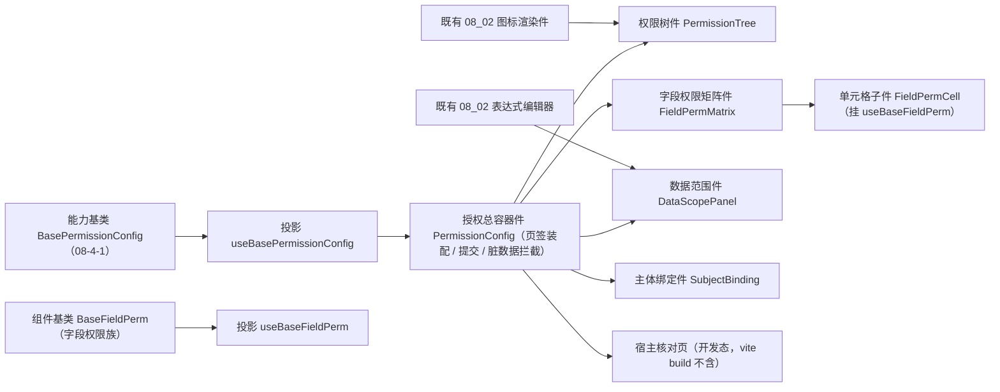

# 02 详细设计 · 授权组件与宿主核对页

> 前端组件库 · 08 交互类 · 04 权限配置 · 嵌套子任务 02（需求 08-4）· 详细设计

[文档首页](../../../../../../../文档首页.md) › [08 交互类](../../../08_交互类.md) › [04 权限配置](../../08_交互类_04_权限配置.md) › 详细设计　|　[← 任务](../08_交互类_04_权限配置_02_授权组件与宿主核对页.md)

## 1. 设计目标与范围 <a id="goal"></a>

在 `08-4-1` 的授权编排能力基类与契约套件之上交付**组件层**：投影、五件组件与开发态核对页；`08_01_01` 冻结的 `PermissionConfig` 对外形状（Props / 事件 / 插槽）保持不变，只换数据通路。

- **投影薄适配**：新增 `useBasePermissionConfig`（授权编排投影）与 `useBaseFieldPerm`（字段权限三态投影）；判定逻辑全部在核心，投影不触 DOM。
- **五件组件**（对齐《组件设计 07》「职责与组成」）：授权总容器件（`PermissionConfig`）、权限树件（`PermissionTree`）、字段权限矩阵件（`FieldPermMatrix` + 单元格子件 `FieldPermCell`）、数据范围件（`DataScopePanel`）、主体绑定件（`SubjectBinding`）。
- **复用既有件**：数据范围规则表达式编辑复用 `08_02` 的表达式编辑器；菜单 / 动作图标复用 `08_02` 的图标渲染件；空态复用 `03_02` 口径。
- **宿主核对页**：`apps/desktop/permission-config-check.html`（开发态入口，`vite build` 不含）+ `src/dev/` 两文件，承载四类页签、隐含推导、三态、幂等提交与错误码定位的上屏自检。
- **不在本期**：RBAC 真实接口联调（阶段七）、字段权限与布局叠加的运行时渲染（`08_06`）、宿主「角色管理 → 授权页签」真实页面（宿主布局任务）、远程主体搜索经选项源能力（遗留）。

### 1.1 口径与依从 <a id="positioning"></a>

- **架构铁律**：件只做渲染与交互投影，编排与判定全部在能力基类 `BasePermissionConfig`（`08-4-1`）；件经 `src/composables/` 的基类投影挂继承链（护栏 `guard-component-inheritance`）。
- **对外契约保持**：`PermissionConfig` 的既有 Props / 事件 / 插槽**只做向后兼容扩展**；既有 Props 语义升级为**受控覆盖**（提供则写入内部态、缺省用内部态），保证 `08_01_01` 的占位用例继续通过。
- **占位语义**：`ready === false` → 降级提示 + 操作禁用 + 零请求（沿用 `08_01_01` 口径）；处理函数未注入同样是占位（不请求）。
- **端范围**：**仅 PC**（`frontend/packages/ui-ep`）；移动端复用契约套件，实现遗留。
- **工时**：本嵌套子任务 8h。

## 2. 交付物清单 <a id="deliver"></a>

| # | 交付物 | 落点 |
| --- | --- | --- |
| 1 | 授权编排投影 | `ui-ep/src/composables/useBasePermissionConfig.ts` |
| 2 | 字段权限三态投影 | `ui-ep/src/composables/useBaseFieldPerm.ts` |
| 3 | 授权总容器件（改造既有占位件） | `ui-ep/src/components/interaction/PermissionConfig.vue` |
| 4 | 权限树件 | `ui-ep/src/components/interaction/PermissionTree.vue` |
| 5 | 字段权限矩阵件 | `ui-ep/src/components/interaction/FieldPermMatrix.vue` |
| 6 | 矩阵单元格子件（挂字段权限族基类） | `ui-ep/src/components/interaction/FieldPermCell.vue` |
| 7 | 数据范围件（复用表达式编辑器） | `ui-ep/src/components/interaction/DataScopePanel.vue` |
| 8 | 主体绑定件 | `ui-ep/src/components/interaction/SubjectBinding.vue` |
| 9 | 导出面登记 | `ui-ep/src/index.ts` |
| 10 | 用例（契约套件驱动 + 五件） | `ui-ep/tests/interaction-permission.spec.ts` |
| 11 | 开发态核对页（`vite build` 不含） | `apps/desktop/permission-config-check.html`、`apps/desktop/src/dev/{permissionConfigCheck.ts,PermissionConfigCheck.vue}` |
| 12 | 登记回写：基类清单 §9 / 组件设计 07 / 计划 / 任务状态 | 见第 6 节 |



## 3. 接口 / 契约与边界 <a id="contract"></a>

### 3.1 投影（`ui-ep/src/composables/`） <a id="bindings"></a>

```ts
// useBasePermissionConfig：授权编排投影（薄适配；判定逻辑全部在核心）
export interface UseBasePermissionConfigOptions {
  ready?: boolean
  roleId?: string | number
  tab?: PermissionTab
  snapshot?: PermissionSnapshot
  grantPerm?: string
  subjectLimit?: number
  jobs?: PermissionJobs
  access?: BaseAccess
  notice?: BaseNotice
}
export interface UseBasePermissionConfigResult {
  config: BasePermissionConfig
  ready: Ref<boolean>
  degraded: Ref<boolean>
  disabled: Ref<boolean>
  tab: Ref<PermissionTab>
  nodes: Ref<PermissionNode[]>
  fieldPerms: Ref<FieldPermRow[]>
  dataScopes: Ref<DataScopeRow[]>
  subjects: Ref<PermissionSubject[]>
  granted: Ref<PermissionGranted>
  dirty: Ref<boolean>
  phase: Ref<PermissionPhase>
  busy: Ref<boolean>
  errorMessage: Ref<string>
  errorTarget: Ref<PermissionErrorTarget | undefined>
  pendingAccessRefresh: Ref<boolean>
  refreshError: Ref<string>
  requestCount: Ref<number>
  canSave: Ref<boolean>
  canGrant: Ref<boolean>
  loadReady: Ref<boolean>
  submitReady: Ref<boolean>
  refreshReady: Ref<boolean>
  setReady(value: boolean): void
  setTab(tab: PermissionTab): void
  setRole(roleId: string | number | undefined): void
  applySnapshot(snapshot: PermissionSnapshot): void
  toggleNode(key: string, checked?: boolean): boolean
  checkState(key: string): PermissionCheckState | undefined
  setFieldPerm(formKey: string, fieldKey: string, patch: { visible?: boolean; editable?: boolean }): boolean
  setDataScope(actionKey: string, expression: string): boolean
  bindSubject(subject: PermissionSubject): boolean
  unbindSubject(id: string, type?: PermissionSubjectType): boolean
  load(): Promise<PermissionSnapshot | undefined>
  save(): Promise<PermissionSubmitResult | undefined>
  refreshAccess(): Promise<boolean>
  retry(): Promise<PermissionSubmitResult | undefined>
  reset(): void
  discard(): void
}

// useBaseFieldPerm：字段权限三态投影（组件基类 BaseFieldPerm ↔ 响应式）
export interface UseBaseFieldPermOptions {
  visible?: boolean
  editable?: boolean
  required?: boolean
  mask?: boolean
}
export interface UseBaseFieldPermResult {
  perm: BaseFieldPerm
  permVisible: Ref<boolean>
  editable: Ref<boolean>
  permRequired: Ref<boolean>
  masked: Ref<boolean>
  rendered: Ref<boolean>
  effectiveDisabled: Ref<boolean>
  applyPerm(permission: FieldPermission): void
}
```

- 跨实例基类对象经 `markRaw(toRaw(x))` 隔离，避免私有字段经响应式代理读取报错（沿用既有口径）。
- `window` / 剪贴板等浏览器 API 一律留在件层；投影不触 DOM。

### 3.2 `PermissionConfig` 授权总容器件契约 <a id="root"></a>

| 面 | 内容 |
| --- | --- |
| 数据面（沿用，语义升级为**受控覆盖**） | `ready`（缺省 `false`）/ `roleId` / `tab` / `treeNodes` / `fieldPerms` / `dataScopes` / `subjects` / `loading` / `dirty` / `degradeText` —— 提供则写入内部态，缺省用内部态（`dirty` 与 `loading` 为**受控覆盖**，缺省按内部派生值） |
| 数据面（新增，向后兼容扩展 v1.1） | `jobs`（取数 / 提交 / 权限码取数处理函数集）/ `grantPerm` / `subjectLimit` / `autoLoad`（就绪后自动取数，缺省 `true`）/ `subjectCandidates`（主体候选）/ `scopeVariables` / `scopeFields` / `scopeTemplates`（数据范围编辑上下文） |
| 事件（沿用，载荷不变） | `update:tab` / `change`（`{ kind, value }`，`kind` 扩展 `tree` / `field` / `scope` / `subject`）/ `save` / `reset`（撤销未保存变更）/ `retry` |
| 事件（新增，向后兼容扩展 v1.1） | `saved`（提交结果）/ `failed`（`{ message, target }`） |
| 插槽（沿用） | `degrade` / `empty` / `live` |
| 对外能力 | `load()` / `save()` / `discard()` / `refreshAccess()` / `retry()` / `setRole()`（`defineExpose`） |
| 行为 | 页签装配（权限树 / 字段权限 / 数据范围 / 主体绑定）；`ready` 且 `autoLoad` 为真时挂载后自动取数；保存为**整份授权全量覆盖提交**（携带内容派生幂等键），保存中禁用重复提交；保存成功提示「已生效」并按刷新结果提示待刷新；失败按错误码定位页签；脏数据提示与切换角色 / 页签前拦截（`change` 上抛由调用方决定拦截口径）；未就绪渲染降级提示、操作禁用且零请求 |

- **受控覆盖口径**：`treeNodes` / `fieldPerms` / `dataScopes` / `subjects` 变化时经 `applySnapshot` 写入并**重记基线**（供占位形态与外部受控用法）；`dirty` 提供时按传入值展示（不改内部判定）。
- **载荷变更上抛**：勾选 / 字段 / 数据范围 / 主体四类本地变更各上抛一次 `change`，件层不落库。

### 3.3 `PermissionTree` 权限树件契约 <a id="tree"></a>

| 面 | 内容 |
| --- | --- |
| 数据面 | `nodes`（权限树，必填）/ `granted`（勾选集合，供只读标识）/ `disabled` / `keyword`（`v-model:keyword`）/ `expandedKeys` / `selectedKey` / `loading` |
| 事件 | `check`（`{ key, checked }`）/ `select`（`key`）/ `update:keyword` |
| 插槽 | `node`（节点内容替换）/ `empty` |
| 行为 | 递归渲染菜单 → 表单 → 业务 → 动作；三态复选框（已选 / 半选 / 未选）；**业务节点只读**（渲染推导标识、无勾选入口）；挂接缺失节点标记「未挂接」并禁用；动作节点默认未勾选；按名称搜索过滤（经树族机制过滤后的节点）；展开 / 收起全部；节点图标经图标渲染件（未注册不渲染） |

### 3.4 `FieldPermMatrix` 字段权限矩阵件契约 <a id="matrix"></a>

| 面 | 内容 |
| --- | --- |
| 数据面 | `rows`（表单 × 字段，必填）/ `disabled` / `keyword` / `onlyNarrowed`（仅显示已收窄）/ `pageSize`（分页，缺省 20）/ `page` |
| 事件 | `change`（`{ formKey, fieldKey, key, value }`）/ `batch`（`{ key, value, formKey? }`）/ `update:page` |
| 插槽 | `empty` |
| 行为 | 表单分组 + 字段行；每行由**单元格子件**承载可见 / 可编辑两项（字段权限族三态语义唯一实现）；批量全选可见 / 全选不可见 / 可编辑批量；按字段名搜索；仅显示已收窄过滤；超 20 行分页（避免一次性渲染大树） |

### 3.5 `FieldPermCell` 单元格子件契约 <a id="cell"></a>

| 面 | 内容 |
| --- | --- |
| 数据面 | `formKey` / `field`（`{ key, label, visible, editable }`，必填）/ `disabled` |
| 事件 | `change`（`{ key: 'visible' \| 'editable', value }`） |
| 行为 | 经字段权限族基类投影（`permVisible` / `editable` / `permRequired` / `rendered` / `effectiveDisabled`）承载三态；不可见时不渲染可编辑项（不可见即可编辑无意义）；字段禁用时置灰 |

### 3.6 `DataScopePanel` 数据范围件契约 <a id="scope"></a>

| 面 | 内容 |
| --- | --- |
| 数据面 | `rows`（动作 → 规则表达式，必填）/ `disabled` / `variables`（预置变量令牌）/ `fields`（已注册字段令牌）/ `templates`（常用范围模板）/ `activeKey`（当前编辑动作） |
| 事件 | `change`（`{ actionKey, expression }`）/ `update:activeKey` / `apply-template`（模板键） |
| 插槽 | `empty` |
| 行为 | 左侧动作清单（当前数据范围摘要）+ 右侧规则表达式编辑区；编辑区复用 `08_02` 表达式编辑器（预置变量 / 字段插入、运算符提示、模板一键套用、校验）；默认**无数据权限**（空表达式展示「无数据权限」）；表达式空串表示清除数据范围；模板套用写入表达式并上抛 `change` |

### 3.7 `SubjectBinding` 主体绑定件契约 <a id="subject"></a>

| 面 | 内容 |
| --- | --- |
| 数据面 | `subjects`（已绑主体，必填）/ `candidates`（候选主体）/ `disabled` / `limit`（单主体可绑定角色数上限）/ `types`（主体类型页签，缺省用户 / 岗位 / 部门） |
| 事件 | `bind`（主体）/ `unbind`（`{ id, type }`） |
| 插槽 | `empty` |
| 行为 | 主体类型页签 + 远程搜索式多选（本期按候选集本地过滤，远程搜索经选项源能力为遗留）；勾选即绑定、移除即解绑；超上限时件层拒绝并提示（复用核心上限判定）；已绑主体按类型分组展示 |

### 3.8 宿主核对页与自检 <a id="host"></a>

- **开发态核对页**：`apps/desktop/permission-config-check.html`（仅开发态入口，`vite build` 只构建 `index.html`，故不入产物）+ `src/dev/permissionConfigCheck.ts` + `src/dev/PermissionConfigCheck.vue`。
- **页面内容**：`PermissionConfig`（角色 `r1` 样例数据 + 注入式处理函数：取数返回样例四类授权、提交按内容派生幂等键回显版本、权限码取数返回刷新后的码集合）+ 故意失败按钮（演示错误码 30047 定位到数据范围页签与重试）+ 五件组件单独挂载示例（权限树 / 矩阵 / 数据范围 / 主体绑定）。
- **自检上屏**（`data-check` 断言项，12 项）：占位零请求 / 四类页签渲染 / 隐含推导只读标识 / 三态半选 / 动作默认全无 / 取消连带 / 挂接缺失标记 / 字段默认全开与收窄 / 数据范围默认无与模板套用 / 主体绑定与上限提示 / 提交幂等（两次提交同键）/ 上下文刷新与错误码定位。

## 4. 失败分支与边界 <a id="edge"></a>

| 边界 / 失败场景 | 处置 |
| --- | --- |
| 未就绪（`ready` 为假） | 降级提示 + 操作禁用 + 零请求；不渲染页签骨架 |
| 处理函数未注入 | 占位：不请求；保存入口禁用并提示 |
| 无权（缺 `role:grant`） | 保存入口禁用；勾选与编辑不动作（件层按 `canGrant` 禁用） |
| 挂接缺失节点 | 标记「未挂接」并禁用；勾选不动作 |
| 业务权限节点 | 只读：渲染推导标识，无勾选入口 |
| 字段矩阵为空 | 渲染空态插槽 / 缺省空态 |
| 数据范围表达式为空 | 展示「无数据权限」，不入提交载荷 |
| 表达式非法 | 提交后由后端拒绝（30047）；件层按错误码定位到数据范围页签并提示 |
| 主体重复 / 超上限 | 件层拒绝并提示；重复不写入 |
| 主体候选为空 | 渲染空态，不阻断已绑主体展示 |
| 大树 / 大矩阵 | 树按搜索过滤与展开收起；矩阵分页（缺省 20 行 / 页）避免一次性渲染 |
| 提交进行中重复点击 | 保留按钮禁用；核心侧返回 `undefined`（防重复提交） |
| 提交失败 | 件层展示错误与定位页签、保留本地变更；「重试」重放同内容（同幂等键） |
| 取码未注入 / 刷新失败 | 件层提示「权限上下文待刷新」，不否定保存成功；提供再次刷新入口 |
| 脏数据 | 件层展示未保存提示；切换角色 / 页签时按调用方口径拦截（本任务只上抛） |

## 5. 测试设计与验收映射 <a id="test"></a>

| 验收点（需求 08-4 / 子任务 08-4-2） | 用例 |
| --- | --- |
| 契约套件（授权编排 17 组断言）通过 | `ui-ep/tests/interaction-permission.spec.ts` 驱动 `describePermissionConfigContract` |
| 占位语义（未就绪降级 / 禁用 / 零请求） | 同上 + 容器件用例（`08_01_01` 占位用例继续通过） |
| 四类页签装配与切换 | 容器件用例（`update:tab`） |
| 隐含推导只读标识与三态半选 | 权限树件用例（`derived` 标识 / 半选态） |
| 动作默认全无、取消连带 | 权限树件用例 + 容器件用例 |
| 挂接缺失标记与禁用 | 权限树件用例 |
| 字段矩阵默认全开 / 收窄 / 批量 / 单元格三态 | 矩阵件与单元格子件用例（`useBaseFieldPerm`） |
| 数据范围默认无 / 模板套用 / 表达式上抛 | 数据范围件用例（复用表达式编辑器） |
| 主体绑定 / 解绑 / 上限提示 | 主体绑定件用例 |
| 提交幂等、上下文刷新、失败定位与重试 | 容器件用例（注入式处理函数） |
| 开发态核对页 12 项自检全绿 | chromium headless `--dump-dom` 断言 + 实施记录对照表 |
| `vue-tsc`、ESLint、Vitest 全通过 | 根 `pnpm run check` + 宿主 `vue-tsc -b` / `lint` / `test:cov` / `build` / `budget` |

- Kiwi 用例 1 条（一任务一条，编号于测试步登记后回填，预计 768；分类「平台骨架」、优先级 P2、状态 CONFIRMED、标签「自动化」）。

## 6. 登记落点 <a id="register"></a>

| 内容 | 落点 |
| --- | --- |
| 投影落点 | 《[前端基类清单](../../../../../../../前端基类清单.md)》§9「PC 插件」补 `useBasePermissionConfig` / `useBaseFieldPerm` |
| 组件落点 | 同上 §9「PC 插件」（`components/interaction/` 五件） |
| 设计口径回写 | 《组件设计》[07 权限配置](../../../../../../../设计/组件设计/08_交互类/07_组件设计_权限配置/07_组件设计_权限配置.md)：继承链行改现行口径（组件根 → 能力基类 → 具体件；树族机制为组合的组件基类） |
| 上游登记（沿用 `08-4-1` 归口，3 项） | ① 授权交互与批量接口口径 → 《概要设计 · 角色管理》；② 权限树挂接与按钮 / 字段来源 → 《概要设计 · 菜单管理》；③ 数据范围规则编辑与校验 → 《架构设计 · 权限计算引擎》「数据范围」节 |
| 任务 / 父任务 / 域任务 / 计划状态 | [任务](../08_交互类_04_权限配置_02_授权组件与宿主核对页.md)、[父任务](../../08_交互类_04_权限配置.md)、[域任务](../../../08_交互类.md)、[计划](../../../../../../../项目/04_前端组件库/计划/01_计划_前端组件库.md)（嵌套子任务并入父任务行；`08_04` 完成后由 §3 移入 §2） |
| 需求文档 | 不承载进度；遗留归口写在实施 / 测试记录与计划 |

## 7. 边界与开放项 <a id="open"></a>

- **不在本期**：RBAC 真实接口联调（阶段七）；字段权限与布局叠加的运行时渲染（`08_06` 表单渲染器）；宿主「角色管理 → 授权页签」真实页面与路由菜单（宿主布局任务）；远程主体搜索与预置变量下发经选项源 / 权限引擎接口（遗留）；移动端实现（契约套件已就位供复用）；深色主题下矩阵与树的视觉细化（随主题任务）。
- **协同契约**：容器件的数据通路经 `jobs` 注入（未注入即占位）；权限上下文经 `access` 注入（未注入不校验、不刷新）；数据范围编辑上下文（预置变量 / 已注册字段 / 模板）由调用方传入（后端下发为遗留）。
- **遗留登记**：`PermissionConfig` 对外契约的**向后兼容扩展**（新增 `jobs` / `grantPerm` / `subjectLimit` / `autoLoad` / `subjectCandidates` / `scope*` Props 与 `saved` / `failed` 事件）记为 v1.1，既有 Props / 事件 / 插槽与载荷不变；主体候选本期为本地过滤（远程搜索遗留）。
- Kiwi 用例编号于测试步登记后回填实施 / 测试记录与用例文件（预计 768）。

## 8. 决策记录 <a id="decision"></a>

| # | 决策项 | 结论 |
| --- | --- | --- |
| 1 | 组件拆分 | 五件（容器 / 权限树 / 矩阵 + 单元格子件 / 数据范围 / 主体绑定），对外 `PermissionConfig` 形状不变 |
| 2 | 组件落点 | `ui-ep/src/components/interaction/`（交互类族内平铺，沿用既有口径） |
| 3 | 受控覆盖 | 既有 Props（`tab` / `treeNodes` / `fieldPerms` / `dataScopes` / `subjects` / `loading` / `dirty`）改为受控覆盖，保证占位用例继续通过 |
| 4 | 契约扩展 | 仅**向后兼容扩展**（新增可选 Props 与两个事件 `saved` / `failed`，标注 v1.1），不在本期删除或改载荷 |
| 5 | 字段权限落点 | 矩阵单元格子件挂 `useBaseFieldPerm`（字段权限族三态语义唯一实现） |
| 6 | 数据范围编辑 | 复用 `08_02` 表达式编辑器；单编辑区（按动作切换），避免每行一个重编辑器 |
| 7 | 主体候选 | 本期调用方传入候选集 + 本地过滤；远程搜索经选项源能力为遗留 |
| 8 | 大树 / 大矩阵 | 树按搜索与展开收起；矩阵分页（缺省 20 行 / 页） |
| 9 | 核对页 | 开发态入口（`vite build` 不含）+ 12 项上屏自检 |
| 10 | 用例与 Kiwi | 单文件 `interaction-permission.spec.ts` + 一条用例（预计 768） |

## 9. 参考文档 <a id="ref"></a>

- [需求 08-4](../../../../../需求/08_需求_交互类.md#r08-4)、[任务 08-4-2](../08_交互类_04_权限配置_02_授权组件与宿主核对页.md)、[父任务 04 权限配置](../../08_交互类_04_权限配置.md)
- [08-4-1 详细设计 · 授权编排基类与领域](../../08_交互类_04_权限配置_01_授权编排基类与领域/设计/01_详细设计_01_授权编排基类与领域.md)（**前置契约已交付**：能力基类 / 领域纯函数 / 契约套件）
- 《组件设计》[07 权限配置](../../../../../../../设计/组件设计/08_交互类/07_组件设计_权限配置/07_组件设计_权限配置.md)（含[可交互原型](../../../../../../../设计/组件设计/08_交互类/07_组件设计_权限配置/07_原型设计_权限配置.html)，原型即验收基准）
- [08_02 图标选择器与代码表达式编辑器](../../../08_交互类_02_图标选择器与代码表达式编辑器/08_交互类_02_图标选择器与代码表达式编辑器.md)（表达式编辑器 / 图标渲染件复用）
- [《前端基类清单》](../../../../../../../前端基类清单.md)、《[前端开发规范](../../../../../../../规范/前端开发规范.md)》、《[文档生成规范](../../../../../../../规范/文档生成规范.md)》

> 本文档依《[文档生成规范](../../../../../../../规范/文档生成规范.md)》编写
