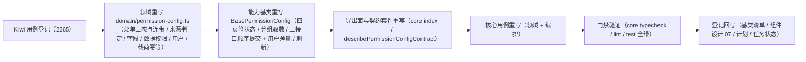

# 03 实施 · 授权编排基类与领域（新口径）

> 前端组件库 · 08 交互类 · 04 权限配置 · 嵌套子任务 03（需求 08-4）· 实施记录

[文档首页](../../../../../../../文档首页.md) › [08 交互类](../../../08_交互类.md) › [04 权限配置](../../08_交互类_04_权限配置.md) › 实施记录　|　[← 详细设计](../设计/01_详细设计_03_授权编排基类与领域.md)

## 1. 实施信息 

| 项 | 值 |
| --- | --- |
| 任务 | 08-4-3 授权编排基类与领域（新口径）（[任务](../08_交互类_04_权限配置_03_授权编排基类与领域.md)） |
| 对应需求 | [08-4](../../../../../需求/08_需求_交互类.md#r08-4) |
| 详细设计 | [01_详细设计_03_授权编排基类与领域.md](../设计/01_详细设计_03_授权编排基类与领域.md) |
| 实施日期 | 2026-10-08 |
| 实施人 | minjian |
| 实施环境 | Ubuntu 开发机 · Node（workspace `@bms/core`）· Vitest 5 · TypeScript 严格模式 |
| Kiwi 用例 | 2265（分类「平台骨架」/ P2 / CONFIRMED / 标签「自动化」） |
| 结论 | 完成标准达标（新口径领域推导 / 三类载荷幂等 / 顺序提交与刷新可验证） |

## 2. 实施概览 

结果小结：领域纯函数与能力基类按新口径重写，契约套件断言面重建；`@bms/core` 104 文件 / 1273 用例全绿（本次改 2 文件用例）。

## 3. 实施过程 

1. **Kiwi 先行**：经容器内 Django shell 登记用例，取得编号 **2265**；用例文件首行标注 `// kiwi_id: 2265`。
2. **领域重写**（`core/src/domain/permission-config.ts`）：菜单树（仅菜单入口）扁平化与子树、三态、`toggleMenu`（级联子树 + 连带表单，取消仅撤本来源并联动清理字段条目）、`toggleAction`（按来源）、字段（`fieldPermOf` / `setFieldPerm` / `collectFieldEntries` / `isValidMatchPattern` / `findFieldMismatch`）、数据权限（`setDataScopeEntry` / `removeDataScopeEntry` / `collectDataScopeEntries`）、用户分配（`bindUsers` / `unbindUser` / `diffUserIds`）、三类载荷（`collectPermissionPayload` / `collectFieldPayload` / `collectDataScopePayload`）、`payloadKey` / `deriveIdempotencyKey` / 错误码定位。
3. **能力基类重写**（`core/src/capabilities/permission-config.ts`）：四页签状态、分组取数（`loadMetadata` + `loadGrants` 并行）、三接口顺序提交（`submitPermissions` → `submitFields` → `submitDataScopes`）+ 用户差量（`saveUsers`）、内容派生幂等键、脏基线与撤销、权限上下文刷新（`loadPermissionCodes`）。
4. **导出面**（`core/src/index.ts`）：领域与能力导出面按新类型重建；`MenuNode` 改名 `PermissionMenuNode` 避免与动态菜单 `MenuNode` 冲突；新增 `FieldPermPatch`。
5. **契约套件重写**（`core/testing/index.ts`）：`describePermissionConfigContract` 断言面改新口径，含来源判定、连带撤销、字段与数据权限、用户、三类幂等键、三接口顺序与失败定位。
6. **用例重写**：`core/tests/domain-permission-config.spec.ts` 与 `core/tests/permission-config.spec.ts` 按新口径重建。
7. **登记回写**：基类清单 §2.1 / §5.2 描述改新口径。

## 4. 问题与处置 

| # | 问题 | 处置 |
| --- | --- | --- |
| 1 | 新领域类型 `MenuNode` 与既有动态菜单 `domain/menu.ts` 的 `MenuNode` 在核心导出面重名 | 改名 `PermissionMenuNode`（索引导出块单点替换，动态菜单类型不变） |
| 2 | 能力基类 `setFieldPerm` 多行签名触发核心 JSDoc 护栏（参数行被判为缺注释成员） | 提取 `FieldPermPatch` 类型并单行签名 |
| 3 | 契约快照可省略数组，能力基类 `applySnapshot` 直接 `.map` 抛错（契约用例暴露） | `applySnapshot` 对四类数组按 `?? []` 兜底 |
| 4 | `applySnapshot` 的 `config` 只读类型与导出面不一致 | 契约快照 `config` 声明为 `readonly unknown[]` |

## 5. 验证结果 

| 命令 | 结果 |
| --- | --- |
| `pnpm run core:typecheck` | 通过 |
| `pnpm run core:lint` | 通过 |
| `pnpm run core:test` | 通过（104 文件 / 1273 用例） |
| `python3 scripts/tools/base-check/check-links.py`、`check-base.py` | 通过 |

对照完成标准：新口径领域推导、三类载荷与幂等键、顺序提交与刷新、占位语义均达标。

## 6. 偏差与遗留 

- **对外契约破版**：`08_01_01` 冻结的 `PermissionConfig` 对外形状随新口径破版升级（本任务负责核心侧类型与断言面），已回写 `08_01_01` 详细设计「口径对齐」节。
- **数据权限字典类型清单**：后端缺字典类型列表端点（当前仅 `GET /dicts/{dict_type}`），`dictTypes` 暂空（归口后端补端点）。
- **扩展权限注册清单**：本期 Null 空注册（未注册即隐藏扩展子页签），归口后端注册表落地。
- Kiwi 用例编号 2265 已登记于平台。

> 本文档依《[文档生成规范](../../../../../../../规范/文档生成规范.md)》编写
