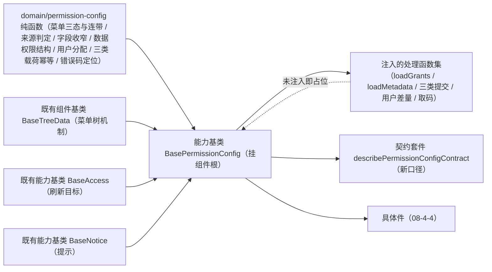

# 03 详细设计 · 授权编排基类与领域（新口径）

> 前端组件库 · 08 交互类 · 04 权限配置 · 嵌套子任务 03（需求 08-4）· 详细设计

[文档首页](../../../../../../../文档首页.md) › [08 交互类](../../../08_交互类.md) › [04 权限配置](../../08_交互类_04_权限配置.md) › 详细设计　|　[← 任务](../08_交互类_04_权限配置_03_授权编排基类与领域.md)

## 1. 设计目标与范围 <a id="goal"></a>

按《[组件设计 · 权限配置](../../../../../../../设计/组件设计/08_交互类/07_组件设计_权限配置/07_组件设计_权限配置.md)》**新口径**返工需求 08-4 的**授权编排内核**：菜单权限 / 表单权限 / 数据权限 / 角色分配四类授权状态、菜单连带表单查看与**来源判定**、操作 / 字段权限、数据权限字典结构化（只选不编）、用户分配（仅用户）、三类载荷全量覆盖提交与幂等、脏基线与撤销、保存后权限上下文刷新。

- **领域入核心**：重写 `domain/permission-config.ts`——菜单树三态与级联、连带表单生成与按来源撤销、表单 / 操作 / 字段授权与来源判定、字段默认全开与收窄、数据权限结构和匹配校验、用户分配去重、三类载荷与稳定序列化、按类别派生幂等键、错误码 → 页签定位，全为框架无关纯函数。
- **编排入链**：`BasePermissionConfig`（能力基类，挂组件根；组合 `BaseTreeData` 承载菜单树机制）按新口径重写状态与提交编排。
- **数据通路注入式**：取数分两组（授权 / 元数据）、提交分三类 + 用户差量，未注入即占位（不发请求、写占位文案、返回 `undefined`）。
- **契约套件**：重写 `describePermissionConfigContract`，供 PC（`08-4-4`）与后续移动端复用。
- **破版升级**：`08_01_01` 冻结的 `PermissionConfig` 对外形状随新口径**破版升级**（详见 [08_01_01 详细设计「口径对齐」节](../../../08_交互类_01_占位版交付/08_交互类_01_占位版交付_01_配置与工作流占位/设计/01_详细设计_01_配置与工作流占位.md)），本任务负责核心侧类型与断言面。

### 1.1 口径与依从 <a id="positioning"></a>

- **架构铁律**：授权编排为横切功能，落为继承链上的**能力基类**（核心 `capabilities/`）；具体件只做渲染与投影。
- **继承链**：`BaseComponent`（组件根）→ `BasePlaceholderState` → `BasePermissionConfig` → 具体件（`08-4-4`）；能力基类**组合**组件基类 `BaseTreeData`（菜单树机制），依赖单向登记于 `capabilities/manifest.ts`。
- **来源判定（核心语义）**：授权条目带 `source_menu_id`——`0` 表示**表单级直接授予**（或菜单本身）；非 `0` 表示由某菜单入口**连带**授予。件层据此判定可改 / 只读：**本上下文来源项可改，非本来源项只读**。核心提供判定与写入纯函数，展示语义由件层落实。
- **连带与撤销**：勾选菜单入口 `M` → 为其关联的每个表单落 `(form, F, source=M)`（前端呈现连带）；取消 `M` → **仅删 `source=M` 的连带行**，其它来源行保留。
- **字段默认全开**：未配置字段默认可见可编辑；仅提交**收窄项**（`visible=false` / `editable=false`）。
- **数据权限只选不编**：按字典类型 × 策略（`select` / `region` / `match` / `extension`）存结构化 `config`，无自由表达式；匹配值仅允许 `*` `?` 与中英文 / 数字 / 下划线（越界 30047）。
- **角色分配仅用户**：用户分配写 `sys_user_role`，**不设数量上限**（仅计数）；岗位 / 部门分配归 mdm 插件（不进本编排）。
- **提交编排**：三接口**顺序全量覆盖**（permissions → fields → data-permissions，各自内容派生幂等键），用户分配按差量提交；全部成功才算保存成功，失败按错误码定位页签并保留本地。
- **占位语义**：未就绪 / 未注入处理函数一律不发请求（`requestCount` 恒 0），保持 `08_01_01` 冻结口径。
- **端范围**：**仅 PC**；移动端复用同一套契约断言，实现遗留。

## 2. 交付物清单 <a id="deliver"></a>

| # | 交付物 | 落点 |
| --- | --- | --- |
| 1 | 权限配置领域纯函数与数据模型（新口径） | `core/src/domain/permission-config.ts`（重写） |
| 2 | 授权编排能力基类（新口径） | `core/src/capabilities/permission-config.ts`（重写） |
| 3 | 能力依赖登记（`permission-config` 键依赖调整） | `core/src/capabilities/manifest.ts` |
| 4 | 核心导出面登记 | `core/src/index.ts` |
| 5 | 契约套件（授权编排，新口径） | `core/testing/index.ts`（重写 `describePermissionConfigContract`） |
| 6 | 核心用例（领域 / 编排，新口径） | `core/tests/domain-permission-config.spec.ts`、`core/tests/permission-config.spec.ts` |
| 7 | 登记回写（基类清单 / 组件设计 07 / 08_01_01 契约 / 实施与测试记录） | 见第 6 节 |



## 3. 接口 / 契约与边界 <a id="contract"></a>

### 3.1 核心：`domain/permission-config.ts`（新口径） <a id="domain"></a>

```ts
/** 授权页签（新口径）。 */
export type PermissionTab = 'menu' | 'form' | 'data' | 'assign'
/** 授权条目类型（业务权限为推导只读，不落表）。 */
export type PermissionEntryType = 'menu' | 'form' | 'action'
/** 勾选三态。 */
export type PermissionCheckState = 'checked' | 'indeterminate' | 'unchecked'
/** 数据权限策略类型。 */
export type DataScopePolicyType = 'select' | 'region' | 'match' | 'extension'

/** 无来源菜单（表单级直接授予 / 菜单自身）。 */
export const PERMISSION_SOURCE_DIRECT = '0'
/** 授权写权限码。 */
export const PERMISSION_GRANT_CODE = 'role:grant'
/** 页签顺序。 */
export const PERMISSION_TABS: readonly PermissionTab[] = ['menu', 'form', 'data', 'assign']
/** 数据权限子页签顺序。 */
export const DATA_SCOPE_POLICIES: readonly DataScopePolicyType[] = ['select', 'region', 'match', 'extension']
/** 占位文案。 */
export const PERMISSION_PLACEHOLDER_TEXT: string
/** 匹配通配符允许字符（`*` `?` 与中英文 / 数字 / 下划线）。 */
export const MATCH_PATTERN_ALLOWED: RegExp
/** 错误码 → 页签 / 处置映射表。 */
export const PERMISSION_ERROR_TARGETS: Readonly<Record<number, PermissionErrorTarget>>

// ---- 元数据 ----
export interface MenuNode { id: string; name: string; icon?: string; children?: MenuNode[] }
export interface FormMeta { id: string; name: string; menuIds: string[] }
export interface ActionMeta { id: string; name: string }
export interface FieldMeta { id: string; name: string }
export interface DictTypeMeta { id: string; name: string }
export interface DataScopeExtensionMeta { key: string; name: string; hasParams: boolean }
export interface PermissionMetadata {
  menus: MenuNode[]
  forms: FormMeta[]
  actions: ActionMeta[]
  fields: FieldMeta[]
  formActions: Readonly<Record<string, readonly string[]>>   // 表单 → 动作 id 清单（经按钮挂接）
  formFields: Readonly<Record<string, readonly string[]>>    // 表单 → 字段 id 清单
  dictTypes: DictTypeMeta[]
  extensions: DataScopeExtensionMeta[]
}
export interface FlatMenuNode { node: MenuNode; depth: number }

// ---- 授权 ----
export interface PermissionEntry { permType: PermissionEntryType; targetId: string; sourceMenuId: string }
export interface FieldPermEntry { formId: string; fieldId: string; visible: boolean; editable: boolean; sourceMenuId: string }
export interface DataScopeSelectItem { itemCode: string }
export interface DataScopeRegionItem { start: string; end: string }
export interface DataScopeMatchItem { field: string; pattern: string }
export interface DataScopeExtensionItem { key: string; params?: Record<string, unknown> }
export type DataScopePolicyItem = DataScopeSelectItem | DataScopeRegionItem | DataScopeMatchItem | DataScopeExtensionItem
export interface DataScopeEntry { dictTypeId: string; policyType: DataScopePolicyType; config: readonly DataScopePolicyItem[] }
export interface AssignedUser { id: string; username: string; name: string; status: string }
/** 授权快照（角色 + 四类授权；不含元数据）。 */
export interface PermissionSnapshot {
  roleId?: string | number
  entries: PermissionEntry[]
  fieldEntries: FieldPermEntry[]
  dataScopeEntries: DataScopeEntry[]
  users: AssignedUser[]
}
/** 授权条目提交载荷。 */
export interface PermissionEntriesPayload { entries: PermissionEntry[] }
/** 字段权限提交载荷（仅收窄项）。 */
export interface FieldEntriesPayload { entries: FieldPermEntry[] }
/** 数据权限提交载荷（丢弃空 config）。 */
export interface DataScopeEntriesPayload { entries: DataScopeEntry[] }
/** 错误码定位（不定位页签时为整体错误）。 */
export interface PermissionErrorTarget { tab?: PermissionTab; key?: string; i18nKey: string }
```

**纯函数清单**：

```ts
flattenMenus(menus: readonly MenuNode[], depth?: number): FlatMenuNode[]
findMenu(menus: readonly MenuNode[], id: string): MenuNode | undefined
menuSubtreeIds(menus: readonly MenuNode[], id: string): string[]
menuFormIds(forms: readonly FormMeta[], menuId: string): string[]
isMenuDetached(forms: readonly FormMeta[], menuId: string): boolean
menuCheckState(menus: readonly MenuNode[], entries: readonly PermissionEntry[], id: string): PermissionCheckState
collectCheckedMenuIds(entries: readonly PermissionEntry[]): string[]
toggleMenu(entries: readonly PermissionEntry[], menus: readonly MenuNode[], forms: readonly FormMeta[], id: string, checked?: boolean): PermissionEntry[]
formSourceMenuIds(entries: readonly PermissionEntry[], formId: string): string[]
isFormGranted(entries: readonly PermissionEntry[], formId: string): boolean
actionSourceMenuIds(entries: readonly PermissionEntry[], actionId: string): string[]
isActionGranted(entries: readonly PermissionEntry[], actionId: string): boolean
toggleAction(entries: readonly PermissionEntry[], actionId: string, sourceMenuId: string, checked?: boolean): PermissionEntry[]
fieldPermOf(fieldEntries: readonly FieldPermEntry[], formId: string, fieldId: string): FieldPermEntry | undefined
setFieldPerm(fieldEntries: readonly FieldPermEntry[], formId: string, fieldId: string, patch: { visible?: boolean; editable?: boolean }, sourceMenuId: string): FieldPermEntry[]
collectFieldEntries(fieldEntries: readonly FieldPermEntry[]): FieldPermEntry[]
isValidMatchPattern(pattern: string): boolean
findFieldMismatch(fieldEntries: readonly FieldPermEntry[], registry: Readonly<Record<string, readonly string[]>>): { formId: string; fieldId: string } | undefined
setDataScopeEntry(entries: readonly DataScopeEntry[], dictTypeId: string, policyType: DataScopePolicyType, config: readonly DataScopePolicyItem[]): DataScopeEntry[]
removeDataScopeEntry(entries: readonly DataScopeEntry[], dictTypeId: string, policyType: DataScopePolicyType): DataScopeEntry[]
collectDataScopeEntries(entries: readonly DataScopeEntry[]): DataScopeEntry[]
bindUsers(list: readonly AssignedUser[], users: readonly AssignedUser[]): AssignedUser[]
unbindUser(list: readonly AssignedUser[], id: string): AssignedUser[]
collectPermissionPayload(entries: readonly PermissionEntry[]): PermissionEntry[]
collectFieldPayload(fieldEntries: readonly FieldPermEntry[]): FieldPermEntry[]
collectDataScopePayload(entries: readonly DataScopeEntry[]): DataScopeEntry[]
payloadKey(snapshot: PermissionSnapshot): string
deriveIdempotencyKey(roleId: string | number | undefined, kind: 'perm' | 'field' | 'scope', key: string): string
resolveErrorCode(error: unknown): number | undefined
resolveErrorTarget(code: number | undefined): PermissionErrorTarget | undefined
```

| 行为 | 口径 |
| --- | --- |
| 菜单树 | `flattenMenus` 深度优先（`depth` 自 0 起，供件层缩进）；`menuSubtreeIds` 取自身与全部后代 id（级联用） |
| 挂接缺失 | `isMenuDetached`：菜单关联表单为空即「未挂接」（错误码 30046），不可授予 |
| 三态 | `menuCheckState`：菜单自身已授权 → `checked`；否则任一后代菜单已授权 → `indeterminate`；否则 `unchecked` |
| 勾选级联 | `toggleMenu`：勾选 `M` → 授权 `M` 与其**全部后代菜单**，并为 `M` 与其后代关联的**每个表单**落 `(form, F, source=入口菜单)`（连带）；取消 `M` → 移除 `M` 与后代菜单、**仅删 `source ∈ 该子树入口` 的连带表单行**，其它来源表单行保留；菜单级联不影响操作 / 字段（默认全无 / 全开） |
| 表单来源 | `formSourceMenuIds` 返回该表单的全部来源（含 `0`）；`isFormGranted` = 来源非空 |
| 操作权限 | 默认无；`toggleAction` 按 `(actionId, sourceMenuId)` 显式加 / 删；`actionSourceMenuIds` 供来源判定 |
| 字段权限 | 默认全开：`fieldPermOf` 未命中返回 `undefined`（视为可见可编辑）；`setFieldPerm` 命中就改、未命中**新增**收窄项；`collectFieldEntries` 仅收集 `visible === false` 或 `editable === false`；`editable=false` 时强制 `visible=false`（不可见即不可编辑） |
| 字段校验 | `findFieldMismatch` 校验字段属该表单字段集合，命中拒绝（30049） |
| 匹配校验 | `isValidMatchPattern`：仅 `*` `?` 与中英文 / 数字 / 下划线，含其它字符返回 `false`（件层提示，越界 30047） |
| 数据权限 | `setDataScopeEntry` 按 `(dictTypeId, policyType)` 覆盖；`removeDataScopeEntry` 删空；`collectDataScopeEntries` 丢弃空 `config`（全空 = 无数据权限） |
| 用户分配 | `bindUsers` 按 `id` 去重（**不设上限**）；`unbindUser` 按 `id` 移除 |
| 载荷确定性 | 三类载荷各自**排序**（条目键 / `formId+fieldId` / `dictTypeId+policyType`），保证同内容同载荷 |
| 脏基线 | `payloadKey` = 三类载荷 + 用户集合的稳定序列化（`stableStringify`），与顺序无关、只反映授权语义 |
| 幂等键 | `deriveIdempotencyKey` = `perm:{roleId}:{kind}:{FNV-1a 32 位十六进制}`（对应载荷键派生）：同内容同键、内容变更换键 |
| 错误码定位 | `resolveErrorCode` 取数值 `code`；`resolveErrorTarget` 查映射表，未命中 `undefined` |
| 纯数据 | 不触 DOM、不请求、不依赖渲染框架；同输入同输出 |

**错误码映射表**（文案走 i18n `error.{code}`）：

| 错误码 | 含义 | 定位页签 |
| --- | --- | --- |
| 30043 | 内置角色保护 | 不定位（整体错误） |
| 30044 | 角色仍存在角色分配，删除被拒 | 角色分配 |
| 30046 | 菜单未挂接表单 / 授权目标不存在 / 来源校验失败 | 菜单权限 |
| 30047 | 数据权限值非法（匹配通配符越界 / 扩展未注册 / 字典不存在） | 数据权限 |
| 30048 | 三权分立冲突 | 角色分配 |
| 30049 | 字段不属该表单字段集合 | 表单权限 |

### 3.2 核心：能力基类 `BasePermissionConfig`（新口径） <a id="base"></a>

```ts
/** 元数据取数处理函数（未注入即占位）。 */
export type PermissionMetadataHandler = (input: { roleId: string | number | undefined }) => Promise<PermissionMetadata>
/** 授权取数处理函数（未注入即占位）。 */
export type PermissionGrantsHandler = (input: { roleId: string | number | undefined }) => Promise<PermissionSnapshot>
/** 提交结果。 */
export interface PermissionSubmitResult { version?: number; message?: string }
/** 授权条目提交处理函数。 */
export type PermissionSubmitHandler = (input: { roleId: string | number | undefined; payload: PermissionEntriesPayload; idempotencyKey: string }) => Promise<PermissionSubmitResult>
/** 字段权限提交处理函数。 */
export type FieldSubmitHandler = (input: { roleId: string | number | undefined; payload: FieldEntriesPayload; idempotencyKey: string }) => Promise<PermissionSubmitResult>
/** 数据权限提交处理函数。 */
export type DataScopeSubmitHandler = (input: { roleId: string | number | undefined; payload: DataScopeEntriesPayload; idempotencyKey: string }) => Promise<PermissionSubmitResult>
/** 用户分配差量提交处理函数。 */
export type UsersSaveHandler = (input: { roleId: string | number | undefined; added: readonly string[]; removed: readonly string[] }) => Promise<PermissionSubmitResult>
/** 权限码取数处理函数（保存成功后刷新上下文；未注入不发请求）。 */
export type PermissionCodesHandler = () => Promise<readonly string[]>
/** 注入的处理函数集。 */
export interface PermissionJobs {
  loadMetadata?: PermissionMetadataHandler
  loadGrants?: PermissionGrantsHandler
  submitPermissions?: PermissionSubmitHandler
  submitFields?: FieldSubmitHandler
  submitDataScopes?: DataScopeSubmitHandler
  saveUsers?: UsersSaveHandler
  loadPermissionCodes?: PermissionCodesHandler
}
/** 授权编排阶段。 */
export type PermissionPhase = 'idle' | 'loading' | 'saving' | 'refreshing' | 'done' | 'failed'

export abstract class BasePermissionConfig extends BasePlaceholderState {
  readonly identifier: string = 'permission-config'
  override readonly depends = ['placeholder-state', 'tree-data', 'access', 'notice']

  roleId: string | number | undefined
  // 元数据
  metadata: PermissionMetadata
  // 四类授权
  entries: PermissionEntry[]
  fieldEntries: FieldPermEntry[]
  dataScopeEntries: DataScopeEntry[]
  users: AssignedUser[]
  // 视图选择
  tab: PermissionTab                    // 缺省 'menu'
  selectedMenuId: string                // 菜单页签选中入口
  menuSubTab: 'action' | 'field'        // 菜单页签右侧子页签
  selectedFormId: string                // 表单页签选中表单
  formSubTab: 'action' | 'field'
  selectedDictTypeId: string            // 数据页签选中字典
  dataScopePolicy: DataScopePolicyType  // 数据页签右侧子页签
  // 占位与阶段
  ready: boolean
  phase: PermissionPhase
  errorMessage: string
  errorTarget: PermissionErrorTarget | undefined
  pendingAccessRefresh: boolean
  refreshError: string
  grantPerm: string
  jobs: PermissionJobs
  tree: BaseTreeData
  access: BaseAccess | undefined
  notice: BaseNotice | undefined
  disabled: boolean

  get degraded(): boolean
  get busy(): boolean
  get dirty(): boolean
  get canGrant(): boolean
  get canSave(): boolean
  get loadReady(): boolean               // loadGrants 与 loadMetadata 均已注入
  get submitReady(): boolean             // 三类提交均已注入
  get refreshReady(): boolean

  setReady(value: boolean): void
  setTab(tab: PermissionTab): void
  setRole(roleId: string | number | undefined): void
  setJobs(jobs: PermissionJobs): void
  selectMenu(id: string): void
  setMenuSubTab(tab: 'action' | 'field'): void
  selectForm(id: string): void
  setFormSubTab(tab: 'action' | 'field'): void
  selectDictType(id: string): void
  setDataScopePolicy(policy: DataScopePolicyType): void
  load(): Promise<void>                     // 并行取授权 + 元数据，二者就绪才算装载完成
  applyMetadata(metadata: PermissionMetadata): void
  applySnapshot(snapshot: PermissionSnapshot): void
  toggleMenu(id: string, checked?: boolean): boolean
  toggleAction(actionId: string, sourceMenuId: string, checked?: boolean): boolean
  setFieldPerm(formId: string, fieldId: string, patch: { visible?: boolean; editable?: boolean }, sourceMenuId: string): boolean
  setDataScope(dictTypeId: string, policyType: DataScopePolicyType, config: readonly DataScopePolicyItem[]): boolean
  bindUsers(users: readonly AssignedUser[]): boolean
  unbindUser(id: string): boolean
  save(): Promise<PermissionSubmitResult | undefined>
  refreshAccess(): Promise<boolean>
  retry(): Promise<PermissionSubmitResult | undefined>
  reset(): void
  discard(): void
}
```

| 行为 | 口径 |
| --- | --- |
| 装载 | `load()` 仅在 `ready` 且 `loadGrants` / `loadMetadata` 均已注入时并行取数（各计一次请求）；两路都成功才记脏基线；任一失败置 `failed` 并写错误码定位，保留另一路结果 |
| 切换角色 | `setRole` 清空四类授权与基线、选择项复位、阶段回 `idle` |
| 菜单勾选 | `toggleMenu` 经领域级联更新 entries，并同步组合的树族机制；未就绪 / 无权 / 挂接缺失 / 不存在时不动作返回 `false` |
| 操作 / 字段 | `toggleAction` / `setFieldPerm` 按来源入 `sourceMenuId`；未就绪 / 无权 / 目标不存在不动作 |
| 数据权限 | `setDataScope` 覆盖 `(dictTypeId, policyType)`；空 `config` 移除该条 |
| 用户分配 | `bindUsers` 去重写入；`unbindUser` 移除；均不设上限 |
| 提交前置 | `canSave` = 就绪 ∧ 有权 ∧ 非进行中 ∧ 三类提交已注入（未注入则占位不请求） |
| 全量覆盖提交 | `save()` 顺序调用 `submitPermissions` → `submitFields` → `submitDataScopes`（各携带内容派生幂等键），再按用户差量调用 `saveUsers`（无差量则不调）；整链任一失败即中止、置 `failed`、**不回写基线**（保留本地） |
| 提交成功 | 全部成功 → 基线前移（清脏）→ 阶段 `refreshing` → 刷新权限上下文 → `done`；提示「已生效」 |
| 上下文刷新 | 同旧口径：未注入取码不发请求、置待刷新标记；刷新失败不否定保存成功 |
| 撤销 | `discard()` 从基线回滚四类授权；`reset()` 只清阶段与错误 |
| 脏判定 | 当前载荷键 ≠ 基线键；未装载恒为假 |
| 权控 | `canGrant`：注入 `BaseAccess` 且声明权限码时按 `has`；否则视为有权 |
| 占位语义 | `ready === false` → `degraded` / `disabled`、取数与提交零请求（`requestCount` 恒 0） |

- 依赖登记：`permission-config: ['placeholder-state', 'tree-data', 'access', 'notice']`。
- 不含渲染与字段壳语义（归 `08-4-4`）；不含权限计算与缓存（归权限计算引擎）。

### 3.3 契约套件（`@bms/core/testing`，重写） <a id="testing"></a>

| 套件 | 契约面（结构化接口） | 断言要点 |
| --- | --- | --- |
| `describePermissionConfigContract(name, create)` | `ready` / `degraded` / `disabled` / `requestCount` / `dirty` / `phase` / `canSave` / `pendingAccessRefresh` / `accessCodes` / `setReady` / `setAccess` / `setHandlers` / `load` / `applyMetadata` / `applySnapshot` / `toggleMenu` / `menuCheckState` / `formSourceMenuIds` / `toggleAction` / `actionSourceMenuIds` / `fieldPermOf` / `setFieldPerm` / `payloadPermissions` / `payloadFields` / `payloadDataScopes` / `idempotencyKey(kind)` / `bindUsers` / `userIds` / `save` / `submitCount` / `retry` / `discard` / `refreshAccess` / `errorTargetTab` | 占位零请求与就绪不变占位；菜单三态与级联、连带表单生成与按来源撤销（非本来源保留）；挂接缺失不可授予；操作默认无、按来源写入；字段默认全开与收窄入载荷、`editable=false` 强制不可见；匹配通配符校验；数据权限空 config 丢弃；用户去重且无上限；脏基线与撤销回滚；三类载荷各自幂等键（同内容同键、变更换键）；提交阶段 `saving → refreshing → done` 与三接口顺序、用户差量；未注入提交不请求且保留本地；提交失败按错误码定位并可重试；进行中重复提交不动作；无权不可保存 |

- 目标约定：角色 `r1`；菜单 `menu:user`（关联表单 `form:user`）与挂接缺失菜单 `menu:orphan`；表单 `form:user` 含动作 `act:user:create`（默认无）与字段 `field:name` / `field:salary`（默认全开）；字典 `dict:user`（`dictTypes`）；用户初始为空。
- 套件同时被 `ui-ep`（投影适配）与后续移动端实现消费；本期无第二实现时由 `ui-ep` 用例驱动。

### 3.4 投影与件（归 `08-4-4`） <a id="bindings"></a>

本子任务只交付核心；`ui-ep` 侧投影（`useBasePermissionConfig`）与八件组件由 [08-4-4](../../08_交互类_04_权限配置_04_授权组件与宿主页返工/08_交互类_04_权限配置_04_授权组件与宿主页返工.md) 交付。

## 4. 失败分支与边界 <a id="edge"></a>

| 边界 / 失败场景 | 处置 |
| --- | --- |
| 数据通路未就绪 | 占位：降级提示、操作禁用、取数与提交零请求 |
| 处理函数未注入 | 占位：不请求、返回 `undefined`；件层据 `loadReady` / `submitReady` 禁用入口 |
| 挂接缺失菜单被勾选 | 不动作、返回 `false`（30046）；件层标记「未挂接」 |
| 取消菜单连带 | 仅删 `source=该入口` 的连带表单 / 操作 / 字段行，其它来源保留 |
| 字段不匹配 | 拒绝（30049），件层定位到表单权限页签 |
| 匹配通配符非法 | 件层即时提示（30047 口径）；提交后后端拒绝并定位数据权限页签 |
| 数据权限空 config | 不入载荷（全空 = 无数据权限） |
| 用户重复分配 | 去重不写入；不设上限 |
| 三接口任一失败 | 中止提交、阶段 `failed`、保留本地；重试重放同内容（同幂等键） |
| 提交 / 刷新进行中重复提交 | 不动作、返回 `undefined` |
| 取码未注入 / 刷新失败 | 不发请求、置待刷新标记、阶段仍 `done`（不否定保存成功） |
| 无损退出：撤销 | `discard()` 回滚基线；调用方决定拦截口径 |
| 无权（缺 `role:grant`） | `canSave` 为假、勾选与编辑不动作；后端兜底 |
| 大树 / 大字典 | 菜单树经 `BaseTreeData` 展开与过滤；件层按需懒渲染 |

## 5. 测试设计与验收映射 <a id="test"></a>

| 验收点（需求 08-4 / 子任务 08-4-3） | 用例 |
| --- | --- |
| 菜单三态、级联、连带表单生成 | `core/tests/domain-permission-config.spec.ts` + 契约套件 |
| 取消菜单仅撤销本来源（非本来源保留） | 同上 |
| 挂接缺失不可授予 | 同上 |
| 操作权限默认无、按来源写入 | 同上 |
| 字段默认全开、收窄入载荷、`editable=false` 强制不可见、字段不匹配 | 同上 |
| 匹配通配符校验 | 同上 |
| 数据权限结构覆盖与空 config 丢弃 | 同上 |
| 用户分配去重、无上限 | 同上 |
| 脏基线与撤销回滚 | 同上 |
| 三类载荷幂等键（同内容同键、变更换键） | 同上 + 编排用例 |
| 三接口顺序提交、用户差量、阶段推进与上下文刷新 | 编排用例（注入式处理函数）+ 契约套件 |
| 提交失败保留本地、错误码定位、可重试 | 编排用例 + 契约套件 |
| 占位语义（降级 / 禁用 / 零请求） | 契约套件驱动 `describePlaceholderInteractionContract`（`08_01_01` 冻结，真实实现继续跑） |
| `vue-tsc`、ESLint、Vitest 全通过 | 根 `pnpm run check` |
| 文档链接与基座校验 | `check-links.py`、`check-base.py` |

- Kiwi 用例 1 条（编号于测试步登记后回填，分类「平台骨架」、优先级 P2、状态 CONFIRMED、标签「自动化」）。

## 6. 登记落点 <a id="register"></a>

| 内容 | 落点 |
| --- | --- |
| 能力基类 `BasePermissionConfig`（能力键 `permission-config`） | 《[前端基类清单](../../../../../../../前端基类清单.md)》§2.1 / §5.2 与 `capabilities/manifest.ts`（依赖调整） |
| 领域纯函数与数据模型 `domain/permission-config.ts` | 同上 §9「核心」（重写） |
| 契约套件 | 同上 §9（`core/testing/`：授权编排一套，重写） |
| 对外契约破版 | [08_01_01 详细设计「口径对齐」节](../../../08_交互类_01_占位版交付/08_交互类_01_占位版交付_01_配置与工作流占位/设计/01_详细设计_01_配置与工作流占位.md)（`PermissionConfig` 契约升版）+ 冻结用例 |
| 设计口径回写 | 《组件设计》[07 权限配置](../../../../../../../设计/组件设计/08_交互类/07_组件设计_权限配置/07_组件设计_权限配置.md)：继承链行改现行口径（组件根 → 能力基类 → 具体件；树族机制为组合的组件基类） |
| 任务 / 父任务 / 计划状态 | [任务](../08_交互类_04_权限配置_03_授权编排基类与领域.md)、[父任务](../../08_交互类_04_权限配置.md)、[计划](../../../../../../../项目/04_前端组件库/计划/01_计划_前端组件库.md)（嵌套子任务并入父任务行） |

## 7. 边界与开放项 <a id="open"></a>

- **不在本期**：后端接口实现（沿用 `07_RBAC 02_03` 已交付接口）；权限计算与缓存（权限计算引擎）；菜单 / 字段实体维护（菜单管理）；角色增删改与列表（页面）；岗位 / 部门分配（mdm 插件）；移动端实现（契约套件已就位供复用）。
- **协同契约**：取数（授权 / 元数据两组）与提交（三类 + 用户差量）处理函数由宿主注入；权限上下文经 `BaseAccess` 注入；提示经 `BaseNotice`。
- **遗留登记**：幂等键为内容派生（同内容同键的固有边界）；扩展权限参数对话框由扩展功能注册提供（前端只呈现注册清单，空注册即隐藏该子页签）。
- Kiwi 用例编号于测试步登记后回填实施 / 测试记录与用例文件。

## 8. 决策记录 <a id="decision"></a>

| # | 决策项 | 结论 |
| --- | --- | --- |
| 1 | 口径 | 按《组件设计 · 权限配置》新口径（2026-10-05 / 10-06）返工；旧口径 `08-4-1` 由本任务承接 |
| 2 | 对外契约 | `PermissionConfig` 对外形状**破版升级**（tab 改 `menu/form/data/assign`，类型随新口径），回写 `08_01_01` |
| 3 | 编排落点 | `BasePermissionConfig`（挂组件根；父 `BasePlaceholderState`）重写；组合 `BaseTreeData` 承载菜单树 |
| 4 | 来源判定 | 授权条目带 `sourceMenuId`（`'0'` = 直接授予）；核心提供判定与写入纯函数 |
| 5 | 连带与撤销 | 勾选菜单连带其关联表单（`source=入口`）；取消仅撤销本来源 |
| 6 | 字段口径 | 默认全开、仅提交收窄项；`editable=false` 强制不可见 |
| 7 | 数据权限 | 字典 × 策略结构化（只选不编）；空 config 丢弃；匹配仅 `*` `?` 与中英文 / 数字 / 下划线 |
| 8 | 用户分配 | 仅用户、去重、**不设上限** |
| 9 | 提交编排 | 三接口顺序全量覆盖 + 用户差量；全成功才算成功；失败保留本地 |
| 10 | 幂等键 | 按类别内容派生（同内容同键、变更换键） |
| 11 | 能力键命名 | `permission-config`（依赖 `placeholder-state` / `tree-data` / `access` / `notice`） |
| 12 | 领域文件命名 | `domain/permission-config.ts`（重写；避开 `domain/permission.ts`） |

## 9. 参考文档 <a id="ref"></a>

- [需求 08-4](../../../../../需求/08_需求_交互类.md#r08-4)、[任务 08-4-3](../08_交互类_04_权限配置_03_授权编排基类与领域.md)、[父任务 04 权限配置](../../08_交互类_04_权限配置.md)
- 《组件设计》[07 权限配置](../../../../../../../设计/组件设计/08_交互类/07_组件设计_权限配置/07_组件设计_权限配置.md)（含[可交互原型](../../../../../../../设计/组件设计/08_交互类/07_组件设计_权限配置/07_原型设计_权限配置.html)）
- [07_RBAC 02_03 角色管理详细设计](../../../../../../07_RBAC基础模块/任务/02_用户与角色/02_用户与角色_03_角色管理/设计/01_详细设计_03_角色管理.md)
- [08_01_01 配置与工作流占位](../../../08_交互类_01_占位版交付/08_交互类_01_占位版交付_01_配置与工作流占位/08_交互类_01_占位版交付_01_配置与工作流占位.md)
- [《前端基类清单》](../../../../../../../前端基类清单.md)、《[前端开发规范](../../../../../../../规范/前端开发规范.md)》、《[文档生成规范](../../../../../../../规范/文档生成规范.md)》

> 本文档依《[文档生成规范](../../../../../../../规范/文档生成规范.md)》编写
