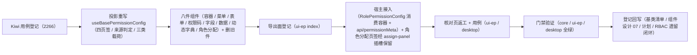

# 04 实施 · 授权组件与宿主页返工（新口径）

> 前端组件库 · 08 交互类 · 04 权限配置 · 嵌套子任务 04（需求 08-4）· 实施记录

[文档首页](../../../../../../../文档首页.md) › [08 交互类](../../../08_交互类.md) › [04 权限配置](../../08_交互类_04_权限配置.md) › 实施记录　|　[← 详细设计](../设计/01_详细设计_04_授权组件与宿主页返工.md)

## 1. 实施信息 

| 项 | 值 |
| --- | --- |
| 任务 | 08-4-4 授权组件与宿主页返工（新口径）（[任务](../08_交互类_04_权限配置_04_授权组件与宿主页返工.md)） |
| 对应需求 | [08-4](../../../../../需求/08_需求_交互类.md#r08-4) |
| 详细设计 | [01_详细设计_04_授权组件与宿主页返工.md](../设计/01_详细设计_04_授权组件与宿主页返工.md) |
| 实施日期 | 2026-10-08 |
| 实施人 | minjian |
| 实施环境 | Ubuntu 开发机 · Node（workspace `@bms/ui-ep` + `apps/desktop`）· Vitest 5 / jsdom · Vue 3.5 / TypeScript 严格模式 |
| Kiwi 用例 | 2266（分类「平台骨架」/ P2 / CONFIRMED / 标签「自动化」） |
| 结论 | 完成标准达标（八件可用、四页签结构齐备、来源判定与连带撤销正确、宿主三页签空态替换） |

## 2. 实施概览 

结果小结：投影与八件按新口径重建，删除旧三件；宿主角色管理页「菜单 / 表单 / 数据权限」三页签空态替换为真实组件；`@bms/ui-ep` 68 文件 / 944 用例、`apps/desktop` 48 文件 / 292 用例全绿。

## 3. 实施过程 

1. **Kiwi 先行**：经容器内 Django shell 登记用例，取得编号 **2266**；用例文件首行标注 `// kiwi_id: 2266`。
2. **投影重写**（`ui-ep/src/composables/useBasePermissionConfig.ts`）：四页签状态、选择项、元数据 / 授权 / 字段 / 数据权限 / 用户响应式面、来源判定与写入、三类提交与用户差量。
3. **八件组件**（`ui-ep/src/components/interaction/`）：`PermissionConfig`（总容器，四页签装配 + `assign-panel` 具名插槽）、`MenuPermissionPanel`（菜单权限件）、`FormPermissionPanel`（表单权限件）、`ActionPermissionPanel`（权限码面板）、`FieldPermissionPanel`（字段权限面板）、`DataScopePanel`（数据权限件，结构化四子页签）、`DynamicDictPicker`（动态字典件，经字典组件基类取数）、`RoleAssignPanel`（角色分配件）；`PermissionTree` 改造为仅菜单入口树。删除旧件 `FieldPermMatrix` / `FieldPermCell` / `SubjectBinding`。
4. **导出面**（`ui-ep/src/index.ts`）：新增八件导出，移除旧三件与旧类型 re-export。
5. **宿主接入**：
   - `api/permissionMeta.ts`（新建）：菜单 / 表单 / 字段 / 按钮 / 动作元数据装配为内核 `PermissionMetadata`。
   - `views/system/role/RolePermissionConfig.vue`（改写）：消费 ui-ep 授权总容器件，注入 `jobs`（元数据 / 三类授权 / 用户差量 / 取码），角色分配页签经容器 `assign-panel` 插槽复用宿主内建 `RoleAssignTab`（用户分配 + mdm 岗位 / 部门分配插件挂接位）。
6. **核对页返工**：`apps/desktop/permission-config-check.html` + `src/dev/{permissionConfigCheck.ts,PermissionConfigCheck.vue}` 按新口径承载四页签与 12 项自检。
7. **用例**：`ui-ep/tests/interaction-permission.spec.ts`（契约套件驱动 + 八件）、`interaction-placeholder.spec.ts`（占位契约按新形状更新）。
8. **登记回写**：基类清单 §2.1 / §5.2。

## 4. 问题与处置 

| # | 问题 | 处置 |
| --- | --- | --- |
| 1 | 面板子件需实质挂继承链（护栏） | 件经基类投影组合式接入（`useBasePermissionConfig` / `useBaseTreeData` / `useBaseDictSelect`） |
| 2 | 容器 `v-for` 与 `v-if` 同元素致扩展子页签显隐失效 | 改计算属性 `availablePolicies` 过滤 |
| 3 | 角色分配 mdm 插件挂接位与容器默认角色分配件冲突 | 容器 `assign-panel` 具名插槽由宿主覆写为内建 `RoleAssignTab`（保留插件挂接位与既有用例） |
| 4 | 授权接口响应字段为 `items` 而非 `entries` | 宿主适配按 `items` 读取并映射为内核条目 |

## 5. 验证结果 

| 命令 | 结果 |
| --- | --- |
| `pnpm run core:check` / `pnpm run ui-ep:check` | 通过（core 1273、ui-ep 944 用例） |
| 宿主 `npx vue-tsc -b` / `pnpm run lint` / `pnpm run test` | 通过（desktop 292 用例） |
| 开发态核对页（chromium headless 截图） | 四页签渲染 + 12 项自检上屏 |
| `check-links.py`、`check-base.py` | 通过 |

对照完成标准：八件可用、四页签结构齐备、来源判定与连带撤销正确、字段默认全开与收窄、数据权限四子页签与匹配校验、宿主三页签空态替换、原型对照（见测试记录）。

## 6. 偏差与遗留 

- **数据权限字典类型清单**：后端缺字典类型列表端点（当前仅 `GET /dicts/{dict_type}`），宿主 `dictTypes` 暂空（数据权限页签空态），归口后端补端点。
- **表单名称**：后端 `FormItem` 无名称字段，宿主以 `component` 兜底（归口后端补名称或 i18n 名）。
- **扩展权限注册清单**：本期空注册（未注册即隐藏扩展子页签），归口后端注册表落地。
- **角色管理页「岗位 / 部门分配」**：mdm 插件缺失即隐藏（沿用宿主内建 `RoleAssignTab` 的挂接位）。
- 移动端实现未做（契约套件已就位供复用）。
- Kiwi 用例编号 2266 已登记于平台。

> 本文档依《[文档生成规范](../../../../../../../规范/文档生成规范.md)》编写
