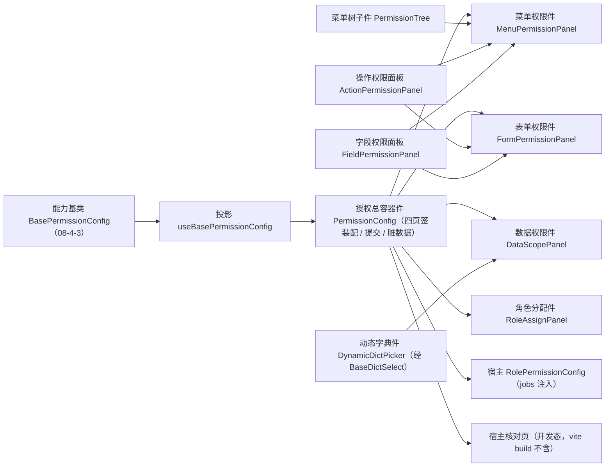

# 04 详细设计 · 授权组件与宿主页返工（新口径）

> 前端组件库 · 08 交互类 · 04 权限配置 · 嵌套子任务 04（需求 08-4）· 详细设计

[文档首页](../../../../../../../文档首页.md) › [08 交互类](../../../08_交互类.md) › [04 权限配置](../../08_交互类_04_权限配置.md) › 详细设计　|　[← 任务](../08_交互类_04_权限配置_04_授权组件与宿主页返工.md)

## 1. 设计目标与范围 <a id="goal"></a>

在 `08-4-3`（新口径核心）之上返工**组件层与宿主接入**：投影、八件组件、RBAC 角色管理页「权限配置」区三页签空态替换为真实组件，以及开发态核对页。

- **投影薄适配**：重写 `useBasePermissionConfig`（四页签状态 / 选择项 / 来源判定 / 三类载荷 / 阶段机 ↔ 响应式）；判定逻辑全部在核心。
- **八件组件**（对齐《组件设计 07》「职责与组成」）：授权总容器件（`PermissionConfig`）、菜单权限件（`MenuPermissionPanel`）、表单权限件（`FormPermissionPanel`）、操作权限面板（`ActionPermissionPanel`）、字段权限面板（`FieldPermissionPanel`）、数据权限件（`DataScopePanel`，重写）、动态字典件（`DynamicDictPicker`，新建）、角色分配件（`RoleAssignPanel`，新建）。
- **内部子件**：菜单树（`PermissionTree`，改造为仅菜单入口）由菜单权限件复用；动态字典件经字典组件基类 `BaseDictSelect` 取数（复用 `06_06`）。
- **旧件处置**：删除 `FieldPermMatrix.vue` / `FieldPermCell.vue` / `SubjectBinding.vue`（新口径不再使用全表单字段矩阵与多类型主体绑定）。
- **宿主接入**：`RolePermissionConfig.vue` 改为消费 `PermissionConfig`（数据通路经 `jobs` 注入）；`RoleAssignTab.vue` 逻辑并入 `RoleAssignPanel`，宿主页删除该文件；`api/role.ts` 补齐元数据与授权接口封装。
- **宿主核对页返工**：`permission-config-check.html` + `src/dev/{permissionConfigCheck.ts,PermissionConfigCheck.vue}` 按新口径承载四页签自检。
- **不在本期**：后端接口实现（沿用 `07_RBAC 02_03`）；权限计算与缓存；菜单 / 字段实体维护页；岗位 / 部门分配（mdm 插件）；移动端。

### 1.1 口径与依从 <a id="positioning"></a>

- **架构铁律**：件只做渲染与交互投影，编排与判定全部在能力基类 `BasePermissionConfig`（`08-4-3`）；件经 `src/composables/` 的基类投影挂继承链（护栏 `guard-component-inheritance`）。
- **对外契约破版**：`PermissionConfig` 的对外形状随新口径**破版升级**（tab 改 `menu/form/data/assign`，数据面 / 事件 / 插槽随新语义），回写 `08_01_01` 与冻结用例（见 [08-4-3 详设 §6](../../08_交互类_04_权限配置_03_授权编排基类与领域/设计/01_详细设计_03_授权编排基类与领域.md)）。
- **占位语义**：`ready === false` → 降级提示 + 操作禁用 + 零请求；处理函数未注入同样是占位（不请求）。
- **来源判定展示**：本上下文来源项可改；非本来源项只读并标注「来自菜单入口 / 直接授予」。
- **端范围**：**仅 PC**（`frontend/packages/ui-ep` + `apps/desktop`）。

## 2. 交付物清单 <a id="deliver"></a>

| # | 交付物 | 落点 |
| --- | --- | --- |
| 1 | 授权编排投影（重写） | `ui-ep/src/composables/useBasePermissionConfig.ts` |
| 2 | 授权总容器件（返工） | `ui-ep/src/components/interaction/PermissionConfig.vue` |
| 3 | 菜单树内部子件（改造：仅菜单入口） | `ui-ep/src/components/interaction/PermissionTree.vue` |
| 4 | 菜单权限件（新） | `ui-ep/src/components/interaction/MenuPermissionPanel.vue` |
| 5 | 表单权限件（新） | `ui-ep/src/components/interaction/FormPermissionPanel.vue` |
| 6 | 操作权限面板（新） | `ui-ep/src/components/interaction/ActionPermissionPanel.vue` |
| 7 | 字段权限面板（新） | `ui-ep/src/components/interaction/FieldPermissionPanel.vue` |
| 8 | 数据权限件（重写：结构化四子页签） | `ui-ep/src/components/interaction/DataScopePanel.vue` |
| 9 | 动态字典件（新，复用字典组件基类） | `ui-ep/src/components/interaction/DynamicDictPicker.vue` |
| 10 | 角色分配件（新，替代 `SubjectBinding`） | `ui-ep/src/components/interaction/RoleAssignPanel.vue` |
| 11 | 旧件删除 | `ui-ep/src/components/interaction/{FieldPermMatrix.vue,FieldPermCell.vue,SubjectBinding.vue}` |
| 12 | 导出面登记 | `ui-ep/src/index.ts` |
| 13 | 宿主页接入 | `apps/desktop/src/views/system/role/RolePermissionConfig.vue`（改）；`apps/desktop/src/views/system/role/RoleAssignTab.vue`（删） |
| 14 | 宿主接口封装 | `apps/desktop/src/api/role.ts`（补元数据 / 授权 / 用户） |
| 15 | 用例（投影 + 八件） | `ui-ep/tests/interaction-permission.spec.ts`（重写） |
| 16 | 开发态核对页（返工） | `apps/desktop/permission-config-check.html`、`apps/desktop/src/dev/{permissionConfigCheck.ts,PermissionConfigCheck.vue}` |
| 17 | 登记回写（基类清单 / 组件设计 07 / 计划 / 实施与测试记录） | 见第 6 节 |



## 3. 接口 / 契约与边界 <a id="contract"></a>

### 3.1 投影 `useBasePermissionConfig`（重写） <a id="bindings"></a>

```ts
export interface UseBasePermissionConfigOptions {
  ready?: boolean
  roleId?: string | number
  tab?: PermissionTab
  grantPerm?: string
  jobs?: PermissionJobs
  access?: BaseAccess
  notice?: BaseNotice
}
export interface UseBasePermissionConfigResult {
  config: BasePermissionConfig
  ready: Ref<boolean>
  degraded: Ref<boolean>
  disabled: Ref<boolean>
  tab: Ref<PermissionTab>
  metadata: Ref<PermissionMetadata>
  entries: Ref<PermissionEntry[]>
  fieldEntries: Ref<FieldPermEntry[]>
  dataScopeEntries: Ref<DataScopeEntry[]>
  users: Ref<AssignedUser[]>
  selectedMenuId: Ref<string>
  menuSubTab: Ref<'action' | 'field'>
  selectedFormId: Ref<string>
  formSubTab: Ref<'action' | 'field'>
  selectedDictTypeId: Ref<string>
  dataScopePolicy: Ref<DataScopePolicyType>
  dirty: Ref<boolean>
  phase: Ref<PermissionPhase>
  busy: Ref<boolean>
  errorMessage: Ref<string>
  errorTarget: Ref<PermissionErrorTarget | undefined>
  pendingAccessRefresh: Ref<boolean>
  refreshError: Ref<string>
  requestCount: Ref<number>
  canSave: Ref<boolean>
  canGrant: Ref<boolean>
  loadReady: Ref<boolean>
  submitReady: Ref<boolean>
  setReady(value: boolean): void
  setTab(tab: PermissionTab): void
  setRole(roleId: string | number | undefined): void
  setJobs(jobs: PermissionJobs): void
  setAccess(access: BaseAccess): void
  selectMenu(id: string): void
  setMenuSubTab(tab: 'action' | 'field'): void
  selectForm(id: string): void
  setFormSubTab(tab: 'action' | 'field'): void
  selectDictType(id: string): void
  setDataScopePolicy(policy: DataScopePolicyType): void
  load(): Promise<void>
  applyMetadata(metadata: PermissionMetadata): void
  applySnapshot(snapshot: PermissionSnapshot): void
  toggleMenu(id: string, checked?: boolean): boolean
  toggleAction(actionId: string, sourceMenuId: string, checked?: boolean): boolean
  setFieldPerm(formId: string, fieldId: string, patch: { visible?: boolean; editable?: boolean }, sourceMenuId: string): boolean
  setDataScope(dictTypeId: string, policyType: DataScopePolicyType, config: readonly DataScopePolicyItem[]): boolean
  bindUsers(users: readonly AssignedUser[]): boolean
  unbindUser(id: string): boolean
  save(): Promise<PermissionSubmitResult | undefined>
  refreshAccess(): Promise<boolean>
  retry(): Promise<PermissionSubmitResult | undefined>
  reset(): void
  discard(): void
}
```

- 跨实例基类对象经 `markRaw(toRaw(x))` 隔离；投影不触 DOM。

### 3.2 `PermissionConfig` 授权总容器件（返工） <a id="root"></a>

| 面 | 内容 |
| --- | --- |
| 数据面 | `ready`（缺省 `false`）/ `roleId` / `tab`（`v-model:tab`）/ `jobs` / `access` / `grantPerm` / `autoLoad`（缺省 `true`）/ `degradeText` / `readonly` |
| 事件 | `update:tab` / `change`（`{ kind, value }`，`kind` ∈ `menu/action/field/scope/user`）/ `saved`（提交结果）/ `failed`（`{ message, target }`）/ `dirty`（`boolean`） |
| 插槽 | `degrade` / `empty` / `live` / `menu-panel` / `form-panel` / `data-panel` / `assign-panel`（具名插槽：mdm 岗位 / 部门分配经 `assign-panel` 追加子页签） |
| 对外能力 | `load()` / `save()` / `discard()` / `refreshAccess()` / `retry()` / `setRole()`（`defineExpose`，供宿主工具栏调用） |
| 行为 | 四页签装配（菜单 / 表单 / 数据 / 角色分配）；`ready` 且 `autoLoad` 时挂载后自动取数；保存为三接口顺序全量覆盖 + 用户差量，进行中禁用重复提交；保存成功提示「已生效」，失败按错误码定位页签并保留本地；未就绪渲染降级、操作禁用且零请求 |

- **保存入口唯一**：组件内不设保存按钮，`save()` 由宿主工具栏调用。
- **来源判定上屏**：菜单 / 表单页签内操作与字段项按 `sourceMenuId` 标注可改 / 只读。

### 3.3 `MenuPermissionPanel` 菜单权限件 <a id="menu"></a>

| 面 | 内容 |
| --- | --- |
| 数据面 | `menus`（菜单树）/ `forms` / `entries` / `fieldEntries` / `selectedMenuId` / `subTab`（`action` / `field`）/ `disabled` |
| 事件 | `select-menu` / `update:subTab` / `toggle-menu`（`{ id, checked }`）/ `toggle-action`（`{ actionId, sourceMenuId, checked }`）/ `set-field-perm`（`{ formId, fieldId, patch, sourceMenuId }`） |
| 插槽 | `empty` |
| 行为 | 左侧菜单树（仅菜单入口；三态勾选、搜索、展开收起、挂接缺失标记）；选中入口后右侧装配「操作权限 / 字段权限」两子页签（该入口关联表单；查看权限由菜单连带授予，只读标识）；来源非本入口的项只读 |

### 3.4 `FormPermissionPanel` 表单权限件 <a id="form"></a>

| 面 | 内容 |
| --- | --- |
| 数据面 | `forms`（所有表单含无入口）/ `entries` / `fieldEntries` / `selectedFormId` / `subTab` / `disabled` |
| 事件 | `select-form` / `update:subTab` / `toggle-action` / `set-field-perm` |
| 插槽 | `empty` |
| 行为 | 左侧表单列表（搜索；含无菜单入口表单）；选中后右侧装配「操作权限 / 字段权限」两子页签（**补充授权**：表单级直接授予可改、来自菜单入口的只读并标注） |

### 3.5 `ActionPermissionPanel` 操作权限面板 <a id="action"></a>

| 面 | 内容 |
| --- | --- |
| 数据面 | `formId` / `actions`（该表单动作码清单）/ `entries`（授权条目）/ `sourceMenuId`（当前上下文来源）/ `disabled` |
| 事件 | `toggle`（`{ actionId, checked }`） |
| 插槽 | `empty` |
| 行为 | 动作码清单（默认无、勾选授予）；来源判定：本来源（`sourceMenuId`）可改，其它来源只读并标注；按名称 / 动作码搜索定位 |

### 3.6 `FieldPermissionPanel` 字段权限面板 <a id="field"></a>

| 面 | 内容 |
| --- | --- |
| 数据面 | `formId` / `fields`（该表单字段清单）/ `fieldEntries` / `sourceMenuId` / `disabled` |
| 事件 | `change`（`{ fieldId, patch }`）/ `batch`（`{ kind: 'visible' | 'editable', value }`） |
| 插槽 | `empty` |
| 行为 | 字段清单（默认全部可见可编辑；授予后收窄）；`editable=false` 时强制 `visible=false`；批量「全选可见 / 全选不可见 / 全选可编辑」；搜索与「仅显示已收窄」过滤；来源判定同操作面板 |

### 3.7 `DataScopePanel` 数据权限件（重写） <a id="scope"></a>

| 面 | 内容 |
| --- | --- |
| 数据面 | `dictTypes`（基础数据字典）/ `extensions`（扩展权限注册清单）/ `entries`（数据权限）/ `selectedDictTypeId` / `policy`（`select` / `region` / `match` / `extension`）/ `disabled` |
| 事件 | `select-dict` / `update:policy` / `set-scope`（`{ dictTypeId, policyType, config }`）/ `validate`（`{ policyType, message }`） |
| 插槽 | `empty` |
| 行为 | 左侧字典列表 → 右侧四子页签（只选不编）：**数据选择**（勾选字典数据）、**数据区域**（开始值 / 结束值，经动态字典件选择）、**数据匹配**（字段 + 通配符值，含校验）、**扩展权限**（明细 + 参数；无参提示；扩展未注册不显示该子页签）；空值 = 无数据权限（该条不入载荷） |

### 3.8 `DynamicDictPicker` 动态字典件 <a id="dict"></a>

| 面 | 内容 |
| --- | --- |
| 数据面 | `dictType`（字典类型码，必填）/ `modelValue` / `multiple` / `disabled` / `source`（注入式字典数据源）/ `store`（注入式字典缓存） |
| 事件 | `update:modelValue`（选中值）/ `resolve`（回显条目） |
| 行为 | 经字典组件基类 `BaseDictSelect` 取数（小字典本地过滤 / 大字典远程搜索、批量回显）；未注入数据源即占位零请求 |

### 3.9 `RoleAssignPanel` 角色分配件 <a id="assign"></a>

| 面 | 内容 |
| --- | --- |
| 数据面 | `users`（已分配用户）/ `candidates`（选择用户弹窗候选）/ `disabled` / `loading` |
| 事件 | `select`（打开选择弹窗）/ `bind`（用户）/ `unbind`（`{ id }`）/ `search`（关键词分页） |
| 插槽 | `empty` / `slots`（岗位 / 部门分配插件经具名插槽追加） |
| 行为 | 已分配用户列表（姓名 / 账号 / 状态 / 移除）+ 工具栏「选择用户」多选弹窗（搜索 / 分页）+ 已分配计数；**不设上限**；变更随宿主保存提交（差量） |

### 3.10 宿主接入 `RolePermissionConfig` <a id="host"></a>

- **结构与数据**：宿主页渲染 `<permission-config>`（`role-id` 传入、`jobs` / `access` 注入、`@dirty`、`@saved`、`@failed`）；宿主工具栏「保存」调用组件 `save()`、撤销调用 `discard()`。
- **接口封装**（`api/role.ts` 补齐）：
  - 元数据：`GET /api/v1/menus`（菜单树）、`/forms`（含 `menu_ids`）、`/fields`（`?form_id`）、`/actions` + `/buttons`（表单 → 动作）、`/dicts`（字典类型）、扩展权限注册清单（本期空注册）；
  - 授权：`GET/PUT /roles/{id}/permissions`、`/fields`、`/data-permissions`（写带 `Idempotency-Key`）；
  - 用户：`GET /roles/{id}/users`（含 `?kw&page&size`）、`POST /roles/{id}/users`、`DELETE /roles/{id}/users/{user_id}`；候选 `GET /api/v1/users`；
  - 取码：菜单 `/menus/my` 的 `permissions` 集合（保存后刷新 `BaseAccess`）。
- **mdm 插件槽**：`assign-panel` 具名插槽追加「岗位分配 / 部门分配」子页签（经基座显式上下文注入通道，缺失即不渲染）。

### 3.11 宿主核对页（返工） <a id="check"></a>

- `apps/desktop/permission-config-check.html`（开发态入口，`vite build` 不含）+ `src/dev/permissionConfigCheck.ts` + `src/dev/PermissionConfigCheck.vue`：注入样例元数据与授权，承载四页签、来源判定、连带撤销、数据权限结构、用户分配与三类幂等提交上屏自检。
- 自检项（`data-check`，12 项）：占位零请求 / 四页签渲染 / 菜单三态与连带 / 取消仅撤本来源 / 挂接缺失标记 / 操作默认无 / 字段默认全开与收窄 / 数据权限四子页签与匹配校验 / 用户分配与计数 / 三类载荷幂等（两次提交同键）/ 三接口顺序提交与错误码定位 / 上下文刷新。

## 4. 失败分支与边界 <a id="edge"></a>

| 边界 / 失败场景 | 处置 |
| --- | --- |
| 未就绪 / 处理函数未注入 | 降级提示 + 操作禁用 + 零请求；保存入口禁用 |
| 无权（缺 `role:grant`） | 保存入口禁用；勾选与编辑不动作 |
| 挂接缺失菜单 | 标记「未挂接」并禁用勾选 |
| 来源非本上下文 | 只读并标注来源 |
| 字段不匹配 | 提交后由后端拒绝（30049），件层按错误码定位表单页签 |
| 匹配通配符非法 | 件层即时校验提示（30047）；提交后后端拒绝定位数据权限页签 |
| 扩展权限未注册 | 不显示「扩展权限」子页签 |
| 数据权限空值 | 展示「无数据权限」，不入载荷 |
| 三接口任一失败 | 中止、定位页签、保留本地；「重试」重放同内容 |
| 用户重复 / 弹窗取消 | 去重不写入；取消不改动 |
| mdm 插件缺失 | 岗位 / 部门分配子页签不渲染（用户分配不受影响） |
| 大树 / 大字典 | 菜单树搜索与展开收起；表单列表与字段清单搜索；字典经 `BaseDictSelect` 分页 / 远程搜索 |
| 提交进行中重复点击 | 按钮禁用；核心返回 `undefined` |
| 脏数据 | 件层上抛 `dirty`；宿主切换 / 关闭前拦截 |

## 5. 测试设计与验收映射 <a id="test"></a>

| 验收点（需求 08-4 / 子任务 08-4-4） | 用例 |
| --- | --- |
| 契约套件（授权编排新口径）通过 | `ui-ep/tests/interaction-permission.spec.ts` 驱动 `describePermissionConfigContract` |
| 占位语义（未就绪降级 / 禁用 / 零请求） | 同上 + 容器件用例（`08_01_01` 冻结用例按新形状更新） |
| 四页签装配与 `update:tab` | 容器件用例 |
| 菜单三态、连带、按来源撤销、挂接缺失 | 菜单权限件 + 菜单树子件用例 |
| 操作权限默认无、来源只读 | 操作权限面板用例 |
| 字段默认全开、收窄、`editable=false` 强制不可见、批量 | 字段权限面板用例 |
| 数据权限四子页签、只选不编、匹配校验、扩展未注册隐藏 | 数据权限件 + 动态字典件用例 |
| 用户分配（列表 / 选择弹窗 / 移除 / 计数） | 角色分配件用例 |
| 三类载荷幂等、三接口顺序提交、失败定位与重试 | 容器件用例（注入式处理函数） |
| 宿主页三页签空态替换为真实组件、与原型一致 | `apps/desktop/tests/role-view.spec.ts`（更新）+ 原型对照结论 |
| 开发态核对页 12 项自检全绿 | chromium headless `--dump-dom` 断言 + 实施记录对照表 |
| `vue-tsc`、ESLint、Vitest 全通过 | 根 `pnpm run check` + 宿主 `vue-tsc -b` / `lint` / `test:cov` |
| 原型对照（逐页截图） | 测试记录登记结论（`check-prototype-review.py` 门禁依据） |

- Kiwi 用例 1 条（编号于测试步登记后回填，分类「平台骨架」、优先级 P2、状态 CONFIRMED、标签「自动化」）。

## 6. 登记落点 <a id="register"></a>

| 内容 | 落点 |
| --- | --- |
| 投影落点 | 《[前端基类清单](../../../../../../../前端基类清单.md)》§9「PC 插件」（`useBasePermissionConfig` 保持） |
| 组件落点 | 同上 §9「PC 插件」（`components/interaction/` 八件 + 菜单树子件） |
| 设计口径回写 | 《组件设计》[07 权限配置](../../../../../../../设计/组件设计/08_交互类/07_组件设计_权限配置/07_组件设计_权限配置.md)：职责与组成 / 继承链行随新口径 |
| 宿主落点 | 同上 §9「宿主横切底座」（`api/role.ts` / `views/system/role/RolePermissionConfig.vue`） |
| 上游登记 | ① 授权交互与三接口口径 → 《概要设计 · 角色管理》；② 菜单↔表单与操作权限来源 → 《概要设计 · 菜单管理》；③ 数据权限结构化与扩展筛选 → 《架构设计 · 权限计算引擎》「数据权限」节 |
| 任务 / 父任务 / 计划状态 | [任务](../08_交互类_04_权限配置_04_授权组件与宿主页返工.md)、[父任务](../../08_交互类_04_权限配置.md)、[计划](../../../../../../../项目/04_前端组件库/计划/01_计划_前端组件库.md) |
| 遗留闭环 | [07_RBAC 02_03 角色管理](../../../../../../07_RBAC基础模块/任务/02_用户与角色/02_用户与角色_03_角色管理/02_用户与角色_03_角色管理.md) 实施 / 测试记录「待组件库 08_04 返工」空态遗留 |

## 7. 边界与开放项 <a id="open"></a>

- **不在本期**：后端接口实现；权限计算与缓存；菜单 / 字段实体维护页；岗位 / 部门分配（mdm 插件，经具名插槽）；移动端实现；深色主题细化。
- **协同契约**：元数据与授权通路经 `jobs` 注入；权限上下文经 `access` 注入；mdm 插件经 `assign-panel` 具名插槽挂接。
- **遗留登记**：扩展权限参数对话框由扩展功能注册提供（本期空注册即隐藏）；远程用户搜索经 `/api/v1/users`（已交付）。
- Kiwi 用例编号于测试步登记后回填实施 / 测试记录与用例文件。

## 8. 决策记录 <a id="decision"></a>

| # | 决策项 | 结论 |
| --- | --- | --- |
| 1 | 组件清单 | 八件（容器 / 菜单权限 / 表单权限 / 操作权限 / 字段权限 / 数据权限 / 动态字典 / 角色分配）+ 菜单树内部子件 |
| 2 | 旧件处置 | 改造复用（`PermissionTree` / `DataScopePanel`）；删除 `FieldPermMatrix` / `FieldPermCell` / `SubjectBinding` |
| 3 | 角色分配件落点 | 迁入 ui-ep `RoleAssignPanel`；宿主 `RoleAssignTab` 删除 |
| 4 | 动态字典件 | 新建 `DynamicDictPicker`，经字典组件基类 `BaseDictSelect` 取数 |
| 5 | 宿主接入 | 总容器件接管，宿主薄壳经 `jobs` 注入；三页签空态移除 |
| 6 | 保存入口 | 组件内不设保存按钮，宿主工具栏调用 `save()` / `discard()` |
| 7 | 提交编排 | 三接口顺序全量覆盖 + 用户差量（同 `08-4-3`） |
| 8 | 核对页 | 开发态入口（`vite build` 不含）+ 12 项上屏自检（新口径） |
| 9 | 原型对照 | 以《组件设计 07》[可交互原型](../../../../../../../设计/组件设计/08_交互类/07_组件设计_权限配置/07_原型设计_权限配置.html)为验收基准，逐页截图比对 |

## 9. 参考文档 <a id="ref"></a>

- [需求 08-4](../../../../../需求/08_需求_交互类.md#r08-4)、[任务 08-4-4](../08_交互类_04_权限配置_04_授权组件与宿主页返工.md)、[父任务 04 权限配置](../../08_交互类_04_权限配置.md)
- [08-4-3 详细设计 · 授权编排基类与领域（新口径）](../../08_交互类_04_权限配置_03_授权编排基类与领域/设计/01_详细设计_03_授权编排基类与领域.md)
- 《组件设计》[07 权限配置](../../../../../../../设计/组件设计/08_交互类/07_组件设计_权限配置/07_组件设计_权限配置.md)（含[可交互原型](../../../../../../../设计/组件设计/08_交互类/07_组件设计_权限配置/07_原型设计_权限配置.html)）
- [07_RBAC 02_03 角色管理详细设计](../../../../../../07_RBAC基础模块/任务/02_用户与角色/02_用户与角色_03_角色管理/设计/01_详细设计_03_角色管理.md)
- [06_06 字典字段](../../../../06_字段类/06_字段类_06_字典字段/06_字段类_06_字典字段.md)（动态字典件复用）
- [《前端基类清单》](../../../../../../../前端基类清单.md)、《[前端开发规范](../../../../../../../规范/前端开发规范.md)》、《[文档生成规范](../../../../../../../规范/文档生成规范.md)》

> 本文档依《[文档生成规范](../../../../../../../规范/文档生成规范.md)》编写
