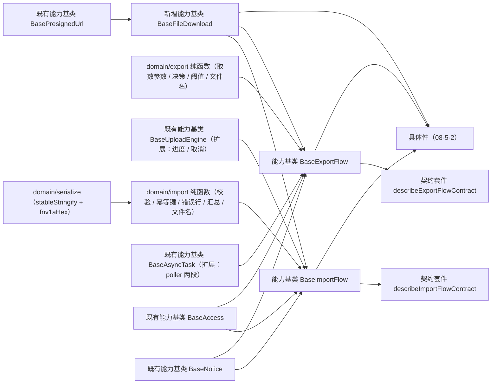

# 01 详细设计 · 导入导出编排基类与领域

> 前端组件库 · 08 交互类 · 05 导入导出 · 嵌套子任务 01（需求 08-5）· 详细设计

[文档首页](../../../../../../../文档首页.md) › [08 交互类](../../../08_交互类.md) › [05 导入导出](../../08_交互类_05_导入导出.md) › 详细设计　|　[← 任务](../08_交互类_05_导入导出_01_导入导出编排基类与领域.md)

## 1. 设计目标与范围 <a id="goal"></a>

交付[需求 08-5](../../../../../需求/08_需求_交互类.md#r08-5) 的**导入导出编排内核**：导入（模板下载 / 文件校验 / 内容派生幂等键 / 上传解析阶段与进度 / 错误行报告与明细下载 / 失败重试与重置）与导出（取数参数同口径 / 筛选与选中范围 / 脱敏与明文 / 同步下载与超阈值异步导出 / 进度与取消 / 失败重试），两条链均**真实生效**、数据通路由宿主注入。

- **领域入核心**：新增 `domain/import.ts`（文件校验、内容派生幂等键、错误行归一与分页、错误码 → i18n、汇总态、下载文件名）与 `domain/export.ts`（取数参数归一、选中集合归一、导出决策与同步 / 异步判定、明文判定、文件名与时间戳、错误文案），全部为框架无关纯函数。
- **编排入链**：新增能力基类 `BaseImportFlow`（导入流编排，组合上传引擎）与 `BaseExportFlow`（导出流编排，组合异步任务与下载触发）——一层一语义、失败分支各自独立。
- **下载入链**：新增能力基类 `BaseFileDownload`（取址 / 失效重取 / 降级重试），模板下载、错误明细下载与导出结果下载三处共用；浏览器触发归件层工具。
- **既有基类向后兼容扩展**：`BaseUploadEngine` 增可量化进度回传与中断钩子（`06_07` 文件上传字段复用）；`BaseAsyncTask` 增 poller 两段（提交 → 轮询 → 结果），未注入 poller 时既有 executor 路径逐字不变。
- **数据通路注入式**：执行导入 / 取数导出 / 轮询 / 模板与明细下载处理函数由宿主注入；**未注入即占位**（不发请求、返回 `undefined`、写占位文案），与 `08_01_02` 冻结的占位语义一致，真实接口联调随阶段八。
- **契约套件两套**：`describeImportFlowContract` / `describeExportFlowContract`（`@bms/core/testing`），后续移动端实现跑同一套断言。

### 1.1 口径与依从 <a id="positioning"></a>

- **架构铁律**：导入编排、导出编排与下载触发均为**横切功能**，一律落为**继承链上的能力基类**（核心 `capabilities/`），不在链外自由挂接；具体件只做渲染与投影。
- **继承链**：`BaseComponent`（组件根）→ 能力基类（`BaseFileDownload` / `BaseImportFlow` / `BaseExportFlow`）→ 具体件（`08-5-2`）。能力基类依赖单向登记于 `capabilities/manifest.ts`。
- **幂等键口径**（决策）：**内容派生**——`biz + 文件名 + 大小 + 最后修改时间` 经 FNV-1a 派生（同 `08_04` 口径）；同内容同键、内容变更换键；网络失败重试复用、换文件 / 清空 / 重新导入重置。
- **上传进度口径**：进度与取消由**上传引擎**承载（组合的 `BaseUploadEngine`），导入流只消费其进度面；宿主只提供一个执行导入处理函数，内部 multipart 单请求或分片皆可。
- **异步导出口径**：同步导出直达文件流（宿主触发下载）；超阈值转后台任务时经 `BaseAsyncTask` 的 poller 两段（提交 → 轮询 → 结果），轮询未注入时回落单次调用并把结果按「已转后台」提示。
- **前端不解析 Excel**：仅做类型 / 大小 / 空文件快速校验；模板列核对、行级校验与错误明细生成归后端（对齐[《组件设计 01》](../../../../../../../设计/组件设计/08_交互类/01_组件设计_导入导出/01_组件设计_导入导出.md)第 8 节）。
- **端范围**：**仅 PC**（`frontend/packages/ui-ep`）；移动端复用同一套契约断言，实现遗留。
- **工时**：本嵌套子任务 12h；因新增 3 个能力基类、2 份领域纯函数、2 套契约套件与 2 项既有基类扩展，实际上浮在实施记录登记。

## 2. 交付物清单 <a id="deliver"></a>

| # | 交付物 | 落点 |
| --- | --- | --- |
| 1 | 下载触发能力基类（新增） | `core/src/capabilities/file-download.ts` |
| 2 | 导入流能力基类（新增） | `core/src/capabilities/import-flow.ts` |
| 3 | 导出流能力基类（新增） | `core/src/capabilities/export-flow.ts` |
| 4 | 上传引擎扩展（进度回传 / 取消中断，向后兼容） | `core/src/capabilities/upload-engine.ts` |
| 5 | 异步任务扩展（poller 两段，向后兼容） | `core/src/capabilities/async-task.ts` |
| 6 | 能力依赖登记（新增 `file-download` / `import-flow` / `export-flow` 三键） | `core/src/capabilities/manifest.ts` |
| 7 | 导入领域纯函数与数据模型 | `core/src/domain/import.ts` |
| 8 | 导出领域纯函数与数据模型 | `core/src/domain/export.ts` |
| 9 | 共享散列工具（FNV-1a 提取，`permission-config` 改引用、输出不变） | `core/src/domain/serialize.ts` |
| 10 | 核心导出面登记 | `core/src/index.ts` |
| 11 | 契约套件两套（导入流 / 导出流） | `core/testing/index.ts` |
| 12 | 核心用例（领域 + 三基类 + 既有两基类回归补充） | `core/tests/domain-import.spec.ts`、`domain-export.spec.ts`、`import-flow.spec.ts`、`export-flow.spec.ts`、`file-download.spec.ts`，并补 `capabilities-batch3.spec.ts` |
| 13 | 登记回写（基类清单 / 组件设计 01 / 实施与测试记录） | 见第 6 节 |



## 3. 接口 / 契约与边界 <a id="contract"></a>

### 3.1 核心：`domain/import.ts`（新增纯函数与数据模型） <a id="domain-import"></a>

```ts
/** 导入执行权限码。 */
export const IMPORT_PERM = 'import:execute'
/** 接受的文件类型（白名单）。 */
export const IMPORT_ACCEPT = '.xlsx'
/** 文件大小上限缺省值（字节，`sys_config` 可配）。 */
export const IMPORT_DEFAULT_MAX_SIZE = 20 * 1024 * 1024
/** 错误行分页缺省每页行数。 */
export const IMPORT_ERROR_PAGE_SIZE = 20
/** 错误行展示上限（超限仅展示前 N 并引导下载完整明细）。 */
export const IMPORT_ERROR_DISPLAY_LIMIT = 1000
/** 占位文案（数据通路未就绪）。 */
export const IMPORT_PLACEHOLDER_TEXT = '导入未就绪（占位）'
/** 文件段错误码区间（5xxxx）。 */
export const IMPORT_FILE_ERROR_RANGE: readonly [number, number] = [50001, 59999]

/** 文件校验失败原因。 */
export type ImportFailReason = 'type' | 'size' | 'empty'
/** 文件元信息（校验与幂等键输入；件层由 `File` 映射）。 */
export interface ImportFileMeta { name: string; size: number; lastModified?: number }
/** 文件校验结果。 */
export interface ImportFileCheck { valid: boolean; reason?: ImportFailReason; message: string }
/** 错误行（行号自 Excel 起算，从 2 起）。 */
export interface ImportErrorRow { row: number; column?: string; message: string }
/** 导入结果（运行态确定值）。 */
export interface ImportResult { total: number; successCount: number; failCount: number; errors: ImportErrorRow[] }
/** 导入结果装载输入（后端可省略字段）。 */
export interface ImportResultInput {
  total?: number
  successCount?: number
  failCount?: number
  errors?: readonly { row?: number; column?: string; message?: string }[]
}
/** 结果汇总态。 */
export type ImportSummaryState = 'empty' | 'success' | 'warning'
/** 错误行分页结果。 */
export interface ImportErrorPage { page: number; pageCount: number; total: number; rows: ImportErrorRow[]; truncated: boolean }
/** 错误文案（i18n 键 + 兜底文本）。 */
export interface ImportErrorText { i18nKey: string; text: string }

fileExtension(name: string): string
normalizeAccept(accept: string): string[]
checkImportFile(meta: ImportFileMeta, options?: { accept?: string; maxSize?: number }): ImportFileCheck
deriveImportKey(biz: string, meta: ImportFileMeta): string
normalizeImportResult(input: ImportResultInput | undefined): ImportResult
resolveImportSummary(result: ImportResult): ImportSummaryState
isFileLevelError(code: number | undefined): boolean
resolveImportErrorText(input: { code?: number; message?: string }): ImportErrorText
paginateImportErrors(rows: readonly ImportErrorRow[], page: number, pageSize?: number): ImportErrorPage
templateFileName(bizName: string): string
errorReportFileName(bizName: string, at: Date | number): string
```

| 行为 | 口径 |
| --- | --- |
| 扩展名 | `fileExtension` 取最后一个 `.` 之后的小写，无扩展名返回空串 |
| 类型白名单 | `normalizeAccept` 拆分 / 小写 / 去空白 / 去重；`accept` 为空视为不限类型 |
| 文件校验 | 顺序短路：类型 → 大小 → 空文件（`size <= 0`）；`maxSize <= 0` 视为不限；`message` 为中文兜底文案（件层可走 i18n） |
| 幂等键 | `deriveImportKey` = `imp:{biz}:{fnv1aHex(biz\|name\|size\|lastModified)}`；**纯数据派生、不含随机数**（同内容同键、内容变更换键） |
| 结果归一 | `normalizeImportResult`：省略字段补 `0` / 空数组；`errors` 逐项补 `row`（缺失回落 0）、`column` 保留可选、`message` 补空串；**运行态一律确定值** |
| 汇总态 | 无数据（`total === 0`）→ `empty`；`failCount === 0` → `success`；否则 `warning` |
| 文件级错误 | `isFileLevelError` 判定错误码落在 `IMPORT_FILE_ERROR_RANGE`；文件级错误**整体拒绝、不展示错误行表** |
| 错误文案 | `resolveImportErrorText`：有错误码 → `i18nKey = error.{code}`，`text` 回落 `message`；无码仅 `text` |
| 错误行分页 | `paginateImportErrors`：页码夹取到 `[1, pageCount]`；`pageCount = max(1, ceil(total / pageSize))`；`truncated` 表示总数超 `IMPORT_ERROR_DISPLAY_LIMIT`（仅展示前 N 行并引导下载完整明细） |
| 文件名 | `templateFileName` = `{bizName}-导入模板.xlsx`；`errorReportFileName` = `{bizName}-导入错误明细-{yyyyMMddHHmmss}.xlsx`（时间戳复用 `domain/export` 的 `formatCompactTimestamp`） |
| 纯数据 | 不触 DOM、不请求、不依赖渲染框架；同输入同输出 |

### 3.2 核心：`domain/export.ts`（新增纯函数与数据模型） <a id="domain-export"></a>

```ts
/** 导出动作权限码。 */
export const EXPORT_PERM = 'export:download'
/** 明文导出权限码。 */
export const EXPORT_PLAIN_PERM = 'data:plain'
/** 占位文案（数据通路未就绪）。 */
export const EXPORT_PLACEHOLDER_TEXT = '导出未就绪（占位）'
/** 无数据提示文案。 */
export const EXPORT_EMPTY_TEXT = '当前筛选无数据可导出'
/** 后台异步导出提示文案。 */
export const EXPORT_QUEUED_TEXT = '数据量较大，已转后台导出，完成后在通知中心查看下载'

/** 导出范围。 */
export type ExportScope = 'filtered' | 'selected'
/** 导出通路（同步文件流 / 后台任务）。 */
export type ExportMode = 'sync' | 'async'
/** 取数参数（与列表查询同口径）。 */
export type ExportQueryParams = Record<string, unknown>
/** 导出决策输入。 */
export interface ExportDecisionInput {
  ready?: boolean
  disabled?: boolean
  permAllowed?: boolean
  scope?: ExportScope
  selectedIds?: readonly (string | number)[]
  total?: number
  threshold?: number
}
/** 导出决策（可否导出 + 通路）。 */
export interface ExportDecision { allowed: boolean; reason?: 'degraded' | 'disabled' | 'forbidden' | 'no-selection' | 'empty'; mode: ExportMode }

normalizeExportParams(params?: Record<string, unknown>): ExportQueryParams
normalizeSelectedIds(ids?: readonly (string | number)[]): string[]
resolveExportMode(input: { total?: number; threshold?: number }): ExportMode
canExportPlain(plain: boolean, plainAllowed: boolean): boolean
resolveExportDecision(input: ExportDecisionInput): ExportDecision
formatCompactTimestamp(at: Date | number): string
exportFileName(prefix: string, at: Date | number): string
exportErrorMessage(code: number | undefined, fallback?: string): string
```

| 行为 | 口径 |
| --- | --- |
| 取数参数 | `normalizeExportParams` 剔除 `undefined` / 空串 / 空数组项，保留 `*_start` / `*_end` / `order_by` / `order` 等既有键；**与列表 / 查询区同口径直传**，不做键名改写 |
| 选中集合 | `normalizeSelectedIds` 字符串化 + 去重 + 排序（载荷确定性）；空数组回落 `undefined`（表示未选） |
| 同步 / 异步 | `resolveExportMode`：`threshold <= 0`（前端不判断）→ `sync`；`total > threshold` → `async`；否则 `sync` |
| 明文 | `canExportPlain(plain, plainAllowed)`：申请明文且持 `data:plain` 才为真；未申请恒为假（默认脱敏） |
| 决策 | `resolveExportDecision` 顺序判定：未就绪 → `degraded`；外部禁用 → `disabled`；无权 → `forbidden`；选中导出未选 → `no-selection`；无数据 → `empty`；否则 `allowed`（`mode` 随阈值计算，`allowed` 为假时仍返回 `mode` 供件层提示） |
| 时间戳 | `formatCompactTimestamp` 本地时区 `yyyyMMddHHmmss`（文件名用，核心自带、不依赖宿主格式化层） |
| 文件名 | `exportFileName` = `{prefix}-{yyyyMMddHHmmss}.xlsx`（`prefix` 缺省由件层取业务中文名 / 业务标识） |
| 错误文案 | `exportErrorMessage`：403 → 无导出权限；5xxxx → 限流 / 服务错误提示重试；缺省回落 `fallback`（件层按 i18n `error.{code}` 细化） |
| 纯数据 | 不触 DOM、不请求、不依赖渲染框架；同输入同输出 |

### 3.3 核心：`domain/serialize.ts` 增 `fnv1aHex`（共享散列） <a id="fnv"></a>

```ts
/** FNV-1a（32 位）字符串散列（内容派生幂等键用，不依赖加密库）。 */
export function fnv1aHex(value: string): string
```

- 由 `domain/permission-config.ts` 的私有 `hashString` **原样提取**（同一算法与输出格式：8 位十六进制、`padStart(8, '0')`），`permission-config` 改为引用导出函数；既有授权幂等键字符串**逐字不变**（`deriveIdempotencyKey` 断言继续通过）。
- 导入幂等键与后续内容派生键（如前端任务去重键）统一引用本函数，避免多处重复实现。

### 3.4 核心：`BaseUploadEngine` 扩展（向后兼容） <a id="upload-ext"></a>

```ts
/** 上传进度回传（0 ~ 100）。 */
export type UploadProgressReporter = (percent: number) => void
/** 上传器（宿主注入；返回对象键；`report` 回传进度）。 */
export type Uploader<TFile> = (file: TFile, report: UploadProgressReporter) => Promise<string>

export abstract class BaseUploadEngine<TFile = unknown> extends BaseComponent {
  /** 中断钩子（宿主注入；`cancel()` 时调用，用于中断在途请求）。 */
  abort: (() => void) | undefined
  /** 是否已被取消（在途状态）。 */
  get canceled(): boolean

  async upload(file: TFile): Promise<string | undefined>
  cancel(): void
}
```

| 行为 | 口径 |
| --- | --- |
| 向后兼容 | `Uploader` 由「单参」扩为「双参」——JS / TS 少参函数可赋值给多参签名，既有宿主写法与既有用例（`uploader = async () => 'key-1'`）**不受影响** |
| 进度 | `upload` 起始置 0；执行中 `report(percent)` 夹取到 `[0, 100]` 并广播 `update`；成功后置 100；**失败不置 100**（保留当前进度）并向上抛错 |
| 取消 | `cancel()`：置取消标记 → 调 `abort?.()` → 进度复位 0；在途 `upload` 于取消后不再更新进度，并以 `undefined` 结束（**不视为失败**，区别于抛出错误） |
| 未注入上传器 | 占位：返回 `undefined`、进度保持 0（不变） |

### 3.5 核心：`BaseAsyncTask` 扩展（poller 两段，向后兼容） <a id="task-ext"></a>

```ts
/** 任务提交处理函数（两段轮询的第一段：返回任务句柄）。 */
export type TaskSubmitter<THandle = unknown> = () => Promise<THandle>
/** 轮询结果。 */
export interface TaskPollOutcome<TResult> { done: boolean; progress?: TaskProgress; result?: TResult }
/** 任务轮询处理函数（第二段：按句柄复查进度与结果）。 */
export type TaskPoller<THandle = unknown, TResult = unknown> = (
  handle: THandle,
  attempt: number,
) => Promise<TaskPollOutcome<TResult>>

export abstract class BaseAsyncTask<TResult = unknown> extends BaseComponent {
  /** 任务提交处理函数（与 `poller` 同时注入才走两段轮询）。 */
  submitter: TaskSubmitter | undefined
  /** 任务轮询处理函数（与 `submitter` 同时注入才走两段轮询）。 */
  poller: TaskPoller<unknown, TResult> | undefined
  /** 中断钩子（宿主注入；`cancel()` 时调用）。 */
  abort: (() => void) | undefined

  async submit(): Promise<void>
  cancel(): void
  nextPollDelay(attempt: number): number
}
```

| 行为 | 口径 |
| --- | --- |
| 路径选择 | `submitter` 与 `poller` **同时注入** → 两段轮询路径；否则 `executor` 注入 → 既有路径（**逐字不变**）；两者皆无 → 占位不动作（`status` 保持 `idle`、不发请求） |
| 两段轮询 | `status='running'` → `handle = await submitter()` → 循环 `poller(handle, attempt)`：写 `progress`、`done` 为真则以 `result` 结算；未完成则按 `nextPollDelay(attempt)` 等待后进入下一轮 |
| 退避 | 复用既有 `nextPollDelay`（指数退避、封顶 30 秒）；测试把 `pollInterval` 设为 1ms 验证轮询序列（**不使用假时钟**） |
| 取消 | `cancel()` 置取消标记 + 调 `abort?.()`；轮询循环在等待后检查标记并置 `canceled`（不再发起下一轮）；executor 路径语义不变（等待返回后置 `canceled`） |
| 失败 | 任一段抛错 → `status='error'` + `reportError`（既有口径不变） |
| 通知 | 每次状态 / 进度变更广播 `update`（既有口径不变） |

### 3.6 核心：能力基类 `BaseFileDownload`（新增） <a id="file-download"></a>

```ts
/** 下载阶段。 */
export type DownloadPhase = 'idle' | 'fetching' | 'done' | 'failed'
/** 下载请求（取址与命名）。 */
export interface DownloadRequest {
  biz?: string
  kind?: string
  url?: string
  token?: string
  filename?: string
}
/** 下载结果。 */
export interface DownloadResult { url: string; filename: string; message?: string }
/** 取址处理函数（宿主注入；返回 URL 或 blob）。 */
export type DownloadFetcher = (input: DownloadRequest) => Promise<{ url?: string; filename?: string; blob?: Blob } | undefined>
/** 浏览器触发处理函数（件层 / 宿主注入；未注入即占位）。 */
export type DownloadTrigger = (input: { url?: string; filename: string; blob?: Blob }) => void
/** 占位文案（未注入触发手段）。 */
export const DOWNLOAD_PLACEHOLDER_TEXT = '下载未就绪（占位）'

export abstract class BaseFileDownload extends BaseComponent {
  readonly identifier: string = 'file-download'
  override readonly depends = ['presigned-url']
  phase: DownloadPhase
  url: string
  filename: string
  errorMessage: string
  lastResult: DownloadResult | undefined
  presigned: BasePresignedUrl | undefined   // 取址回退（预签名）
  fetcher: DownloadFetcher | undefined      // 取址（宿主注入）
  trigger: DownloadTrigger | undefined      // 浏览器触发（件层注入；未注入即占位）

  get ready(): boolean     // 已注入触发手段
  get busy(): boolean
  get degraded(): boolean

  async download(input?: DownloadRequest): Promise<DownloadResult | undefined>
  retry(): Promise<DownloadResult | undefined>
  reset(): void
}
```

| 行为 | 口径 |
| --- | --- |
| 取址顺序 | 入参 `url` → `fetcher(input)` → 组合的 `presigned.get()`（预签名，含失效重取）→ 皆无则取址失败 |
| 触发 | `trigger` 未注入 → **占位**：不动作、写 `DOWNLOAD_PLACEHOLDER_TEXT`、返回 `undefined`（不请求） |
| 阶段 | `fetching` → 成功 `done`（记 `lastResult`）；失败 `failed`（写 `errorMessage`，保留请求供 `retry`） |
| 文件名 | 取「入参 → 取址返回 → 保留的上次值」，皆无为空串（**不臆造文件名**，由调用方按领域函数传入） |
| 重试 | `retry()` 仅在 `failed` 时重放上次请求；`idle` / `done` 返回 `undefined` |
| 未注入预签名 | `presigned` 未注入不影响直接 URL 与 `fetcher` 通路（各自独立） |
| 纯数据 | 不触 DOM、不请求；浏览器触发由注入的 `trigger` 承担（核心不触 DOM） |

- 依赖登记：`file-download: ['presigned-url']`。
- 不含业务语义（模板 / 明细 / 导出结果的含义与命名归调用方：`BaseImportFlow` 与 `BaseExportFlow`）。

### 3.7 核心：能力基类 `BaseImportFlow`（新增） <a id="import-flow"></a>

```ts
/** 导入步骤（与件层三步一致）。 */
export type ImportStep = 'select' | 'uploading' | 'result'
/** 导入阶段。 */
export type ImportPhase = 'idle' | 'uploading' | 'parsing' | 'done' | 'failed'
/** 执行导入处理函数（宿主注入；`report` 回传上传进度、`signal` 用于中断）。 */
export type ImportExecuteHandler = (input: {
  biz: string
  file: unknown
  idempotencyKey: string
  report: UploadProgressReporter
  signal?: AbortSignal
}) => Promise<ImportResultInput | undefined>
/** 下载处理函数（模板 / 错误明细；未注入经下载基类取址）。 */
export type ImportDownloadHandler = (input: {
  biz: string
  kind: 'template' | 'errors'
  params?: Record<string, unknown>
  idempotencyKey?: string
  filename: string
}) => Promise<DownloadRequest | undefined>
/** 注入的处理函数集。 */
export interface ImportJobs {
  execute?: ImportExecuteHandler
  downloadTemplate?: ImportDownloadHandler
  downloadErrors?: ImportDownloadHandler
}

export abstract class BaseImportFlow extends BaseComponent {
  readonly identifier: string = 'import-flow'
  override readonly depends = ['upload-engine', 'file-download', 'access', 'notice']
  biz: string
  bizName: string
  accept: string                    // 缺省 IMPORT_ACCEPT
  maxSize: number                   // 缺省 IMPORT_DEFAULT_MAX_SIZE
  templateParams: Record<string, unknown> | undefined
  successAutoClose: boolean
  ready: boolean
  requestCount: number
  step: ImportStep
  phase: ImportPhase
  progress: number
  file: unknown | undefined
  fileMeta: ImportFileMeta | undefined
  fileError: string
  idempotencyKey: string
  result: ImportResult | undefined
  errorMessage: string
  errorPage: number
  errorPageSize: number
  jobs: ImportJobs
  engine: BaseUploadEngine<unknown> | undefined
  download: BaseFileDownload | undefined
  access: BaseAccess | undefined
  notice: BaseNotice | undefined

  get degraded(): boolean
  get disabled(): boolean
  get busy(): boolean
  get canImport(): boolean
  get errorPageCount(): number
  get errorRows(): ImportErrorRow[]
  get errorTruncated(): boolean
  get summary(): ImportSummaryState
  get hasFileLevelError(): boolean

  setReady(value: boolean): void
  setBiz(biz: string, bizName?: string): void
  selectFile(file: unknown, meta: ImportFileMeta): boolean
  clearFile(): void
  setErrorPage(page: number): void
  submit(): Promise<ImportResult | undefined>
  cancel(): void
  retry(): Promise<ImportResult | undefined>
  reset(): void
  downloadTemplate(): Promise<DownloadResult | undefined>
  downloadErrors(): Promise<DownloadResult | undefined>
}
```

| 行为 | 口径 |
| --- | --- |
| 占位语义 | `ready === false` → `degraded` / `disabled` 为真；`submit` / 下载**零请求**（`requestCount` 恒 0），保持 `08_01_02` 冻结口径 |
| 文件校验 | `selectFile` 经 `checkImportFile(meta, { accept, maxSize })`；不合法 → 写 `fileError`、清 `file` 与幂等键、返回 `false`（不请求） |
| 幂等键 | 合法文件 → `idempotencyKey = deriveImportKey(biz, meta)`（**内容派生**）；`clearFile` / `reset` / 换文件 → 重新派生（新导入）；`retry` **复用**当前键 |
| 提交前置 | `canImport` = 就绪 ∧ 有权（`IMPORT_PERM`）∧ 非进行中；未选文件 / 文件校验失败 → 不动作 |
| 执行注入 | `jobs.execute` 未注入 → **占位**：写 `IMPORT_PLACEHOLDER_TEXT`、不发请求、返回 `undefined` |
| 上传与进度 | 注入上传引擎时把 `jobs.execute` 适配为 `engine.uploader`（`report` 经引擎透出与夹取，`signal` 取引擎中断）；未注入引擎则直接调用处理函数并以 `report` 写 `progress` |
| 阶段 | `uploading`（进度 < 100）→ `parsing`（`report(100)`，文案「解析校验中…」）→ 成功 `done` / 失败 `failed`；请求计数于发起时 `+1` |
| 结果 | 归一 `normalizeImportResult`；`step='result'`；`successAutoClose` 为真且全部成功 → 由件层关闭（核心只置结果与阶段） |
| 结果态 | 全部成功 → 提示成功（`notice`，注入时）；部分失败 → 提示按行号修正后重新导入；文件级错误 → **整体拒绝**、不展示错误行表（`hasFileLevelError`） |
| 失败与重试 | 失败置 `failed` + `errorMessage`；`retry()` 仅在 `failed` 且文件在时重放（**同幂等键**）；`cancel()` 经引擎中断、阶段回 `idle`、进度复位 |
| 防重复 | `busy` 期间 `submit()` 直接返回 `undefined`（件层同时禁用提交按钮） |
| 模板下载 | `jobs.downloadTemplate` 注入优先；未注入且 `download` 就绪 → 经下载基类（`kind: 'template'`，文件名 `templateFileName(bizName)`）；皆无 → 占位不动作 |
| 错误明细下载 | 同模板下载口径（`kind: 'errors'`，文件名 `errorReportFileName(bizName, now)`，携带幂等键供后端定位首次结果） |
| 错误行分页 | `errorRows` / `errorPageCount` / `errorTruncated` 由 `paginateImportErrors` 派生；`setErrorPage` 夹取页码 |
| 纯数据 | 不触 DOM、不请求；状态变更经生命周期 `update` 通知 |

- 依赖登记：`import-flow: ['upload-engine', 'file-download', 'access', 'notice']`。
- 不含渲染与文件选择控件（归 `08-5-2` 具体件）；不含 Excel 解析与行级校验（归后端）。

### 3.8 核心：能力基类 `BaseExportFlow`（新增） <a id="export-flow"></a>

```ts
/** 导出阶段。 */
export type ExportPhase = 'idle' | 'exporting' | 'queued' | 'done' | 'failed'
/** 导出请求载荷。 */
export interface ExportRequest {
  biz: string
  scope: ExportScope
  params: ExportQueryParams | undefined
  selectedIds: string[] | undefined
  plain: boolean
  filename: string
}
/** 导出结果（同步文件流信息或后台任务结果）。 */
export interface ExportResult {
  fileId?: string
  fileName?: string
  url?: string
  token?: string
  async?: boolean
  message?: string
}
/** 导出处理函数（宿主注入；同步触发下载或提交后台任务）。 */
export type ExportHandler = (
  input: ExportRequest & { signal?: AbortSignal; report: (progress: TaskProgress) => void },
) => Promise<ExportResult | undefined>
/** 轮询处理函数（宿主注入；后台任务进度复查）。 */
export type ExportPollHandler = (handle: unknown, attempt: number) => Promise<TaskPollOutcome<ExportResult>>
/** 注入的处理函数集。 */
export interface ExportJobs {
  export?: ExportHandler
  poll?: ExportPollHandler
}

export abstract class BaseExportFlow extends BaseComponent {
  readonly identifier: string = 'export-flow'
  override readonly depends = ['async-task', 'file-download', 'access', 'notice']
  biz: string
  bizName: string
  params: ExportQueryParams | undefined
  selectedIds: string[] | undefined
  scope: ExportScope
  asyncThreshold: number
  total: number
  plain: boolean
  filenamePrefix: string
  disabled: boolean
  ready: boolean
  requestCount: number
  phase: ExportPhase
  progress: TaskProgress
  errorMessage: string
  lastResult: ExportResult | undefined
  jobs: ExportJobs
  task: BaseAsyncTask<ExportResult> | undefined
  download: BaseFileDownload | undefined
  access: BaseAccess | undefined
  notice: BaseNotice | undefined

  get degraded(): boolean
  get busy(): boolean
  get exportReady(): boolean
  get canExport(): boolean
  get asyncMode(): boolean
  get empty(): boolean
  get plan(): ExportRequest

  setReady(value: boolean): void
  setBiz(biz: string, bizName?: string): void
  setParams(params?: Record<string, unknown>): void
  setScope(scope: ExportScope, selectedIds?: readonly (string | number)[]): void
  setSelected(ids?: readonly (string | number)[]): void
  setTotal(total: number): void
  setPlain(plain: boolean): void
  setThreshold(threshold: number): void
  setDisabled(disabled: boolean): void
  export(): Promise<ExportResult | undefined>
  cancel(): void
  retry(): Promise<ExportResult | undefined>
  reset(): void
}
```

| 行为 | 口径 |
| --- | --- |
| 占位语义 | `ready === false` → `degraded`、`canExport` 为假、`export()` **零请求**（`requestCount` 恒 0） |
| 决策 | `canExport` 由 `resolveExportDecision`（就绪 / 禁用 / 权限 / 选中 / 无数据）派生；未通过时 `export()` 写对应提示（无数据 → `EXPORT_EMPTY_TEXT`）并返回 `undefined` |
| 取数 | `plan` 由 `normalizeExportParams` / `normalizeSelectedIds` / `exportFileName` 派生（与列表查询同口径、含多列排序；列顺序遵循导出模板归后端） |
| 脱敏 | `plain` 需 `canExportPlain(plain, access.has(EXPORT_PLAIN_PERM))` 才生效；未持明文权限时按脱敏导出并提示 |
| 同步通路 | `phase='exporting'` → 调 `jobs.export`（`report` 回传进度）→ 结果含 `url` / `token` 且下载基类就绪 → 经下载基类触发下载；成功 `done` + 提示 |
| 异步通路 | `resolveExportMode` 为 `async` 且 `task` 与 `jobs.poll` 均注入 → `phase='queued'`，经 `task` 的 poller 两段（进度经 `TaskProgress` 透出）；轮询未注入则回落单次调用，结果按「已转后台」提示（`EXPORT_QUEUED_TEXT`） |
| 取消 | `cancel()`：异步经 `task.cancel()`（含 `abort`），同步调 `abort`？ → 设计：`task` 注入时经任务取消；未注入任务时置 `idle`（同步请求中断由宿主 `signal` 兜底） |
| 结果 | 记 `lastResult`；`async` 结果提示「已转后台，完成后在通知中心查看下载」；同步结果提示完成并触发下载 |
| 失败与重试 | 失败 `failed` + `exportErrorMessage`；`retry()` 仅在 `failed` 时重放（**同参数重放**） |
| 防重复 | `busy` 期间 `export()` 返回 `undefined`（件层同时禁用按钮） |
| 权限 | `canExport` 含 `access.has(EXPORT_PERM)`（未注入权限上下文或权限码为空视为有权，后端兜底） |
| 纯数据 | 不触 DOM、不请求；状态变更经生命周期 `update` 通知 |

- 依赖登记：`export-flow: ['async-task', 'file-download', 'access', 'notice']`。
- 不含列表取数与筛选区语义（归通用表格 / 查询区）；不含导出列定义与模板（归后端与导出模板）。

### 3.9 契约套件（`@bms/core/testing`） <a id="testing"></a>

| 套件 | 契约面（结构化接口） | 断言要点 |
| --- | --- | --- |
| `describeImportFlowContract(name, create)` | `ready` / `degraded` / `disabled` / `requestCount` / `phase` / `step` / `progress` / `idempotencyKey` / `fileError` / `summary` / `errorRows()` / `errorPageCount` / `setReady` / `setBiz` / `selectFile` / `clearFile` / `setJobs` / `setEngine` / `submit` / `retry` / `reset` / `cancel` / `setErrorPage` / `downloadTemplate` / `downloadErrors` | 占位零请求与就绪不变占位；文件类型 / 大小 / 空文件校验与失败不请求；幂等键内容派生（同文件同键、换文件换键、重试复用、清空重置）；阶段推进 `uploading → parsing → done` 与进度透出；结果归一与汇总态（全部成功 / 部分失败 / 无数据）；文件级错误整体拒绝不展示错误行；错误行分页与超限截断标记；未注入执行处理不请求且保留本地；失败可重试（同键）且进行中重复提交不动作；取消中断与进度复位；模板 / 错误明细下载（注入优先、未注入经下载基类、皆无则占位不动作） |
| `describeExportFlowContract(name, create)` | `ready` / `degraded` / `requestCount` / `phase` / `progress` / `canExport` / `asyncMode` / `empty` / `exportReady` / `plan()` / `lastResult` / `setReady` / `setBiz` / `setParams` / `setScope` / `setSelected` / `setTotal` / `setPlain` / `setThreshold` / `setDisabled` / `setAccess` / `setJobs` / `setTask` / `setDownload` / `export` / `retry` / `cancel` / `reset` | 占位零请求；取数参数归一（剔空、保序键）与选中集合去重排序；选中导出未选 / 无数据 / 无权 / 禁用各自不动作；同步通路阶段推进与下载触发；超阈值走异步两段轮询（进度与完成结果）；轮询未注入回落单次调用并「已转后台」提示；明文权限判定（无 `data:plain` 按脱敏）；失败可重试且进行中重复提交不动作；取消（任务取消） |

- **导入套件目标约定**：`biz='users'`、业务名「用户」；执行处理函数返回 `{ total: 100, successCount: 98, failCount: 2, errors: [{ row: 3, column: 'email', message: '邮箱格式非法' }, { row: 7, message: '唯一性冲突' }] }`；另备「全部成功」与「文件级错误（错误码 51001 整体拒绝）」两个目标工厂。
- **导出套件目标约定**：`biz='users'`、`params` 含 `keyword` / `order_by`；`total=1000` / `threshold=500`（异步）与 `total=10` / `threshold=0`（同步）两目标；异步目标注入 `submitter` / `poller` 两段（轮询两次完成）。
- 两套件同时被 `ui-ep`（投影适配）与后续移动端实现消费；本期无第二实现时由 `ui-ep` 用例驱动。

### 3.10 与件层的契约边界（归 `08-5-2`） <a id="bindings"></a>

本子任务只交付核心；`ui-ep` 侧投影（`useBaseFileDownload` / `useBaseImportFlow` / `useBaseExportFlow`）、四件组件迁移与真实实现、错误报告件与宿主核对页由 [08-5-2](../../08_交互类_05_导入导出_02_导入导出组件与宿主核对页/08_交互类_05_导入导出_02_导入导出组件与宿主核对页.md) 交付，**对外契约面不变**。

## 4. 失败分支与边界 <a id="edge"></a>

| 边界 / 失败场景 | 处置 |
| --- | --- |
| 数据通路未就绪（`ready` 为假） | 占位：降级 + 禁用 + 取数 / 提交 / 下载**零请求** |
| 处理函数未注入 | 占位：不请求、返回 `undefined`、写占位文案；件层据 `exportReady` / 下载就绪禁用入口 |
| 文件类型不合法（拖拽绕过选择器） | `checkImportFile` 前端二次校验拦截，写 `fileError`、禁用提交、不请求 |
| 文件超限 / 空文件 | 同上（大小与空文件在类型之后短路判定） |
| 后端返回文件级错误（5xxxx 文件段） | 整体拒绝：不展示错误行表、提示重试；`hasFileLevelError` 为真 |
| 后端省略结果字段 | `normalizeImportResult` 补零 / 空数组，**运行态确定值**（不出现 `undefined.trim()` 类崩溃） |
| 错误行超 1000 行 | 仅展示分页窗口并置 `truncated`，引导下载完整明细（明细由后端生成） |
| 提交进行中重复提交 | `busy` 期间返回 `undefined`，件层禁用按钮 |
| 网络失败 / 解析超时 | 阶段 `failed` + 文案；`retry()` 复用同一幂等键（避免半成功重复落库） |
| 上传取消 | `engine.cancel()` 中断在途请求、进度复位、阶段回 `idle`；不视为失败 |
| 导出选中范围为选中导出但未选行 | 决策 `no-selection`：不动作（件层同时禁用按钮） |
| 当前筛选无数据 | 决策 `empty`：提示 `EXPORT_EMPTY_TEXT`，不起下载 |
| 无导出权限 / 无权明文 | 无权导出不渲染入口（件层）且 `canExport` 为假；未持 `data:plain` 按脱敏导出 |
| 超阈值异步导出 | 转后台任务：经 poller 两段轮询进度；轮询不可用时回落单次调用并按「已转后台」提示，不阻塞页面 |
| 异步任务取消 | `task.cancel()`（含 `abort`），阶段回 `idle`、不清空上次结果以外状态 |
| 导出限流 / 服务错误 | `exportErrorMessage` 给出重试提示；保留参数供 `retry` |
| 下载触发未注入 | 占位：不动作、写占位文案（不请求） |
| 预签名失效 | 经 `BasePresignedUrl` 失效重取（`file-download` 组合）；重取失败置 `failed` 并可 `retry` |
| 既有 executor 路径 | 未注入 `submitter` / `poller` 时逐字不变（回归断言覆盖） |
| 大文件上传 | 本场景为 Excel（≤ 20MB）：单文件上传 + 可量化进度；分片 / 秒传 / 断点续传归 `06_07` 文件上传字段复用同一引擎 |

## 5. 测试设计与验收映射 <a id="test"></a>

| 验收点（需求 08-5 / 子任务 08-5-1） | 用例 |
| --- | --- |
| 文件类型 / 大小 / 空文件校验与短路顺序 | `core/tests/domain-import.spec.ts` + 契约套件 |
| 内容派生幂等键（同文件同键、换文件换键、重试复用、清空重置） | 同上 |
| 错误行归一、分页夹取、超限截断、文件级错误判定、错误码 → i18n | 同上 |
| 汇总态（全部成功 / 部分失败 / 无数据）与文件名生成 | 同上 |
| 取数参数归一、选中集合去重排序、同步 / 异步阈值、明文判定、导出决策 | `core/tests/domain-export.spec.ts` |
| 导入编排：占位零请求、选文件与校验、阶段推进与进度、结果与失败重试、取消、下载三通路 | `core/tests/import-flow.spec.ts` + `describeImportFlowContract` |
| 导出编排：占位零请求、决策分支、同步下载触发、异步两段轮询与回落、失败重试、取消 | `core/tests/export-flow.spec.ts` + `describeExportFlowContract` |
| 下载触发：取址顺序、占位不动作、阶段与重试、预签名回退 | `core/tests/file-download.spec.ts` |
| 上传引擎扩展：进度回传与夹取、失败保留进度、取消中断与不视为失败 | `core/tests/capabilities-batch3.spec.ts`（补充断言） |
| 异步任务扩展：poller 两段（进度 / 完成 / 取消）、既有 executor 路径回归 | 同上（补充断言） |
| 能力登记对账（能力文件 ↔ manifest ↔ 基类清单） | `core/tests/guard-manifest.spec.ts`（自动覆盖新增三键） |
| `vue-tsc`、ESLint、Vitest 全通过 | 根 `npm run check` |
| 文档链接与基座校验 | `check-links.py`、`check-base.py` |

- Kiwi 用例 1 条（一任务一条，编号于测试步登记后回填，预计 **769**；分类「平台骨架」、优先级 P2、状态 CONFIRMED、标签「自动化」）。

## 6. 登记落点 <a id="register"></a>

| 内容 | 落点 |
| --- | --- |
| 新增能力基类 `BaseFileDownload`（能力键 `file-download`，依赖 `presigned-url`） | 《[前端基类清单](../../../../../../../前端基类清单.md)》§2.1 插入行（父基类 `BaseComponent`，组件侧 · 能力基类，「已交付」）+ §2 继承链总览 + §5.2 能力基类表 + `capabilities/manifest.ts` |
| 新增能力基类 `BaseImportFlow`（能力键 `import-flow`，依赖 `upload-engine` / `file-download` / `access` / `notice`） | 同上 |
| 新增能力基类 `BaseExportFlow`（能力键 `export-flow`，依赖 `async-task` / `file-download` / `access` / `notice`） | 同上 |
| 既有基类扩展（`BaseUploadEngine` 进度 / 取消；`BaseAsyncTask` poller 两段） | 同上（职责列补「进度回传 / 取消中断」「提交 → 轮询 → 结果」）+ `capabilities/manifest.ts` 不变（依赖未变） |
| 领域纯函数与数据模型 `domain/import.ts` / `domain/export.ts` | 同上 §9「核心」（`domain/` 领域纯函数）；`domain/serialize.ts` 增 `fnv1aHex` |
| 契约套件两套 | 同上 §9（`core/testing/`：导入流 / 导出流各一套） |
| 设计口径回写 | 《组件设计》[01 导入导出](../../../../../../../设计/组件设计/08_交互类/01_组件设计_导入导出/01_组件设计_导入导出.md)：继承链行改现行口径（组件根 → 能力基类 → 具体件）+ 幂等键口径改「内容派生」 |
| **上游登记回写（3 项，本次一并回写）** | ① 错误行报告结构与错误明细下载 → 《[概要设计 · 导入导出](../../../../../../../设计/概要设计/19_概要设计_导入导出.md)》「接口设计」「数据模型与表设计」节；② 导入入口与导出按钮口径 → 《[布局设计 · 列表页](../../../../../../../设计/布局设计/07_布局设计_列表页.html)》「工具栏」节；③ 大数据量异步导出 → 《概要设计 · 导入导出》「业务规则」「接口设计」节 + 《[架构设计 · 接口与集成](../../../../../../../设计/架构设计/09_架构设计_接口与集成.md)》 |
| 任务 / 父任务 / 域任务 / 计划状态 | [任务](../08_交互类_05_导入导出_01_导入导出编排基类与领域.md)、[父任务](../../08_交互类_05_导入导出.md)、[域任务](../../../08_交互类.md)、[计划](../../../../../../../项目/04_前端组件库/计划/01_计划_前端组件库.md)（`08_05` 完成后由 §3 移入 §2，§4 甘特同步） |
| 需求文档 | 不承载进度（状态只在任务与计划两处一致）；遗留归口写在实施 / 测试记录与计划 |

## 7. 边界与开放项 <a id="open"></a>

- **不在本期**：真实接口联调（模板下载 / 执行导入 / 错误明细下载 / 列表导出 / 后台任务轮询，随阶段八通用能力）；Excel 解析、模板列核对与行级校验（后端）；导出列顺序与导出模板、字段授权（后端）；导出产物存储与保留期（《概要设计 · 文件管理》）；审计留痕（操作日志）；移动端实现（契约套件已就位供复用）。
- **协同契约**：执行导入 / 导出取数 / 轮询 / 模板与明细下载处理函数由宿主注入（本任务不实现后端通路）；上传引擎实例由件层注入（`useBaseUploadEngine`）；下载触发由件层注入（`utils/downloadFile.ts`）；权限上下文与提示通知由宿主注入。
- **上传引擎扩展的复用方**：`06_07` 文件上传字段（阶段八）直接复用进度回传与取消中断；若其实施中发现需分片 / 秒传，再行扩展（本任务不提前实现）。
- **异步任务扩展的复用方**：`08_03_03` 打印导出的 executor 路径保持不变（本任务补回归断言）；后续「异步任务中心」可选用 poller 两段。
- **幂等键边界**：内容派生意味着「同一文件内容被再次上传」会复用同一键——后端按幂等键去重并返回首次结果（件层展示「重复提交，返回首次结果」）；如需强制重导，需改动内容（如重新保存文件）。
- **上游回写**：本任务按决策一并回写三处上游文档；若后端口径（错误明细下载路径与 token 口径、异步导出任务标识）在阶段八与本次回写不一致，按「设计为准 → 偏差回写」纪律修订。
- Kiwi 用例编号于测试步登记后回填实施 / 测试记录与用例文件（预计 769）。

## 8. 决策记录 <a id="decision"></a>

| # | 决策项 | 结论 |
| --- | --- | --- |
| 1 | 后端依赖处置 | 前端真实实现 + 注入式数据通路；未注入即占位不请求；真实联调归口阶段八（同 `07_03` / `08_03_03` / `08_04` 口径） |
| 2 | 任务粒度 | 父任务 08-05 拆两个嵌套子任务（本任务 12h / `08-5-2` 8h），Kiwi 两条（769 / 770） |
| 3 | 编排落点 | 两条链：`BaseImportFlow`（组合上传引擎）与 `BaseExportFlow`（组合异步任务与下载触发），一层一语义 |
| 4 | 下载触发落点 | 新增能力基类 `BaseFileDownload`（键 `file-download`，依赖 `presigned-url`）；浏览器触发归件层工具 |
| 5 | 上传引擎 | 向后兼容扩展 `BaseUploadEngine`（`Uploader` 增进度回传、`cancel()` 增中断钩子） |
| 6 | 异步任务 | 扩展 `BaseAsyncTask` 支持 poller 两段，形态为**向后兼容扩展 `submit()`**（同时注入 `submitter` / `poller` 才走轮询，否则既有路径不变） |
| 7 | 幂等键 | **内容派生**：`imp:{biz}:{fnv1aHex(biz\|name\|size\|lastModified)}`；同内容同键、内容变更换键 |
| 8 | 领域文件 | 拆 `domain/import.ts` 与 `domain/export.ts`（与两条链对称） |
| 9 | 共享散列 | FNV-1a 由 `permission-config` 私有实现提取为 `domain/serialize.ts` 的 `fnv1aHex`（输出不变） |
| 10 | 契约套件 | 两套：`describeImportFlowContract` / `describeExportFlowContract` |
| 11 | 错误报告件 | 新增对外件 `ImportErrorReport.vue`（归 `08-5-2`），错误行表可被 `08_07` 复用 |
| 12 | 组件落点 | 四件迁入 `ui-ep/src/components/import-export/`（专题自成一族；对外契约与导出名不变，归 `08-5-2`） |
| 13 | 上游回写 | 本次一并回写三处（范围严格按《组件设计 01》6.2 三条） |
| 14 | 上传进度归属 | 进度与取消语义由上传引擎承载（组合），导入流只消费进度面；宿主只提供执行导入处理函数 |
| 15 | 异步回落口径 | 异步判定为真但轮询未注入 → 回落单次调用并按「已转后台」提示（不静默失败） |
| 16 | 前端不解析 Excel | 仅类型 / 大小 / 空文件快速校验；模板列与行级校验归后端 |
| 17 | 开发态核对页 | 新建 `import-export-check.html` + `src/dev/*`（归 `08-5-2`） |

## 9. 参考文档 <a id="ref"></a>

- [需求 08-5](../../../../../需求/08_需求_交互类.md#r08-5)、[任务 08-5-1](../08_交互类_05_导入导出_01_导入导出编排基类与领域.md)、[父任务 05 导入导出](../../08_交互类_05_导入导出.md)
- 《组件设计》[01 导入导出](../../../../../../../设计/组件设计/08_交互类/01_组件设计_导入导出/01_组件设计_导入导出.md)（含[可交互原型](../../../../../../../设计/组件设计/08_交互类/01_组件设计_导入导出/01_原型设计_导入导出.html)，原型即验收基准）
- 《概要设计》[导入导出](../../../../../../../设计/概要设计/19_概要设计_导入导出.md)、[文件管理](../../../../../../../设计/概要设计/13_概要设计_文件管理.md)
- 《架构设计》[接口与集成](../../../../../../../设计/架构设计/09_架构设计_接口与集成.md)、[文件管理](../../../../../../../设计/架构设计/20_架构设计_子系统_文件管理.md)、[任务调度](../../../../../../../设计/架构设计/17_架构设计_子系统_任务调度.md)
- 《布局设计》[列表页](../../../../../../../设计/布局设计/07_布局设计_列表页.html)、[异常与空状态](../../../../../../../设计/布局设计/12_布局设计_异常与空状态.html)
- [《前端基类清单》](../../../../../../../前端基类清单.md)、《[前端开发规范](../../../../../../../规范/前端开发规范.md)》、《[文档生成规范](../../../../../../../规范/文档生成规范.md)》
- [08_01_02 数据进出与表单占位](../../../08_交互类_01_占位版交付/08_交互类_01_占位版交付_02_数据进出与表单占位/08_交互类_01_占位版交付_02_数据进出与表单占位.md)（冻结对外契约与占位语义）
- [08_03_03 打印与导出 PDF](../../../08_交互类_03_面板与工具/08_交互类_03_面板与工具_03_打印与导出PDF/08_交互类_03_面板与工具_03_打印与导出PDF.md)（导出编排、异步任务协作与宿主核对页做法）

> 本文档依《[文档生成规范](../../../../../../../规范/文档生成规范.md)》编写
