# 01 实施 · 导入导出组件与宿主核对页

> 前端组件库 · 08 交互类 · 05 导入导出 · 嵌套子任务 02（需求 08-5）· 实施记录

[文档首页](../../../../../../../文档首页.md) › [08 交互类](../../../08_交互类.md) › [05 导入导出](../../08_交互类_05_导入导出.md) › 实施记录　|　[← 详细设计](../设计/01_详细设计_01_导入导出组件与宿主核对页.md)　[测试记录 →](../测试/01_测试_02_导入导出组件与宿主核对页.md)

## 1. 实施信息 

| 项 | 值 |
| --- | --- |
| 任务 | 08-5-2 导入导出组件与宿主核对页（[任务](../08_交互类_05_导入导出_02_导入导出组件与宿主核对页.md)） |
| 对应需求 | [08-5](../../../../../需求/08_需求_交互类.md#r08-5) |
| 详细设计 | [01_详细设计_01_导入导出组件与宿主核对页.md](../设计/01_详细设计_01_导入导出组件与宿主核对页.md)（定稿提交 `b95189a4`） |
| 实施日期 | 2026-09-19 |
| 实施人 | minjian |
| 实施环境 | Ubuntu 开发机 · Node（workspace `@bms/ui-ep` + `apps/desktop`）· Vitest 5 / jsdom · Vue 3.5 / TypeScript 严格模式 |
| Kiwi 用例 | 770（分类「平台骨架」/ P2 / CONFIRMED / 标签「自动化」） |
| 提交 | `04a60311`（代码） |
| 结论 | 完成标准达标（三投影可用、四件真实编排与既有对外契约保持、错误报告件可复用、导出同步与异步反馈可用、核对页 12/12） |

```mermaid
flowchart LR
    A["Kiwi 用例登记（770）"] --> B["三投影（useBaseFileDownload / useBaseImportFlow / useBaseExportFlow）"]
    B --> C["件层下载触发工具 triggerDownload（utils/downloadFile.ts）"]
    C --> D["四件迁入 import-export 专题目录并填充真实编排"]
    D --> E["新增错误报告件 ImportErrorReport"]
    E --> F["导出面登记（ui-ep index，含旧路径移除与分包口径）"]
    F --> G["用例 22 条（三投影 + 四件 + 错误报告件 + 下载工具）"]
    G --> H["宿主核对页（12 项自检，chromium --dump-dom 12/12）"]
    H --> I["门禁验证（根 check + 宿主 vue-tsc / lint / test:cov / build / budget）"]
    I --> J["登记回写（基类清单 §9 / 组件设计 01 / 计划 / 任务状态）"]
```

## 2. 实施概览 

结果小结：新增 3 套投影、1 个件层下载工具与 1 个错误报告件；四件（`ImportDialog` / `ImportDialogBody` / `ExportButton` / `ExportProgress`）迁入 `components/import-export/` 并填充真实编排；`ui-ep` 39 文件 / 402 用例全绿（本次新增 22 条）。

## 3. 实施过程 

1. **Kiwi 先行**：经容器内 Django shell 登记用例，取得编号 **770**；用例文件首行标注 `// kiwi_id: 770`。
2. **三投影**（`ui-ep/src/composables/`）：
   - `useBaseFileDownload`（取址 / 触发 / 阶段 / 失败重试 / 复位），`trigger` 由件层注入、`fetcher` / `presigned` 由宿主注入；
   - `useBaseImportFlow`（就绪 / 阶段 / 进度 / 幂等键 / 文件校验与清空 / 提交与取消 / 重试 / 错误行分页 / 汇总 / 三通路下载）；
   - `useBaseExportFlow`（取数参数 / 范围与选中 / 脱敏 / 同步与异步通路 / 进度与取消 / 失败重试 / 载荷 `plan`）。
   - 三者均薄适配：核心实例 ↔ Vue 响应式，跨实例基类对象经 `markRaw(toRaw(x))` 隔离，`onScopeDispose` 解除订阅。
3. **件层下载触发工具**：`utils/downloadFile.ts` 的 `triggerDownload`（blob 优先 → `URL.createObjectURL` + 同 tick 释放；其次 URL；两者皆无不动作），与 `utils/printWindow.ts` 同口径——浏览器 API 单一落点，核心与投影不触 DOM。
4. **四件迁入与真实实现**（`ui-ep/src/components/import-export/`）：
   - `ImportDialog`：三步真实编排（模板下载 / 文件校验与内容派生幂等键 / 上传解析 / 结果与错误行报告）；**事件与注入双轨**——点击一律保留既有事件上抛，仅当宿主注入 `jobs` 时件内驱动编排；上传 / 解析中禁用关闭；
   - `ImportDialogBody`：懒加载独立分包（`data-subpackage="import"`），三步内容与内置错误报告件；
   - `ImportErrorReport`（新增）：汇总计数（成功 / 警告态）+ 错误行明细表（行号 / 列 / 原因，分页夹取）+ 超展示上限截断提示 + 下载错误明细；只依赖 `ImportResult` 结构，供 `08_07` 复用；
   - `ExportButton`：按当前筛选 / 选中行取数与超阈值异步反馈、脱敏提示、动作权限显隐、结果经下载基类触发；
   - `ExportProgress`：懒加载独立分包（`data-subpackage="export"`），状态矩阵（idle / running / done / error / canceled）+ 取消 / 重试上抛；
   - 旧路径 `components/interaction/{ImportDialog,ImportDialogBody,ExportButton,ExportProgress}.vue` 删除。
5. **导出面登记**：`ui-ep/src/index.ts` 改四件来源路径并新增 `ImportErrorReport` 与三投影 + `triggerDownload` 导出；**`ExportProgress` / `ImportDialogBody` 不入根出口**（否则静态引入会使动态导入无法分包，见 §4 第 4 项）。
6. **用例**：`ui-ep/tests/interaction-import-export.spec.ts`（22 条）——三投影 + 下载触发工具（blob / URL 通路与无目标不触发）+ 四件（含分包懒加载解析）+ 错误报告件；既有 `interaction-placeholder-2.spec.ts` 冻结断言**未改动**即通过。
7. **宿主核对页**：`apps/desktop/import-export-check.html` + `src/dev/{importExportCheck.ts,ImportExportCheck.vue}`（12 项自检：三步骨架与文件信息、幂等键派生、类型校验不请求、失败与重试、结果与错误行报告、错误行分页与翻页、错误明细下载、导出失败与重试、重试成功与结果下载、超阈值转后台异步、权限过滤），`vite build` 不包含；以 chromium headless `--dump-dom` 核验 **12/12** 通过。

## 4. 问题与处置 

| # | 问题 | 处置 |
| --- | --- | --- |
| 1 | 设计 §3.6 写「无数据 → 按钮禁用」，但 `08_01_02` 冻结的既有断言要求「就绪态点击必上抛 `export`」（既有用例未传 `total`，缺省 0 无法区分「宿主未传」与「真无数据」） | **先报冲突 → 按铁律（对外契约冻结优先）→ 回写设计**：入口**不做无数据禁用**，点击后由核心 `resolveExportDecision` 写「当前筛选无数据可导出」提示且**零请求**；详细设计 §3.6「禁用口径」行已回写 |
| 2 | 跨实例基类对象的 `file` 非响应式（`BaseImportFlow.file` 是普通字段），件层无法据其驱动「文件已选」态 | 投影补 `fileMeta` / `hasFile` 两个响应式面（`sync()` 时按 `flow.file !== undefined` 派生），件层改读 `hasFile`；详细设计 §3.1 行已回写 |
| 3 | 模板内把投影返回的 ref 写作 `state.value` / `progress.value` / `fileMeta.value`（Vue 模板已自动解包） | 统一改为直接读投影面（`state` / `progress` / `fileMeta`）；沿用既有坑记录（模板内不得再取 `.value`） |
| 4 | `ExportProgress` 既被 `ExportButton` 动态导入、又被根出口静态导出 → 构建告警 `INEFFECTIVE_DYNAMIC_IMPORT`，分包退化 | **不入根出口**（保留件内 `defineAsyncComponent` 路径与 `data-subpackage` 断言）；用例改为直接引用件文件；详细设计 §3.8 行已回写 |
| 5 | 设计 §3.4 的 `ImportDialogBody` 契约（`errorPageSize` / `phase` / `bizName` / `busy` / `downloading` 与 `error-report` 插槽）与实现有差 | 按实现回写设计 §3.4（新增可选 Props 与内置错误报告件 + 插槽替换），**既有 `data-test` 与分包标记不变** |
| 6 | 设计 §3.3 未列 `errorPageSize`，但核对页需构造多页错误行 | `ImportDialog` **向后兼容新增可选 Prop** `errorPageSize`（缺省 20，透传主体件）；详细设计 §3.3 数据面已补 |
| 7 | 核对页经 `triggerDownload` 真实触发下载会令 headless 页面导航（`--dump-dom` 取到资源页而非核对页） | 核对页**覆盖件层触发手段**为记录型（仅记录文件名，不发起导航），符合设计「宿主可覆盖注入」口径；自检改断言记录到的文件名 |
| 8 | 核对页首轮自检 9/12：懒加载分包件（`ImportDialogBody`）尚未解析即断言结果步 | 自检加 `waitFor` 轮询等待分包件到位（最多 2 秒）+ `settle()` 多轮微任务，复跑 12/12 |

## 5. 验证结果 

| 命令 | 结果 |
| --- | --- |
| `npm run check`（core + vue + ui-ep） | 44 + 2 + 39 文件 / 362 + 5 + 402 用例全绿（ui-ep 本次新增 22） |
| 宿主 `npx vue-tsc -b` / `npm run lint` | 通过 |
| 宿主 `npm run test:cov` | 通过（全库语句覆盖 86.79%、行覆盖 87.61%、35 用例） |
| 宿主 `npm run build` / `npm run budget` | 通过（合计 121.1 KB / 预算 260 KB；最大单文件 102.3 KB / 预算 150 KB；无分包退化告警） |
| 开发态核对页（chromium headless `--dump-dom`） | **12 / 12** 自检项通过 |
| 既有 `interaction-placeholder-2.spec.ts`（`08_01_02` 冻结契约） | 未改动即通过（占位降级、就绪态三步与载荷透传断言保持） |
| `python3 scripts/tools/base-check/check-links.py` | 通过（断链 0、失效锚点 0） |
| `python3 scripts/tools/base-check/check-base.py` | 通过（跨层引用 / 措辞残留 / 清单一致 / 跨文档编号引用均为 0） |

对照完成标准：导入三步与错误行报告（分页 / 明细下载）可用、幂等键随文件与重试口径正确；导出筛选同口径、脱敏默认与明文声明生效、超阈值转后台异步反馈与取消可用；核对页自检全绿；`vue-tsc` / ESLint / Vitest 全通过。

## 6. 偏差与遗留 

- **工时偏差**：名义 8h；因三套投影、四件迁移与真实实现、新增错误报告件与下载触发工具、22 条用例与 12 项自检核对页，实际上浮，明细见第 4 节。
- **对外契约扩展**（向后兼容）：`ImportDialog` 新增可选 Props（`jobs` / `access` / `notice` / `errorPageSize`）与事件（`imported` / `failed`）；`ExportButton` 新增可选 Props（`jobs` / `access` / `notice` / `task` / `download`）与事件（`exported` / `queued` / `failed` / `progress`）；`ImportDialogBody` 新增可选 Props 与 `update:error-page` / `download-errors`；既有 Props / 事件 / 插槽 / `data-test` / 分包入口不变。
- **事件与注入双轨的风险**：宿主同时监听既有事件并注入 `jobs` 会导致重复执行（文档写明「二选一」）；件层不额外去重（保持对外形状不变）。
- **真实接口联调**：模板下载 / 执行导入 / 错误明细下载 / 列表导出 / 后台任务轮询接口未就绪，处理函数由宿主注入，未注入即占位（不发请求、按钮禁用 + 提示）；真实联调随阶段八（通用能力 · 文件存储 / 导入导出）。
- **件层默认注入**：`triggerDownload` 作为 `BaseFileDownload.trigger` 的件层默认注入；宿主如需带鉴权头的流式下载可覆盖。
- **上游三处回写已完成**：随 `08-5-1` 遗留一并落（《概要设计 · 导入导出》《布局设计 · 列表页》《架构设计 · 接口与集成》），本子任务不再重复。
- **组件设计回写**：本子任务按 §6 登记落点回写《组件设计 01 导入导出》的继承链行与文件形态（四件迁入专题目录 + 错误报告件）。
- **移动端**：本期仅 PC；`ui-vant` 侧实现随移动端任务（两套契约套件已就位供复用）。
- **Kiwi 用例台账**：用例 770 已在平台预登记（`08-5-1` 一步登记时顺延取得）；test 仓《Kiwi 用例台账》已按该台账维护节奏补记（§2 第 40 行 + §3 换批）。

> 本文档依《[文档生成规范](../../../../../../../规范/文档生成规范.md)》编写
