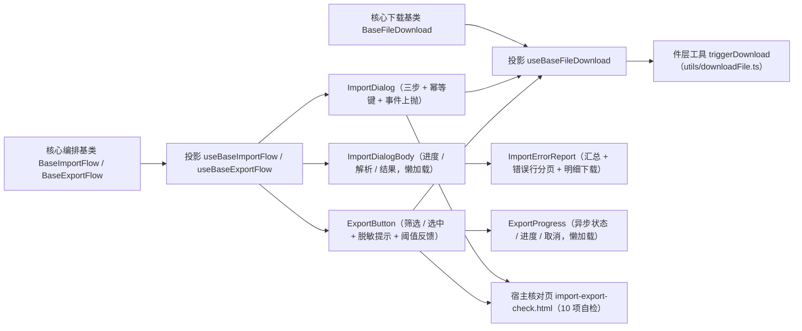

# 01 详细设计 · 导入导出组件与宿主核对页

> 前端组件库 · 08 交互类 · 05 导入导出 · 嵌套子任务 02（需求 08-5）· 详细设计

[文档首页](../../../../../../../文档首页.md) › [08 交互类](../../../08_交互类.md) › [05 导入导出](../../08_交互类_05_导入导出.md) › 详细设计　|　[← 任务](../08_交互类_05_导入导出_02_导入导出组件与宿主核对页.md)

## 1. 设计目标与范围 <a id="goal"></a>

交付[需求 08-5](../../../../../需求/08_需求_交互类.md#r08-5) 的**组件层与宿主核对页**：把 `08-5-1` 的编排内核（`BaseImportFlow` / `BaseExportFlow` / `BaseFileDownload` + 两套契约套件）接到 PC 具体件上，四件组件迁入 `components/import-export/` 专题目录并填充真实编排，新增错误报告件，落浏览器下载触发工具与宿主开发态核对页。

- **投影入插件层**：新增 `useBaseFileDownload` / `useBaseImportFlow` / `useBaseExportFlow` 三套薄适配（核心实例 ↔ Vue 响应式），判定逻辑全部在核心。
- **对外契约不变**：`ImportDialog` / `ExportButton` / `ImportDialogBody` / `ExportProgress` 的导出名、既有 Props、既有事件与 `data-test` 标记**保持 `08_01_02` 冻结形状**；本次只**向后兼容新增**可选 Props（`jobs` / `access` / `notice` / `download`）与事件（`imported` / `failed` / `exported` / `queued`）。
- **事件与注入双轨**：件层点击一律**保留既有事件上抛**（`submit` / `export` / `download-template` / `download-errors` / `retry` / `reset` / `done`）；**仅当宿主注入处理函数**时件内才驱动真实编排（避免宿主两种用法重复执行）。
- **错误报告独立成件**：新增 `ImportErrorReport.vue`（汇总计数 + 错误行分页表 + 下载错误明细），供导入对话框与后续国际化导入导出（`08_07`）复用。
- **下载触发归件层工具**：`utils/downloadFile.ts` 收口浏览器下载（URL / blob → `a[download]`），注入到 `BaseFileDownload.trigger`。
- **宿主核对页**：`apps/desktop/import-export-check.html` + `src/dev/*`（十项自检上屏，`vite build` 不含）。

### 1.1 口径与依从 <a id="positioning"></a>

- **架构铁律**：件层只做渲染与投影，编排与判定全部在 `08-5-1` 的能力基类与领域纯函数；每个组件以**值引入**核心基类或基类投影（`ui-ep/tests/guard-component-inheritance.spec.ts` 护栏）。
- **继承链**：`BaseComponent`（组件根）→ 能力基类（`BaseImportFlow` / `BaseExportFlow` / `BaseFileDownload`）→ 具体件；件内经**投影**（`useBaseXxx`）挂链。
- **占位语义**：件的 `ready` 缺省 `false` → 降级（`data-degraded="true"`）+ 禁用 + 零请求，与 `08_01_02` 冻结口径一致；就绪后由 `flow.degraded` / `flow.canExport` 驱动禁用与提示。
- **幂等键口径**：内容派生（`08-5-1` 领域函数）；选文件时生成、重试复用、换文件 / 重置重置。
- **前端不解析 Excel**：仅类型 / 大小 / 空文件快速校验；模板列核对与行级校验归后端。
- **端范围**：**仅 PC**（`frontend/packages/ui-ep`）；移动端实现遗留（契约套件已就位）。
- **工时**：本嵌套子任务 8h；因四件迁移 + 真实实现 + 新增错误报告件与核对页，实际上浮在实施记录登记。

## 2. 交付物清单 <a id="deliver"></a>

| # | 交付物 | 落点 |
| --- | --- | --- |
| 1 | 下载触发投影（新增） | `ui-ep/src/composables/useBaseFileDownload.ts` |
| 2 | 导入流投影（新增） | `ui-ep/src/composables/useBaseImportFlow.ts` |
| 3 | 导出流投影（新增） | `ui-ep/src/composables/useBaseExportFlow.ts` |
| 4 | 浏览器下载触发工具（新增） | `ui-ep/src/utils/downloadFile.ts` |
| 5 | 导入对话框（迁移 + 真实实现） | `ui-ep/src/components/import-export/ImportDialog.vue` |
| 6 | 导入主体（迁移 + 真实实现，独立分包） | `ui-ep/src/components/import-export/ImportDialogBody.vue` |
| 7 | 错误报告件（新增） | `ui-ep/src/components/import-export/ImportErrorReport.vue` |
| 8 | 导出触发（迁移 + 真实实现） | `ui-ep/src/components/import-export/ExportButton.vue` |
| 9 | 导出进度（迁移 + 真实实现，独立分包） | `ui-ep/src/components/import-export/ExportProgress.vue` |
| 10 | 导出面登记（含旧路径移除） | `ui-ep/src/index.ts` |
| 11 | 用例 | `ui-ep/tests/interaction-import-export.spec.ts` |
| 12 | 宿主核对页（`vite build` 不含） | `apps/desktop/import-export-check.html`、`apps/desktop/src/dev/{importExportCheck.ts,ImportExportCheck.vue}` |
| 13 | 登记回写 | 见第 6 节 |



## 3. 接口 / 契约与边界 <a id="contract"></a>

### 3.1 投影三套（`ui-ep/src/composables/`） <a id="bindings"></a>

```ts
// useBaseFileDownload：下载触发投影
export interface UseBaseFileDownloadOptions {
  trigger?: DownloadTrigger
  fetcher?: DownloadFetcher
  presigned?: BasePresignedUrl
}
export interface UseBaseFileDownloadResult {
  download: BaseFileDownload
  phase: Ref<DownloadPhase>
  url: Ref<string>
  filename: Ref<string>
  errorMessage: Ref<string>
  ready: Ref<boolean>
  busy: Ref<boolean>
  setTrigger(trigger?: DownloadTrigger): void
  setFetcher(fetcher?: DownloadFetcher): void
  run(input?: DownloadRequest): Promise<DownloadResult | undefined>
  retry(): Promise<DownloadResult | undefined>
  reset(): void
}

// useBaseImportFlow：导入流投影
export interface UseBaseImportFlowOptions {
  ready?: boolean
  biz?: string
  bizName?: string
  accept?: string
  maxSize?: number
  templateParams?: Record<string, unknown>
  successAutoClose?: boolean
  jobs?: ImportJobs
  engine?: BaseUploadEngine<unknown>
  download?: BaseFileDownload
  access?: BaseAccess
  notice?: BaseNotice
}
export interface UseBaseImportFlowResult {
  flow: BaseImportFlow
  ready: Ref<boolean>
  degraded: Ref<boolean>
  busy: Ref<boolean>
  phase: Ref<ImportPhase>
  step: Ref<ImportStep>
  progress: Ref<number>
  idempotencyKey: Ref<string>
  fileError: Ref<string>
  errorMessage: Ref<string>
  result: Ref<ImportResult | undefined>
  errorRows: Ref<ImportErrorRow[]>
  errorPage: Ref<number>
  errorPageCount: Ref<number>
  errorTruncated: Ref<boolean>
  summary: Ref<ImportSummaryState>
  canImport: Ref<boolean>
  setReady(value: boolean): void
  setBiz(biz: string, bizName?: string): void
  setJobs(jobs: ImportJobs): void
  selectFile(file: unknown, meta: ImportFileMeta): boolean
  clearFile(): void
  setErrorPage(page: number): void
  submit(): Promise<ImportResult | undefined>
  cancel(): void
  retry(): Promise<ImportResult | undefined>
  reset(): void
  downloadTemplate(): Promise<DownloadResult | undefined>
  downloadErrors(): Promise<DownloadResult | undefined>
}

// useBaseExportFlow：导出流投影
export interface UseBaseExportFlowOptions {
  ready?: boolean
  biz?: string
  bizName?: string
  params?: Record<string, unknown>
  selectedIds?: readonly (string | number)[]
  scope?: ExportScope
  asyncThreshold?: number
  total?: number
  plain?: boolean
  filenamePrefix?: string
  disabled?: boolean
  jobs?: ExportJobs
  task?: BaseAsyncTask<ExportResult>
  download?: BaseFileDownload
  access?: BaseAccess
  notice?: BaseNotice
}
export interface UseBaseExportFlowResult {
  flow: BaseExportFlow
  ready: Ref<boolean>
  degraded: Ref<boolean>
  busy: Ref<boolean>
  phase: Ref<ExportPhase>
  progress: Ref<TaskProgress>
  canExport: Ref<boolean>
  asyncMode: Ref<boolean>
  empty: Ref<boolean>
  exportReady: Ref<boolean>
  plainAllowed: Ref<boolean>
  lastResult: Ref<ExportResult | undefined>
  plan: Ref<ExportRequest>
  setReady(value: boolean): void
  setBiz(biz: string, bizName?: string): void
  setParams(params?: Record<string, unknown>): void
  setScope(scope: ExportScope, selectedIds?: readonly (string | number)[]): void
  setSelected(ids?: readonly (string | number)[]): void
  setTotal(total: number): void
  setPlain(plain: boolean): void
  setThreshold(threshold: number): void
  setDisabled(disabled: boolean): void
  setJobs(jobs: ExportJobs): void
  run(): Promise<ExportResult | undefined>
  cancel(): void
  retry(): Promise<ExportResult | undefined>
  reset(): void
}
```

- 三投影均为**薄适配**（核心实例 ↔ Vue 响应式），不含判定逻辑；基类实例经 `markRaw(toRaw(...))` 隔离跨实例代理（沿用既有投影口径），`onScopeDispose` 解除生命周期订阅。回写《[前端基类清单](../../../../../../../前端基类清单.md)》§9。

### 3.2 浏览器下载触发工具 <a id="download-tool"></a>

```ts
/** 触发浏览器下载（blob 优先，其次 URL）。 */
export function triggerDownload(input: { url?: string; blob?: unknown; filename: string }): void
```

| 行为 | 口径 |
| --- | --- |
| blob 通路 | `URL.createObjectURL(blob)` → `a[download]` 点击 → `revokeObjectURL`（同 tick 释放） |
| URL 通路 | `a.href = url` + `a.download = filename` 点击（同源或 CORS 允许时浏览器直接下载） |
| 文件名 | 一律取 `filename`（缺省空串 → 浏览器按 URL 兜底） |
| 不臆造 | 无 `blob` 且无 `url` 时直接返回（不触发） |

- 件层把 `triggerDownload` 注入 `BaseFileDownload.trigger`（`useBaseFileDownload({ trigger: ... })`）；宿主如需自定义（如带鉴权头的流式下载）可覆盖注入。
- 与 `utils/printWindow.ts` 同口径：**浏览器 API 单一落点**，核心与投影不触 DOM。

### 3.3 `ImportDialog` 导入对话框契约 <a id="import-dialog"></a>

| 面 | 内容 |
| --- | --- |
| 数据面（既有） | `ready`（缺省 `false`）/ `visible` / `biz` / `bizName` / `accept`（缺省 `.xlsx`）/ `maxSize`（缺省 20MB）/ `templateParams` / `successAutoClose` / `degradeText` |
| 数据面（新增可选） | `jobs`（`ImportJobs`：`execute` / `downloadTemplate` / `downloadErrors`）/ `access`（`BaseAccess`）/ `notice`（`BaseNotice`）/ `errorPageSize`（错误行每页行数，缺省 20） |
| 事件（既有，必守） | `update:visible` / `download-template`（`templateParams`）/ `submit`（`{ file, idempotencyKey }`）/ `retry` / `download-errors` / `done` / `reset` |
| 事件（新增） | `imported`（`ImportResult`）/ `failed`（`{ message }`） |
| 插槽（既有） | `degrade` / `empty` / `live` / `footer`；新增 `error-report`（替换错误报告件） |
| 数据标记（必守） | `data-ready` / `data-degraded` / `data-test="placeholder"` / `data-test="header"` / `data-test="template"` / `data-test="file-input"` / `data-test="file-name"` / `data-test="file-error"` / `data-test="submit"` / `data-test="retry"` / `data-test="download-errors"` / `data-test="reset"` / `data-test="close"` |

| 行为 | 口径 |
| --- | --- |
| 占位 | `ready` 为假 → `degraded` 为真、仅渲染降级插槽 / 默认降级文案，**不渲染文件输入**（既有断言） |
| 文件选择 | `File` → 映射 `ImportFileMeta { name, size, lastModified }` 交 `flow.selectFile`；不合法 → 内联 `file-error` 且提交禁用（不请求） |
| 提交 | 点击「提交」：**先 emit `submit`**（既有载荷）→ 若 `jobs.execute` 注入则 `await flow.submit()` 并上抛 `imported` / `failed`；未注入则仅事件上抛（占位文案由核心写入） |
| 进度与解析 | `ImportDialogBody` 渲染 `phase`（`uploading` / `parsing`）与 `progress`；解析阶段文案「解析校验中…」 |
| 结果步 | `ImportDialogBody` 渲染汇总与错误行报告；`successAutoClose` 为真且全部成功 → emit `update:visible(false)` 与 `done` |
| 模板下载 | 点击「下载模板」：emit `download-template` → 若下载通路就绪则 `flow.downloadTemplate()`（经下载基类 + `triggerDownload`） |
| 错误明细 | 点击「下载错误明细」：emit `download-errors` → 同上（核心按幂等键与时间戳生成文件名） |
| 重新导入 / 重试 | 「重新导入」→ emit `reset` + `flow.reset()`；「重试」→ emit `retry` + `flow.retry()`（复用同一幂等键） |
| 关闭 | 上传 / 解析中禁止关闭（`flow.busy` 时禁用关闭与 Esc）；结果步可关闭并 emit `update:visible(false)` |

### 3.4 `ImportDialogBody` 导入主体契约 <a id="import-body"></a>

| 面 | 内容 |
| --- | --- |
| 数据面 | `step`（`select` / `uploading` / `result`）/ `phase` / `progress` / `result`（`ImportResult`）/ `errorMessage` / `errorPage` / `errorPageSize` / `bizName` / `busy` / `downloading` |
| 事件 | `update:error-page` / `download-errors` |
| 插槽 | `#empty`（无错误行）/ `#error-report`（替换错误报告件） |
| 数据标记（必守） | `data-test="import-body"` + `data-subpackage="import"` + `data-step` + `data-state` + `data-phase` |
| 行为 | 三步内容：选文件提示 → 上传进度（`<progress>` + 「解析校验中…」）→ 结果（汇总 + **内置错误报告件**，可经 `#error-report` 插槽整体替换）；懒加载件（`defineAsyncComponent`）由宿主 `ImportDialog` 提供 |

### 3.5 `ImportErrorReport` 错误报告件契约 <a id="error-report"></a>

| 面 | 内容 |
| --- | --- |
| 数据面 | `result`（`ImportResult`）/ `page`（缺省 1）/ `pageSize`（缺省 20）/ `bizName` / `downloading`（下载中） |
| 事件 | `update:page` / `download` |
| 插槽 | `#empty`（全部成功的空态）/ `#footer` |
| 数据标记 | `data-test="error-report"` / `data-test="error-summary"` / `data-test="error-total"` / `data-test="error-page"` / `data-test="error-truncated"` / `data-test="error-download"` / `data-test="error-empty"` |
| 行为 | 汇总（总行数 / 成功 / 失败，数值强调；全部成功 → 成功态、部分失败 → 警告态）；错误行明细表（行号 / 列 / 原因，分页由领域函数派生，页码夹取）；超展示上限提示「仅展示前 N 行，请下载完整明细」；「下载错误明细」emit `download`（下载中禁用）；无错误行时渲染 `#empty` 与「全部导入成功」 |
| 复用 | 供 `08_07` 国际化文案导入导出复用（件层只依赖 `ImportResult` 结构，不绑定导入流） |

### 3.6 `ExportButton` 导出触发契约 <a id="export-button"></a>

| 面 | 内容 |
| --- | --- |
| 数据面（既有） | `ready`（缺省 `false`）/ `biz` / `bizName` / `params` / `selectedIds` / `scope`（缺省 `filtered`）/ `filenamePrefix` / `asyncThreshold`（0 = 前端不判断）/ `total` / `plain` / `disabled` / `degradeText` |
| 数据面（新增可选） | `jobs`（`ExportJobs`：`export` / `poll`）/ `access`（`BaseAccess`）/ `notice`（`BaseNotice`）/ `task`（`BaseAsyncTask<ExportResult>`）/ `download`（`BaseFileDownload`） |
| 事件（既有，必守） | `export`（`{ biz, scope, params, selectedIds, plain }`）/ `retry` |
| 事件（新增） | `exported`（`ExportResult`）/ `queued`（已转后台）/ `failed`（`{ message }`）/ `progress`（`TaskProgress`） |
| 插槽（既有） | `degrade` / `default` / `live`；新增 `progress`（替换进度件） |
| 数据标记（必守） | `data-ready` / `data-degraded` / `data-test="placeholder"` / `data-test="export"` / `data-test="total-hint"` / `data-test="plain-hint"` / `data-test="async-hint"` / `data-test="export-progress"`（`data-subpackage="export"`） |

| 行为 | 口径 |
| --- | --- |
| 占位 | `ready` 为假 → 导出按钮禁用 + 默认降级文案（既有断言） |
| 禁用口径 | 入口按「占位 / 外部禁用 / 无权 / 选中导出未选 / 进行中」禁用；**无数据不预先禁用**（`total` 缺省 0 无法区分「宿主未传」与「真无数据」，且须保持 `08_01_02` 冻结的「就绪态点击必上抛 `export`」断言）——点击后由核心 `resolveExportDecision` 写「当前筛选无数据可导出」提示且**零请求**；既有断言「选中导出未选 → 禁用」保持 |
| 触发 | 点击：**先 emit `export`**（既有载荷形状）→ 若 `jobs.export` 注入则 `await flow.run()` 并上抛 `exported` / `failed`（超阈值经任务通路时另发 `queued` 与 `progress`） |
| 提示 | 「导出 N 条」（`total`）+ 未持 `data:plain` 时「敏感字段将脱敏导出」（申请明文但无权限时提示收窄为「未持明文权限，敏感字段将脱敏导出」）；超阈值另提示「将转后台导出」（无数据时该位提示「当前筛选无数据可导出」） |
| 进度与取消 | `ExportProgress` 渲染异步阶段（`queued`）、进度与取消 / 重试按钮（`flow.cancel()` / `flow.retry()` 上抛） |
| 结果 | 成功 → 经下载基类 + `triggerDownload` 触发下载；转后台 → 提示「已转后台，完成后在通知中心查看下载」 |

### 3.7 `ExportProgress` 导出进度契约 <a id="export-progress"></a>

| 面 | 内容 |
| --- | --- |
| 数据面 | `status`（`TaskStatus`）/ `progress`（`TaskProgress`）/ `phase`（`ExportPhase`）/ `cancellable`（缺省 `true`） |
| 事件 | `cancel` / `retry` |
| 数据标记（必守） | `data-test="export-progress"` + `data-subpackage="export"` + `data-status` + `data-state` |
| 行为 | 状态文案（`idle` 不渲染 / `running` 进度 / `done` 完成 / `error` 失败 + 重试 / `canceled` 已取消）；进度取 `value/total`（缺总量显示单项）；`cancellable` 为真且进行中显示「取消」 |

### 3.8 分包与命名 <a id="chunk"></a>

- 保留两个独立分包入口（`08_01` 冻结）：`ImportDialogBody`（`data-subpackage="import"`）与 `ExportProgress`（`data-subpackage="export"`），均用 `defineAsyncComponent(() => import(...))`，不在宿主静态 `import` 中。
- **两个懒加载件不作为根出口静态导出**（`ui-ep/src/index.ts`）：否则将被静态引入而使动态导入无法分包（构建告警 `INEFFECTIVE_DYNAMIC_IMPORT`、分包退化）；需要单独复用时按件路径直接引用。
- 四件迁入 `ui-ep/src/components/import-export/`（专题自成一族，同 `components/print/`）；旧路径 `components/interaction/{ImportDialog,ImportDialogBody,ExportButton,ExportProgress}.vue` 删除。
- `ui-ep/src/index.ts` 的导出名与类型名不变（`ImportDialog` / `ExportButton` / `ImportResult` / `ImportStep` / `ExportPayload` / `ExportScope`），仅改来源路径；`ExportScope` 统一由 `@bms/core` 提供（组件层 `re-export` 保持对外名不变）。

## 4. 失败分支与边界 <a id="edge"></a>

| 边界 / 失败场景 | 处置 |
| --- | --- |
| `ready` 为假（占位） | 降级渲染 + 操作禁用 + 零请求（既有冻结断言） |
| 未注入 `jobs` | 仅事件上抛（宿主自理），不产生请求；核心占位文案按需展示 |
| 文件类型 / 大小 / 空文件不合法 | 内联错误提示 + 提交禁用，不请求 |
| 执行失败（文件级 / 网络） | 阶段失败 + 件层错误提示；`retry` 按钮复用同一幂等键 |
| 上传 / 解析中关闭 | 禁用关闭按钮与 Esc，避免半程中断 |
| 全部成功且 `successAutoClose` | 结果步展示后自动关闭并 emit `done` |
| 部分失败 | 汇总按警告态 + 错误行报告；提示按行号修正后重新导入 |
| 错误行超展示上限 | 报告件提示「仅展示前 N 行」并引导下载完整明细 |
| 下载触发未注入 | `triggerDownload` 作为件层默认注入；宿主可覆盖 |
| 选中导出未选行 | 按钮禁用（既有断言保留） |
| 无数据导出 | 提示「当前筛选无数据可导出」，不起下载 |
| 无 `export:download` / `import:execute` | 动作入口不渲染（件层按权限上下文判定）；后端兜底 |
| 未持 `data:plain` 申请明文 | 按脱敏导出并在按钮旁提示 |
| 超阈值异步导出 | 提示已转后台 + 进度件展示进度与取消（轮询缺失时回落单次调用） |
| 导出失败 / 限流 | 失败文案 + 重试按钮（同参数重放） |
| 分包懒加载失败 | 由宿主 `ImportDialog` / `ExportButton` 兜底展示占位提示（不白屏） |

## 5. 测试设计与验收映射 <a id="test"></a>

| 验收点（需求 08-5 / 子任务 08-5-2） | 用例 |
| --- | --- |
| 三投影薄适配（就绪 / 进度 / 结果 / 取消 / 复位） | `ui-ep/tests/interaction-import-export.spec.ts` |
| `ImportDialog` 就绪态三步渲染、文件校验、提交事件与幂等键、内部编排 | 同上 +（**复用**）`ui-ep/tests/interaction-placeholder-2.spec.ts` 既有冻结断言 |
| 导入结果与错误行报告、分页、下载错误明细上抛 | 同上（`ImportErrorReport` 直接挂载断言） |
| 上传 / 解析中禁止关闭 | 同上 |
| `ExportButton` 就绪态载荷透传、禁用口径、内部编排与结果上抛 | 同上 +（**复用**）`interaction-placeholder-2.spec.ts` 既有冻结断言 |
| 脱敏提示、超阈值后台提示与进度件取消 | 同上 |
| `ExportProgress` 状态矩阵（idle / running / done / error / canceled） | 同上 |
| 下载触发工具（blob / URL 通路、无目标不触发） | 同上（jsdom 以 `URL.createObjectURL` 桩断言） |
| 分包边界（两个懒加载件解析） | 同上（`vi.dynamicImportSettled()`） |
| 组件挂链护栏（值引入基类投影） | `ui-ep/tests/guard-component-inheritance.spec.ts`（自动覆盖新件） |
| 宿主机对页十项自检 | chromium headless `--dump-dom`（10 / 10） |
| `vue-tsc`、ESLint、Vitest 全通过 | 根 `pnpm run check` + 宿主 `vue-tsc -b` / `lint` / `test:cov` / `build` / `budget` |

- Kiwi 用例 1 条（一任务一条，编号于测试步登记后回填，预计 **770**；分类「平台骨架」、优先级 P2、状态 CONFIRMED、标签「自动化」）。

## 6. 登记落点 <a id="register"></a>

| 内容 | 落点 |
| --- | --- |
| 投影落点（`useBaseFileDownload` / `useBaseImportFlow` / `useBaseExportFlow`） | 《[前端基类清单](../../../../../../../前端基类清单.md)》§9「PC 插件」（`ui-ep/src/composables/` 投影清单） |
| 组件落点（`components/import-export/` 四件 + 错误报告件） | 同上 §9「PC 插件」（按族分目录） |
| 件层工具（`utils/downloadFile.ts`） | 同上 §9（与 `utils/printWindow.ts` 同口径：浏览器 API 单点收口） |
| 设计口径回写 | 《组件设计》[01 导入导出](../../../../../../../设计/组件设计/08_交互类/01_组件设计_导入导出/01_组件设计_导入导出.md)：继承链行改现行口径（组件根 → 能力基类 → 具体件）、3.3 节「上传封装」改为「经上传引擎能力基类（组合）」、3.4 节幂等键改「内容派生」、3.4 节下载明细补「经下载触发能力基类」 |
| 任务 / 父任务 / 域任务 / 计划状态 | [任务](../08_交互类_05_导入导出_02_导入导出组件与宿主核对页.md)、[父任务](../../08_交互类_05_导入导出.md)、[域任务](../../../08_交互类.md)、[计划](../../../../../../../项目/04_前端组件库/计划/01_计划_前端组件库.md)（`08_05` 完成后由 §3 移入 §2，§4 甘特同步） |
| 需求文档 | 不承载进度（状态只在任务与计划两处一致）；遗留归口写在实施 / 测试记录与计划 |

## 7. 边界与开放项 <a id="open"></a>

- **不在本期**：真实接口联调（阶段八）；导出列定义与字段授权（后端）；错误明细文件生成与保留期（后端 + 《概要设计 · 文件管理》）；宿主真实列表页接入（列表页归 `07_05`）；移动端实现。
- **协同契约**：宿主注入 `jobs` / `access` / `notice` / `task` / `download`；件层默认注入 `triggerDownload`；未注入即事件上抛 + 核心占位。
- **分包预算**：两个懒加载件为轻量渲染层（无第三方依赖），不新增内核分包；宿主主包体积变化在 `pnpm run budget` 中核对。
- **事件与注入双轨的风险**：宿主同时监听事件并注入 `jobs` 会导致重复执行（文档写明「二选一」）；件层不额外去重（保持对外形状不变）。
- **上游回写**：三处上游文档回写随父任务收口提交（`08-5-1` 已登记归口）。
- Kiwi 用例编号于测试步登记后回填实施 / 测试记录与用例文件（预计 770）。

## 8. 决策记录 <a id="decision"></a>

| # | 决策项 | 结论 |
| --- | --- | --- |
| 1 | 组件落点 | 四件迁入 `ui-ep/src/components/import-export/`（专题自成一族）；对外导出名与契约不变 |
| 2 | 组件状态源 | 组件以 `useBaseXxx` 投影为唯一状态源（不再并行维护 `useInteractionPlaceholder` 状态），`ready` prop 经 `setReady` 同步；投影补 `fileMeta` / `hasFile` 两个响应式面（核心 `file` 为普通字段、非响应式，件层须以投影面驱动「已选文件」判定） |
| 3 | 事件与注入 | 点击**保留既有事件上抛**；**仅当注入 `jobs` 时**件内驱动真实编排（避免双重执行） |
| 4 | 错误报告件 | 新增对外件 `ImportErrorReport.vue`（汇总 + 分页表 + 明细下载），供 `08_07` 复用 |
| 5 | 下载触发 | 件层工具 `utils/downloadFile.ts` 默认注入 `BaseFileDownload.trigger`；宿主可覆盖 |
| 6 | 分包边界 | 保留 `ImportDialogBody` / `ExportProgress` 两个懒加载入口（`data-subpackage` 断言不变） |
| 7 | 类型来源 | `ExportScope` / `ImportResult` / `ImportStep` 等由 `@bms/core` 提供，件层 `re-export` 保持对外名 |
| 8 | 关键 `data-test` | 全部既有标记保留（占位 / 三步 / 事件触发点），新增标记仅追加不重命名（`async-hint` / `error-report` 系列 / `export-cancel` / `export-retry`） |
| 9 | 核对页自检 | **十二项**（三步骨架与文件信息 / 幂等键派生 / 类型校验不请求 / 失败与重试 / 结果与错误行报告 / 错误行分页与翻页 / 错误明细下载 / 导出失败与重试 / 重试成功与结果下载 / 超阈值转后台异步 / 权限过滤）；核对页**覆盖件层触发手段为记录型**（仅记录下载请求，不发起真实导航，符合「宿主可覆盖注入」口径） |
| 10 | 用例复用 | 既有 `interaction-placeholder-2.spec.ts` 冻结断言**不改动**，新增 `interaction-import-export.spec.ts` 覆盖真实编排 |

## 9. 参考文档 <a id="ref"></a>

- [需求 08-5](../../../../../需求/08_需求_交互类.md#r08-5)、[任务 08-5-2](../08_交互类_05_导入导出_02_导入导出组件与宿主核对页.md)、[父任务 05 导入导出](../../08_交互类_05_导入导出.md)
- [08-5-1 导入导出编排基类与领域](../../08_交互类_05_导入导出_01_导入导出编排基类与领域/08_交互类_05_导入导出_01_导入导出编排基类与领域.md)（**前置契约已交付**：三条能力基类、领域纯函数与两套契约套件）
- 《组件设计》[01 导入导出](../../../../../../../设计/组件设计/08_交互类/01_组件设计_导入导出/01_组件设计_导入导出.md)（含[可交互原型](../../../../../../../设计/组件设计/08_交互类/01_组件设计_导入导出/01_原型设计_导入导出.html)，原型即验收基准）
- [08_01_02 数据进出与表单占位](../../../08_交互类_01_占位版交付/08_交互类_01_占位版交付_02_数据进出与表单占位/08_交互类_01_占位版交付_02_数据进出与表单占位.md)（冻结对外契约与分包入口）
- [08_03_03 打印与导出 PDF](../../../08_交互类_03_面板与工具/08_交互类_03_面板与工具_03_打印与导出PDF/08_交互类_03_面板与工具_03_打印与导出PDF.md)（宿主核对页与浏览器 API 收口做法）
- [《前端基类清单》](../../../../../../../前端基类清单.md)、《[前端开发规范](../../../../../../../规范/前端开发规范.md)》、《[文档生成规范](../../../../../../../规范/文档生成规范.md)》

> 本文档依《[文档生成规范](../../../../../../../规范/文档生成规范.md)》编写
