# 01 实施 · 表单设计器

> 前端组件库 · 08 交互类 · 06 表单设计器与表单渲染器 · 嵌套子任务 01（需求 08-6）· 实施记录

[文档首页](../../../../../../../文档首页.md) › [08 交互类](../../../08_交互类.md) › [06 表单设计器与表单渲染器](../../08_交互类_06_表单设计器与表单渲染器.md) › 实施记录　|　[← 详细设计](../设计/01_详细设计_01_表单设计器.md)　[测试记录 →](../测试/01_测试_01_表单设计器.md)

## 1. 实施信息 

| 项 | 值 |
| --- | --- |
| 任务 | 08-6-1 表单设计器（[任务](../08_交互类_06_表单设计器与表单渲染器_01_表单设计器.md)） |
| 对应需求 | [08-6](../../../../../需求/08_需求_交互类.md#r08-6) |
| 详细设计 | [01_详细设计_01_表单设计器.md](../设计/01_详细设计_01_表单设计器.md)（定稿提交 `b937bb37`） |
| 实施日期 | 2026-09-19 |
| 实施人 | minjian |
| 实施环境 | Ubuntu 开发机 · Node（workspace `@bms/core` + `@bms/ui-ep` + `apps/desktop`）· Vitest 5 / jsdom · Vue 3.5 / TypeScript 严格模式 |
| Kiwi 用例 | 771（分类「平台骨架」/ P2 / CONFIRMED / 标签「自动化」） |
| 提交 | `3cc9b54b`（核心代码）等 |
| 结论 | 完成标准达标（三区拖拽、属性配置与保存发布可用；元数据契约与渲染器一致；拖拽落点用例覆盖；四件组件与核对页 12/12） |

```mermaid
flowchart LR
    A["Kiwi 用例登记（771）"] --> B["核心领域 domain/form-layout（布局模型 / 层级 / 结构操作 / 列名 / 校验 / 脏比对）"]
    B --> C["能力基类 BaseFormDesigner（编排 / 占位 / 只读 / 拖拽落点 / 保存发布恢复 / 自建字段）"]
    C --> D["契约套件两套（元数据契约 / 设计器编排）"]
    D --> E["《前端基类清单》登记 + 能力依赖表新增键"]
    E --> F["投影 useBaseFormDesigner + 拖拽适配工具 dragSortable"]
    F --> G["四件迁入 form-design 专题目录并真实实现（新增属性面板与自建字段对话框）"]
    G --> H["导出面登记（旧路径移除 + 分包口径）"]
    H --> I["用例（核心 63 条 + ui-ep 17 条）"]
    I --> J["宿主核对页（12 项自检，chromium --dump-dom 12/12）"]
    J --> K["门禁验证（根 check + 宿主 vue-tsc / lint / test:cov / build / budget + 基座校验）"]
    K --> L["登记回写（基类清单 / 组件设计 05 / 上游三处 / 计划 / 任务状态）"]
```

## 2. 实施概览 

结果小结：新增 1 份领域纯函数（31 个导出函数）、1 个能力基类、2 套契约套件、1 套投影、1 个拖拽适配工具与 2 个新件（属性面板 / 自建字段对话框）；设计器与画布迁入 `components/form-design/` 并填充真实编排；`core` 46 文件 / 425 用例、`ui-ep` 40 文件 / 419 用例全绿（本次新增 63 + 17 条）。

## 3. 实施过程 

1. **Kiwi 先行**：经容器内 Django shell 登记用例，取得编号 **771**（平台既有编号至 770）；三个用例文件首行标注 `// kiwi_id: 771`。
2. **依赖引入**：`ui-ep` 新增 `vuedraggable@4.1.0`（基于 `sortablejs@1.15.7`），经 npmmirror 源安装；**不进核心**（核心保持框架与第三方无关）。
3. **核心领域**（`core/src/domain/form-layout.ts`）：
   - 类型面：`FormLayout` / `LayoutSection` / `LayoutGroup` / `LayoutFieldRef` / `LayoutQuery` / `LayoutDetail` / `LayoutDictAdvanced` / `FormField` / `FormLayoutLevels` / `LayoutEffective` / `LayoutRestoreTarget` / `LayoutValidationResult` / `ExtFieldDraft` 等；
   - **装载输入与运行态分离**：另建 `FormLayoutInput` / `LayoutSectionInput` / `LayoutGroupInput` / `LayoutFieldRefInput` / `LayoutDetailColumnInput`（兼容后端 JSON 的裸字符串引用与 `colspan` 写法），`normalizeLayout` 归一后运行态一律确定值；
   - 纯函数：归一 / 空布局与默认栅格回退 / 层级只读与恢复目标 / 按层级解析 / 生效布局与渲染输入同形 / 结构操作（插入幂等、移出后插入、跨列、分区增删改、标签、查询区与明细列）/ 字段键收集与计数 / 失效与停用与重复引用 / 校验 / 脏比对 / 列名派生与自建字段校验 / 可拖入判定。
4. **能力基类**（`core/src/capabilities/form-designer.ts`）：键 `form-designer`，依赖 `drag-drop` / `form-meta` / `access` / `notice`；占位零请求、只读不动作不写脏、取数经表单元数据与注入处理器两段、拖拽落点经领域函数 + 广播 `drop`、脏基线与拦截、保存发布恢复默认（逐级回退）、自建字段前置校验与 DDL 重试、进行中防重复。
5. **契约套件**（`core/testing/form-layout.ts`）：`describeFormLayoutContract`（11 条，含「渲染输入与设计产出同形」）与 `describeFormDesignerContract`（13 条）；核心用例 `domain-form-layout.spec.ts`（28 条）与 `form-designer.spec.ts`（35 条，含契约套件驱动）。
6. **登记**：`CAPABILITY_MANIFEST` 新增 `form-designer` 键（依赖表单向）；核心导出面新增 1 个能力基类与 60 余个领域导出；《前端基类清单》§2.1 插入行（父基类 `BaseComponent`、「已交付」）+ §2 继承链总览 + §5.2 能力基类表 + §9「PC 插件」与「契约用例工厂」补登记（并顺延 §2.1 表内 `BaseInput` 之后编号）。
7. **投影与工具**（`ui-ep/src/composables/useBaseFormDesigner.ts`、`ui-ep/src/utils/dragSortable.ts`）：投影为薄适配（跨实例基类对象经 `markRaw(toRaw(x))` 隔离）；适配工具为纯函数（**同区下移索引减一**，对齐领域「移出 + 插入」口径；四阶段载荷映射），**浏览器 API 与第三方库只在此工具出现**。
8. **四件组件**（`ui-ep/src/components/form-design/`）：
   - `FormDesigner`：三区 + 工具栏 + 三级层级 + 保存 / 发布（先保存成功再发）/ 恢复默认 + 脏拦截上抛 `dirty-block` + 空态；**对外契约保持 `08_01_02` 冻结形状**，仅向后兼容新增可选 Props（`levels` / `jobs` / `access` / `notice` / `formMeta` / `drag` / `registeredTypes`）、事件（`dirty-block` / `loaded` / `saved` / `failed` / `field-created`）与插槽（`empty` / `canvas` / `confirm`）；
   - `FormDesignerCanvas`：三视图（主表 / 查询区 / 明细区）+ vuedraggable 分区容器（列数下拉、跨列、删分区）+ 空态；本地可写副本随布局同步，落点经适配后上抛；
   - `FieldPropertyPanel`（新增）：字段属性（必填 / 默认值 / 提示 / 校验 / 组件类型 / 选项集 / 只读 / 隐藏）与分区属性（标题 / 列数）、未选中时画布全局配置（标签位置 / 宽度）；
   - `ExtFieldDialog`（新增）：名称中英文 / 类型白名单 / 选项集（下拉类必填）/ **列名只读预览** / DDL 状态与重试；
   - 旧路径 `components/interaction/{FormDesigner,FormDesignerCanvas}.vue` 删除。
9. **导出面登记**：`ui-ep/src/index.ts` 改两件来源路径并新增两件 + 类型 + 投影 + 拖拽适配工具；**`FormDesignerCanvas` / `FieldPropertyPanel` / `ExtFieldDialog` 三者均不入根出口**（否则静态引入使动态导入无法分包，沿用 `08_05` 坑记录）。
10. **用例**：核心 63 条 + `ui-ep/tests/interaction-form-designer.spec.ts` 17 条（投影 + 适配工具 + 四件 + 分包边界）；既有 `interaction-placeholder-2.spec.ts`（19 条）**未改动即通过**。
11. **宿主核对页**：`apps/desktop/form-design-check.html` + `src/dev/{formDesignCheck.ts,FormDesignCheck.vue}`（12 项自检：三区渲染、不可拖入标记、拖入落点、重复拖入拒绝、新增分区、列数与跨列、属性面板联动、自建字段列名与选项集拦截、自建字段提交、校验拦截保存、保存与发布、恢复默认），`vite build` 不包含；chromium headless `--dump-dom` 核验 **12/12**。

## 4. 问题与处置 

| # | 问题 | 处置 |
| --- | --- | --- |
| 1 | 既有冻结用例要求点击字段后根元素 `data-dragging="true"`，真实实现改为只读投影只读 `dragState` 丢失该属性 | **先报冲突 → 按铁律（对外契约冻结优先）→ 回写设计**：件内保留 `useBaseDragDrop` 并在拖入起始时广播，宿主注入 `drag` 时一并广播；详细设计 §3.6.1 数据面行已补 `data-dragging` 口径 |
| 2 | 领域 `LabelPosition` 与既有 `BaseLabeled` 的 `LabelPosition`（含 `right`）同名冲突（核心导出面重复标识） | 领域侧改名 `LayoutLabelPosition`（本域专属），避免与标签能力基类口径混用 |
| 3 | 后端 JSON 的字段引用可写裸字符串、明细列可写字符串，而运行态类型要求对象，核心用例无法直接构造 | 按既有坑记录「**装载输入口径 ≠ 运行态口径**」处理：新增 `FormLayoutInput` / `LayoutSectionInput` / `LayoutFieldRefInput` / `LayoutDetailColumnInput` 等输入类型，`normalizeLayout` 归一为确定值；**契约套件与件层只用运行态类型** |
| 4 | 生效布局若以「工作副本」参与解析，切换层级时会误判为命中当前层级（回退链失效） | `effective` 改为按**已存层级**（`levels`）解析，工作副本仅供编辑；`setLayouts` 作为**装载入口**同步重取工作副本并重置基线 |
| 5 | 平台默认层级新增空分区后校验拦截保存，核对页自检 ⑩⑪ 失败 | 属**设计正确行为**（空分区不可保存）；核对页调整为「先验证校验拦截保存 → 删空分区 → 保存与发布 → 恢复默认」，复跑 12/12 |
| 6 | 核对页读不到设计器内部状态（件未暴露实例），另新建字段未并入字段调板 | 件补 `defineExpose({ designer, layout, dirty, readonly })`（开发态核对与宿主调试用）；新建字段成功后并入件内调板字段清单（`extraFields`） |
| 7 | 三件新件未实质挂继承链，`ui-ep/tests/guard-component-inheritance.spec.ts` 拦截 | 三件分别经 `useBaseDataState` 挂链（画布：分区空 → `empty`；属性面板：未选中 → `empty`；对话框：未打开 → `empty`），并补 `data-state` 标记 |
| 8 | `FormDesigner.vue` 中件层 `drag` 变量与 Props 同名，`vue/no-dupe-keys` 报错 | 件层实例改名 `dragState`，避免与 Props 的 `drag` 冲突 |
| 9 | 字段类型未注册判定需读字段 `status`，而对外 `DesignerField` 只声明 `disabled` | `DesignerField` **向后兼容新增可选字段** `status`（`FieldStatus`），未注册类型 / 停用 / 建列失败统一置灰不可拖入 |

## 5. 验证结果 

| 命令 | 结果 |
| --- | --- |
| `pnpm run check`（core + vue + ui-ep） | 46 + 2 + 40 文件 / 425 + 5 + 419 用例全绿（core 新增 63、ui-ep 新增 17） |
| 宿主 `pnpm exec vue-tsc -b` / `pnpm run lint` | 通过 |
| 宿主 `pnpm run test:cov` | 通过（全库语句覆盖 86.79%、行覆盖 87.61%、35 用例） |
| 宿主 `pnpm run build` / `pnpm run budget` | 通过（合计 121.9 KB / 预算 260 KB；最大单文件 103.0 KB / 预算 150 KB；**无设计器分包退化告警**） |
| 开发态核对页（chromium headless `--dump-dom`） | **12 / 12** 自检项通过 |
| 既有 `interaction-placeholder-2.spec.ts`（`08_01_02` 冻结契约） | 未改动即通过（占位降级、就绪态三区与载荷透传、平台层级只读断言保持） |
| `python3 scripts/tools/base-check/check-links.py` | 通过（断链 0、失效锚点 0） |
| `python3 scripts/tools/base-check/check-base.py` | 通过（跨层引用 / 措辞残留 / 清单一致 / 跨文档编号引用均为 0） |

对照完成标准：三区拖拽（字段调板 → 画布分区、分区内排序、跨分区、查询区 / 明细区排序）、属性配置（字段 / 分区 / 画布全局）与保存发布恢复可用；**元数据契约与渲染器一致**（`renderMetadata` 与设计产出同形，由契约套件断言）；Vitest 覆盖拖拽落点与发布分支；`vue-tsc` / ESLint / Vitest 全通过。

## 6. 偏差与遗留 

- **工时偏差**：名义 20h；因新增 1 个能力基类、1 份领域纯函数（31 个导出函数）、2 套契约套件、1 套投影、1 个拖拽适配工具、四件组件（含两件新增）与 12 项自检核对页，实际上浮，明细见第 4 节。
- **对外契约扩展**（向后兼容）：`FormDesigner` 新增可选 Props（`levels` / `jobs` / `access` / `notice` / `formMeta` / `drag` / `registeredTypes`）、事件（`dirty-block` / `loaded` / `saved` / `failed` / `field-created`）与插槽（`empty` / `canvas` / `confirm`）；`DesignerField` 新增可选 `status`；既有 Props / 事件 / 插槽 / `data-test` / 分包入口**不变**。
- **事件与注入双轨的风险**：宿主同时监听既有事件（`save` / `publish` / `reset` / `create-field` / `add-field`）并注入 `jobs` 会导致重复执行（**二选一**）；件层不额外去重（保持对外形状不变），沿用 `08_05` 口径。
- **拖拽内核**：`vuedraggable` + `sortablejs` 为本期唯一新增运行时依赖；jsdom 用例断言件层上抛的落点与排序载荷（Sortable 真实拖拽行为由浏览器核对页核验）。
- **真实接口联调**：布局取数 / 保存 / 发布事件 / 恢复默认 / 自建字段 DDL 与重试接口未就绪，处理函数由宿主注入，未注入即占位（不发请求、按钮禁用 + 提示）；真实联调随阶段八（通用能力 · 表单定制）。
- **分组二级组织**：布局模型与画布已承载 `groups`（数据面就位），**渲染侧口径已由 `08-6-2` 闭环**（`RenderSectionPlan` 产出 `groups` 与 `ungroupedFields`，主体按「先平铺后分组」渲染）；**分组编辑交互**仍归设计器后续演进（设计已登记开放项）。
- **字典高级查询**：布局模型已承载 `dictAdvanced`，完整配置交互随字典字段节点（`08_07` 后）对齐。
- **`08-6-2` 协同**：元数据契约与契约套件 `describeFormLayoutContract` 已**前置冻结**；`08-6-2` 只接渲染分发、三态与权限叠加、校验提交，不重定义契约（消费方任务文档已补「前置契约（已交付）」）。
- **`08_04` 遗留闭环**：字段权限与布局叠加的**布局侧语义与元数据面**在本任务落地（`resolveEffectiveLayout` 输出只读与合并字段清单、`validateLayout` 校验口）；字段级 `visible` / `editable` 叠加的**运行时渲染已由 `08-6-2` 闭环**（该任务扩展 `LayoutEffective.permissions` 并落地 `resolveFieldRenderState` 与渲染计划）。
- **移动端**：本期仅 PC；同一元数据契约与契约套件供移动端渲染侧复用。
- **Kiwi 用例台账**：用例 771 已在平台登记（test 仓《Kiwi 用例台账》按该台账维护节奏补记）。

> 本文档依《[文档生成规范](../../../../../../../规范/文档生成规范.md)》编写
