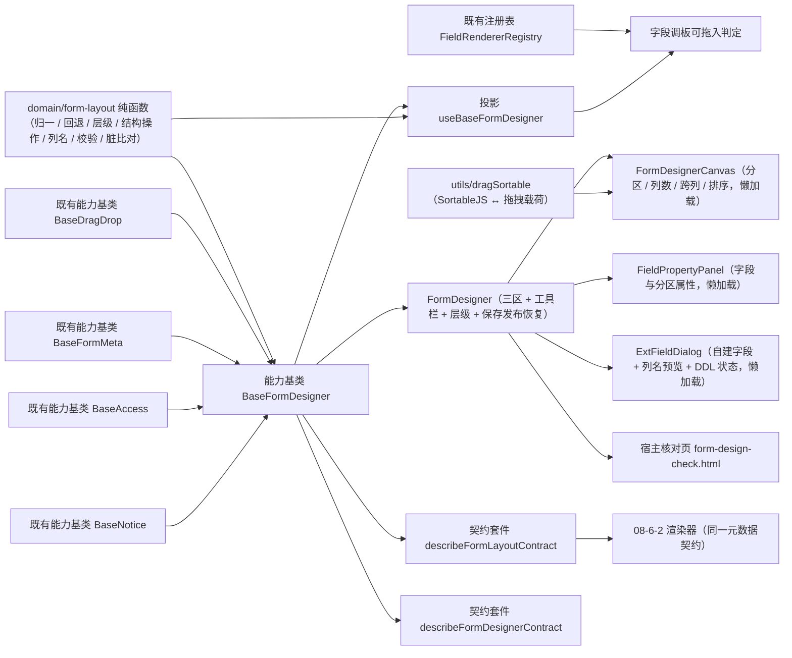

# 01 详细设计 · 表单设计器

> 前端组件库 · 08 交互类 · 06 表单设计器与表单渲染器 · 嵌套子任务 01（需求 08-6）· 详细设计

[文档首页](../../../../../../../文档首页.md) › [08 交互类](../../../08_交互类.md) › [06 表单设计器与表单渲染器](../../08_交互类_06_表单设计器与表单渲染器.md) › 详细设计　|　[← 任务](../08_交互类_06_表单设计器与表单渲染器_01_表单设计器.md)

## 1. 设计目标与范围 <a id="goal"></a>

交付[需求 08-6](../../../../../需求/08_需求_交互类.md#r08-6) 的**表单设计器**：三区拖拽（字段调板 → 画布分区 → 属性面板）、布局配置（分区列数与跨列、字段属性、查询区与明细区）、租户自建字段、三级层级与保存发布，并**前置冻结设计器与渲染器共享的元数据契约**。

- **共享元数据契约入核心**：新增 `domain/form-layout.ts`（布局模型、归一、空布局回退、层级解析与回退、字段引用与结构操作、列数与跨列夹取、自建字段列名派生与类型白名单、DDL 状态、失效/重复引用、校验、脏基线比对），全部为框架无关纯函数；`layout-effective`（渲染输入）与设计器产出**同一形状**，由契约套件断言「设计产出 → 渲染输入」一致，避免元数据漂移（《[计划 前端组件库](../../../../../计划/01_计划_前端组件库.md)》§6 已登记该风险）。
- **设计器编排入链**：新增能力基类 `BaseFormDesigner`（设计编排，组合拖拽能力与表单元数据能力）——一层一语义，结构操作 / 脏基线 / 保存发布恢复 / 自建字段各自独立分支。
- **拖拽经既有能力基类**：拖拽统一经 `BaseDragDrop`（`02_03` 已交付）广播与订阅；件层把 vuedraggable / SortableJS 的列表移动事件适配为拖拽载荷后交由编排基类落点，**不在件内另写判定**。
- **字段类型来源经统一注册表**：可拖入判定读核心 `FieldRendererRegistry.resolveByType`（基座 `BaseProviderRegistry`，`02_05` 已交付）；未注册类型置灰不可拖入——**不另起映射**。
- **数据通路注入式**：取数 / 保存 / 发布 / 恢复默认 / 新建自建字段 / DDL 重试处理函数由宿主注入；**未注入即占位**（不发请求、返回 `undefined`、按钮禁用 + 占位文案），与 `08_01_02` 冻结的占位语义一致，真实接口联调随阶段八。
- **契约套件两套**：`describeFormLayoutContract`（元数据契约，`08-6-2` 渲染器与移动端复用同一套断言）与 `describeFormDesignerContract`（设计器编排契约）。

### 1.1 口径与依从 <a id="positioning"></a>

- **架构铁律**：设计器编排、布局元数据解析均为**横切功能**，一律落为**继承链上的能力基类**（核心 `capabilities/`）与领域纯函数（核心 `domain/`），不在链外自由挂接；具体件只做渲染与投影。
- **继承链**：`BaseComponent`（组件根）→ 能力基类（`BaseFormDesigner`，**组合** `BaseDragDrop` / `BaseFormMeta`）→ 具体件（本子任务）。能力基类依赖单向登记于 `capabilities/manifest.ts`。
- **对外契约不变**：`FormDesigner` / `FormDesignerCanvas` 的导出名、既有 Props、既有事件、既有插槽与 `data-test` 标记、分包入口**保持 `08_01_02` 冻结形状**；本次只**向后兼容新增**可选 Props / 事件 / 插槽。布局模型新增 `groups` / `dictAdvanced` 亦为**新增可选字段**，既有冻结用例断言不改动即通过。
- **层级口径**：`平台默认`（租户管理员只读预览）/ `租户覆盖`（编辑生效于全租户）/ `角色视图`（选角色后编辑）；切换层级前脏数据拦截。
- **只读口径**：只读判定 = 层级（平台默认）∧ 无 `formdesign:manage`；只读时画布禁拖拽、属性面板禁用、保存/发布/恢复/新建字段按钮禁用。
- **脏数据口径**：打开 / 切换表单 / 切换层级时以**稳定序列化**（核心 `stableStringify`）记基线，比对得脏判定；切换表单 / 切换层级 / 离开页面在**件层上抛 `dirty-block`**，由宿主决定确认策略（件不引入全局弹窗）。
- **端范围**：**仅 PC**（`frontend/packages/ui-ep`）；移动端不提供设计器，复用同一元数据契约（契约套件已就位）。
- **工时**：本嵌套子任务 20h；因新增 1 个能力基类、1 份领域纯函数、2 套契约套件、1 套投影、四件组件（含两件新增）与宿主核对页，实际上浮在实施记录登记。

## 2. 交付物清单 <a id="deliver"></a>

| # | 交付物 | 落点 |
| --- | --- | --- |
| 1 | 布局元数据契约与结构操作纯函数（新增） | `core/src/domain/form-layout.ts` |
| 2 | 设计器编排能力基类（新增） | `core/src/capabilities/form-designer.ts` |
| 3 | 能力依赖登记（新增 `form-designer` 一键） | `core/src/capabilities/manifest.ts` |
| 4 | 核心导出面登记 | `core/src/index.ts` |
| 5 | 契约套件两套（元数据契约 / 设计器编排） | `core/testing/index.ts` |
| 6 | 核心用例（领域 + 能力基类） | `core/tests/domain-form-layout.spec.ts`、`core/tests/form-designer.spec.ts` |
| 7 | 设计器编排投影（新增） | `ui-ep/src/composables/useBaseFormDesigner.ts` |
| 8 | 表单设计器（迁移 + 真实实现） | `ui-ep/src/components/form-design/FormDesigner.vue` |
| 9 | 设计画布（迁移 + 真实实现，独立分包） | `ui-ep/src/components/form-design/FormDesignerCanvas.vue` |
| 10 | 字段属性面板（新增，独立分包） | `ui-ep/src/components/form-design/FieldPropertyPanel.vue` |
| 11 | 自建字段对话框（新增，独立分包） | `ui-ep/src/components/form-design/ExtFieldDialog.vue` |
| 12 | 拖拽适配工具（SortableJS ↔ 拖拽能力载荷） | `ui-ep/src/utils/dragSortable.ts` |
| 13 | 导出面登记（含旧路径移除与分包口径） | `ui-ep/src/index.ts` |
| 14 | 插件依赖（拖拽内核） | `ui-ep/package.json`（`vuedraggable` / `sortablejs`） |
| 15 | 用例（投影 + 四件 + 拖拽适配 + 分包） | `ui-ep/tests/interaction-form-designer.spec.ts` |
| 16 | 宿主核对页（`vite build` 不含） | `apps/desktop/form-design-check.html`、`apps/desktop/src/dev/{formDesignCheck.ts,FormDesignCheck.vue}` |
| 17 | 登记回写（基类清单 / 组件设计 05 / 上游三处 / 计划与状态） | 见第 6 节 |



## 3. 接口 / 契约与边界 <a id="contract"></a>

### 3.1 核心：`domain/form-layout.ts`（新增纯函数与数据模型） <a id="domain"></a>

```ts
/** 表单定制权限码。 */
export const FORMDESIGN_PERM = 'formdesign:manage'
/** 设计器占位文案（数据通路未就绪）。 */
export const DESIGNER_PLACEHOLDER_TEXT = '表单设计器未就绪（占位）'
/** 自建字段列名前缀（后端生成，前端仅预览）。 */
export const EXT_COLUMN_PREFIX = 'ext_'
/** 自建字段类型白名单（对齐《概要设计 · 表单定制》「组件类型与自建字段边界」节）。 */
export const EXT_FIELD_TYPES: readonly string[]
/** 分区列数白名单。 */
export const SECTION_COLUMNS: readonly [1, 2, 3]
/** 单分区字段数建议上限（超出提示分区，不阻断）。 */
export const SECTION_FIELD_HINT = 8
/** 空布局回退的缺省列数。 */
export const DEFAULT_LAYOUT_COLUMNS = 3
/** 标签宽度缺省值（`labelPosition === 'left'` 时生效）。 */
export const DEFAULT_LABEL_WIDTH = 100

/** 设计层级。 */
export type DesignerLevel = 'platform' | 'tenant' | 'role'
/** 标签位置。 */
export type LabelPosition = 'top' | 'left'
/** 字段来源分组。 */
export type FieldGroup = 'platform' | 'tenant'
/** 自建字段 DDL 状态。 */
export type ExtDdlStatus = 'pending' | 'active' | 'failed'
/** 画布选中对象。 */
export interface DesignerSelection { kind: 'field' | 'section'; key: string }
/** 分区列数。 */
export type SectionColumns = 1 | 2 | 3

/** 字段引用（分区内排序与跨列）。 */
export interface LayoutFieldRef { key: string; colSpan?: boolean }
/** 分区内分组（二级组织，可选）。 */
export interface LayoutGroup { key: string; title: string; fields: LayoutFieldRef[] }
/** 布局分区。 */
export interface LayoutSection {
  key: string
  title: string
  columns: SectionColumns
  groups?: LayoutGroup[]
  fields: LayoutFieldRef[]
}
/** 主表结构。 */
export interface LayoutMain { labelPosition: LabelPosition; labelWidth?: number; sections: LayoutSection[] }
/** 查询表单区（列表页筛选）。 */
export interface LayoutQuery { fields: string[] }
/** 明细区列（主从模块）。 */
export interface LayoutDetailColumn { key: string; width?: number }
export interface LayoutDetail { columns: LayoutDetailColumn[] }
/** 字典高级查询界面配置（可选，见《组件设计 · 字典字段》「高级查询」节）。 */
export interface LayoutDictAdvanced { fields?: string[]; operators?: string[]; scheme?: string; columns?: string[] }
/** 布局模型（`sys_form_layout.layout_config` 的结构部分；与渲染路径同一形状）。 */
export interface FormLayout {
  main: LayoutMain
  query?: LayoutQuery
  detail?: LayoutDetail
  dictAdvanced?: LayoutDictAdvanced
}
/** 字段清单项（平台字段 + 租户自建字段合并下发）。 */
export interface FormField {
  key: string
  label: string
  type: string
  group: FieldGroup
  disabled?: boolean
  status?: ExtDdlStatus | 'disabled'
}
/** 三级层级布局（同表单下各层级各一份，可缺失）。 */
export interface FormLayoutLevels { platform?: FormLayout; tenant?: FormLayout; role?: FormLayout }
/** 生效布局（渲染输入；设计器与渲染器共用）。 */
export interface LayoutEffective {
  layout: FormLayout
  fields: FormField[]
  level: DesignerLevel
  source: DesignerLevel | 'empty'
  readonly: boolean
  fallback: boolean
}
/** 恢复默认目标。 */
export interface LayoutRestoreTarget { level: DesignerLevel; remove: boolean; fallbackTo: DesignerLevel | 'empty' }
/** 布局校验问题。 */
export interface LayoutValidationIssue {
  kind: 'unknown-field' | 'disabled-field' | 'duplicate-field' | 'empty-section' | 'columns'
  sectionKey?: string
  fieldKey?: string
  message: string
}
/** 布局校验结果。 */
export interface LayoutValidationResult { valid: boolean; errors: LayoutValidationIssue[]; message: string }
/** 自建字段草稿（装载输入，可省略项在此归一）。 */
export interface ExtFieldDraft {
  name: string
  nameEn?: string
  type: string
  options?: readonly { value: string; label: string }[]
}
/** 自建字段校验结果（含派生列名）。 */
export interface ExtFieldCheck { valid: boolean; columnName: string; message: string }

emptyLayout(): FormLayout
defaultLayout(fields: readonly FormField[], columns?: SectionColumns): FormLayout
isLayoutEmpty(layout: FormLayout | undefined): boolean
normalizeLayout(input: FormLayout | undefined): FormLayout
normalizeFieldRef(ref: { key?: string; colSpan?: boolean } | string): LayoutFieldRef | undefined
normalizeFieldRefs(refs: readonly unknown[] | undefined): LayoutFieldRef[]
normalizeColumns(value: unknown): SectionColumns
collectFieldKeys(layout: FormLayout | undefined): string[]
countLayoutFields(layout: FormLayout | undefined): number
findSection(layout: FormLayout, sectionKey: string): LayoutSection | undefined
hasField(layout: FormLayout, fieldKey: string): boolean
locateField(layout: FormLayout, fieldKey: string): { sectionKey: string; index: number } | undefined
insertField(layout: FormLayout, fieldKey: string, sectionKey?: string, index?: number): FormLayout
moveField(layout: FormLayout, fieldKey: string, sectionKey: string, index?: number): FormLayout
removeField(layout: FormLayout, fieldKey: string): FormLayout
toggleColSpan(layout: FormLayout, fieldKey: string): FormLayout
setSectionColumns(layout: FormLayout, sectionKey: string, columns: unknown): FormLayout
renameSection(layout: FormLayout, sectionKey: string, title: string): FormLayout
addSection(layout: FormLayout, sectionKey?: string, title?: string, columns?: unknown): string
removeSection(layout: FormLayout, sectionKey: string): FormLayout
setLabelPosition(layout: FormLayout, position: LabelPosition): FormLayout
setLabelWidth(layout: FormLayout, width: unknown): FormLayout
setQueryFields(layout: FormLayout, keys: readonly (string | number)[]): FormLayout
setDetailColumns(layout: FormLayout, columns: readonly (string | { key?: string; width?: number })[]): FormLayout
normalizeSelection(input: DesignerSelection | null | undefined): DesignerSelection | null
resolveLevelReadOnly(level: DesignerLevel, hasManage: boolean, forced?: boolean): boolean
resolveRestoreTarget(level: DesignerLevel): LayoutRestoreTarget
resolveLayoutForLevel(levels: FormLayoutLevels | undefined, level: DesignerLevel): { layout: FormLayout | undefined; source: DesignerLevel | 'empty' }
resolveEffectiveLayout(input: {
  levels?: FormLayoutLevels
  level: DesignerLevel
  fields?: readonly FormField[]
  hasManage?: boolean
  readOnly?: boolean
}): LayoutEffective
toRenderMetadata(effective: LayoutEffective): LayoutEffective
findUnknownFields(layout: FormLayout, fields: readonly FormField[]): string[]
findDisabledFields(layout: FormLayout, fields: readonly FormField[]): string[]
findDuplicateFields(layout: FormLayout): string[]
validateLayout(layout: FormLayout, fields: readonly FormField[]): LayoutValidationResult
layoutEqual(a: FormLayout | undefined, b: FormLayout | undefined): boolean
isLayoutDirty(current: FormLayout | undefined, baseline: FormLayout | undefined): boolean
extColumnName(fieldKey: string): string
checkExtField(draft: ExtFieldDraft, existingKeys: readonly string[]): ExtFieldCheck
resolveExtDdlStatus(status: ExtDdlStatus | undefined): '待建列' | '已生效' | '建列失败'
canDragField(field: FormField, registeredTypes: readonly string[]): boolean
extFieldNeedsOptions(type: string): boolean
```

| 行为 | 口径 |
| --- | --- |
| 空布局 | `emptyLayout` = `{ main: { labelPosition: 'top', sections: [] } }`；`isLayoutEmpty` 判 `main.sections` 无有效字段引用 |
| 空布局回退 | `defaultLayout(fields, columns)`：就绪字段按清单顺序平铺**单分区**（键 `default`，标题空），列数缺省 `3`；停用字段排除——保证无配置时与既有表单页行为一致 |
| 装载归一 | `normalizeLayout`：`sections` 补 `[]`、分区 `columns` 经 `normalizeColumns` 夹取、`fields` 经 `normalizeFieldRefs`（剔空键、去重保序、失败引用不抛错）；`labelWidth` 夹取到 `[0, 400]` 整数；`query` / `detail` / `dictAdvanced` 缺省不生成空对象（**运行态确定值、无 `undefined.trim()` 类崩溃**） |
| 列数 | `normalizeColumns`：仅 `1 / 2 / 3` 合法，其余回落 `3`；`setSectionColumns` 分区不存在时原样返回 |
| 结构操作 | 全部**不可变**（返回新布局，原布局不改）；`insertField` 目标分区缺省取首个分区，不存在则**自动建分区**（键 `section-1` 递增）；同一字段已存在时**不重复插入**（幂等）；`moveField` 先把字段从原分区移出再插入目标位置（跨分区与分区内排序同一条路径） |
| 顺序 | 列表重排按「移出 + 插入」实现：目标索引按移出后列表计算（`index` 越界夹取到 `[0, length]`），保序、不产生空洞 |
| 跨列 | `toggleColSpan` 就地翻转 `colSpan`；未引用的字段键原样返回 |
| 分区 | `addSection` 键缺省按 `section-{n}` 递增且**不与既有键冲突**，返回新分区键；`removeSection` 连同其字段引用一并移除（字段定义不受影响，回字段调板）；末分区被删后布局为合法空布局 |
| 标签 | `setLabelPosition` 仅 `top` / `left`；`setLabelWidth` 非 `left` 时仍写入（渲染时忽略） |
| 查询区 / 明细区 | `setQueryFields` 字符串化 + 去重保序；`setDetailColumns` 支持字符串与对象两种写法归一为 `{ key, width? }`，`width` 夹取到 `[40, 800]` 整数 |
| 只读判定 | `resolveLevelReadOnly(level, hasManage, forced)`：`forced` 为真恒只读；`level === 'platform'` 恒只读（**平台默认层级对租户管理员只读**）；其余层级要求 `hasManage` |
| 恢复默认 | `resolveRestoreTarget`：`role → { level: 'role', remove: true, fallbackTo: 'tenant' }`；`tenant → { level: 'tenant', remove: true, fallbackTo: 'platform' }`；`platform → { level: 'platform', remove: true, fallbackTo: 'empty' }`（平台默认层级本身只读，回退落到**空布局默认栅格**） |
| 层级解析 | `resolveLayoutForLevel`：按 `role → tenant → platform` 顺序取**首个存在且非空**的层级；皆为缺失 / 空 → `{ layout: undefined, source: 'empty' }`（**空布局回退**由 `resolveEffectiveLayout` 补 `defaultLayout`） |
| 生效布局 | `resolveEffectiveLayout`：合并「命中层级布局（或空布局回退默认栅格）+ 合并字段清单 + 层级 + 来源 + 只读 + 是否回退」；`fields` 缺省 `[]`；`fallback` 为真表示走了空布局回退 |
| 渲染输入同形 | `toRenderMetadata` 返回**与设计器产出同一形状**的 `LayoutEffective`（不重新解析、不裁剪字段），保证「设计产出 → 渲染输入」逐字一致 |
| 失效 / 停用 / 重复 | `findUnknownFields`（字段清单中不存在的引用）/ `findDisabledFields`（停用或建列失败）/ `findDuplicateFields`（同一字段被多个分区引用）——**均跳过不阻断**，仅提示清理 |
| 校验 | `validateLayout`：引用失效 / 停用 / 重复 / 空分区 / 列数非法逐项入 `errors`；`valid` 为 `errors` 为空；可校验项全部通过才允许保存（件层据 `valid` 禁用保存） |
| 脏比对 | `layoutEqual` 经 `stableStringify` 逐字比对（键序无关）；`isLayoutDirty` 两侧归一后比对，`baseline` 为 `undefined` 视为不脏 |
| 列名派生 | `extColumnName`：`ext_` + 驼峰 / 连字符 / 空格转蛇形小写，非字母数字下划线剔除非 `ext_` 前缀（`ext_{fieldKey 蛇形}`）；`checkExtField` 校验名称非空、类型在白名单、唯一性（与既有键冲突不通过）、下拉类必须给选项集（`extFieldNeedsOptions`） |
| 类型白名单 | `EXT_FIELD_TYPES` = `text / longtext / number / datetime / select / multi_select / switch / file`（**富文本不放开**，对齐概要设计） |
| 可拖入 | `canDragField`：`disabled` 为真 / `status` 非 `active`（停用、建列失败）/ `type` 未在已注册类型中 → 不可拖入 |
| 纯数据 | 不触 DOM、不请求、不依赖渲染框架；同输入同输出 |

### 3.2 核心：能力基类 `BaseFormDesigner`（新增） <a id="designer-base"></a>

```ts
/** 设计阶段。 */
export type DesignerPhase = 'idle' | 'loading' | 'saving' | 'publishing' | 'restoring' | 'done' | 'failed'
/** 拖拽动作（件层由 Sortable 事件适配）。 */
export interface DesignerDropInput {
  fieldKey: string
  toSectionKey?: string
  index?: number
  fromSectionKey?: string
  crossZone?: boolean
}
/** 取数快照。 */
export interface DesignerSnapshot { levels?: FormLayoutLevels; fields?: readonly FormField[] }
/** 保存结果。 */
export interface DesignerSaveResult { recordVersion?: number }
/** 自建字段创建结果。 */
export interface DesignerExtFieldResult { fieldKey: string; columnName: string; ddlStatus: ExtDdlStatus }
/** 注入的处理函数集（未注入即占位不请求）。 */
export interface DesignerJobs {
  load?: (input: { formCode: string; level: DesignerLevel; roleId?: string }) => Promise<DesignerSnapshot | undefined>
  save?: (input: {
    formCode: string
    level: DesignerLevel
    roleId?: string
    layout: FormLayout
  }) => Promise<DesignerSaveResult | undefined>
  publish?: (input: { formCode: string; level: DesignerLevel; roleId?: string }) => Promise<void>
  restore?: (input: { formCode: string; level: DesignerLevel; roleId?: string }) => Promise<void>
  createField?: (input: {
    formCode: string
    draft: ExtFieldDraft
  }) => Promise<DesignerExtFieldResult | undefined>
  retryField?: (input: { formCode: string; fieldKey: string }) => Promise<DesignerExtFieldResult | undefined>
}
/** 脏数据拦截场景。 */
export type DesignerBlockAction = 'switch-form' | 'switch-level' | 'leave'

export abstract class BaseFormDesigner extends BaseComponent {
  readonly identifier: string = 'form-designer'
  override readonly depends = ['drag-drop', 'form-meta', 'access', 'notice']
  formCode: string
  level: DesignerLevel
  roleId: string
  ready: boolean
  requestCount: number
  fields: FormField[]
  levels: FormLayoutLevels
  layout: FormLayout
  baseline: FormLayout | undefined
  dirty: boolean
  selected: DesignerSelection | null
  phase: DesignerPhase
  errorMessage: string
  fieldError: string
  jobs: DesignerJobs
  access: BaseAccess | undefined
  notice: BaseNotice | undefined
  formMeta: BaseFormMeta | undefined
  drag: BaseDragDrop | undefined
  registeredTypes: readonly string[]

  get degraded(): boolean
  get levelReadonly(): boolean
  get readonly(): boolean
  get busy(): boolean
  get canSave(): boolean
  get canEdit(): boolean
  get validation(): LayoutValidationResult
  get unknownFields(): string[]
  get disabledFields(): string[]
  get duplicateFields(): string[]
  get effective(): LayoutEffective
  get renderMetadata(): LayoutEffective

  setReady(value: boolean): void
  setJobs(jobs: DesignerJobs): void
  setAccess(access: BaseAccess | undefined): void
  setFormMeta(meta: BaseFormMeta | undefined): void
  setDrag(drag: BaseDragDrop | undefined): void
  setRegisteredTypes(types: readonly string[]): void
  setFormCode(formCode: string): boolean
  setLevel(level: DesignerLevel, roleId?: string): boolean
  setFields(fields: readonly FormField[]): void
  select(target: DesignerSelection | null): void
  load(): Promise<DesignerSnapshot | undefined>
  addField(fieldKey: string, sectionKey?: string): boolean
  moveField(input: DesignerDropInput): boolean
  removeField(fieldKey: string): boolean
  toggleColSpan(fieldKey: string): boolean
  setColumns(sectionKey: string, columns: unknown): boolean
  addSection(): string
  removeSection(sectionKey: string): boolean
  renameSection(sectionKey: string, title: string): boolean
  setLabelPosition(position: LabelPosition): boolean
  setLabelWidth(width: unknown): boolean
  setQueryFields(keys: readonly (string | number)[]): boolean
  setDetailColumns(columns: readonly (string | { key?: string; width?: number })[]): boolean
  markBaseline(): void
  discard(): boolean
  needsBlock(action: DesignerBlockAction): boolean
  save(): Promise<DesignerSaveResult | undefined>
  publish(): Promise<boolean>
  restoreDefault(): Promise<boolean>
  createField(draft: ExtFieldDraft): Promise<DesignerExtFieldResult | undefined>
  retryField(fieldKey: string): Promise<DesignerExtFieldResult | undefined>
}
```

| 行为 | 口径 |
| --- | --- |
| 占位语义 | `ready === false` → `degraded` / `readonly` 为真；`load` / `save` / `publish` / `restoreDefault` / `createField` / `retryField` **零请求**（`requestCount` 恒 0），保持 `08_01_02` 冻结口径 |
| 只读 | `readonly = !ready ∨ levelReadonly ∨ 未持 FORMDESIGN_PERM`；`canEdit = !readonly`；只读时全部结构操作返回 `false` 且不改状态（**不写脏**） |
| 取数 | `load` 未注入 / 未就绪 → 占位不动作；注入后拉快照（`levels` + `fields`），经 `resolveLayoutForLevel` 取当前层级工作副本（命中层级缺失 → 空布局回退），随后 `markBaseline()`；`requestCount` 于发起时 `+1`；失败置 `failed` + `errorMessage` |
| 取数顺序 | `formMeta` 注入时先经其取表单元数据（`BaseFormMeta.load`），再走 `jobs.load`——两条通路各自独立，未注入即跳过 |
| 结构操作 | 全部经领域纯函数改写 `layout` 并触发 `update`；成功即按当前布局与基线比对刷新 `dirty`；只读 / 占位时不动作 |
| 拖拽 | `moveField` 接件层适配后的落点（`fieldKey` + 目标分区 + 目标索引），经领域 `moveField` 落点后经 `drag.emitDrag({ phase: 'drop', ... })` 广播（`crossZone` 由来源与目标分区比较得出）；`drag` 未注入时仍完成落点（**拖拽能力是广播协作，不是落点前置条件**） |
| 重复拖入 | 字段已在任意分区时 `addField` 返回 `false`、不写入、不改脏（件层据 `hasField` 提示「已使用」） |
| 新增分区 | `addSection` 返回新分区键（键缺省 `section-{n}` 递增不冲突）；只读 / 占位返回空串 |
| 脏基线 | `markBaseline` 记当前布局为基线（打开 / 切换层级 / 保存成功后调用）；`dirty` = `isLayoutDirty(layout, baseline)`；`discard` 回滚到基线并清脏（返回是否发生回滚） |
| 拦截 | `needsBlock(action)`：`dirty` 为真时返回 `true`（件层据此上抛 `dirty-block`，由宿主决定确认策略）；`action` 参与事件载荷，便于宿主区分「切换表单 / 切换层级 / 离开」 |
| 切换表单 | `setFormCode`：`dirty` 为真时**不切换**并返回 `false`（件层上抛 `dirty-block` 后由宿主确认再调 `discard` + 重试）；清空选中、清空基线 |
| 切换层级 | `setLevel`：同 `setFormCode` 拦截口径；通过后取该层级布局（缺失即空布局回退）并 `markBaseline()` |
| 保存 | `canSave` = 就绪 ∧ 可编辑 ∧ 校验通过；`save` 未注入 → 占位不动作；注入后 `phase='saving'` → 提交**整份** `layout`（覆盖式，无需幂等键）→ 成功写回当前层级 `levels`、`markBaseline()`、`phase='done'`、`notice` 提示「已保存并生效」；失败 `phase='failed'` + `errorMessage`，**保留本地布局与脏标记** |
| 发布 | 保存成功后触发（骨架提供独立 `publish()`：未注入不动作；注入后 `phase='publishing'` → 调处理函数 → `phase='done'`）；件层「发布」按钮先 `save()` 再 `publish()`，保存失败则不发 |
| 恢复默认 | `restoreDefault` 经 `resolveRestoreTarget` 取回退目标；未注入处理函数 → 占位不动作；注入后 `phase='restoring'` → 调处理函数 → 删除当前层级配置、按 `fallbackTo` 重取工作副本（`empty` 即空布局回退）、`markBaseline()`；二次确认由**件层**负责（件上抛 `reset` 事件，宿主确认后件内驱动） |
| 自建字段 | `createField` 经 `checkExtField` 前置校验（名称 / 类型 / 唯一性 / 选项集）；不通过 → 写 `fieldError`、返回 `undefined`（不请求）；通过且注入处理函数 → 提交草稿，成功后把新字段追加进 `fields`（`group='tenant'`、`status` 取后端返回）并清 `fieldError`；失败 `phase='failed'` |
| DDL 重试 | `retryField` 仅对 `status === 'failed'` 的字段动作；未注入不动作；成功后更新该字段 `status` |
| 防重复 | `busy`（`loading` / `saving` / `publishing` / `restoring`）期间 `save` / `publish` / `restoreDefault` 直接返回 `undefined` / `false`（件层同时禁用按钮） |
| 派生 | `effective` 由 `resolveEffectiveLayout({ levels, level, fields, hasManage, readOnly })` 派生；`renderMetadata` = `toRenderMetadata(effective)`（**供 `08-6-2` 渲染器与画布预览复用**） |
| 纯数据 | 不触 DOM、不请求；状态变更经生命周期 `update` 通知 |

- 依赖登记：`form-designer: ['drag-drop', 'form-meta', 'access', 'notice']`。
- 不含渲染与拖拽内核（分别归具体件与 `vuedraggable` / SortableJS）；不含字段组件本体（归字段类）；不含服务端三级解析、DDL 执行与动态校验（归后端）。

### 3.3 核心：契约套件两套（`@bms/core/testing`） <a id="testing"></a>

| 套件 | 契约面（结构化接口） | 断言要点 |
| --- | --- | --- |
| `describeFormLayoutContract(name, create)` | `layout` / `levels` / `fields` / `level` / `readonly` / `effective()` / `renderMetadata()` / `validation()` / `dirty` / `unknownFields()` / `duplicateFields()` / `setLayouts` / `setFields` / `setLevel` / `addField` / `moveField` / `removeField` / `toggleColSpan` / `setColumns` / `addSection` / `removeSection` / `renameSection` / `setLabelPosition` / `setLabelWidth` / `setQueryFields` / `setDetailColumns` / `markBaseline` / `discard` | 装载归一（缺省项补确定值、列数夹取、字段引用去重保序）；空布局回退默认栅格；三级层级解析与逐级回退（`role → tenant → platform → 空布局`）；平台默认层级只读；结构操作不可变与幂等（重复插入不写入、跨分区移动即移出再插入、删分区连带引用、末分区删除后仍合法）；跨列翻转；查询区 / 明细区归一与宽度夹取；失效 / 停用 / 重复引用识别且不阻断；校验结果与保存许可一致；脏基线比对（键序无关、改动置脏、撤销回不脏）；**`renderMetadata()` 与 `effective()` 同形**（设计产出 → 渲染输入一致） |
| `describeFormDesignerContract(name, create)` | `ready` / `degraded` / `readonly` / `canEdit` / `canSave` / `busy` / `requestCount` / `phase` / `layout()` / `fields()` / `selected` / `dirty` / `validation()` / `setReady` / `setJobs` / `setOperators`（注入权限与类型）/ `load` / `select` / `addField` / `moveField` / `setColumns` / `discard` / `needsBlock` / `setFormCode` / `setLevel` / `save` / `publish` / `restoreDefault` / `createField` / `retryField` | 未就绪占位零请求；就绪但未注入处理函数仍零请求；取数装载层级与字段并记基线；只读（平台默认层级 / 无权限）下结构操作不动作且不写脏；拖拽落点（新增 / 跨分区 / 分区内排序）与重复拖入拒绝；脏判定与拦截（`needsBlock` × 切换表单 / 切换层级）；保存成功清脏并写回层级、失败保留本地与脏标记；发布依赖保存成功；恢复默认逐级回退；自建字段校验（类型白名单 / 唯一性 / 下拉类选项集）与成功入列表；DDL 重试仅对失败字段；进行中重复提交不动作 |

- **元数据契约目标约定**：字段清单含平台字段 `name`（`text`）与租户自建 `project_no`（`text`，`status='active'`）；三级层级分别给 `platform`（一分区两字段）/ `tenant`（一分区一字段）/ `role`（缺失）；用例驱动「角色视图缺失 → 回退租户」「租户缺失 → 回退平台」「皆缺 → 空布局回退」三条路径。
- **设计器编排目标约定**：表单 `leave`、层级 `tenant`、权限码 `formdesign:manage`、注册类型含 `text`；处理函数集返回「两级层布局 + 两字段」，保存返回 `{ recordVersion: 3 }`。
- 两套件同时被 `ui-ep`（投影适配）与后续移动端 / 渲染器实现消费；本期由核心用例与 `ui-ep` 用例共同驱动。

### 3.4 插件层：投影 `useBaseFormDesigner`（新增） <a id="projection"></a>

```ts
export interface UseBaseFormDesignerOptions {
  ready?: boolean
  formCode?: string
  level?: DesignerLevel
  roleId?: string
  readOnly?: boolean
  fields?: readonly FormField[]
  layout?: FormLayout
  levels?: FormLayoutLevels
  jobs?: DesignerJobs
  access?: BaseAccess
  notice?: BaseNotice
  formMeta?: BaseFormMeta
  drag?: BaseDragDrop
  registeredTypes?: readonly string[]
}
export interface UseBaseFormDesignerResult {
  designer: BaseFormDesigner
  ready: Ref<boolean>
  degraded: Ref<boolean>
  readonly: Ref<boolean>
  busy: Ref<boolean>
  phase: Ref<DesignerPhase>
  layout: Ref<FormLayout>
  fields: Ref<FormField[]>
  selected: Ref<DesignerSelection | null>
  dirty: Ref<boolean>
  errorMessage: Ref<string>
  fieldError: Ref<string>
  validation: Ref<LayoutValidationResult>
  unknownFields: Ref<string[]>
  duplicateFields: Ref<string[]>
  renderMetadata: Ref<LayoutEffective>
  setReady(value: boolean): void
  setFormCode(formCode: string): boolean
  setLevel(level: DesignerLevel, roleId?: string): boolean
  setFields(fields: readonly FormField[]): void
  setLayouts(levels?: FormLayoutLevels): void
  setJobs(jobs: DesignerJobs): void
  select(target: DesignerSelection | null): void
  addField(fieldKey: string, sectionKey?: string): boolean
  moveField(input: DesignerDropInput): boolean
  removeField(fieldKey: string): boolean
  toggleColSpan(fieldKey: string): boolean
  setColumns(sectionKey: string, columns: unknown): boolean
  addSection(): string
  removeSection(sectionKey: string): boolean
  renameSection(sectionKey: string, title: string): boolean
  setLabelPosition(position: LabelPosition): boolean
  setLabelWidth(width: unknown): boolean
  setQueryFields(keys: readonly (string | number)[]): boolean
  setDetailColumns(columns: readonly (string | { key?: string; width?: number })[]): boolean
  markBaseline(): void
  discard(): boolean
  needsBlock(action: DesignerBlockAction): boolean
  load(): Promise<DesignerSnapshot | undefined>
  save(): Promise<DesignerSaveResult | undefined>
  publish(): Promise<boolean>
  restoreDefault(): Promise<boolean>
  createField(draft: ExtFieldDraft): Promise<DesignerExtFieldResult | undefined>
  retryField(fieldKey: string): Promise<DesignerExtFieldResult | undefined>
}
```

- 薄适配（核心实例 ↔ Vue 响应式），不含判定逻辑；跨实例基类对象经 `markRaw(toRaw(x))` 隔离（沿用既有坑记录）；`onScopeDispose` 解除订阅。
- `renderMetadata` 为设计态画布与 `08-6-2` 渲染器的**同一份元数据入口**（所见即所得）。

### 3.5 插件层：拖拽适配工具 `utils/dragSortable.ts`（新增） <a id="dragutil"></a>

```ts
/** Sortable 列表移动事件的最小面（件层从其事件对象裁剪）。 */
export interface SortableMoveInput {
  fieldKey: string
  fromSectionKey: string
  toSectionKey: string
  oldIndex: number
  newIndex: number
}
/** 拖拽阶段事件的最小面。 */
export interface SortablePhaseInput { phase: DragPhase; fieldKey: string; sectionKey: string }

toDesignerDrop(input: SortableMoveInput): DesignerDropInput
toDragPayload(input: SortablePhaseInput): DragPayload
```

| 行为 | 口径 |
| --- | --- |
| 适配 | `toDesignerDrop`：同区 `newIndex > oldIndex` 时目标索引减一（**移出后插入的索引偏移修正**，与领域 `moveField` 的「移出 + 插入」口径对齐）；`crossZone` 由 `fromSectionKey !== toSectionKey` 得出 |
| 广播 | `toDragPayload`：`start` / `over` / `drop` / `end` 四阶段映射为 `BaseDragDrop` 载荷（`source` 为来源分区键、`target` 为目标分区键），**浏览器 API 与第三方库只出现在本工具**（核心与投影不触 DOM） |
| 可测 | 两个函数为纯函数，jsdom 用例直接断言载荷与索引修正；真实 Sortable 实例在浏览器核对页验证 |

### 3.6 插件层：四件组件 <a id="components"></a>

件族迁入专题目录 `ui-ep/src/components/form-design/`（同 `print/`、`import-export/` 先例），**对外导出名、既有 Props / 事件 / 插槽 / `data-test` 与分包入口不变**。

#### 3.6.1 `FormDesigner.vue`（迁移 + 真实实现） <a id="c-designer"></a>

| 面 | 内容 |
| --- | --- |
| 数据面（既有，保持） | `ready`（缺省 `false`）/ `formCode` / `level`（缺省 `tenant`）/ `roleId` / `readOnly` / `fields` / `layout` / `dirty` / `degradeText` |
| 数据面（新增，全部可选） | `levels`（三级层级）/ `jobs`（处理函数集）/ `access` / `notice` / `formMeta` / `drag` / `registeredTypes`（已注册字段类型，缺省空集视为不限） |
| 事件（既有，保持） | `change` / `save` / `publish` / `reset` / `select` / `add-field` / `remove-field` / `create-field` / `retry` |
| 事件（新增） | `dirty-block`（`{ action, layout }`）/ `loaded`（`DesignerSnapshot`）/ `saved`（`DesignerSaveResult`）/ `failed`（`{ message }`）/ `field-created`（`DesignerExtFieldResult`） |
| 插槽（既有，保持） | `degrade` / `live` / `toolbar` / `field-panel` / `properties` |
| 插槽（新增） | `empty`（无字段 / 无分区空态）/ `canvas` / `confirm`（恢复默认二次确认，缺省件内不弹） |
| `data-test`（既有，保持） | `placeholder` / `toolbar` / `form-code` / `level` / `create-field` / `save` / `publish` / `reset` / `dirty` / `field-panel` / `group-platform` / `group-tenant` / `field-{key}` / `canvas` / `properties` / `properties-selected` / `properties-empty` |
| `data-test`（新增） | `level-platform` / `level-tenant` / `level-role` / `view-main` / `view-query` / `view-detail` / `add-section` / `empty` / `readonly-hint` / `field-used-{key}` |

**事件与注入双轨**：点击一律**保留既有事件上抛**（`save` / `publish` / `reset` / `create-field` / `add-field` / `remove-field` / `select`）；**仅当宿主注入 `jobs`** 时件内才驱动真实编排（避免宿主两种用法重复执行）。现有冻结用例（未注入 `jobs`）断言不变即通过。

**取值口径**：件内 `layout` 为受控 + 非受控双通道——宿主传 `layout` 时以宿主为准并在结构操作后上抛 `change`；宿主未传时使用件内工作副本（投影 `layout`）。**平台默认层级 / 只读**下按钮禁用、画布禁拖拽、属性面板禁用（`data-readonly`）。

#### 3.6.2 `FormDesignerCanvas.vue`（迁移 + 真实实现，独立分包） <a id="c-canvas"></a>

| 面 | 内容 |
| --- | --- |
| 数据面（既有，保持） | `fields` / `layout` / `readOnly` / `dirty` |
| 数据面（新增，可选） | `selection` / `view`（`main` / `query` / `detail`，缺省 `main`）/ `queryFields` / `detailColumns` / `registeredTypes` |
| 事件（既有，保持） | `select`（`DesignerSelection \| null`） |
| 事件（新增） | `move`（`DesignerDropInput`）/ `columns-change`（`{ sectionKey, columns }`）/ `colspan-change`（`{ fieldKey }`）/ `add-section` / `remove-section`（`{ sectionKey }`）/ `reorder`（`{ view, keys }`） |
| `data-test`（既有，保持） | `designer-canvas`（`data-subpackage="designer"`）/ `canvas-empty` / `designer-section-{key}` / `designer-field-{key}`（保留 `data-columns` / `data-colspan`） |
| `data-test`（新增） | `section-columns-{key}` / `field-colspan-{key}` / `field-remove-{key}` / `section-add` / `section-remove-{key}` / `query-field-{key}` / `detail-column-{key}` |

- **三视图**：`main`（分区 / 分组 / 列数 / 跨列 / 排序）、`query`（查询区字段与顺序）、`detail`（明细列显隐 / 顺序 / 宽度）——同属一个设计状态，随「保存」一并写入 `layout_config`。
- **拖拽**：分组（`group: 'designer-fields'`）的 Sortable 实例挂在字段调板与各分区容器上；`onEnd` 经 `toDesignerDrop` 适配后上抛 `move`（件不做落点判定）；`readOnly` 时 `disabled: true`。
- **实时预览**：字段按布局渲染为**编辑态包裹层**（选中高亮 + 跨列开关 + 移出按钮 + 字段名），预览组件与 `08-6-2` 渲染器同源（复用字段渲染分发），不提交业务数据。
- **空布局**：无分区时渲染 `canvas-empty`（占位 + 「新增分区」入口），与 `08_01_02` 冻结断言文案兼容。

#### 3.6.3 `FieldPropertyPanel.vue`（新增，独立分包） <a id="c-property"></a>

| 面 | 内容 |
| --- | --- |
| 数据面 | `selection` / `fields` / `layout` / `readOnly` / `disabled`（占位态） |
| 事件 | `field-change`（`{ fieldKey, patch }`）/ `section-change`（`{ sectionKey, patch }`）/ `canvas-change`（`{ patch }`）/ `query-change`（`{ keys }`）/ `detail-change`（`{ columns }`） |
| `data-test` | `property-panel` / `property-empty` / `property-field-{key}` / `prop-required` / `prop-default` / `prop-placeholder` / `prop-rule` / `prop-widget` / `prop-options` / `prop-readonly` / `prop-hidden` / `prop-colspan` / `prop-section-title` / `prop-section-columns` / `prop-label-position` / `prop-label-width` |

- 随画布选中联动：选中字段 → 字段属性（必填 / 默认值 / 提示文案 / 校验规则 / 组件类型 / 选项集 / 只读 / 隐藏）；选中分区 → 分区属性（标题 i18n / 列数 / 跨列入口）；未选中 → 画布与查询区 / 明细区全局配置入口。
- **组件类型切换**做**值兼容性校验**（多选 → 单选等不兼容组合给提示），且租户自建字段不放开富文本（类型白名单内）——提示口径对齐《概要设计 · 表单定制》「组件类型与自建字段边界」节。
- 只读 / 占位时全部控件禁用（`data-readonly`）。

#### 3.6.4 `ExtFieldDialog.vue`（新增，独立分包） <a id="c-extfield"></a>

| 面 | 内容 |
| --- | --- |
| 数据面 | `visible` / `formCode` / `existingKeys` / `types`（类型白名单，缺省 `EXT_FIELD_TYPES`）/ `disabled` / `pending`（提交中）/ `degradeText` |
| 事件 | `update:visible` / `submit`（`ExtFieldDraft`）/ `created`（`DesignerExtFieldResult`）/ `retry`（`{ fieldKey }`）/ `failed`（`{ message }`） |
| `data-test` | `ext-dialog` / `ext-name` / `ext-name-en` / `ext-type` / `ext-options` / `ext-column-preview` / `ext-submit` / `ext-error` / `ext-ddl-status` / `ext-retry` |

- 字段：名称（中文 + 英文 i18n）、类型（白名单下拉）、选项集（仅下拉单选 / 多选必填）、**列名预览（只读 `ext_` 前缀，不可手改——防冲突 / 注入）**、DDL 状态标记与重试入口。
- 提交前置经 `checkExtField` 校验（件内也可先跑一次给即时提示），失败不请求。

### 3.7 分包入口与依赖 <a id="chunk"></a>

| 入口 | 宿主 | 说明 |
| --- | --- | --- |
| `FormDesignerCanvas` | `FormDesigner` | 拖拽画布与三视图；承载 SortableJS 拖拽内核 |
| `FieldPropertyPanel` | `FormDesigner` | 字段 / 分区 / 查询区 / 明细区属性面板 |
| `ExtFieldDialog` | `FormDesigner` | 自建字段对话框与 DDL 状态 |

- 三个懒加载件均用 `defineAsyncComponent(() => import(...))`，不在宿主静态 `import` 中；**三者都不进 `ui-ep` 根出口**（否则静态引入会使动态导入无法分包，沿用 `08_05` 坑记录）；用例用 `vi.dynamicImportSettled()` 等待解析。
- 新增依赖：`vuedraggable`（4.1.0，基于 `sortablejs`）+ `sortablejs`，随 `ui-ep` 依赖安装（走 npmmirror 源）；`ui-ep/package.json` 登记，**不进核心**（核心保持框架与第三方无关）。

### 3.8 宿主核对页 <a id="check"></a>

`apps/desktop/form-design-check.html` + `src/dev/{formDesignCheck.ts,FormDesignCheck.vue}`（`vite build` 只构建 `index.html`，核对页不进产物）。自检项 12 项：

1. 三区渲染（调板 / 画布 / 属性面板）与占位降级；
2. 字段调板分组、搜索与**未注册类型置灰不可拖入**；
3. 拖入落点（分区末尾插入 + 选中联动）与重复拖入拒绝；
4. 跨分区拖拽与分区内排序（索引修正）；
5. 分区列数 1 / 2 / 3 与字段跨列；
6. 字段属性变更（必填 / 默认值 / 提示 / 校验 / 组件类型 / 选项集 / 只读 / 隐藏）；
7. 自建字段对话框（列名预览只读 + 名称唯一 + 下拉类选项集必填 + DDL 状态与重试）；
8. 查询区与明细区配置（字段顺序、列宽夹取）；
9. 三级层级切换与**平台默认层级只读**；
10. 脏基线（改动置脏、撤销回不脏）；
11. 保存 / 发布 / 恢复默认（逐级回退）与失败保留本地；
12. 失效字段引用跳过 + 提示清理（不阻断）。

以 chromium headless `--dump-dom` 核验全部自检项；懒加载件以 `waitFor` 轮询等待到位后再断言。

## 4. 失败分支与边界 <a id="edge"></a>

| 边界 / 失败场景 | 处置 |
| --- | --- |
| 数据通路未就绪（`ready` 为假） | 占位：降级 + 禁用 + 取数 / 保存 / 发布 / 恢复 / 建字段**零请求**，保持 `08_01_02` 冻结口径 |
| 处理函数未注入 | 占位：不请求、返回 `undefined` / `false`、写占位文案；件层据 `canSave` / `canEdit` 禁用入口 |
| 平台默认层级 | 只读：保存 / 发布 / 恢复 / 新建字段禁用 + 提示；画布禁拖拽、属性面板禁用 |
| 无 `formdesign:manage` | 同上（只读判定由层级与权限共同决定） |
| 空字段清单 | 字段调板空态（占位文案）+ 「＋ 新建自定义字段」入口（权限允许时可用） |
| 无分区 | 画布空态 + 「新增分区」入口；拖字段入画布时**自动建分区** |
| 空布局（当前层级无配置） | 画布按**空布局回退默认栅格**渲染提示（与渲染器同源），保存即写当前层级 |
| 字段重复拖入 | `addField` 拒绝（`false`）、不改脏；字段调板显示「已使用」标记 + 提示 |
| 字段类型未注册 | 字段调板项置灰、不可拖入（`canDragField` 为假）；提示按注册表登记解锁 |
| 停用 / 建列失败字段 | 置灰 + 「停用」/「建列失败」标记，不可拖入新布局；建列失败给「重试」入口 |
| 失效字段引用（清单中不存在） | 画布与校验**跳过不阻断** + 提示清理；保存时校验项非空 → 阻止保存并高亮 |
| 分区列数越界 / 跨列越界 | `normalizeColumns` 夹取（回落 `3`）；跨列为布尔翻转，无越界 |
| 标签宽度越界 | `setLabelWidth` 夹取到 `[0, 400]` 整数 |
| 分区字段数超建议（`> 8`） | 提示建议分区，**不阻断** |
| 自建字段名称重复 / 类型非法 / 下拉类缺选项集 | `checkExtField` 不通过 → 写 `fieldError`、**不发请求** |
| DDL 建列失败 | 字段 `status='failed'` + 「建列失败」标记与重试入口；不影响其它字段 |
| 保存失败（网络 / 校验 / 错误码） | `phase='failed'` + `errorMessage`（件层按 i18n `error.{code}` 细化）；**保留本地布局与脏标记**，可重试 |
| 保存 / 发布进行中重复提交 | `busy` 期间返回 `undefined` / `false`，件层禁用按钮 |
| 发布时保存未成功 | 件层「发布」先 `save()`，保存失败则**不发** `publish` |
| 恢复默认 | 件层上抛 `reset`，宿主二次确认后再驱动 `restoreDefault`；回退目标经 `resolveRestoreTarget` 逐级（角色 → 租户 → 平台 → 空布局） |
| 脏数据下切换表单 / 切换层级 / 离开 | `needsBlock` 为真 → 件层上抛 `dirty-block`（含 `action`），**不自动切换**；宿主确认后调 `discard` 再重试 |
| 只读态下的结构操作 | 返回 `false`、不改布局、**不写脏** |
| Sortable 事件与领域落点不一致 | `toDesignerDrop` 修正索引偏移（同区下移减一）；落点判定仍在领域纯函数（件与工具都不判定） |
| 拖拽能力未注入 | `moveField` 仍完成落点（广播是协作手段而非前置条件） |
| 懒加载分包件加载失败 | 降级提示（沿用反馈件口径） |
| 移动端 | 不提供设计器；同一元数据契约与契约套件供移动端渲染侧复用 |

## 5. 测试设计与验收映射 <a id="test"></a>

| 验收点（需求 08-6 / 子任务 08-6-1） | 用例 |
| --- | --- |
| 布局模型归一、空布局回退、列数夹取、字段引用去重保序 | `core/tests/domain-form-layout.spec.ts` |
| 三级层级解析与逐级回退、平台默认只读、恢复默认目标 | 同上 |
| 结构操作（插入 / 移动 / 跨分区 / 移除 / 跨列 / 分区增删改）不可变与幂等 | 同上 |
| 查询区 / 明细区归一与宽度夹取；失效 / 停用 / 重复引用识别 | 同上 |
| 校验结果、自建字段列名派生与类型白名单、可拖入判定 | 同上 |
| 脏基线比对（键序无关、改动置脏、撤销回不脏）与 `renderMetadata` 同形 | 同上 |
| 设计器编排：占位零请求、取数装载与基线、只读不动作、拖拽落点、脏拦截、保存发布恢复、自建字段与 DDL 重试、防重复 | `core/tests/form-designer.spec.ts` + `describeFormDesignerContract` |
| 元数据契约（含设计产出 → 渲染输入同形、三级回退矩阵） | `describeFormLayoutContract` |
| 投影薄适配（响应式面与同步） | `ui-ep/tests/interaction-form-designer.spec.ts` |
| 四件真实实现：三区渲染、字段拖入与重名拒绝、列数与跨列、属性变更、自建字段校验与列名预览、层级只读、保存发布恢复、脏拦截 | 同上 |
| 拖拽适配（索引修正、跨区标记、四阶段载荷） | 同上（`toDesignerDrop` / `toDragPayload`） |
| 分包边界（三个懒加载件解析与 `data-subpackage`） | 同上（`vi.dynamicImportSettled`） |
| 能力登记对账（能力文件 ↔ manifest ↔ 基类清单） | `core/tests/guard-manifest.spec.ts`（自动覆盖新增 `form-designer` 键） |
| 注释齐备与核心框架无关护栏 | `core/tests/guard-jsdoc.spec.ts`、`guard-core-framework-agnostic.spec.ts` |
| 组件继承链护栏（四件均实质挂链） | `ui-ep/tests/guard-component-inheritance.spec.ts` |
| 开发态核对页 12 项自检 | chromium headless `--dump-dom` |
| `vue-tsc`、ESLint、Vitest 全通过 | 根 `npm run check` + 宿主 `vue-tsc -b` / `lint` / `test:cov` / `build` / `budget` |
| 文档链接与基座校验 | `check-links.py`、`check-base.py` |

- 既有 `ui-ep/tests/interaction-placeholder-2.spec.ts`（`08_01_02` 冻结契约）**不得改动**，须原样通过（占位降级、就绪态三区与载荷透传、平台层级只读断言保持）。
- Kiwi 用例 1 条（一任务一条，编号于测试步登记后回填，本次 **771**；分类「平台骨架」、优先级 P2、状态 CONFIRMED、标签「自动化」）。

## 6. 登记落点 <a id="register"></a>

| 内容 | 落点 |
| --- | --- |
| 新增能力基类 `BaseFormDesigner`（能力键 `form-designer`，依赖 `drag-drop` / `form-meta` / `access` / `notice`） | 《[前端基类清单](../../../../../../../前端基类清单.md)》§2.1 插入行（父基类 `BaseComponent`，组件侧 · 能力基类，「已交付」）+ §2 继承链总览 + §5.2 能力基类表 + `capabilities/manifest.ts` |
| 领域纯函数与数据模型 `domain/form-layout.ts` | 同上 §9「核心」（`domain/` 领域纯函数） |
| 契约套件两套（元数据契约 / 设计器编排） | 同上 §9（`core/testing/`） |
| 投影 `useBaseFormDesigner` 与件族 `components/form-design/`（四件）与件层工具 `utils/dragSortable.ts` | 同上 §9「PC 插件」（组件目录与 `composables/`、`utils/` 清单） |
| 设计口径回写 | 《组件设计》[05 表单设计器](../../../../../../../设计/组件设计/08_交互类/05_组件设计_表单设计器/05_组件设计_表单设计器.md)：继承链行改现行口径（组件根 → 能力基类 → 具体件）+ 补「缺省字段调板可拖入判定经统一字段渲染器注册表」与「布局模型含分组 / 字典高级查询」 |
| **上游登记回写（3 项，本次一并回写）** | ① 设计器交互契约 → 《[布局设计 · 表单定制](../../../../../../../设计/布局设计/14_布局设计_表单定制.html)》「设计器布局与交互」节；② `layout_config` 结构与自建字段 DDL 状态接口 → 《[概要设计 · 表单定制](../../../../../../../设计/概要设计/36_概要设计_表单定制.md)》「数据模型与表设计」「接口设计」节；③ 设计器拖拽能力与分包 → 《[架构设计 · 前端架构](../../../../../../../设计/架构设计/08_架构设计_前端架构.md)》「技术要点」「前端性能」节 |
| 任务 / 父任务 / 域任务 / 计划状态 | [任务](../08_交互类_06_表单设计器与表单渲染器_01_表单设计器.md)、[父任务](../../08_交互类_06_表单设计器与表单渲染器.md)、[域任务](../../../08_交互类.md)、[计划](../../../../../../../项目/04_前端组件库/计划/01_计划_前端组件库.md)（`08-6-1` 完成后父任务转 `部分完成` 并留在 §3，Δ甘特与已完成表待 `08-6-2` 收口） |
| 需求文档 | 不承载进度（状态只在任务与计划两处一致）；遗留归口写在实施 / 测试记录与计划 |

## 7. 边界与开放项 <a id="open"></a>

- **不在本期**：真实接口联调（布局取数 / 保存 / 发布事件 / 恢复默认 / 自建字段 DDL 与重试，随阶段八通用能力）；服务端三级解析与缓存失效、动态 DDL 四库映射与服务端动态校验（后端）；字段组件本体（字段类）；渲染器（`08-6-2`）；分组二级组织的完整交互（本期布局模型与画布支持 `groups` 数据，**分组编辑交互**随 `08-6-2` 渲染侧口径一并细化）；字典高级查询界面的完整配置交互（布局模型已承载 `dictAdvanced`，交互细化归 `08_07` 后与字典字段节点对齐）；移动端（不提供设计器）。
- **协同契约**：取数 / 保存 / 发布 / 恢复 / 建字段 / DDL 重试处理函数由宿主注入（本任务不实现后端通路）；拖拽投影实例由件层注入（`useBaseDragDrop`）；表单元数据由宿主注入（`useBaseFormMeta`）；权限上下文与提示通知由宿主注入；**未注入即占位零请求**。
- **`08-6-2` 协同**：元数据契约（`FormLayout` / `LayoutEffective` / `resolveEffectiveLayout` / `toRenderMetadata`）与契约套件 `describeFormLayoutContract` 由本任务**前置交付**；`08-6-2` 只接渲染分发与三态 / 权限叠加 / 校验提交，**不重定义契约**（避免元数据漂移）。
- **权限配置遗留闭环**：`08_04` 遗留的「字段权限与布局叠加的运行时渲染」在本任务落地**布局侧语义与元数据面**（`resolveEffectiveLayout` 输出只读与字段清单），字段级 `visible` / `editable` 叠加随 `08-6-2` 渲染侧完成（消费方任务文档补「前置契约（已交付）」）。
- **拖拽内核**：`vuedraggable` 4.1.0（基于 `sortablejs`）为本期唯一新增运行时依赖；若后续报表 / 大屏设计器需 `gridstack` / `vue-flow`，各自独立引入（三者分工见《架构设计 · 前端架构》「技术要点」节，本次回写）。
- **Kiwi 用例编号**：本任务平台登记后回填代码 `// kiwi_id: 771` 与实施 / 测试记录；`08-6-2` 顺延 772。

## 8. 决策记录 <a id="decision"></a>

| # | 决策项 | 结论 |
| --- | --- | --- |
| 1 | 实施窗口 | 现在推进（前端真实实现 + 注入式数据通路；真实联调归口阶段八），同 `08_04` / `08_05` 口径 |
| 2 | 元数据契约落点 | 核心 `domain/form-layout.ts` + 契约套件 `describeFormLayoutContract`（`@bms/core/testing`） |
| 3 | 设计器编排落点 | 新增能力基类 `BaseFormDesigner`（键 `form-designer`，依赖 `drag-drop` / `form-meta` / `access` / `notice`）+ 投影 `useBaseFormDesigner` |
| 4 | 拖拽内核 | `vuedraggable` + `sortablejs`；件层经 `utils/dragSortable.ts` 适配为 `BaseDragDrop` 载荷与落点输入 |
| 5 | 布局模型覆盖 | 全量（`main.labelPosition/labelWidth/sections[columns/groups/fields[colSpan/sort]]` + `query.fields` + `detail.columns` + `dictAdvanced`），后补项均为新增可选字段 |
| 6 | 件族落点 | 迁入专题目录 `ui-ep/src/components/form-design/`（同 `print/`、`import-export/` 先例），对外导出名不变 |
| 7 | 辅助件 | 新增 `FieldPropertyPanel` + `ExtFieldDialog`，与画布三者均独立分包懒加载 |
| 8 | 字段类型来源 | 复用核心 `FieldRendererRegistry.resolveByType`（未注册类型不可拖入，不另起映射） |
| 9 | 层级解析落点 | 领域纯函数（`resolveLevelReadOnly` / `resolveRestoreTarget` / `resolveLayoutForLevel` / `resolveEffectiveLayout`） |
| 10 | 脏数据 | 核心 `stableStringify` 基线 + `layoutEqual` / `isLayoutDirty`；件层上抛 `dirty-block`，宿主决定确认策略（件不引全局弹窗） |
| 11 | 恢复默认 | 服务端删配置 + 前端按 `resolveRestoreTarget` 逐级回退；二次确认由件上抛 `reset` 交宿主 |
| 12 | 核对页 | 新增 `form-design-check.html` + `src/dev/*`（12 项自检，不进 `vite build`，chromium `--dump-dom` 核验） |
| 13 | 双任务协同 | 本任务前置冻结共享元数据契约；`08-6-2` 只接渲染与校验提交 |
| 14 | 本次范围 | 仅 `08-6-1`；父任务 `08_06` 待两子任务完成后回写 |
| 15 | Kiwi 编号 | 本任务 771（预留 772 给 `08-6-2`；分类「平台骨架」/ P2 / CONFIRMED / 标签「自动化」） |
| 16 | 上游回写 | 本次一并回写三项（布局设计 14 / 概要设计 36 / 架构设计 08） |
| 17 | 对外契约 | 保持 `08_01_02` 冻结形状，仅向后兼容新增可选 Props / 事件 / 插槽；`data-test` 与分包入口不变 |

## 9. 参考文档 <a id="ref"></a>

- [需求 08-6](../../../../../需求/08_需求_交互类.md#r08-6)、[任务 08-6-1](../08_交互类_06_表单设计器与表单渲染器_01_表单设计器.md)、[父任务](../../08_交互类_06_表单设计器与表单渲染器.md)、[08 交互类](../../../08_交互类.md)
- 《组件设计》[05 表单设计器](../../../../../../../设计/组件设计/08_交互类/05_组件设计_表单设计器/05_组件设计_表单设计器.md)（含[可交互原型](../../../../../../../设计/组件设计/08_交互类/05_组件设计_表单设计器/05_原型设计_表单设计器.html)，原型即验收基准）、[12 表单渲染器](../../../../../../../设计/组件设计/08_交互类/12_组件设计_表单渲染器/12_组件设计_表单渲染器.md)（元数据契约消费方）
- 《概要设计》[表单定制](../../../../../../../设计/概要设计/36_概要设计_表单定制.md)、《架构设计》[表单定制](../../../../../../../设计/架构设计/30_架构设计_子系统_表单定制.md)、[前端架构](../../../../../../../设计/架构设计/08_架构设计_前端架构.md)
- 《布局设计》[表单定制](../../../../../../../设计/布局设计/14_布局设计_表单定制.html)、[表单页](../../../../../../../设计/布局设计/08_布局设计_表单页.html)、[列表页](../../../../../../../设计/布局设计/07_布局设计_列表页.html)、[表格明细](../../../../../../../设计/布局设计/09_布局设计_表格明细.html)
- [《前端基类清单》](../../../../../../../前端基类清单.md)、《[前端开发规范](../../../../../../../规范/前端开发规范.md)》、《[文档生成规范](../../../../../../../规范/文档生成规范.md)》
- [08_01_02 数据进出与表单占位](../../../08_交互类_01_占位版交付/08_交互类_01_占位版交付_02_数据进出与表单占位/08_交互类_01_占位版交付_02_数据进出与表单占位.md)（冻结对外契约与占位语义）
- [08_04_02 授权组件与宿主核对页](../../../08_交互类_04_权限配置/08_交互类_04_权限配置_02_授权组件与宿主核对页/08_交互类_04_权限配置_02_授权组件与宿主核对页.md)（组件 + 核对页做法）、[08_05_01 导入导出编排基类与领域](../../../08_交互类_05_导入导出/08_交互类_05_导入导出_01_导入导出编排基类与领域/08_交互类_05_导入导出_01_导入导出编排基类与领域.md)（能力基类 + 领域 + 契约套件做法）

> 本文档依《[文档生成规范](../../../../../../../规范/文档生成规范.md)》编写
