# 01 实施 · 表单渲染器

> 前端组件库 · 08 交互类 · 06 表单设计器与表单渲染器 · 嵌套子任务 02（需求 08-6）· 实施记录

[文档首页](../../../../../../../文档首页.md) › [08 交互类](../../../08_交互类.md) › [06 表单设计器与表单渲染器](../../08_交互类_06_表单设计器与表单渲染器.md) › 实施记录　|　[← 详细设计](../设计/01_详细设计_02_表单渲染器.md)　[测试记录 →](../测试/01_测试_02_表单渲染器.md)

## 1. 实施信息 

| 项 | 值 |
| --- | --- |
| 任务 | 08-6-2 表单渲染器（[任务](../08_交互类_06_表单设计器与表单渲染器_02_表单渲染器.md)） |
| 对应需求 | [08-6](../../../../../需求/08_需求_交互类.md#r08-6) |
| 详细设计 | [01_详细设计_02_表单渲染器.md](../设计/01_详细设计_02_表单渲染器.md)（定稿提交 `09ffa864`） |
| 实施日期 | 2026-09-19 |
| 实施人 | minjian |
| 实施环境 | Ubuntu 开发机 · Node（workspace `@bms/core` + `@bms/ui-ep` + `apps/desktop`）· Vitest 5 / jsdom · Vue 3.5 / TypeScript 严格模式 |
| Kiwi 用例 | 772（分类「平台骨架」/ P2 / CONFIRMED / 标签「自动化」） |
| 提交 | `d4e96502`（核心 + 插件代码）等 |
| 结论 | 完成标准达标（按元数据正确分发、三态与权限叠加生效、校验与提交正确；分发与权限叠加分支用例覆盖；四件门禁全通过） |

```mermaid
flowchart LR
    A["Kiwi 用例登记（772）"] --> B["冻结契约向后兼容扩展（FormField 渲染属性 + LayoutEffective.permissions）"]
    B --> C["核心领域 domain/form-render（语义键 / 叠加 / 计划 / 规则 / 明细 / 载荷）"]
    C --> D["能力基类 BaseFormRenderer（编排 / 占位 / 三态 / 校验 / 提交）"]
    D --> E["契约套件 describeFormRendererContract"]
    E --> F["《前端基类清单》登记 + 能力依赖表新增键"]
    F --> G["投影 useBaseFormRenderer + 分发映射工具 formWidgets"]
    G --> H["两件迁入 form-render 专题目录并真实实现"]
    H --> I["用例（核心 56 条 + ui-ep 20 条）"]
    I --> J["宿主核对页（12 项自检，chromium --dump-dom 12/12）"]
    J --> K["门禁验证（根 check + 宿主 vue-tsc / lint / test:cov / build / budget + 基座校验）"]
    K --> L["登记回写（基类清单 / 组件设计 12 / 08-6-1 设计 / 计划 / 任务状态）"]
```

## 2. 实施概览 

结果小结：新增 1 份领域纯函数（40+ 导出）、1 个能力基类、1 套契约套件、1 套投影、1 个分发映射工具；渲染器两件迁入 `components/form-render/` 并填充真实编排；`core` 48 文件 / 481 用例、`ui-ep` 41 文件 / 439 用例全绿（本次新增 56 + 20 条）。

## 3. 实施过程 

1. **Kiwi 先行**：经容器内 Django shell 登记用例，取得编号 **772**（平台既有编号至 771）；三个用例文件首行标注 `// kiwi_id: 772`。
2. **冻结契约扩展**（`core/src/domain/form-layout.ts`）：`FormField` **继承**新增 `FieldRenderAttrs`（`required` / `placeholder` / `defaultValue` / `rules` / `options` / `readonly` / `hidden`），新增声明式 `FieldRule`；`LayoutEffective` 新增可选 `permissions`；`resolveEffectiveLayout` / `toRenderMetadata` **透传**（缺省不生成空对象）；既有 6 个字段与全部函数签名不变。
3. **核心领域**（`core/src/domain/form-render.ts`）：
   - 常量面：`FIELD_WIDGETS` / `FIELD_WIDGET_MAP`（19 个语义键）/ `MASK_TEXT` / `EMPTY_TEXT` / `DEFAULT_DETAIL_COLUMNS` / `FORM_RENDER_PERM` 等；
   - 类型面：`FormRenderMode` / `FormWidget` / `FieldRenderState` / `RenderFieldPlan` / `RenderSectionPlan` / `RenderGroupPlan` / `RenderDetailColumn` / `RenderPlan` / `FormValidationResult` / `DetailValidationResult` / `SubmitPayload` / `RenderMetadataInput` / `FormFieldInput`（**装载输入与运行态分离**，沿既有坑口径）；
   - 纯函数：语义键解析与未知判定、三态基线、字段渲染状态（三态 → 属性 → 权限终态，**双向覆盖**）、渲染计划（分区 / 分组 / 未分组迁移 / 跨列 / 失效跳过 / 停用转只读 / 明细列回退）、规则构建与编译（复用既有 `domain/validators`）、单字段与全量校验与首个错误定位、明细行级校验、脱敏与空值展示、明细归一、提交载荷装配、提交许可、栅格工具。
4. **能力基类**（`core/src/capabilities/form-renderer.ts`）：键 `form-renderer`，依赖 `form-meta` / `field-perm` / `access` / `notice` / `validatable`；占位零请求、只读不写、取数两段（表单元数据 + 注入处理器）与详情追加、即时校验与全量校验、明细增删改与单元格写入、提交与重试、进行中防重复。
5. **契约套件**（`core/testing/form-render.ts`）：`describeFormRendererContract`（19 条），目标约定含未知类型 / 失效引用 / 停用字段 / 分组 / 权限双向 / 明细回退。
6. **登记**：`CAPABILITY_MANIFEST` 新增 `form-renderer` 键（依赖表单向）；核心导出面新增 1 个能力基类与 40 余个领域导出 + 2 个类型导出；《前端基类清单》§2.1 插入行（父基类 `BaseComponent`、「已交付」）并**顺延其后编号**（`BaseInput` 之后 48 → 并顺延至 74）+ §2 继承链总览 + §5.2 能力基类表 + §9「PC 插件」与「契约用例工厂」补登记。
7. **投影与工具**（`ui-ep/src/composables/useBaseFormRenderer.ts`、`ui-ep/src/utils/formWidgets.ts`）：投影为薄适配（跨实例基类对象经 `markRaw(toRaw(x))` 隔离）；映射工具为常量映射表（内建语义键 → 组件 + 类型细分覆盖 + 注册表优先）。
8. **两件组件**（`ui-ep/src/components/form-render/`）：
   - `FormRenderer`：三态 + 工具栏（提交 / 重试）+ 降级 + 回退提示 + 只读提示 + 空态 + 明细区错误展示 + 汇总计数；**对外契约保持 `08_01_02` 冻结形状**，仅向后兼容新增可选 Props（`permissions` / `fieldProps` / `readonlyFields` / `jobs` / `access` / `notice` / `fieldPerm` / `formMeta` / `validatable` / `fieldRenderer` / `details`）、事件（`loaded` / `submitted` / `failed` / `field-error` / `detail-change`）、插槽（`empty` / `field` / `detail` / `detail-empty` / `footer`）与 `data-test`；
   - `FormRendererBody`：分区 / 未分组字段 / 分组 / 栅格 / 跨列 / 字段分发 / 只读回显 / 掩码 / 字段错误 / 明细区（页签 + 列配置 + 行增删 + 行级错误）+ 计数；
   - 旧路径 `components/interaction/{FormRenderer,FormRendererBody}.vue` 删除。
9. **导出面登记**：`ui-ep/src/index.ts` 改两件来源路径并新增投影与分发映射工具；**`FormRendererBody` 仍不入根出口**（否则动态导入无法分包）。
10. **用例**：核心 56 条（领域 25 + 能力基类 31，含契约套件驱动 19 条）+ `ui-ep/tests/interaction-form-renderer.spec.ts` 20 条（投影 + 分发映射 + 两件 + 分包边界）；既有 `interaction-placeholder-2.spec.ts`（19 条）与核心 `08-6-1` 冻结用例（此前 63 条）**均未改动即通过**。
11. **宿主核对页**：`apps/desktop/form-render-check.html` + `src/dev/{formRenderCheck.ts,FormRenderCheck.vue}`（12 项自检：就绪渲染、分区 / 分组 / 跨列、失效跳过、停用只读、未知类型回退、字段分发、必填与脱敏、即时校验、提交失败保留、重试成功、明细区、渲染计划），`vite build` 不包含；chromium headless `--dump-dom` 核验 **12/12**。

## 4. 问题与处置 

| # | 问题 | 处置 |
| --- | --- | --- |
| 1 | 护栏用例 `guard-manifest.spec.ts` 拦截：新增能力基类未在《前端基类清单》登记为「已交付」 | 按第 6 步登记《前端基类清单》§2.1 插入行并顺延其后编号；护栏复跑通过（**登记回写是门禁的一部分，不是文档装饰**） |
| 2 | `vue/no-dupe-keys`：件内 `formMeta` 变量与 Props 的 `formMeta` 同名 | 件层实例改名 `formMetaState`，并在注释中说明区分（沿 `08-6-1` 的 `dragState` 先例） |
| 3 | 分区**同时含未分组字段与分组**时，未分组字段被丢弃（核对页自检 ⑤ 暴露） | 计划新增 `ungroupedFields`（有分组时先行平铺、无分组时与 `fields` 同集）；件层按「先平铺后分组」渲染；设计 §3.2 已回写该语义 |
| 4 | 停用 / 建列失败字段仅记标记但未收紧可编辑（核对页自检 ④ 暴露） | 计划构建时对该类字段**强制 `readonly`**（只读回显保留历史数据、不可编辑）；设计已回写 |
| 5 | 校验错误无展示出口（核对页自检 ⑧ 暴露） | `FormRendererBody` 新增 `errors` / `detailErrors` 入参（编排下发），字段错误与明细单元格错误各自上屏；**不使用件内自维护错误态**（避免与编排双份事实源） |
| 6 | 宿主未接 `v-model` 时明细取数结果不显示（核对页自检 ⑪ 暴露） | 明细生效值三级回落：宿主 `details` → 件内工作副本 → 投影取数结果（与主表 `modelValue` 双通道口径对齐） |
| 7 | 宿主 `permissions` Props 全量替换会覆盖元数据下发标记（自检 ⑦ 暴露） | 件层改为**合并**（`{ ...renderer.permissions, ...props.permissions }`），宿主显式项优先、未传项保留下发值 |
| 8 | Vite 报 `INEFFECTIVE_DYNAMIC_IMPORT`：重控件懒加载无效 | **先报偏差 → 按实测修正 → 回写设计**：控件本体均在 `ui-ep` 根出口（对外契约冻结不可移除），动态导入已静态导出模块**不会分包**、真实首屏收益为 0 → `utils/formWidgets.ts` 改**静态引用常量映射表**；分包收益只由 `FormRendererBody` 自身分包承担（该入口未进根出口，分包有效，`data-subpackage="renderer"` 断言保持） |
| 9 | `vue/attributes-order` 告警（`:is` 应在 `v-else-if` 前） | 经 ESLint `--fix` + 仓库 prettier 配置（`frontend/apps/desktop/.prettierrc.json`）修正；**注意 prettier 无仓库级配置，必须显式 `--config`** |
| 10 | 契约套件初版把 `loadedTarget` 写成异步导致取数计数与用例不符 | 改为同步构造（§3.3 口径：装载入口不自动取数）；契约套件 19 条复跑通过 |

## 5. 验证结果 

| 命令 | 结果 |
| --- | --- |
| `npm run check`（core + vue + ui-ep） | 48 + 2 + 41 文件 / 481 + 5 + 439 用例全绿（core 新增 56、ui-ep 新增 20） |
| 宿主 `npx vue-tsc -b` / `npm run lint` | 通过 |
| 宿主 `npm run test:cov` | 通过（全库语句覆盖 86.79%、行覆盖 87.61%、35 用例） |
| 宿主 `npm run build` / `npm run budget` | 通过（合计 121.9 KB / 预算 260 KB；最大单文件 103.0 KB / 预算 150 KB；**字段控件无分包退化告警**，剩余告警为 `element-plus` 既有项） |
| 开发态核对页（chromium headless `--dump-dom`） | **12 / 12** 自检项通过 |
| 既有 `interaction-placeholder-2.spec.ts`（`08_01_02` 冻结契约） | 未改动即通过（占位降级、就绪态渲染主体与能力暴露、查看态提交禁用断言保持） |
| 既有 `08-6-1` 冻结用例（领域 + 设计器编排） | 未改动即通过（向后兼容扩展验证：契约只新增可选字段） |
| `python3 scripts/tools/base-check/check-links.py` | 通过（断链 0、失效锚点 0） |
| `python3 scripts/tools/base-check/check-base.py` | 通过（跨层引用 / 措辞残留 / 清单一致 / 跨文档编号引用均为 0） |

对照完成标准：**渲染器按元数据正确分发**（语义键分发 + 未知类型纯文本回退 + 注册表覆盖）、**支持三态与权限叠加**（三态基线 + 权限终态双向覆盖）、**校验与提交正确**（即时 + 全量 + 首个错误定位 + 主从单事务载荷）、**Vitest 覆盖渲染分发与权限叠加分支**；`vue-tsc` / ESLint / Vitest 全通过。

## 6. 偏差与遗留 

- **工时偏差**：名义 16h；因新增 1 个能力基类、1 份领域纯函数、1 套契约套件、1 套投影、1 个分发映射工具、两件组件（迁移 + 真实实现）与 12 项自检核对页，实际上浮，明细见第 4 节。
- **重控件懒加载改为静态引用**（第 4 节 #8）：控件本体均在根出口（对外契约冻结），动态导入不产生分包收益；**分包收益由 `FormRendererBody` 自身分包承担**。若后续要把字段控件移出根出口以真正懒加载，属**对外契约变更**（需版本升级 + 宿主改造），已登记为遗留。
- **三态与权限叠加采用「权限双向覆盖」**（用户拍板口径，非推荐项）：`editable=true` 可放开 `view` 态字段。**风险**：查看态界面可能呈现可写控件，依赖**后端逐接口权限校验强制兜底**（设计 §12 口径）；已在《组件设计 12》§6 与 `08-6-1` 设计回写显式记录。若后续收紧为「权限只收窄」，改动点集中在 `resolveFieldRenderState` 一处（**单一事实源**）。
- **对外契约扩展**（向后兼容）：`FormRenderer` 新增可选 Props（`permissions` / `fieldProps` / `readonlyFields` / `jobs` / `access` / `notice` / `fieldPerm` / `formMeta` / `validatable` / `fieldRenderer` / `details`）、事件（`loaded` / `submitted` / `failed` / `field-error` / `detail-change`）、插槽（`empty` / `field` / `detail` / `detail-empty` / `footer`）与 `data-test`；既有 Props / 事件 / 插槽 / `data-test` / `FormRendererBody` 分包入口**不变**。
- **`08-6-1` 冻结契约扩展**：`FormField` 新增渲染属性、`LayoutEffective` 新增 `permissions`（均可选、向后兼容）；已回写 `08-6-1` 详细设计 §3.1 与决策记录 #18 及《组件设计 12》。
- **事件与注入双轨的风险**：宿主同时监听既有事件（`submit` / `retry` / `field-change`）并注入 `jobs` 会导致重复执行（**二选一**）；件层不额外去重（保持对外形状不变），沿用 `08_05` / `08-6-1` 口径。
- **真实接口联调**：布局取数 / 详情取数 / 提交接口未就绪，处理函数由宿主注入，未注入即占位（不发请求、按钮禁用 + 提示）；真实联调随阶段八（通用能力 · 表单定制）。
- **异步唯一性校验防抖**：设计 §8 提及，本期**不实现**（需后端接口与防抖调度），归阶段八；前端规则工厂已预留 `rules` 扩展位（新增 `kind` 即向后兼容）。
- **明细区大数据分页 / 虚拟滚动**：本期明细区接 `DataTable`（分页参数缺省），**虚拟滚动不实现**，随 `07_05` 数据呈现或阶段八细化。
- **明细列宽交互**：本期列宽**只读消费**布局配置，不提供列宽拖拽（列配置交互归设计器与 `07_01` 通用表格）。
- **脱敏明文切换**：本期只落掩码标记与掩码文本；**明文切换动作**归字段权限能力（`08_04` 口径），后续接入。
- **`08_04` 遗留闭环**：字段级 `visible` / `editable` 与布局叠加的**运行时渲染**在本任务落地（`resolveFieldRenderState` + 渲染计划 + 两件渲染），`08_04` 遗留项**在本任务闭环**。
- **`08-6-1` 遗留闭环**：分组二级组织的**渲染侧口径**在本任务落地（`groups` 只读渲染 + `ungroupedFields` 迁移）；设计器侧分组**编辑交互**仍归设计器后续演进，本任务未回头改设计器。
- **移动端**：本期仅 PC；同一契约与契约套件（`describeFormRendererContract`）供移动端渲染侧后续实现复用。
- **Kiwi 用例台账**：用例 772 已在平台登记（test 仓《Kiwi 用例台账》按该台账维护节奏补记）。

> 本文档依《[文档生成规范](../../../../../../../规范/文档生成规范.md)》编写
