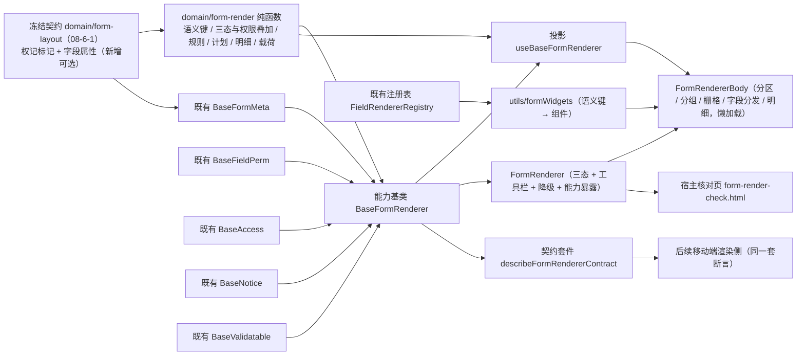

# 01 详细设计 · 表单渲染器

> 前端组件库 · 08 交互类 · 06 表单设计器与表单渲染器 · 嵌套子任务 02（需求 08-6）· 详细设计

[文档首页](../../../../../../../文档首页.md) › [08 交互类](../../../08_交互类.md) › [06 表单设计器与表单渲染器](../../08_交互类_06_表单设计器与表单渲染器.md) › 详细设计　|　[← 任务](../08_交互类_06_表单设计器与表单渲染器_02_表单渲染器.md)

## 1. 设计目标与范围 <a id="goal"></a>

交付[需求 08-6](../../../../../需求/08_需求_交互类.md#r08-6) 的**表单渲染器**：布局元数据驱动渲染（分区 / 分组 / 栅格 / 跨列）、字段类型分发、三态（新增 / 编辑 / 查看）与字段权限叠加、校验与提交、明细区（主从），并**只消费 `08-6-1` 已冻结的元数据契约**（不重定义）。

- **渲染编排入链**：新增能力基类 `BaseFormRenderer`（键 `form-renderer`）——一层一语义，三态判定 / 字段权限叠加 / 校验执行与定位 / 明细行级校验 / 提交装配各自独立分支；与 `BaseFormDesigner` 对称。
- **渲染语义入核心**：新增 `domain/form-render.ts`——字段类型 → **控件语义键**、字段渲染状态解析（三态 + 权限叠加）、字段规则构建（复用既有 `domain/validators.ts`）、渲染计划（分区 / 分组 / 字段三段）产出、明细列与行级校验、提交载荷装配，全部为框架无关纯函数。
- **分发映射分层**：核心只出**控件语义键**（框架与第三方无关，护栏 `guard-core-framework-agnostic` 要求）；ui-ep 侧映射表把语义键映射到具体组件，重控件二次懒加载；自定义类型经统一提供者注册表基座 `FieldRendererRegistry`（`02_05` 已交付）覆盖——**不另起映射**。
- **契约扩展向后兼容**：`08-6-1` 冻结的 `LayoutEffective` / `FormField` 只做**新增可选字段**（权限标记与字段属性），既有断言与用例不改动即通过；并**回写** `08-6-1` 详细设计与契约套件（消费方前置契约扩展记录）。
- **数据通路注入式**：布局取数 / 详情取数 / 提交由宿主注入；**未注入即占位**（不发请求、返回 `undefined`、按钮禁用 + 占位文案），与 `08_01_02` 冻结的占位语义一致，真实接口联调随阶段八。
- **契约套件新增一套**：`describeFormRendererContract`（渲染编排契约），与 `describeFormLayoutContract` / `describeFormDesignerContract` 并列，供后续移动端实现复用同一套断言。
- **分组渲染闭环**：本期按 `section.groups` **渲染侧落地**（只读渲染口径），闭环 `08-6-1` 登记的遗留项「分组二级组织完整交互随 `08-6-2` 渲染侧口径细化」——**不回头改设计器**。

### 1.1 口径与依从 <a id="positioning"></a>

- **架构铁律**：渲染编排是**横切功能**，一律落为**继承链上的能力基类**（核心 `capabilities/`）与领域纯函数（核心 `domain/`），不在链外自由挂接；具体件只做渲染与投影。
- **继承链**：`BaseComponent`（组件根）→ 能力基类（`BaseFormRenderer`，**组合** `BaseFormMeta` / `BaseFieldPerm` / `BaseAccess` / `BaseNotice` / `BaseValidatable`）→ 具体件（本子任务）。能力基类依赖单向登记于 `capabilities/manifest.ts`。
- **对外契约不变**：`FormRenderer` 的导出名、既有 Props、既有事件、既有插槽与 `data-test` 标记、`FormRendererBody` 分包入口（`data-subpackage="renderer"`）**保持 `08_01_02` 冻结形状**；本次只**向后兼容新增**可选 Props / 事件 / 插槽 / `data-test`。分包粒度维持**单一分包入口**（`FormRendererBody`），体内对重控件二次懒加载，**不新增第二分包件**。
- **三态与权限叠加**：**三态定基线 + 权限双向覆盖**——三态先定可编辑基线（`view` 恒只读、`create` / `edit` 可编辑），字段权限标记**最后应用且双向**：`visible=false` 不渲染、`visible=true` 可让 `hidden` 字段重新可见；`editable=false` 禁用、`editable=true` **可在 `view` 态把字段放开为可编辑**。该口径为**用户拍板结论**（非推荐项），其风险与兜底见第 4 节「`view` 态权限放开」行与第 7 节开放项。
- **端范围**：**仅 PC**（`frontend/packages/ui-ep`）；移动端为同一契约的另一实现（同一套契约套件断言），实现归后续任务。
- **工时**：本嵌套子任务 16h；因新增 1 个能力基类、1 份领域纯函数、1 套契约套件、1 套投影、1 个分发映射工具、两件组件（迁移 + 真实实现）与宿主核对页，实际上浮在实施记录登记。

## 2. 交付物清单 <a id="deliver"></a>

| # | 交付物 | 落点 |
| --- | --- | --- |
| 1 | 渲染领域纯函数与数据模型（新增） | `core/src/domain/form-render.ts` |
| 2 | 渲染编排能力基类（新增） | `core/src/capabilities/form-renderer.ts` |
| 3 | 能力依赖登记（新增 `form-renderer` 一键） | `core/src/capabilities/manifest.ts` |
| 4 | 冻结契约向后兼容扩展（权限标记与字段属性） | `core/src/domain/form-layout.ts`（**回写 `08-6-1`**） |
| 5 | 核心导出面登记 | `core/src/index.ts` |
| 6 | 渲染编排契约套件（新增）与套件入口 | `core/testing/form-render.ts`、`core/testing/index.ts` |
| 7 | 核心用例（领域 + 能力基类） | `core/tests/domain-form-render.spec.ts`、`core/tests/form-renderer.spec.ts` |
| 8 | 渲染编排投影（新增） | `ui-ep/src/composables/useBaseFormRenderer.ts` |
| 9 | 字段分发映射工具（语义键 → 组件 + 重控件懒加载） | `ui-ep/src/utils/formWidgets.ts` |
| 10 | 表单渲染器（迁移 + 真实实现） | `ui-ep/src/components/form-render/FormRenderer.vue` |
| 11 | 渲染主体（迁移 + 真实实现，独立分包） | `ui-ep/src/components/form-render/FormRendererBody.vue` |
| 12 | 导出面登记（含旧路径移除与分包口径） | `ui-ep/src/index.ts` |
| 13 | 用例（投影 + 分发映射 + 两件 + 分组与明细 + 分包） | `ui-ep/tests/interaction-form-renderer.spec.ts` |
| 14 | 宿主核对页（`vite build` 不含） | `apps/desktop/form-render-check.html`、`apps/desktop/src/dev/{formRenderCheck.ts,FormRenderCheck.vue}` |
| 15 | 登记回写（基类清单 / 组件设计 12 / `08-6-1` 设计 / 计划与状态） | 见第 6 节 |



## 3. 接口 / 契约与边界 <a id="contract"></a>

### 3.1 核心：冻结契约的向后兼容扩展（`domain/form-layout.ts` 回写） <a id="extend"></a>

仅**新增可选字段**，既有导出名、既有字段语义、既有函数签名与返回值均不变（既有冻结用例不退改）。

```ts
/** 字段属性规则描述（声明式，编译归 domain/form-render）。 */
export interface FieldRule {
  /** 规则种类。 */
  kind: 'required' | 'length' | 'range' | 'pattern' | 'options'
  /** 长度 / 数值下限。 */
  min?: number
  /** 长度 / 数值上限。 */
  max?: number
  /** 正则（`pattern` 规则）。 */
  pattern?: string
  /** 自定义错误文案。 */
  message?: string
}

/** 字段渲染属性（后端可省略；省略即按缺省）。 */
export interface FieldRenderAttrs {
  /** 是否必填（与标签必填合流；权限 `required` 可覆盖）。 */
  required?: boolean
  /** 占位提示。 */
  placeholder?: string
  /** 默认值。 */
  defaultValue?: unknown
  /** 校验规则（声明式）。 */
  rules?: readonly FieldRule[]
  /** 选项集（下拉 / 单选 / 复选类）。 */
  options?: readonly ExtFieldOption[]
  /** 只读（编辑态亦只读）。 */
  readonly?: boolean
  /** 隐藏（布局引用但默认不渲染）。 */
  hidden?: boolean
}

export interface FormField extends FieldRenderAttrs {
  // …既有字段（key / label / type / group / disabled / status）不变
}

export interface LayoutEffective {
  // …既有字段（layout / fields / level / source / readonly / fallback）不变
  /** 当前用户字段权限标记（键为字段键；缺省项按全开）。 */
  permissions?: Readonly<Record<string, FieldPermission>>
}
```

| 行为 | 口径 |
| --- | --- |
| 既有形状 | `FormField` 原有 6 个字段与 `LayoutEffective` 原有 6 个字段的**名称 / 类型 / 语义一字不改**；`required` 等全部为**可选**，省略即与扩展前逐字等价 |
| `resolveEffectiveLayout` | 返回值**透传** `input.permissions`（缺省不生成空对象，保持运行态「无 `undefined` 成员」口径） |
| `toRenderMetadata` | 同步透传 `permissions`（**设计产出 → 渲染输入同形**断言由 `08-6-1` 契约套件继续覆盖，新增字段不破坏逐字一致性） |
| 影响面 | `normalizeLayout` / `layoutEqual` / `isLayoutDirty` / `validateLayout` 等**不改**（`permissions` 挂 `LayoutEffective` 而非 `FormLayout`，不入 `stableStringify` 比对） |

### 3.2 核心：`domain/form-render.ts`（新增纯函数与数据模型） <a id="domain"></a>

```ts
/** 渲染器占位文案（数据通路未就绪）。 */
export const RENDERER_PLACEHOLDER_TEXT = '表单渲染器未就绪（占位）'
/** 空布局回退提示文案。 */
export const RENDERER_FALLBACK_HINT = '未配置布局，已按字段默认栅格渲染'
/** 未知类型回退告警文案。 */
export const RENDERER_UNKNOWN_TYPE_HINT = '未注册的字段类型，已回退纯文本'
/** 脱敏掩码文本。 */
export const MASK_TEXT = '******'
/** 空值展示占位。 */
export const EMPTY_TEXT = '—'
/** 明细区缺省列数上限（未配置明细列时回退）。 */
export const DEFAULT_DETAIL_COLUMNS = 6
/** 明细区缺省每页行数。 */
export const DEFAULT_DETAIL_PAGE_SIZE = 20
/** 控件语义键全量（框架无关；具体组件映射归各端插件）。 */
export const FIELD_WIDGETS: readonly FormWidget[]
/** 字段类型 → 控件语义键内建映射表（未知类型回退 `plain`）。 */
export const FIELD_WIDGET_MAP: Readonly<Record<string, FormWidget>>

/** 表单三态。 */
export type FormRenderMode = 'create' | 'edit' | 'view'
/** 控件语义键（框架无关）。 */
export type FormWidget =
  | 'text'
  | 'textarea'
  | 'number'
  | 'datetime'
  | 'select'
  | 'multi-select'
  | 'radio'
  | 'checkbox'
  | 'switch'
  | 'file'
  | 'image'
  | 'richtext'
  | 'tree-select'
  | 'org-select'
  | 'transfer'
  | 'cascader'
  | 'tags'
  | 'captcha'
  | 'plain'
/** 字段渲染状态（运行态确定值）。 */
export interface FieldRenderState {
  visible: boolean
  editable: boolean
  disabled: boolean
  required: boolean
  masked: boolean
  displayOnly: boolean
}
/** 字段渲染覆盖（件层局部覆盖，优先于契约下发属性）。 */
export interface FieldRenderOverride extends FieldRenderAttrs {}
/** 字段渲染项（计划中的单个字段）。 */
export interface RenderFieldPlan extends FieldRenderState {
  key: string
  label: string
  widget: FormWidget
  unknown: boolean
  colSpan: boolean
  placeholder: string
  defaultValue?: unknown
  options: ExtFieldOption[]
  rules: FieldRule[]
  value?: unknown
}
/** 分组渲染项（分区内二级组织）。 */
export interface RenderGroupPlan { key: string; title: string; fields: RenderFieldPlan[] }
/** 分区渲染项。 */
export interface RenderSectionPlan {
  key: string
  title: string
  columns: SectionColumns
  fields: RenderFieldPlan[]
  groups: RenderGroupPlan[]
}
/** 明细列渲染项。 */
export interface RenderDetailColumn { key: string; title: string; width?: number; editable: boolean }
/** 渲染计划（分区 / 分组 / 字段 / 明细列 + 跳过项 + 回退标记）。 */
export interface RenderPlan {
  sections: RenderSectionPlan[]
  detailColumns: RenderDetailColumn[]
  detailFallback: boolean
  unknownFields: string[]
  disabledFields: string[]
  migratedFields: string[]
  fallback: boolean
  readonly: boolean
}
/** 表单校验错误。 */
export interface FormRenderError { field: string; message: string }
/** 表单校验结果。 */
export interface FormValidationResult {
  valid: boolean
  errors: FormRenderError[]
  firstField: string | undefined
  message: string
}
/** 明细行级错误。 */
export interface DetailRenderError { index: number; field: string; message: string }
/** 明细校验结果。 */
export interface DetailValidationResult { valid: boolean; errors: DetailRenderError[]; message: string }
/** 明细数据（页签键 → 行集合）。 */
export type DetailDataSet = Record<string, readonly Record<string, unknown>[]>
/** 提交载荷。 */
export interface SubmitPayload {
  formCode: string
  mode: FormRenderMode
  recordId?: string | number
  data: Record<string, unknown>
  details: Record<string, Record<string, unknown>[]>
  recordVersion?: number
}
/** 渲染元数据装载输入（后端可省略字段 / 权限可缺省）。 */
export interface RenderMetadataInput {
  layout?: FormLayoutInput
  fields?: readonly FormFieldInput[]
  level?: DesignerLevel
  source?: DesignerLevel | 'empty'
  readonly?: boolean
  fallback?: boolean
  permissions?: Readonly<Record<string, { visible?: boolean; editable?: boolean; required?: boolean; mask?: boolean }>>
}
/** 字段装载输入（后端可省略）。 */
export interface FormFieldInput extends FieldRenderAttrs { key?: string; label?: string; type?: string; group?: string; status?: string; disabled?: boolean }

resolveFieldWidget(type: string): FormWidget
isKnownFieldType(type: string): boolean
normalizeRenderMode(mode: unknown): FormRenderMode
normalizeRenderMetadata(input: RenderMetadataInput | LayoutEffective | undefined): LayoutEffective
normalizeFieldOverrides(input: Readonly<Record<string, FieldRenderOverride>> | undefined): Record<string, FieldRenderOverride>
resolveBaselineEditable(mode: FormRenderMode, forceReadOnly?: boolean): boolean
resolveFieldRenderState(input: {
  field: FormField
  override?: FieldRenderOverride
  permission?: FieldPermission
  mode: FormRenderMode
  forceReadOnly?: boolean
}): FieldRenderState
buildRenderPlan(effective: LayoutEffective, input?: {
  mode?: FormRenderMode
  forceReadOnly?: boolean
  data?: Record<string, unknown>
  permissions?: Readonly<Record<string, FieldPermission>>
  overrides?: Readonly<Record<string, FieldRenderOverride>>
}): RenderPlan
countPlanFields(plan: RenderPlan): number
visibleFields(plan: RenderPlan): RenderFieldPlan[]
mkFieldRules(field: FormField, override?: FieldRenderOverride, state?: FieldRenderState): FieldRule[]
compileFieldRules(rules: readonly FieldRule[]): Validator<unknown>[]
validateFieldValue(field: FormField, value: unknown, input?: {
  override?: FieldRenderOverride
  permission?: FieldPermission
  mode?: FormRenderMode
  forceReadOnly?: boolean
}): string | undefined
validateFormData(plan: RenderPlan, data?: Record<string, unknown>): FormValidationResult
validateDetailRows(columns: readonly RenderDetailColumn[], rows: readonly Record<string, unknown>[]): DetailValidationResult
validateDetails(plan: RenderPlan, details?: DetailDataSet): DetailValidationResult
maskFieldText(value: unknown): string
displayFieldText(value: unknown): string
normalizeDetailRows(rows: readonly unknown[] | undefined): Record<string, unknown>[]
normalizeDetailSet(details: DetailDataSet | undefined, keys?: readonly string[]): Record<string, Record<string, unknown>[]>
buildSubmitPayload(input: {
  formCode: string
  mode: FormRenderMode
  recordId?: string | number
  recordVersion?: number
  plan: RenderPlan
  data?: Record<string, unknown>
  details?: DetailDataSet
}): SubmitPayload
isSubmitAllowed(input: { readonly: boolean; busy: boolean; validation: FormValidationResult }): boolean
```

| 行为 | 口径 |
| --- | --- |
| 三态基线 | `resolveBaselineEditable`：`forceReadOnly` 为真 → `false`；`mode === 'view'` → `false`；`create` / `edit` → `true` |
| 语义键映射 | `FIELD_WIDGET_MAP`：`text→text`、`longtext→textarea`、`number`/`amount`/`percent`→`number`、`date`/`datetime`→`datetime`、`select→select`、`multi_select→multi-select`、`radio→radio`、`checkbox→checkbox`、`switch→switch`、`file→file`、`image→image`、`richtext→richtext`、`dept`/`tree→tree-select`、`user`/`post`/`org→org-select`、`transfer→transfer`、`cascader→cascader`、`tags→tags`、`captcha→captcha`；**表外类型 → `plain` + `unknown` 为真**（纯文本回退 + 开发告警，不阻断） |
| 权限双向覆盖 | `resolveFieldRenderState` 按「基线 → 字段属性 → 权限」三级归并：`visible` = 权限显式值 ?? `!hidden`；`editable` = 权限显式值 ?? (基线 ∧ 非 `readonly`)；`required` = 权限显式值 ?? `required` 属性 ?? `false`；`masked` = 权限 `mask` ?? `false`；`disabled` = `!editable`；`displayOnly` = `mode === 'view'`（**只读回显与禁用控件相区分**，回显形态归字段壳能力） |
| 权限优先 | 权限标记**最后应用且双向**（可实现"更严"与"更松"两种覆盖）；组件设计 §3「权限优先于布局」在本口径下落实为「权限为终态」 |
| 覆盖优先级 | 件层 `overrides`（`fieldProps`）> 契约下发 `field` 属性；两者均被权限标记**终态覆盖** |
| 渲染计划 | `buildRenderPlan`：遍历 `effective.layout.main.sections`，逐分区产出字段项（`visible=false` **保留在计划中并打标**，由件层据 `visible` 决定是否渲染，便于统计与断言）；分区 `groups` **非空时**按分组产出 `groups`（组内字段），同时**迁移**到 `fields` 便于统一遍历；`ungroupedFields` 为**未分组字段**（有分组时先行平铺渲染，无分组时与 `fields` 同集）；`groups` 为空时 `groups: []`、`fields` 平铺（既有行为不变） |
| 停用字段转只读 | 字段 `disabled` 或 `status !== 'active'` → 记入 `disabledFields` **并强制 `readonly`**（只读回显保留历史数据可见，不可编辑；**实测回写**：初版仅记标记未收紧可编辑，核对页自检 ④ 暴露） |
| 字段属性带入 | 每字段项带入 `widget` / `colSpan`（`LayoutFieldRef.colSpan`）/ `placeholder` / `defaultValue` / `options` / `rules` / 当前值 `value`（取自 `data`） |
| 未知字段 | 布局引用的字段不在 `effective.fields` 中 → **跳过不渲染**，记入 `unknownFields`（**不阻断**） |
| 停用字段 | `disabled` 或 `status !== 'active'` → 记入 `disabledFields` 并**转只读**保留渲染（避免历史数据不可见、且不可再编辑） |
| 空布局回退 | `effective.fallback` 为真 → 计划 `fallback` 为真（件层按回退提示渲染），**布局本身已由 `08-6-1` 补默认栅格**，本任务不重复回退 |
| 只读 | 计划 `readonly` = `effective.readonly ∨ forceReadOnly`；件层据此外加禁用与只读提示 |
| 明细列 | `plan.detailColumns`：读 `layout.detail.columns`（列宽 / 顺序按布局）；**未配置时回退**为「主表布局字段顺序去重取前 `DEFAULT_DETAIL_COLUMNS` 列」并置 `detailFallback` 为真（与设计 §7「明细区未配置（回退默认列）」一致） |
| 明细列可编辑 | 列 `editable` = 非只读态（查看态明细整体只读） |
| 规则构建 | `mkFieldRules` 由「必填 / 长度 / 范围 / 正则 / 选项集」产出**声明式** `FieldRule[]`；`compileFieldRules` 复用既有 `domain/validators.ts` 的 `required` / `lengthRange` / `numberRange` / `codePattern`（**不新增校验器**）；不可见 / 非必填字段不产出 `required` 规则 |
| 字段校验 | `validateFieldValue`：不通过时返回错误文案；**不可见字段跳过**、**只读字段跳过**（只读不阻塞提交）；`options` 规则校验值是否在选项集内 |
| 全量校验 | `validateFormData`：遍历计划中 `visible` 的字段逐项校验，产出 `errors` 与 `firstField`（**首个错误字段**，用于提交时定位）；`valid` 为 `errors` 为空 |
| 明细行级校验 | `validateDetailRows`：逐行逐列校验（复用同一套规则；行内必填 / 类型 / 范围），产出 `{ index, field, message }`；`validateDetails` 汇总全页签并按「页签序 → 行序 → 列序」定位首个错误 |
| 脱敏 | `maskFieldText`：空值回 `EMPTY_TEXT`、非空回 `MASK_TEXT`（**明文切换动作归字段权限能力**，本任务只落掩码标记与掩码文本） |
| 展示归一 | `displayFieldText`：`null` / `undefined` / 空串 → `EMPTY_TEXT`，其余 `String(value)`；数组按 `、` 连接 |
| 明细归一 | `normalizeDetailRows`：剔除非对象行、`null` / `undefined` 行；`normalizeDetailSet`：按页签键归一为确定值（缺省页签补空数组，**运行态无 `undefined` 成员**） |
| 提交载荷 | `buildSubmitPayload`：`data` 只含**可见**字段（不可见不入载荷，避免越权写入；**只读字段仍入载荷**，否则编辑态丢字段）；脱敏字段**保留原值交由后端裁决**（前端不伪造数据）；`details` 归一为确定值；`mode='edit'` 时带入 `recordVersion` |
| 提交许可 | `isSubmitAllowed`：`readonly` / `busy` 为真 → `false`；`validation.valid` 为假 → `false` |
| 纯数据 | 不触 DOM、不请求、不依赖渲染框架；同输入同输出 |

### 3.3 核心：能力基类 `BaseFormRenderer`（新增） <a id="renderer-base"></a>

```ts
/** 渲染阶段。 */
export type RendererPhase = 'idle' | 'loading' | 'submitting' | 'done' | 'failed'
/** 详情快照（编辑 / 查看态取数）。 */
export interface RecordSnapshot {
  data?: Record<string, unknown>
  details?: DetailDataSet
  recordVersion?: number
}
/** 提交结果。 */
export interface SubmitResult { recordVersion?: number; data?: Record<string, unknown> }
/** 注入的处理函数集（未注入项按占位：不请求、恒定返回 `undefined`）。 */
export interface FormRendererJobs {
  loadLayout?: (input: { formCode: string; mode: FormRenderMode; recordId?: string | number }) => Promise<RenderMetadataInput | undefined>
  loadRecord?: (input: { formCode: string; recordId: string | number }) => Promise<RecordSnapshot | undefined>
  submit?: (input: SubmitPayload) => Promise<SubmitResult | undefined>
}

export abstract class BaseFormRenderer extends BaseComponent {
  readonly identifier: string = 'form-renderer'
  override readonly depends = ['form-meta', 'field-perm', 'access', 'notice', 'validatable']
  formCode: string
  mode: FormRenderMode
  recordId: string | number | undefined
  forceReadOnly: boolean
  ready: boolean
  requestCount: number
  meta: LayoutEffective
  data: Record<string, unknown>
  details: Record<string, Record<string, unknown>[]>
  permissions: Record<string, FieldPermission>
  overrides: Record<string, FieldRenderOverride>
  errors: FormRenderError[]
  detailErrors: DetailRenderError[]
  phase: RendererPhase
  errorMessage: string
  recordVersion: number | undefined
  jobs: FormRendererJobs
  access: BaseAccess | undefined
  notice: BaseNotice | undefined
  formMeta: BaseFormMeta | undefined
  fieldPerm: BaseFieldPerm | undefined
  validatable: BaseValidatable | undefined

  get degraded(): boolean
  get readonly(): boolean
  get busy(): boolean
  get plan(): RenderPlan
  get fields(): RenderFieldPlan[]
  get detailColumns(): RenderDetailColumn[]
  get validation(): FormValidationResult
  get detailValidation(): DetailValidationResult
  get canSubmit(): boolean
  get unknownFields(): string[]
  get disabledFields(): string[]

  setReady(value: boolean): void
  setJobs(jobs: FormRendererJobs): void
  setAccess(access: BaseAccess | undefined): void
  setNotice(notice: BaseNotice | undefined): void
  setFormMeta(meta: BaseFormMeta | undefined): void
  setFieldPerm(perm: BaseFieldPerm | undefined): void
  setValidatable(validatable: BaseValidatable | undefined): void
  setMode(mode: unknown): boolean
  setFormCode(formCode: string): boolean
  setRecordId(recordId: string | number | undefined): void
  setForceReadOnly(value: boolean): void
  setPermissions(permissions: Readonly<Record<string, FieldPermission>> | undefined): void
  setOverrides(overrides: Readonly<Record<string, FieldRenderOverride>> | undefined): void
  setMeta(input: RenderMetadataInput | LayoutEffective | undefined): void
  setData(data: Record<string, unknown> | undefined): void
  setDetails(details: DetailDataSet | undefined): void
  setFieldValue(fieldKey: string, value: unknown): boolean
  getFieldValue(fieldKey: string): unknown
  setDetailRows(detailKey: string, rows: readonly unknown[]): boolean
  addDetailRow(detailKey: string, row?: Record<string, unknown>): boolean
  removeDetailRow(detailKey: string, index: number): boolean
  setDetailCell(detailKey: string, index: number, fieldKey: string, value: unknown): boolean
  validate(): FormValidationResult
  validateField(fieldKey: string): string | undefined
  reset(): void
  load(): Promise<LayoutEffective | undefined>
  submit(): Promise<SubmitResult | undefined>
  retry(): Promise<SubmitResult | undefined>
}
```

| 行为 | 口径 |
| --- | --- |
| 占位语义 | `ready === false` → `degraded` / `readonly` 为真；`load` / `submit` **零请求**（`requestCount` 恒 0）；`phase` 保持 `idle`——保持 `08_01_02` 冻结口径 |
| 只读 | `readonly = degraded ∨ forceReadOnly ∨ mode === 'view' ∨ 未持渲染权限（`access` 注入时按 `FORMDESIGN_VIEW_PERM` 判定；未注入视为有权，后端兜底）`；只读时 `setFieldValue` / `setDetailCell` / `addDetailRow` / `removeDetailRow` / `submit` 均返回 `false` 或不做动作且**不改数据** |
| 取元数据 | `load`：未就绪 / 未注入 `jobs.loadLayout` → 占位不动作；注入后 `phase='loading'`、`requestCount += 1`；若注入 `formMeta` 则先经其 `load()`（两通路独立，未注入即跳过）；取回后经 `normalizeRenderMetadata` **归一为运行态**（缺省项补确定值）写入 `meta`；随后若 `mode !== 'create'` 且 `recordId` 有效且已注入 `jobs.loadRecord` → 再取详情（`requestCount += 1`）写入 `data` / `details` / `recordVersion`；成功 `phase='done'`，失败 `phase='failed'` + `errorMessage` |
| 计划派生 | `plan` 由 `buildRenderPlan(meta, { mode, forceReadOnly, data, permissions, overrides })` 派生（**纯派生，不缓存**，任何状态变更即最新） |
| 字段写入 | `setFieldValue`：仅当对应字段项 `editable` 为真且 `!readonly` 才写入；写入后**即时校验该字段**（`validateField`）并更新 `errors` 中该字段项（错误即入、通过即清）——落实「变更即时校验」口径 |
| 即时校验边界 | 即时校验**只更新主表字段错误**；明细单元格写入后即时校验**该行**并更新 `detailErrors` 中该行项 |
| 全量校验 | `validate()`：主表全量（`validateFormData`）+ 各明细页签行级（`validateDetails`）→ 覆盖写 `errors` / `detailErrors`，返回主表结果；失败时 `errorMessage` 取首个错误文案 |
| 提交许可 | `canSubmit` = `!degraded ∧ !readonly ∧ !busy ∧ validation.valid`（`validation` 为**实时派生**，无需先调 `validate` 亦准确） |
| 提交 | `submit`：未就绪 / 只读 / `busy` → 返回 `undefined`；先 `validate()`，**不通过则不请求**（置 `errors` / `detailErrors`、`phase='failed'`、`errorMessage`，供件层定位首个错误字段）；通过且 `jobs.submit` **未注入** → 返回 `undefined`（占位不请求）；注入 → `phase='submitting'`、`requestCount += 1`、提交 `buildSubmitPayload(...)`（`edit` 态带 `recordVersion`）→ 成功 `phase='done'`、写回 `recordVersion`、`notice` 提示「已提交」、**清空错误**；失败 `phase='failed'` + `errorMessage`，**保留本地数据与错误**，可 `retry()` |
| 重试 | `retry`：以上次载荷重放（未注入 / 只读 / `busy` 不动作）；用于提交失败后重试 |
| 明细操作 | `setDetailRows` 整体替换（归一）；`addDetailRow` 追加空行（只读不动作）；`removeDetailRow` 按下标移除（越界不动作）；`setDetailCell` 按单元格写入并即时校验该行 |
| 三态切换 | `setMode`：归一后写入；**切到 `view` 不校验也不发请求**；切态不改数据（同一份数据三态共用，符合设计 §4「三态共用」） |
| 表单 / 记录切换 | `setFormCode` / `setRecordId`：清空 `meta` / `data` / `details` / `errors` / `detailErrors` / `recordVersion`，`phase` 归 `idle`（不自动取数，由宿主显式 `load()`） |
| 防重复 | `busy`（`loading` / `submitting`）期间 `submit` / `retry` 直接返回 `undefined`（件层同时禁用按钮） |
| 派生只读面 | `unknownFields` / `disabledFields` 由 `plan` 派生（提示用，不阻断） |
| 纯数据 | 不触 DOM、不请求；状态变更经生命周期 `update` 通知 |

- 依赖登记：`form-renderer: ['form-meta', 'field-perm', 'access', 'notice', 'validatable']`。
- 不含渲染与控件本体（分别归具体件与字段类 / 基础控件类）；不含服务端动态校验与权限裁决（归后端）。

### 3.4 核心：契约套件 `describeFormRendererContract`（`@bms/core/testing`） <a id="testing"></a>

| 项 | 内容 |
| --- | --- |
| 落点 | `core/testing/form-render.ts`，经 `core/testing/index.ts` 统一出口再导出 |
| 契约面（结构化接口） | `ready` / `degraded` / `readonly` / `busy` / `requestCount` / `phase` / `mode` / `canSubmit` / `plan()` / `fields()` / `detailColumns()` / `validation()` / `detailValidation()` / `unknownFields()` / `setReady` / `setJobs` / `setOperators`（注入权限与权限取码）/ `setMode` / `setMeta` / `setData` / `setDetails` / `setPermissions` / `setOverrides` / `setFieldValue` / `getFieldValue` / `setDetailRows` / `addDetailRow` / `removeDetailRow` / `setDetailCell` / `validate` / `validateField` / `load` / `submit` / `retry` / `reset` |
| 断言要点 | ① 未就绪降级且零请求；就绪未注入处理函数仍零请求；② 取数归一（缺省项补确定值、空布局回退标记、权限缺省全开）；③ **语义键分发**（含未知类型回退 `plain` 且 `unknown` 为真）；④ **三态叠加矩阵**——`create` / `edit` 可编辑、`view` 只读、`forceReadOnly` 覆盖三态、**权限 `editable=true` 在 `view` 态放开**、`visible=false` 不渲染、`editable=false` 禁用；⑤ 分区 / 分组计划（`groups` 非空时按组产出并迁移进 `fields`）；⑥ 未知字段跳过不阻断、停用字段只读保留；⑦ 即时校验与全量校验（首个错误字段定位）、只读字段不阻塞提交；⑧ 明细列回退、行级校验定位、行增删与单元格写入；⑨ 脱敏与空值展示；⑩ 提交载荷（可见字段过滤、只读字段保留、`edit` 带 `recordVersion`）；⑪ 提交失败保留本地、`retry` 恢复；⑫ 进行中重复提交不动作；⑬ 只读态写入不动作且不改数据 |
| 目标约定 | 表单 `leave`；字段清单含平台 `name`（`text`）/ `remark`（`longtext`）/ `amount`（`amount`）/ `unknown_type`（`mystery`，走未知回退）+ 租户自建 `project_no`（`text`）；布局一分区两子分区（`s1` 两字段含跨列 / `s2` 分组 `g1` 两字段）；权限标记含 `name.editable = true`（`view` 态放开）与 `remark.visible = false`；处理函数集返回「布局 + 字段 + 权限」，详情返回两处明细，提交返回 `{ recordVersion: 5 }` |
| 消费方 | `ui-ep` 投影适配；后续移动端渲染侧实现复用同一套断言 |

### 3.5 插件层：投影 `useBaseFormRenderer`（新增） <a id="projection"></a>

```ts
export interface UseBaseFormRendererOptions {
  ready?: boolean
  formCode?: string
  mode?: FormRenderMode
  recordId?: string | number
  forceReadOnly?: boolean
  meta?: RenderMetadataInput | LayoutEffective
  data?: Record<string, unknown>
  details?: DetailDataSet
  permissions?: Readonly<Record<string, FieldPermission>>
  overrides?: Readonly<Record<string, FieldRenderOverride>>
  jobs?: FormRendererJobs
  access?: BaseAccess
  notice?: BaseNotice
  formMeta?: BaseFormMeta
  fieldPerm?: BaseFieldPerm
  validatable?: BaseValidatable
}
export interface UseBaseFormRendererResult {
  renderer: BaseFormRenderer
  ready: Ref<boolean>
  degraded: Ref<boolean>
  readonly: Ref<boolean>
  busy: Ref<boolean>
  phase: Ref<RendererPhase>
  mode: Ref<FormRenderMode>
  plan: Ref<RenderPlan>
  fields: Ref<RenderFieldPlan[]>
  detailColumns: Ref<RenderDetailColumn[]>
  data: Ref<Record<string, unknown>>
  details: Ref<Record<string, Record<string, unknown>[]>>
  errors: Ref<FormRenderError[]>
  detailErrors: Ref<DetailRenderError[]>
  validation: Ref<FormValidationResult>
  errorMessage: Ref<string>
  setReady / setMode / setFormCode / setRecordId / setForceReadOnly
  setMeta / setData / setDetails / setPermissions / setOverrides / setJobs
  setFieldValue / getFieldValue / setDetailRows / addDetailRow / removeDetailRow / setDetailCell
  validate / validateField / load / submit / retry / reset
}
```

- 薄适配（核心实例 ↔ Vue 响应式），不含判定逻辑；跨实例基类对象经 `markRaw(toRaw(x))` 隔离（沿用既有坑记录）；`onScopeDispose` 解除订阅。

### 3.6 插件层：分发映射工具 `utils/formWidgets.ts`（新增） <a id="widgets"></a>

```ts
/** 内建控件映射（语义键 → 组件）；`plain` 无组件（由件层渲染纯文本）。 */
const BUILTIN_WIDGETS: Readonly<Record<string, Component>>
/** 字段类型专用件（同语义键下按类型细分：金额 / 枚举）。 */
const TYPE_OVERRIDES: Readonly<Record<string, Component>>
getFieldWidget(widget: FormWidget): Component | undefined
resolveFieldComponent(input: { widget: FormWidget; fieldType: string; registry?: FieldRendererRegistry | undefined }): Component | undefined
resolveFieldComponentByType(fieldType: string, registry?: FieldRendererRegistry): Component | undefined
/** 多选语义键集合。 */
export const MULTIPLE_WIDGETS: readonly FormWidget[]
```

| 行为 | 口径 |
| --- | --- |
| 内建映射 | 语义键 → 组件：`text→TextInput`、`textarea→TextareaInput`、`number→NumberInput`、`datetime→DateTimeField`、`select→SelectInput`、`multi-select→SelectInput`（`multiple`）、`radio→RadioInput`、`checkbox→CheckboxInput`、`switch→SwitchField`、`file`/`image→FileUploadField`、`richtext→RichTextField`、`tree-select→TreeSelectField`、`org-select→OrgSelectField`、`transfer→TransferField`、`cascader→CascadeField`、`tags→TagInputField`、`captcha→CaptchaField`、`plain→undefined`（纯文本回退，由件层渲染 `<p>`） |
| 类型细分 | `TYPE_OVERRIDES`：`amount`/`percent→AmountField`、`number→NumberField`、`radio`/`multi_select→EnumField`（同语义键下按字段类型取更专用件） |
| **实测调整（静态引用）** | 原设计拟对重控件二次 `defineAsyncComponent` 懒加载；**实施实测**：控件本体均已进 `ui-ep` 根出口（对外契约冻结，不可移除），Vite 报 `INEFFECTIVE_DYNAMIC_IMPORT`（动态导入对已静态导出模块**不会分包**），真实首屏收益为 0 且徒增异步边界 → **改为静态引用**，映射表即常量；**分包收益只由 `FormRendererBody` 自身分包承担**（该入口未进根出口，分包有效） |
| 注册表覆盖 | `resolveFieldComponent` 先查核心 `FieldRendererRegistry.resolveByType(fieldType)`（**自定义 / 业务类型优先**），未命中再回落内建语义键映射；两处均未命中 → `undefined`（件层渲染纯文本 + 告警） |
| 可测 | 纯函数；jsdom 用例断言语义键 → 组件解析、类型细分与未映射回退 |

### 3.7 插件层：两件组件 <a id="components"></a>

件族迁入专题目录 `ui-ep/src/components/form-render/`（同 `print/` / `import-export/` / `form-design/` 先例），**对外导出名、既有 Props / 事件 / 插槽 / `data-test` 与分包入口不变**；旧路径 `components/interaction/{FormRenderer,FormRendererBody}.vue` 删除。

#### 3.7.1 `FormRenderer.vue`（迁移 + 真实实现） <a id="c-renderer"></a>

| 面 | 内容 |
| --- | --- |
| 数据面（既有，保持） | `ready`（缺省 `false`）/ `formCode` / `mode`（缺省 `create`）/ `modelValue` / `recordId` / `labelPosition`（缺省 `top`）/ `forceReadOnly` / `meta` / `degradeText` |
| 数据面（新增，全部可选） | `permissions` / `fieldProps` / `readonlyFields` / `jobs`（处理函数集）/ `access` / `notice` / `fieldPerm` / `formMeta` / `fieldRenderer`（注册表）/ `validatable` |
| 事件（既有，保持） | `update:modelValue` / `change` / `submit` / `validate` / `field-change` / `retry` |
| 事件（新增） | `loaded`（`LayoutEffective`）/ `submitted`（`SubmitResult`）/ `failed`（`{ message }`）/ `field-error`（`{ field, message }`）/ `detail-change`（`{ detailKey, rows }`） |
| 插槽（既有，保持） | `degrade` / `live` / `actions` |
| 插槽（新增） | `empty`（空布局 / 无可见字段）/ `field`（自定义单字段渲染，作用域 `{ field, value, setValue }`）/ `detail`（明细区整体）/ `detail-empty` / `footer` |
| 对外能力（既有，保持） | `validate()` / `getData()` / `setData(value)` / `reset()` / `submit()`（`defineExpose`） |
| 对外能力（新增） | `load()` / `getPlan()` / `getDetailRows(key)` / `setDetailRows(key, rows)` / `getRenderer()`（开发态核对与宿主调试用） |
| `data-test`（既有，保持） | `placeholder` / `renderer-body`（`data-subpackage="renderer"`）/ `submit` / `actions` |
| `data-test`（新增） | `renderer-section-{key}` / `renderer-group-{key}` / `renderer-field-{key}` / `renderer-field-error-{key}` / `renderer-detail` / `renderer-detail-{key}` / `renderer-detail-row-{key}` / `renderer-summary` / `renderer-readonly-hint` / `renderer-fallback-hint` / `renderer-empty` / `renderer-counters` |

**事件与注入双轨**：点击一律**保留既有事件上抛**（`submit` / `retry` / `field-change`）；**仅当宿主注入 `jobs`** 时件内才驱动真实编排（避免宿主两种用法重复执行）。现有冻结用例（未注入 `jobs`）断言不改动即通过。

**取值口径**：件内 `modelValue` 为受控 + 非受控双通道——宿主传 `modelValue` 时以宿主为准并在字段变更后上抛 `update:modelValue` / `change`；宿主未传时使用件内工作副本（投影 `data`）。`props.dirty` 定义保持（宿主可传）；件内新增「未提交变更」标记**不改变既有 `data-test`**。

**只读与降级**：`ready=false` → 渲染 `placeholder` 降级块；`readonly`（`forceReadOnly ∨ mode==='view' ∨ 投影只读）→ 全部可编辑控件禁用、`submit` 按钮禁用、渲染 `renderer-readonly-hint`；`meta.fallback` 为真 → 渲染 `renderer-fallback-hint`（空布局回退提示，**不影响渲染**）。

**校验与提交**：`submit()` 先跑投影 `submit()`（含全量校验）；校验失败 → 上抛 `field-error`（首个错误字段）与 `failed`，**不提交**；校验通过但未注入 `jobs` → **仅上抛既有 `submit` 事件**（占位口径，不发请求）；注入后驱动真实提交并上抛 `submitted` / `failed`。`retry()` 同口径。

#### 3.7.2 `FormRendererBody.vue`（迁移 + 真实实现，独立分包） <a id="c-body"></a>

| 面 | 内容 |
| --- | --- |
| 数据面（既有，保持） | `mode` / `meta` / `modelValue` / `labelPosition` / `forceReadOnly` |
| 数据面（新增，可选） | `plan`（渲染计划，由宿主件传入）/ `permissions` / `fieldProps` / `registeredTypes` / `registry` |
| 事件（既有，保持） | — |
| 事件（新增） | `field-change`（`{ field, value }`）/ `field-error`（`{ field, message }`）/ `detail-change`（`{ detailKey, rows }`）/ `submit-row`（`{ detailKey, index }`） |
| `data-test`（既有，保持） | `renderer-body`（`data-subpackage="renderer"`）/ `renderer-empty` / `renderer-note` / `data-mode` / `data-label-position` / `data-state` / `data-readonly` |
| `data-test`（新增） | `renderer-section-{key}` / `renderer-group-{key}` / `renderer-field-{key}` / `renderer-field-label-{key}` / `renderer-field-error-{key}` / `renderer-field-plain-{key}` / `renderer-detail` / `renderer-detail-{key}` / `renderer-detail-add-{key}` / `renderer-detail-remove-{key}` / `renderer-detail-cell-{key}-{index}-{field}` |

- **分区 / 分组 / 栅格**：按 `plan.sections` 渲染；分区 `groups` 非空时渲染分组标题 + 组内栅格（**本期闭环**），否则渲染 `fields` 平铺；分区 `columns` 决定栅格等分，字段 `colSpan` 跨整行；`labelPosition` / `labelWidth` 透传字段壳。
- **字段分发**：按 `field.widget` 经 `resolveFieldComponent` 取组件（重控件懒加载）；`widget === 'plain'` 或解析失败 → 渲染纯文本（`renderer-field-plain-{key}`）+ 开发告警（**不阻断**）。
- **字段壳**：标签 / 必填标记（`required`）/ 占位 / 错误文案（`renderer-field-error-{key}`）由件内包裹层装配（字段壳能力的可视化出口）；`displayOnly` 为真走只读回显；`masked` 为真走掩码文本（`maskFieldText`）。
- **明细区**：多页签；每页签为 `DataTable`（`07_01`，`ready=true` 直连）行内编辑容器 —— **列显隐 / 顺序 / 宽度来自 `plan.detailColumns`**；行增删入口（`renderer-detail-add-{key}` / `renderer-detail-remove-{key}`）；查看态整体只读。行级错误经 `detailErrors` 定位到 `renderer-detail-cell-{key}-{index}-{field}`。
- **空态**：`plan.sections` 为空或全部字段不可见 → 渲染 `renderer-empty`（占位文案）。
- **计数**：渲染 `renderer-counters`（`data-fields` / `data-details` / `data-unknown`）便于核对页串行断言。

### 3.8 分包入口与依赖 <a id="chunk"></a>

| 入口 | 宿主 | 说明 |
| --- | --- | --- |
| `FormRendererBody` | `FormRenderer` | 渲染主体（分区 / 分组 / 字段分发 / 明细）；`defineAsyncComponent` 懒加载，**不进 `ui-ep` 根出口** |

- **单一分包入口**：本期**不新增第二分包件**（明细区随主体同包），避免入口碎片化与分包退化；重控件（富文本 / 文件 / 组织 / 树 / 穿梭框 / 级联）经 `utils/formWidgets.ts` 在体内**二次懒加载**。
- **新增依赖**：**无**（复用既有字段类与基础控件；复用 `DataTable`）。

### 3.9 宿主核对页 <a id="check"></a>

`apps/desktop/form-render-check.html` + `src/dev/{formRenderCheck.ts,FormRenderCheck.vue}`（`vite build` 只构建 `index.html`，核对页不进产物）。自检项 12 项：

1. 三态切换（新增 / 编辑 / 查看）：查看态全只读、提交禁用；
2. 权限叠加：`visible=false` 不渲染、`editable=false` 禁用、**`editable=true` 在查看态放开**；
3. 空布局回退（`fallback` 提示 + 默认栅格渲染）；
4. 未知字段跳过（`renderer-counters` 的 `data-unknown`）+ 停用字段只读保留；
5. 未知字段类型回退纯文本 + 告警（`renderer-field-plain-*`）；
6. 字段分发：文本 / 文本域 / 数字 / 日期 / 下拉 / 开关 / 富文本（懒加载就位）；
7. 分区 / 分组 / 栅格与跨列（`data-columns` / `data-colspan`）；
8. 即时校验（字段错误即时出现）+ 提交全量校验（首个错误字段定位）；
9. 明细区：多页签、列配置生效、行增删与行级错误定位；
10. 脱敏与空值展示（掩码文本 / `—`）；
11. 提交成功（`submitted`）与失败保留本地（`failed` + 数据仍在）；
12. 降级占位（`ready=false` → 占位块 + 零请求）。

以 chromium headless `--dump-dom` 核验全部自检项；懒加载件以 `waitFor` 轮询等待到位后再断言；核对页经 `defineExpose` 读内部状态驱动步骤（沿用 `08-6-1` 做法）。

## 4. 失败分支与边界 <a id="edge"></a>

| 边界 / 失败场景 | 处置 |
| --- | --- |
| 数据通路未就绪（`ready` 为假） | 占位：降级 + 禁用 + 取数 / 提交**零请求**，保持 `08_01_02` 冻结口径 |
| 处理函数未注入 | 占位：不请求、返回 `undefined`；件层据 `canSubmit` 禁用提交按钮 |
| 无渲染权限 | 只读：全部控件禁用 + 只读提示；不请求 |
| `view` 态权限放开 | **用户拍板口径（非推荐项）**：权限 `editable=true` 可把 `view` 态字段放开为可编辑；**风险**：查看态写入依赖后端逐接口权限校验兜底（设计 §12 已定「后端逐接口权限校验与动态校验兜底」），前端不额外拦截；本任务在详细设计与设计回写中**显式记录该口径** |
| 空字段清单 | 无可见字段 → `renderer-empty` 空态（占位文案） |
| 空布局（当前层级无配置） | 由 `08-6-1` 补默认栅格；本任务按 `fallback` 渲染回退提示 + 默认栅格（**不阻断**） |
| 布局引用失效字段 | `plan.unknownFields` 记录并**跳过不渲染**（不阻断），件层计数据出 |
| 字段停用 / 建列失败 | 保留渲染但**只读回显**（历史数据可见），计数据出 |
| 未注册字段类型 | 回退纯文本 + 开发告警（不阻断）；件层渲染 `renderer-field-plain-*` |
| 字段类型未在注册表登记 | `resolveFieldComponent` 未命中 → 纯文本回退（同上），不抛错 |
| 分区列数越界 | 由 `08-6-1` 的 `normalizeLayout` 夹取（回落 `3`），本任务不重复夹取 |
| 明细区未配置 | 回退「主表字段顺序去重取前 6 列」并置 `detailFallback`（不阻断） |
| 明细行非对象 / 空行 | `normalizeDetailRows` 剔除；不抛错 |
| 明细行级校验失败 | 定位到 `renderer-detail-cell-{key}-{index}-{field}`；提交被拦（不请求） |
| 字段校验失败 | `validateFieldValue` 返回文案；即时更新该字段错误；提交时全量校验并定位**首个错误字段** |
| 只读字段校验 | **跳过**（只读不阻塞提交；避免历史脏数据阻塞查看 / 编辑） |
| 必填字段不可见 | 不产出 `required` 规则（不可见即不校验、不入载荷） |
| 脱敏字段 | 展示掩码（`MASK_TEXT`）；**载荷保留原值**交后端裁决（前端不伪造数据）；明文切换动作归字段权限能力 |
| 提交失败（网络 / 校验 / 错误码） | `phase='failed'` + `errorMessage`（件层按 i18n `error.{code}` 细化）；**保留本地数据与错误**，可 `retry()` |
| 提交 / 取数进行中重复触发 | `busy` 期间返回 `undefined`，件层禁用按钮 |
| 详情取数失败（编辑 / 查看态） | `phase='failed'` + `errorMessage`；件层渲染失败提示与重试入口（经既有 `retry` 事件） |
| 懒加载分包件加载失败 | 降级为纯文本回退 + 提示（沿用反馈件口径，不阻断整表） |
| `setMode` 切到 `view` | 不校验、不请求、不改数据（同一份数据三态共用） |
| `setFormCode` / `setRecordId` | 清空元数据与数据、`phase` 归 `idle`（不自动取数） |
| `recordVersion` 冲突（409） | 提交失败口径处理 + 错误码提示（i18n）；**重载由宿主决定**（件不自动重载，避免丢用户输入） |
| 移动端 | 本任务仅 PC；同一契约与契约套件供移动端渲染侧复用 |

## 5. 测试设计与验收映射 <a id="test"></a>

| 验收点（需求 08-6 / 子任务 08-6-2） | 用例 |
| --- | --- |
| 字段类型 → 控件语义键映射与未知回退（含内建表全量） | `core/tests/domain-form-render.spec.ts` |
| 三态基线、`forceReadOnly` 覆盖、权限双向叠加矩阵、必填 / 只读 / 隐藏合流 | 同上 |
| 渲染计划（分区 / 分组 / 跨列 / 未知字段跳过 / 停用保留 / 空布局回退标记 / 明细列回退） | 同上 |
| 规则构建与编译（必填 / 长度 / 范围 / 正则 / 选项集；不可见与只读跳过） | 同上 |
| 全量校验与首个错误定位、明细行级校验定位、脱敏与空值展示、载荷装配 | 同上 |
| 渲染编排：占位零请求、取数归一与详情取数、只读不写、即时校验、提交与重试、明细增删改、防重复 | `core/tests/form-renderer.spec.ts` + `describeFormRendererContract` |
| 渲染编排契约（三态与权限叠加矩阵、语义键分发、校验与提交许可） | `describeFormRendererContract` |
| 投影薄适配（响应式面与同步） | `ui-ep/tests/interaction-form-renderer.spec.ts` |
| 分发映射（语义键 → 组件、注册表覆盖、未映射回退、懒加载就位） | 同上（`utils/formWidgets`） |
| 两件真实实现：三态渲染、分区 / 分组 / 跨列、字段分发与错误展示、明细区增删与行级错误、提交与失败、降级占位 | 同上 |
| 分包边界（`FormRendererBody` 解析与 `data-subpackage`） | 同上（`vi.dynamicImportSettled`） |
| 能力登记对账（能力文件 ↔ manifest ↔ 基类清单） | `core/tests/guard-manifest.spec.ts`（自动覆盖新增 `form-renderer` 键） |
| 注释齐备与核心框架无关护栏 | `core/tests/guard-jsdoc.spec.ts`、`guard-core-framework-agnostic.spec.ts` |
| 组件继承链护栏（两件均实质挂链） | `ui-ep/tests/guard-component-inheritance.spec.ts` |
| 开发态核对页 12 项自检 | chromium headless `--dump-dom` |
| `vue-tsc`、ESLint、Vitest 全通过 | 根 `pnpm run check` + 宿主 `vue-tsc -b` / `lint` / `test:cov` / `build` / `budget` |
| 文档链接与基座校验 | `check-links.py`、`check-base.py` |

- 既有 `ui-ep/tests/interaction-placeholder-2.spec.ts`（`08_01_02` 冻结契约）**不得改动**，须原样通过（占位降级、就绪态渲染主体与能力暴露、查看态提交禁用断言保持）。
- 既有 `core/tests/domain-form-layout.spec.ts` / `form-designer.spec.ts`（`08-6-1` 冻结用例）**不得改动**，须原样通过（向后兼容扩展的验证）。
- Kiwi 用例 1 条（一任务一条，编号 **772**；分类「平台骨架」、优先级 P2、状态 CONFIRMED、标签「自动化」）。

## 6. 登记落点 <a id="register"></a>

| 内容 | 落点 |
| --- | --- |
| 新增能力基类 `BaseFormRenderer`（能力键 `form-renderer`，依赖 `form-meta` / `field-perm` / `access` / `notice` / `validatable`） | 《[前端基类清单](../../../../../../../前端基类清单.md)》§2.1 插入行（父基类 `BaseComponent`，组件侧 · 能力基类，「已交付」）+ §2 继承链总览 + §5.2 能力基类表 + `capabilities/manifest.ts` |
| 领域纯函数与数据模型 `domain/form-render.ts` | 同上 §9「核心」（`domain/` 领域纯函数） |
| 契约套件 `describeFormRendererContract` | 同上 §9（`core/testing/`） |
| 投影 `useBaseFormRenderer`、件族 `components/form-render/`（两件）与件层工具 `utils/formWidgets.ts` | 同上 §9「PC 插件」（组件目录与 `composables/`、`utils/` 清单） |
| **`08-6-1` 前置契约扩展回写** | [08-6-1 详细设计](../../08_交互类_06_表单设计器与表单渲染器_01_表单设计器/设计/01_详细设计_01_表单设计器.md) §3.1 补「`FormField` 新增可选渲染属性」「`LayoutEffective` 新增可选 `permissions`」两行 + §8 决策记录补一条（消费方 `08-6-2` 按需扩展，向后兼容） |
| 设计口径回写 | 《组件设计》[12 表单渲染器](../../../../../../../设计/组件设计/08_交互类/12_组件设计_表单渲染器/12_组件设计_表单渲染器.md)：§6「三态与权限」补**权限双向覆盖**口径（含 `view` 态放开与后端兜底说明）、§11.2 登记项①补「权限标记随 `layout-effective` 一次下发」、§7 补「未配置明细列回退默认列」 |
| 任务 / 父任务 / 域任务 / 计划状态 | [任务](../08_交互类_06_表单设计器与表单渲染器_02_表单渲染器.md)、[父任务](../../08_交互类_06_表单设计器与表单渲染器.md)、[域任务](../../../08_交互类.md)、[计划](../../../../../../../项目/04_前端组件库/计划/01_计划_前端组件库.md)（`08-6-2` 完成后父任务 `08_06` 转 `已完成` 并移入 §2，Δ甘特收口） |
| 需求文档 | 不承载进度（状态只在任务与计划两处一致）；遗留归口写在实施 / 测试记录与计划 |

## 7. 边界与开放项 <a id="open"></a>

- **不在本期**：真实接口联调（布局取数 / 详情取数 / 提交，随阶段八通用能力）；服务端动态校验与错误码细化（后端）；字段控件本体（字段类 / 基础控件类）；列表页查询区（归查询筛选区 `07_02`）；打印 / 导出渲染（归打印模板能力）；移动端实现（不提供本期实现）。
- **`view` 态权限放开（用户拍板口径）**：权限 `editable=true` 可在查看态放开字段为可编辑。**长期风险**：查看态界面可能呈现可写控件，须**后端逐接口权限校验强制兜底**（设计 §12 口径）；本任务在《组件设计 12》与 `08-6-1` 回写中显式记录，后续若需收紧为「权限只收窄」，改动点集中在 `resolveFieldRenderState` 一处（**单一事实源**）。
- **异步唯一性校验防抖**：设计 §8 提到「异步唯一性校验防抖」。本期**不实现**（需后端接口与防抖调度），归阶段八与后端联调一并落地；前端规则工厂已预留 `rules` 扩展位（新增 `kind` 即可，**向后兼容**）。
- **明细区大数据分页 / 虚拟滚动**：设计 §13「明细行内编辑按需渲染；大数据明细分页 / 虚拟滚动」。本期明细区接 `DataTable`（分页参数缺省），**虚拟滚动不实现**，随 `07_05` 数据呈现或阶段八细化。
- **明细列宽交互**：本期列宽**只读消费**布局配置，不提供列宽拖拽（列配置交互归设计器与 `07_01` 通用表格）。
- **脱敏明文切换**：本期只落掩码标记与掩码文本；**明文切换动作**（持权限时切换明文）归字段权限能力 `08_04` 口径，后续接入。
- **协同契约**：布局 / 详情取数与提交处理函数由宿主注入（本任务不实现后端通路）；表单元数据由宿主注入（`useBaseFormMeta`）；字段权限与权限上下文由宿主注入；**未注入即占位零请求**。
- **`08_04` 遗留闭环**：字段级 `visible` / `editable` 与布局叠加的**运行时渲染**在本任务落地（`resolveFieldRenderState` + `plan` + 两件渲染），`08_04` 遗留项**在本任务闭环**（消费方任务文档已登记「叠加待接」）。
- **`08-6-1` 遗留闭环**：分组二级组织的**渲染侧口径**在本任务落地（`groups` 只读渲染）；设计器侧分组**编辑交互**仍归设计器后续演进（`08-6-1` 设计已登记开放项），本任务**不回头改设计器**。
- **Kiwi 用例编号**：本任务 **772**（`08-6-1` 详细设计已预留）；平台登记后回填代码 `// kiwi_id: 772` 与实施 / 测试记录。

## 8. 决策记录 <a id="decision"></a>

| # | 决策项 | 结论 |
| --- | --- | --- |
| 1 | 实施窗口 | 现在推进（前端真实实现 + 注入式数据通路；真实联调归口阶段八），同 `08_04` / `08_05` / `08-6-1` 口径 |
| 2 | 渲染编排落点 | 新增能力基类 `BaseFormRenderer`（键 `form-renderer`，依赖 `form-meta` / `field-perm` / `access` / `notice` / `validatable`）+ 投影 `useBaseFormRenderer` |
| 3 | 权限与属性入参 | **扩展 `08-6-1` 冻结契约（向后兼容新增可选字段）**：`LayoutEffective.permissions` + `FormField` 渲染属性；并回写 `08-6-1` 设计与契约套件 |
| 4 | 件族落点 | 新建专题目录 `ui-ep/src/components/form-render/`，对外导出名与分包入口不变 |
| 5 | 分发映射分层 | 核心出**控件语义键**（`FIELD_WIDGET_MAP`）；ui-ep `utils/formWidgets.ts` 映射到具体组件；自定义类型经 `FieldRendererRegistry` 覆盖 |
| 6 | 三态与权限叠加 | **三态定基线 + 权限双向覆盖**（`view` 态可被 `editable=true` 放开）；风险与兜底见第 4 / 7 节 |
| 7 | 校验规则工厂 | 核心 `domain/form-render.ts` 出 `mkFieldRules` / `compileFieldRules`（复用既有 `domain/validators.ts`）+ `validateFormData` / `validateDetails`；能力基类负责执行、定位与提交许可 |
| 8 | 校验触发时机 | 变更即时（单字段 / 单行）+ 提交全量（主表 + 全部明细行）；与设计态 `validateLayout` 职责分离 |
| 9 | 明细区范围 | 容器 + 列配置 + 行级校验 + 单事务提交装配；行内编辑表格**复用 `DataTable`（`07_01`）**；真实联调归阶段八 |
| 10 | 分组渲染 | 本期**渲染** `section.groups`（只读渲染口径，闭环 `08-6-1` 遗留），不回头改设计器 |
| 11 | 取数注入 | 新增 `FormRendererJobs` 三键（`loadLayout` / `loadRecord` / `submit`），未注入即占位零请求 |
| 12 | 分包粒度 | **单一分包入口**（`FormRendererBody`）+ 体内重控件二次懒加载；不新增第二分包件 |
| 13 | 对外契约扩展 | 向后兼容新增可选 Props（`permissions` / `fieldProps` / `readonlyFields` / `jobs` / `access` / `notice` / `fieldPerm` / `formMeta` / `fieldRenderer` / `validatable`）、事件（`loaded` / `submitted` / `failed` / `field-error` / `detail-change`）、插槽（`empty` / `field` / `detail` / `detail-empty` / `footer`）与 `data-test`（前缀 `renderer-`）；冻结项不变 |
| 14 | 契约套件 | 新增 `describeFormRendererContract`（`core/testing/form-render.ts`），供后续移动端复用 |
| 15 | 核对页 | 新增 `form-render-check.html` + `src/dev/*`（12 项自检，不进 `vite build`，chromium `--dump-dom` 核验） |
| 16 | 端范围 | 仅 PC；同一契约与套件供移动端后续实现复用 |
| 17 | Kiwi 编号 | 772（分类「平台骨架」/ P2 / CONFIRMED / 标签「自动化」） |
| 18 | 上游回写 | 本次一并回写 `08-6-1` 详细设计（契约扩展）与《组件设计 12》（三态与权限口径、登记项①、明细列回退） |

## 9. 对齐记录 <a id="align"></a>

| # | 事项 | 处置 |
| --- | --- | --- |
| 1 | `08-6-1` 已冻结「`08-6-2` 不重定义元数据契约」 | 本任务**不重定义**：仅按需**向后兼容新增可选字段**（权限标记与渲染属性），既有断言与用例不改动即通过；扩展已回写 `08-6-1` 设计与《组件设计 12》 |
| 2 | 组件设计 §3「权限优先于布局」与设计 §6「`visible=false` 不渲染 / `editable=false` 禁用」 | 落实为「权限为终态 + 双向覆盖」；**「双向」为用户拍板口径**，与设计原文「只能更严」的字面表述存在差异 → 已按拍板结论执行，并在《组件设计 12》§6 **回写该口径**（含 `view` 态放开与后端兜底说明） |
| 3 | 组件设计 §7「明细区（通用表格行内编辑，仅编辑态可用）」 | 行内编辑表格**复用 `DataTable`（`07_01`）**，本任务只做容器 / 列配置 / 行级校验 / 提交装配——与设计边界一致，不重复实现通用表格 |
| 4 | 组件设计 §12「移动端为同一契约的另一实现（契约套件同一套断言）」与域 08「仅 PC」 | 本任务只交付可复用核心（领域纯函数 + 能力基类 + 契约套件），移动端实现归后续任务 |
| 5 | `08_01_02` 冻结 `FormRenderer` 对外形状与分包入口 | 导出名 / 既有 Props / 事件 / 插槽 / `data-test` / `FormRendererBody` 分包入口**全部保持**；仅向后兼容新增 |
| 6 | `08-6-1` 遗留「分组二级组织完整交互随 `08-6-2` 渲染侧口径细化」 | 本任务在渲染侧落地 `section.groups`（只读渲染），**不回头改设计器**；遗留项闭环 |

## 10. 参考文档 <a id="ref"></a>

- [需求 08-6](../../../../../需求/08_需求_交互类.md#r08-6)、[任务 08-6-2](../08_交互类_06_表单设计器与表单渲染器_02_表单渲染器.md)、[父任务](../../08_交互类_06_表单设计器与表单渲染器.md)、[08 交互类](../../../08_交互类.md)
- 《组件设计》[12 表单渲染器](../../../../../../../设计/组件设计/08_交互类/12_组件设计_表单渲染器/12_组件设计_表单渲染器.md)（含[可交互原型](../../../../../../../设计/组件设计/08_交互类/12_组件设计_表单渲染器/12_原型设计_表单渲染器.html)，原型即验收基准）、[05 表单设计器](../../../../../../../设计/组件设计/08_交互类/05_组件设计_表单设计器/05_组件设计_表单设计器.md)（元数据契约产出方）
- 《概要设计》[表单定制](../../../../../../../设计/概要设计/36_概要设计_表单定制.md)、《架构设计》[表单定制](../../../../../../../设计/架构设计/30_架构设计_子系统_表单定制.md)
- 《布局设计》[表单定制](../../../../../../../设计/布局设计/14_布局设计_表单定制.html)、[表单页](../../../../../../../设计/布局设计/08_布局设计_表单页.html)、[表格明细](../../../../../../../设计/布局设计/09_布局设计_表格明细.html)
- [《前端基类清单》](../../../../../../../前端基类清单.md)、《[前端开发规范](../../../../../../../规范/前端开发规范.md)》、《[文档生成规范](../../../../../../../规范/文档生成规范.md)》
- [08_01_02 数据进出与表单占位](../../../08_交互类_01_占位版交付/08_交互类_01_占位版交付_02_数据进出与表单占位/08_交互类_01_占位版交付_02_数据进出与表单占位.md)（冻结对外契约与占位语义）
- [08-6-1 表单设计器](../../08_交互类_06_表单设计器与表单渲染器_01_表单设计器/08_交互类_06_表单设计器与表单渲染器_01_表单设计器.md)（**前置契约已交付**：元数据契约与契约套件、能力基类、投影与四件组件、宿主核对页）
- [08_04_02 授权组件与宿主核对页](../../../08_交互类_04_权限配置/08_交互类_04_权限配置_02_授权组件与宿主核对页/08_交互类_04_权限配置_02_授权组件与宿主核对页.md)（字段权限 `visible` / `editable` 口径来源）、[08_05_02 导入导出组件与宿主核对页](../../../08_交互类_05_导入导出/08_交互类_05_导入导出_02_导入导出组件与宿主核对页/08_交互类_05_导入导出_02_导入导出组件与宿主核对页.md)（组件 + 核对页做法）

> 本文档依《[文档生成规范](../../../../../../../规范/文档生成规范.md)》编写
