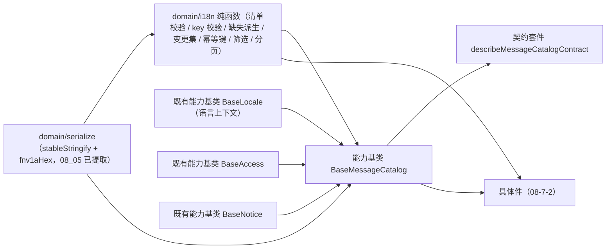

# 01 详细设计 · 文案目录编排基类与领域

> 前端组件库 · 08 交互类 · 07 国际化文案编辑器 · 嵌套子任务 01（需求 08-7）· 详细设计

[文档首页](../../../../../../../文档首页.md) › [08 交互类](../../../08_交互类.md) › [07 国际化文案编辑器](../../08_交互类_07_国际化文案编辑器.md) › 详细设计　|　[← 任务](../08_交互类_07_国际化文案编辑器_01_文案目录编排基类与领域.md)

## 1. 设计目标与范围 <a id="goal"></a>

交付[需求 08-7](../../../../../需求/08_需求_交互类.md#r08-7) 的**文案目录编排内核**：语言清单（code / name / rtl / status 增改启停与保护规则）、文案维护（`msg_key` × 各语言 value 编辑、增删 key）、筛选（模块前缀 / 关键词 / 缺失 / 仅已修改 / 语言聚焦）、批量保存（内容派生幂等键）、缓存主动失效与语言包重载、列内缺失派生与分页 / 虚拟滚动判定、导入导出参数装配；全部**真实生效**，数据通路由宿主注入。

- **领域入核心**：新增 `domain/i18n.ts`（语言清单归一与校验、`msg_key` 命名轻校验、缺失派生、变更集与脏基线、内容派生幂等键、筛选与分页、虚拟滚动阈值判定、错误码文案映射、导出参数），全部为框架无关纯函数。
- **编排入链**：新增能力基类 `BaseMessageCatalog`（能力键 `message-catalog`，依赖语言上下文 / 权限 / 提示），一层一语义、失败分支各自独立。
- **复用既有散列**：内容派生幂等键复用 `domain/serialize.ts` 的 `stableStringify` + `fnv1aHex`（`08_05` 已提取，本任务不重复实现）。
- **组合语言上下文**：语言聚焦经组合的 `BaseLocale`（`02_03`）承载，activeLocale 变更即写上下文 `setLocale`，与运行时语言切换同源。
- **数据通路注入式**：语言清单取数与增改启停、文案维护取数、批量保存、缓存失效、语言包重载的处理函数由宿主注入；**未注入即占位**（不发请求、返回 `undefined`、写占位文案），与 `08_01_02` 冻结的占位语义一致，真实接口联调随阶段八。
- **契约套件一套**：`describeMessageCatalogContract`（`@bms/core/testing`），端中立，后续移动端实现跑同一套断言。

### 1.1 口径与依从 <a id="positioning"></a>

- **架构铁律**：文案目录取数编排、批量保存、缓存失效与重载均为**横切功能**，一律落为**继承链上的能力基类**（核心 `capabilities/`），不在链外自由挂接；具体件只做渲染与投影。
- **继承链**：`BaseComponent`（组件根）→ 能力基类（`BaseMessageCatalog`）→ 具体件（`08-7-2`）。能力基类依赖单向登记于 `capabilities/manifest.ts`。
- **幂等键口径**（决策）：**内容派生**——`i18n:{fnv1aHex(stableStringify(变更集))}`；变更集含「更新行（key + 各语言 value，键序稳定）+ 删除 key 清单 + 语言清单变更」；同变更集同键、改一处换键、保存失败重试复用同键。
- **缺失口径**（决策）：**核心派生为主**——某语言该行 `value` 去空白后为空即缺失（含新增语言后未补齐的全列缺失）；同时取后端返回 `missing` 标记的**并集**；缺失筛选为**当前页本地筛选**，不额外请求。
- **缓存失效口径**（决策）：保存成功后依次调 `jobs.invalidateCache`（对应 `PUT /i18n/cache/invalidate`）与 `jobs.reloadMessages`（重载语言包并刷新上下文）；**失效失败仅提示、不阻断保存**（短 TTL 兜底）；重载成功递增语言包版本号 `messagesRevision`，件层与宿主据此刷新。
- **脏数据口径**（决策）：装载成功即按稳定序列化记基线；切页签 / 关闭页 / 切筛选前由件层二次确认；核心提供 `dirty` 与 `changeSet` 判定与 `resetDirty()` 撤销。
- **前端轻校验**：`msg_key` 命名（`模块.页面.字段`，≥2 段且段非空，44003）与单值长度上限（**按 Unicode 码点**计，中文与 emoji 均按 1 计，与后端 `len()` 同口径）由前端快速拦截，**后端强制**；模板列核对与行级校验归后端。
- **端范围**：**仅 PC**（`frontend/packages/ui-ep`）；移动端实现遗留（设计节点第 9 节明确移动端不提供文案维护），契约套件已就位。
- **工时**：本嵌套子任务 8h；因新增能力基类、领域纯函数与契约套件，实际上浮在实施记录登记。

## 2. 交付物清单 <a id="deliver"></a>

| # | 交付物 | 落点 |
| --- | --- | --- |
| 1 | 文案目录领域纯函数与数据模型 | `core/src/domain/i18n.ts` |
| 2 | 文案目录编排能力基类（新增） | `core/src/capabilities/message-catalog.ts` |
| 3 | 能力依赖登记（新增 `message-catalog` 键） | `core/src/capabilities/manifest.ts` |
| 4 | 核心导出面登记 | `core/src/index.ts` |
| 5 | 契约套件（文案目录编排） | `core/testing/message-catalog.ts` + `core/testing/index.ts`（再导出） |
| 6 | 核心用例（领域 + 能力基类） | `core/tests/domain-i18n.spec.ts`、`core/tests/message-catalog.spec.ts` |
| 7 | 登记回写（基类清单 / 组件设计 11 / 上游三处） | 见第 6 节 |



## 3. 接口 / 契约与边界 <a id="contract"></a>

### 3.1 核心：`domain/i18n.ts` 常量与数据模型 <a id="domain-model"></a>

```ts
/** 权限码。 */
export const I18N_PERM = 'i18n:manage'
/** 默认语言（不可停用）。 */
export const DEFAULT_LOCALE = 'zh-CN'
/** 单条文案值长度上限。 */
export const MESSAGE_VALUE_MAX = 4000
/** 文案网格每页行数（默认）。 */
export const MESSAGE_PAGE_SIZE = 50
/** 筛选态每页行数（宿主可加大）。 */
export const MESSAGE_FILTER_PAGE_SIZE = 200
/** 超过该行数切换虚拟滚动（决策：分页 + 虚拟滚动双路径）。 */
export const MESSAGE_VIRTUAL_THRESHOLD = 200
/** 占位与提示文案。 */
export const I18N_PLACEHOLDER_TEXT = '国际化文案未就绪（占位）'
export const I18N_SAVE_PLACEHOLDER_TEXT = '批量保存未就绪（占位）'
export const I18N_CACHE_PLACEHOLDER_TEXT = '缓存失效未就绪（占位）'
export const I18N_NO_CHANGE_TEXT = '无待保存变更'
export const I18N_MISSING_TEXT = '缺失'
export const I18N_EMPTY_TEXT = '暂无文案数据'
export const I18N_SAVE_DONE_TEXT = '保存成功，文案已即时生效'
export const I18N_SAVE_WARNING_TEXT = '保存成功，但语言包缓存失效未完成（将按短 TTL 兜底）'
/** 语言包导出文件名前缀与模板名。 */
export const I18N_EXPORT_PREFIX = '语言包'

/** 语言状态。 */
export type I18nLocaleStatus = 'enabled' | 'disabled'
/** 语言清单项（运行态，字段确定）。 */
export interface I18nLocaleItem {
  code: string
  name: string
  rtl: boolean
  status: I18nLocaleStatus
}
/** 语言清单装载输入（后端可省略字段）。 */
export interface I18nLocaleInput {
  code: string
  name?: string
  rtl?: boolean
  status?: I18nLocaleStatus
}
/** 文案行（运行态，`values` 覆盖全部语言键）。 */
export interface I18nMessageItem {
  key: string
  values: Record<string, string>
  /** 后端标记的缺失语言（与前端派生取并集）。 */
  missing: string[]
}
/** 文案行装载输入。 */
export interface I18nMessageInput {
  key: string
  values?: Record<string, string>
  missing?: string[]
}
/** 筛选条件。 */
export interface I18nFilter {
  /** 模块前缀（如 `user.form.`）。 */
  prefix: string
  /** 关键词（匹配 key 或任一语言 value）。 */
  keyword: string
  /** 只看存在缺失翻译的行。 */
  missingOnly: boolean
  /** 只看本次会话已修改的行。 */
  modifiedOnly: boolean
  /** 语言聚焦（非空时其他语言列隐藏 / 置灰）。 */
  locale: string
}
/** 分页视图。 */
export interface MessagePage<T> {
  rows: T[]
  page: number
  pageCount: number
  total: number
  truncated: boolean
}
/** 保存变更集（幂等键输入）。 */
export interface I18nChangeSet {
  upserts: { key: string; values: Record<string, string> }[]
  removedKeys: string[]
  locales: I18nLocaleItem[]
}
/** 校验结果（错误码 + 文案）。 */
export interface I18nCheckResult {
  valid: boolean
  code: number
  message: string
}
/** 错误码常量（《概要设计 · 国际化管理》44001 ~ 44005）。 */
export const I18N_ERRORS = {
  DUPLICATE_LOCALE: 44001,
  LOCALE_IN_USE: 44002,
  INVALID_KEY: 44003,
  LAST_LOCALE: 44004,
  DEFAULT_LOCALE: 44005,
} as const
```

### 3.2 核心：`domain/i18n.ts` 纯函数 <a id="domain-fns"></a>

| 函数 | 签名与语义 |
| --- | --- |
| `normalizeLocale` | `(input: I18nLocaleInput) => I18nLocaleItem`：缺省 `name = code`、`rtl = false`、`status = 'enabled'`（装载输入 → 运行态确定值） |
| `normalizeLocales` | `(input: readonly I18nLocaleInput[]) => I18nLocaleItem[]`：逐项归一，`code` 去空白 |
| `enabledLocales` | `(locales, includeDisabled = false) => I18nLocaleItem[]`：停用列置灰仍占位由件层据 `includeDisabled` 决定列集 |
| `validateLocaleAdd` | `(input: I18nLocaleInput, locales) => I18nCheckResult`：`code` 空 → 44001 文案「语言标识不可为空」；重复（大小写不敏感）→ 44001「语言标识已存在」 |
| `validateLocaleUpdate` | `(code, patch, locales) => I18nCheckResult`：目标存在性 + 停用规则（见 `validateLocaleToggle`） |
| `validateLocaleToggle` | `(code, enabled, locales) => I18nCheckResult`：停用时若为默认语言 → 44005；停用后无启用语言 → 44004 |
| `validateLocaleRemove` | `(code, locales, hasMessages: boolean) => I18nCheckResult`：有语言包数据 → 44002「该语言存在语言包数据，仅可停用」；默认语言 → 44005；仅剩一种 → 44004 |
| `normalizeMessageKey` | `(key: string) => string`：`trim` |
| `validateMessageKey` | `(key: string) => I18nCheckResult`：`模块.页面.字段` 至少 2 段、每段非空且不含空白 → 否则 44003 |
| `normalizeMessage` | `(input: I18nMessageInput, localeCodes?: readonly string[]) => I18nMessageItem`：`values` 补齐语言键（缺省空串）、去空白、非字符串回落空串；`missing` 归一为去重数组 |
| `normalizeMessages` | `(input: readonly I18nMessageInput[], localeCodes?) => I18nMessageItem[]` |
| `deriveMissingLocales` | `(values, locales, declared?: readonly string[]) => string[]`：前端派生（value 去空白为空）与后端标记**取并集**，按语言清单顺序输出 |
| `isMessageMissing` | `(row, code) => boolean`：`row.missing.includes(code)` |
| `filterMessages` | `(rows, filter, baseline?) => I18nMessageItem[]`：前缀 / 关键词（key 或任一 value 模糊、大小写不敏感）/ 缺失 / 仅已修改（与基线逐行比对）/ 语言聚焦（聚焦语言为空即缺失才算命中） |
| `diffMessages` | `(baseline, current) => I18nChangeSet`：逐行比对产出 upserts（仅变更行）/ removedKeys；键序稳定 |
| `isDirty` | `(baseline, current) => boolean`：变更集非空 |
| `resolveFilterParams` | `(filter) => Record<string, unknown>`：剔空后下发后端（`prefix` / `keyword` / `missing` / `locale` / `modified` 不入后端） |
| `isModifiedRow` | `(row, baselineRow?) => boolean`：基线无该行（新增）或值不同 |
| `paginateMessages` | `(rows, page, size) => MessagePage<I18nMessageItem>`：页码夹取，`truncated` 表示被展示上限截断 |
| `shouldVirtualize` | `(rowCount, threshold = MESSAGE_VIRTUAL_THRESHOLD) => boolean`：分页 + 虚拟滚动双路径判定 |
| `deriveMessageKey` | `(changeSet: I18nChangeSet) => string`：`i18n:{fnv1aHex(stableStringify(changeSet))}` |
| `resolveMessageErrorCode` | `(code: number) => string`：44001 ~ 44005 → 中文文案；其余回落 `error.{code}` 占位文本 |
| `messageExportFileName` | `(locale: string, timestamp: Date) => string`：`语言包[-{locale}]-{yyyyMMddHHmmss}.xlsx` |

- 全部为**纯函数**：不触 DOM、不发请求、不读全局；数值一律夹取（分页页码、值长）。
- 与 `08_05` 的对称性：`deriveImportKey` 用「业务 + 文件名 + 大小 + 时间」，本任务用「变更集稳定序列化」，同族做法。

### 3.3 核心：能力基类 `BaseMessageCatalog` <a id="capability"></a>

```ts
/** 文案目录阶段。 */
export type MessagePhase = 'idle' | 'loading' | 'saving' | 'invalidating' | 'done' | 'failed'

/** 语言清单变更请求（增 / 改 / 启停 / 删）。 */
export type LocaleChangeKind = 'add' | 'update' | 'toggle' | 'remove'
export interface LocaleChangeInput {
  kind: LocaleChangeKind
  locale: I18nLocaleInput
  /** 启停目标（`toggle` 用）。 */
  enabled?: boolean
}

/** 宿主注入的处理函数集（未注入的项按占位：不请求、不动作）。 */
export interface MessageJobs {
  /** 语言清单取数（含增改启停后的重取）。 */
  loadLocales?: () => Promise<readonly I18nLocaleInput[] | undefined>
  /** 语言清单变更提交（POST / PUT /i18n/locales）。 */
  saveLocale?: (input: LocaleChangeInput) => Promise<void>
  /** 文案维护列表取数（按筛选与分页）。 */
  loadMessages?: (input: {
    page: number
    size: number
    params: Record<string, unknown>
    localeCodes: readonly string[]
  }) => Promise<{ rows: readonly I18nMessageInput[]; total: number } | undefined>
  /** 批量保存（PUT /i18n/messages，`Idempotency-Key`）。 */
  save?: (input: {
    idempotencyKey: string
    upserts: readonly { key: string; values: Record<string, string> }[]
    removedKeys: readonly string[]
    locales: readonly I18nLocaleItem[]
  }) => Promise<void>
  /** 缓存主动失效（PUT /i18n/cache/invalidate）。 */
  invalidateCache?: () => Promise<void>
  /** 语言包重载（重新拉取 GET /i18n/messages 并注入运行时语言包）。 */
  reloadMessages?: () => Promise<void>
}

/** 保存结果。 */
export interface SaveResult {
  /** 幂等键（内容派生）。 */
  idempotencyKey: string
  /** 保存行数（更新 + 删除）。 */
  changed: number
  /** 缓存失效是否成功（失败不阻断保存）。 */
  cacheInvalidated: boolean
  /** 语言包是否已重载。 */
  reloaded: boolean
}

export abstract class BaseMessageCatalog extends BaseComponent {
  readonly identifier: string = 'message-catalog'
  override readonly depends = ['locale', 'access', 'notice']
  /** 后端路径段与中文名（导入导出复用）。 */
  biz = 'i18n'
  bizName = '语言包'
  /** 数据通路是否就绪（占位语义开关）。 */
  ready = false
  /** 实际发起的请求计数（占位期恒 0）。 */
  requestCount = 0
  /** 阶段。 */
  phase: MessagePhase = 'idle'
  /** 语言清单（运行态）。 */
  locales: I18nLocaleItem[] = []
  /** 默认语言（不可停用）。 */
  defaultLocale: string = DEFAULT_LOCALE
  /** 当前页文案行。 */
  messages: I18nMessageItem[] = []
  /** 总数。 */
  total = 0
  /** 当前页码。 */
  page = 1
  /** 每页行数。 */
  pageSize: number = MESSAGE_PAGE_SIZE
  /** 筛选条件。 */
  filter: I18nFilter = { prefix: '', keyword: '', missingOnly: false, modifiedOnly: false, locale: '' }
  /** 聚焦语言（与 `locale` 上下文同源）。 */
  activeLocale = ''
  /** 是否显示停用语言列（置灰仍占位）。 */
  showDisabledLocales = false
  /** 虚拟滚动阈值（超过即切虚拟滚动）。 */
  virtualThreshold: number = MESSAGE_VIRTUAL_THRESHOLD
  /** 语言包版本号（每次重载成功递增）。 */
  messagesRevision = 0
  /** 保存失败文案 / 校验失败文案。 */
  errorMessage = ''
  /** 最近一次错误码（0 表示无）。 */
  errorCode = 0
  /** 加载 / 保存基线（稳定序列化快照）。 */
  baseline: I18nMessageItem[] = []
  /** 宿主注入的处理函数集。 */
  jobs: MessageJobs = {}
  /** 语言上下文（组合；聚焦语言经其承载）。 */
  localeContext: BaseLocale | undefined
  /** 权限上下文（未注入不校验）。 */
  access: BaseAccess | undefined
  /** 提示通知（未注入不发通知）。 */
  notice: BaseNotice | undefined

  get degraded(): boolean
  get busy(): boolean            // phase 为 loading / saving / invalidating
  get dirty(): boolean           // isDirty(baseline, messages)
  get changeSet(): I18nChangeSet
  get idempotencyKey(): string   // deriveMessageKey(changeSet)（内容派生，重试天然同键）
  get canSave(): boolean         // ready ∧ !busy ∧ 有权 ∧ dirty
  get missingCodes(): string[]   // 启用语言中至少一行缺失的语言
  get virtualized(): boolean     // shouldVirtualize(messages.length, virtualThreshold)
  get pageCount(): number
  get exportParams(): Record<string, unknown>  // resolveFilterParams(filter)
  /** 列集（含停用语言与否）。 */
  get columns(): I18nLocaleItem[]

  setReady(value: boolean): void
  setJobs(jobs: MessageJobs): void
  setFilter(filter: Partial<I18nFilter>): void
  setActiveLocale(code: string): void          // 同步写 `localeContext.setLocale`
  setShowDisabledLocales(value: boolean): void
  setVirtualThreshold(value: number): void
  setPage(page: number): void
  setPageSize(size: number): void

  load(): Promise<boolean>                     // 清单 + 当前页文案；成功置基线
  reload(): Promise<boolean>                   // 保留筛选重取当前页
  editCell(input: { key: string; locale: string; value: string }): boolean
  addKey(input: { key: string; values?: Record<string, string> }): boolean
  removeKey(key: string): boolean
  addLocale(input: I18nLocaleInput): I18nCheckResult
  updateLocale(code: string, patch: I18nLocaleInput): I18nCheckResult
  toggleLocale(code: string, enabled: boolean): I18nCheckResult
  removeLocale(code: string): I18nCheckResult
  save(): Promise<SaveResult | undefined>
  retry(): Promise<SaveResult | undefined>      // 仅 failed 时按同幂等键重放
  invalidateCache(): Promise<boolean>
  reloadMessages(): Promise<boolean>
  resetDirty(): void                            // 撤销到基线
  reset(): void                                 // 整体复位（保留注入与语言清单）
  isAllowed(perm: string): boolean
}
```

**语义要点**：

| 项 | 口径 |
| --- | --- |
| 占位（`ready` 为假） | 降级 + 操作禁用 + `load()` / `save()` / `invalidateCache()` **零请求**；`requestCount` 恒 0 |
| 处理函数未注入 | 占位：不请求、返回 `undefined` / `false`、写占位文案；件层据 `degraded` / `canSave` 禁用入口 |
| 取数 | `load()`：清单 + 当前页文案（按 `resolveFilterParams` 与 `localeCodes`）；成功置 `baseline`（`dirty` 归假），失败 `phase = 'failed'` 保留旧数据 |
| 编辑 | `editCell` 仅改本地行并校验值长（> `MESSAGE_VALUE_MAX` 拒绝并写文案）；`addKey` 校验命名（44003）与重复；`removeKey` 移除本地行 |
| 语言清单 | 增改启停 / 删除在本地清单生效 → 校验（44001 / 44002 / 44004 / 44005）→ 调 `jobs.saveLocale`；成功重取清单（未注入取数则保留本地结果） |
| 保存 | `save()`：占位 / 未注入 / 无变更 / 有 key 校验失败 → 不请求；否则 `phase = 'saving'` + `requestCount += 1` + 内容派生幂等键提交；成功 `phase = 'done'`、重置基线、notice 成功提示、**随后**依次 `invalidateCache()` 与 `reloadMessages()`（失败仅提示不阻断，`phase` 保持 `done`） |
| 缓存失效 | 独立可调用；失败写 `I18N_CACHE_PLACEHOLDER_TEXT` / 失败文案 + notice warning，返回 `false` |
| 语言包重载 | 成功后 `messagesRevision += 1`；`activeLocale` 经 `localeContext.setLocale` 应用；失败写提示不阻断 |
| 脏数据 | `dirty` / `changeSet` 派生；`resetDirty()` 回到基线；切换拦截由件层二次确认 |
| 导出参数 | `exportParams` 由 `resolveFilterParams(filter)` 派生，件层交给导出触发件（`scope = 'filtered'`） |
| 权限 | `isAllowed(I18N_PERM)`（未注入权限上下文或权限码为空视为有权，后端兜底） |
| 纯数据 | 不触 DOM、不请求；状态变更经生命周期 `update` 通知 |

- 依赖登记：`message-catalog: ['locale', 'access', 'notice']`。
- 不含文案网格的渲染与分页控件语义（归件层）；不含导入导出的执行编排（件层装配 `08_05` 的导入导出件）；不含运行时语言包下发机制（归《架构设计 · 国际化》）。

### 3.4 契约套件 `describeMessageCatalogContract` <a id="testing"></a>

| 项 | 内容 |
| --- | --- |
| 契约面（结构化接口） | `ready` / `degraded` / `requestCount` / `phase` / `localeCount` / `rowCount` / `dirty` / `idempotencyKey` / `columns()` / `observable()`（当前页 `{ key, values }[]`）/ `setReady` / `setJobs` / `setFilter` / `setActiveLocale` / `setShowDisabledLocales` / `load` / `editCell` / `addKey` / `removeKey` / `addLocale` / `toggleLocale` / `removeLocale` / `save` / `retry` / `invalidateCache` / `reloadMessages` / `resetDirty` |
| 占位与就绪 | 未就绪：`degraded` 为真、`requestCount` 为 0、`load()` / `save()` / `invalidateCache()` 后仍为 0；`setReady(true)` 后可取数且 `degraded` 归假 |
| 取数 | `load()` 后清单与行数正确、`dirty` 归假、`phase = 'done'`；未注入取数不请求且不抛错 |
| 缺失派生 | 前端派生（空值）与后端标记取并集；新增语言后该语言全列缺失 |
| 编辑与脏态 | `editCell` 改值后 `dirty` 为真、变更集含该行；值超长拒绝且不改动；`resetDirty()` 后 `dirty` 归假 |
| 增删 key | `addKey` 非法命名拒绝（44003 文案）；重复 key 拒绝；`removeKey` 使变更集含 `removedKeys` |
| 语言清单规则 | 重复 code 拒绝（44001）；默认语言停用拒绝（44005）；停用至无启用语言拒绝（44004）；有数据删除拒绝（44002） |
| 幂等键 | 内容派生：同变更集同键；改一处换键；保存失败重试**同键** |
| 保存与缓存 | 保存成功 `phase = 'done'`、`dirty` 归假，并触发失效与重载；**失效失败**：保存仍成功、`cacheInvalidated` 为假、写提示；**重载成功**：`messagesRevision` 递增 |
| 导出与列集 | `showDisabledLocales` 切换影响 `columns()`；停用语言列仍在列集但标记状态 |

- **套件目标约定**：`locales` 为 `zh-CN`（默认，启用）/ `en-US`（启用）；首屏两行文案（`user.form.name` 完整、`user.form.email` 缺 `en-US`）；保存处理函数记录调用入参（幂等键 / 更新行 / 删除 key）供断言；失效与重载处理函数各自可注入「失败」变体。
- 套件同时被 `ui-ep`（投影适配）与后续移动端实现消费；本期无第二实现时由 `ui-ep` / `core` 用例驱动。

### 3.5 与件层的契约边界（归 `08-7-2`） <a id="bindings"></a>

本子任务只交付核心；`ui-ep` 侧投影（`useBaseMessageCatalog`）、四件组件（专题族 `components/i18n/`）、宿主机对页由 [08-7-2](../../08_交互类_07_国际化文案编辑器_02_文案目录组件与宿主核对页/08_交互类_07_国际化文案编辑器_02_文案目录组件与宿主核对页.md) 交付，**`08_01_02` 冻结的对外契约面不变**（仅向后兼容新增可选 Props 与事件）。

## 4. 失败分支与边界 <a id="edge"></a>

| 边界 / 失败场景 | 处置 |
| --- | --- |
| 数据通路未就绪（`ready` 为假） | 占位：降级 + 禁用 + 取数 / 保存 / 失效**零请求** |
| 处理函数未注入 | 占位：不请求、返回 `undefined` / `false`、写占位文案；件层据 `degraded` / `canSave` 禁用入口 |
| 语言 code 重复（含大小写差异） | `validateLocaleAdd` 拦截（44001）写文案，不提交、不改本地清单 |
| 语言 code 为空 / 非法 | 同上（44001 文案「语言标识不可为空」） |
| 停用默认语言 | 拒绝（44005），本地状态不变 |
| 停用后无任何启用语言 | 拒绝（44004），本地状态不变 |
| 删除有语言包数据的语言 | 拒绝（44002，仅可停用） |
| `msg_key` 命名非法（44003） | 前端轻校验拦截：新增拒绝、保存前整体校验失败即不请求并定位到该 key |
| `msg_key` 重复 | `addKey` 拒绝并写文案（同一 key 不允许重复行） |
| 文案值超长（> 4000 码点） | `editCell` 拒绝写值并写文案；长值展示省略 + 悬浮提示（件层） |
| 无待保存变更 | `save()` 写 `I18N_NO_CHANGE_TEXT` 提示且**零请求** |
| 保存失败（网络 / 服务错误） | `phase = 'failed'` + 文案；**保留本地变更**；`retry()` 复用同一幂等键 |
| 保存进行中重复提交 | `busy` 期间 `save()` 返回 `undefined`（件层同时禁用按钮） |
| 缓存失效失败 | **不阻断保存**：`cacheInvalidated` 为假、写提示与 notice warning、`phase` 保持 `done`（短 TTL 兜底） |
| 语言包重载失败 | 不阻断：`reloaded` 为假、写提示；`messagesRevision` 不变 |
| 后端省略字段（`name` / `rtl` / `status` / `values`） | `normalize*` 补齐确定值 / 空串，**运行态不出现 `undefined`** |
| 新增语言后未补齐文案 | 该语言全列派生缺失；缺失筛选可命中；保存前不阻塞（缺省回退默认语言，架构侧兜底） |
| 停用语言仍在网格占位 | 列置灰不可编辑（件层），`columns()` 仍含该项；删除前提示存在数据 |
| 行数超过虚拟滚动阈值 | `virtualized` 为真，件层切换虚拟滚动（复用 `04_01` 与核心 `computeVirtualRange`） |
| 页码越界 | `paginateMessages` 夹取到有效范围 |

## 5. 测试设计与验收映射 <a id="test"></a>

| 验收点（需求 08-7 / 子任务 08-7-1） | 用例 |
| --- | --- |
| 语言清单归一与校验（44001 / 44002 / 44004 / 44005） | `core/tests/domain-i18n.spec.ts` + 契约套件 |
| `msg_key` 命名轻校验与重复判定（44003） | 同上 |
| 缺失派生（前端 ∪ 后端标记）与语言聚焦语义 | 同上 |
| 筛选（前缀 / 关键词 / 缺失 / 仅已修改 / 语言聚焦）与筛选参数装配 | 同上 |
| 变更集、脏基线、内容派生幂等键（同变更同键 / 改一处换键） | 同上 |
| 分页夹取与虚拟滚动阈值判定 | 同上 |
| 错误码文案映射与导出文件名 | 同上 |
| 编排：占位零请求、取数与基线、编辑与增删 key、语言清单规则、保存链路 | `core/tests/message-catalog.spec.ts` + `describeMessageCatalogContract` |
| 缓存失效失败不阻断保存、重载成功递增版本号 | 同上（契约套件覆盖两种处理函数变体） |
| 能力登记对账（能力文件 ↔ manifest ↔ 基类清单） | `core/tests/guard-manifest.spec.ts`（自动覆盖新键） |
| `tsc`、ESLint、Vitest 全通过 | 根 `pnpm run check` |
| 文档链接与基座校验 | `check-links.py`、`check-base.py` |

- Kiwi 用例 1 条（一任务一条，编号于测试步登记后回填，预计 **773**；分类「平台骨架」、优先级 P2、状态 CONFIRMED、标签「自动化」）。

## 6. 登记落点 <a id="register"></a>

| 内容 | 落点 |
| --- | --- |
| 新增能力基类 `BaseMessageCatalog`（能力键 `message-catalog`，依赖 `locale` / `access` / `notice`） | 《[前端基类清单](../../../../../../../前端基类清单.md)》§2 继承链总览 + §5.2 能力基类表（父基类 `BaseComponent`，组件侧 · 能力基类，「已交付」）+ `capabilities/manifest.ts` |
| 领域纯函数与数据模型 `domain/i18n.ts` | 同上 §9「核心」（`domain/` 领域纯函数） |
| 契约套件一套 | 同上 §9（`core/testing/`：文案目录编排一套） |
| 设计口径回写 | 《组件设计》[11 国际化文案编辑器](../../../../../../../设计/组件设计/08_交互类/11_组件设计_国际化文案编辑器/11_组件设计_国际化文案编辑器.md)：继承链行改现行口径（组件根 → 能力基类 → 具体件）、第 5 节补「缺失派生与筛选口径」、第 7 节补「缓存失效失败降级与语言包重载」 |
| **上游三处回写（本次一并回写）** | ①《[概要设计 · 国际化管理](../../../../../../../设计/概要设计/29_概要设计_国际化管理.md)》（文案编辑器交互与批量保存 / 缓存失效口径）；②《[架构设计 · 国际化](../../../../../../../设计/架构设计/24_架构设计_子系统_国际化.md)》（前端本地二次缓存更新时机 / 缺失回退默认语言 / RTL 标记）；③《[架构设计 · 前端架构](../../../../../../../设计/架构设计/08_架构设计_前端架构.md)》（语言包维护页按需分包懒加载与运行时下发分离） |
| 任务 / 父任务 / 域任务 / 计划状态 | [任务](../08_交互类_07_国际化文案编辑器_01_文案目录编排基类与领域.md)、[父任务](../../08_交互类_07_国际化文案编辑器.md)、[域任务](../../../08_交互类.md)、[计划](../../../../../../../项目/04_前端组件库/计划/01_计划_前端组件库.md)（`08_07` 完成后由 §3 移入 §2，§4 甘特同步） |
| 需求文档 | 不承载进度（状态只在任务与计划两处一致）；遗留归口写在实施 / 测试记录与计划 |

## 7. 边界与开放项 <a id="open"></a>

- **不在本期**：真实接口联调（语言清单增改启停 / 文案维护取数 / 批量保存 / 缓存失效 / 语言包重载，随阶段八通用能力 · 国际化）；Excel 列头核对与行级校验（后端）；运行时语言包下发与浏览器二次缓存机制（《架构设计 · 国际化》）；移动端实现（契约套件已就位供复用）。
- **协同契约**：取数与保存处理函数由宿主注入（本任务不实现后端通路）；语言上下文由件层注入（`useBaseLocale`）；权限上下文与提示通知由宿主注入。
- **幂等键边界**：内容派生意味着「同一变更集重复提交」返回首次结果（件层提示「重复提交，返回首次结果」）；如需强制重放，需改变更集内容（再编辑或撤销后重改）。
- **缺失口径的取舍**：「前端派生 ∪ 后端标记」使新增语言后的未补齐列能被立即筛出；后端若给出更权威判定（如按默认语言回退），以后端为准并回写本设计。
- **虚拟滚动双路径的边界**：分页为主路径（与服务端分页天然一致）；虚拟滚动仅在宿主加大页长且行数超阈值时启用，件层负责切换与滚动容器（本任务只提供判定）。
- **上游回写**：本任务按决策一并回写三处上游文档；若后端口径（缓存失效路径、语言包重载返回结构）在阶段八与本次回写不一致，按「设计为准 → 偏差回写」纪律修订。
- Kiwi 用例编号于测试步登记后回填实施 / 测试记录与用例文件（预计 773）。

## 8. 决策记录 <a id="decision"></a>

| # | 决策项 | 结论 |
| --- | --- | --- |
| 1 | 任务粒度 | 父任务 08_07 拆两个嵌套子任务（本任务 8h / `08-7-2` 8h），Kiwi 两条（773 / 774） |
| 2 | 编排落点 | 新增能力基类 `BaseMessageCatalog`（键 `message-catalog`，依赖 `locale` / `access` / `notice`） |
| 3 | 领域文件 | 新增 `domain/i18n.ts`（语言清单 / key 校验 / 缺失 / 变更集 / 幂等键 / 筛选 / 分页 / 错误码 / 文件名） |
| 4 | 幂等键 | **内容派生**：`i18n:{fnv1aHex(stableStringify(变更集))}`；同变更集同键、改一处换键、重试复用 |
| 5 | 缓存失效与重载 | 保存成功后依次调失效与重载处理函数；**失效失败仅提示不阻断**；重载成功递增 `messagesRevision` 并应用聚焦语言上下文 |
| 6 | 缺失判定 | 前端派生（value 去空白为空）∪ 后端 `missing` 标记；缺失筛选为当前页本地筛选，不额外请求 |
| 7 | 语言清单交互 | 增改启停与删除的校验在核心（44001 / 44002 / 44004 / 44005），件层用弹窗表单 + 内联启停按钮 |
| 8 | 大数据渲染 | **分页为主 + 虚拟滚动为辅**（`shouldVirtualize` 按阈值判定），网格页长 50 / 筛选页长 200 |
| 9 | 停用语言列 | 置灰仍占位 + 「显示停用语言」开关（`columns()` 与 `showDisabledLocales`） |
| 10 | 导出范围 | 当前筛选条件的全部匹配 key（`filtered`），参数由 `resolveFilterParams` 派生 |
| 11 | 导入导出复用 | 复用 `08_05` 的三条能力基类与 `ImportErrorReport` 件，**由件层装配**（核心不组合，`depends` 不含导入导出键） |
| 12 | 脏数据 | 稳定序列化基线（`stableStringify`）；切页签 / 关闭页 / 切筛选由件层二次确认 |
| 13 | 常量边界 | 值长 4000（**Unicode 码点**，与后端 `len()` 同口径；原 2000 于 2026-09-19 随 `08_08` 统一上调） / 网格页长 50 / 筛选页长 200 / 虚拟滚动阈值 200；错误行展示上限复用 `08_05` 既有常量 1000 |
| 14 | 契约套件 | 一套 `describeMessageCatalogContract`，端中立，移动端复用 |
| 15 | 上游回写 | 本次一并回写三处（范围严格按《组件设计 11》§10.2 三条） |
| 16 | 开发态核对页 | 新建 `i18n-editor-check.html` + `src/dev/*`（十二项自检，归 `08-7-2`） |

## 9. 参考文档 <a id="ref"></a>

- [需求 08-7](../../../../../需求/08_需求_交互类.md#r08-7)、[任务 08-7-1](../08_交互类_07_国际化文案编辑器_01_文案目录编排基类与领域.md)、[父任务 07 国际化文案编辑器](../../08_交互类_07_国际化文案编辑器.md)
- 《组件设计》[11 国际化文案编辑器](../../../../../../../设计/组件设计/08_交互类/11_组件设计_国际化文案编辑器/11_组件设计_国际化文案编辑器.md)（含[可交互原型](../../../../../../../设计/组件设计/08_交互类/11_组件设计_国际化文案编辑器/11_原型设计_国际化文案编辑器.html)，原型即验收基准）
- 《概要设计》[国际化管理](../../../../../../../设计/概要设计/29_概要设计_国际化管理.md)、《架构设计》[国际化](../../../../../../../设计/架构设计/24_架构设计_子系统_国际化.md)、[接口与集成](../../../../../../../设计/架构设计/09_架构设计_接口与集成.md)、[前端架构](../../../../../../../设计/架构设计/08_架构设计_前端架构.md)
- [《前端基类清单》](../../../../../../../前端基类清单.md)、《[前端开发规范](../../../../../../../规范/前端开发规范.md)》、《[文档生成规范](../../../../../../../规范/文档生成规范.md)》
- [08_01_02 数据进出与表单占位](../../../08_交互类_01_占位版交付/08_交互类_01_占位版交付_02_数据进出与表单占位/08_交互类_01_占位版交付_02_数据进出与表单占位.md)（冻结对外契约与占位语义）
- [08_05_01 导入导出编排基类与领域](../../../08_交互类_05_导入导出/08_交互类_05_导入导出_01_导入导出编排基类与领域/08_交互类_05_导入导出_01_导入导出编排基类与领域.md)（内容派生幂等键、注入式数据通路与共享散列口径）

> 本文档依《[文档生成规范](../../../../../../../规范/文档生成规范.md)》编写
